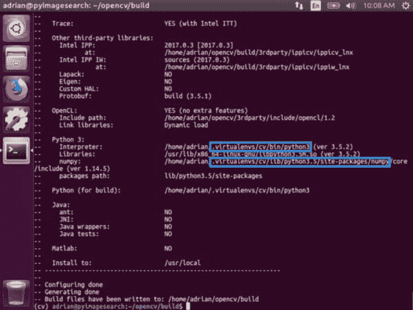
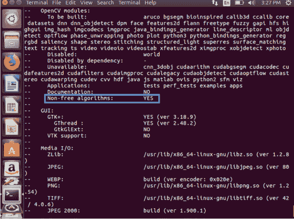
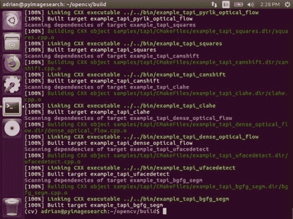
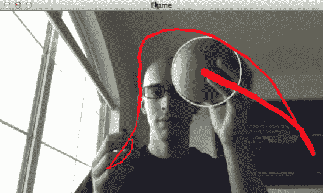

# 如何在 Ubuntu 上安装 OpenCV 4

> 原文：<https://pyimagesearch.com/2018/08/15/how-to-install-opencv-4-on-ubuntu/>


在本教程中，你将学习如何在你的 Ubuntu 系统上安装 OpenCV 4。

**OpenCV 4 已于 2018 年 11 月 20 日正式发布！**

那么，为什么要费心安装 OpenCV 4 呢？

你可能想考虑安装 OpenCV 4 以获得进一步的优化，C++11 支持，更紧凑的模块，以及对深度神经网络(DNN)模块的许多改进。

不要觉得需要立即升级——但是当你准备好切换到 OpenCV 4 时，一定要记住这些说明。

## 如何在 Ubuntu 上安装 OpenCV 4

在这篇博文中，我将带你完成在你的 Ubuntu 系统上安装 OpenCV 4 的六个步骤。

我还将介绍一些常见问题(FAQ ),如果遇到错误消息，这些问题将有助于您进行故障排除。我强烈建议你在提交评论之前阅读常见问题。

在我们开始之前，你可能有两个迫切的问题:

**1。OpenCV 4 应该用哪个版本的 Ubuntu OS？**

今天我将在 Ubuntu 18.04 上安装 OpenCV 4。我也用 Ubuntu 16.04 测试了这些指令。

如果你打算使用这台机器进行深度学习，我可能会建议你使用 Ubuntu 16.04，因为 GPU 驱动程序更成熟。如果你打算使用这台机器只是为了 OpenCV 和其他计算机视觉任务，Ubuntu 18.04 是非常好的。

**2。OpenCV 4 应该用 Python 2.7 还是 Python 3？**

Python 3 已经成为标准，我强烈推荐你在 OpenCV 4 中安装 Python 3。

也就是说，如果您有意识地选择使用 Python 2.7，您当然可以遵循这些说明，只是要确保您注意安装 Python 2.7 开发头文件和库，以及在创建虚拟环境时指定 Python 2.7。其他的都一样。如果你需要 Python 2.7 的指针，请参考下面的常见问题。

我们开始吧。

### 步骤 1:在 Ubuntu 上安装 OpenCV 4 依赖项

我将使用 Ubuntu 18.04 在我的机器上安装 OpenCV 4 和 Python 3 绑定。

要启动 OpenCV 4 安装程序，启动你的 Ubuntu 机器并打开一个终端。或者，您可以 SSH 到安装部分的框中。

从那里，让我们更新我们的系统:

```py
$ sudo apt-get update
$ sudo apt-get upgrade

```

然后安装开发人员工具:

```py
$ sudo apt-get install build-essential cmake unzip pkg-config

```

接下来，让我们安装一些图像和视频 I/O 库。

```py
$ sudo apt-get install libjpeg-dev libpng-dev libtiff-dev
$ sudo apt-get install libavcodec-dev libavformat-dev libswscale-dev libv4l-dev
$ sudo apt-get install libxvidcore-dev libx264-dev

```

这些库使我们能够从磁盘加载图像以及读取视频文件。

从那里，让我们为我们的 GUI 后端安装 GTK:

```py
$ sudo apt-get install libgtk-3-dev

```

然后安装两个包含 OpenCV 数学优化的包:

```py
$ sudo apt-get install libatlas-base-dev gfortran

```

最后，让我们安装 Python 3 开发头:

```py
$ sudo apt-get install python3-dev

```

一旦安装了所有这些先决条件，您就可以进入下一步。

### 步骤 2:下载 OpenCV 4

我们的下一步是下载 OpenCV。

让我们导航到我们的主文件夹，下载 opencv 和 T2 的 opencv_contrib。contrib repo 包含我们在 PyImageSearch 博客上经常使用的额外模块和函数。**你应该也在安装 OpenCV 库和附加的 contrib 模块。**

当你准备好了，就跟着下载`opencv`和`opencv_contrib`代码:

```py
$ cd ~
$ wget -O opencv.zip https://github.com/opencv/opencv/archive/4.0.0.zip
$ wget -O opencv_contrib.zip https://github.com/opencv/opencv_contrib/archive/4.0.0.zip

```

***更新 2018-11-26:**[OpenCV 4 . 0 . 0](https://opencv.org/opencv-4-0-0.html)****发布了，我更新了各自的`wget`网址。***

 **从那里，让我们解压缩档案:

```py
$ unzip opencv.zip
$ unzip opencv_contrib.zip

```

我也喜欢重命名目录:

```py
$ mv opencv-4.0.0 opencv
$ mv opencv_contrib-4.0.0 opencv_contrib

```

如果您跳过重命名目录，不要忘记更新 CMake 路径。

既然`opencv`和`opencv_contrib`已经下载并准备好了，让我们设置我们的环境。

### 步骤 3:为 OpenCV 4 配置 Python 3 虚拟环境

让我们安装 pip，一个 Python 包管理器。

要安装 pip，只需在终端中输入以下内容:

```py
$ wget https://bootstrap.pypa.io/get-pip.py
$ sudo python3 get-pip.py

```

#### 利用虚拟环境进行 Python 开发

Python 虚拟环境允许您单独处理 Python 项目。它们是 Python 开发的最佳实践。

例如，您可能有一个 Python + OpenCV 项目，它需要一个旧版本的 scikit-learn (v0.14)，但是您希望在所有新项目中继续使用最新版本的 scikit-learn (0.19)。

使用虚拟环境，您可以分别处理这两个软件版本的依赖关系，这是使用 Python 的系统安装*不可能做到的。*

如果你想了解更多关于 Python 虚拟环境的信息，看看这篇关于 RealPython 的[文章，或者阅读这篇关于 PyImageSearch](https://realpython.com/blog/python/python-virtual-environments-a-primer/) 的[博客文章的前半部分。](https://pyimagesearch.com/2016/05/02/accessing-rpi-gpio-and-gpio-zero-with-opencv-python/)

***注意:**我更喜欢通过`virtualenv`和`virtualenvwrapper`包来使用 Python 虚拟环境；但是，如果您更熟悉 conda 或 PyEnv，请随意使用它们并跳过这一部分。*

让我们继续安装`virtualenv`和`virtualenvwrapper` —这些包允许我们创建和管理 Python 虚拟环境:

```py
$ sudo pip install virtualenv virtualenvwrapper
$ sudo rm -rf ~/get-pip.py ~/.cache/pip

```

为了完成这些工具的安装，我们需要更新我们的`~/.bashrc`文件。

使用终端文本编辑器，如`vi` / `vim`或`nano`，将下列行添加到您的`~/.bashrc`中:

```py
# virtualenv and virtualenvwrapper
export WORKON_HOME=$HOME/.virtualenvs
export VIRTUALENVWRAPPER_PYTHON=/usr/bin/python3
source /usr/local/bin/virtualenvwrapper.sh

```

或者，您可以通过 bash 命令直接附加这些行:

```py
$ echo -e "\n# virtualenv and virtualenvwrapper" >> ~/.bashrc
$ echo "export WORKON_HOME=$HOME/.virtualenvs" >> ~/.bashrc
$ echo "export VIRTUALENVWRAPPER_PYTHON=/usr/bin/python3" >> ~/.bashrc
$ echo "source /usr/local/bin/virtualenvwrapper.sh" >> ~/.bashrc

```

接下来，获取`~/.bashrc`文件:

```py
$ source ~/.bashrc

```

#### 创建一个虚拟环境来存放 OpenCV 4 和其他包

现在我们可以创建 OpenCV 4 + Python 3 虚拟环境了:

```py
$ mkvirtualenv cv -p python3

```

这个命令简单地创建了一个名为`cv`的 Python 3 虚拟环境。

你可以(也应该)随心所欲地命名你的环境——我喜欢让它们简洁明了，同时提供足够的信息，以便我记住它们的用途。例如，我喜欢这样命名我的环境:

*   `py3cv4`
*   `py3cv3`
*   `py2cv2`
*   等等。

这里我的`py3cv4`虚拟环境可以用 Python 3 + OpenCV 4。我的`py3cv3`虚拟环境用的是 Python 3 和 OpenCV 3。我的`py2cv2`环境可以用来测试遗留的 Python 2.7 + OpenCV 2.4 代码。这些虚拟环境的名字很容易记住，并且允许我在 OpenCV + Python 版本之间无缝切换。

让我们通过使用`workon`命令来验证我们是否处于`cv`环境中:

```py
$ workon cv

```

[](https://pyimagesearch.com/wp-content/uploads/2018/06/install-opencv-ubuntu-virtualenv.png)

**Figure 1:** We use the `workon` command to activate our `cv` virtual environment on Ubuntu prior to installing NumPy and OpenCV 4.

#### 安装 NumPy

我们将安装的第一个包和唯一的 Python 先决条件是 NumPy:

```py
$ pip install numpy

```

我们现在可以准备 OpenCV 4 在我们的 Ubuntu 机器上进行编译。

### 步骤 4:为 Ubuntu 创建并编译 OpenCV 4

对于这一步，我们将使用 CMake 设置我们的编译，然后运行`make`来实际编译 OpenCV。这是今天博文最耗时的一步。

导航回 OpenCV repo 并创建+输入一个`build`目录:

```py
$ cd ~/opencv
$ mkdir build
$ cd build

```

#### 为 OpenCV 4 运行 CMake

现在让我们运行 CMake 来配置 OpenCV 4 版本:

```py
$ cmake -D CMAKE_BUILD_TYPE=RELEASE \
	-D CMAKE_INSTALL_PREFIX=/usr/local \
	-D INSTALL_PYTHON_EXAMPLES=ON \
	-D INSTALL_C_EXAMPLES=OFF \
	-D OPENCV_ENABLE_NONFREE=ON \
	-D OPENCV_EXTRA_MODULES_PATH=~/opencv_contrib/modules \
	-D PYTHON_EXECUTABLE=~/.virtualenvs/cv/bin/python \
	-D BUILD_EXAMPLES=ON ..

```

***更新 2018-11-26:** 注意`-D OPENCV_ENABLE_NONFREE=ON`旗。用 OpenCV 4 设置这个标志可以确保你可以访问 SIFT/SURF 和其他专利算法。*

**确保更新上面的命令，以便在您工作的虚拟环境中使用正确的`OPENCV_EXTRA_MODULES_PATH`和`PYTHON_EXECUTABLE`。**如果你使用的是*相同的*目录结构 Python 虚拟环境名称这些路径应该*而不是*需要更新。

一旦 CMake 完成，检查输出是很重要的。您的输出应该类似于下面的内容:

[](https://pyimagesearch.com/wp-content/uploads/2018/06/install-opencv-ubuntu-cmake.jpg)

**Figure 2:** It is critical to inspect your CMake output when installing OpenCV 4 on Ubuntu prior to kicking off the compile process.

现在花一点时间来确保`Interpreter`指向正确的 Python 3 二进制文件。还要检查`numpy`是否指向我们的 NumPy 包，该包安装在虚拟环境的*中。*

[](https://pyimagesearch.com/wp-content/uploads/2018/08/opencv4-ubuntu-nonfree.png)

**Figure 3:** Be sure to check the CMake output to ensure that the “Non-free algorithms” will be installed.

#### 编译 OpenCV 4

现在我们准备编译 OpenCV 4:

```py
$ make -j4

```

***注意:**在上面的`make`命令中，`-j4`参数指定我有 4 个内核进行编译。大多数系统都有 2、4 或 8 个内核。您应该更新该命令，以使用处理器上的内核数量来加快编译速度。如果您遇到编译失败，您可以通过跳过可选参数来尝试使用 1 个内核进行编译，以消除竞争情况。*

在这里，您可以看到 OpenCV 4 编译时没有任何错误:

[](https://pyimagesearch.com/wp-content/uploads/2018/06/install-opencv4-ubuntu-makecomplete.jpg)

**Figure 4:** When compiling OpenCV 4 for Ubuntu, once the `make` output reaches 100% we can move on.

接下来，让我们用另外两个命令安装 OpenCV 4:

```py
$ sudo make install
$ sudo ldconfig

```

### 步骤 5:将 OpenCV 4 链接到 Python 3 虚拟环境中

在我们创建一个符号链接将 OpenCV 4 链接到我们的 Python 虚拟环境之前，让我们确定一下我们的 Python 版本:

```py
$ workon cv
$ python --version
Python 3.5

```

使用 Python 版本，接下来我们可以很容易地导航到正确的`site-packages`目录(尽管我建议在终端中使用制表符补全)。

***更新 2018-12-20:** 以下路径已更新。以前版本的 OpenCV 在不同的位置(`/usr/local/lib/python3.5/site-packages`)安装了绑定，所以一定要仔细看看下面的路径。*

此时，OpenCV 的 Python 3 绑定应该位于以下文件夹中:

```py
$ ls /usr/local/python/cv2/python-3.5
cv2.cpython-35m-x86_64-linux-gnu.so

```

让我们简单地将它们重命名为`cv2.so`:

```py
$ cd /usr/local/python/cv2/python-3.5
$ sudo mv cv2.cpython-35m-x86_64-linux-gnu.so cv2.so

```

***Pro-tip:*** *如果您同时安装 OpenCV 3 和 OpenCV 4，而不是将文件重命名为`cv2.so`，您可以考虑将其命名为`cv2.opencv4.0.0.so`，然后在下一个子步骤中，将该文件适当地 sym-link 到`cv2.so`。*

我们的最后一个子步骤是将 OpenCV `cv2.so`绑定符号链接到我们的`cv`虚拟环境中:

```py
$ cd ~/.virtualenvs/cv/lib/python3.5/site-packages/
$ ln -s /usr/local/python/cv2/python-3.5/cv2.so cv2.so

```

### 步骤 6:在 Ubuntu 上测试 OpenCV 4 的安装

让我们做一个快速的健全性测试，看看 OpenCV 是否准备好了。

打开终端并执行以下操作:

```py
$ workon cv
$ python
>>> import cv2
>>> cv2.__version__
'4.0.0'
>>> quit()

```

第一个命令激活我们的虚拟环境。然后我们运行与环境相关的 Python 解释器。

***注意:**没有必要指定`python3`，因为 Python 3 是环境中唯一的 Python 可执行文件。*

如果你看到你已经安装了 4.0.0 版本，那么一个*“祝贺你！”*妥当。喝一大口你最喜欢的啤酒或波旁威士忌，让我们做一些比安装库和包更有趣的事情。

## 让我们用 OpenCV 4 执行视频中的对象跟踪

[](https://pyimagesearch.com/wp-content/uploads/2015/09/ball-tracking-animated-02.gif)

我知道您渴望用一个实际的例子来测试您的安装。追踪视频中的运动是一个有趣的小项目，可以让你在 Ubuntu 机器上使用 OpenCV 4。

要开始，滚动到这篇博文的 ***【下载】*** 部分下载源代码和示例视频。

从那里，在您的新虚拟环境中安装`imutils`库:

```py
$ workon cv
$ pip install imutils

```

然后导航到您存储 zip 文件的位置并将其解压缩。例如，您可以将其保存在`~/Downloads`中，然后执行以下步骤:

```py
$ cd ~/Downloads
$ unzip ball-tracking.zip
$ cd ball-tracking

```

现在我们准备开始我们的 OpenCV + Python 脚本。

您可以使用以下命令执行该脚本:

```py
$ python ball_tracking.py --video ball_tracking_example.mp4

```

准备好用你自己的球和网络摄像头试试了吗？命令如下:

```py
$ python ball_tracking.py

```

此时，你应该看清自己。将球放入框架中，并移动它以查看红色的跟踪轨迹！

要了解这个对象跟踪示例是如何工作的，请务必 [**参考这篇博文**](https://pyimagesearch.com/2015/09/14/ball-tracking-with-opencv/) 。

## 故障排除和常见问题

在 Ubuntu 上安装 OpenCV 4 遇到错误了吗？

先不要跳槽。您第一次安装 OpenCV 时，可能会非常沮丧，我最不希望您做的事情就是在此结束学习过程。

我列出了一些常见问题(FAQ ),建议您熟悉这些问题。

***Q.*** 我能用 Python 2.7 吗？

***A.*** Python 3 是我最近建议开发的，但我确实理解 Python 2.7 需要处理遗留代码。

从 Ubuntu 18.04 开始，Python 2.7 甚至不包括在内。如果你使用的是 Ubuntu 18.04(或更高版本)，你仍然可以在第一步的最后手动安装

```py
$ sudo apt-get install python2.7 python2.7-dev

```

从那里，当您在**步骤#3** 中创建您的虚拟环境时，首先安装 Python 2.7 的 pip:

```py
$ sudo python2.7 get-pip.py

```

然后(也是在**步骤#3** 中)当您创建虚拟环境时，只需使用相关的 Python 版本标志:

```py
$ mkvirtualenv cv -p python2.7

```

从那以后，一切都应该是一样的。

***Q.*** 为什么我不能直接 pip 安装 OpenCV 4？

***A.*** 根据您的操作系统和架构，OpenCV 有许多可安装 pip 的版本。您可能会遇到的问题是，它们可能是在没有各种优化和图像/视频 I/O 支持的情况下编译的。使用它们——但是使用它们要自担风险。本教程旨在让你在 Ubuntu 上完全*安装 OpenCV 4，同时让你完全控制编译。*

***Q.*** 为什么我不能直接 apt-get 安装 OpenCV？

**我会不惜一切代价避免这个*的“解决方案”，即使它*可能*有效。在您的系统上，您最终会得到一个旧的、过时的 OpenCV 版本。其次，apt-get 不适合虚拟环境，而且您无法控制编译和构建。***

 ******Q.*** 执行`mkvirtualenv`或`workon`时，遇到“命令未找到错误”。我该怎么办？

***A.*** 你会看到这个错误消息的原因有很多，都来自于**步骤#3:**

1.  首先，确保你已经使用`pip`软件包管理器正确安装了`virtualenv`和`virtualenvwrapper`。通过运行`pip freeze`进行验证，确保在已安装包列表中看到`virtualenv`和`virtualenvwrapper`。
2.  您的`~/.bashrc`文件可能有错误。查看您的`~/.bashrc`文件的内容，查看正确的`export`和`source`命令是否存在(检查**步骤#3** 中应该附加到`~/.bashrc`的命令)。
3.  你可能忘记了你的 T1。确保编辑完`source ~/.bashrc`后运行它，以确保你可以访问`mkvirtualenv`和`workon`命令。

***问*** 当我打开一个新的终端，注销或者重启我的 Ubuntu 系统时，我无法执行`mkvirtualenv`或者`workon`命令。

***A.*** 参考上一题的 **#2** 。

**问:我正在尝试使用一个专利算法，比如 SURF，但我看到了一个关于非免费选项的异常。如何使用专利算法？**

 *****A.*** 请务必参考**第 4 步** (CMake 命令)和**图 4** 这篇博文已经更新，以适应 OpenCV 开发人员所做的这一更改。

***Q.*** 当我尝试导入 OpenCV 时，遇到了这个消息:`Import Error: No module named cv2`。

**发生这种情况有几个原因，不幸的是，很难诊断。我推荐以下建议来帮助诊断和解决错误:**

 **1.  使用`workon cv`命令确保您的`cv`虚拟环境处于活动状态。如果这个命令给你一个错误，然后验证`virtualenv`和`virtualenvwrapper`是否正确安装。
2.  尝试在您的`cv`虚拟环境中研究`site-packages`目录的内容。根据您的 Python 版本，您可以在`~/.virtualenvs/cv/lib/python3.5/site-packages/`中找到`site-packages`目录。确保(1)在`site-packages`目录中有一个`cv2`目录，并且(2)它正确地用符号链接到一个有效的目录。
3.  务必分别检查位于`/usr/local/python/`的 Python 的系统安装的`site-packages`(甚至`dist-packages`)目录。理想情况下，您应该在那里有一个`cv2`目录。
4.  作为最后一招，检查 OpenCV 构建的`build/lib`目录。那里的*应该是那里的`cv2`目录(如果`cmake`和`make`都执行无误)。如果`cv2.so`文件不存在，*手动将它*复制到系统`site-packages`目录以及`cv`虚拟环境的`site-packages`目录中。*

## 摘要

今天我们学习了如何在 Ubuntu 上安装 OpenCV 4。

从源代码编译允许您完全控制安装过程，包括添加您可能希望使用的任何附加优化。

然后，我们用一个简单的球跟踪演示来测试这个装置。

你运行 macOS 吗？我将在周五带着 macOS + OpenCV 4 安装指南回来，敬请期待！

**如果你喜欢今天的安装教程和球跟踪演示，*请务必填写下面的表格*，这样当新的博客帖子发布时，你就会收到更新！***********