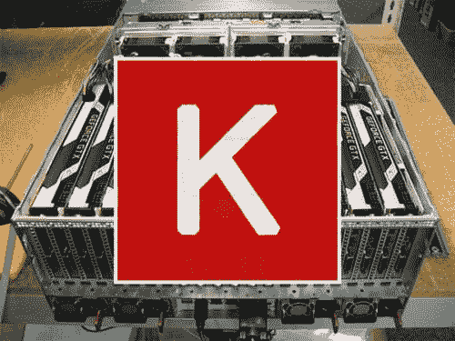
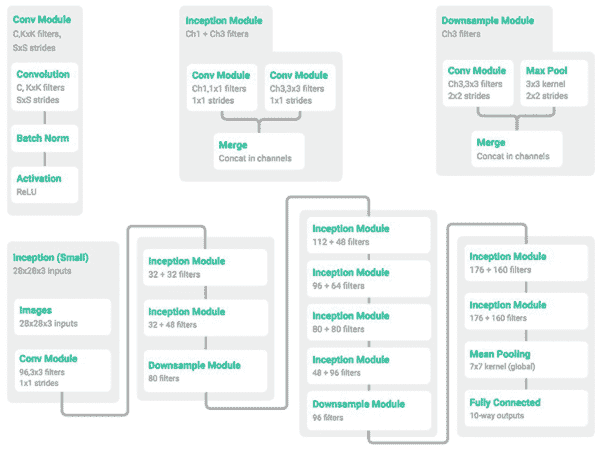
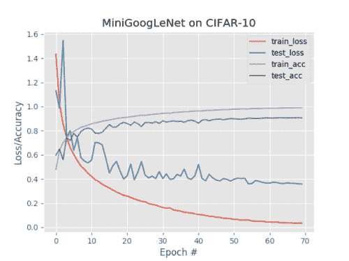
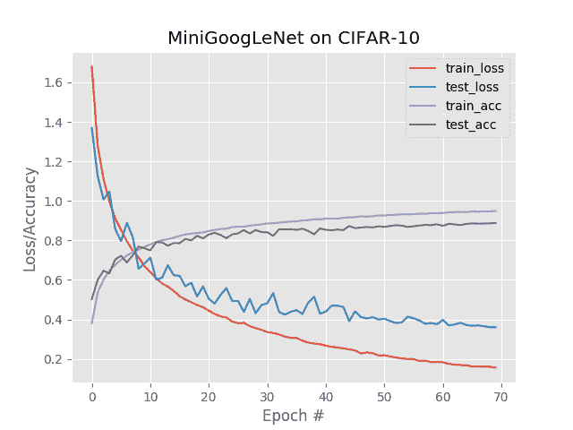

# 操作方法:使用 Keras、Python 和深度学习进行多 GPU 培训

> 原文：<https://pyimagesearch.com/2017/10/30/how-to-multi-gpu-training-with-keras-python-and-deep-learning/>

[](https://pyimagesearch.com/wp-content/uploads/2017/10/keras_multi_gpus_header.jpg)

Using Keras to train deep neural networks with multiple GPUs (Photo credit: Nor-Tech.com).

Keras 无疑是*我最喜欢的深度学习+ Python 框架，*尤其是用于图像分类的*。*

 *我在生产应用程序、个人深度学习项目和 PyImageSearch 博客中使用 Keras。

我甚至在 Keras 上用 Python 编写了超过三分之二的新书 [*《计算机视觉深度学习》。*](https://pyimagesearch.com/deep-learning-computer-vision-python-book/)

然而，我对 Keras 最大的障碍之一是执行多 GPU 训练是一件痛苦的事情。在样板代码和配置 TensorFlow 之间，这可能有点像一个过程…

***……但再也不是了。***

随着 Keras (v2.0.9)的最新提交和发布，现在使用 ***多个 GPU 训练深度神经网络*变得极其容易*。***

其实就像一个 ***单函数调用那么简单！***

**要了解更多关于使用 Keras、Python 和多个 GPU 训练深度神经网络的信息，*继续阅读*。**

## 操作方法:使用 Keras、Python 和深度学习进行多 GPU 培训

***2020-06-16 更新:**此博文现已兼容 TensorFlow 2+!Keras 现在内置在 TensorFlow 2 中，作为 TensorFlow 的高级 API。鉴于 TensorFlow/Keras 的更新，本简介部分中的句子可能会产生误导；出于历史目的，它们“按原样”保留。*

当我第一次开始使用 Keras 时，我爱上了这个 API。简单优雅，类似 scikit-learn。然而，它非常强大，能够实现和训练最先进的深度神经网络。

然而，我对 Keras 最大的不满之一是，在多 GPU 环境中使用它可能有点不简单。

如果你用的是 Theano，那就别想了——多 GPU 训练是不会发生的。

TensorFlow 是一种可能性，但它可能需要大量的样板代码和调整，才能让您的网络使用多个 GPU 进行训练。

当执行多 GPU 训练时，我更喜欢使用 mxnet 后端(或者甚至直接使用 mxnet 库)而不是 Keras，但是这引入了更多要处理的配置。

随着[Fran ois Chollet 宣布](https://twitter.com/fchollet/status/918205049225936896)使用 TensorFlow 后端的多 GPU 支持现已*纳入*到 **Keras v2.0.9** 中，这一切都改变了。大部分功劳归于 [@kuza55](https://github.com/kuza55) 和他们的 [keras-extras 回购](https://github.com/kuza55/keras-extras)。

我已经使用和测试这个多 GPU 功能将近一年了，我非常兴奋地看到它成为官方 Keras 发行版的一部分。

在今天博客的剩余部分，我将展示如何使用 Keras、Python 和深度学习来训练卷积神经网络进行图像分类。

### MiniGoogLeNet 深度学习架构

[](https://pyimagesearch.com/wp-content/uploads/2017/10/miniception_architecture.png)

**Figure 1:** The MiniGoogLeNet architecture is a small version of it’s bigger brother, GoogLeNet/Inception. Image credit to [@ericjang11](https://twitter.com/ericjang11) and [@pluskid](https://twitter.com/pluskid).

在上面的**图 1** 中，我们可以看到单独的卷积(*左*)、初始(*中*)和下采样(*右*)模块，随后是由这些构建块构建的整体 MiniGoogLeNet 架构(*底*)。我们将在本文后面的多 GPU 实验中使用 MiniGoogLeNet 架构。

MiniGoogLenet 中的 Inception 模块是由 [Szegedy 等人](https://arxiv.org/abs/1409.4842)设计的原始 Inception 模块的变体。

我第一次知道这个“Miniception”模块是在 [@ericjang11](https://twitter.com/ericjang11) 和 [@pluskid](https://twitter.com/pluskid) 的一条推文中，他们在那里漂亮地可视化了模块和相关的 MiniGoogLeNet 架构。

我做了一点研究，发现这个图形来自张等人 2017 年的发表， [*理解深度学习需要重新思考概括*](https://arxiv.org/abs/1611.03530) 。

然后我开始用 Keras + Python 实现 MiniGoogLeNet 架构——我甚至用 Python 把它作为计算机视觉的 [*深度学习的一部分。*](https://pyimagesearch.com/deep-learning-computer-vision-python-book/)

对 MiniGoogLeNet Keras 实现的全面回顾超出了这篇博文的范围，所以如果你对网络如何工作(以及如何编码)感兴趣，请参考[我的书](https://pyimagesearch.com/deep-learning-computer-vision-python-book/)。

否则，您可以使用本帖底部的 ***【下载】*** 部分下载源代码。

### 配置您的开发环境

要为本教程配置您的系统，我建议遵循我的 [*如何在 Ubuntu*](https://pyimagesearch.com/2019/12/09/how-to-install-tensorflow-2-0-on-ubuntu/) 上安装 TensorFlow 2.0 指南，其中有关于如何使用您的 GPU 驱动程序、CUDA 和 cuDNN 设置您的系统的说明。

此外，您将学习设置一个方便的 Python 虚拟环境来存放您的 Python 包，包括 TensorFlow 2+。

我不建议用 macOS 来配合 GPU 工作；如果需要*非* -GPU macOS TensorFlow 安装指南(今天的教程是*非*)请[点击此链接。](https://pyimagesearch.com/2019/12/09/how-to-install-tensorflow-2-0-on-macos/)

此外，请注意 [PyImageSearch 不推荐或支持 CV/DL 项目的窗口](https://pyimagesearch.com/faqs/single-faq/can-you-help-me-do-___-on-windows/)。

### 用 Keras 和多个 GPU 训练深度神经网络

让我们开始使用 Keras 和多个 GPU 来训练深度学习网络。

打开一个新文件，将其命名为`train.py`，并插入以下代码:

```py
# set the matplotlib backend so figures can be saved in the background
# (uncomment the lines below if you are using a headless server)
# import matplotlib
# matplotlib.use("Agg")

# import the necessary packages
from pyimagesearch.minigooglenet import MiniGoogLeNet
from sklearn.preprocessing import LabelBinarizer
from tensorflow.keras.preprocessing.image import ImageDataGenerator
from tensorflow.keras.callbacks import LearningRateScheduler
from tensorflow.compat.v2.keras.utils import multi_gpu_model
from tensorflow.keras.optimizers import SGD
from tensorflow.keras.datasets import cifar10
import matplotlib.pyplot as plt
import tensorflow as tf
import numpy as np
import argparse
```

如果您使用的是 headless 服务器，那么您需要通过取消注释来在第 3 行和第 4 行配置 matplotlib 后端。这将使您的 matplotlib 图保存到磁盘。如果你是*而不是*使用一个无头服务器(也就是说，你的键盘+鼠标+显示器被插入到你的系统中，你可以把这些行注释掉)。

从那里，我们导入这个脚本所需的包。

**第 7 行**从我的`pyimagesearch`模块导入 MiniGoogLeNet(包含在 ***“下载”*** 部分的下载中)。

另一个值得注意的导入是在第**行的第 13** 处，我们导入了 [CIFAR10 数据集](https://www.cs.toronto.edu/~kriz/cifar.html)。这个帮助器函数将使我们只需一行代码就能从磁盘加载 CIFAR-10 数据集。

现在让我们解析我们的命令行参数:

```py
# construct the argument parse and parse the arguments
ap = argparse.ArgumentParser()
ap.add_argument("-o", "--output", required=True,
	help="path to output plot")
ap.add_argument("-g", "--gpus", type=int, default=1,
	help="# of GPUs to use for training")
args = vars(ap.parse_args())

# grab the number of GPUs and store it in a conveience variable
G = args["gpus"]
```

我们使用`argparse`解析第 20-25 行上的一个*必需*和一个*可选*参数:

*   `--output`:训练完成后输出图的路径。
*   `--gpus`:用于训练的 GPU 数量。

在加载了[命令行参数](https://pyimagesearch.com/2018/03/12/python-argparse-command-line-arguments/)之后，为了方便起见，我们将 GPU 的数量存储为`G`(**第 28 行**)。

从那里，我们初始化两个用于配置我们的训练过程的重要变量，然后定义一个基于多项式的学习率时间表函数:

```py
# definine the total number of epochs to train for along with the
# initial learning rate
NUM_EPOCHS = 70
INIT_LR = 5e-3

def poly_decay(epoch):
	# initialize the maximum number of epochs, base learning rate,
	# and power of the polynomial
	maxEpochs = NUM_EPOCHS
	baseLR = INIT_LR
	power = 1.0

	# compute the new learning rate based on polynomial decay
	alpha = baseLR * (1 - (epoch / float(maxEpochs))) ** power

	# return the new learning rate
	return alpha
```

我们设置`NUM_EPOCHS = 70` —这是我们的训练数据将通过网络的次数(时期)(**行 32** )。

我们还初始化了学习速率`INIT_LR = 5e-3`，这是在之前的试验中通过实验发现的值(**第 33 行**)。

从那里，我们定义了`poly_decay`函数，它相当于 Caffe 的多项式学习率衰减(**第 35-46 行**)。本质上，这个函数在训练期间更新学习率，在每个时期之后有效地降低它。设置`power = 1.0`将衰减从 ***多项式*** 变为 ***线性*** 。

接下来，我们将加载我们的训练+测试数据，并将图像数据从整数转换为浮点:

```py
# load the training and testing data, converting the images from
# integers to floats
print("[INFO] loading CIFAR-10 data...")
((trainX, trainY), (testX, testY)) = cifar10.load_data()
trainX = trainX.astype("float")
testX = testX.astype("float")
```

从那里，我们将[均值减法](http://ufldl.stanford.edu/wiki/index.php/Data_Preprocessing#Per-example_mean_subtraction)应用于数据:

```py
# apply mean subtraction to the data
mean = np.mean(trainX, axis=0)
trainX -= mean
testX -= mean

```

在第**行第 56** 处，我们计算所有训练图像的平均值，然后是第**行第 57 和 58** 处，我们从训练和测试集中的每幅图像中减去平均值。

然后，我们执行“一键编码”，这是一种我在书中详细讨论的编码方案:

```py
# convert the labels from integers to vectors
lb = LabelBinarizer()
trainY = lb.fit_transform(trainY)
testY = lb.transform(testY)
```

一键编码将分类标签从单个整数转换为向量，因此我们可以应用分类交叉熵损失函数。我们已经在第 61-63 行中解决了这个问题。

接下来，我们创建一个数据增强器和一组回调函数:

```py
# construct the image generator for data augmentation and construct
# the set of callbacks
aug = ImageDataGenerator(width_shift_range=0.1,
	height_shift_range=0.1, horizontal_flip=True,
	fill_mode="nearest")
callbacks = [LearningRateScheduler(poly_decay)]

```

在第**行第 67-69** 行，我们构建了用于数据扩充的图像生成器。

数据增强在 [*的*从业者捆绑包*中有详细介绍，使用 Python*](https://pyimagesearch.com/deep-learning-computer-vision-python-book/) 进行计算机视觉深度学习；然而，暂时理解它是在训练过程中使用的一种方法，其中我们通过对训练图像应用随机变换来随机改变它们。

由于这些变化，网络会不断看到增加的示例-这使网络能够更好地概括验证数据，而在训练集上的表现可能会更差。在大多数情况下，这种权衡是值得的。

我们在第 70 行的**上创建了一个回调函数，它将允许我们的学习率在每个时期后衰减——注意我们的函数名，`poly_decay`。**

接下来让我们检查 GPU 变量:

```py
# check to see if we are compiling using just a single GPU
if G <= 1:
	print("[INFO] training with 1 GPU...")
	model = MiniGoogLeNet.build(width=32, height=32, depth=3,
		classes=10)

```

如果 GPU 计数小于或等于 1，我们通过`.build`函数(**第 73-76 行**)初始化`model`，否则我们将在训练期间并行化模型:

```py
# otherwise, we are compiling using multiple GPUs
else:
	# disable eager execution
	tf.compat.v1.disable_eager_execution()
	print("[INFO] training with {} GPUs...".format(G))

	# we'll store a copy of the model on *every* GPU and then combine
	# the results from the gradient updates on the CPU
	with tf.device("/cpu:0"):
		# initialize the model
		model = MiniGoogLeNet.build(width=32, height=32, depth=3,
			classes=10)

	# make the model parallel
	model = multi_gpu_model(model, gpus=G)

```

在 Keras 中创建一个多 GPU 模型需要一些额外的代码，但并不多！

首先，你会注意到在第 86 行的**处，我们已经指定使用 *CPU* (而不是 *GPU* )作为网络上下文。**

为什么我们需要中央处理器？

嗯，CPU 负责处理任何开销(例如将训练图像移入和移出 GPU 内存)，而 GPU 本身则负责繁重的工作。

在这种情况下，CPU 实例化基础模型。

然后我们可以调用 92 号线上的**的`multi_gpu_model`。这个函数将模型从 CPU 复制到我们所有的 GPU，从而获得单机、多 GPU 的数据并行性。**

训练时，我们的网络图像将被批量分配给每个 GPU。CPU 将从每个 GPU 获取梯度，然后执行梯度更新步骤。

然后，我们可以编译我们的模型，并开始培训过程:

```py
# initialize the optimizer and model
print("[INFO] compiling model...")
opt = SGD(lr=INIT_LR, momentum=0.9)
model.compile(loss="categorical_crossentropy", optimizer=opt,
	metrics=["accuracy"])

# train the network
print("[INFO] training network...")
H = model.fit(
	x=aug.flow(trainX, trainY, batch_size=64 * G),
	validation_data=(testX, testY),
	steps_per_epoch=len(trainX) // (64 * G),
	epochs=NUM_EPOCHS,
	callbacks=callbacks, verbose=2)
```

***2020-06-16 更新:*** *以前，TensorFlow/Keras 需要使用一种叫做`.fit_generator`的方法来完成数据扩充。现在，`.fit`方法也可以处理数据扩充，使代码更加一致。这也适用于从`.predict_generator`到`.predict`的迁移。请务必查看我关于 [fit 和 fit_generator](https://pyimagesearch.com/2018/12/24/how-to-use-keras-fit-and-fit_generator-a-hands-on-tutorial/) 以及[数据扩充](https://pyimagesearch.com/2019/07/08/keras-imagedatagenerator-and-data-augmentation/)的文章。*

在第 96 行**上，我们用我们的初始学习率构建了一个随机梯度下降(SGD)优化器。**

随后，我们用 SGD 优化器和分类交叉熵损失函数编译该模型。

我们现在准备好训练网络了！

为了启动训练过程，我们调用`model.fit`并提供必要的参数。

我们希望每个 GPU 的批量大小为*64，以便由`batch_size=64 * G`指定。*

我们的训练将持续 70 个纪元(这是我们之前指定的)。

梯度更新的结果将在 CPU 上合并，然后在整个训练过程中应用到每个 GPU。

现在，培训和测试已经完成，让我们绘制损失/准确性，以便我们可以可视化培训过程:

```py
# grab the history object dictionary
H = H.history

# plot the training loss and accuracy
N = np.arange(0, len(H["loss"]))
plt.style.use("ggplot")
plt.figure()
plt.plot(N, H["loss"], label="train_loss")
plt.plot(N, H["val_loss"], label="test_loss")
plt.plot(N, H["accuracy"], label="train_acc")
plt.plot(N, H["val_accuracy"], label="test_acc")
plt.title("MiniGoogLeNet on CIFAR-10")
plt.xlabel("Epoch #")
plt.ylabel("Loss/Accuracy")
plt.legend()

# save the figure
plt.savefig(args["output"])
plt.close()
```

***2020-06-16 更新:*** *为了使这个绘图片段与 TensorFlow 2+兼容，更新了`H.history`字典键，以完全拼出“acc”而没有“ACC”(即`H["val_accuracy"]`和`H["accuracy"]`)。“val”没有拼成“validation”，这有点令人困惑；我们必须学会热爱 API 并与之共存，并永远记住这是一项正在进行的工作，世界各地的许多开发人员都为此做出了贡献。*

这最后一个块简单地使用 matplotlib 来绘制训练/测试损失和准确性(**行 110-123** )，然后将数字保存到磁盘(**行 126** )。

如果你想更多地了解训练过程(及其内部工作方式)，请参考 *[用 Python 进行计算机视觉的深度学习](https://pyimagesearch.com/deep-learning-computer-vision-python-book/)。*

### Keras 多 GPU 结果

让我们检查一下我们努力工作的结果。

首先，使用本文底部的 ***“下载”*** 部分获取本课的代码。然后你就可以跟踪结果了

让我们在一个*单 GPU* 上训练以获得基线:

```py
$ python train.py --output single_gpu.png
[INFO] loading CIFAR-10 data...
[INFO] training with 1 GPU...
[INFO] compiling model...
[INFO] training network...
Epoch 1/70
 - 64s - loss: 1.4323 - accuracy: 0.4787 - val_loss: 1.1319 - val_ accuracy: 0.5983
Epoch 2/70
 - 63s - loss: 1.0279 - accuracy: 0.6361 - val_loss: 0.9844 - accuracy: 0.6472
Epoch 3/70
 - 63s - loss: 0.8554 - accuracy: 0.6997 - val_loss: 1.5473 - accuracy: 0.5592
...
Epoch 68/70
 - 63s - loss: 0.0343 - accuracy: 0.9898 - val_loss: 0.3637 - accuracy: 0.9069
Epoch 69/70
 - 63s - loss: 0.0348 - accuracy: 0.9898 - val_loss: 0.3593 - accuracy: 0.9080
Epoch 70/70
 - 63s - loss: 0.0340 - accuracy: 0.9900 - val_loss: 0.3583 - accuracy: 0.9065
Using TensorFlow backend.

real    74m10.603s
user    131m24.035s
sys     11m52.143s

```

[](https://pyimagesearch.com/wp-content/uploads/2017/10/keras_single_gpu.png)

**Figure 2:** Experimental results from training and testing MiniGoogLeNet network architecture on CIFAR-10 using Keras on a single GPU.

对于这个实验，我在我的 NVIDIA DevBox 上的一个 Titan X GPU 上进行训练。每个历元花费 **~63 秒**，总训练时间 **74m10s** 。

然后，我执行以下命令，用我的四个 Titan X GPU***:***

```py
$ python train.py --output multi_gpu.png --gpus 4
[INFO] loading CIFAR-10 data...
[INFO] training with 4 GPUs...
[INFO] compiling model...
[INFO] training network...
Epoch 1/70
 - 21s - loss: 1.6793 - accuracy: 0.3793 - val_loss: 1.3692 - accuracy: 0.5026
Epoch 2/70
 - 16s - loss: 1.2814 - accuracy: 0.5356 - val_loss: 1.1252 - accuracy: 0.5998
Epoch 3/70
 - 16s - loss: 1.1109 - accuracy: 0.6019 - val_loss: 1.0074 - accuracy: 0.6465
...
Epoch 68/70
 - 16s - loss: 0.1615 - accuracy: 0.9469 - val_loss: 0.3654 - accuracy: 0.8852
Epoch 69/70
 - 16s - loss: 0.1605 - accuracy: 0.9466 - val_loss: 0.3604 - accuracy: 0.8863
Epoch 70/70
 - 16s - loss: 0.1569 - accuracy: 0.9487 - val_loss: 0.3603 - accuracy: 0.8877
Using TensorFlow backend.

real    19m3.318s
user    104m3.270s
sys     7m48.890s

```

[](https://pyimagesearch.com/wp-content/uploads/2017/10/keras_multi_gpu.png)

**Figure 3:** Multi-GPU training results (4 Titan X GPUs) using Keras and MiniGoogLeNet on the CIFAR10 dataset. Training results are similar to the single GPU experiment while training time was cut by ~75%.

在这里你可以看到训练中的准线性加速:使用四个 GPU，我能够将每个纪元减少到只有 **16 秒**。全网在 **19m3s 完成训练。**

正如你所看到的，用 Keras 和多个 GPU 训练深度神经网络不仅简单，而且*效率也很高*！

***注:**在这种情况下，单 GPU 实验获得的精度略高于多 GPU 实验。在训练任何一个随机机器学习模型的时候，都会有一些方差。如果你在数百次运行中平均这些结果，它们将是(大致)相同的。*

## 摘要

在今天的博客文章中，我们学习了如何使用多个 GPU 来训练基于 Keras 的深度神经网络。

使用多个 GPU 使我们能够获得准线性加速。

为了验证这一点，我们在 CIFAR-10 数据集上训练了 MiniGoogLeNet。

使用单个 GPU，我们能够获得 **63 秒的时间**，总训练时间 **74m10s** 。

然而，通过使用 Keras 和 Python 进行多 GPU 训练，我们将训练时间减少到了 **16 秒**，总训练时间为 **19m3s** 。

使用 Keras 启用多 GPU 训练就像一个函数调用一样简单——我建议您尽可能利用多 GPU 训练。在未来，我认为`multi_gpu_model`将会发展，并允许我们进一步定制*，特别是*应该使用哪些 GPU 进行训练，最终也可以实现*多系统*训练。

### 准备好深入学习了吗？跟着我。

如果你有兴趣了解更多关于深度学习的知识(以及在多个 GPU 上训练最先进的神经网络)，一定要看看我的新书， [*用 Python 进行计算机视觉的深度学习*](https://pyimagesearch.com/deep-learning-computer-vision-python-book/) 。

无论你是刚刚开始深度学习，还是已经是经验丰富的深度学习实践者，我的新书都保证能帮助你达到专家的地位。

**要了解更多关于使用 Python 进行计算机视觉深度学习的*(并获取您的副本) [*请点击此处*。](https://pyimagesearch.com/deep-learning-computer-vision-python-book/)****