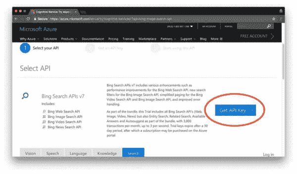
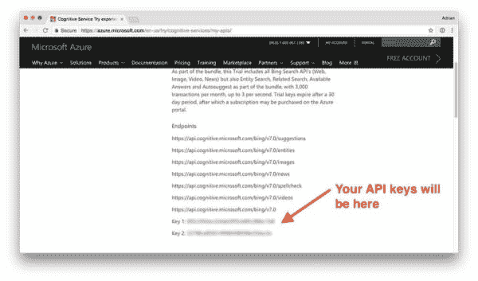
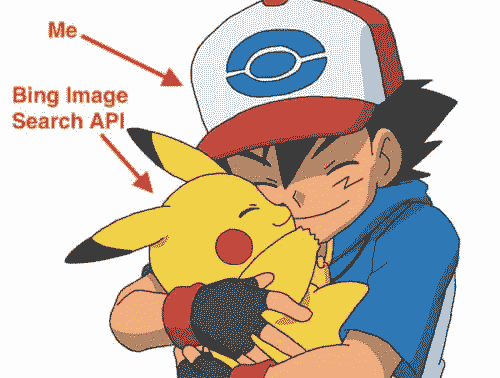
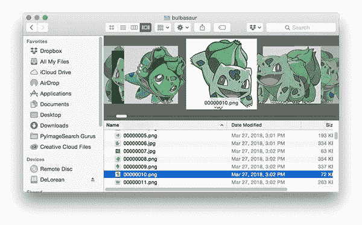

# 如何(快速)构建深度学习图像数据集

> 原文：<https://pyimagesearch.com/2018/04/09/how-to-quickly-build-a-deep-learning-image-dataset/>

[](https://pyimagesearch.com/wp-content/uploads/2018/04/deep_learning_dataset_header.png)

An example of a Pokedex (thank you to [Game Trader USA](https://gametradersusa.com/digital-pokedex/) for the Pokedex template!)

当我还是个孩子的时候，我是一个超级口袋妖怪迷。我收集了交易卡，玩了游戏机，看了电视节目。如果它涉及口袋妖怪，我可能会对它感兴趣。

口袋妖怪给我留下了持久的印象——回想起来，口袋妖怪甚至启发了我学习计算机视觉。

你看，在该剧的第一集(以及游戏的前几分钟)，主角小智得到了一种叫做 *Pokedex* 的特殊电子设备。

一个口袋妖怪索引被用来记录和提供关于口袋妖怪在旅行中遇到灰烬的种类的信息。你可以把 Pokedex 看作是某种“口袋妖怪百科全书”。

当偶然发现一种以前从未见过的新物种口袋妖怪 Ash 时，他会把 Pokedex 举到口袋妖怪面前，然后 Pokedex 会自动为他识别它，大概是通过某种相机传感器(类似于本文顶部的图像)。

从本质上来说，Pokedex 就像一个利用计算机视觉的智能手机应用程序！

我们可以想象今天在我们的 iPhone 或 Android 上有一个类似的应用程序，其中:

1.  我们打开手机上的“Pokedex”应用程序
2.  该应用程序访问我们的摄像头
3.  我们拍了一张口袋妖怪的照片
4.  然后应用程序会自动识别口袋妖怪

小时候，我一直觉得 Pokedex 很酷…

***……现在我要造一个。***

在这个由三部分组成的博客文章系列中，我们将建立我们自己的 Pokedex:

1.  我们今天将开始使用 Bing 图像搜索 API 来(轻松地)构建我们的口袋妖怪图像数据集。
2.  下周，我将演示如何使用 Keras 实现和训练 CNN 来识别每个口袋妖怪。
3.  最后，我们将使用我们训练过的 Keras 模型，并将其部署到一个 iPhone 应用程序中(或者至少是一个 Raspberry Pi——我仍在解决 iPhone 部署中的问题)。

到这个系列的最后，我们将会有一个功能齐全的 Pokedex！

**要开始使用 Bing 图像搜索 API 建立用于深度学习的图像数据集，*继续阅读。***

## 如何(快速)构建深度学习图像数据集

为了建立我们的深度学习图像数据集，我们将利用微软的 [Bing 图像搜索 API](https://azure.microsoft.com/en-us/services/cognitive-services/bing-image-search-api/) ，它是微软[认知服务](https://azure.microsoft.com/en-us/services/cognitive-services/)的一部分，用于将人工智能引入视觉、语音、文本以及更多应用和软件。

在之前的一篇博文中，你会记得我演示了如何[抓取谷歌图片](https://pyimagesearch.com/2017/12/04/how-to-create-a-deep-learning-dataset-using-google-images/)来构建你自己的数据集——这里的问题是这是一个繁琐的手动过程。

相反，我在寻找一种解决方案，它能让我通过查询以编程方式下载图片。

我*不想*打开我的浏览器或利用浏览器扩展从我的搜索中下载图像文件。

许多年前，谷歌弃用了自己的图片搜索 API(这也是我们首先需要抓取谷歌图片的原因)。

几个月前，我决定试试微软的 Bing 图像搜索 API。我非常高兴。

结果是相关的，API 是易于使用的。

它还包括一个 30 天的免费试用期，之后这个 API 的价格似乎还算合理(我还没有变成付费用户，但如果有愉快的体验，我可能会的)。

在今天博客的剩余部分，我将展示我们如何利用 Bing 图像搜索 API 来快速构建适合深度学习的图像数据集。

### 创建您的认知服务帐户

在这一节中，我将提供一个简短的演示，介绍如何获得你的(免费)Bing 图片搜索 API 帐户。

实际的注册过程很简单；然而，找到启动注册过程的实际页面有点令人困惑——这是我对该服务的主要评论。

首先，请访问 [Bing 图片搜索 API](https://azure.microsoft.com/en-us/try/cognitive-services/?api=bing-image-search-api) 页面:

[](https://pyimagesearch.com/wp-content/uploads/2018/04/deep_learning_dataset_get_api_key.jpg)

**Figure 1:** We can use the Microsoft Bing Search API to download images for a deep learning dataset.

正如我们从截图中看到的那样，该试验包括 Bing 的所有搜索 API，每月共有 3，000 次交易——这将足够用于构建我们的第一个基于图像的深度学习数据集。

要注册 Bing 图像搜索 API，请点击*“获取 API 密钥”*按钮。

在那里，你可以用你的微软、脸书、LinkedIn 或 GitHub 账户注册(为了简单起见，我用了 GitHub)。

完成注册过程后，您将进入[您的 API 页面](https://azure.microsoft.com/en-us/try/cognitive-services/my-apis/)，该页面应类似于下面的我的浏览器:

[](https://pyimagesearch.com/wp-content/uploads/2018/04/deep_learning_dataset_api_keys.jpg)

**Figure 2:** The Microsoft Bing API endpoints along with my API keys which I need in order to use the API.

在这里你可以看到我的 Bing 搜索端点列表，包括我的两个 API 键(由于明显的原因被模糊了)。

记下您的 API 密钥，因为您将在下一节用到它。

### 用 Python 构建深度学习数据集

现在我们已经注册了 Bing 图像搜索 API，我们已经准备好建立我们的深度学习数据集。

#### 阅读文件

在继续之前，我建议您在浏览器中打开以下两个 Bing 图像搜索 API 文档页面:

*   [Bing 图像搜索 API–Python 快速入门](https://docs.microsoft.com/en-us/azure/cognitive-services/bing-image-search/quickstarts/python)
*   [Bing 图片搜索 API–分页网页](https://docs.microsoft.com/en-us/azure/cognitive-services/bing-web-search/paging-webpages)

如果你对(1)API 如何工作或者(2)我们在发出搜索请求后如何使用 API 有任何疑问，你应该参考这两个页面。

#### 安装`requests`包

如果您的系统上尚未安装`requests`，您可以通过以下方式安装:

```py
$ pip install requests

```

`requests`包让我们可以非常轻松地发出 HTTP 请求，而不会陷入与 Python 的斗争中，无法优雅地处理请求。

此外，如果您正在使用 Python 虚拟环境，请确保在安装`requests`之前使用`workon`命令访问环境:

```py
$ workon your_env_name
$ pip install requests

```

#### 创建 Python 脚本来下载图像

让我们开始编码吧。

打开一个新文件，将其命名为`search_bing_api.py`，并插入以下代码:

```py
# import the necessary packages
from requests import exceptions
import argparse
import requests
import cv2
import os

# construct the argument parser and parse the arguments
ap = argparse.ArgumentParser()
ap.add_argument("-q", "--query", required=True,
	help="search query to search Bing Image API for")
ap.add_argument("-o", "--output", required=True,
	help="path to output directory of images")
args = vars(ap.parse_args())

```

**第 2-6 行**处理导入该脚本所需的包。您需要在虚拟环境中安装 OpenCV 和 requests。要在您的系统上设置 OpenCV，只需在这里遵循您系统的[相关指南。](https://pyimagesearch.com/opencv-tutorials-resources-guides/)

接下来，我们解析两个命令行参数:

*   `--query:`您正在使用的图片搜索查询，可以是任何内容，如*【皮卡丘】**【圣诞老人】*或*【侏罗纪公园】*。
*   `--output:`图像的输出目录。我个人的偏好(为了组织和理智)是将你的图像分离到*个单独的子目录*，所以一定要指定你想要你的图像进入的正确文件夹(在下面的**“下载用于训练深度神经网络的图像”**部分显示)。

您**不需要修改这个脚本的命令行参数**部分(**第 9-14 行**)。这些是你在运行时给脚本的输入。要学习如何正确使用命令行参数，请参见[我最近的博客文章](https://pyimagesearch.com/2018/03/12/python-argparse-command-line-arguments/)。

接下来，让我们配置一些全局变量:

```py
# set your Microsoft Cognitive Services API key along with (1) the
# maximum number of results for a given search and (2) the group size
# for results (maximum of 50 per request)
API_KEY = "YOUR_API_KEY_GOES_HERE"
MAX_RESULTS = 250
GROUP_SIZE = 50

# set the endpoint API URL
URL = "https://api.cognitive.microsoft.com/bing/v7img/search"

```

这个脚本中**你必须修改**的部分是`API_KEY`。您可以通过登录微软认知服务并选择您想要使用的服务来获取 API 密钥(如上图所示，您需要点击*“获取 API 密钥”*按钮)。在这里，只需将 API 键粘贴到这个变量的引号中。

您也可以为您的搜索修改`MAX_RESULTS`和`GROUP_SIZE`。这里，我将我的结果限制在第一个`250`图片，并返回 Bing API 每个请求的最大图片数(`50`总图片数)。

你可以把`GROUP_SIZE`参数想象成“每页”返回的搜索结果的数量。因此，如果我们想要总共 250 个图像，我们将需要遍历 5 个“页面”，每页 50 个图像。

当训练一个卷积神经网络时，我真的希望每个类有大约 1000 个图像，但这只是一个例子。您可以随意下载任意数量的图片，但请注意:

1.  你下载的所有图片都应该与查询相关。
2.  你不会碰到 Bing 免费 API 层的限制(否则你将需要开始为这项服务付费)。

从那里，让我们确保我们准备好处理所有(编辑:*大多数*)可能的异常，这些异常在尝试获取图像时可能会出现，首先列出我们可能会遇到的异常:

```py
# when attempting to download images from the web both the Python
# programming language and the requests library have a number of
# exceptions that can be thrown so let's build a list of them now
# so we can filter on them
EXCEPTIONS = set([IOError, FileNotFoundError,
	exceptions.RequestException, exceptions.HTTPError,
	exceptions.ConnectionError, exceptions.Timeout])

```

当处理网络请求时，会抛出许多异常，所以我们将它们列在第 30-32 行的**中。我们会尽力抓住他们，稍后优雅地处理他们。**

从这里，让我们初始化我们的搜索参数并进行搜索:

```py
# store the search term in a convenience variable then set the
# headers and search parameters
term = args["query"]
headers = {"Ocp-Apim-Subscription-Key" : API_KEY}
params = {"q": term, "offset": 0, "count": GROUP_SIZE}

# make the search
print("[INFO] searching Bing API for '{}'".format(term))
search = requests.get(URL, headers=headers, params=params)
search.raise_for_status()

# grab the results from the search, including the total number of
# estimated results returned by the Bing API
results = search.json()
estNumResults = min(results["totalEstimatedMatches"], MAX_RESULTS)
print("[INFO] {} total results for '{}'".format(estNumResults,
	term))

# initialize the total number of images downloaded thus far
total = 0

```

在第 36-38 行上，我们初始化搜索参数。请务必根据需要查看 [API 文档](https://docs.microsoft.com/en-us/rest/api/cognitiveservices/bing-images-api-v7-reference)。

从那里，我们执行搜索(**第 42-43 行**)并获取 JSON 格式的结果(**第 47 行**)。

接下来，我们计算并向终端打印估计的结果数(**第 48-50 行**)。

我们会保存一个下载图像的计数器，所以我在第 53 行初始化`total`。

现在是时候在`GROUP_SIZE`块中循环结果了:

```py
# loop over the estimated number of results in `GROUP_SIZE` groups
for offset in range(0, estNumResults, GROUP_SIZE):
	# update the search parameters using the current offset, then
	# make the request to fetch the results
	print("[INFO] making request for group {}-{} of {}...".format(
		offset, offset + GROUP_SIZE, estNumResults))
	params["offset"] = offset
	search = requests.get(URL, headers=headers, params=params)
	search.raise_for_status()
	results = search.json()
	print("[INFO] saving images for group {}-{} of {}...".format(
		offset, offset + GROUP_SIZE, estNumResults))

```

这里，我们在`GROUP_SIZE`批中循环估计的结果数，因为这是 API 允许的(**第 56 行**)。

当我们调用`requests.get`来抓取 JSON blob ( **行** **62** )时，当前的`offset`被作为参数传递。

从那里，让我们尝试保存当前批次中的图像:

```py
	# loop over the results
	for v in results["value"]:
		# try to download the image
		try:
			# make a request to download the image
			print("[INFO] fetching: {}".format(v["contentUrl"]))
			r = requests.get(v["contentUrl"], timeout=30)

			# build the path to the output image
			ext = v["contentUrl"][v["contentUrl"].rfind("."):]
			p = os.path.sep.join([args["output"], "{}{}".format(
				str(total).zfill(8), ext)])

			# write the image to disk
			f = open(p, "wb")
			f.write(r.content)
			f.close()

		# catch any errors that would not unable us to download the
		# image
		except Exception as e:
			# check to see if our exception is in our list of
			# exceptions to check for
			if type(e) in EXCEPTIONS:
				print("[INFO] skipping: {}".format(v["contentUrl"]))
				continue

```

在这里，我们将遍历当前的一批图像，并尝试将每个图像下载到我们的输出文件夹中。

我们建立了一个 try-catch 块，这样我们就可以捕获我们在脚本前面定义的可能的`EXCEPTIONS`。如果我们遇到异常，我们将跳过该特定图像并继续前进(**第 71 行**和**第 88-93 行**)。

在`try`块内部，我们试图通过 URL 获取图像(**第 74 行**)，并为其构建一个路径+文件名(**第 77-79 行**)。

然后，我们尝试打开文件并将其写入磁盘(**第 82-84 行**)。这里值得注意的是，我们正在创建一个由`"wb"`中的`b`表示的二进制文件对象。我们通过`r.content`访问二进制数据。

接下来，让我们看看 OpenCV 是否真的可以加载图像，这意味着(1)图像文件下载成功,( 2)图像路径有效:

```py
		# try to load the image from disk
		image = cv2.imread(p)

		# if the image is `None` then we could not properly load the
		# image from disk (so it should be ignored)
		if image is None:
			print("[INFO] deleting: {}".format(p))
			os.remove(p)
			continue

		# update the counter
		total += 1

```

在这个块中，我们在第 96 行**加载图像文件。**

只要`image`数据不是`None`，我们就更新我们的`total`计数器并循环回到顶部。

否则，我们调用`os.remove`来删除无效图像，并且我们继续返回到循环的顶部，而不更新我们的计数器。**行 100** 上的 if 语句可能由于下载文件时的网络错误、没有安装正确的镜像 I/O 库等而触发。如果你有兴趣了解更多关于 OpenCV 和 Python 中的`NoneType`错误，[可以参考这篇博文。](https://pyimagesearch.com/2016/12/26/opencv-resolving-nonetype-errors/)

### 下载用于训练深度神经网络的图像

[](https://pyimagesearch.com/wp-content/uploads/2018/04/deep_learning_dataset_bing_api.jpg)

**Figure 3:** The Bing Image Search API is so easy to use that I love it as much as I love Pikachu!

现在我们已经编写好了脚本，让我们使用 Bing 的图像搜索 API 为我们的深度学习数据集下载图像。

确保使用本指南的 ***“下载”*** 部分下载代码和示例目录结构。

在我的例子中，我正在创建一个`dataset`目录:

```py
$ mkdir dataset

```

所有下载的图像都将存储在`dataset`中。从那里，执行以下命令创建一个子目录，并运行对“charmander”的搜索:

```py
$ mkdir dataset/charmander
$ python search_bing_api.py --query "charmander" --output dataset/charmander
[INFO] searching Bing API for 'charmander'
[INFO] 250 total results for 'charmander'
[INFO] making request for group 0-50 of 250...
[INFO] saving images for group 0-50 of 250...
[INFO] fetching: http://fc06.deviantart.net/fs70/i/2012/355/8/2/0004_c___charmander_by_gaghiel1987-d5oqbts.png
[INFO] fetching: http://th03.deviantart.net/fs71/PRE/f/2010/067/5/d/Charmander_by_Woodsman819.jpg
[INFO] fetching: http://fc05.deviantart.net/fs70/f/2011/120/8/6/pokemon___charmander_by_lilnutta10-d2vr4ov.jpg
...
[INFO] making request for group 50-100 of 250...
[INFO] saving images for group 50-100 of 250...
...
[INFO] fetching: http://38.media.tumblr.com/f0fdd67a86bc3eee31a5fd16a44c07af/tumblr_nbhf2vTtSH1qc9mvbo1_500.gif
[INFO] deleting: dataset/charmander/00000174.gif
...

```

正如我在这篇文章的介绍中提到的，我们正在下载[口袋妖怪](https://en.wikipedia.org/wiki/Pok%C3%A9mon)的图像，以便在构建 [Pokedex](http://pokemon.wikia.com/wiki/Pok%C3%A9dex) (一种实时识别口袋妖怪的特殊设备)时使用。

在上面的命令中，我正在下载流行的口袋妖怪[小火龙](https://bulbapedia.bulbagarden.net/wiki/Charmander_(Pok%C3%A9mon))的图像。这 250 张图片中的大部分都可以成功下载，但是如上面的输出所示，有一些无法用 OpenCV 打开，将会被删除。

我为[皮卡丘](https://bulbapedia.bulbagarden.net/wiki/Pikachu_(Pok%C3%A9mon))做同样的事情:

```py
$ mkdir dataset/pikachu
$ python search_bing_api.py --query "pikachu" --output dataset/pikachu
[INFO] searching Bing API for 'pikachu'
[INFO] 250 total results for 'pikachu'
[INFO] making request for group 0-50 of 250...
[INFO] saving images for group 0-50 of 250...
[INFO] fetching: http://www.mcmbuzz.com/wp-content/uploads/2014/07/025Pikachu_OS_anime_4.png
[INFO] fetching: http://images4.fanpop.com/image/photos/23300000/Pikachu-pikachu-23385603-814-982.jpg
[INFO] fetching: http://images6.fanpop.com/image/photos/33000000/pikachu-pikachu-33005706-895-1000.png
...

```

连同[杰尼龟](https://bulbapedia.bulbagarden.net/wiki/Squirtle_(Pok%C3%A9mon)):

```py
$ mkdir dataset/squirtle
$ python search_bing_api.py --query "squirtle" --output dataset/squirtle
[INFO] searching Bing API for 'squirtle'
[INFO] 250 total results for 'squirtle'
[INFO] making request for group 0-50 of 250...
[INFO] saving images for group 0-50 of 250...
[INFO] fetching: http://fc03.deviantart.net/fs71/i/2013/082/1/3/007_squirtle_by_pklucario-d5z1gj5.png
[INFO] fetching: http://fc03.deviantart.net/fs70/i/2012/035/b/2/squirtle_by_maii1234-d4oo1aq.jpg
[INFO] fetching: http://3.bp.blogspot.com/-yeK-y_dHCCQ/TWBkDZKi6vI/AAAAAAAAABU/_TVDXBrxrkg/s1600/Leo%2527s+Squirtle.jpg
...

```

然后[妙蛙种子](https://bulbapedia.bulbagarden.net/wiki/Bulbasaur_(Pok%C3%A9mon)):

```py
$ mkdir dataset/bulbasaur
$ python search_bing_api.py --query "bulbasaur" --output dataset/bulbasaur
[INFO] searching Bing API for 'bulbasaur'
[INFO] 250 total results for 'bulbasaur'
[INFO] making request for group 0-50 of 250...
[INFO] saving images for group 0-50 of 250...
[INFO] fetching: http://fc06.deviantart.net/fs51/f/2009/261/3/e/Bulbasaur_by_elfaceitoso.png
[INFO] skipping: http://fc06.deviantart.net/fs51/f/2009/261/3/e/Bulbasaur_by_elfaceitoso.png
[INFO] fetching: http://4.bp.blogspot.com/-b-dLFLsHtm4/Tq9265UAmjI/AAAAAAAAHls/CrkUUFrj6_c/s1600/001Bulbasaur+pokemon+firered+leafgreen.png
[INFO] skipping: http://4.bp.blogspot.com/-b-dLFLsHtm4/Tq9265UAmjI/AAAAAAAAHls/CrkUUFrj6_c/s1600/001Bulbasaur+pokemon+firered+leafgreen.png
[INFO] fetching: http://fc09.deviantart.net/fs71/i/2012/088/9/6/bulbasaur_by_songokukai-d4gecpp.png
...

```

最后是 [Mewtwo](https://bulbapedia.bulbagarden.net/wiki/Mewtwo_(Pok%C3%A9mon)) :

```py
$ mkdir dataset/mewtwo
$ python search_bing_api.py --query "mewtwo" --output dataset/mewtwo
[INFO] searching Bing API for 'mewtwo'
[INFO] 250 total results for 'mewtwo'
[INFO] making request for group 0-50 of 250...
[INFO] saving images for group 0-50 of 250...
[INFO] fetching: http://sickr.files.wordpress.com/2011/09/mewtwo.jpg
[INFO] fetching: http://4.bp.blogspot.com/-_7XMdCIyKDs/T3f-0h2X4zI/AAAAAAAABmQ/S2904beJlOw/s1600/Mewtwo+Pokemon+Wallpapers+3.jpg
[INFO] fetching: http://2.bp.blogspot.com/-3jDdQdPl1yQ/T3f-61gJXEI/AAAAAAAABmg/AUmKm65ckv8/s1600/Mewtwo+Pokemon+Wallpapers.jpg
...

```

我们可以通过使用一点`find`魔法来计算每次查询下载的图片总数(感谢格伦·杰克曼在 [StackOverflow](https://stackoverflow.com/questions/15216370/how-to-count-number-of-files-in-each-directory) 上的精彩演讲):

```py
$ find . -type d -print0 | while read -d '' -r dir; do
> files=("$dir"/*)
> printf "%5d files in directory %s\n" "${#files[@]}" "$dir"
> done
    2 files in directory .
    5 files in directory ./dataset
  235 files in directory ./dataset/bulbasaur
  245 files in directory ./dataset/charmander
  245 files in directory ./dataset/mewtwo
  238 files in directory ./dataset/pikachu
  230 files in directory ./dataset/squirtle

```

这里我们可以看到每个类大约有 230-245 张图片。理想情况下，我希望每个类有大约 1，000 张图片，但是为了这个例子的简单性和网络开销(对于没有快速/稳定互联网连接的用户)，我只下载了 250 张。

***注:**如果你经常使用那个难看的`find`命令，那就值得在你的`~/.bashrc`里做个别名！*

### 修剪我们的深度学习图像数据集

然而，并不是我们下载的每一张图片都与查询相关——大多数是相关的，但不是全部。

不幸的是，这是一个手动干预的步骤，你需要检查你的目录，删除不相关的图片。

在 macOS 上，这实际上是一个相当快的过程。

我的工作流程包括打开 Finder，然后在“Cover Flow”视图中浏览所有图像:

[](https://pyimagesearch.com/wp-content/uploads/2018/04/deep_learning_dataset_cover_flow.jpg)

**Figure 4:** I’m using the macOS “Cover Flow” view in order to quickly flip through images and filter out those that I don’t want in my deep learning dataset.

如果一个图像不相关，我可以通过键盘上的`cmd + delete`把它移到垃圾箱。其他操作系统上也有类似的快捷方式和工具。

修剪完不相关的图像后，让我们再做一次图像计数:

```py
$ find . -type d -print0 | while read -d '' -r dir; do
> files=("$dir"/*);
> printf "%5d files in directory %s\n" "${#files[@]}" "$dir";
> done
     3 files in directory .
     5 files in directory ./dataset
   234 files in directory ./dataset/bulbasaur
   238 files in directory ./dataset/charmander
   239 files in directory ./dataset/mewtwo
   234 files in directory ./dataset/pikachu
   223 files in directory ./dataset/squirtle

```

正如你所看到的，我只需要在每个类中删除一些图片 Bing 图片搜索 API 工作得非常好！

***注意:**你也应该考虑删除重复的图像。我没有采取这一步，因为没有太多的重复(除了“squirtle”类；我不知道为什么那里会有这么多重复的东西)，但是如果你有兴趣了解更多关于如何找到重复的东西，请看[这篇关于图像哈希](https://pyimagesearch.com/2017/11/27/image-hashing-opencv-python/)的博文。*

## 摘要

在今天的博客文章中，你学习了如何使用[微软的 Bing 图像搜索 API](https://azure.microsoft.com/en-us/services/cognitive-services/bing-image-search-api/) 快速构建深度学习图像数据集。

使用 API，我们能够以编程方式下载图像来训练深度神经网络，这比不得不使用 Google Images 手动抓取图像迈出了一大步。

Bing 图片搜索 API 可以免费使用 30 天，如果你想跟进这一系列的帖子，这是一个完美的选择。

我仍处于试用阶段，但鉴于迄今为止的积极体验，我可能会在未来为该 API 付费(特别是因为它将帮助我快速创建有趣的数据集，实践深度学习 PyImageSearch 教程)。

在下周的博客文章中，我将展示如何在我们今天下载的深度学习图像的基础上，用 Keras 训练一个卷积神经网络。在该系列的最后一篇文章中(将在两周内发布)，我将向您展示如何将 Keras 模型部署到您的智能手机上(如果可能，我仍在解决 Keras + iOS 集成中的问题)。

这是一个不能错过的系列帖子，所以不要错过！要在下一篇文章发布时得到通知，*只需在下面的表格中输入您的电子邮件地址。*