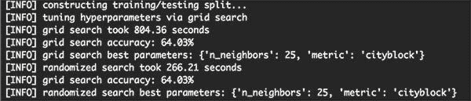
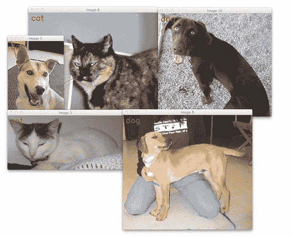
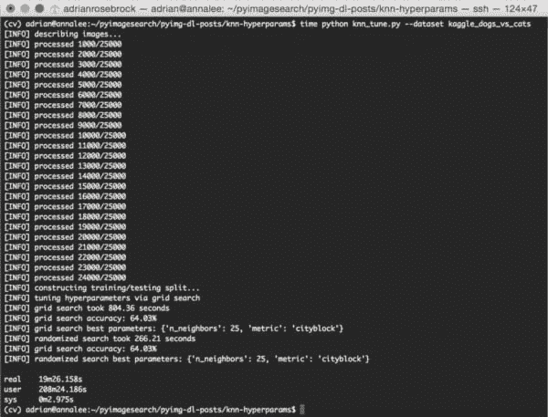

# 如何用 Python 和 scikit 调优超参数-学习

> 原文：<https://pyimagesearch.com/2016/08/15/how-to-tune-hyperparameters-with-python-and-scikit-learn/>



在上周的帖子中，我介绍了 [k-NN 机器学习算法](https://pyimagesearch.com/2016/08/08/k-nn-classifier-for-image-classification/)，然后我们将其应用于图像分类任务。

使用 k-NN 算法，我们在 Kaggle Dogs vs. Cats 数据集挑战上获得了 **57.58%的分类准确率**:



**Figure 1:** Classifying an image as whether it contains a dog or a cat.

**问题是:*“我们能做得更好吗？”***

我们当然可以！几乎任何机器学习算法要获得更高的精度，都要归结为调整各种旋钮和级别。

在 k-NN 的情况下，我们可以调一下 *k* ，最近邻的个数。我们也可以调整我们的距离度量/相似性函数。

当然，超参数调整也有 k-NN 算法之外的含义。在深度学习和卷积神经网络的背景下，我们可以很容易地拥有*数百*个各种各样的超参数来调整和玩(尽管在实践中我们试图将变量的数量限制在少数几个)，每个都在某种程度上影响我们的整体分类(潜在未知)。

因此，理解*超参数调整*的概念以及您在超参数中的选择如何能够*显著*影响您的分类准确性是非常重要的。

## 如何用 Python 和 scikit 调优超参数-学习

在今天教程的剩余部分，我将演示如何为[狗与猫数据集](https://www.kaggle.com/c/dogs-vs-cats/data)调整 k-NN 超参数。我们将首先讨论*什么是*超参数，然后查看一个关于*调整 k-NN 超参数的具体示例。*

然后，我们将探索如何使用两种搜索方法来调整 k-NN 超参数:*网格搜索*和*随机搜索。*

正如我们的结果所示，我们可以将分类准确率从 **57.58%提高到 64%以上！**

### 什么是超参数？

超参数只是在构建机器学习分类器时你拉动和转动的旋钮和级别。调整超参数的过程更正式地称为 *[超参数优化](https://en.wikipedia.org/wiki/Hyperparameter_optimization)* 。

那么正常的“模型参数”和“超参数”有什么区别呢？

嗯，一个标准的“模型参数”通常是一个以某种方式优化的内部变量。在线性回归、逻辑回归和支持向量机的上下文中，我们会将参数视为学习算法找到的权重向量系数。

另一方面，“超参数”通常由人类设计者设定或通过算法方法调整。超参数的例子包括 k-最近邻算法中的邻居数量 *k* ，神经网络的学习速率*α*，或者 CNN 中给定卷积层中学习的滤波器数量。

一般而言，模型参数根据某个*损失函数*进行优化，而超参数则通过探索各种设置来寻找的*，以查看哪些值提供了最高水平的精确度。*

因此，调整模型参数往往更容易(因为我们正在根据训练数据优化一些目标函数)，而超参数可能需要近乎盲目的搜索才能找到最佳参数。

### k-NN 超参数

作为调整超参数的具体例子，让我们考虑一下[k-最近邻分类算法](https://pyimagesearch.com/2016/08/08/k-nn-classifier-for-image-classification/)。对于您的标准 k-NN 实现，有*两个主要的超参数*您将想要调整:

1.  邻居数量 *k* 。
2.  距离度量/相似性函数。

这两个值都会显著影响 k-NN 分类器的准确性。为了在图像分类的背景下演示这一点，让我们对上周的 Kaggle Dogs vs. Cats 数据集应用超参数调整。

打开一个新文件，将其命名为`knn_tune.py`，并插入以下代码:

```py
# import the necessary packages
from sklearn.neighbors import KNeighborsClassifier
from sklearn.grid_search import RandomizedSearchCV
from sklearn.grid_search import GridSearchCV
from sklearn.cross_validation import train_test_split
from imutils import paths
import numpy as np
import argparse
import imutils
import time
import cv2
import os

```

**第 2-12 行**从导入我们需要的 Python 包开始。我们将会大量使用 [scikit-learn 库](http://scikit-learn.org/stable/)，所以如果你还没有安装它，[请确保你遵循这些说明](http://scikit-learn.org/stable/install.html)。

我们还将使用我的个人 [imutils 库](https://github.com/jrosebr1/imutils)，所以请确保您也安装了它:

```py
$ pip install imutils

```

接下来，我们将定义我们的`extract_color_histogram`函数:

```py
def extract_color_histogram(image, bins=(8, 8, 8)):
	# extract a 3D color histogram from the HSV color space using
	# the supplied number of `bins` per channel
	hsv = cv2.cvtColor(image, cv2.COLOR_BGR2HSV)
	hist = cv2.calcHist([hsv], [0, 1, 2], None, bins,
		[0, 180, 0, 256, 0, 256])

	# handle normalizing the histogram if we are using OpenCV 2.4.X
	if imutils.is_cv2():
		hist = cv2.normalize(hist)

	# otherwise, perform "in place" normalization in OpenCV 3 (I
	# personally hate the way this is done
	else:
		cv2.normalize(hist, hist)

	# return the flattened histogram as the feature vector
	return hist.flatten()

```

该函数为图像的每个通道接受一个输入`image`和多个`bins`。

我们将图像转换到 HSV 颜色空间，并计算 3D 颜色直方图来表征图像的颜色分布(**行 17-19** )。

这个直方图然后被展平成一个单一的*8×8×8 = 512-d*特征向量，该向量被返回给调用函数。

关于这个方法更详细的回顾，[请参考上周的博文](https://pyimagesearch.com/2016/08/08/k-nn-classifier-for-image-classification/)。

```py
# construct the argument parse and parse the arguments
ap = argparse.ArgumentParser()
ap.add_argument("-d", "--dataset", required=True,
	help="path to input dataset")
ap.add_argument("-j", "--jobs", type=int, default=-1,
	help="# of jobs for k-NN distance (-1 uses all available cores)")
args = vars(ap.parse_args())

# grab the list of images that we'll be describing
print("[INFO] describing images...")
imagePaths = list(paths.list_images(args["dataset"]))

# initialize the data matrix and labels list
data = []
labels = []

```

**第 34-39 行**处理解析我们的命令行参数。这里我们只需要两个开关:

*   从 Kaggle challenge 到我们的输入狗与猫数据集的路径。
*   `--jobs`:计算特定数据点的最近邻居时要使用的处理器/内核数量。将该值设置为`-1`表示*应该使用所有*可用的处理器/内核。再一次，对于这些论点的更详细的回顾，[请参考上周的教程。](https://pyimagesearch.com/2016/08/08/k-nn-classifier-for-image-classification/)

**第 43 行**获取我们的 25，000 幅输入图像的路径，而**第 46 和 47 行**分别初始化`data`列表(我们将存储从每幅图像提取的颜色直方图)和`labels`列表(每幅输入图像的“狗”或“猫”)。

接下来，我们可以循环我们的`imagePaths`并描述它们:

```py
# loop over the input images
for (i, imagePath) in enumerate(imagePaths):
	# load the image and extract the class label (assuming that our
	# path as the format: /path/to/dataset/{class}.{image_num}.jpg
	image = cv2.imread(imagePath)
	label = imagePath.split(os.path.sep)[-1].split(".")[0]

	# extract a color histogram from the image, then update the
	# data matrix and labels list
	hist = extract_color_histogram(image)
	data.append(hist)
	labels.append(label)

	# show an update every 1,000 images
	if i > 0 and i % 1000 == 0:
		print("[INFO] processed {}/{}".format(i, len(imagePaths)))

```

**线 50** 开始在每个`imagePaths`上循环。对于每个`imagePath`，我们从磁盘加载它并提取`label` ( **行 53 和 54** )。

现在我们有了`image`，我们计算一个颜色直方图(**第 58 行**，然后更新`data`和`labels`列表(**第 59 和 60 行**)。

最后，**行 63 和 64** 向我们的屏幕显示特征提取进度。

为了训练和评估我们的 k-NN 分类器，我们需要将我们的`data`分成两部分:一个*训练部分*和一个*测试部分*:

```py
# partition the data into training and testing splits, using 75%
# of the data for training and the remaining 25% for testing
print("[INFO] constructing training/testing split...")
(trainData, testData, trainLabels, testLabels) = train_test_split(
	data, labels, test_size=0.25, random_state=42)

```

在这里，我们将使用 75%的数据进行训练，剩下的 25%用于评估。

最后，让我们定义一组要优化的超参数:

```py
# construct the set of hyperparameters to tune
params = {"n_neighbors": np.arange(1, 31, 2),
	"metric": ["euclidean", "cityblock"]}

```

上面的代码块定义了一个包含两个键的`params`字典:

*   `n_neighbors`:k-NN 算法中最近邻 *k* 的个数。这里我们将在*【0，29】*范围内搜索*奇数*(记住`np.arange`函数是*独占*)。
*   `metric`:这是 k-NN 的距离函数/相似性度量。通常这默认为欧几里德距离，但是我们也可以使用任何返回单个浮点值的函数，该浮点值表示两幅图像有多“相似”。在这种情况下，我们将搜索[欧几里德距离](https://en.wikipedia.org/wiki/Euclidean_distance)和[曼哈顿/城市街区距离](https://en.wikipedia.org/wiki/Taxicab_geometry)。

既然我们已经定义了想要搜索的超参数，我们需要一个方法来实际地*应用*搜索。幸运的是，scikit-learn 库已经有两种方法可以为我们执行超参数搜索:**网格搜索**和**随机搜索**。

我们会发现，在几乎所有情况下，随机搜索通常比网格搜索更好。

### 网格搜索超参数

网格搜索调整算法将系统地(并且详尽地)训练和评估机器学习分类器，用于超参数值的 ***的每个和每个组合*** 。

在这种情况下，给定 16 个唯一值的 *k* 和 2 个唯一值的*距离度量*，网格搜索将应用*30 个不同的实验来确定最佳值。*

您可以在下面的代码段中看到网格搜索是如何执行的:

```py
# tune the hyperparameters via a cross-validated grid search
print("[INFO] tuning hyperparameters via grid search")
model = KNeighborsClassifier(n_jobs=args["jobs"])
grid = GridSearchCV(model, params)
start = time.time()
grid.fit(trainData, trainLabels)

# evaluate the best grid searched model on the testing data
print("[INFO] grid search took {:.2f} seconds".format(
	time.time() - start))
acc = grid.score(testData, testLabels)
print("[INFO] grid search accuracy: {:.2f}%".format(acc * 100))
print("[INFO] grid search best parameters: {}".format(
	grid.best_params_))

```

网格搜索算法的主要好处也是它的主要缺点:作为一个*穷举搜索*，随着*超参数和超参数值*的数量增加，你的可能参数值*的数量会激增*。

当然，你可以评估超参数的每一个组合，但是你要付出成本，这是一个非常耗时的 T2 成本。而且在大多数情况下，*这几乎不值得。*

正如我在下面的*“使用随机搜索进行超参数调整(在大多数情况下)”*部分中所解释的，很少有*只有*一组*超参数获得最高精度。*

 *相反，存在超参数的“热区”,它们都获得几乎相同的精度。目标是尽可能快地探索超参数 a 的这些“区域”,并定位这些“热区”中的一个。事实证明，随机搜索是一种很好的方法。

### 随机搜索超参数

超参数调整的随机搜索方法将通过**随机、均匀分布从我们的`params`字典中*采样*超参数。**给定一组随机采样的参数，然后对模型进行训练和评估。

我们将这组随机超参数采样和模型构建/评估执行*预设次数。*只要你愿意等待，你就可以将评估次数设置为**。如果你不耐烦并且很匆忙，把这个值设得低一点。如果你有时间花在更长的实验上，增加迭代次数。**

无论哪种情况，随机搜索的目标都是快速探索一大组可能的超参数空间——实现这一目标的最佳方式是通过简单的随机采样。在实践中，它运行得相当好！

您可以在下面找到对 k-NN 算法的超参数进行随机搜索的代码:

```py
# tune the hyperparameters via a randomized search
grid = RandomizedSearchCV(model, params)
start = time.time()
grid.fit(trainData, trainLabels)

# evaluate the best randomized searched model on the testing
# data
print("[INFO] randomized search took {:.2f} seconds".format(
	time.time() - start))
acc = grid.score(testData, testLabels)
print("[INFO] grid search accuracy: {:.2f}%".format(acc * 100))
print("[INFO] randomized search best parameters: {}".format(
	grid.best_params_))

```

### 使用 Python 和 scikit 进行超参数调整-学习结果

要调整 k-NN 算法的超参数，请确保您:

1.  使用本文底部的 ***“下载”*** 表单下载源代码。
2.  前往 [Kaggle Dogs vs. Cats 竞赛页面](https://www.kaggle.com/c/dogs-vs-cats/data)并下载数据集。

从那里，您可以执行以下命令来优化超参数:

```py
$ python knn_tune.py --dataset kaggle_dogs_vs_cats

```

当`knn_tune.py`脚本执行时，你可能想去散散步，伸伸腿。

在我的机器上，花了 **19m 26s** 完成，其中 86%以上的时间花在网格搜索上:



**Figure 2:** Applying a Grid Search and Randomized to tune machine learning hyperparameters using Python and scikit-learn.

从输出截图可以看出，网格搜索法发现 *k=25* 和 *metric='cityblock'* 获得的准确率最高，为 64.03%。**然而，这次网格搜索花了 13 分钟。**

另一方面，随机搜索获得了 64.03% — **的相同准确率，并且在不到 5 分钟的*内完成。***

这两种超参数调整方法都提高了我们的分类精度(64.03%的精度，高于上周文章的 57.58%[)——但是随机搜索*更高效。*](https://pyimagesearch.com/2016/08/08/k-nn-classifier-for-image-classification/)

### 使用随机搜索进行超参数调整(在大多数情况下)

除非你的搜索空间很小，很容易被列举出来，否则随机搜索会更有效率，更快地产生更好的结果。

正如我们的实验所展示的，随机搜索能够在< 5 分钟内获得 **64.03%的准确率，而彻底的网格搜索需要更长的时间 **13 分钟才能获得相同的 64.03%的准确率**——对于相同的准确率，评估时间增加了 202%！**

一般来说，不仅仅有一组*超参数获得最佳结果，相反，通常有一组*超参数存在于凹碗的底部(即优化表面)。**

只要你朝着碗的底部点击这些参数中的*一个*，你仍然会获得和你沿着碗列举*所有可能性*一样的准确度。此外，通过应用随机搜索，你可以更快地探索这个碗*的各个区域。*

总的来说，在大多数情况下，这将导致更快、更有效的超参数调整。

## 摘要

在今天的博客文章中，我演示了如何使用 Python 编程语言和 scikit-learn 库将超参数调优到机器学习算法。

首先，我定义了标准“模型参数”和需要调整的“超参数”之间的区别。

在此基础上，我们应用了两种方法来调整超参数:

1.  彻底的网格搜索
2.  随机搜索

然后将这两个超参数调整例程应用于 k-NN 算法和 Kaggle Dogs vs. Cats 数据集。

每个相应的调优算法都获得了相同的准确度— *，但是随机搜索能够在很短的时间内获得这种准确度的提高！*

**总的来说，我*强烈建议*您在调整超参数时使用随机搜索。**您经常会发现，很少有*一组*超参数能够获得最佳精度。相反，存在超参数的“热区”,它们将获得几乎相同的精度——目标是探索尽可能多的区域，并尽可能快地在这些区域中的一个着陆。

在没有好的超参数选择的先验知识的情况下，随机搜索超参数调整是在短时间内找到合理的超参数值的最佳方式，因为它允许您探索优化表面的许多区域。

无论如何，我希望你喜欢这篇博文！下周我会回来讨论线性分类的基础知识(以及它在神经网络和图像分类中的作用)。

**但在你离开之前，*请务必使用下面的表格注册 PyImageSearch 时事通讯，以便在未来的博客文章发表时得到通知！****