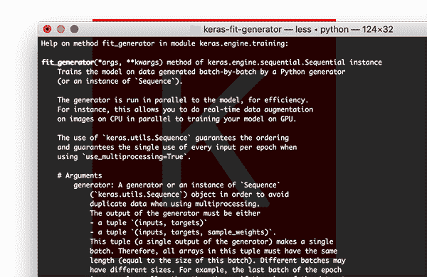
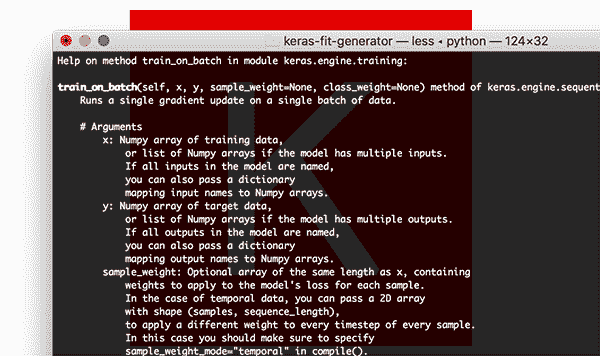
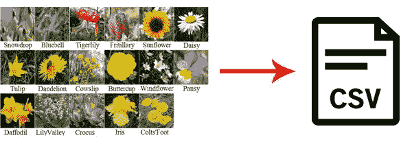
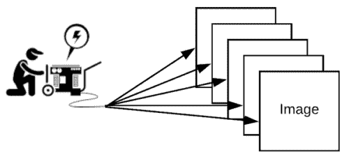

# 如何使用 Keras fit 和 fit_generator(动手教程)

> 原文：<https://pyimagesearch.com/2018/12/24/how-to-use-keras-fit-and-fit_generator-a-hands-on-tutorial/>

最后更新于 2021 年 7 月 4 日。

在本教程中，您将了解 Keras `.fit`和`.fit_generator`函数是如何工作的，包括它们之间的区别。为了帮助您获得实践经验，我包含了一个完整的示例，向您展示如何从头实现一个 [Keras](https://keras.io/) 数据生成器。

今天的博文是受 PyImageSearch 阅读器 Shey 的启发。

谢伊问道:

> 嗨，阿德里安，感谢你的教程。我有条不紊地检查了每一个。他们真的帮助我学会了深度学习。
> 
> 我有一个关于 [Keras](https://keras.io/) 的问题。fit_generator”功能。
> 
> 我注意到你在博客中经常使用它，但我不确定这个功能与 Keras 的标准有何不同。适合”功能。
> 
> 有什么不同？我如何知道何时使用每一个？以及如何为“创建数据生成器”。fit_generator”功能？

谢伊问了一个很好的问题。

Keras 深度学习库包括三个独立的函数，可用于训练您自己的模型:

*   `.fit`
*   `.fit_generator`
*   `.train_on_batch`

如果你是 Keras 和深度学习的新手，你可能会觉得有点不知所措，试图确定你应该使用哪个函数——如果你需要使用自己的定制数据，这种困惑只会变得更加复杂。

为了帮助消除关于 Keras fit 和 fit_generator 函数的困惑，我将在本教程中讨论:

1.  Keras' `.fit`、`.fit_generator`、`.train_on_batch`功能之间的 ***差异***
2.  ***什么时候用每个*** 训练自己的深度学习模型
3.  如何 ***实现自己的 Keras 数据生成器*** 并在 ***使用`.fit_generator`训练模型*** 时利用它
4.  ***在培训后评估你的网络*** 时如何使用`.predict_generator`功能

**要了解关于 Keras 的`.fit`和`.fit_generator`函数的更多信息，包括如何在你自己的定制数据集上训练深度学习模型，*请继续阅读！***

*   【2021 年 7 月更新:对于 TensorFlow 2.2+的用户，只需对自己的项目使用`.fit`方法即可。在 TensorFlow 的未来版本中，`.fit_generator`方法将被弃用，因为`.fit`方法可以自动检测输入数据是数组还是生成器。

## 如何使用 Keras fit 和 fit_generator(动手教程)

***2020-05-13 更新:**此博文现已兼容 TensorFlow 2+!TensorFlow 正在对支持数据扩充的`.fit_generator`方法进行**弃用**。如果您使用的是`tensorflow==2.2.0`或`tensorflow-gpu==2.2.0`(或更高版本)，那么**必须使用**和`.fit`方法(现在支持数据扩充)。请记住这一点，而阅读这个遗产教程。当然，数据扩充的概念保持不变。请注意，本教程中的代码已针对 TensorFlow 2.2+兼容性进行了更新，但是您可能仍会看到对**传统** `.fit_generator`方法的文本引用。*

在今天教程的第一部分，我们将讨论 Keras 的`.fit`、`.fit_generator`和`.train_on_batch`函数之间的区别。

接下来，我将向您展示一个“非标准”图像数据集的示例，它不包含任何实际的 PNG、JPEG 等。一点图像都没有！相反，整个图像数据集由两个 CSV 文件表示，一个用于训练，另一个用于评估。

**我们的目标是实现一个 Keras 生成器，能够根据这个 CSV 图像数据**训练一个网络(不要担心，我将向您展示如何从头开始实现这样一个生成器功能)。

最后，我们将训练和评估我们的网络。

### 什么时候使用 Keras 的 fit、fit_generator、train_on_batch 函数？

Keras 提供了三个函数，可以用来训练你自己的深度学习模型:

1.  `.fit`
2.  `.fit_generator`
3.  `.train_on_batch`

所有这三个功能本质上可以完成相同的任务——但是*它们如何*去做是*非常*不同的。

让我们一个接一个地研究这些函数，看一个函数调用的例子，然后讨论它们之间的区别。

#### 喀拉山脉。拟合函数

让我们先给`.fit`打个电话:

```py
model.fit(trainX, trainY, batch_size=32, epochs=50)

```

这里你可以看到我们正在提供我们的训练数据(`trainX`)和训练标签(`trainY`)。

然后，我们指示 Keras 允许我们的模型以`32`的批量为`50`个时期进行训练。

对`.fit`的调用在这里做了两个主要假设:

1.  我们的*整个*训练集可以放入 RAM
2.  没有正在进行的*数据扩充(即，不需要 Keras 生成器)*

相反，我们的网络将根据原始数据进行训练。

原始数据本身将放入内存中——我们不需要将旧的数据批次移出 RAM，并将新的数据批次移入 RAM。

此外，我们将不会使用数据扩充来即时操纵训练数据。

#### Keras fit_generator 函数

[](https://pyimagesearch.com/wp-content/uploads/2018/12/keras_fit_generator_fit_generator.png)

**Figure 2:** The Keras `.fit_generator` function allows for data augmentation and data generators.

**对于小而简单的数据集，使用 Keras 的`.fit`函数是完全可以接受的。**

这些数据集通常不太具有挑战性，也不需要任何数据扩充。

然而，真实世界的数据集很少如此简单:

*   真实世界的数据集通常*太大，无法放入内存*。
*   它们也趋向于*挑战*，要求我们执行数据扩充以避免过度拟合并增加我们模型的泛化能力。

在这些情况下，我们需要利用 Keras 的`.fit_generator`功能:

```py
# initialize the number of epochs and batch size
EPOCHS = 100
BS = 32

# construct the training image generator for data augmentation
aug = ImageDataGenerator(rotation_range=20, zoom_range=0.15,
	width_shift_range=0.2, height_shift_range=0.2, shear_range=0.15,
	horizontal_flip=True, fill_mode="nearest")

# train the network
H = model.fit_generator(aug.flow(trainX, trainY, batch_size=BS),
	validation_data=(testX, testY), steps_per_epoch=len(trainX) // BS,
	epochs=EPOCHS)

```

***2020-05-13 更新:**在 TensorFlow 2.2+中，我们现在使用`.fit`而不是`.fit_generator`，如果提供的第一个参数是 Python 生成器对象，那么其工作方式完全相同，以适应数据扩充。*

在这里，我们首先初始化我们要训练网络的时期数以及批量大小。

然后我们初始化`aug`，一个 Keras `ImageDataGenerator`对象，用于应用数据扩充、随机平移、旋转、调整大小等。动态图像。

执行数据扩充是正则化的一种形式，使我们的模型能够更好地泛化。

然而，应用数据扩充意味着我们的训练数据不再是“静态的”——数据是不断变化的。

根据提供给`ImageDataGenerator`的参数，随机调整每一批新数据。

因此，我们现在需要利用 Keras 的`.fit_generator`函数来训练我们的模型。

**顾名思义，`.fit_generator`函数假设有一个底层函数*为它生成*数据。**

函数本身是一个 [Python 生成器](https://wiki.python.org/moin/Generators)。

在内部，Keras 在使用`.fit_generator`训练模型时使用以下流程:

1.  Keras 调用提供给`.fit_generator`(本例中为`aug.flow`)的生成器函数。
2.  生成器函数向`.fit_generator`函数生成一批大小为`BS`的数据。
3.  `.fit_generator`函数接受批量数据，执行反向传播，并更新我们模型中的权重。
4.  重复这个过程，直到我们达到期望的历元数。

你会注意到我们现在需要在调用`.fit_generator`时提供一个`steps_per_epoch`参数(`.fit`方法没有这样的参数)。

我们为什么需要`steps_per_epoch`？

请记住，Keras 数据生成器意味着无限循环*——它应该*永远不会*返回或退出。*

 *由于该函数旨在无限循环，Keras 没有能力确定何时*一个时期开始*和一个*新时期开始*。

因此，我们将`steps_per_epoch`值计算为训练数据点的总数除以批量大小。一旦 Keras 达到这个步数，它就知道这是一个新时代。

#### Keras 批量训练函数

[](https://pyimagesearch.com/wp-content/uploads/2018/12/keras_fit_generator_train_on_batch.png)

**Figure 3:** The `.train_on_batch` function in Keras offers expert-level control over training Keras models.

对于深度学习实践者来说，如果他们正在寻找对训练 Keras 模型的最细粒度控制，你可能希望使用`.train_on_batch`函数:

```py
model.train_on_batch(batchX, batchY)

```

**`train_on_batch`函数接受*单批数据*，进行反向传播，然后更新模型参数。**

该批数据可以是任意大小的(即，它不需要提供明确的批量大小)。

数据本身也可以按照您喜欢的方式生成。这些数据可以是磁盘上的原始图像，也可以是经过某种方式修改或扩充的数据。

当你有*个非常明确的*理由想要维护你自己的训练数据迭代器时，比如数据迭代过程非常复杂并且需要定制代码，你通常会使用`.train_on_batch`函数。

如果你发现自己在问是否需要`.train_on_batch`函数，那么很可能你并不需要。

在 99%的情况下，你不需要这样细粒度的控制来训练你的深度学习模型。相反，自定义的 Keras `.fit_generator`函数可能就是您所需要的。

也就是说，如果你需要这个函数，知道它的存在是件好事。

如果你是高级深度学习实践者/工程师，并且你确切地知道你在做什么和为什么，我通常只推荐使用`.train_on_batch`函数。

### 图像数据集…作为 CSV 文件？

[](https://pyimagesearch.com/wp-content/uploads/2018/12/keras_fit_generator_dataset.jpg)

**Figure 4:** The [Flowers-17](http://www.robots.ox.ac.uk/~vgg/data/flowers/17/) dataset has been serialized into two CSV files (training and evaluation). In this blog post we’ll write a custom Keras generator to parse the CSV data and yield batches of images to the .fit_generator function. (credits: [image](https://link.springer.com/article/10.1007/s11042-018-5712-3) & [icon](http://freeiconshop.com/icon/csv-file-icon-outline/))

我们今天将在这里使用的数据集是 [Flowers-17 数据集](http://www.robots.ox.ac.uk/~vgg/data/flowers/17/)，它是 17 种不同花卉的集合，每类有 80 张图像。

我们的目标是训练一个 Keras 卷积神经网络来正确分类每一种花。

**然而，这个项目有点曲折:**

*   不是处理驻留在磁盘上的原始图像文件…
*   …我已经将整个图像数据集序列化为两个 CSV 文件(一个用于训练，一个用于评估)。

要构建每个 CSV 文件，我:

*   循环遍历输入数据集中的所有图像
*   将它们调整为 64×64 像素
*   将 64x64x3=12，288 个 RGB 像素亮度合并到一个列表中
*   将 12，288 像素值+类别标签写入 CSV 文件(每行一个)

我们的目标是现在编写一个定制的 Keras 生成器来解析 CSV 文件，并为`.fit_generator`函数生成成批的图像和标签。

### 等等，如果你已经有图像了，为什么还要麻烦一个 CSV 文件呢？

今天的教程旨在举例说明如何为`.fit_generator`函数实现自己的 Keras 生成器。

在现实世界中，数据集并不适合你:

*   您可能有非结构化的图像目录。
*   你可以同时处理图像和文本。
*   您的图像可以以特定格式*序列化*，无论是 CSV 文件、Caffe 或 TensorFlow 记录文件等。

在这些情况下，你需要知道如何编写你自己的 Keras 生成器函数。

请记住，这里重要的是*而不是*特定的数据格式——您需要学习的是编写自己的 Keras 生成器的实际*过程*(这正是本教程剩余部分所涵盖的内容)。

### 项目结构

让我们检查一下今天示例的项目树:

```py
$ tree --dirsfirst
.
├── pyimagesearch
│   ├── __init__.py
│   └── minivggnet.py
├── flowers17_testing.csv
├── flowers17_training.csv
├── plot.png
└── train.py

1 directory, 6 files

```

今天我们将使用迷你 CNN。我们今天不会在这里讨论实现，因为我假设您已经知道如何实现 CNN。如果没有，不用担心——参考我的 **[Keras 教程](https://pyimagesearch.com/2018/09/10/keras-tutorial-how-to-get-started-with-keras-deep-learning-and-python/)** 就行了。

我们的序列化图像数据集包含在`flowers17_training.csv`和`flowers17_testing.csv`中(包含在与今天的帖子相关的 ***【下载】*** )。

在接下来的两节中，我们将回顾我们的培训脚本`train.py`。

### 实现自定义的 Keras fit_generator 函数

[](https://pyimagesearch.com/wp-content/uploads/2018/12/keras_fit_generator_illustration.png)

**Figure 5:** What’s our fuel source for our ImageDataGenerator? Two CSV files with serialized image text strings. The generator engine is the `ImageDataGenerator` from Keras coupled with our custom `csv_image_generator`. The generator will burn the CSV fuel to create batches of images for training.

让我们开始吧。

我假设您的系统上安装了以下库:

*   NumPy
*   TensorFlow + Keras
*   Scikit-learn
*   Matplotlib

这些包中的每一个都可以通过 pip 安装在您的虚拟环境中。如果您安装了 virtualenvwrapper，您可以使用`mkvirtualenv`创建一个环境，并使用`workon`命令激活您的环境。在那里，您可以使用 pip 来设置您的环境:

```py
$ mkvirtualenv cv -p python3
$ workon cv
$ pip install numpy
$ pip install tensorflow # or tensorflow-gpu
$ pip install keras
$ pip install scikit-learn
$ pip install matplotlib

```

一旦建立了虚拟环境，您就可以继续编写培训脚本了。确保您使用今天帖子的 ***【下载】*** 部分获取源代码和 Flowers-17 CSV 图像数据集。

打开`train.py`文件并插入以下代码:

```py
# set the matplotlib backend so figures can be saved in the background
import matplotlib
matplotlib.use("Agg")

# import the necessary packages
from tensorflow.keras.preprocessing.image import ImageDataGenerator
from tensorflow.keras.optimizers import SGD
from sklearn.preprocessing import LabelBinarizer
from sklearn.metrics import classification_report
from pyimagesearch.minivggnet import MiniVGGNet
import matplotlib.pyplot as plt
import numpy as np

```

**2-12 行**导入我们需要的包和模块。因为我们将把我们的训练图保存到磁盘上，**第 3 行**适当地设置了`matplotlib`的后端。

值得注意的进口包括`ImageDataGenerator`，它包含数据增强和图像生成器功能，以及`MiniVGGNet`，我们的 CNN，我们将培训。

让我们定义一下`csv_image_generator`函数:

```py
def csv_image_generator(inputPath, bs, lb, mode="train", aug=None):
	# open the CSV file for reading
	f = open(inputPath, "r")

```

在**第 14 行**我们定义了`csv_image_generator`。这个函数负责读取我们的 CSV 数据文件并将图像加载到内存中。它向我们的 Keras `.fit_generator`函数生成批量数据。

因此，该函数接受以下参数:

*   `inputPath`:CSV 数据集文件的路径。
*   `bs`:批量大小。我们将使用 32。
*   `lb`:一个包含我们的类标签的标签二进制化器对象。
*   `mode`:(缺省值为`"train"`)当且仅当`mode=="eval"`时，则做出特殊调整，不通过`aug`对象(如果提供的话)应用数据扩充。
*   `aug`:(默认为`None`)如果指定了增强对象，那么我们将在生成图像和标签之前应用它。

在**第 16** 行，我们将打开 CSV 数据文件进行读取。

让我们开始遍历数据行:

```py
	# loop indefinitely
	while True:
		# initialize our batches of images and labels
		images = []
		labels = []

```

CSV 文件中的每一行数据都包含一个序列化为文本字符串的图像。同样，我从 Flowers-17 数据集生成了文本字符串。此外，我知道这不是存储图像的最有效的方式，但是对于这个例子来说非常好。

我们的 Keras 发生器必须按照**第 19 行**的定义无限循环。每当需要新的一批数据时，`.fit_generator`函数将调用我们的`csv_image_generator`函数。

此外，Keras 维护着一个数据缓存/队列，确保我们正在训练的模型始终有数据可以训练。Keras 一直保持这个队列满，所以即使你已经达到了训练的总次数，记住 Keras 仍然在给数据生成器提供数据，保持数据在队列中。

一定要确保你的函数返回数据，否则，Keras 会报错说它不能从你的生成器获得更多的训练数据。

在循环的每次迭代中，我们将把我们的`images`和`labels`重新初始化为空列表(**第 21 行和第 22 行**)。

从这里开始，我们将开始向这些列表添加图像和标签，直到达到我们的批量大小:

```py
		# keep looping until we reach our batch size
		while len(images) < bs:
			# attempt to read the next line of the CSV file
			line = f.readline()

			# check to see if the line is empty, indicating we have
			# reached the end of the file
			if line == "":
				# reset the file pointer to the beginning of the file
				# and re-read the line
				f.seek(0)
				line = f.readline()

				# if we are evaluating we should now break from our
				# loop to ensure we don't continue to fill up the
				# batch from samples at the beginning of the file
				if mode == "eval":
					break

			# extract the label and construct the image
			line = line.strip().split(",")
			label = line[0]
			image = np.array([int(x) for x in line[1:]], dtype="float32")
			image = image.reshape((64, 64, 3))

			# update our corresponding batches lists
			images.append(image)
			labels.append(label)

```

让我们来看看这个循环:

*   首先，我们从文本文件对象`f` ( **第 27 行**)中读取一个`line`。
*   如果`line`为空:
    *   …我们重置我们的文件指针并尝试读取一个`line` ( **第 34 行和第 35 行**)。
    *   如果我们在评估`mode`，我们继续从循环`break`(**第 40 行和第 41 行**)。
*   此时，我们将从 CSV 文件中解析我们的`image`和`label`(**第 44-46 行**)。
*   我们继续调用`.reshape`将我们的 1D 数组整形为我们的图像，它是 64×64 像素，有 3 个颜色通道(**第 47 行**)。
*   最后，我们将`image`和`label`添加到它们各自的列表中，*重复这个过程，直到我们的图像批次满了* ( **第 50 行和第 51 行**)。

***注:**这里做评价工作的关键是我们提供`steps`到`model.predict_generator`的数量，保证测试集中的每张图像只被预测一次。我将在教程的后面介绍如何完成这个过程。*

准备好我们的图像批次和相应的标签后，我们现在可以在生成批次之前采取两个步骤:

```py
		# one-hot encode the labels
		labels = lb.transform(np.array(labels))

		# if the data augmentation object is not None, apply it
		if aug is not None:
			(images, labels) = next(aug.flow(np.array(images),
				labels, batch_size=bs))

		# yield the batch to the calling function
		yield (np.array(images), labels)

```

我们的最后步骤包括:

*   一键编码`labels` ( **第 54 行**)
*   必要时应用数据扩充(**第 57-59 行**)

最后，我们的生成器根据请求将我们的图像数组和标签列表“产出”给调用函数( **Line 62** )。如果您不熟悉`yield`关键字，它被用于 Python 生成器函数，作为一种方便的快捷方式来代替构建一个消耗较少内存的迭代器类。你可以[在这里](https://wiki.python.org/moin/Generators)阅读更多关于 Python 生成器的内容。

让我们初始化我们的训练参数:

```py
# initialize the paths to our training and testing CSV files
TRAIN_CSV = "flowers17_training.csv"
TEST_CSV = "flowers17_testing.csv"

# initialize the number of epochs to train for and batch size
NUM_EPOCHS = 75
BS = 32

# initialize the total number of training and testing image
NUM_TRAIN_IMAGES = 0
NUM_TEST_IMAGES = 0

```

在本示例培训脚本中，许多初始化都是硬编码的:

*   我们的培训和测试 CSV 文件路径(**第 65 行和第 66 行**)。
*   用于训练的时期数和批量大小(**行 69 和 70** )。
*   保存训练和测试图像数量的两个变量(**行 73 和 74** )。

让我们看看下一段代码:

```py
# open the training CSV file, then initialize the unique set of class
# labels in the dataset along with the testing labels
f = open(TRAIN_CSV, "r")
labels = set()
testLabels = []

# loop over all rows of the CSV file
for line in f:
	# extract the class label, update the labels list, and increment
	# the total number of training images
	label = line.strip().split(",")[0]
	labels.add(label)
	NUM_TRAIN_IMAGES += 1

# close the training CSV file and open the testing CSV file
f.close()
f = open(TEST_CSV, "r")

# loop over the lines in the testing file
for line in f:
	# extract the class label, update the test labels list, and
	# increment the total number of testing images
	label = line.strip().split(",")[0]
	testLabels.append(label)
	NUM_TEST_IMAGES += 1

# close the testing CSV file
f.close()

```

这段代码很长，但它有三个用途:

1.  从我们的训练数据集中提取所有标签，以便我们可以随后确定唯一的标签。注意`labels`是一个`set`，它只允许唯一的条目。
2.  汇总一份`testLabels`清单。
3.  数一数`NUM_TRAIN_IMAGES`和`NUM_TEST_IMAGES`。

让我们构建我们的`LabelBinarizer`对象，并构建数据扩充对象:

```py
# create the label binarizer for one-hot encoding labels, then encode
# the testing labels
lb = LabelBinarizer()
lb.fit(list(labels))
testLabels = lb.transform(testLabels)

# construct the training image generator for data augmentation
aug = ImageDataGenerator(rotation_range=20, zoom_range=0.15,
	width_shift_range=0.2, height_shift_range=0.2, shear_range=0.15,
	horizontal_flip=True, fill_mode="nearest")

```

使用唯一的标签，我们将`.fit`我们的`LabelBinarizer`对象(**第 107 行和第 108 行**)。

我们还将继续把我们的`testLabels`转换成二进制的单热码`testLabels` ( **第 109 行**)。

从那里，我们将构造`aug`，一个`ImageDataGenerator` ( **行 112-114** )。我们的图像数据增强对象将随机旋转、翻转、剪切等。我们的训练图像。

现在让我们初始化我们的训练和测试图像生成器:

```py
# initialize both the training and testing image generators
trainGen = csv_image_generator(TRAIN_CSV, BS, lb,
	mode="train", aug=aug)
testGen = csv_image_generator(TEST_CSV, BS, lb,
	mode="train", aug=None)

```

我们的`trainGen`和`testGen`生成器对象使用`csv_image_generator` ( **第 117-120 行**)从各自的 CSV 文件生成图像数据。

注意细微的相似和不同之处:

*   我们对两个生成器都使用了`mode="train"`
*   只有`trainGen`会执行数据扩充

让我们用 Keras 初始化+编译我们的 MiniVGGNet 模型，并开始训练:

```py
# initialize our Keras model and compile it
model = MiniVGGNet.build(64, 64, 3, len(lb.classes_))
opt = SGD(lr=1e-2, momentum=0.9, decay=1e-2 / NUM_EPOCHS)
model.compile(loss="categorical_crossentropy", optimizer=opt,
	metrics=["accuracy"])

# train the network
print("[INFO] training w/ generator...")
H = model.fit(
	x=trainGen,
	steps_per_epoch=NUM_TRAIN_IMAGES // BS,
	validation_data=testGen,
	validation_steps=NUM_TEST_IMAGES // BS,
	epochs=NUM_EPOCHS)

```

***2020-05-13 更新:**本帖现已兼容 TensorFlow 2+!我们不再使用`.fit_generator`函数；相反，我们使用`.fit`方法。*

**第 123-126 行**编译我们的模型。我们正在使用一个随机梯度下降优化器，它的初始学习速率为`1e-2`。学习率衰减应用于每个时期。使用分类交叉熵是因为我们有两个以上的类(否则会使用二进制交叉熵)。请务必参考我的 [Keras 教程](https://pyimagesearch.com/2018/09/10/keras-tutorial-how-to-get-started-with-keras-deep-learning-and-python/)进行额外阅读。

在**行 130-135** 我们调用`.fit`开始训练。

`trainGen`生成器对象负责向`.fit`函数生成批量数据和标签。

**请注意我们如何根据图像数量和批次大小计算每个时期的步骤和验证步骤。**我们提供`steps_per_epoch`值是非常重要的，否则 Keras 将不知道一个纪元何时开始，另一个纪元何时开始。

现在让我们来评估培训的结果:

```py
# re-initialize our testing data generator, this time for evaluating
testGen = csv_image_generator(TEST_CSV, BS, lb,
	mode="eval", aug=None)

# make predictions on the testing images, finding the index of the
# label with the corresponding largest predicted probability
predIdxs = model.predict(x=testGen, steps=(NUM_TEST_IMAGES // BS) + 1)
predIdxs = np.argmax(predIdxs, axis=1)

# show a nicely formatted classification report
print("[INFO] evaluating network...")
print(classification_report(testLabels.argmax(axis=1), predIdxs,
	target_names=lb.classes_))

```

我们继续并重新初始化我们的`testGen`，这一次为了评估的目的将`mode`改为`"eval"`。

重新初始化后，我们使用我们的`.predict`函数和`testGen` ( **第 143 和 144 行**)进行预测。在这个过程的最后，我们将继续获取最大预测指数(**第 145 行**)。

使用`testLabels`和`predIdxs`，我们将通过 scikit-learn 生成一个`classification_report`(**第 149 和 150 行**)。在培训和评估结束时，分类报告被很好地打印到我们的终端以供检查。

最后一步，我们将使用我们的训练历史字典`H`，用 matplotlib 生成一个图:

```py
# plot the training loss and accuracy
N = NUM_EPOCHS
plt.style.use("ggplot")
plt.figure()
plt.plot(np.arange(0, N), H.history["loss"], label="train_loss")
plt.plot(np.arange(0, N), H.history["val_loss"], label="val_loss")
plt.plot(np.arange(0, N), H.history["accuracy"], label="train_acc")
plt.plot(np.arange(0, N), H.history["val_accuracy"], label="val_acc")
plt.title("Training Loss and Accuracy on Dataset")
plt.xlabel("Epoch #")
plt.ylabel("Loss/Accuracy")
plt.legend(loc="lower left")
plt.savefig("plot.png")

```

生成精度/损失图，并作为`plot.png`保存到磁盘，以备脚本退出时检查。

### 使用 fit_generator 训练 Keras 模型并使用 predict_generator 进行评估

***2020-06-03 更新:**尽管这一节的标题，我们现在用`.fit`(无 `.fit_generator`)和`.predict`(无`.predict_generator`)。*

要使用我们的定制数据生成器训练我们的 Keras 模型，请确保使用 ***“下载”*** 部分下载源代码和示例 CSV 图像数据集。

从那里，打开一个终端，导航到您下载源代码+数据集的位置，并执行以下命令:

```py
$ python train.py
Using TensorFlow backend.
[INFO] training w/ generator...
Train for 31 steps, validate for 10 steps
Epoch 1/75
31/31 [==============================] - 10s 317ms/step - loss: 3.6791 - accuracy: 0.1401 - val_loss: 1828.6441 - val_accuracy: 0.0625
Epoch 2/75
31/31 [==============================] - 9s 287ms/step - loss: 3.0351 - accuracy: 0.2077 - val_loss: 246.5172 - val_accuracy: 0.0938
Epoch 3/75
31/31 [==============================] - 9s 288ms/step - loss: 2.8571 - accuracy: 0.2621 - val_loss: 92.0763 - val_accuracy: 0.0750
...
31/31 [==============================] - 9s 287ms/step - loss: 0.4484 - accuracy: 0.8548 - val_loss: 1.3388 - val_accuracy: 0.6531
Epoch 73/75
31/31 [==============================] - 9s 287ms/step - loss: 0.4025 - accuracy: 0.8619 - val_loss: 1.1642 - val_accuracy: 0.7125
Epoch 74/75
31/31 [==============================] - 9s 287ms/step - loss: 0.3401 - accuracy: 0.8720 - val_loss: 1.2229 - val_accuracy: 0.7188
Epoch 75/75
31/31 [==============================] - 9s 287ms/step - loss: 0.3605 - accuracy: 0.8780 - val_loss: 1.2207 - val_accuracy: 0.7063
[INFO] evaluating network...
              precision    recall  f1-score   support

    bluebell       0.63      0.81      0.71        21
   buttercup       0.69      0.73      0.71        15
   coltsfoot       0.55      0.76      0.64        21
     cowslip       0.73      0.40      0.52        20
      crocus       0.53      0.88      0.66        24
    daffodil       0.82      0.33      0.47        27
       daisy       0.77      0.94      0.85        18
   dandelion       0.71      0.83      0.77        18
  fritillary       1.00      0.77      0.87        22
        iris       0.95      0.75      0.84        24
  lilyvalley       0.92      0.55      0.69        22
       pansy       0.89      0.89      0.89        18
    snowdrop       0.69      0.50      0.58        22
   sunflower       0.90      1.00      0.95        18
   tigerlily       0.87      0.93      0.90        14
       tulip       0.33      0.50      0.40        16
  windflower       0.81      0.85      0.83        20

    accuracy                           0.72       340
   macro avg       0.75      0.73      0.72       340
weighted avg       0.76      0.72      0.71       340

```

在这里你可以看到我们的网络在评估集上获得了 76%的准确率，这对于使用的相对较浅的 CNN 来说是相当可观的。

最重要的是，您学会了如何利用:

*   数据生成器
*   `.fit`(原`.fit_generator`)
*   `.predict`(原`.predict_generator` )

 `…这一切都是为了训练和评估您自己的定制 Keras 模型！

**同样，这里重要的是*而不是*数据本身的实际格式。**除了 CSV 文件，我们还可以使用 Caffe 或 TensorFlow 记录文件，即数字/分类数据与图像的组合，或者您在现实世界中可能遇到的任何其他数据合成。

相反，实现自己的 Keras 数据生成器的实际过程*才是最重要的。*

按照本教程中的步骤，您将有一个蓝图，可以用来实现自己的 Keras 数据生成器。

### **如果你用的是 TensorFlow 2.2+，就用”。适合”，没理由用”。fit_generator"**

您可以使用`pip freeze`检查您的 TensorFlow 版本，然后查找您的 TensorFlow 版本:

```py
$ pip freeze | grep 'tensorflow'
tensorflow==2.4.1
tensorflow-estimator==2.4.0
```

**如果你使用 TensorFlow 2.2 或更高版本，*你应该只使用`.fit`方法。***

TensorFlow 将在未来的版本中取消`.fit_generator`方法，因为`.fit`方法可以*自动检测*输入数据是数组还是生成器。

## 摘要

在本教程中，您学习了 Keras 用于训练深度神经网络的三个主要功能之间的差异:

1.  `.fit`:当*整个*训练数据集可以放入内存并且没有应用数据扩充时使用。**从 TensorFlow 2 开始，该方法现在支持数据扩充。**
2.  `.fit_generator` : **针对使用 tensor flow/Keras 2.2 之前版本的遗留代码。**应在以下情况下使用:( 1)数据集太大，内存容纳不下，(2)需要应用数据扩充，或(3)更方便批量生成训练数据的任何情况(即使用`flow_from_directory`函数)。
3.  `.train_on_batch`:可用于在*单次*批量数据上训练 Keras 模型。应该只在需要对网络进行最细粒度的控制训练时使用，比如在数据迭代器非常复杂的情况下。

从那里，我们发现了如何:

1.  实现我们自己定制的 Keras 生成器函数
2.  使用我们的定制生成器和 Keras ' T0 '来训练我们的深度神经网络

在自己的项目中实现自己的 Keras 生成器时，可以使用今天的示例代码作为模板。

我希望你喜欢今天的博文！

**要下载这篇文章的源代码，并在 PyImageSearch 上发布未来教程时得到通知，*只需在下面的表格中输入您的电子邮件地址！***`*