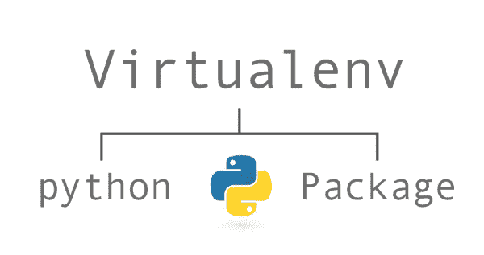
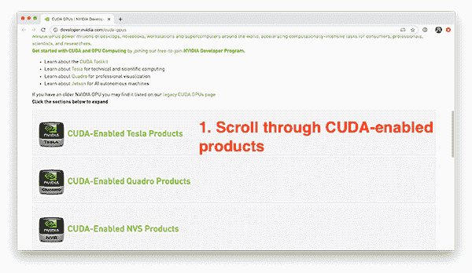
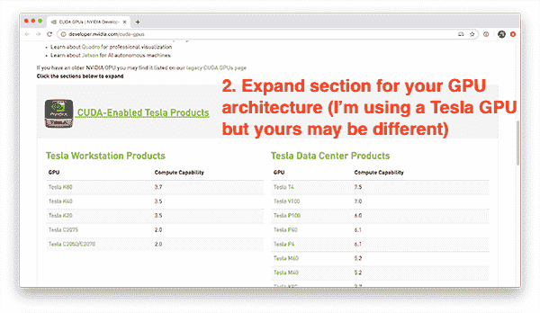
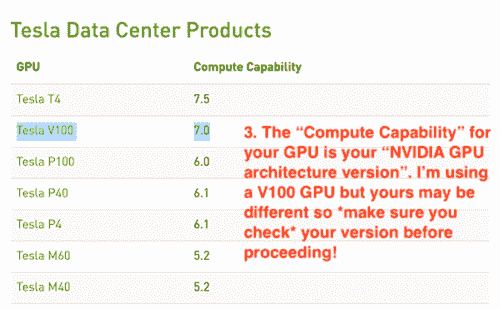
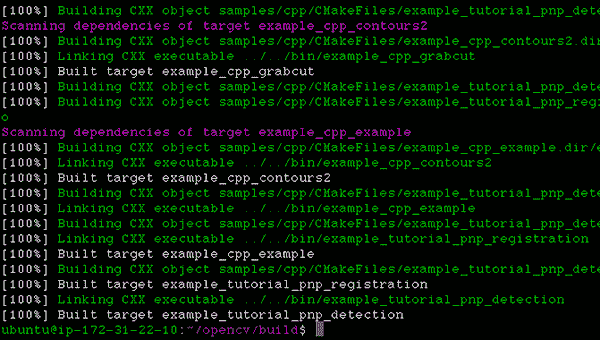

# 如何在 NVIDIA GPUs、CUDA 和 cuDNN 上使用 OpenCV 的“dnn”模块

> 原文：<https://pyimagesearch.com/2020/02/03/how-to-use-opencvs-dnn-module-with-nvidia-gpus-cuda-and-cudnn/>

在本教程中，您将学习如何使用 OpenCV 的“深度神经网络”(DNN)模块与 NVIDIA GPUs、CUDA 和 cuDNN 进行 ***211-1549%* 更快的推理。**

回到 2017 年 8 月，我发表了[我的第一篇关于使用 OpenCV 的“深度神经网络”(DNN)模块进行图像分类的教程。](https://pyimagesearch.com/2017/08/21/deep-learning-with-opencv/)

PyImageSearch 的读者非常喜欢 OpenCV 的`dnn`模块的便利性和易用性，因此我继续发布了关于`dnn`模块的附加教程，包括:

*   [*深度学习和 OpenCV* 的物体检测](https://pyimagesearch.com/2017/09/11/object-detection-with-deep-learning-and-opencv/)
*   [*利用深度学习和 OpenCV 进行实时物体检测*](https://pyimagesearch.com/2017/09/18/real-time-object-detection-with-deep-learning-and-opencv/)
*   [*YOLO 用 OpenCV 检测物体*](https://pyimagesearch.com/2018/11/12/yolo-object-detection-with-opencv/)
*   [*用 OpenCV* 屏蔽 R-CNN](https://pyimagesearch.com/2018/11/19/mask-r-cnn-with-opencv/)

这些指南中的每一个都使用 OpenCV 的`dnn`模块来(1)从磁盘加载预训练的网络，(2)对输入图像进行预测，然后(3)显示结果，允许您为您的特定项目构建自己的定制计算机视觉/深度学习管道。

**然而，OpenCV 的`dnn`模块的*最大问题*是*缺乏 NVIDIA GPU/CUDA 支持***——使用这些模型，你*无法*轻松使用 GPU 来提高你的流水线的每秒帧数(FPS)处理速率。

对于单镜头探测器(SSD)教程来说，这不是什么大问题，它可以在 CPU 上轻松地以 25-30+ FPS 运行，但对于 YOLO 和马斯克 R-CNN 来说，这是一个巨大的问题，他们很难在 CPU 上达到 1-3 FPS 以上。

这一切都在 2019 年的谷歌代码之夏(GSoC)中改变了。

**由 dlib 的 [Davis King](https://pyimagesearch.com/2017/03/13/an-interview-with-davis-king-creator-of-the-dlib-toolkit/) 领衔， [Yashas Samaga](https://github.com/YashasSamaga) ，** **OpenCV 4.2 现在支持 NVIDIA GPUs 使用 OpenCV 的`dnn`模块进行推理，推理速度*提升高达 1549%！***

在今天的教程中，我将向您展示如何编译和安装 OpenCV，以利用您的 NVIDIA GPU 进行深度神经网络推理。

然后，在下周的教程中，我将为您提供单次检测器、YOLO 和屏蔽 R-CNN 代码，这些代码可用于利用 OpenCV 来利用您的 GPU。然后，我们将对结果进行基准测试，并将它们与纯 CPU 推理进行比较，这样您就知道哪些模型可以从使用 GPU 中受益最多。

**要了解如何在 NVIDIA GPU、CUDA 和 cuDNN 支持下编译和安装 OpenCV 的“dnn”模块，*继续阅读！***

## 如何在 NVIDIA GPUs、CUDA 和 cuDNN 上使用 OpenCV 的“dnn”模块

在本教程的剩余部分，我将向您展示如何从源代码编译 OpenCV，以便您可以利用 NVIDIA GPU 加速的预训练深度神经网络推理。

### 为 NVIDIA GPU 支持编译 OpenCV 时的假设

为了在 NVIDIA GPU 支持下编译和安装 OpenCV 的“深度神经网络”模块，我将做出以下假设:

1.  **你有一个 NVIDIA GPU。**这应该是显而易见的假设。如果您没有 NVIDIA GPU，则无法在 NVIDIA GPU 支持下编译 OpenCV 的“dnn”模块。
2.  你正在使用 Ubuntu 18.04(或另一个基于 Debian 的发行版)。说到深度学习，我*强烈推荐*基于 Unix 的机器而不是 Windows 系统(事实上，[我在 PyImageSearch 博客上不支持 Windows](https://pyimagesearch.com/faqs/single-faq/can-you-help-me-do-___-on-windows))。**如果你打算使用 GPU 进行深度学习，那么使用 Ubuntu 而不是 macOS 或 Windows**——配置起来*要容易得多*。
3.  你知道如何使用命令行。我们将在本教程中使用命令行。如果你对命令行不熟悉，我建议[先阅读这篇命令行简介](http://linuxcommand.org/lc3_learning_the_shell.php)，然后花几个小时(甚至几天)练习。同样，本教程是*而不是*给那些命令行新手的。
4.  您能够阅读终端输出并诊断问题。如果你以前从未做过，从源代码编译 OpenCV 可能是一个挑战——有许多事情可能会让你出错，包括丢失的包、不正确的库路径等。即使有我详细的指导，你也可能会一路犯错。**不要气馁！**花时间理解你正在执行的命令，它们做什么，最重要的是， ***阅读命令的输出！*** 不要去盲目的复制粘贴；你只会遇到错误。

说了这么多，让我们开始为 NVIDIA GPU 推断配置 OpenCV 的“dnn”模块。

### 步骤 1:安装 NVIDIA CUDA 驱动程序、CUDA 工具包和 cuDNN

**本教程假设你*已经*已经:**

*   一个 NVIDIA GPU
*   安装的特定 GPU 的 CUDA 驱动程序
*   配置和安装了 CUDA 工具包和 cuDNN

如果您的系统上有 NVIDIA GPU，但尚未安装 CUDA 驱动程序、CUDA Toolkit 和 cuDNN，您将需要首先配置您的机器— *我不会在本指南中介绍 CUDA 配置和安装。*

要了解如何安装 NVIDIA CUDA 驱动程序、CUDA 工具包和 cuDNN，我建议你阅读我的 **[Ubuntu 18.04 和 TensorFlow/Keras GPU 安装指南](https://pyimagesearch.com/2019/12/09/how-to-install-tensorflow-2-0-on-ubuntu/)**——一旦你安装了正确的 NVIDIA 驱动程序和工具包，你就可以回到本教程。

### 步骤 2:安装 OpenCV 和“dnn”GPU 依赖项

为 NVIDIA GPU 推断配置 OpenCV 的“dnn”模块的第一步是安装适当的依赖项:

```py
$ sudo apt-get update
$ sudo apt-get upgrade
$ sudo apt-get install build-essential cmake unzip pkg-config
$ sudo apt-get install libjpeg-dev libpng-dev libtiff-dev
$ sudo apt-get install libavcodec-dev libavformat-dev libswscale-dev
$ sudo apt-get install libv4l-dev libxvidcore-dev libx264-dev
$ sudo apt-get install libgtk-3-dev
$ sudo apt-get install libatlas-base-dev gfortran
$ sudo apt-get install python3-dev

```

如果你遵循了我的 [Ubuntu 18.04 深度学习配置指南](https://pyimagesearch.com/2019/12/09/how-to-install-tensorflow-2-0-on-ubuntu/)，这些包中的大部分应该已经安装了，但是为了安全起见，我会推荐你运行上面的命令。

### 步骤 3:下载 OpenCV 源代码

没有“pip-installable”版本的 OpenCV 附带 NVIDIA GPU 支持——相反，我们需要使用适当的 NVIDIA GPU 配置集从头开始编译 OpenCV *。*

这样做的第一步是下载 OpenCV v4.2 的源代码:

```py
$ cd ~
$ wget -O opencv.zip https://github.com/opencv/opencv/archive/4.2.0.zip
$ wget -O opencv_contrib.zip https://github.com/opencv/opencv_contrib/archive/4.2.0.zip
$ unzip opencv.zip
$ unzip opencv_contrib.zip
$ mv opencv-4.2.0 opencv
$ mv opencv_contrib-4.2.0 opencv_contrib

```

我们现在可以继续配置我们的构建了。

### 步骤 4:配置 Python 虚拟环境

[](https://pyimagesearch.com/wp-content/uploads/2020/02/opencv_dnn_gpu_virtualenv.png)

**Figure 2:** Python virtual environments are a best practice for both Python development and Python deployment. We will create an OpenCV CUDA virtual environment in this blog post so that we can run OpenCV with its new CUDA backend for conducting deep learning and other image processing on your CUDA-capable NVIDIA GPU ([image source](https://exoticbaryon.anset.org/2017/03/30/set-up-a-python-3-virtual-environment-on-centos-7-3/)).

如果你遵循了我的 [Ubuntu 18.04、TensorFlow 和 Keras 深度学习配置指南](https://pyimagesearch.com/2019/12/09/how-to-install-tensorflow-2-0-on-ubuntu/)，那么你应该已经安装了 [virtualenv](https://virtualenv.pypa.io/en/latest/) 和 [virtualenvwrapper](https://virtualenvwrapper.readthedocs.io/en/latest/) :

*   如果您的机器*已经配置了*，请跳到本节中的`mkvirtualenv`命令。
*   否则，按照这些步骤来配置您的机器。

Python 虚拟环境是 Python 开发的最佳实践。它们允许您在隔离的、独立的开发和生产环境中测试不同版本的 Python 库。Python 虚拟环境被认为是 Python 世界中的最佳实践——我每天都在使用它们，你也应该如此。

如果您还没有安装 Python 的包管理器`pip`，您可以使用下面的命令来安装:

```py
$ wget https://bootstrap.pypa.io/get-pip.py
$ sudo python3 get-pip.py

```

一旦`pip`安装完毕，您就可以同时安装`virtualenv`和`virtualenvwrapper`:

```py
$ sudo pip install virtualenv virtualenvwrapper
$ sudo rm -rf ~/get-pip.py ~/.cache/pip

```

然后，你需要打开你的`~/.bashrc`文件，并将其更新为*每当你打开一个终端时，自动*加载 virtualenv/virtualenvwrapper。

我更喜欢使用`nano`文本编辑器，但是你可以使用你最喜欢的编辑器:

```py
$ nano ~/.bashrc

```

打开`~/.bashrc`文件后，滚动到文件底部，插入以下内容:

```py
# virtualenv and virtualenvwrapper
export WORKON_HOME=$HOME/.virtualenvs
export VIRTUALENVWRAPPER_PYTHON=/usr/bin/python3
source /usr/local/bin/virtualenvwrapper.sh

```

从那里，保存并退出您的终端(`ctrl + x`、`y`、`enter`)。

然后，您可以在终端会话中重新加载您的`~/.bashrc`文件:

```py
$ source ~/.bashrc

```

您只需要运行上面的命令*一次* —因为您更新了您的`~/.bashrc`文件，每当您打开一个新的终端窗口时，virtualenv/virtualenvwrapper 环境变量将*自动设置为*。

最后一步是创建 Python 虚拟环境:

```py
$ mkvirtualenv opencv_cuda -p python3

```

`mkvirtualenv`命令使用 Python 3 创建一个名为`opencv_cuda`的新 Python 虚拟环境。

然后您应该将 NumPy 安装到`opencv_cuda`环境中:

```py
$ pip install numpy

```

如果您关闭了您的终端或者停用了您的 Python 虚拟环境，您可以通过`workon`命令再次访问它:

```py
$ workon opencv_cuda

```

如果你是 Python 虚拟环境的新手，[我建议你花点时间阅读一下它们是如何工作的](https://realpython.com/python-virtual-environments-a-primer/)——它们是 Python 世界中的*最佳实践*。

如果您选择不使用它们，那完全没问题，但是请记住，您的选择并不能免除您学习适当的 Python 最佳实践的责任。现在就花时间投资你的知识。

### 步骤 5:确定您的 CUDA 架构版本

当在 NVIDIA GPU 支持下编译 OpenCV 的“dnn”模块时，我们需要确定我们的 **NVIDIA GPU 架构版本:**

*   当我们在下一节的`cmake`命令中设置`CUDA_ARCH_BIN`变量时，这个版本号是一个*需求*。
*   NVIDIA GPU 架构版本取决于您使用的 GPU 型号，因此请确保您提前了解您的 GPU 型号 T2。
*   **未能正确设置您的`CUDA_ARCH_BIN`变量会导致 OpenCV 仍在编译，但无法使用您的 GPU 进行推理**(使诊断和调试变得很麻烦)。

**确定你的 NVIDIA GPU 架构版本最简单的方法之一就是简单地使用`nvidia-smi`命令:**

```py
$ nvidia-smi
Mon Jan 27 14:11:32 2020
+-----------------------------------------------------------------------------+
| NVIDIA-SMI 410.104      Driver Version: 410.104      CUDA Version: 10.0     |
|-------------------------------+----------------------+----------------------+
| GPU  Name        Persistence-M| Bus-Id        Disp.A | Volatile Uncorr. ECC |
| Fan  Temp  Perf  Pwr:Usage/Cap|         Memory-Usage | GPU-Util  Compute M. |
|===============================+======================+======================|
|   0  Tesla V100-SXM2...  Off  | 00000000:00:04.0 Off |                    0 |
| N/A   35C    P0    38W / 300W |      0MiB / 16130MiB |      0%      Default |
+-------------------------------+----------------------+----------------------+

+-----------------------------------------------------------------------------+
| Processes:                                                       GPU Memory |
|  GPU       PID   Type   Process name                             Usage      |
|=============================================================================|
|  No running processes found                                                 |
+-----------------------------------------------------------------------------+

```

检查输出，你可以看到我正在使用一个 **NVIDIA Tesla V100 GPU** 。在继续之前，确保你自己运行`nvidia-smi`命令来*验证你的 GPU 型号*。

现在我有了我的 NVIDIA GPU 模型，我可以继续确定架构版本。

**您可以使用此页面找到您的特定 GPU 的 NVIDIA GPU 架构版本:**

[https://developer.nvidia.com/cuda-gpus](https://developer.nvidia.com/cuda-gpus)

向下滚动到支持 CUDA 的 Tesla、Quadro、NVS、GeForce/Titan 和 Jetson 产品列表:

[](https://pyimagesearch.com/wp-content/uploads/2020/02/opencv_dnn_gpu_cuda_list.png)

**Figure 3:** How to enable CUDA in your OpenCV installation for NVIDIA GPUs.

由于我使用的是 V100，我将点击*“支持 CUDA 的特斯拉产品”*部分:

[](https://pyimagesearch.com/wp-content/uploads/2020/02/opencv_dnn_gpu_tesla_products.png)

**Figure 4:** Click on the “CUDA-Enabled Tesla Products” section as the next step to install CUDA into your OpenCV installation for your NVIDIA GPU.

向下滚动，我可以看到我的 V100 GPU:

[](https://pyimagesearch.com/wp-content/uploads/2020/02/opencv_dnn_gpu_identify_arch.png)

**Figure 5:** Select your NVIDIA GPU architecture for installing CUDA with OpenCV.

**如你所见，我的 NVIDIA GPU 架构版本是`7.0` —你应该对你自己的 GPU 型号执行同样的过程。**

一旦您确定了您的 NVIDIA GPU 架构版本，*记下它，*然后继续下一部分。

### 第 6 步:用 NVIDIA GPU 支持配置 OpenCV

此时，我们已经准备好使用`cmake`命令来配置我们的构建。

`cmake`命令扫描依赖项，配置构建，并生成`make`实际编译 OpenCV 所需的文件。

要配置构建，首先要确保您在使用 NVIDIA GPU 支持编译 OpenCV 的 Python 虚拟环境中:

```py
$ workon opencv_cuda

```

接下来，将目录切换到您下载 OpenCV 源代码的位置，然后创建一个`build`目录:

```py
$ cd ~/opencv
$ mkdir build
$ cd build

```

然后，您可以运行下面的`cmake`命令，**确保您根据您在上一节中找到的 NVIDIA GPU 架构版本**设置了`CUDA_ARCH_BIN`变量:

```py
$ cmake -D CMAKE_BUILD_TYPE=RELEASE \
	-D CMAKE_INSTALL_PREFIX=/usr/local \
	-D INSTALL_PYTHON_EXAMPLES=ON \
	-D INSTALL_C_EXAMPLES=OFF \
	-D OPENCV_ENABLE_NONFREE=ON \
	-D WITH_CUDA=ON \
	-D WITH_CUDNN=ON \
	-D OPENCV_DNN_CUDA=ON \
	-D ENABLE_FAST_MATH=1 \
	-D CUDA_FAST_MATH=1 \
	-D CUDA_ARCH_BIN=7.0 \
	-D WITH_CUBLAS=1 \
	-D OPENCV_EXTRA_MODULES_PATH=~/opencv_contrib/modules \
	-D HAVE_opencv_python3=ON \
	-D PYTHON_EXECUTABLE=~/.virtualenvs/opencv_cuda/bin/python \
	-D BUILD_EXAMPLES=ON ..

```

这里你可以看到我们正在编译 OpenCV，同时启用了 CUDA 和 cuDNN 支持(分别是`WITH_CUDA`和`WITH_CUDNN`)。

我们还指示 OpenCV 构建支持 CUDA 的“dnn”模块(`OPENCV_DNN_CUDA`)。

出于优化目的，我们还使用了`ENABLE_FAST_MATH`、`CUDA_FAST_MATH`和`WITH_CUBLAS`。

**最重要也是最容易出错的配置是你的`CUDA_ARCH_BIN`——*确保你设置正确！***

`CUDA_ARCH_BIN`变量*必须*映射到您在上一节中找到的 NVIDIA GPU 架构版本。

如果您没有正确设置这个值，OpenCV 仍然可以编译，但是当您试图使用`dnn`模块执行推理时，您会收到以下错误消息:

```py
File "ssd_object_detection.py", line 74, in 
    detections = net.forward()
cv2.error: OpenCV(4.2.0) /home/a_rosebrock/opencv/modules/dnn/src/cuda/execution.hpp:52: error: (-217:Gpu API call) invalid device function in function 'make_policy'

```

如果您遇到这个错误，那么您应该知道您的`CUDA_ARCH_BIN`设置不正确。

您可以通过查看输出来验证您的`cmake`命令是否正确执行:

```py
...
--   NVIDIA CUDA:                   YES (ver 10.0, CUFFT CUBLAS FAST_MATH)
--     NVIDIA GPU arch:             70
--     NVIDIA PTX archs:
-- 
--   cuDNN:                         YES (ver 7.6.0)
...

```

这里可以看到 OpenCV 和`cmake`已经正确识别了我的支持 CUDA 的 GPU，NVIDIA GPU 架构版本，以及 cuDNN 版本。

我还喜欢看`OpenCV modules`部分，尤其是`To be built`部分:

```py
--   OpenCV modules:
--     To be built:                 aruco bgsegm bioinspired calib3d ccalib core cudaarithm cudabgsegm cudacodec cudafeatures2d cudafilters cudaimgproc cudalegacy cudaobjdetect cudaoptflow cudastereo cudawarping cudev datasets dnn dnn_objdetect dnn_superres dpm face features2d flann fuzzy gapi hdf hfs highgui img_hash imgcodecs imgproc line_descriptor ml objdetect optflow phase_unwrapping photo plot python3 quality reg rgbd saliency shape stereo stitching structured_light superres surface_matching text tracking ts video videoio videostab xfeatures2d ximgproc xobjdetect xphoto
--     Disabled:                    world
--     Disabled by dependency:      -
--     Unavailable:                 cnn_3dobj cvv freetype java js matlab ovis python2 sfm viz
--     Applications:                tests perf_tests examples apps
--     Documentation:               NO
--     Non-free algorithms:         YES

```

这里你可以看到有许多`cuda*`模块，表明`cmake`正在指示 OpenCV 构建我们的支持 CUDA 的模块(包括 OpenCV 的“dnn”模块)。

您还可以查看`Python 3`部分来验证您的`Interpreter`和`numpy`都指向您的 Python 虚拟环境:

```py
--   Python 3:
--     Interpreter:                 /home/a_rosebrock/.virtualenvs/opencv_cuda/bin/python3 (ver 3.5.3)
--     Libraries:                   /usr/lib/x86_64-linux-gnu/libpython3.5m.so (ver 3.5.3)
--     numpy:                       /home/a_rosebrock/.virtualenvs/opencv_cuda/lib/python3.5/site-packages/numpy/core/include (ver 1.18.1)
--     install path:                lib/python3.5/site-packages/cv2/python-3.5

```

**确保你也记下了`install path`！**

当我们完成 OpenCV 安装时，您将需要该路径。

### 步骤 7:用“dnn”GPU 支持编译 OpenCV

假设`cmake`没有错误地退出，那么您可以使用以下命令在 NVIDIA GPU 支持下编译 OpenCV:

```py
$ make -j8

```

您可以用处理器上可用的内核数量替换`8`。

因为我的处理器有八个内核，所以我提供了一个`8`。如果你的处理器只有四个内核，用一个`4`代替`8`。

如您所见，我的编译没有错误地完成了:

[](https://pyimagesearch.com/wp-content/uploads/2020/02/opencv_dnn_gpu_compile_complete.png)

**Figure 6:** CUDA GPU capable OpenCV has compiled without error. Learn how to install OpenCV with CUDA and cuDNN for your your NVIDIA GPU in this tutorial.

您可能会看到以下常见错误:

```py
$ make
make: * No targets specified and no makefile found.  Stop.

```

如果发生这种情况，您应该返回到**步骤#6** 并检查您的`cmake`输出——`cmake`命令可能因出错而退出。如果`cmake`出错退出，那么`make`的构建文件就无法生成，因此`make`命令报告没有可以编译的构建文件。如果发生这种情况，返回到您的`cmake`输出并寻找错误。

### 第 8 步:安装支持“dnn”GPU 的 OpenCV

假设您从**步骤#7** 发出的`make`命令成功完成，您现在可以通过以下方式安装 OpenCV:

```py
$ sudo make install
$ sudo ldconfig

```

最后一步是将 OpenCV 库符号链接到 Python 虚拟环境中。

为此，您需要知道 OpenCV 绑定的安装位置——您可以通过第 6 步**中的`install path`配置来确定路径。**

在我的例子中，`install path`是`lib/python3.5/site-packages/cv2/python-3.5`。

这意味着我的 OpenCV 绑定*应该*在`/usr/local/lib/python3.5/site-packages/cv2/python-3.5`中。

我可以使用`ls`命令来确认位置:

```py
$ ls -l /usr/local/lib/python3.5/site-packages/cv2/python-3.5
total 7168
-rw-r--r-
1 root staff 7339240 Jan 17 18:59 cv2.cpython-35m-x86_64-linux-gnu.so

```

在这里你可以看到我的 OpenCV 绑定被命名为`cv2.cpython-35m-x86_64-linux-gnu.so` — **你的应该有一个相似的名字，基于你的 Python 版本和 CPU 架构。**

现在我知道了 OpenCV 绑定的位置，我需要使用`ln`命令将它们符号链接到我的 Python 虚拟环境中:

```py
$ cd ~/.virtualenvs/opencv_cuda/lib/python3.5/site-packages/
$ ln -s /usr/local/lib/python3.5/site-packages/cv2/python-3.5/cv2.cpython-35m-x86_64-linux-gnu.so cv2.so

```

花一秒到一秒的时间*验证*你的文件路径——如果 OpenCV 的绑定路径不正确的话，`ln`命令*将会“无声失败”*。

**，*还是那句话，不要*盲目复制粘贴上面的命令！** **再三检查你的文件路径！**

### 步骤 9:验证 OpenCV 使用你的 GPU 和“dnn”模块

最后一步是验证:

1.  OpenCV 可以导入到您的终端
2.  OpenCV 可以通过`dnn`模块访问你的 NVIDIA GPU 进行推理

让我们从验证我们可以导入`cv2`库开始:

```py
$ workon opencv_cuda
$ python
Python 3.5.3 (default, Sep 27 2018, 17:25:39)
[GCC 6.3.0 20170516] on linux
Type "help", "copyright", "credits" or "license" for more information.
>>> import cv2
>>> cv2.__version__
'4.2.0'
>>>

```

请注意，我使用了`workon`命令来首先访问我的 Python 虚拟环境——如果您正在使用虚拟环境，也应该这样做。

从那里我导入`cv2`库并显示版本。

果然，报道的 OpenCV 版本是 v4.2，这确实是我们编译的 OpenCV 版本。

接下来，让我们验证 OpenCV 的“dnn”模块可以访问我们的 GPU。确保 OpenCV 的“dnn”模块使用 GPU 的关键可以通过在模型加载后和推理执行前立即添加下面两行代码*:*

```py
net.setPreferableBackend(cv2.dnn.DNN_BACKEND_CUDA)
net.setPreferableTarget(cv2.dnn.DNN_TARGET_CUDA)

```

上面两行指令 OpenCV，推断要用我们的 NVIDIA GPU。

**要查看 OpenCV + GPU 模型的运行示例，首先使用本教程的 ****【下载】**** 部分下载我们的示例源代码和预训练的 SSD 对象检测器。**

从那里，打开一个终端并执行以下命令:

```py
$ python ssd_object_detection.py --prototxt MobileNetSSD_deploy.prototxt \
	--model MobileNetSSD_deploy.caffemodel \
	--input guitar.mp4 --output output.avi \
	--display 0 --use-gpu 1
[INFO] setting preferable backend and target to CUDA...
[INFO] accessing video stream...
[INFO] elasped time: 3.75
[INFO] approx. FPS: 65.90

```

`--use-gpu 1`标志指示 OpenCV 通过 OpenCV 的“dnn”模块使用我们的 NVIDIA GPU 进行推理。

正如你所看到的，我正在使用我的 NVIDIA Tesla V100 GPU 获得 **~65.90 FPS** 。

然后，我可以将我的输出与只使用 CPU(即没有 GPU)的输出进行比较:

```py
$ python ssd_object_detection.py --prototxt MobileNetSSD_deploy.prototxt \
	--model MobileNetSSD_deploy.caffemodel --input guitar.mp4 \
	--output output.avi --display 0
[INFO] accessing video stream...
[INFO] elasped time: 11.69
[INFO] approx. FPS: 21.13

```

这里我只获得了 **~21.13 FPS** ，这意味着通过使用 GPU，我获得了**3 倍的性能提升！**

在下周的博客文章中，我将为你提供详细的代码演示。

### 救命啊！我遇到了“make_policy”错误

**超级，*超级*对`CUDA_ARCH_BIN`变量的检查、复核、三次复核很重要。**

如果设置不正确，在运行上一节中的`ssd_object_detection.py`脚本时，您可能会遇到以下错误:

```py
File "real_time_object_detection.py", line 74, in 
    detections = net.forward()
cv2.error: OpenCV(4.2.0) /home/a_rosebrock/opencv/modules/dnn/src/cuda/execution.hpp:52: error: (-217:Gpu API call) invalid device function in function 'make_policy'

```

该错误表明您的`CUDA_ARCH_BIN`值在运行`cmake`时设置不正确。

你需要返回到**步骤#5** (在这里你识别你的 NVIDIA CUDA 架构版本)，然后重新运行`cmake`和`make`。

我也建议你*删除*你的`build`目录，在运行`cmake`和`make`之前*重新创建:*

```py
$ cd ~/opencv
$ rm -rf build
$ mkdir build
$ cd build

```

从那里你可以重新运行`cmake`和`make`——在一个新的`build`目录中这样做将确保你有一个干净的构建，并且任何以前的(不正确的)配置都被删除。

## 摘要

在本教程中，您学习了如何在 NVIDIA GPU、CUDA 和 cuDNN 支持下编译和安装 OpenCV 的“深度神经网络”(DNN)模块，使您获得 211-1549%的推理和预测速度。

使用 OpenCV 的“dnn”模块需要您从源代码编译— **您不能在 GPU 支持下“pip 安装”OpenCV。**

在下周的教程中，我将对流行的深度学习模型进行 CPU 和 GPU 推理速度的基准测试，包括:

*   单触发探测器(SSD)
*   你只看一次(YOLO)
*   屏蔽 R-CNN

使用这些信息，您将知道哪些模型使用 GPU 受益最大，从而确保您可以做出明智的决定，确定 GPU 是否是您特定项目的好选择。

**要下载这篇文章的源代码(并在未来教程在 PyImageSearch 上发布时得到通知)，*只需在下面的表格中输入您的电子邮件地址！***