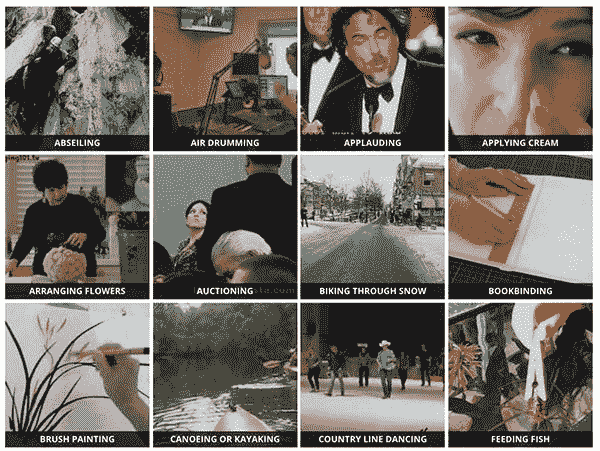
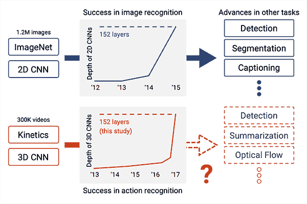
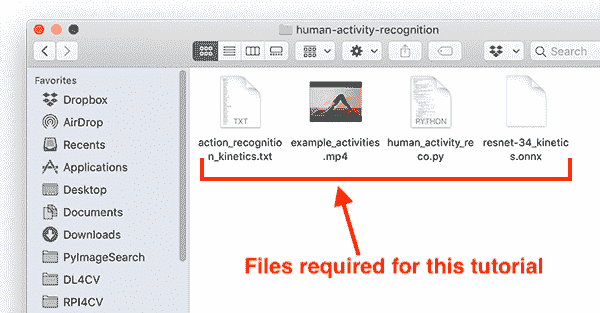
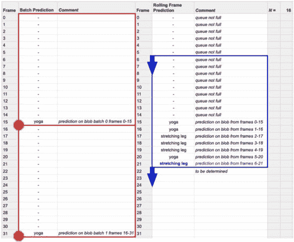

# 基于 OpenCV 和深度学习的人体行为识别

> 原文：<https://pyimagesearch.com/2019/11/25/human-activity-recognition-with-opencv-and-deep-learning/>

在本教程中，您将学习如何使用 OpenCV 和深度学习来执行人体活动识别。

我们的人体活动识别模型可以识别超过 400 个活动的**， **78.4-94.5%的准确率**(取决于任务)。**

 **活动示例如下:

* * *

人类活动识别的实际应用包括:

*   对磁盘上的视频数据集进行自动分类。
*   培训和监督新员工正确执行任务(例如制作比萨饼时的正确步骤和程序，包括擀面团、加热烤箱、放上调味汁、奶酪、浇头等。).
*   验证餐饮服务人员在去洗手间或处理可能导致交叉污染的食物后是否洗手(即鸡肉和沙门氏菌)。
*   监控酒吧/餐厅顾客，确保他们不会被过度服务。

**要学习如何用 OpenCV 和深度学习进行人体活动识别，*继续阅读！***

## 基于 OpenCV 和深度学习的人体行为识别

在本教程的第一部分，我们将讨论动力学数据集，该数据集用于训练我们的人类活动识别模型。

在那里，我们将讨论如何扩展 ResNet，它通常使用 2D 内核，而不是利用 3D 内核，使我们能够包括用于活动识别的时空组件。

然后，我们将使用 OpenCV 库和 Python 编程语言实现两个版本的人类活动识别。

最后，我们将通过查看将人类活动识别应用于几个示例视频的结果来结束本教程。

### 动力学数据集

[](https://pyimagesearch.com/wp-content/uploads/2019/11/human_activity_reco_kinetics_dataset.jpg)

**Figure 1:** The pre-trained human activity recognition deep learning model used in today’s tutorial was trained on the [Kinetics 400 dataset](https://arxiv.org/abs/1705.06950).

我们的人类活动识别模型被训练的数据集是 [Kinetics 400 数据集](https://arxiv.org/abs/1705.06950)。

该数据集包括:

*   400 个人类活动识别类
*   每堂课至少 400 个视频剪辑(通过 YouTube 下载)
*   总共 30 万个视频

你可以在这里查看模型可以识别的类的完整列表[。](https://github.com/opencv/opencv/blob/master/samples/data/dnn/action_recongnition_kinetics.txt)

要了解更多关于数据集的信息，包括它是如何策划的，请务必参考凯等人 2017 年的论文， [*《动力学人体动作视频数据集*](https://arxiv.org/abs/1705.06950) 》。

### 用于人体活动识别的 3D ResNet

[](https://pyimagesearch.com/wp-content/uploads/2019/11/human_activity_reco_success.png)

**Figure 2:** Deep neural network advances on image classification with ImageNet have also led to success in deep learning activity recognition (i.e. on videos). In this tutorial, we perform deep learning activity recognition with OpenCV. (image source: [Figure 1 from Hara et al.](https://arxiv.org/abs/1711.09577))

我们正在使用的人体活动识别模型来自 Hara 等人 2018 年的 CVPR 论文， [*时空 3D CNNs 能否追溯 3D CNNs 和 ImageNet 的历史？*](https://arxiv.org/abs/1711.09577)

在这项工作中，作者探索了现有的最先进的 2D 架构(如 ResNet，ResNeXt，DenseNet 等)。)可以通过 3D 内核扩展到视频分类。

作者认为:

*   这些体系结构已经成功地应用于图像分类。
*   大规模 ImageNet 数据集允许这样的模型被训练到如此高的精度。
*   动力学数据集也足够大。

**…因此，这些架构应该能够通过(1)改变输入体积形状以包括时空信息和(2)利用架构内部的 3D 内核来执行视频分类**。

作者事实上是正确的！

通过修改输入体积形状和内核形状，作者获得:

*   动力学测试集的准确率为 78.4%
*   在 UCF-101 测试集上的准确率为 94.5%
*   在 HMDB-51 测试集上的准确率为 70.2%

**这些结果类似于在 ImageNet 上训练的最先进模型上报告的等级 1 精度，**从而证明这些模型架构*可以*用于视频分类，只需包括时空信息并将 2D 核替换为 3D 核。

有关我们改进的 ResNet 架构、实验设计和最终精度的更多信息，请务必参考该论文。

### 为 OpenCV 下载人体活动识别模型

[](https://pyimagesearch.com/wp-content/uploads/2019/11/human_activity_reco_directory_structure.png)

**Figure 3:** Files required for human activity recognition with OpenCV and deep learning.

要完成本教程的其余部分，您需要下载:

1.  人类活动模型
2.  Python + OpenCV 源代码
3.  用于分类的示例视频

**你可以使用本教程的 ***【下载】*** 部分下载包含这三个文件的. zip 文件。**

下载完成后，继续本教程的剩余部分。

### 项目结构

让我们检查我们的项目文件:

```py
$ tree
.
├── action_recognition_kinetics.txt
├── resnet-34_kinetics.onnx
├── example_activities.mp4
├── human_activity_reco.py
└── human_activity_reco_deque.py

0 directories, 5 files

```

我们的项目由三个辅助文件组成:

*   `action_recognition_kinetics.txt`:动力学数据集的类别标签。
*   `resnet-34_kinetics.onx` : Hara 等人在 Kinetics 数据集上训练的预训练和序列化的人体活动识别卷积神经网络。
*   `example_activities.mp4`:测试人体活动识别的剪辑汇编。

我们将回顾两个 Python 脚本，每个脚本都接受上述三个文件作为输入:

*   `human_activity_reco.py`:我们的人体活动识别脚本，它一次采样 *N* 帧，以进行活动分类预测。
*   `human_activity_reco_deque.py`:一个类似的人类活动识别脚本，实现了一个*滚动平均*队列。此脚本运行速度较慢；但是，我提供了实现，以便您可以从中学习和体验。

### 用 OpenCV 实现人体行为识别

让我们继续用 OpenCV 实现人类活动识别。我们的实现是基于 [OpenCV 的官方例子](https://github.com/opencv/opencv/blob/master/samples/dnn/action_recognition.py)；然而，我已经提供了额外的修改(在这个例子和下一个例子中),以及关于代码正在做什么的额外注释/详细解释。

打开项目结构中的`human_activity_reco.py`文件，插入以下代码:

```py
# import the necessary packages
import numpy as np
import argparse
import imutils
import sys
import cv2

# construct the argument parser and parse the arguments
ap = argparse.ArgumentParser()
ap.add_argument("-m", "--model", required=True,
	help="path to trained human activity recognition model")
ap.add_argument("-c", "--classes", required=True,
	help="path to class labels file")
ap.add_argument("-i", "--input", type=str, default="",
	help="optional path to video file")
args = vars(ap.parse_args())

```

我们从第 2-6 行的**导入开始。对于今天的教程，你需要安装 OpenCV 4 和 imutils。如果您还没有安装 opencv，请访问我的 [pip install opencv](https://pyimagesearch.com/2018/09/19/pip-install-opencv/) 说明在您的系统上安装 OpenCV。**

**第 10-16 行** [解析我们的命令行参数](https://pyimagesearch.com/2018/03/12/python-argparse-command-line-arguments/):

*   `--model`:训练好的人类活动识别模型的路径。
*   `--classes`:活动识别类标签文件的路径。
*   `--input`:输入视频文件的可选路径。如果命令行中不包含此参数，将调用您的网络摄像机。

从这里开始，我们将执行初始化:

```py
# load the contents of the class labels file, then define the sample
# duration (i.e., # of frames for classification) and sample size
# (i.e., the spatial dimensions of the frame)
CLASSES = open(args["classes"]).read().strip().split("\n")
SAMPLE_DURATION = 16
SAMPLE_SIZE = 112

```

第 21 行从文本文件中加载我们的类标签。

**第 22 行和第 23 行**定义了样本持续时间(即用于分类的帧数)和样本大小(即帧的空间尺寸)。

接下来，我们将加载并初始化我们的人类活动识别模型:

```py
# load the human activity recognition model
print("[INFO] loading human activity recognition model...")
net = cv2.dnn.readNet(args["model"])

# grab a pointer to the input video stream
print("[INFO] accessing video stream...")
vs = cv2.VideoCapture(args["input"] if args["input"] else 0)

```

**第 27 行**使用 OpenCV 的 DNN 模块读取 PyTorch *预训练的*人体活动识别模型。

然后使用视频文件或网络摄像头实例化我们的视频流。

我们现在准备开始循环帧并执行人体活动识别:

```py
# loop until we explicitly break from it
while True:
	# initialize the batch of frames that will be passed through the
	# model
	frames = []

	# loop over the number of required sample frames
	for i in range(0, SAMPLE_DURATION):
		# read a frame from the video stream
		(grabbed, frame) = vs.read()

		# if the frame was not grabbed then we've reached the end of
		# the video stream so exit the script
		if not grabbed:
			print("[INFO] no frame read from stream - exiting")
			sys.exit(0)

		# otherwise, the frame was read so resize it and add it to
		# our frames list
		frame = imutils.resize(frame, width=400)
		frames.append(frame)

```

**第 34 行**开始在我们的帧上循环，首先我们初始化将通过神经网络传递的那批`frames`(**第 37 行**)。

从那里，**行 40-53** 直接从我们的视频流中填充一批`frames`。**线 52** 在*保持纵横比*的同时，将每一帧的大小调整为一个`400`像素的`width`。

让我们构建我们的`blob`输入帧，我们将很快通过人类活动识别 CNN:

```py
	# now that our frames array is filled we can construct our blob
	blob = cv2.dnn.blobFromImages(frames, 1.0,
		(SAMPLE_SIZE, SAMPLE_SIZE), (114.7748, 107.7354, 99.4750),
		swapRB=True, crop=True)
	blob = np.transpose(blob, (1, 0, 2, 3))
	blob = np.expand_dims(blob, axis=0)

```

**第 56-60 行**从我们的输入`frames`列表中构造一个`blob`。

**请注意，我们使用的是`blobFromImages`(即复数)*而不是*`blobFromImage`(即单数)函数**——这里的原因是我们正在构建一批*多幅图像*以通过人类活动识别网络，使其能够利用时空信息。

如果您要在代码中插入一个`print(blob.shape)`语句，您会注意到`blob`具有以下维度:

`(1, 3, 16, 112, 112)`

让我们更深入地分析一下这个维度:

*   `1`:批量维度。这里我们只有一个正在通过网络传递的*单个数据点*(本文中的“数据点”是指将通过网络传递以获得*单个*分类的 *N 个*帧)。
*   `3`:我们输入帧中的通道数。
*   `16`:`blob`中`frames`的总数。
*   `112`(第一次出现):帧的高度。
*   `112`(第二次出现):帧的宽度。

此时，我们准备好执行**人类活动识别推理**，然后用预测标签注释帧，并在屏幕上显示预测:

```py
	# pass the blob through the network to obtain our human activity
	# recognition predictions
	net.setInput(blob)
	outputs = net.forward()
	label = CLASSES[np.argmax(outputs)]

	# loop over our frames
	for frame in frames:
		# draw the predicted activity on the frame
		cv2.rectangle(frame, (0, 0), (300, 40), (0, 0, 0), -1)
		cv2.putText(frame, label, (10, 25), cv2.FONT_HERSHEY_SIMPLEX,
			0.8, (255, 255, 255), 2)

		# display the frame to our screen
		cv2.imshow("Activity Recognition", frame)
		key = cv2.waitKey(1) & 0xFF

		# if the `q` key was pressed, break from the loop
		if key == ord("q"):
			break

```

**行 64 和 65** 通过网络传递`blob`，获得一个`outputs`列表，即预测。

然后我们为`blob` ( **第 66 行**)抓取最高预测的`label`。

使用`label`，我们可以对`frames`列表中的每一帧进行预测(**第 69-73 行**)，显示输出帧，直到按下`q`键，此时我们`break`退出。

### 使用 Deque 数据结构的替代人工活动实现

在上一节的人类活动识别中，您会注意到下面几行:

```py
# loop until we explicitly break from it
while True:
	# initialize the batch of frames that will be passed through the
	# model
	frames = []

	# loop over the number of required sample frames
	for i in range(0, SAMPLE_DURATION):
		# read a frame from the video stream
		(grabbed, frame) = vs.read()

		# if the frame was not grabbed then we've reached the end of
		# the video stream so exit the script
		if not grabbed:
			print("[INFO] no frame read from stream - exiting")
			sys.exit(0)

		# otherwise, the frame was read so resize it and add it to
		# our frames list
		frame = imutils.resize(frame, width=400)
		frames.append(frame)

```

这种实现意味着:

*   我们从输入视频中读取总共`SAMPLE_DURATION`帧。
*   我们将这些帧通过我们的人类活动识别模型来获得输出。
*   然后我们读取另一个`SAMPLE_DURATION`帧并重复这个过程。

**因此，我们的实现是*而不是*一个滚动预测。**

相反，它只是抓取一个帧样本，对它们进行分类，然后进入下一批——**前一批中的任何帧都被*丢弃。***

我们这样做的原因是为了 ***速度*** 。

如果我们对每个单独的帧进行分类，那么脚本运行的时间会更长。

也就是说，通过[队列数据结构](https://docs.python.org/3/library/collections.html#collections.deque) *使用滚动帧预测可以*产生更好的结果，因为它不会丢弃所有先前的帧——**滚动帧预测仅丢弃列表中最老的帧，为最新的*帧腾出空间。***

为了了解这如何导致与推断速度相关的问题，让我们假设一个视频文件中有`N`个总帧数:

*   **如果我们*使用*滚动帧预测，**我们执行`N`分类，每个帧一个分类(当然，一旦`deque`数据结构被填充)
*   **如果我们*不*使用滚动帧预测，**我们只需执行`N / SAMPLE_DURATION`分类，从而显著减少处理视频流*所需的时间。*

[](https://pyimagesearch.com/wp-content/uploads/2019/11/human_activity_rolling_average.jpg)

**Figure 4:** Rolling prediction (*blue*) uses a fully populated FIFO queue window to make predictions. Batch prediction (*red*) does not “roll” from frame to frame. Rolling prediction requires more computational horsepower but leads to better results for human activity recognition with OpenCV and deep learning.

鉴于 OpenCV 的`dnn`模块*不*支持大多数 GPU(包括 NVIDIA GPUs)，我会建议你*不要*对大多数应用使用滚动帧预测。

也就是说在。今天教程的 zip 文件(可以在帖子的 ***“下载”*** 部分找到)你会发现一个名为`human_activity_reco_deque.py`的文件——这个文件包含了一个人体活动识别的实现，这个识别是**执行滚动帧预测的。**

该脚本与上一个脚本非常相似，但是我在这里包含它是为了让您进行试验:

```py
# import the necessary packages
from collections import deque
import numpy as np
import argparse
import imutils
import cv2

# construct the argument parser and parse the arguments
ap = argparse.ArgumentParser()
ap.add_argument("-m", "--model", required=True,
	help="path to trained human activity recognition model")
ap.add_argument("-c", "--classes", required=True,
	help="path to class labels file")
ap.add_argument("-i", "--input", type=str, default="",
	help="optional path to video file")
args = vars(ap.parse_args())

# load the contents of the class labels file, then define the sample
# duration (i.e., # of frames for classification) and sample size
# (i.e., the spatial dimensions of the frame)
CLASSES = open(args["classes"]).read().strip().split("\n")
SAMPLE_DURATION = 16
SAMPLE_SIZE = 112

# initialize the frames queue used to store a rolling sample duration
# of frames -- this queue will automatically pop out old frames and
# accept new ones
frames = deque(maxlen=SAMPLE_DURATION)

# load the human activity recognition model
print("[INFO] loading human activity recognition model...")
net = cv2.dnn.readNet(args["model"])

# grab a pointer to the input video stream
print("[INFO] accessing video stream...")
vs = cv2.VideoCapture(args["input"] if args["input"] else 0)

```

除了 Python 内置的来自`collections`模块的`deque`实现(**行 2** )之外，导入是相同的。

在**第 28 行**上，我们初始化 FIFO `frames`队列，其最大长度等于我们的样本持续时间。我们的“先进先出”(FIFO)队列将自动弹出旧帧并接受新帧。我们将对帧队列执行滚动推理。

上面的所有其他行都是一样的，所以现在让我们检查一下我们的帧处理循环:

```py
# loop over frames from the video stream
while True:
	# read a frame from the video stream
	(grabbed, frame) = vs.read()

	# if the frame was not grabbed then we've reached the end of
	# the video stream so break from the loop
	if not grabbed:
		print("[INFO] no frame read from stream - exiting")
		break

	# resize the frame (to ensure faster processing) and add the
	# frame to our queue
	frame = imutils.resize(frame, width=400)
	frames.append(frame)

	# if our queue is not filled to the sample size, continue back to
	# the top of the loop and continue polling/processing frames
	if len(frames) < SAMPLE_DURATION:
		continue

```

第 41-57 行与我们之前的脚本不同。

之前，我们对一批`SAMPLE_DURATION`帧进行了采样，稍后将对该批帧进行推断。

在这个脚本中，我们仍然批量执行推理；不过，现在是*滚批*。不同之处在于，我们将帧添加到第 52 行的【FIFO 队列中。同样，这个队列有一个我们的采样持续时间的`maxlen`,队列的头将总是我们视频流的当前`frame`。一旦队列填满，旧帧会自动弹出，并执行队列 FIFO。

这种滚动实现的结果是，一旦队列满了，任何给定的帧(除了第一帧之外)都将被“触摸”(即包括在滚动批次中)不止一次。这种方法效率较低；然而，它导致更准确的活动识别，尤其是当视频/场景的活动周期性变化时。

**行 56 和 57** 允许我们的`frames`队列在执行任何推断之前填满(即图 4**、*蓝色*所示的 16 帧)。**

一旦队列满了，我们将执行滚动的人类活动识别预测:

```py
	# now that our frames array is filled we can construct our blob
	blob = cv2.dnn.blobFromImages(frames, 1.0,
		(SAMPLE_SIZE, SAMPLE_SIZE), (114.7748, 107.7354, 99.4750),
		swapRB=True, crop=True)
	blob = np.transpose(blob, (1, 0, 2, 3))
	blob = np.expand_dims(blob, axis=0)

	# pass the blob through the network to obtain our human activity
	# recognition predictions
	net.setInput(blob)
	outputs = net.forward()
	label = CLASSES[np.argmax(outputs)]

	# draw the predicted activity on the frame
	cv2.rectangle(frame, (0, 0), (300, 40), (0, 0, 0), -1)
	cv2.putText(frame, label, (10, 25), cv2.FONT_HERSHEY_SIMPLEX,
		0.8, (255, 255, 255), 2)

	# display the frame to our screen
	cv2.imshow("Activity Recognition", frame)
	key = cv2.waitKey(1) & 0xFF

	# if the `q` key was pressed, break from the loop
	if key == ord("q"):
		break

```

该代码块包含与我们之前的脚本相同的代码行。在这里我们:

*   从我们的`frames`队列中构造一个`blob`。
*   执行推理并抓取`blob`的最高概率预测。
*   用滚动平均人体活动识别的结果`label`注释并显示当前`frame`。
*   按下`q`键后退出。

### 人类活动识别结果

让我们看看我们的人类活动识别代码的实际效果！

使用本教程的 ***“下载”*** 部分下载预先训练好的人体活动识别模型、Python + OpenCV 源代码和示例演示视频。

从那里，打开一个终端并执行以下命令:

```py
$ python human_activity_reco_deque.py --model resnet-34_kinetics.onnx \
	--classes action_recognition_kinetics.txt \
	--input example_activities.mp4
[INFO] loading human activity recognition model...
[INFO] accessing video stream...

```

**请注意，我们的人体活动识别模型要求*至少是* OpenCV 4.1.2。**

如果您运行的是旧版本的 OpenCV，您将收到以下错误:

```py
net = cv2.dnn.readNet(args["model"])
cv2.error: OpenCV(4.1.0) /Users/adrian/build/skvark/opencv-python/opencv/modules/dnn/src/onnx/onnx_importer.cpp:245: error: (-215:Assertion failed) attribute_proto.ints_size() == 2 in function 'getLayerParams'

```

如果您收到该错误，您需要将 OpenCV 安装程序至少升级到 OpenCV 4.1.2。

下面是一个例子，我们的模型正确地将一个输入视频剪辑标记为*“yoga”*

注意模型如何在*【瑜伽】*和*【伸展腿】*之间来回摆动——这两种姿势在技术上都是正确的，因为按照定义，你在做瑜伽，但同时也在伸展你的腿。

在下一个示例中，我们的人类活动识别模型正确地将该视频预测为*“滑板”*:

你可以看到为什么这个模型也预测了*“跑酷”*——溜冰者正在跳过栏杆，这类似于公园游客可能会做的动作。

有人饿了吗？

如果是这样，你可能会对*“做披萨”*感兴趣:

但是在你吃饭之前，在你坐下来吃饭之前，确保你已经“洗手”了:

如果你选择沉迷于*【喝啤酒】*你最好注意你喝了多少——酒保可能会打断你:**