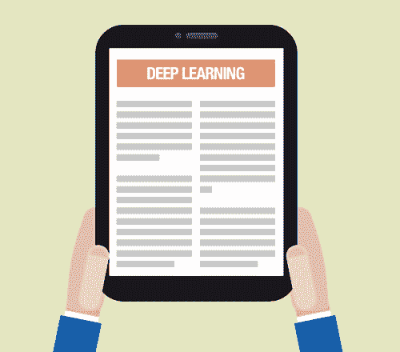
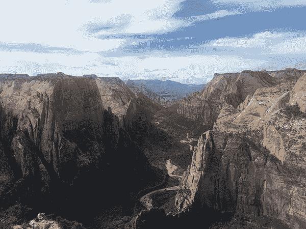

# 我正在写一本关于深度学习和卷积神经网络的书(我需要你的建议)。

> 原文：<https://pyimagesearch.com/2016/12/12/im-writing-a-book-on-deep-learning-and-convolutional-neural-networks-and-i-need-your-advice/>

你可能听过我在 PyImageSearch 博客上的评论中提到它…

也许我甚至在一对一的邮件中暗示过…

或者也许你只是因为最近博客上深度学习/神经网络教程的上升而看到了墙上的文字…

**但是我今天在这里告诉你，谣言是真的:**

我正在写一本关于深度学习**的新书，重点是:**

 ***   ***神经网络和机器学习。***
*   ***卷积神经网络(CNN)。***
*   ***深度学习的物体检测/定位。***
*   ***训练大规模(ImageNet 级)网络。***
*   ***使用 Python 编程语言和 Keras + mxnet 库进行实际操作。***

如你所见，这本书将主要关注在*图像分类和理解背景下的深度学习。*虽然深度学习有许多方面，但我觉得更有资格(也最有能力)写一本深度学习的书*专门针对卷积神经网络和图像分类的*(因此也是与计算机视觉的一般关系)。

***但在我出版这本书之前，我需要你的帮助……***

首先，我还没有确定这本书的名字。我将在下周发送一封电子邮件，附上一份调查来确定书名，所以如果你有兴趣帮助命名这本书，请继续关注这封电子邮件。

在这本书被命名后，我将在 2017 年 1 月中旬**发起 Kickstarter 活动，以完成对深度学习书的资助。**

 **一旦资金到位，我*完全打算*在 2017 年**夏秋*完成**出版*这本书。**

 **要了解更多即将出版的《深度学习+卷积神经网络+图像分类》一书，更重要的是 ***借你的观点帮助塑造《T2》***一书的未来，继续阅读。

## 我需要你对我即将出版的深度学习书籍的建议

每年我都会进行三天的“静修”。

我冒险去了美国西部的一个国家公园(通常在犹他州、亚利桑那州或内华达州的某个地方)。

我一个人坐在*天使降落*、*地铁*，甚至*观测点*的山峰上，完全断开连接:

**Figure 1:** Sitting on top of Observation Point, contemplating life, existence…*and what to put in the upcoming Deep Learning book.*

除了我背上的衣服、我的徒步装备以及食物和水的供应，我基本上是“裸体的”——我没有带我的笔记本电脑、iPad 或任何电子产品(除了一部手机，关机，安全防水并埋在包里以备不时之需)。

我坐在那里俯瞰壮丽的景色，只有两种“自然”资源:我的笔和笔记本。

大约 6 个月前，我参加了一次为期 3 天的静修，花了*个小时*沉浸在思考中，思考我应该在这本即将出版的深度学习+图像分类书中涵盖哪些主题。

这些日子是我一生中最有收获、最有成效的时期。

仅仅徒步旅行了 3 天，我的笔记本上就有了 60 多页的笔记。

我旅行一回到家，就立刻开始写这本书。

我开始写代码。

收集结果。

我现在很高兴地说，我已经编写了超过 70%的项目代码*，并收集了超过 60%的结果*，这些结果是将这本深度学习+卷积神经网络的书放在一起所需要的…**

 **但是我需要你的帮助来走完剩下的路。

任何成功的作家、企业家或企业主(尤其是在高度技术化的领域)都会告诉你，与你的观众分享你正在做的事情/创造的东西的重要性，这样他们就可以为你提供反馈、意见和见解。

你最不想做的事情就是写一本没人想要的书(或者开发一个产品)。

我没什么不同。

**为了让这本深度学习的书成功，*我需要你们的帮助。***

在接下来的部分，我已经包括了我计划在这本深度学习书中涵盖的内容的草图。

这个草图绝不是最终定稿，但它*确实*反映了我认为在一本专注于深度学习、卷积神经网络和图像分类的书中需要回顾的重要内容。

看看这个话题列表，然后一定要给我发电子邮件，[给我发消息](https://pyimagesearch.com/contact/)，或者在这篇文章底部的评论中回复你的反馈/建议。

### 这本深度学习+卷积神经网络的书打算涵盖哪些内容？

我对这本即将出版的深度学习书籍的总体计划是主要关注卷积神经网络(CNN)和使用 Python 编程语言的图像分类/理解。

这本书将*非常详细*，包括学术引文和对当前最先进工作的参考，同时也是*超级实用*和*动手*(有大量代码)，风格与 PyImageSearch 博客的其余部分相同。所有代码示例都将使用 Python 中的 [Keras](https://keras.io/) 或 [mxnet](http://mxnet.io/) 库来完成。

虽然深度学习有许多方面，但我的主要专业领域是计算机视觉和图像分类——因此我认为我写下我所知道的东西很重要。

说到结构化深度学习的书，我会把书分成“层”，就像我对 *[实用 Python 和 OpenCV](https://pyimagesearch.com/practical-python-opencv/)* 所做的那样。

通过将书分成不同的层次，我可以让你(读者)选择最适合你的需求和预算的层次。

这意味着，如果你刚刚开始深度学习，你将能够负担得起一个更便宜的软件包来帮助你跟上速度。

如果你已经在深度学习领域有了经验(或者如果你只是想要*完整的包*，并且想要学习更高级、可扩展的技术，那么你也可以选择更高层的包。

我还没有完全充实每一层/包之间的分界线(虽然我有一个很好的想法)，但是下面你可以找到我计划在书中涉及的主题列表。

如果您对将要涉及的其他主题有任何建议， ***请给我发电子邮件，在这篇博客上发表评论，或者[给我发消息](https://pyimagesearch.com/contact/)。***

### 深度学习+卷积神经网络书籍主题

正如我所承诺的，这里是我计划在这本深度学习+卷积神经网络书中涵盖的主题的大致轮廓。

如果你有一个主题的建议，只需在这个帖子上留下评论或给我发消息，我会看看我们是否能做到！

#### **机器学习基础知识**

*   了解如何设置和配置您的开发环境来研究深度学习。
*   了解图像基础知识，包括坐标系；宽度、高度、深度；和长宽比。
*   回顾用于测试机器学习、深度学习和卷积神经网络算法的流行图像数据集。
*   形成对机器学习基础知识的坚实理解，包括:
    *   简单的 k-NN 分类器。
    *   参数化学习(即“从数据中学习”):
        *   数据和特征向量。
        *   了解评分功能。
        *   损失函数的工作原理。
        *   定义权重矩阵和偏差向量(以及它们如何促进学习)。
    *   基本优化方法(即“学习”实际上是如何完成的)，通过:
        *   梯度下降。
        *   随机梯度下降(SGD)。

#### 神经网络基础

*   探索前馈神经网络架构。
*   手工实现经典感知器算法。
    *   使用感知器算法学习实际的*函数*(并理解感知器算法的局限性)。
*   取一个 ***深入潜*** 进入 ***反向传播算法*** 。
    *   用 Python + NumPy 手工实现反向传播。
    *   利用工作表来帮助你练习这个重要的算法。
*   掌握多层网络(并从头开始训练)。
*   手动实现神经网络*和用 *[Keras 库](https://keras.io/)* 。*

 *#### 卷积神经网络简介

*   理解卷积(以及为什么它们比看起来容易理解)。
*   研究卷积神经网络(它们是用来做什么的，我们为什么要用它们等等。).
*   回顾卷积神经网络的构建模块，包括:
    *   卷积层
    *   激活层
    *   池层
    *   批量标准化
    *   拒绝传统社会的人
    *   *…等等。*
*   发现通用的网络体系结构模式，您可以使用这些模式来设计自己的体系结构，从而最大限度地减少挫折和麻烦。
*   利用现成的 CNN 进行分类，这些 CNN 已经过*预训练*并准备好应用于您自己的图像/图像数据集(VGG16、VGG19、ResNet50 等)。).
*   从头开始训练你的第一个卷积神经网络。
*   从磁盘保存和加载您自己的网络模型。
*   检查您的模型以发现高性能的时代/重新开始训练。
*   了解如何发现欠拟合和过拟合，从而允许您纠正它们并提高分类精度。
*   利用衰减和学习率调度程序。
*   从零开始训练经典的 LeNet 架构来识别手写数字。

#### **使用您自己的数据集**

*   了解如何收集您自己的培训图像。
*   了解如何注释和标注数据集。
*   在你的数据集上训练一个卷积神经网络。
*   评估你的模型的准确性。
*   所有这些都通过演示如何收集、注释和训练 CNN 破解图像验证码来解释。

#### 高级卷积神经网络

*   了解如何使用*转移学习*来:
    *   将预先训练的网络视为特征提取器，以不费吹灰之力获得高分类精度。
    *   利用微调来提高预训练网络的准确性。
    *   应用数据扩充来提高网络分类准确性*而不需要*收集更多的训练数据。
*   了解等级 1 和等级 5 的准确性(以及我们如何使用它们来衡量给定网络的分类能力)。
*   探索如何简单地通过训练多个网络使用*网络集成*来提高分类精度。
*   发现我应用深度学习技术来最大化分类准确性的最佳途径(以及以何种顺序应用这些技术来实现最大的有效性)。

#### 缩放至大型图像数据集

*   了解如何将图像数据集从磁盘上的原始图像转换为 HDF5 格式，从而使网络训练更容易(更快)。
*   实现 *VGGNet 架构*(以及的变体)。
*   对 *AlexNet 架构*进行手工编码，并将其用于:
    *   在[Kaggle Dogs vs . Cats challenge](https://www.kaggle.com/c/dogs-vs-cats)上训练一个网络。
    *   不费吹灰之力就能跻身前 25 名排行榜。
*   利用图像裁剪这种简单的方法来提高测试集的准确性。
*   探索更高级的优化算法，包括:
    *   RMSprop
    *   阿达格拉德
    *   阿达德尔塔
    *   圣经》和《古兰经》传统中）亚当（人类第一人的名字
    *   阿达马斯
    *   那达慕
    *   *…以及如何微调 SGD 参数。*

#### 使用深度学习的物体检测和定位

*   利用朴素的图像金字塔和滑动窗口进行对象检测。
*   训练你自己的 [YOLO 探测器](http://pjreddie.com/darknet/yolo/)实时识别图像/视频流中的物体。

#### ImageNet:大规模视觉识别挑战

*   了解什么是*海量*ImageNet(1000 个类别)数据集以及*为什么*它被认为是*事实上的*图像分类对基准算法的挑战。
*   获取 ImageNet 数据集并将其转换为适合培训的格式。
*   了解如何利用多个 GPU 并行训练您的网络，从而大大减少训练时间。
*   了解如何在 ImageNet 上训练 AlexNet 和 VGGNet 架构。
*   将 SqueezeNet 架构应用到 ImageNet 以获得(高精度)模型，完全可部署到较小的设备，如 Raspberry Pi。

#### **ImageNet:提示和技巧**

*   通过**发现实际有效的学习率计划表*，节省数周(甚至数月)的培训时间。***
*   在 ImageNet 上发现过度拟合并在之前*发现它，你会浪费几个小时(甚至几天)看着你的验证准确性停滞不前。*
*   了解如何从保存的纪元重新开始训练，降低学习率，并提高准确性。
*   解锁深度学习专家用于调整超参数到其网络的相同技术。

#### 个案研究

*   使用深度学习技术训练网络，从图像中预测人的性别和年龄。
*   使用卷积神经网络对汽车的*品牌*和*型号*进行自动分类。
*   使用预先训练的 CNN 确定(并校正)图像方向。

### 你觉得怎么样？

正如你所看到的，这是一本相当于深度学习+卷积神经网络+图像分类的书。

如果您对应该(甚至不应该)涉及的话题有任何反馈或建议，请随时[联系我](https://pyimagesearch.com/contact/)或在这篇博文的底部留下评论。

### 为什么是 Kickstarter 活动？

在接下来的几周内，我会有更多关于即将到来的深度学习新书 Kickstarter 活动的细节，但因为我知道我现在会被问到这个问题，所以我想就此说几句。

首先，我喜欢 Kickstarter 活动。

这是一种向你的观众以外的人传播项目信息的极好方式(如果项目成功获得资助，这在 T2 尤其如此)。

其次，我已经有了在 Kickstarter 上开展活动的经验。

也许没有多少读者知道这一点，但是 [PyImageSearch 大师课程](https://pyimagesearch.com/pyimagesearch-gurus/)最初是由 2015 年的 [Kickstarter 活动资助的。](https://www.kickstarter.com/projects/1186001332/pyimagesearch-gurus-become-a-computer-vision-openc/)

如果没有这个 Kickstarter 活动，我就没有必要的资金来投入写作、课程软件许可和整合整个课程体验。

在这本深度学习书籍的背景下，我将在 Kickstarter 上开展一项活动，为亚马逊 EC2 生态系统中的(额外)GPU 实例筹集资金。

我已经有了我的 [NVIDIA DIGITS DevBox](https://pyimagesearch.com/2016/06/06/hands-on-with-the-nvidia-digits-devbox-for-deep-learning/) ，它已经昼夜不停地运行了近 6 个月，进行实验并收集结果——*，但最终，它仍然只是一台机器。*

我运行*更快*的*更多* GPU 实例我可以收集结果，因此允许我更快地发布深度学习书籍*。*

这些 GPU 实例也不便宜。

亚马逊 EC2 上的 px.8xlarge (8 个 GPU)和 p2.16xlarge (16 个 GPU)分别为每小时 7.20 美元和 14.40 美元。

我想强调的一点是，作为这本书的读者，你*不会*必须使用高端 GPU*或*预计将访问它们。

这本书的基本章节将很容易在您的 CPU 上运行，而更高级的章节可以利用更多基于商品的 GPU。

相反，我在 EC2 生态系统中使用更高层 GPU 实例的目的是，我将能够更快地发布深度学习书籍(更重要的是，*更快地将它拿在手中*)。

## 有兴趣了解更多信息吗？

要了解即将出版的《深度学习+卷积神经网络》一书，请点击以下按钮并输入您的电子邮件地址:

随着书籍的更新，我还会发送一份简短的调查，帮助 ***在下周内给书*** 命名，所以请务必留意你的收件箱——**我真的需要你的意见！**

## 请记住:我写这本书是为了你。

我想通过说我正在为你写这本深度学习的书来结束这篇文章。

如果你看到任何你想写进书里的话题，请给我发电子邮件，[给我发信息](https://pyimagesearch.com/contact/)，或者在下面的评论区发帖。

我不能保证我能够满足所有(甚至大部分)的请求/建议，但是我会尽我最大的努力考虑所有的意见和建议，以帮助使这本书成为今天最好的*深度学习书籍。*

 *请留意您的收件箱中的书名调查，否则我会在一月初带着 Kickstarter 活动和书籍主题列表的最终细节回来。**********