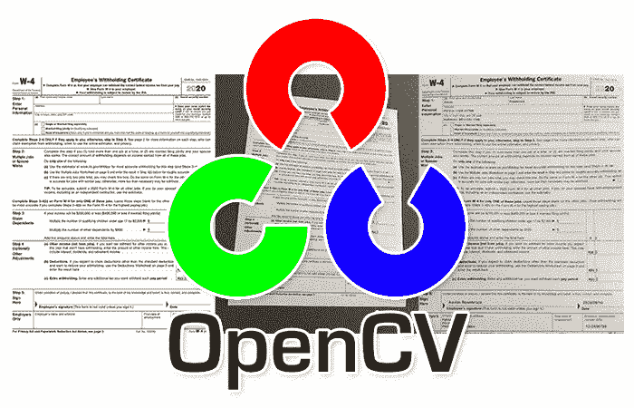

# 使用 OpenCV 进行图像对齐和配准

> 原文：<https://pyimagesearch.com/2020/08/31/image-alignment-and-registration-with-opencv/>

在本教程中，您将学习如何使用 OpenCV 执行图像对齐和图像配准。



图像对齐和配准有许多实际的真实使用案例，包括:

*   **医学:** MRI 扫描、SPECT 扫描和其他医学扫描产生多个图像。为了帮助医生和内科医生更好地解释这些扫描，图像配准可以用于*将多个图像对齐*在一起，并将它们叠加在彼此之上。从那里，医生可以读取结果，并提供更准确的诊断。
*   **军用:**自动目标识别(ATR)算法接受目标的多个输入图像，将它们对齐，并细化其内部参数，以提高目标识别能力。
*   **光学字符识别(OCR):** 图像对齐(在 OCR 环境中通常称为文档对齐)可用于构建自动表单、发票或收据扫描仪。我们首先将输入图像与我们要扫描的文档的模板对齐。OCR 算法可以从每个单独的字段中读取文本。

在本教程的上下文中，我们将从**文档对齐/配准**的角度来看图像对齐，这通常用于光学字符识别(OCR)应用。

今天，我们将讨论图像配准和对齐的基础知识。下周，我们将把图像对齐与光学字符识别(OCR)结合起来，使我们能够创建一个文档、表格和发票扫描仪，它将输入图像与模板文档对齐，然后从文档中的每个字段提取文本。

***注:**本教程的部分内容将出现在我即将出版的新书 [OCR with OpenCV、Tesseract 和 Python](https://pyimagesearch.com/ocr-with-opencv-tesseract-and-python/)* 中。

**要了解如何使用 OpenCV 执行图像对齐和配准，*请继续阅读。***

## **使用 OpenCV 进行图像对齐和配准**

在本教程的第一部分，我们将简要讨论什么是图像对齐和注册。我们将了解 OpenCV 如何使用关键点检测器、局部不变描述符和关键点匹配来帮助我们对齐和注册图像。

准备好开始了吗？

那我们开始吧！

### **什么是图像对齐和配准？**

图像对齐和配准的过程是:

1.  接受两幅输入图像，这两幅图像包含相同的物体，但视角略有不同
2.  自动计算用于对齐图像的单应矩阵(无论是基于特征的关键点对应、相似性度量，还是*自动*学习变换的深度神经网络)
3.  采用该单应矩阵并应用透视变形来将图像对准在一起

例如，让我们考虑下图:

在**图 1** ( *左)*中，我们有一个 W-4 表格的模板，这是一个美国国税局(IRS)的税务表格，员工填写该表格，以便雇主知道从他们的薪水中扣缴多少税(取决于扣除额、申报状态等)。).

我用虚假数据填写了部分 W-4 表格，然后用手机拍了一张照片*(中间)。*

最后，您可以在*右侧的* — **看到输出图像的对齐和配准。请注意输入图像现在是如何与模板对齐的。**

在下周的教程中，您将学习如何从输入文档中 OCR 每个单独的字段，并将它们与模板中的字段相关联。不过现在，我们将只学习如何将表单与其模板对齐，这是应用 OCR 之前的一个重要预处理步骤。

当我们从 OCR 的角度检查图像对齐和注册时，请注意同样的原则也适用于其他领域。

### OpenCV 如何帮助图像对齐和配准？

有许多图像对齐和配准算法:

*   最流行的图像对齐算法是**基于特征的**，包括关键点检测器(DoG、Harris、GFFT 等。)、局部不变描述符(SIFT、SURF、ORB 等。)，以及关键点匹配(RANSAC 及其变体)。
*   医学应用通常使用**相似性度量**进行图像配准，通常是互相关、强度差平方和以及互信息。
*   随着神经网络的重新兴起，**深度学习**甚至可以通过自动学习单应变换来用于图像对齐。

我们将使用基于特征的方法实现图像对齐和配准。

基于特征的方法从检测两个输入图像中的关键点开始:

关键点意味着识别输入图像的显著区域。

对于每个关键点，我们提取局部不变描述符，这些描述符*量化*输入图像中每个关键点周围的区域。

例如，SIFT 特征是 128 维的，所以如果我们在给定的输入图像中检测到 528 个关键点，那么我们将总共有 528 个向量，每个向量都是 128 维的。

给定我们的特征，我们应用诸如 [RANSAC](https://en.wikipedia.org/wiki/Random_sample_consensus) 的算法来匹配我们的关键点并确定它们的对应关系:

假设我们有足够的关键点匹配和对应，我们可以计算一个[单应矩阵](https://docs.opencv.org/master/d9/dab/tutorial_homography.html)，它允许我们应用透视变形来对齐图像:

在本教程的剩余部分，您将学习如何构建一个 OpenCV 项目，通过单应矩阵完成图像对齐和配准。

有关单应矩阵构建及其在计算机视觉中的作用的更多详细信息，请务必参考该 OpenCV 参考资料。

### **配置您的 OCR 开发环境**

如果您尚未配置 TensorFlow 和上周教程中的相关库，我首先建议您遵循下面链接的相关教程:

*   [*如何在 Ubuntu 上安装 tensor flow 2.0*](https://pyimagesearch.com/2019/12/09/how-to-install-tensorflow-2-0-on-ubuntu/)
*   [*如何在 macOS 上安装 tensor flow 2.0*](https://pyimagesearch.com/2019/12/09/how-to-install-tensorflow-2-0-on-macos/)

上面的教程将帮助您在一个方便的 Python 虚拟环境中，用这篇博客文章所需的所有软件来配置您的系统。

### **项目结构**

花点时间找到本教程的 ***【下载】*** 部分，并获取我们今天将在这里使用的代码和示例税表。在里面，您会发现以下内容:

```py
$ tree --dirsfirst 
.
├── pyimagesearch
│   ├── alignment
│   │   ├── __init__.py
│   │   └── align_images.py
│   └── __init__.py
├── scans
│   ├── scan_01.jpg
│   └── scan_02.jpg
├── align_document.py
└── form_w4.png

3 directories, 7 files
```

对于本教程，我们有一个简单的项目结构，由以下图像组成:

*   ``scans/`` :包含两张税单的 JPG 测试照片
*   ``form_w4.png``:2020 年美国国税局 W-4 表格的模板图像

此外，我们将回顾两个 Python 文件:

*   持有我们的助手函数，它通过 OpenCV 管道将扫描与模板对齐
*   ``align_document.py`` :主目录中的驱动文件，它将所有的部分放在一起，用 OpenCV 执行图像对齐和注册

在下一节中，我们将实现对齐图像的辅助工具。

### **使用 OpenCV 和关键点匹配对齐图像**

我们现在准备使用 OpenCV 实现图像对齐和注册。出于本节的目的，我们将尝试对齐以下图像:

在*左侧*我们有我们的 W-4 表格模板，而在*右侧*我们有一份我已经填写好并用手机拍摄的 W-4 表格样本。

最终目标是对齐这些图像，使它们的字段匹配(允许我们在下周的教程中对每个字段进行 OCR)。

我们开始吧！

打开`align_images.py`，让我们一起编写脚本:

```py
# import the necessary packages
import numpy as np
import imutils
import cv2

def align_images(image, template, maxFeatures=500, keepPercent=0.2,
	debug=False):
	# convert both the input image and template to grayscale
	imageGray = cv2.cvtColor(image, cv2.COLOR_BGR2GRAY)
	templateGray = cv2.cvtColor(template, cv2.COLOR_BGR2GRAY)
```

我们的助手脚本需要 [OpenCV](https://opencv.org/) 和[imutils](https://github.com/jrosebr1/imutils)；您可以按照上面的*“配置您的 OCR 开发环境”*小节在您的系统上安装这两个软件包。NumPy 是 OpenCV 的必备组件，也将被安装。

假设我们已经定义了我们的函数，让我们实现我们的图像处理管道。开始时，我们采取的第一个动作是将我们的`image`和`template`都转换成灰度(**第 9 行和第 10 行**)。

接下来，我们将检测关键点，提取局部二进制特征，并在输入图像和模板之间关联这些特征:

```py
	# use ORB to detect keypoints and extract (binary) local
	# invariant features
	orb = cv2.ORB_create(maxFeatures)
	(kpsA, descsA) = orb.detectAndCompute(imageGray, None)
	(kpsB, descsB) = orb.detectAndCompute(templateGray, None)

	# match the features
	method = cv2.DESCRIPTOR_MATCHER_BRUTEFORCE_HAMMING
	matcher = cv2.DescriptorMatcher_create(method)
	matches = matcher.match(descsA, descsB, None)
```

我们使用 [ORB 算法](https://docs.opencv.org/3.4/d1/d89/tutorial_py_orb.html)来检测关键点并提取二元局部不变特征(**第 14-16 行**)。汉明方法计算这些二元特征之间的距离，以找到最佳匹配(**第 19-21 行**)。你可以在我的 *[本地二进制模式与 Python & OpenCV](https://pyimagesearch.com/2015/12/07/local-binary-patterns-with-python-opencv/)* 教程或者我的 [*PyImageSearch 大师课程*](https://pyimagesearch.com/pyimagesearch-gurus/) 中了解更多关于关键点检测和本地二进制模式的知识。

现在我们已经有了关键点`matches`，接下来的步骤包括排序、过滤和显示:

```py
	# sort the matches by their distance (the smaller the distance,
	# the "more similar" the features are)
	matches = sorted(matches, key=lambda x:x.distance)

	# keep only the top matches
	keep = int(len(matches) * keepPercent)
	matches = matches[:keep]

	# check to see if we should visualize the matched keypoints
	if debug:
		matchedVis = cv2.drawMatches(image, kpsA, template, kpsB,
			matches, None)
		matchedVis = imutils.resize(matchedVis, width=1000)
		cv2.imshow("Matched Keypoints", matchedVis)
		cv2.waitKey(0)
```

接下来，在计算我们的单应矩阵之前，我们将执行几个步骤:

```py
	# allocate memory for the keypoints (x, y)-coordinates from the
	# top matches -- we'll use these coordinates to compute our
	# homography matrix
	ptsA = np.zeros((len(matches), 2), dtype="float")
	ptsB = np.zeros((len(matches), 2), dtype="float")

	# loop over the top matches
	for (i, m) in enumerate(matches):
		# indicate that the two keypoints in the respective images
		# map to each other
		ptsA[i] = kpsA[m.queryIdx].pt
		ptsB[i] = kpsB[m.trainIdx].pt
```

给定我们有组织的关键点匹配对，现在我们准备对齐我们的图像:

```py
	# compute the homography matrix between the two sets of matched
	# points
	(H, mask) = cv2.findHomography(ptsA, ptsB, method=cv2.RANSAC)

	# use the homography matrix to align the images
	(h, w) = template.shape[:2]
	aligned = cv2.warpPerspective(image, H, (w, h))

	# return the aligned image
	return aligned
```

恭喜你！您已经完成了教程中最技术性的部分。

***注:**非常感谢 LearnOpenCV 的 Satya 为* [提供的关键点匹配](https://www.learnopencv.com/image-alignment-feature-based-using-opencv-c-python/) *的简洁实现，我们的正是基于此。*

### **实现我们的 OpenCV 图像对齐脚本**

现在我们已经有了`align_images`函数，我们需要开发一个驱动程序脚本:

1.  从磁盘加载图像和模板
2.  执行图像对齐和配准
3.  将对齐的图像显示到我们的屏幕上，以验证我们的图像注册过程是否正常工作

打开`align_document.py`，让我们回顾一下，看看我们如何才能做到这一点:

```py
# import the necessary packages
from pyimagesearch.alignment import align_images
import numpy as np
import argparse
import imutils
import cv2

# construct the argument parser and parse the arguments
ap = argparse.ArgumentParser()
ap.add_argument("-i", "--image", required=True,
	help="path to input image that we'll align to template")
ap.add_argument("-t", "--template", required=True,
	help="path to input template image")
args = vars(ap.parse_args())
```

*   `--image`:输入图像扫描或照片的路径
*   `--template`:我们的模板图像路径；这可能是一个正式的公司表格或在我们的情况下，2020 年国税局 W-4 模板图像

我们的下一步是对齐我们的两个输入图像:

```py
# load the input image and template from disk
print("[INFO] loading images...")
image = cv2.imread(args["image"])
template = cv2.imread(args["template"])

# align the images
print("[INFO] aligning images...")
aligned = align_images(image, template, debug=True)
```

就我们本周的目的而言，我们将以两种方式展示我们的结果:

1.  **并排堆叠**
2.  一个在另一个的顶部重叠

我们结果的这些可视化表示将允许我们确定比对是否成功。

让我们准备好我们的`aligned`图像，用于**堆叠**与其`template`的比较:

```py
# resize both the aligned and template images so we can easily
# visualize them on our screen
aligned = imutils.resize(aligned, width=700)
template = imutils.resize(template, width=700)

# our first output visualization of the image alignment will be a
# side-by-side comparison of the output aligned image and the
# template
stacked = np.hstack([aligned, template])
```

```py
# our second image alignment visualization will be *overlaying* the
# aligned image on the template, that way we can obtain an idea of
# how good our image alignment is
overlay = template.copy()
output = aligned.copy()
cv2.addWeighted(overlay, 0.5, output, 0.5, 0, output)

# show the two output image alignment visualizations
cv2.imshow("Image Alignment Stacked", stacked)
cv2.imshow("Image Alignment Overlay", output)
cv2.waitKey(0)
```

除了上面的并排堆叠可视化，另一个可视化是**覆盖**模板上的输入图像，这样我们就可以很容易地看到错位量。**第 38-40 行**使用 OpenCV 的`cv2.addWeighted`将两幅图像透明地混合成一幅`output`图像，每幅图像的像素具有相同的权重。

最后，我们在屏幕上显示我们的两个可视化(**行 43-45** )。

干得好！现在是检验我们成果的时候了。

### **OpenCV 图像对齐和配准结果**

我们现在准备使用 OpenCV 应用图像对齐和注册！

使用本教程的 ***“下载”*** 部分下载源代码和示例图像。从那里，打开一个终端，并执行以下命令:

```py
$ python align_document.py --template form_w4.png --image scans/scan_01.jpg
[INFO] loading images...
[INFO] aligning images...
```

上面的图像显示了我们的输入图像，`scan_01.jpg` —请注意这张图像是如何用我的智能手机以非 90 度视角拍摄的(即，不是输入图像的俯视鸟瞰图)。

然后，我们应用图像对齐和配准，结果如下:

在*左侧*您可以看到输入图像(校准后)，而*右侧*显示原始 W-4 模板图像。

**注意这两幅图像是如何使用关键点匹配自动对齐的！**

下面可以看到另一种可视化效果:

这里，我们将输出的对齐图像覆盖在模板的顶部。

我们的对齐不是*完美的*(获得像素完美的对齐是非常具有挑战性的，并且在某些情况下是不现实的)，但是表单的字段是充分对齐的，因此我们将能够 OCR 文本并将字段关联在一起(我们将在下周的教程中介绍)。

***注意:*** *我推荐你看一下这里的[全分辨率输出图像](https://pyimagesearch.com/wp-content/uploads/2020/08/image_alignment_opencv_template_scan01_overlay_high_res.jpg)，这样你就可以看到对齐叠加的差异。*

让我们尝试另一个示例图像:

```py
$ python align_document.py --template form_w4.png --image scans/scan_02.jpg
[INFO] loading images...
[INFO] aligning images...
```

`scan_02.jpg`图像包含相同的形式，但以不同的视角拍摄

通过应用图像对齐和配准，我们能够将输入图像与`form_w4.png`模板对齐:

这里你可以看到叠加的可视化效果:

下周，您将学习如何将 OCR 应用于我们的对齐文档，允许我们对每个字段进行 OCR，然后将输入图像中的字段与原始模板相关联。

这将是一个非常棒的教程，你绝对不想错过！

## **总结**

在本教程中，您学习了如何使用 OpenCV 执行图像对齐和配准。

图像对齐有许多用例，包括医学扫描、基于军事的自动目标获取和卫星图像分析。

我们选择从一个最重要的(也是最常用的)目的——**光学字符识别(OCR)来研究图像对齐。**

对输入图像应用图像对齐允许我们将其与模板文档对齐。一旦输入图像与模板对齐，我们就可以应用 OCR 来识别每个单独字段中的文本。因为我们知道文档中每个字段的位置，所以很容易将 OCR 文本与每个字段相关联。

下周，我将向您展示如何使用我们的图像对齐脚本，并将其扩展到 OCR 输入文档中的每个字段。

敬请关注下期帖子；你不会想错过的！

**要下载这篇文章的源代码(并在未来教程在 PyImageSearch 上发布时得到通知)，*只需在下面的表格中输入您的电子邮件地址！***