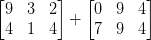
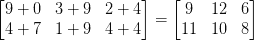

# 图像算法 OpenCV

> 原文：<https://pyimagesearch.com/2021/01/19/image-arithmetic-opencv/>

在本教程中，您将学习如何使用 OpenCV 执行图像运算(加法和减法)。

还记得你在小学学习加减法的时候吗？

事实证明，用图像进行算术运算是非常相似的——当然，只有一些注意事项。

在这篇博文中，您将学习如何添加和减去图像，以及您需要了解的关于 OpenCV 和 Python 中算术运算的两个重要区别。

**要学习如何用 OpenCV 执行图像运算，*继续阅读。***

## **图像运算 OpenCV**

在本指南的第一部分，我们将讨论什么是图像算法，包括您在现实世界应用中看到的图像算法。

从那里，我们将配置我们的开发环境，并审查我们的项目目录结构。

然后，我将向您展示两种执行图像运算的方法:

1.  第一种方式是使用 OpenCV 的`cv2.add`和`cv2.subtract`
2.  第二种方法是使用 NumPy 的基本加减运算符

在这两者之间有*非常重要的*警告你需要理解，所以当你回顾这个教程的时候一定要注意！

### **什么是图像算术？**

图像算法就是简单的矩阵加法(关于数据类型有一个附加的警告，我们将在后面解释)。

让我们花点时间复习一些非常基础的线性代数。假设我们要添加以下两个矩阵:



矩阵加法的输出是什么？

答案就是矩阵元素的*元素和*:



很简单，对吧？

所以在这一点上很明显，我们都知道像加法和减法这样的基本算术运算。但是当处理图像时，我们需要记住我们的*颜色空间*和*数据类型的数值限制。*

例如，RGB 图像具有落在范围*【0，255】*内的像素。**如果我们检查一个亮度为 *250* 的像素，并尝试给它加上 *10* 会发生什么？**

在正常的算术规则下，我们最终得到的值是 *260* 。然而，由于我们将 RGB 图像表示为 8 位无符号整数，它们只能取范围*【0，255】*， **260 是*而不是*有效值。**

那么应该发生什么呢？我们是否应该执行某种检查，以确保没有像素落在*【0，255】*的范围之外，从而将所有像素裁剪为最小值 *0* 和最大值 *255？*

或者我们应用一个模数运算并“回绕”(NumPy 就是这么做的)？在模数规则下，将 *10* 加到 *255* 会简单地绕回一个值 *9* 。

哪种方式是处理超出*【0，255】*范围的图像加减的“正确”方式？

**答案是没有“正确的方法”——**这完全取决于你如何处理你的像素，以及你想要什么样的结果。

然而，一定要记住 OpenCV 和 NumPy 加法是有区别的。NumPy 将执行模数运算和“回绕”另一方面，OpenCV 将执行裁剪，并确保像素值不会超出范围*【0，255】*。

但是不用担心！随着我们探索下面的一些代码，这些细微差别将变得更加清晰。

### **图像算术是用来做什么的？**

现在我们了解了图像算法的基础，你可能想知道在现实世界中我们会在哪里使用图像算法。

基本示例包括:

*   **通过增加或减少设定的量来调整亮度和对比度**(例如，将 *50* 加到所有像素值上以增加图像的亮度)
*   **使用阿尔法混合和透明度，**正如我们在本教程中所做的
*   **创建类似 Instagram 的滤镜** —这些滤镜是应用于像素亮度的简单数学函数

虽然你可能会很快忽略这个图像算法指南，转到更高级的主题，但我强烈建议你详细阅读这个教程。虽然过于简单，但图像算法在许多计算机视觉和图像处理应用中使用(无论你是否意识到)。

### **配置您的开发环境**

要遵循这个指南，您需要在您的系统上安装 OpenCV 库。

幸运的是，OpenCV 可以通过 pip 安装:

```py
$ pip install opencv-contrib-python
```

**如果你需要帮助为 OpenCV 配置开发环境，我*强烈推荐*阅读我的** [***pip 安装 OpenCV* 指南**](https://pyimagesearch.com/2018/09/19/pip-install-opencv/)——它将在几分钟内让你启动并运行。

### **在配置开发环境时遇到了问题？**

说了这么多，你是:

*   时间紧迫？
*   了解你雇主的行政锁定系统？
*   想要跳过与命令行、包管理器和虚拟环境斗争的麻烦吗？
*   **准备好在您的 Windows、macOS 或 Linux 系统上运行代码*****？***

 *那今天就加入 [PyImageSearch 加](https://pyimagesearch.com/pyimagesearch-plus/)吧！

**获得本教程的 Jupyter 笔记本和其他 PyImageSearch 指南，这些指南已经过*预配置*，可以在您的网络浏览器中运行在 Google Colab 的生态系统上！**无需安装。

最棒的是，这些 Jupyter 笔记本可以在 Windows、macOS 和 Linux 上运行！

### **项目结构**

准备好用 OpenCV 学习图像算法的基础知识了吗？

太好了，我们走吧。

首先使用本教程的 ***【下载】*** 部分访问源代码和示例图像:

```py
$ tree . --dirsfirst
.
├── grand_canyon.png
└── image_arithmetic.py

0 directories, 2 files
```

我们的`image_arithmetic.py`文件将展示 OpenCV 和 NumPy 中加法和减法运算的区别/注意事项。

然后，您将学习如何使用 OpenCV 的图像算法来手动调整图像的亮度。

### **用 OpenCV 实现图像运算**

我们现在准备用 OpenCV 和 NumPy 探索图像算法。

打开项目文件夹中的`image_arithmetic.py`文件，让我们开始吧:

```py
# import the necessary packages
import numpy as np
import argparse
import cv2

# construct the argument parser and parse the arguments
ap = argparse.ArgumentParser()
ap.add_argument("-i", "--image", type=str, default="grand_canyon.png",
	help="path to the input image")
args = vars(ap.parse_args())
```

**第 2-4 行**导入我们需要的 Python 包。注意我们是如何为数值数组处理导入 NumPy 的。

**第 7-10 行**然后解析我们的命令行参数。这里我们只需要一个开关，`--image`，它指向我们将要应用图像算术运算的磁盘上的图像。我们将默认镜像路径为磁盘上的`grand_canyon.png`镜像，但是如果您想使用自己的镜像，您可以很容易地更新这个开关。

还记得我上面怎么提到 OpenCV 和 NumPy 算术的区别吗？现在，我们将进一步探索它，并提供一个具体的示例来确保我们完全理解它:

```py
# images are NumPy arrays stored as unsigned 8-bit integers (unit8)
# with values in the range [0, 255]; when using the add/subtract
# functions in OpenCV, these values will be *clipped* to this range,
# even if they fall outside the range [0, 255] after applying the
# operation
added = cv2.add(np.uint8([200]), np.uint8([100]))
subtracted = cv2.subtract(np.uint8([50]), np.uint8([100]))
print("max of 255: {}".format(added))
print("min of 0: {}".format(subtracted))
```

在**第 17 行，**我们定义了两个 8 位无符号整数的 NumPy 数组。第一个数组有一个元素:一个值`200`。第二个数组只有一个元素，但值为`100`。然后我们使用 OpenCV 的`cv2.add`方法将这些值相加。

你认为产量会是多少？

根据标准的算术规则，我们会认为结果应该是`300`，但是请记住，我们使用的是范围在*【0，255】*之间的 8 位无符号整数。

由于我们使用的是`cv2.add`方法，OpenCV 会为我们处理裁剪，并确保加法产生最大值`255`。

当我们执行这段代码时，我们可以在下面清单的第一行看到结果:

```py
max of 255: [[255]]
```

果然，加法返回值`255`。

**第 20 行**然后使用`cv2.subtract`执行减法。同样，我们定义了两个 NumPy 数组，每个数组都有一个元素，并且是 8 位无符号整数数据类型。第一个数组的值为`50`，第二个数组的值为`100`。

按照我们的算术规则，减法应该返回值`-50`；然而 OpenCV 又一次为我们进行了裁剪。我们发现该值被削波为值`0`。我们下面的输出证实了这一点:

```py
min of 0: [[0]]
```

使用`cv2.subtract`从`50`中减去`100`得到一个值`0`。

但是如果我们使用 NumPy 而不是 OpenCV 来执行运算会发生什么呢？

现在让我们来探索一下:

```py
# using NumPy arithmetic operations (rather than OpenCV operations)
# will result in a modulo ("wrap around") instead of being clipped
# to the range [0, 255]
added = np.uint8([200]) + np.uint8([100])
subtracted = np.uint8([50]) - np.uint8([100])
print("wrap around: {}".format(added))
print("wrap around: {}".format(subtracted))
```

首先，我们定义两个 NumPy 数组，每个数组都有一个元素，并且是 8 位无符号整数数据类型。第一个数组的值为`200`，第二个数组的值为`100`。

如果我们使用`cv2.add`函数，我们的加法将被剪切，并且返回一个值`255`;然而，NumPy 并不执行裁剪，而是执行[模运算](https://en.wikipedia.org/wiki/Modular_arithmetic)和“回绕”

一旦达到`255`的值，NumPy 返回到零，然后再次开始向上计数，直到达到`100`步。您可以通过下面的第一行输出看到这一点:

```py
wrap around: [44]
```

**第 26 行定义了**另外两个 NumPy 数组:一个的值是`50`，另一个是`100`。

当使用`cv2.subtract`方法时，这个减法将被裁剪以返回一个值`0`；但是，我们知道 NumPy 执行的是模运算，而不是裁剪。相反，一旦在减法过程中达到了`0`，取模运算就会绕回并从`255`开始倒数——我们可以从下面的输出中验证这一点:

```py
wrap around: [206]
```

在执行整数运算时，记住您想要的输出非常重要:

*   如果所有值超出范围 *[0，255]* ，您是否希望对其进行裁剪？然后使用 OpenCV 内置的方法进行图像运算。
*   **如果值超出了*【0，255】*的范围，您是否希望进行模数算术运算并使其换行？**然后像平常一样简单地加减 NumPy 数组。

既然我们已经探讨了 OpenCV 和 NumPy 中图像算法的注意事项，让我们在实际图像上执行算法并查看结果:

```py
# load the original input image and display it to our screen
image = cv2.imread(args["image"])
cv2.imshow("Original", image)
```

我们从第**行第 31 和 32** 行开始，从磁盘加载我们的原始输入图像，然后将其显示到我们的屏幕上:

随着我们的图像从磁盘加载，让我们继续增加亮度:

```py
# increasing the pixel intensities in our input image by 100 is
# accomplished by constructing a NumPy array that has the *same
# dimensions* as our input image, filling it with ones, multiplying
# it by 100, and then adding the input image and matrix together
M = np.ones(image.shape, dtype="uint8") * 100
added = cv2.add(image, M)
cv2.imshow("Lighter", added)
```

**第 38 行**定义了一个 1 的 NumPy 数组，与我们的`image`具有相同的维数。同样，我们肯定会使用 8 位无符号整数作为我们的数据类型。

为了用 100 的值而不是 1 来填充我们的矩阵，我们简单地将 1 的矩阵乘以`100`。

最后，我们使用`cv2.add`函数将我们的 100 的矩阵添加到原始图像，从而将图像中的每个像素强度增加`100`，但确保所有值都被限制在范围*【0，255】*，如果它们试图超过`255`。

我们的操作结果如下所示:

请注意，图像看起来比原始图像更“褪色”且更亮。这是因为我们通过添加`100`来增加像素强度，并将它们推向更亮的颜色。

现在让我们使用`cv2.subtract`来加深我们的图像:

```py
# similarly, we can subtract 50 from all pixels in our image and make it
# darker
M = np.ones(image.shape, dtype="uint8") * 50
subtracted = cv2.subtract(image, M)
cv2.imshow("Darker", subtracted)
cv2.waitKey(0)
```

**第 44 行**创建另一个填充了 50 的 NumPy 数组，然后使用`cv2.subtract`从图像中的每个像素减去`50`。

**图 5** 显示了该减法的结果:

我们的图像现在看起来比大峡谷的原始照片暗得多。曾经是白色的像素现在看起来是灰色的。这是因为我们从像素中减去`50`并将它们推向 RGB 颜色空间的较暗区域。

### **OpenCV 图像运算结果**

要使用 OpenCV 和 NumPy 执行图像运算，请确保您已经进入本教程的 ***“下载”*** 部分，以访问源代码和示例图像。

从那里，打开一个 shell 并执行以下命令:

```py
$ python image_arithmetic.py 
max of 255: [[255]]
min of 0: [[0]]
wrap around: [44]
wrap around: [206]
```

您的裁剪输出应该与我在上一节中的输出相匹配。

## **总结**

在本教程中，我们学习了如何使用 OpenCV 应用图像加法和减法，这是两个基本(但很重要)的图像算术运算。

正如我们所见，图像算术运算只不过是基本的矩阵加法和减法。

我们还探索了使用 OpenCV 和 NumPy 的图像算法的特性。请记住:

*   OpenCV 加法和减法将超出范围`[0, 255]`的值剪辑到无符号 8 位整数范围内…
*   …而 NumPy 执行模数运算并“回绕”

记住这些警告很重要。否则，在对图像执行算术运算时，您可能会得到不想要的结果。

**要下载这篇文章的源代码(并在未来教程在 PyImageSearch 上发布时得到通知)，*只需在下面的表格中输入您的电子邮件地址！****