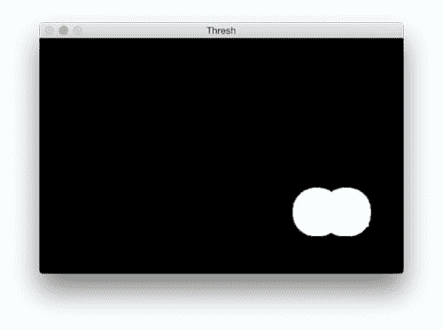

# OpenCV 和 Python 的图像差异

> 原文：<https://pyimagesearch.com/2017/06/19/image-difference-with-opencv-and-python/>

最后更新于 2021 年 7 月 7 日。

在之前的 PyImageSearch 博客文章中，我详细介绍了[如何使用结构相似性指数(SSIM)用 Python](https://pyimagesearch.com/2014/09/15/python-compare-two-images/) 比较两幅图像。

使用这种方法，我们能够很容易地确定两幅图像是相同的，还是由于轻微的图像处理、压缩伪影或故意篡改而存在差异。

今天，我们将扩展 SSIM 方法，以便我们可以使用 OpenCV 和 Python 可视化图像之间的差异。具体来说，我们将围绕两幅输入图像中不同的区域绘制边界框。

**要了解更多关于用 Python 和 OpenCV 计算和可视化图像差异的信息，*继续阅读*。**

*   【2021 年 7 月更新:增加了一节，介绍比较图像差异的方法以及如何使用 siamese 网络的补充阅读资源。

## OpenCV 和 Python 的图像差异

为了计算两幅图像之间的差异，我们将利用结构相似性指数，该指数由王等人在其 2004 年的论文 [*图像质量评估:从错误可见性到结构相似性*](https://ece.uwaterloo.ca/~z70wang/publications/ssim.pdf) 中首次提出。该方法已经在用于图像处理的 [scikit-image](http://scikit-image.org/docs/stable/api/skimage.measure.html#skimage.measure.compare_ssim) 库中实现。

诀窍是学习我们如何确定*在*的确切位置，根据 *(x，y)*-坐标位置，图像差异是。

为了实现这一点，我们首先需要确保我们的系统有 Python、OpenCV、scikit-image 和 imutils。

你可以使用我的 OpenCV 安装教程中的[来学习如何在你的系统上配置和安装 Python 和 OpenCV。](https://pyimagesearch.com/opencv-tutorials-resources-guides/)

如果您尚未安装/升级`scikit-image`，请通过以下方式升级:

```py
$ pip install --upgrade scikit-image

```

同时，继续安装/升级`imutils`:

```py
$ pip install --upgrade imutils

```

现在我们的系统已经具备了先决条件，让我们继续。

### 计算图像差异

你能看出这两幅图像的不同之处吗？

如果你花点时间研究这两张信用卡，你会注意到万事达卡的标志出现在左边的图片上，但是已经从右边的图片上被 PS 掉了。

你可能马上就注意到了这种不同，也可能花了你几秒钟的时间。无论如何，这展示了比较图像差异的一个重要方面— *有时图像差异是微妙的—* 如此微妙，以至于肉眼难以立即理解差异(我们将在本文后面看到这样一个图像的例子)。

那么，为什么计算图像差异如此重要呢？

一个例子是*网络钓鱼*。攻击者可以非常轻微地操纵图像，欺骗没有验证 URL 的不知情用户，让他们认为他们正在登录他们的银行网站，但后来发现这是一个骗局。

将网页上的徽标和已知的用户界面(UI)元素与现有的数据集进行比较，可以帮助减少网络钓鱼攻击(非常感谢查尔斯·克利夫兰传递了 *[PhishZoo:通过查看来检测网络钓鱼网站](http://www1.icsi.berkeley.edu/~sadia/papers/phishzoo-icsc_final.pdf)* 作为应用计算机视觉来防止网络钓鱼的一个例子)。

开发一个网络钓鱼检测系统显然比简单的图像差异要复杂得多，但是我们仍然可以应用这些技术来确定给定的图像是否被篡改过。

现在，让我们计算两幅图像之间的差异，并使用 OpenCV、scikit-image 和 Python 并排查看这些差异。

打开一个新文件，将其命名为`image_diff.py`，并插入以下代码:

```py
# import the necessary packages
from skimage.metrics import structural_similarity as compare_ssim
import argparse
import imutils
import cv2

# construct the argument parse and parse the arguments
ap = argparse.ArgumentParser()
ap.add_argument("-f", "--first", required=True,
	help="first input image")
ap.add_argument("-s", "--second", required=True,
	help="second")
args = vars(ap.parse_args())

```

**第 2-5 行**显示我们的进口。我们将使用`compare_ssim`(来自 scikit-image)、`argparse`、`imutils`和`cv2` (OpenCV)。

我们建立两个命令行参数，`--first`和`--second`，它们是我们希望比较的两个相应输入图像的路径(**第 8-13 行**)。

接下来，我们将从磁盘加载每个图像，并将其转换为灰度:

```py
# load the two input images
imageA = cv2.imread(args["first"])
imageB = cv2.imread(args["second"])

# convert the images to grayscale
grayA = cv2.cvtColor(imageA, cv2.COLOR_BGR2GRAY)
grayB = cv2.cvtColor(imageB, cv2.COLOR_BGR2GRAY)

```

我们将第一个和第二个图像`--first`和`--second`加载到**的第 16 行和第 17 行**，分别存储为`imageA`和`imageB`。


**Figure 2:** Our two input images that we are going to apply image difference to.

然后，我们在第 20 行和第 21 行将它们转换成灰度。


**Figure 3:** Converting the two input images to grayscale.

接下来，让我们计算两幅灰度图像之间的结构相似性指数(SSIM)。

```py
# compute the Structural Similarity Index (SSIM) between the two
# images, ensuring that the difference image is returned
(score, diff) = compare_ssim(grayA, grayB, full=True)
diff = (diff * 255).astype("uint8")
print("SSIM: {}".format(score))

```

使用 scikit-image 中的`compare_ssim`函数，我们计算出一个`score`和差值图像`diff` ( **第 25 行**)。

`score`表示两个输入图像之间的结构相似性指数。该值可以落在范围 *[-1，1]* 内，值 1 表示“完全匹配”。

`diff`图像包含我们希望可视化的两个输入图像之间的实际*图像差异*。差异图像目前被表示为范围 *[0，1]* 中的浮点数据类型，因此我们首先将数组转换为范围 *[0，255]* ( **第 26 行**)中的 8 位无符号整数，然后才能使用 OpenCV 对其进行进一步处理。

现在，让我们找到轮廓，以便我们可以在被标识为“不同”的区域周围放置矩形:

```py
# threshold the difference image, followed by finding contours to
# obtain the regions of the two input images that differ
thresh = cv2.threshold(diff, 0, 255,
	cv2.THRESH_BINARY_INV | cv2.THRESH_OTSU)[1]
cnts = cv2.findContours(thresh.copy(), cv2.RETR_EXTERNAL,
	cv2.CHAIN_APPROX_SIMPLE)
cnts = imutils.grab_contours(cnts)

```

在**的第 31 行和第 32 行**，我们使用`cv2.THRESH_BINARY_INV`和`cv2.THRESH_OTSU`为我们的`diff`图像设定阈值——使用竖线‘或’符号`|`同时应用这两个设置。有关 Otsu 双峰阈值设置的详细信息，请参见 OpenCV 文档。

随后我们在第 33-35 条线上找到了`thresh`的轮廓。第 35 行的**上的三进制操作符简单地适应了 OpenCV 不同版本中 [cv2.findContours 返回签名](https://pyimagesearch.com/2015/08/10/checking-your-opencv-version-using-python/)之间的差异。**

下面的图 4 中的图像清楚地显示了经过处理的图像的感兴趣区域:



**Figure 4:** Using thresholding to highlight the image differences using OpenCV and Python.

现在我们已经将轮廓存储在列表中，让我们在每个图像的不同区域周围绘制矩形:

```py
# loop over the contours
for c in cnts:
	# compute the bounding box of the contour and then draw the
	# bounding box on both input images to represent where the two
	# images differ
	(x, y, w, h) = cv2.boundingRect(c)
	cv2.rectangle(imageA, (x, y), (x + w, y + h), (0, 0, 255), 2)
	cv2.rectangle(imageB, (x, y), (x + w, y + h), (0, 0, 255), 2)

# show the output images
cv2.imshow("Original", imageA)
cv2.imshow("Modified", imageB)
cv2.imshow("Diff", diff)
cv2.imshow("Thresh", thresh)
cv2.waitKey(0)

```

从第 38 行**开始，我们循环遍历我们的轮廓`cnts`。首先，我们使用`cv2.boundingRect`函数计算轮廓周围的边界框。我们将相关的 *(x，y**)*-坐标存储为`x`和`y`，矩形的宽度/高度存储为`w`和`h`。**

然后我们用这些值在每张图片上画一个红色的矩形，用`cv2.rectangle` ( **第 43 和 44 行)**。

最后，我们用方框围绕差异显示比较图像、差异图像和阈值图像(**第 47-50 行**)。

我们调用第 50 行的**上的`cv2.waitKey`，这使得程序等待直到一个键被按下(此时脚本将退出)。**


**Figure 5:** Visualizing image differences using Python and OpenCV.

接下来，让我们运行脚本，并可视化一些更多的图像差异。

### 可视化图像差异

使用这个脚本和下面的命令，我们可以快速轻松地突出显示两幅图像之间的差异:

```py
$ python image_diff.py --first images/original_02.png 
	--second images/modified_02.png

```

如图 6 中的**所示，安全芯片和账户持有人的姓名都被移除了:**


**Figure 6:** Comparing and visualizing image differences using computer vision ([source](https://www.psecu.com/visa/)).

让我们尝试另一个计算图像差异的例子，这一次是杰拉尔德·福特总统写的一张支票。

通过运行下面的命令并提供相关图像，我们可以看到这里的差异更加微妙:

```py
$ python image_diff.py --first images/original_03.png 
	--second images/modified_03.png

```

注意图 7 中**的以下变化:**

*   贝蒂·福特的名字被删除了。
*   支票号码被删除。
*   日期旁边的符号被删除。
*   姓氏被删除。

在像支票这样的复杂图像上，通常很难用肉眼发现所有的差异。幸运的是，我们现在可以轻松地计算差异，并使用 Python、OpenCV 和 scikit-image 制作的这个方便的脚本可视化结果。

### **比较图像差异的其他方法**

本教程讲述了如何使用结构相似性指数(SSIM)来比较两幅图像并找出两者之间的差异。

SSIM 是图像比较的传统计算机视觉方法；然而，还有其他图像差异算法可以利用，特别是深度学习算法。

首先，可以通过以下方式应用[迁移学习](https://pyimagesearch.com/2019/05/20/transfer-learning-with-keras-and-deep-learning/):

1.  选择预先训练的 CNN (ResNet、VGGNet 等)。)在大型、多样化的图像数据集(例如，ImageNet)上
2.  从网络中移除完全连接的层头
3.  通过 CNN 传递数据集中的所有影像，并从最终图层中提取要素
4.  计算特征之间的[k-最近邻](https://pyimagesearch.com/2016/08/08/k-nn-classifier-for-image-classification/)比较，然后找到与输入查询最相似的图像

但是，请记住，k-NN 方法实际上并不“学习”数据集中图像的任何潜在模式/相似性得分。

为了真正*了解*图像差异并在它们之间进行稳健的比较，你应该利用**暹罗网络**。

以下教程将向您介绍暹罗网络:

1.  [*用 Python 为连体网络构建图像对*](https://pyimagesearch.com/2020/11/23/building-image-pairs-for-siamese-networks-with-python/)
2.  [*与 Keras、TensorFlow、深度学习的连体网络*](https://pyimagesearch.com/2020/11/30/siamese-networks-with-keras-tensorflow-and-deep-learning/)
3.  [*使用暹罗网络、Keras 和 TensorFlow*](https://pyimagesearch.com/2020/12/07/comparing-images-for-similarity-using-siamese-networks-keras-and-tensorflow/) 比较图像的相似性
4.  [*与 Keras 和 TensorFlow 的暹罗网络损耗对比*](https://pyimagesearch.com/2021/01/18/contrastive-loss-for-siamese-networks-with-keras-and-tensorflow/)

此外，暹罗网络在 [PyImageSearch 大学](https://pyimagesearch.com/pyimagesearch-university/)中有详细介绍。

## 摘要

在今天的博文中，我们学习了如何使用 OpenCV、Python 和 scikit-image 的结构相似性指数(SSIM)计算图像差异。基于图像差异，我们还学习了如何标记和可视化两幅图像中的不同区域。

要了解更多关于 SSIM 的信息，请务必[参考这篇文章](https://pyimagesearch.com/2014/09/15/python-compare-two-images/)和 [scikit-image 文档](http://scikit-image.org/docs/dev/api/skimage.measure.html#skimage.measure.compare_ssim)。

我希望你喜欢今天的博文！

在您离开之前，请务必在下面的表格中输入您的电子邮件地址，以便在未来发布 PyImageSearch 博客帖子时得到通知！