# 使用 OpenCV 的图像渐变(Sobel 和 Scharr)

> 原文：<https://pyimagesearch.com/2021/05/12/image-gradients-with-opencv-sobel-and-scharr/>

在本教程中，您将了解图像渐变以及如何使用 OpenCV 的`cv2.Sobel`函数计算 Sobel 渐变和 Scharr 渐变。

图像梯度是许多计算机视觉和图像处理例程的基本构件。

*   我们使用梯度来检测图像中的边缘，这允许我们找到图像中对象的轮廓和外形
*   我们使用它们作为输入，通过特征提取来量化图像——事实上，非常成功和众所周知的图像描述符，如梯度方向直方图和 SIFT，都是建立在图像梯度表示上的
*   梯度图像甚至被用于构建显著图，其突出了图像的主题

虽然图像渐变不经常详细讨论，因为其他更强大和有趣的方法建立在它们之上，但我们将花时间详细讨论它们。

要学习如何用 OpenCV ***计算 Sobel 和 Scharr 梯度，请继续阅读。***

## **使用 OpenCV 的图像渐变(Sobel 和 Scharr)**

在本教程的第一部分，我们将讨论什么是图像渐变，它们的用途，以及我们如何手动计算它们(这样我们就有一个直观的理解)。

从这里我们将了解 Sobel 和 Scharr 内核，它们是[卷积运算符](https://pyimagesearch.com/2016/07/25/convolutions-with-opencv-and-python/)，允许我们使用 OpenCV 和`cv2.Sobel`函数自动计算图像梯度(我们只需将特定于 Scharr 的参数传递给`cv2.Sobel`来计算 Scharr 梯度)。

然后，我们将配置我们的开发环境，并检查我们的项目目录结构，其中您将实现两个 Python 脚本:

1.  一个用于计算梯度幅度
2.  另一个用于计算梯度方向

这些计算共同推动了传统的计算机视觉技术，如 SIFT 和梯度方向直方图。

我们将讨论我们的结果来结束本教程。

### **什么是图像渐变？**

正如我在引言中提到的，图像梯度在许多计算机视觉和图像处理应用中被用作基本的构建模块。

然而，图像梯度的主要应用在于**边缘检测。**

顾名思义，边缘检测是在图像中寻找边缘的过程，它揭示了关于图像中对象的结构信息。因此，边可以对应于:

*   图像中对象的边界
*   图像中阴影或光照条件的边界
*   对象内“部分”的边界

下图是在图像中检测到的边缘:

在左边的*，*是我们的原始输入图像。在右边的*，*我们有检测到边缘的图像——通常称为**边缘图。**

右图清楚地显示了图像中物体的结构和轮廓。请注意笔记卡的轮廓，以及写在笔记卡上的文字是如何清晰地显现出来的。

使用这个轮廓，我们可以应用轮廓从区域中提取实际的对象，或者量化形状，以便我们可以在以后识别它们。正如图像梯度是边缘检测等方法的构建模块一样，边缘检测也是开发完整计算机视觉应用的构建模块。

### **手动计算图像梯度**

那么我们如何在图像中找到这些边缘呢？

第一步是计算图像的梯度。**形式上，图像梯度被定义为图像强度的方向变化。**

或者更简单地说，在输入(灰度)图像的每个像素处，梯度测量给定方向上像素强度的变化。通过估计方向或*方位*以及*大小*(即方向的变化有多强)，我们能够检测出图像中看起来像边缘的区域。

在实践中，使用[内核](https://pyimagesearch.com/2016/07/25/convolutions-with-opencv-and-python/)来估计图像梯度，就像我们使用[平滑和模糊](https://pyimagesearch.com/2021/04/28/opencv-smoothing-and-blurring/)一样——但这次我们试图找到图像的结构成分。我们的目标是在 *x* 和 *y* 方向上找到红色标记的中心像素的方向变化:

然而，在我们深入到梯度估计的内核之前，让我们实际上经历一下手动计算梯度的过程。第一步是简单地找到并标记围绕中心像素的北、南、东和西像素:

在上图中，我们检查了中心像素周围的 *3×3* 邻域。我们的 *x* 值从左到右，我们的 *y* 值从上到下。为了计算方向上的任何变化，我们需要北、南、东、西像素，在图 3**中标出。**

如果我们将输入图像表示为 *I* ，那么我们使用以下符号定义北、南、东和西像素:

*   **北:** ")
*   **南:** ")
*   **东:** ")
*   **西:** ")

同样，在计算图像强度在 *x* 和 *y* 方向的变化时，这四个值*是关键的*。

为了演示这一点，让我们通过获取南方和北方像素之间的差异来计算**垂直变化**或***y*****-变化**:

*G**y=*I*(*x*，*y*+1)*–**I*(*x*，*y*—1)*

类似地，我们可以通过取东西像素之间的差来计算**水平变化**或***x*****-变化**:

*G**x=*I*(*x*+1，*y*)【T12—**I*(*x*—1， *y* )

太棒了——现在我们有了 *G* *[x]* 和 *G* *[y]* ，它们代表了中心像素在 *x* 和 *y* 方向上的图像强度变化。

所以现在最大的问题变成了:*我们如何利用这些价值？*

为了回答这个问题，我们需要定义两个新术语——**梯度幅度**和**梯度方向。**

**梯度幅度用于衡量图像强度的变化有多强。**梯度幅度是量化强度变化的“强度”的实数值。

**梯度方向用于确定强度变化所指向的方向。**顾名思义，渐变取向会给我们一个角度或者？我们可以用它来量化变化的方向。

例如，看看下面的梯度方向的可视化:

在左边，我们有一个图像的 3 *×* 3 区域，其中图像的上半部分是*白色*，图像的下半部分是*黑色*。因此，梯度方向等于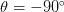

.

而在*右边*，我们又有了一个图像的 3 个 *×* 3 邻域，上面的三角形区域是*白色*，下面的三角形区域是*黑色*。这里我们可以看到方向的变化等于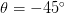

.

所以我实话实说——当我第一次接触计算机视觉和图像渐变时，**图 4** 把我搞得晕头转向。我的意思是，*我们究竟是如何得出这些计算结果的？？！直觉上，方向的改变是有意义的，因为我们可以实际看到和想象结果。*

**但是我们究竟如何*****着手计算渐变的方向和幅度呢？***

 *很高兴你问了。让我们看看是否可以解开梯度方向和幅度计算的谜团。

让我们继续，从我们信任的 3 *×* 3 邻域图像开始:

在这里，我们可以看到中心像素用红色标记。确定梯度方向和大小的下一步实际上是计算在 *x* 和 *y* 方向上的梯度变化。幸运的是，我们已经知道如何做到这一点——它们只是我们之前计算的 *G* *[x]* 和 *G* *[y]* 值！

使用*G[x]和*G[y]，我们可以应用一些基本的三角学来计算梯度大小 *G* 和方向？：**

看到这个例子，才是真正固化了我对梯度方向和大小的理解。检查这个三角形你可以看到梯度大小 *G* 是三角形的斜边。因此，我们需要做的就是应用毕达哥拉斯定理，我们将得到梯度幅度:

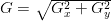

然后，梯度方向可以被给定为*G[y]与*G[x]的比值。技术上我们会使用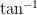**

to compute the gradient orientation, but this could lead to undefined values — since we are computer scientists, we’ll use the 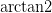function to account for the different quadrants instead (if you’re unfamiliar with the arc-tangent, you can read more about it [here](https://en.wikipedia.org/wiki/Atan2)):

 \times \left(\displaystyle\frac{180}{\pi}\right)")


function gives us the orientation in radians, which we then convert to degrees by multiplying by the ratio of 180/?.

让我们继续手动计算 *G* 和？所以我们可以看到这个过程是如何完成的:

在上面的图像中，我们有一个上面三分之一是白色，下面三分之二是黑色的图像。使用等式 *G* *[x]* 和 *G* *[y]* ，我们得出:

*G**x= 0 0 = 0*

并且:

**G[y]*= 0 255 = 255*

将这些值代入梯度幅度方程，我们得到:

^{2}} = 255")

至于我们的梯度方向:

 \times \left(\displaystyle\frac{180}{\pi}\right) = -90^{\circ}")

看，计算梯度大小和方向并不太糟糕！

为了好玩，我们再举一个例子:

在这张特殊的图像中，我们可以看到下三角区域是白色的，而上三角区域是黑色的。计算 G*xT3 和 G[y]T7，我们得到:*

*G[x]= 0 255 = 255 并且*G[y]= 255 0 = 255**

留给我们的梯度值是:

^{2} + 255^{2}} = 360.62")

和梯度方向:

 \times \left(\displaystyle\frac{180}{\pi}\right) = 135^{\circ}")

果然，我们的坡度指向*下*和*左*，角度为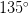

.

当然，我们只计算了两个唯一像素值的梯度方向和大小:0 和 255。通常情况下，您会在一张*灰度*图像上计算方向和幅度，其中有效的值范围是*【0，255】*。

### **索贝尔和沙尔内核**

既然我们已经学会了如何手动计算梯度，让我们看看如何使用内核来*近似*它们，这将极大地提高我们的速度。就像我们使用核来平滑和模糊图像一样，我们也可以使用核来计算我们的梯度。

我们将从 **Sobel 方法**开始，该方法实际上使用了两个内核:一个用于检测方向的水平变化，另一个用于检测方向的垂直变化:

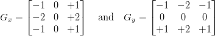

给定下面的输入图像邻域，让我们计算梯度的 Sobel 近似:

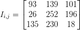

因此:


并且:

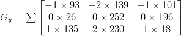

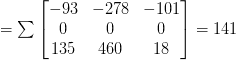

给定这些值*G[x]和*G[y]，那么计算梯度幅度 *G* 和方向就变得很简单了？：**

 \times \displaystyle\frac{180}{\pi} = 31.4^{\circ}")

我们也可以使用 **Scharr 核**代替 Sobel 核，这可以给我们更好的梯度近似值:

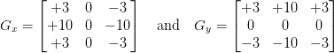

关于为什么 Scharr 核可以导致更好的近似的确切原因深深植根于数学细节，并且远远超出了我们对图像梯度的讨论。

如果你有兴趣阅读更多关于 Scharr 与 Sobel 核的内容，并构建一个最佳的图像梯度近似(并能阅读德语)，[我建议看一看 Scharr 关于主题](http://archiv.ub.uni-heidelberg.de/volltextserver/962/)的论文。

总的来说，当量化和抽象地表示图像时，梯度幅度和方向有助于优秀的特征和图像描述符。

但是对于边缘检测，梯度表示对局部噪声极其敏感。我们还需要增加几个步骤来创建一个真正鲁棒的边缘检测器——我们将在下一篇教程中详细讨论这些步骤，届时我们将回顾 Canny 边缘检测器。

### **配置您的开发环境**

要遵循这个指南，您需要在您的系统上安装 OpenCV 库。

幸运的是，OpenCV 可以通过 pip 安装:

```py
$ pip install opencv-contrib-python
```

**如果你需要帮助为 OpenCV 配置开发环境，我*强烈推荐*阅读我的** [***pip 安装 OpenCV* 指南**](https://pyimagesearch.com/2018/09/19/pip-install-opencv/)——它将在几分钟内让你启动并运行。

### **在配置开发环境时遇到了问题？**

说了这么多，你是:

*   时间紧迫？
*   了解你雇主的行政锁定系统？
*   想要跳过与命令行、包管理器和虚拟环境斗争的麻烦吗？
*   **准备好在您的 Windows、macOS 或 Linux 系统上运行代码*****？***

 *那今天就加入 [PyImageSearch 大学](https://pyimagesearch.com/pyimagesearch-university/)吧！

**获得本教程的 Jupyter 笔记本和其他 PyImageSearch 指南，这些指南是** ***预先配置的*** **，可以在您的网络浏览器中运行在 Google Colab 的生态系统上！**无需安装。

最棒的是，这些 Jupyter 笔记本可以在 Windows、macOS 和 Linux 上运行！

### **项目结构**

在我们用 OpenCV 实现图像渐变之前，让我们先回顾一下我们的项目目录结构。

请务必访问本教程的 ***“下载”*** 部分，以检索源代码和示例图像:

```py
$ tree . --dirsfirst
.
├── images
│   ├── bricks.png
│   ├── clonazepam_1mg.png
│   ├── coins01.png
│   └── coins02.png
├── opencv_magnitude_orientation.py
└── opencv_sobel_scharr.py

1 directory, 6 files
```

我们今天将实现两个 Python 脚本:

1.  `opencv_sobel_scharr.py`:利用 Sobel 和 Scharr 算子计算输入图像的梯度信息。
2.  `opencv_magnitude_orientation.py`:获取 Sobel/Scharr 内核的输出，然后计算梯度幅度和方向信息。

`images`目录包含了我们将对其应用这两个脚本的各种示例图像。

### **用 OpenCV 实现 Sobel 和 Scharr 内核**

到目前为止，我们已经讨论了很多关于图像核的理论和数学细节。但是我们实际上如何*应用*我们在 OpenCV 中学到的东西呢？

我很高兴你问了。

打开一个新文件，命名为`opencv_sobel_scharr.py`，开始编码:

```py
# import the necessary packages
import argparse
import cv2

# construct the argument parser and parse the arguments
ap = argparse.ArgumentParser()
ap.add_argument("-i", "--image", type=str, required=True,
	help="path to input image")
ap.add_argument("-s", "--scharr", type=int, default=0,
	help="path to input image")
args = vars(ap.parse_args())
```

**第 2 行和第 3 行**导入我们需要的 Python 包——我们所需要的只是用于命令行参数的`argparse`和用于 OpenCV 绑定的`cv2`。

我们有两个命令行参数:

1.  `--image`:我们想要计算 Sobel/Scharr 梯度的驻留在磁盘上的输入图像的路径。
2.  我们是否在计算沙尔梯度。默认情况下，我们将计算 Soble 梯度。如果我们为这个标志传入一个值 *> 0* ，那么我们将计算 Scharr 梯度

现在让我们加载并处理我们的图像:

```py
# load the image, convert it to grayscale, and display the original
# grayscale image
image = cv2.imread(args["image"])
gray = cv2.cvtColor(image, cv2.COLOR_BGR2GRAY)
cv2.imshow("Gray", gray)
```

**第 15-17 行**从磁盘加载我们的图像，将其转换为灰度(因为我们在图像的灰度版本上计算渐变表示)，并将其显示在我们的屏幕上。

```py
# set the kernel size, depending on whether we are using the Sobel
# operator of the Scharr operator, then compute the gradients along
# the x and y axis, respectively
ksize = -1 if args["scharr"] > 0 else 3
gX = cv2.Sobel(gray, ddepth=cv2.CV_32F, dx=1, dy=0, ksize=ksize)
gY = cv2.Sobel(gray, ddepth=cv2.CV_32F, dx=0, dy=1, ksize=ksize)

# the gradient magnitude images are now of the floating point data
# type, so we need to take care to convert them back a to unsigned
# 8-bit integer representation so other OpenCV functions can operate
# on them and visualize them
gX = cv2.convertScaleAbs(gX)
gY = cv2.convertScaleAbs(gY)

# combine the gradient representations into a single image
combined = cv2.addWeighted(gX, 0.5, gY, 0.5, 0)

# show our output images
cv2.imshow("Sobel/Scharr X", gX)
cv2.imshow("Sobel/Scharr Y", gY)
cv2.imshow("Sobel/Scharr Combined", combined)
cv2.waitKey(0)
```

计算*G[x]和*G[y]值是通过调用`cv2.Sobel`在第 **23 行和第**24 行处理的。指定值`dx=1`和`dy=0`表示我们想要计算穿过 *x* 方向的梯度。并且提供值`dx=0`和`dy=1`表明我们想要计算跨越 *y* 方向的梯度。**

***注意:*** *如果我们想要使用 Scharr 内核而不是 Sobel 内核，我们只需简单地指定我们的`--scharr`命令行参数为> 0* — *，从那里设置合适的`ksize`(****Line 22****)。*

然而，此时，`gX`和`gY`都是浮点数据类型。如果我们想在屏幕上显示它们，我们需要将它们转换回 8 位无符号整数。**第 30 行和第 31 行**获取渐变图像的绝对值，然后将这些值压缩回范围*【0，255】。*

最后，我们使用`cv2.addWeighted`函数将`gX`和`gY`组合成一幅图像，对每个梯度表示进行平均加权。

第 37-40 行然后在屏幕上显示我们的输出图像。

### **Sobel 和 Scharr 内核结果**

让我们来学习如何用 OpenCV 应用 Sobel 和 Scharr 内核。

请务必访问本教程的 ***“下载”*** 部分，以检索源代码和示例图像。

从那里，打开一个终端窗口并执行以下命令:

```py
$ python opencv_sobel_scharr.py --image images/bricks.png
```

在*顶部，*我们有我们的原始图像，这是一个砖墙的图像。

然后左下方的*沿 *x* 方向显示 Sobel 梯度图像。注意计算沿 *x* 方向的索贝尔梯度如何揭示砖块的垂直砂浆区域。*

类似地，*底部中心*显示沿 *y* 方向计算的索贝尔梯度——现在我们可以看到砖块的水平砂浆区域。

最后，我们可以将`gX`和`gY`相加，并在右下角的*上接收我们的最终输出图像。*

让我们看另一个图像:

```py
$ python opencv_sobel_scharr.py --image images/coins01.png
```

这次我们正在研究一套硬币。沿着硬币的边界/轮廓可以找到许多 Sobel 梯度信息。

现在，让我们计算同一图像的沙尔梯度信息:

```py
$ python opencv_sobel_scharr.py --image images/coins01.png \
	--scharr 1
```

请注意 Scharr 操作符是如何比前一个例子包含更多信息的。

让我们看另一个 Sobel 例子:

```py
$ python opencv_sobel_scharr.py --image images/clonazepam_1mg.png
```

这里，我们已经计算了药丸的 Sobel 梯度表示。药丸的轮廓清晰可见，药丸上的数字也清晰可见。

现在让我们看看沙尔表示法:

```py
$ python opencv_sobel_scharr.py --image images/clonazepam_1mg.png \
	--scharr 1
```

药丸的边界就像定义的一样，而且，Scharr 渐变表示提取了药丸本身的更多纹理。

您是否为您的应用程序使用 Sobel 或 Scharr 渐变取决于您的项目，但一般来说，请记住，Scharr 版本会显得更“视觉嘈杂”，但同时会捕捉纹理中更细微的细节。

### **用 OpenCV 计算梯度大小和方向**

到目前为止，我们已经学习了如何计算 Sobel 和 Scharr 算子，但是对于这些梯度实际上代表什么，我们没有太多的直觉。

在本节中，我们将计算输入灰度图像的**渐变幅度**和**渐变方向**，并可视化结果。然后，在下一节中，我们将回顾这些结果，让您更深入地了解梯度幅度和方向实际代表什么。

如上所述，打开一个新文件，将其命名为`opencv_magnitude_orienation.py`，并插入以下代码:

```py
# import the necessary packages
import matplotlib.pyplot as plt
import numpy as np
import argparse
import cv2

# construct the argument parser and parse the arguments
ap = argparse.ArgumentParser()
ap.add_argument("-i", "--image", type=str, required=True,
	help="path to input image")
args = vars(ap.parse_args())
```

**第 2-5 行**导入我们需要的 Python 包，包括用于绘图的`matplotlib`，用于数值数组处理的 NumPy，`argparse`用于命令行参数，`cv2`用于 OpenCV 绑定。

然后我们在第 8-11 行解析我们的命令行参数。这里我们只需要一个开关`--image`，它是我们驻留在磁盘上的输入图像的路径。

让我们现在加载我们的图像，并计算梯度大小和方向:

```py
# load the input image and convert it to grayscale
image = cv2.imread(args["image"])
gray = cv2.cvtColor(image, cv2.COLOR_BGR2GRAY)

# compute gradients along the x and y axis, respectively
gX = cv2.Sobel(gray, cv2.CV_64F, 1, 0)
gY = cv2.Sobel(gray, cv2.CV_64F, 0, 1)

# compute the gradient magnitude and orientation
magnitude = np.sqrt((gX ** 2) + (gY ** 2))
orientation = np.arctan2(gY, gX) * (180 / np.pi) % 180
```

**第 14 行和第 15 行**从磁盘加载我们的`image`并转换成灰度。

然后，我们计算沿着 *x* 和 *y* 轴的索贝尔梯度，就像我们在上一节所做的一样。

然而，与上一节不同，我们不打算在屏幕上显示渐变图像(至少不通过`cv2.imshow`函数)，因此我们不必将它们转换回范围*【0，255】*或使用`cv2.addWeighted`函数将它们组合在一起。

相反，我们继续在第 22 行和第 23 行进行梯度大小和方向的计算。注意这两条线是如何与我们上面的*方程精确匹配的。*

**梯度幅度**简单地说就是在 *x* 和 *y* 方向上的平方梯度的平方根相加。

**梯度方向**是 *x* 和 *y* 方向梯度的反正切。

现在让我们来看一下梯度幅度和梯度方向:

```py
# initialize a figure to display the input grayscale image along with
# the gradient magnitude and orientation representations, respectively
(fig, axs) = plt.subplots(nrows=1, ncols=3, figsize=(8, 4))

# plot each of the images
axs[0].imshow(gray, cmap="gray")
axs[1].imshow(magnitude, cmap="jet")
axs[2].imshow(orientation, cmap="jet")

# set the titles of each axes
axs[0].set_title("Grayscale")
axs[1].set_title("Gradient Magnitude")
axs[2].set_title("Gradient Orientation [0, 180]")

# loop over each of the axes and turn off the x and y ticks
for i in range(0, 3):
	axs[i].get_xaxis().set_ticks([])
	axs[i].get_yaxis().set_ticks([])

# show the plots
plt.tight_layout()
plt.show()
```

**第 27 行**创建一个一行三列的图形(一个用于原始图像，一个用于梯度幅度表示，一个用于梯度方向表示)。

然后，我们将每个灰度、梯度幅度和梯度方向图像添加到绘图中(**行 30-32** )，同时设置每个轴的标题(**行 35-37** )。

最后，我们关闭轴记号(**第 40-42 行**)并在屏幕上显示结果。

### **梯度大小和方向结果**

我们现在准备计算我们的梯度大小！

首先访问本教程的 ***“下载”*** 部分，检索源代码和示例图像。

从那里，执行以下命令:

```py
$ python opencv_magnitude_orientation.py --image images/coins02.png
```

在左边的*，*我们有硬币的原始输入图像。

*中间的*使用喷射色图显示渐变幅度。

接近蓝色范围的值*非常小*。例如，图像的背景具有`0`的渐变，因为那里没有渐变。

更接近黄色/红色范围的值*相当大*(相对于其余值)。看一看硬币的轮廓/边界，你可以看到这些像素具有很大的梯度幅度，因为它们包含边缘信息。

最后，*右侧的图像*显示渐变方向信息，同样使用 Jet 色彩映射表。

这里的值在范围 *[0，180]，*内，接近 0 的值显示为蓝色，接近 180 的值显示为红色。注意，许多方向信息包含在硬币本身中。

让我们试试另一个例子:

```py
$ python opencv_magnitude_orientation.py \
	--image images/clonazepam_1mg.png
```

左边*的图像包含我们输入的处方药丸冥想的图像。然后我们计算中间*的渐变幅度*，并在右边*显示渐变方向*。*

与我们的硬币示例类似，大部分梯度幅度信息位于药丸的边界/边界上，而梯度方向由于药丸本身的纹理而更加明显。

在我们的下一个教程中，您将学习如何使用这个渐变信息来检测输入图像中的边缘。

## **总结**

在本课中，我们定义了什么是图像渐变:*图像强度的方向变化。*

我们还学习了如何仅使用像素亮度值的邻域来手动计算中心像素周围的方向变化。

然后，我们使用这些方向变化来计算我们的**梯度方向**——强度变化所指向的方向——以及**梯度幅度**，这是强度变化的强度。

当然，使用我们的简单方法计算梯度方向和大小并不是最快的方法。相反，我们可以依靠 **Sobel 和 Scharr 内核**，它们允许我们获得图像导数的*近似*。类似于平滑和模糊，我们的图像核将我们的输入图像与设计用于近似我们的梯度的核进行卷积。

最后，我们学习了如何使用`cv2.Sobel` OpenCV 函数来计算 Sobel 和 Scharr 梯度表示。使用这些梯度表示，我们能够确定图像中哪些像素的方向在范围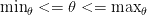内

.

图像渐变是您将要学习的最重要的图像处理和计算机视觉构建模块之一。在幕后，它们用于强大的图像描述符方法，如梯度方向直方图和 SIFT。

它们被用来构建[显著图](https://pyimagesearch.com/2018/07/16/opencv-saliency-detection/)以揭示图像中最“有趣”的区域。

正如我们将在下一个教程中看到的，我们将看到图像梯度是如何检测图像边缘的 Canny 边缘检测器的基石。

**要下载这篇文章的源代码(并在未来教程在 PyImageSearch 上发布时得到通知)，** ***只需在下面的表格中输入您的电子邮件地址！*****