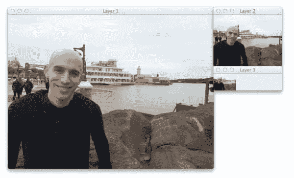
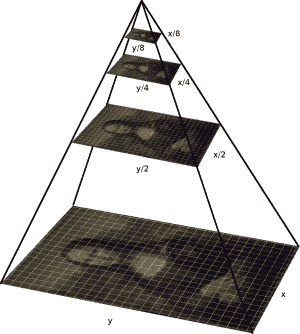
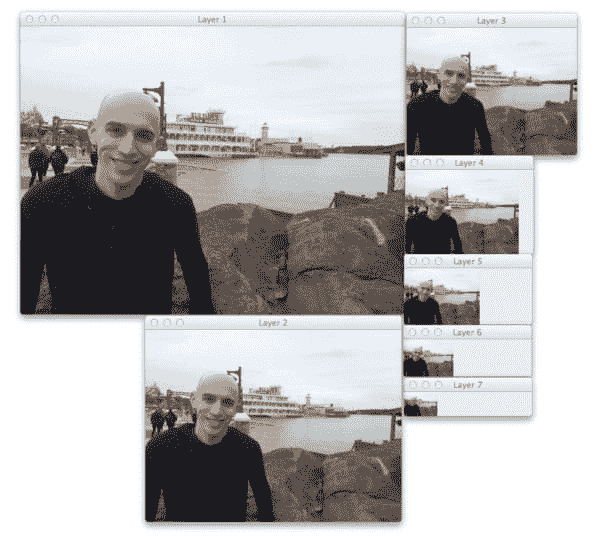
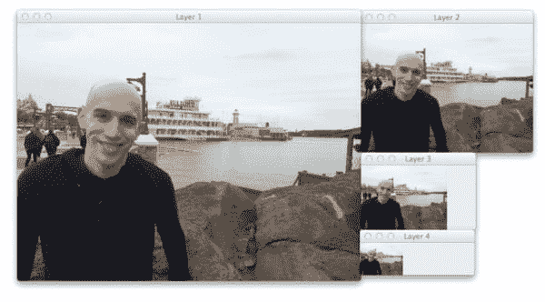

# 使用 Python 和 OpenCV 制作影像金字塔

> 原文：<https://pyimagesearch.com/2015/03/16/image-pyramids-with-python-and-opencv/>

[](https://pyimagesearch.com/wp-content/uploads/2015/03/pyramid_adrian_scale30.jpg)

康涅狄格州实在太冷了——冷得我不得不认输，逃离一会儿。

上周，我去佛罗里达州奥兰多度周末，只是为了逃避现实。虽然天气并不完美(华氏 60 度左右，多云，下着小雨，正如你在上面的照片中看到的)，但 ***比康涅狄格州*** 整整暖和了 60 度——这对我来说才是最重要的。

虽然我没有去动物王国，也没有参加任何迪斯尼冒险游乐项目，但我确实很喜欢在迪斯尼市区散步，在 Epcot 的每个国家喝饮料。

侧边栏:也许我有偏见，因为我是德国人，但德国红酒可能是最不受重视的葡萄酒之一。想象一下，拥有基安蒂酒浓郁的味道，但酸度稍低。完美。如果你曾经在 Epcot，一定要去看看德国葡萄酒品尝会。

无论如何，当我登上从温暖的佛罗里达天堂飞回康涅狄格州苔原的飞机时，我开始思考 PyImageSearch 的下一篇博文会是什么。

真的，这不应该是那么长时间(或艰苦)的锻炼，但这是早上 5 点 27 分的航班，我仍然半睡半醒，我非常确定我的身体里还有一点德国红酒。

喝了一杯(糟糕的)飞机咖啡后，我决定写一篇由两部分组成的博客:

*   **第一部分:**用 Python 和 OpenCV 制作图像金字塔。

*   **第二部分:**用 Python 和 OpenCV 实现图像分类的滑动窗口。

你看，几个月前我写了一篇关于利用 [梯度方向直方图](https://pyimagesearch.com/2014/11/10/histogram-oriented-gradients-object-detection/) 图像描述符和线性 SVM 来检测图像中的物体的博文。**这个 6 步框架可以用来轻松训练物体分类模型。**

这个 6 步框架的一个关键方面包括 ***图像金字塔*** 和 ***滑动窗口*** 。

今天我们将回顾使用 Python、OpenCV 和 sickit-image 创建图像金字塔的两种方法。下周我们将发现创建高效滑动窗口的简单技巧。

利用这两篇文章，我们可以开始将 HOG +线性 SVM 框架的各个部分粘在一起，这样你就可以构建自己的对象分类器了！

请继续阅读，了解更多信息…

# 什么是形象金字塔？

[](https://pyimagesearch.com/wp-content/uploads/2015/03/pyramid_example.png)

**Figure 1:** An example of an image pyramid. At each layer of the pyramid the image is downsized and (optionally) smoothed ([image source](http://iipimage.sourceforge.net/documentatiimg/)).

“图像金字塔”是图像的*多尺度表示。*

 *利用图像金字塔可以让我们**在图像的不同尺度**下找到图像中的物体。当与**滑动窗口**结合使用时，我们可以在不同的位置找到图像中的物体。

在金字塔的底部，我们有原始大小的原始图像(就宽度和高度而言)。并且在每个后续层，图像被调整大小(二次采样)并且可选地被平滑(通常通过高斯模糊)。

图像被渐进地二次采样，直到满足某个停止标准，这通常是已经达到最小尺寸，并且不需要进行进一步的二次采样。

# 方法 1:用 Python 和 OpenCV 制作影像金字塔

我们将探索的构建影像金字塔的第一种方法将利用 Python + OpenCV。

事实上，这是我在自己的项目中使用的 ***完全相同的*** 图像金字塔实现！

让我们开始这个例子。创建一个新文件，将其命名为`helpers.py`，并插入以下代码:

```py
# import the necessary packages
import imutils

def pyramid(image, scale=1.5, minSize=(30, 30)):
	# yield the original image
	yield image

	# keep looping over the pyramid
	while True:
		# compute the new dimensions of the image and resize it
		w = int(image.shape[1] / scale)
		image = imutils.resize(image, width=w)

		# if the resized image does not meet the supplied minimum
		# size, then stop constructing the pyramid
		if image.shape[0] < minSize[1] or image.shape[1] < minSize[0]:
			break

		# yield the next image in the pyramid
		yield image

```

我们从导入`imutils`包开始，它包含了一些常用的图像处理功能，如调整大小、旋转、平移等。你可以在这里 了解更多`imutils`套餐 [。也可以从我的](https://pyimagesearch.com/2015/02/02/just-open-sourced-personal-imutils-package-series-opencv-convenience-functions/) [GitHub](https://github.com/jrosebr1/imutils) 上抢下来。该软件包也可通过 pip 安装:

```py
$ pip install imutils

```

接下来，我们在**第 4 行**定义我们的`pyramid`函数。这个函数有两个参数。第一个参数是`scale`，它控制图像在每一层的大小。较小的`scale`会在金字塔中产生更多的层。并且更大的`scale`产生更少的层。

其次，我们定义了`minSize`，它是图层所需的最小宽度和高度。如果金字塔中的图像低于这个`minSize`，我们停止构建图像金字塔。

**第 6 行**产生金字塔(底层)中的原始图像。

从那里，我们开始在第 9 行的**图像金字塔上循环。**

**第 11 行和第 12 行**处理金字塔下一层图像的尺寸计算(同时保持纵横比)。该比例由`scale`因子控制。

在**行的第 16 行和第 17 行**，我们进行检查以确保图像符合`minSize`要求。如果没有，我们就脱离循环。

最后，**行 20** 产生了我们调整后的图像。

但是在我们开始使用图像金字塔的例子之前，让我们快速回顾一下第二种方法。

# 方法 2:使用 Python + scikit-image 构建影像金字塔

构建影像金字塔的第二种方法是利用 Python 和 scikit-image。 [scikit-image](http://scikit-image.org/) 库已经有一个内置的构建图像金字塔的方法叫做`pyramid_gaussian` ，你可以在这里阅读更多关于[的内容。](http://scikit-image.org/docs/dev/api/skimage.transform.html#pyramid-gaussian)

以下是如何使用 scikit-image 中的`pyramid_gaussian`功能的示例:

```py
# METHOD #2: Resizing + Gaussian smoothing.
for (i, resized) in enumerate(pyramid_gaussian(image, downscale=2)):
	# if the image is too small, break from the loop
	if resized.shape[0] < 30 or resized.shape[1] < 30:
		break

	# show the resized image
	cv2.imshow("Layer {}".format(i + 1), resized)
	cv2.waitKey(0)

```

与上面的例子类似，我们简单地遍历图像金字塔，并进行检查以确保图像有足够的最小尺寸。这里我们指定`downscale=2`来表示我们是 ***在金字塔的每一层将图像的尺寸*** 减半。

# 运行中的图像金字塔

现在我们已经定义了两个方法，让我们创建一个驱动脚本来执行我们的代码。创建一个新文件，命名为`pyramid.py`，让我们开始工作:

```py
# import the necessary packages
from pyimagesearch.helpers import pyramid
from skimage.transform import pyramid_gaussian
import argparse
import cv2

# construct the argument parser and parse the arguments
ap = argparse.ArgumentParser()
ap.add_argument("-i", "--image", required=True, help="Path to the image")
ap.add_argument("-s", "--scale", type=float, default=1.5, help="scale factor size")
args = vars(ap.parse_args())

# load the image
image = cv2.imread(args["image"])

# METHOD #1: No smooth, just scaling.
# loop over the image pyramid
for (i, resized) in enumerate(pyramid(image, scale=args["scale"])):
	# show the resized image
	cv2.imshow("Layer {}".format(i + 1), resized)
	cv2.waitKey(0)

# close all windows
cv2.destroyAllWindows()

# METHOD #2: Resizing + Gaussian smoothing.
for (i, resized) in enumerate(pyramid_gaussian(image, downscale=2)):
	# if the image is too small, break from the loop
	if resized.shape[0] < 30 or resized.shape[1] < 30:
		break

	# show the resized image
	cv2.imshow("Layer {}".format(i + 1), resized)
	cv2.waitKey(0)

```

我们将从导入我们需要的包开始。出于组织目的，我将我个人的`pyramid`功能放在了`pyimagesearch`的`helpers`子模块中。

你可以在这篇博文的底部下载我的项目文件和目录结构的代码。

然后我们导入 scikit-image `pyramid_gaussian`函数、`argparse`用于解析命令行参数，以及`cv2`用于 OpenCV 绑定。

接下来，我们需要解析**第 9-11 行**上的一些命令行参数。我们的脚本只需要两个开关，`--image`，它是我们将要构建图像金字塔的图像的路径，和`--scale`，它是控制图像在金字塔中如何调整大小的比例因子。

第 14 行从磁盘加载我们的图像。

我们可以在第**行第 18-21** 行开始使用我们的图像金字塔方法#1(我个人的方法),我们简单地循环金字塔的每一层，并在屏幕上显示出来。

然后从**第 27-34 行**开始，我们利用 scikit-image 方法(方法#2)构建图像金字塔。

要查看我们的脚本运行情况，请打开一个终端，将目录切换到您的代码所在的位置，然后执行以下命令:

```py
$ python pyramid.py --image images/adrian_florida.jpg --scale 1.5

```

如果一切顺利，您应该会看到类似如下的结果:

[](https://pyimagesearch.com/wp-content/uploads/2015/03/pyramid_adrian_scale15.jpg)

**Figure 2:** Constructing an image pyramid with 7 layers and no smoothing (Method #1).

在这里，我们可以看到 7 层已经生成的图像。

与 scikit-image 方法类似:

[](https://pyimagesearch.com/wp-content/uploads/2015/03/pyramid_skimage_adrian.jpg)

**Figure 3:** Generating 4 layers of the image pyramid with scikit-image (Method #2).

scikit-image 金字塔生成了 4 层，因为它在每层将图像缩小了 50%。

现在，让我们将比例因子改为`3.0`，看看结果如何变化:

```py
$ python pyramid.py --image images/adrian_florida.jpg --scale 1.5

```

最终的金字塔看起来像这样:

[](https://pyimagesearch.com/wp-content/uploads/2015/03/pyramid_adrian_scale30.jpg)

**Figure 4:** Increase the scale factor from 1.5 to 3.0 has reduced the number of layers generated.

使用比例因子`3.0`，仅生成了 3 层。

通常，在性能和生成的图层数量之间会有一个折衷。比例因子越小，需要创建和处理的图层就越多，但这也给了图像分类器更好的机会来定位图像中要检测的对象。

较大的比例因子将产生较少的层，并且可能损害您的对象分类性能；然而，您将获得更高的性能增益，因为您将处理更少的层。

# 摘要

在这篇博文中，我们发现了如何使用两种方法构建图像金字塔。

构建图像金字塔的第一个方法使用了 Python 和 OpenCV，这是我在自己的个人项目中使用的方法。与传统的图像金字塔不同，这种方法*不*在金字塔的每一层用高斯平滑图像，从而使它更适合与 HOG 描述符一起使用。

构建金字塔的第二种方法**利用了 Python + scikit-image，而*在金字塔的每一层应用了高斯平滑。***

***那么应该用哪种方法呢？***

实际上，这取决于你的应用。如果您使用 HOG 描述符进行对象分类，您会希望使用第一种方法，因为平滑会损害分类性能。

如果你正在尝试实现像 SIFT 或者高斯关键点检测器之类的东西，那么你可能想要利用第二种方法(或者至少将平滑合并到第一种方法中)。*