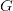
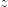

# 使用 Pix2Pix 进行图像翻译

> 原文：<https://pyimagesearch.com/2022/07/27/image-translation-with-pix2pix/>

* * *

## **目录**

* * *

## [**图像翻译用 Pix2Pix**](#TOC)

我们之前遇到的生成对抗网络(GAN)将我们带到了超分辨率领域，在那里我们训练了一个 GAN 来将低分辨率图像提升到更高的分辨率。该教程有效地展示了如何强大的甘可以。

这就把我们带到了今天的研究领域:图像到图像的翻译。我们本质上是将属于输入数据分布的图像转换为属于输出数据分布的图像。在当今的技术世界中，与计算机视觉相关的翻译问题非常普遍，这放大了今天主题的重要性。

在本教程中，您将学习使用 Pix2Pix GAN 进行图像翻译。

本课是关于 **GANs 201** 的 4 部分系列的一部分:

1.  [](https://pyimg.co/lgnrx)
2.  *[](https://pyimg.co/jt2cb)*
3.  ****[*图片翻译用 Pix2Pix*](https://pyimg.co/ma1qi) (本教程)****
4.  ***CycleGAN***

 ****要学习如何**用 Pix2Pix** ，*进行图像翻译，继续阅读。***

* * *

## [**图像翻译用 Pix2Pix**](#TOC)

* * *

### [**简介**](#TOC)

图像翻译适用于各种任务，从简单的照片增强和编辑到更细微的任务，如灰度到 RGB。例如，假设您的任务是图像增强，而您的数据集是一组成对的正常图像及其增强的对应物。这里的目标是学习输入图像到输出图像的有效映射。

Pix2Pix 的作者建立在找出输入-输出映射的基础方法上，并训练了一个额外的损失函数来加强这种映射。根据 [Pix2Pix 论文](https://arxiv.org/pdf/1611.07004.pdf)，他们的方法在各种任务中都很有效，包括(但不限于)从分割蒙版合成照片。

今天，我们将应用构建 Pix2Pix GAN 来学习如何使用加州大学伯克利分校托管的 [`cityscapes`](http://efrosgans.eecs.berkeley.edu/pix2pix/datasets/) 数据集从分割图构建真实图像。该数据集包含成对的分割蒙版集及其对应的城市景观实景图像。

需要注意的是，意象翻译可以分为两类:成对翻译和不成对翻译。我们今天的任务属于成对翻译，因为特定的分段掩码将对应于特定的真实对象。

* * *

### [**Pix2Pix 甘解构**](#TOC)

[在新标签中预览](https://pyimagesearch.com/?p=29437)

在我们深入架构细节之前，让我们理解标准 GAN 和条件 GAN 之间的区别。标准 GAN 发生器描述为 \rightarrow y)")

, where is the generator, is some random noise, and is our output.

问题是，由于随机噪声被映射到我们的输出，我们将无法控制产生什么输出。在条件 GAN 中，我们是将标签(不同于真假标签，这里的标签是指不同类型的输出数据)的思想插入到 GAN 方程中(**图 1** )。

鉴别器现在考虑输入数据

as well as the output . The generator size of the equation now shows that instead of noise, we feed the input data + noise to the generator. At the same time, the discriminator observes the input data and the generator output.

这有助于我们创建输入和我们想要的输出类型之间的映射。

在条件 GANs 的基础上，Pix2Pix 还混合了真实图像和生成图像之间的 L1 距离(两点之间的距离)。

对于发生器，Pix2Pix 利用了 U 形网(**图 2** )，因为它采用了跳跃连接。U-Net 通常由其第一组下采样层(瓶颈层)以及随后的上采样层来表征。这里要记住的关键点是下采样层连接到相应的上采样层，在**图 2** 中用虚线表示。

鉴别器是贴片 GAN 鉴别器。我们来看看**图 3** 。

正常的 GAN 鉴别器将图像作为输入，并输出单个值 0(假)或 1(真)。补丁 GAN 鉴别器将输入作为本地图像补丁进行分析。它将评估图像中的每个补丁是真是假。

在 Pix2Pix 中，补丁 GAN 将接受一对图像:输入遮罩和生成的图像，以及输入遮罩和目标图像。这是因为输出取决于输入。因此，将输入图像保留在混音中很重要(如图**图 1** 所示，其中鉴频器接收两个输入)。

让我们回顾一下发电机培训程序(**图 4** )。

输入屏蔽被送到发生器，给我们假输出。然后，我们将把(输入掩码，生成的输出)对提供给鉴别器，但标签为 1。这是“愚弄鉴别器”的部分，它将告诉生成器离生成真实图像还有多远。

接下来我们来了解一下鉴别器的流程(**图 5** )。

鉴别器训练相当简单，唯一的区别是有条件的补丁 GAN 训练。将(输入掩码，目标图像)对与 1 的标签补丁进行比较，将(输入掩码，生成的输出)对与 0 的标签补丁进行比较。

让我们使用 tensorflow 来实现它，看看它是如何工作的。

* * *

### [**配置您的开发环境**](#TOC)

要遵循这个指南，您需要在您的系统上安装 OpenCV 库。

幸运的是，OpenCV 可以通过 pip 安装:

```py
$ pip install opencv-contrib-python
```

**如果您需要帮助配置 OpenCV 的开发环境，我们*强烈推荐*阅读我们的** [***pip 安装 OpenCV* 指南**](https://pyimagesearch.com/2018/09/19/pip-install-opencv/)——它将在几分钟内让您启动并运行。

* * *

### [**在配置开发环境时遇到了问题？**](#TOC)

说了这么多，你是:

*   时间紧迫？
*   了解你雇主的行政锁定系统？
*   想要跳过与命令行、包管理器和虚拟环境斗争的麻烦吗？
*   **准备好在您的 Windows、macOS 或 Linux 系统上运行代码*****？***

 *那今天就加入 [PyImageSearch 大学](https://pyimagesearch.com/pyimagesearch-university/)吧！

**获得本教程的 Jupyter 笔记本和其他 PyImageSearch 指南，这些指南是** ***预先配置的*** **，可以在您的网络浏览器中运行在 Google Colab 的生态系统上！**无需安装。

最棒的是，这些 Jupyter 笔记本可以在 Windows、macOS 和 Linux 上运行！

* * *

### [**项目结构**](#TOC)

我们首先需要回顾我们的项目目录结构。

首先访问本教程的 ***“下载”*** 部分，检索源代码和示例图像。

从这里，看一下目录结构:

```py
!tree .
.
├── inference.py
├── outputs
│   ├── images
│   └── models
├── pyimagesearch
│   ├── config.py
│   ├── data_preprocess.py
│   ├── __init__.py
│   ├── Pix2PixGAN.py
│   ├── Pix2PixTraining.py
│   └── train_monitor.py
└── train_pix2pix.py

2 directories, 10 files
```

在`pyimagesearch`目录中，我们有:

*   `config.py`:包含我们项目的完整配置管道。
*   `data_preprocess.py`:包含帮助我们准备 GAN 培训数据的脚本。
*   `__init__.py`:使`pyimagesearch`目录像 python 库一样工作。
*   `Pix2PixGAN.py`:包含 Pix2Pix GAN 架构。
*   `Pix2PIxTraining.py`:包含打包成类的完整 GAN 训练管道。
*   `train_monitor.py`:包含帮助监控模型训练的回调。

在核心目录中，我们有:

*   `outputs`:包含我们项目的输出(即推理图像和模型权重)。
*   `inference.py`:包含使用我们训练的模型权重进行推理的脚本。
*   `train_pix2pix.py`:包含训练 Pix2Pix GAN 模型的脚本。

* * *

### [**配置先决条件**](#TOC)

`pyimagesearch`目录中的`config.py`脚本包含了这个项目的整个配置管道。

```py
# import the necessary packages
import os

# name of the dataset we will be using 
DATASET = "cityscapes"

# build the dataset URL
DATASET_URL = f"http://efrosgans.eecs.berkeley.edu/pix2pix/datasets/{DATASET}.tar.gz"

# define the batch size
TRAIN_BATCH_SIZE = 32
INFER_BATCH_SIZE = 8

# dataset specs
IMAGE_WIDTH = 256
IMAGE_HEIGHT = 256
IMAGE_CHANNELS = 3

# training specs
LEARNING_RATE = 2e-4
EPOCHS = 150
STEPS_PER_EPOCH = 100

# path to our base output directory
BASE_OUTPUT_PATH = "outputs"

# GPU training pix2pix model paths
GENERATOR_MODEL = os.path.join(BASE_OUTPUT_PATH, "models",
  "generator")

# define the path to the inferred images and to the grid image
BASE_IMAGES_PATH = os.path.join(BASE_OUTPUT_PATH, "images")
GRID_IMAGE_PATH = os.path.join(BASE_IMAGE_PATH, "grid.png")
```

在**第 5** 行，我们指定了将用于我们项目的加州大学伯克利分校数据集。数据集的相应 URL 在第 8 行的**中指定。**

随后在**行 11 和 12** 上定义训练和推理批量。

接下来，定义图像规范(**第 15-17 行**)。最后，定义 GAN 训练规范，即学习速率、时期和每个时期的步数(**第 20-22 行**)。

在**第 25 行**上，我们定义了`outputs`文件夹，接着是保存发电机重量的路径(**第 28 和 29 行**)。最后，定义`images`文件夹和推理图像网格路径(**第 32 行和第 33 行**)，结束`config.py`脚本。

* * *

### [**创建数据处理管道**](#TOC)

gan 严重依赖于数据。因此，拥有强大的数据管道非常重要。让我们看看`data_preprocess.py`脚本中的数据管道。

```py
# import the necessary packages
import tensorflow as tf

# define the module level autotune
AUTO = tf.data.AUTOTUNE

def load_image(imageFile):
	# read and decode an image file from the path
	image = tf.io.read_file(imageFile)
	image = tf.io.decode_jpeg(image, channels=3)

	# calculate the midpoint of the width and split the
	# combined image into input mask and real image 
	width = tf.shape(image)[1]
	splitPoint = width // 2
	inputMask = image[:, splitPoint:, :]
	realImage = image[:, :splitPoint, :]

	# convert both images to float32 tensors and
	# convert pixels to the range of -1 and 1
	inputMask = tf.cast(inputMask, tf.float32)/127.5 - 1
	realImage = tf.cast(realImage, tf.float32)/127.5 - 1

	# return the input mask and real label image
	return (inputMask, realImage)
```

在第 7 行的**上，我们有`load_image`函数，它将图像路径作为它的参数。**

首先，我们从图像的路径中读取并解码图像(**行 9 和 10** )。我们数据集的图像采用**图 7** 的格式。

图像的形状为`(256, 512, 3)`。为了创建输入掩模和实像对，我们计算中点(**行 14 和 15** )并相应地将基础图像分割成输入掩模和实像对(**行 16 和 17** )。

有了创建的对，我们将张量转换成`float32`格式，并将像素带到从`0`到`255``-1`到`1`的范围内(**第 21 行和第 22 行**)。

```py
def random_jitter(inputMask, realImage, height, width):
	# upscale the images for cropping purposes
	inputMask = tf.image.resize(inputMask, [height, width],
		method=tf.image.ResizeMethod.NEAREST_NEIGHBOR)
	realImage = tf.image.resize(realImage, [height, width],
		method=tf.image.ResizeMethod.NEAREST_NEIGHBOR)

	# return the input mask and real label image
	return (inputMask, realImage)
```

Pix2Pix 的作者谈到了发电机输入中随机噪声的重要性。注意在**图 1** 中，随着输入`x`，发生器也接收随机噪声`z`。这是因为如果我们不提供噪声，我们会使 GAN 非常特定于数据集。

为了确保泛化，我们需要在输入中加入一些随机噪声。我们通过简单地将输入图像调整到更高的分辨率(**第 29-32 行**)然后使用`random_jitter`函数将它们缩小(在我们加载数据之前)来实现。

```py
class ReadTrainExample(object):
	def __init__(self, imageHeight, imageWidth):
		self.imageHeight = imageHeight
		self.imageWidth = imageWidth

	def __call__(self, imageFile):
		# read the file path and unpack the image pair
		inputMask, realImage = load_image(imageFile)

		# perform data augmentation
		(inputMask, realImage) = random_jitter(inputMask, realImage,
			self.imageHeight+30, self.imageWidth+30)

		# reshape the input mask and real label image
		inputMask = tf.image.resize(inputMask,
			[self.imageHeight, self.imageWidth])
		realImage = tf.image.resize(realImage,
			[self.imageHeight, self.imageWidth])

		# return the input mask and real label image
		return (inputMask, realImage)
```

现在我们将使用`read_train_example`类对所有创建的函数进行分组。`__init__`函数初始化图像高度和宽度的类变量(**第 38-40 行**)，而`__call__`函数将图像路径作为其参数(**第 42 行**)。

在**第 44 行**，我们使用之前定义的`load_image`函数得到图像对。然后我们使用`random_jitter`函数来放大图像，并给我们的图像添加随机的伪像(**第 47 行**)。

然后，我们将图像调整为`(256, 256, 3)`，以适应我们的项目管道(**第 51-54 行**)。

```py
class ReadTestExample(object):
	def __init__(self, imageHeight, imageWidth):
		self.imageHeight = imageHeight
		self.imageWidth = imageWidth

	def __call__(self, imageFile):
		# read the file path and unpack the image pair
		(inputMask, realImage) = load_image(imageFile)

		# reshape the input mask and real label image
		inputMask = tf.image.resize(inputMask,
			[self.imageHeight, self.imageWidth])
		realImage = tf.image.resize(realImage,
			[self.imageHeight, self.imageWidth])

		# return the input mask and real label image
		return (inputMask, realImage)
```

像`read_train_example`一样，我们专门为测试数据集创建了`ReadTestExample`类(**第 59 行**)。类的内容保持不变，除了我们没有应用任何增加和调整图像大小以适应项目管道(**第 59-75 行**)。

```py
def load_dataset(path, batchSize, height, width, train=False):
	# check if this is the training dataset
	if train:
		# read the training examples
		dataset = tf.data.Dataset.list_files(str(path/"train/*.jpg"))
		dataset = dataset.map(ReadTrainExample(height, width),
			num_parallel_calls=AUTO)
	# otherwise, we are working with the test dataset
	else:
		# read the test examples
		dataset = tf.data.Dataset.list_files(str(path/"val/*.jpg"))
		dataset = dataset.map(ReadTestExample(height, width),
			num_parallel_calls=AUTO)

	# shuffle, batch, repeat and prefetch the dataset
	dataset = (dataset
		.shuffle(batchSize * 2)
		.batch(batchSize)
		.repeat()
		.prefetch(AUTO)
	)

	# return the dataset
	return dataset
```

在**的第 77** 行，我们创建了`load_dataset`函数，它接受数据集路径、批量大小和一个 bool 变量`train`，该变量将确定函数是返回训练数据集还是测试数据集。

在**第 79-83 行**上，我们定义了`train`布尔值被设置为`True`的条件。数据集被初始化，并且`ReadTrainExample`函数被映射到所有条目。对于被设置为`False`的`train`布尔值，我们初始化数据集并将`read_test_example`函数映射到所有条目。

接下来是批处理和预取数据(**第 92-97 行**)。这就结束了`load_dataset`功能。

* * *

### [**创建 Pix2Pix 架构**](#TOC)

对于 Pix2Pix 架构，我们需要定义一个 U-Net 生成器和一个补丁 GAN 鉴别器。让我们进入`Pix2PixGAN.py`脚本。

```py
# import the necessary packages
from tensorflow.keras.layers import BatchNormalization
from tensorflow.keras.layers import Conv2DTranspose
from tensorflow.keras.layers import LeakyReLU
from tensorflow.keras.layers import concatenate
from tensorflow.keras.layers import MaxPool2D
from tensorflow.keras.layers import Conv2D
from tensorflow.keras.layers import Dropout
from tensorflow.keras import Model
from tensorflow.keras import Input

class Pix2Pix(object):
	def __init__(self, imageHeight, imageWidth):
		# initialize the image height and width
		self.imageHeight = imageHeight
		self.imageWidth = imageWidth

	def generator(self):
		# initialize the input layer
		inputs = Input([self.imageHeight, self.imageWidth, 3])

		# down Layer 1 (d1) => final layer 1 (f1)
		d1 = Conv2D(32, (3, 3), activation="relu", padding="same")(
			inputs)
		d1 = Dropout(0.1)(d1)
		f1 = MaxPool2D((2, 2))(d1)

		# down Layer 2 (l2) => final layer 2 (f2)
		d2 = Conv2D(64, (3, 3), activation="relu", padding="same")(f1)
		f2 = MaxPool2D((2, 2))(d2)

		#  down Layer 3 (l3) => final layer 3 (f3)
		d3 = Conv2D(96, (3, 3), activation="relu", padding="same")(f2)
		f3 = MaxPool2D((2, 2))(d3)

		# down Layer 4 (l3) => final layer 4 (f4)
		d4 = Conv2D(96, (3, 3), activation="relu", padding="same")(f3)
		f4 = MaxPool2D((2, 2))(d4)

		# u-bend of the u-bet
		b5 = Conv2D(96, (3, 3), activation="relu", padding="same")(f4)
		b5 = Dropout(0.3)(b5)
		b5 = Conv2D(256, (3, 3), activation="relu", padding="same")(b5)

		# upsample Layer 6 (u6)
		u6 = Conv2DTranspose(128, (2, 2), strides=(2, 2),
			padding="same")(b5)
		u6 = concatenate([u6, d4])
		u6 = Conv2D(128, (3, 3), activation="relu", padding="same")(
			u6)

		# upsample Layer 7 (u7)
		u7 = Conv2DTranspose(96, (2, 2), strides=(2, 2),
			padding="same")(u6)
		u7 = concatenate([u7, d3])
		u7 = Conv2D(128, (3, 3), activation="relu", padding="same")(
			u7)

		# upsample Layer 8 (u8)
		u8 = Conv2DTranspose(64, (2, 2), strides=(2, 2),
			padding="same")(u7)
		u8 = concatenate([u8, d2])
		u8 = Conv2D(128, (3, 3), activation="relu", padding="same")(u8)

		# upsample Layer 9 (u9)
		u9 = Conv2DTranspose(32, (2, 2), strides=(2, 2),
			padding="same")(u8)
		u9 = concatenate([u9, d1])
		u9 = Dropout(0.1)(u9)
		u9 = Conv2D(128, (3, 3), activation="relu", padding="same")(u9)

		# final conv2D layer
		outputLayer = Conv2D(3, (1, 1), activation="tanh")(u9)

		# create the generator model
		generator = Model(inputs, outputLayer)

		# return the generator
		return generator
```

我们将生成器和鉴别器打包成一个类，以便于访问( **Line 12** )。

在**图 2** 中，我们已经展示了 U 型网应该是什么样子。在**第 20 行**，我们开始定义发电机模型的输入。接下来是一个`Conv2D`、`Dropout`和一个`MaxPool2D`层。该层稍后将与一个上采样层连接，因此我们存储`Conv2D`层输出(**行 23-26** )。

接下来是 3 组`Conv2D`和`MaxPool2D`层(**线 29-38** )。这些图层表示缩减像素采样图层。**第 41-43 行**表示 U 形网的瓶颈层。

后续层是上采样层。第一组上采样层与最后一个下采样层连接。第二组上采样层与倒数第二个下采样层连接。最后一组上采样层与第一个下采样层`Conv2D`输出连接在一起(**第 46-70 行**)。

最后的输出层是一个`Conv2D`层，将输出带到`256, 256, 3` ( **线 73** )。

```py
	def discriminator(self):
		# initialize input layer according to PatchGAN
		inputMask = Input(shape=[self.imageHeight, self.imageWidth, 3], 
			name="input_image"
		)
		targetImage = Input(
			shape=[self.imageHeight, self.imageWidth, 3], 
			name="target_image"
		)

		# concatenate the inputs
		x = concatenate([inputMask, targetImage])  

		# add four conv2D convolution layers
		x = Conv2D(64, 4, strides=2, padding="same")(x)  
		x = LeakyReLU()(x)
		x = Conv2D(128, 4, strides=2, padding="same")(x)
		x = LeakyReLU()(x)  
		x = Conv2D(256, 4, strides=2, padding="same")(x)
		x = LeakyReLU()(x)   
		x = Conv2D(512, 4, strides=1, padding="same")(x)  

		# add a batch-normalization layer => LeakyReLU => zeropad
		x = BatchNormalization()(x)
		x = LeakyReLU()(x)

		# final conv layer
		last = Conv2D(1, 3, strides=1)(x) 

		# create the discriminator model
		discriminator = Model(inputs=[inputMask, targetImage],
			outputs=last)

		# return the discriminator
		return discriminator
```

在**第 81 行**，我们定义了鉴别器。如前所述，条件鉴别器将接受两幅图像作为其输入(**第 83-89 行**)。我们在第 92 行的**处连接两个图像，接着是标准的`Conv2D`和`LeakyReLU`层(**行 95-101** )。**

在**线 104** 上添加一个批次归一化层，之后是另一个`LeakyReLU`层。最后的`Conv2D`层被添加为具有`30x30x1`面片输出(**线 108** )。鉴频器在**线 111** 上创建，包括鉴频器和 Pix2Pix GAN 架构。

* * *

### [**搭建 Pix2Pix GAN 训练流水线**](#TOC)

Pix2Pix GAN 训练过程与普通 GAN 略有不同。所以让我们进入`Pix2PixTraining.py`脚本。

```py
# import the necessary packages
from tensorflow.keras import Model
import tensorflow as tf

class Pix2PixTraining(Model):
	def __init__(self, generator, discriminator):
		super().__init__()
		# initialize the generator, discriminator
		self.generator = generator
		self.discriminator = discriminator

	def compile(self, gOptimizer, dOptimizer, bceLoss, maeLoss):
		super().compile()
		# initialize the optimizers for the generator 
		# and discriminator
		self.gOptimizer = gOptimizer
		self.dOptimizer = dOptimizer

		# initialize the loss functions
		self.bceLoss = bceLoss
		self.maeLoss = maeLoss
```

为了便于理解，我们将整个过程打包成一个类( **Line 5** )。

在**第 6 行**上，我们定义了`__init__`函数，它将生成器和鉴别器作为参数，并创建这些参数的特定于类的变量副本(**第 9 行和第 10 行**)。

下一个函数是`compile`，它包含生成器优化器、鉴别器优化器和损失函数(**第 12 行**)。该函数创建参数的对应类变量(**第 16-21 行**)。

```py
	def train_step(self, inputs):
		# grab the input mask and corresponding real images
		(inputMask, realImages) = inputs

		# initialize gradient tapes for both generator and discriminator
		with tf.GradientTape() as genTape, tf.GradientTape() as discTape:
			# generate fake images
			fakeImages = self.generator(inputMask, training=True)

			# discriminator output for real images and fake images
			discRealOutput = self.discriminator(
				[inputMask, realImages], training=True)
			discFakeOutput = self.discriminator(
				[inputMask, fakeImages], training=True)
```

第 23 行**上的`train_step`函数将图像对作为其参数。首先，我们解开图像对(**第 25 行**)。然后我们初始化两个梯度带，一个用于鉴别器，一个用于发生器(**行 28** )。**

我们首先将输入遮罩图像通过生成器，并获得假输出(**第 30 行**)。

接下来，我们将输入遮罩和真实目标图像通过补丁 GAN 鉴别器，并将其存储为`discRealOutput` ( **第 33 行和第 34 行**)。类似地，我们将输入掩码和假图像一起通过补丁 GAN，并将输出存储为`discFakeOutput` ( **行 35 和 36** )。

```py
			# compute the adversarial loss for the generator
			misleadingImageLabels = tf.ones_like(discFakeOutput) 
			ganLoss = self.bceLoss(misleadingImageLabels, discFakeOutput)

			# compute the mean absolute error between the fake and the
			# real images
			l1Loss = self.maeLoss(realImages, fakeImages)

			# compute the total generator loss
			totalGenLoss = ganLoss + (10 * l1Loss)

			# discriminator loss for real and fake images
			realImageLabels = tf.ones_like(discRealOutput)
			realDiscLoss = self.bceLoss(realImageLabels, discRealOutput)
			fakeImageLabels = tf.zeros_like(discFakeOutput)
			generatedLoss = self.bceLoss(fakeImageLabels, discFakeOutput)

			# compute the total discriminator loss
			totalDiscLoss = realDiscLoss + generatedLoss

		# calculate the generator and discriminator gradients
		generatorGradients = genTape.gradient(totalGenLoss, 
			self.generator.trainable_variables
		)
		discriminatorGradients = discTape.gradient(totalDiscLoss, 
			self.discriminator.trainable_variables
		)

		# apply the gradients to optimize the generator and discriminator
		self.gOptimizer.apply_gradients(zip(generatorGradients,
			self.generator.trainable_variables)
		)
		self.dOptimizer.apply_gradients(zip(discriminatorGradients,
			self.discriminator.trainable_variables)
		)

		# return the generator and discriminator losses
		return {"dLoss": totalDiscLoss, "gLoss": totalGenLoss}
```

首先，我们将计算发电机损耗。为此，我们简单地将伪标签(1s) ( **第 39 行**)关联到伪鉴别器输出补丁，并计算目标真实图像和预测伪图像(**第 40-44 行**)之间的`l1`距离。`l1`距离将通过直接将信息从真实图像转换到生成器来帮助捕捉更精细的细节。

我们将两个损耗相加，得出发电机损耗(**行 47** )。对于我们的项目，`L1`损失的`lambda`系数设置为`10`。但是，论文要求放成 1000。

接下来，我们进入鉴别训练。输入掩模-真实图像补丁 GAN 输出与 1 的补丁进行比较，而输入掩模-伪图像补丁 GAN 输出与 0 的补丁进行比较。这是正常的 GAN 训练，但增加了对补丁 GAN 和条件 GAN 的要求(**第 50-53 行**)。

然后计算梯度并应用于可训练重量(**第 59-75 行**)。

* * *

### [**训练 Pix2Pix 甘**](#TOC)

有了我们的架构和培训管道，我们只需要正确地执行这两个脚本。让我们进入`train_pix2pix.py`脚本。

```py
# USAGE
# python train_pix2pix.py 

# import tensorflow and fix the random seed for better reproducibility
import tensorflow as tf
tf.random.set_seed(42)

# import the necessary packages
from pyimagesearch import config
from pyimagesearch.Pix2PixTraining import Pix2PixTraining
from pyimagesearch.Pix2PixGAN import Pix2Pix
from pyimagesearch.data_preprocess import load_dataset
from pyimagesearch.train_monitor import get_train_monitor
from tensorflow.keras.optimizers import Adam
from tensorflow.keras.losses import BinaryCrossentropy
from tensorflow.keras.losses import MeanAbsoluteError
from tensorflow.keras.utils import get_file
import pathlib
import os

# download the cityscape training dataset 
print("[INFO] downloading the dataset...")
pathToZip = get_file(
	fname=f"{config.DATASET}.tar.gz",
	origin=config.DATASET_URL,
	extract=True
)
pathToZip  = pathlib.Path(pathToZip)
path = pathToZip.parent/config.DATASET

# build the training dataset
print("[INFO] building the train dataset...")
trainDs = load_dataset(path=path, train=True,
	batchSize=config.TRAIN_BATCH_SIZE, height=config.IMAGE_HEIGHT,
	width=config.IMAGE_WIDTH)

# build the test dataset
print("[INFO] building the test dataset...")
testDs = load_dataset(path=path, train=False,
	batchSize=config.INFER_BATCH_SIZE, height=config.IMAGE_HEIGHT,
	width=config.IMAGE_WIDTH)
```

使用`tensorflow`的`get_file`函数下载`cityscapes`数据集(**第 23-27 行**，我们使用`pathlib`高效地存储指向文件路径的指针(**第 28 和 29 行**)。

在**的第 33-35 行**，我们使用之前在`data_processing.py`脚本中创建的`load_dataset`函数构建训练数据集。

在**的第 39-41 行**，我们使用之前在`data_processing.py`脚本中创建的`load_dataset`函数构建测试数据集。

```py
# initialize the generator and discriminator network
print("[INFO] initializing the generator and discriminator...")
pix2pixObject = Pix2Pix(imageHeight=config.IMAGE_HEIGHT,
	imageWidth=config.IMAGE_WIDTH)
generator = pix2pixObject.generator()
discriminator = pix2pixObject.discriminator()

# build the pix2pix training model and compile it
pix2pixModel = Pix2PixTraining(
	generator=generator,
	discriminator=discriminator)
pix2pixModel.compile(
	dOptimizer=Adam(learning_rate=config.LEARNING_RATE),
	gOptimizer=Adam(learning_rate=config.LEARNING_RATE),
	bceLoss=BinaryCrossentropy(from_logits=True),
	maeLoss=MeanAbsoluteError(),
)

# check whether output model directory exists
# if it doesn't, then create it
if not os.path.exists(config.BASE_OUTPUT_PATH):
	os.makedirs(config.BASE_OUTPUT_PATH)

# check whether output image directory exists, if it doesn't, then
# create it
if not os.path.exists(config.BASE_IMAGES_PATH):
	os.makedirs(config.BASE_IMAGES_PATH)

# train the pix2pix model
print("[INFO] training the pix2pix model...")
callbacks = [get_train_monitor(testDs, epochInterval=10,
	imagePath=config.BASE_IMAGES_PATH,
	batchSize=config.INFER_BATCH_SIZE)]
pix2pixModel.fit(trainDs, epochs=config.EPOCHS, callbacks=callbacks,
	steps_per_epoch=config.STEPS_PER_EPOCH)

# set the path for the generator
genPath = config.GENERATOR_MODEL

# save the pix2pix generator
print(f"[INFO] saving pix2pix generator to {genPath}...")
pix2pixModel.generator.save(genPath)
```

在**行 45** 上，我们构建`Pix2Pix`网络对象，接着是生成器和鉴别器(**行 47 和 48** )。然后构建一个`Pix2PixTraining`管道对象，将之前创建的生成器和鉴别器作为参数传递。然后使用`Adam`优化器和二进制交叉熵以及平均绝对误差损失来编译流水线(**第 51-59 行**)。

如果输出目录还没有被创建的话，就创建输出目录(**第 63-69 行**)。我们定义`callbacks`并使用我们的定制回调函数来跟踪训练(**第 73-75 行**)。

倒数第二步是将数据拟合到我们的 Pix2Pix 模型中，参数包括时期和每个时期的步数(**行 76 和 77** )。

最后，我们将训练生成器保存在配置管道中设置的路径中(**行 80 和 84** )。

* * *

### [**构建推理脚本**](#TOC)

为了评估生成器的预测，我们将构建一个推理脚本。让我们进入`inference.py`脚本。

```py
# USAGE
# python inference.py 

# import tensorflow and fix the random seed for better reproducibility
import tensorflow as tf
tf.random.set_seed(42)

# import the necessary packages
from pyimagesearch import config
from pyimagesearch.data_preprocess import load_dataset
from tensorflow.keras.preprocessing.image import array_to_img
from tensorflow.keras.models import load_model
from tensorflow.keras.utils import get_file
from matplotlib.pyplot import subplots
import pathlib
import os

# download the cityscape training dataset 
print("[INFO] downloading the dataset...")
pathToZip = get_file(
	fname=f"{config.DATASET}.tar.gz",
	origin=config.DATASET_URL,
	extract=True
)
pathToZip  = pathlib.Path(pathToZip)
path = pathToZip.parent/config.DATASET

# build the test dataset
print("[INFO] building the test dataset...")
testDs = load_dataset(path=path, train=False,
	batchSize=config.INFER_BATCH_SIZE, height=config.IMAGE_HEIGHT,
	width=config.IMAGE_WIDTH)
```

回显训练脚本，我们使用 tensorflow 和 pathlib ( **第 20-32 行)**中的`get_file`函数，以与构建训练数据集相同的方式构建测试数据集。

```py
# get the first batch of testing images
(inputMask, realImage) = next(iter(testDs))

# set the path for the generator
genPath = config.GENERATOR_MODEL

# load the trained pix2pix generator
print("[INFO] loading the trained pix2pix generator...")
pix2pixGen = load_model(genPath, compile=False)

# predict using pix2pix generator
print("[INFO] making predictions with the generator...")
pix2pixGenPred = pix2pixGen.predict(inputMask)

# plot the respective predictions
print("[INFO] saving the predictions...")
(fig, axes) = subplots(nrows=config.INFER_BATCH_SIZE, ncols=3,
	figsize=(50, 50))
```

在**第 35 行**，我们抓取第一批测试图像。然后使用发电机路径将训练好的发电机重量加载到**线 42** 上。

输入的测试图像然后被用于进行预测(**行 46** )。为了绘制这些图像，我们定义了一个支线剧情(**第 50 行和第 51 行**)。

```py
# plot the predicted images 
for (ax, inp, pred, tar) in zip(axes, inputMask,
	p2pGenPred, realImage):
	# plot the input mask image
	ax[0].imshow(array_to_img(inp))
	ax[0].set_title("Input Image")

	# plot the predicted Pix2Pix image
	ax[1].imshow(array_to_img(pred))
	ax[1].set_title("pix2pix prediction")

	# plot the ground truth
	ax[2].imshow(array_to_img(tar))
	ax[2].set_title("Target label")

# check whether output image directory exists, if it doesn't, then
# create it
if not os.path.exists(config.BASE_IMAGEs_PATH):
	os.makedirs(config.BASE_IMAGES_PATH)

# serialize the results to disk
print("[INFO] saving the pix2pix predictions to disk...")
fig.savefig(config.GRID_IMAGE_PATH)
```

我们循环输入图像、预测和真实图像，为我们的最终网格图像绘制每个图像(**第 54-66 行**)。可视化然后被保存在配置文件中设置的输出图像路径中(**第 70-75 行**)。

* * *

### [**大楼训练班长**](#TOC)

在我们看到训练结果之前，让我们快速浏览一下`train_monitor.py`脚本。

```py
# import the necessary packages
from tensorflow.keras.preprocessing.image import array_to_img
from tensorflow.keras.callbacks import Callback
from matplotlib.pyplot import subplots
import matplotlib.pyplot as plt
import tensorflow as tf

def get_train_monitor(testDs, imagePath, batchSize, epochInterval):
	# grab the input mask and the real image from the testing dataset
	(tInputMask, tRealImage) = next(iter(testDs))

	class TrainMonitor(Callback):
		def __init__(self, epochInterval=None):
			self.epochInterval = epochInterval

		def on_epoch_end(self, epoch, logs=None):
			if self.epochInterval and epoch % self.epochInterval == 0:
				# get the pix2pix prediction
				tPix2pixGenPred = self.model.generator.predict(tInputMask)

				(fig, axes) = subplots(nrows=batchSize, ncols=3,
					figsize=(50, 50))
```

在**行 8** 上定义了`get_train_monitor`函数，该函数将测试数据集、图像路径、批量大小和时期间隔作为其参数。我们用`iter`抓取一批数据来预测(**第 10 行**)。

我们创建一个名为`TrainMonitior`的类，继承自 keras `Callback`类(**第 12 行**)。这里要注意的主要函数是`on_epoch_end`，它接受历元作为参数(**第 16 行**)。

当历元达到可以被`epochInterval`值整除的某些点时，我们将显示来自生成器的预测(**第 19 行**)。为了绘制这些结果，我们将在第 21 行**和第 22 行**创建一个支线剧情。

```py
				# plot the predicted images 
				for (ax, inp, pred, tgt) in zip(axes, tInputMask,
					tPix2pixGenPred, tRealImage):
					# plot the input mask image
					ax[0].imshow(array_to_img(inp))
					ax[0].set_title("Input Image")

					# plot the predicted Pix2Pix image
					ax[1].imshow(array_to_img(pred))
					ax[1].set_title("Pix2Pix Prediction")

					# plot the ground truth
					ax[2].imshow(array_to_img(tgt))
					ax[2].set_title("Target Label")

				plt.savefig(f"{imagePath}/{epoch:03d}.png")
				plt.close()

	# instantiate a train monitor callback
	trainMonitor = TrainMonitor(epochInterval=epochInterval)

	# return the train monitor
	return trainMonitor
```

该功能的下一部分是绘制输入掩码、预测和基本事实(**第 25-40 行**)。最后，我们实例化一个`trainMonitor`对象并结束函数。

* * *

### [**分析训练程序**](#TOC)

我们来分析一下培训损失。

```py
[INFO] training pix2pix...
Epoch 1/150
100/100 [==============================] - 62s 493ms/step - dLoss: 0.7812 - gLoss: 4.8063
Epoch 2/150
100/100 [==============================] - 46s 460ms/step - dLoss: 1.2357 - gLoss: 3.3020
Epoch 3/150
100/100 [==============================] - 46s 460ms/step - dLoss: 0.9255 - gLoss: 4.4217
...
Epoch 147/150
100/100 [==============================] - 46s 457ms/step - dLoss: 1.3285 - gLoss: 2.8975
Epoch 148/150
100/100 [==============================] - 46s 458ms/step - dLoss: 1.3033 - gLoss: 2.8646
Epoch 149/150
100/100 [==============================] - 46s 457ms/step - dLoss: 1.3058 - gLoss: 2.8853
Epoch 150/150
100/100 [==============================] - 46s 458ms/step - dLoss: 1.2994 - gLoss: 2.8826
```

我们看到损耗值有些波动，但最终，发电机损耗会下降。波动可归因于`L1`损失，其中我们比较像素值。

由于许多图像，我们分别比较像素的距离，以复制图像的更好的细节，损失将试图抵抗，最终下降到一个值得尊敬的值。

* * *

### [**Pix2Pix 可视化**](#TOC)

让我们分析我们的 Pix2Pix 模型的可视化(**图 8 和 9** )。

正如我们从输入分段掩码中看到的，Pix2Pix 预测几乎捕获了由输入图像掩码表示的信息的全部本质。

请注意，输入掩码没有更好的细节，如白色道路油漆、标志文字等。因此，这些没有反映在预测中。然而，一般的观察，像灰色的道路、绿色的树木和黑色的汽车，已经成功地出现在预测中。

* * *

* * *

## [**汇总**](#TOC)

今天，我们学习了 Pix2Pix，这是一种生成性对抗网络，可以创建输入到输出的映射。它利用了对抗损失的概念和生成图像与输出图像之间的像素距离。不利的损失使我们的发电机按预期工作。像素损失有助于开发更精细的细节。

可视化结果表明，我们的模型已经非常健壮地学习了输入-输出映射。输出非常接近实际的真实图像，表明我们的损失函数也工作正常。

损失的停滞有时可归因于难以使像素方向的损失达到较低值。

* * *

### [**引用信息**](#TOC)

**Chakraborty，D.** “使用 Pix2Pix 的图像翻译”， *PyImageSearch* ，P. Chugh，A. R. Gosthipaty，S. Huot，K. Kidriavsteva，R. Raha 和 A. Thanki 编辑。，2022 年，【https://pyimg.co/ma1qi 

```py
@incollection{Chakraborty_2022_ImageTransPix2Pix,
  author = {Devjyoti Chakraborty},
  title = {Image Translation with Pix2Pix},
  booktitle = {PyImageSearch},
  editor = {Puneet Chugh and Aritra Roy Gosthipaty and Susan Huot and Kseniia Kidriavsteva and Ritwik Raha and Abhishek Thanki},
  year = {2022},
  note = {https://pyimg.co/ma1qi},
}
```

* * *

**要下载这篇文章的源代码(并在未来教程在 PyImageSearch 上发布时得到通知)，*只需在下面的表格中输入您的电子邮件地址！******