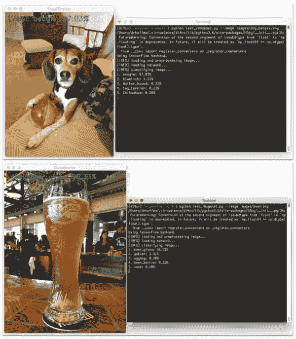
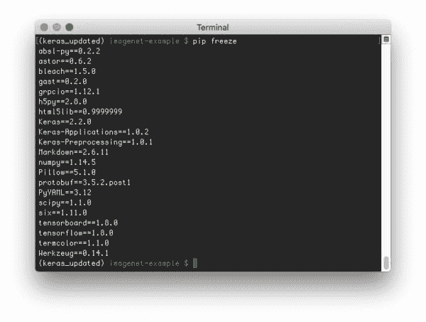
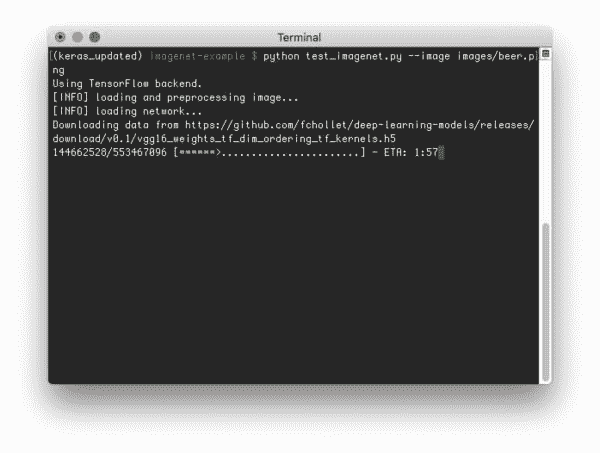
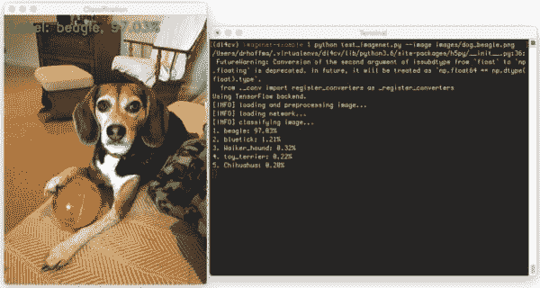
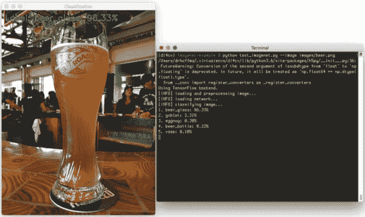
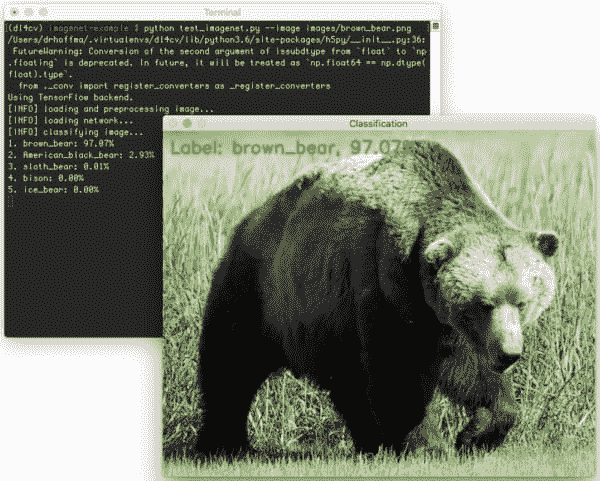
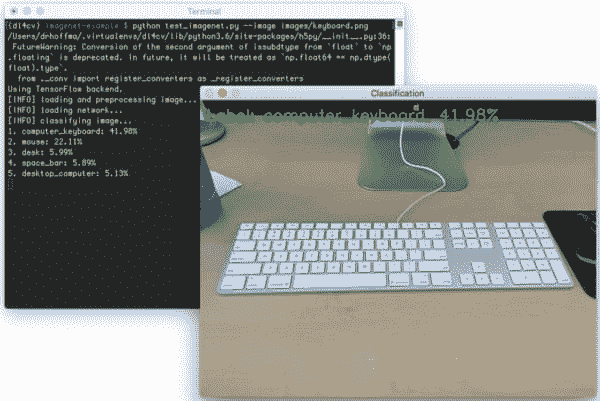
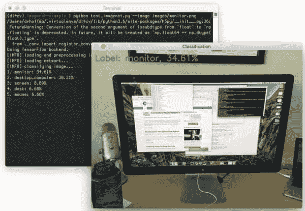
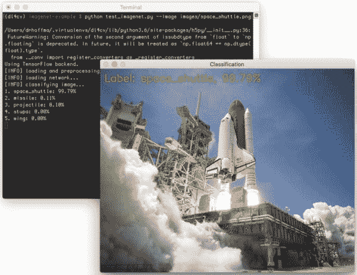
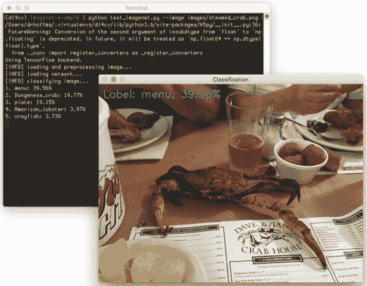

# 使用 python 和 keras 进行图像分类

> 原文：<https://pyimagesearch.com/2016/08/10/imagenet-classification-with-python-and-keras/>

[](https://pyimagesearch.com/wp-content/uploads/2016/08/imagenet_example_header.jpg)

通常，我只在周一 ***发表博文，但我对这一篇如此兴奋，以至于迫不及待，我决定提前按下发布键。***

你看，就在几天前，[Fran ois Chollet](https://github.com/fchollet)在网上推了三个 Keras 模型(VGG16、VGG19 和 resnet 50)——这些网络是在 ImageNet 数据集上预先训练好的****，也就是说它们可以开箱即可识别***1000 个常见对象类。*******

 **要在您自己的应用中利用这些模型，您需要做的就是:

1.  Install Keras.
2.  下载预训练网络的权重文件(当您导入和实例化相应的网络架构时，我们会自动为您完成)。
3.  将预先训练的 ImageNet 网络应用到您自己的映像中。

真的就这么简单。

那么，为什么这如此令人兴奋呢？我的意思是，我们已经有了流行的预训练 ImageNet 分类网络的权重，对吗？

问题是这些权重文件是 Caffe 格式的——虽然 Caffe 库可能是许多研究人员用来构建新的网络架构、训练和评估它们的当前标准，但 Caffe 也不是世界上对 Python 最友好的库，至少在构建网络架构本身方面是如此。

***注意:**你可以用 Caffe-Python 绑定做一些很酷的东西，但是我主要关注 Caffe 架构和训练过程本身是如何通过`.prototxt`配置文件定义的，而不是可以插入逻辑的*代码*。*

还有一个事实是，没有一个简单的方法可以将 Caffe 权重转换成 Keras 兼容的模型。

**现在一切都开始改变了** —我们现在可以使用 Keras 和 Python 轻松地将 VGG16、VGG19 和 ResNet50 应用到我们自己的应用程序*中，而*不必担心 Caffe = > Keras 重量转换过程。

事实上，现在用 Python 和 Keras 在 ImageNet 数据集上预先训练的卷积神经网络对图像进行分类就像这三行代码一样简单:

```py
model = VGG16(weights="imagenet")
preds = model.predict(preprocess_input(image))
print(decode_predictions(preds))

```

当然，还有一些其他需要使用的导入和帮助函数— *但是我想你已经明白了:*

现在*使用 Python 和 Keras 应用 ImageNet 级别的预训练网络非常简单*。

想知道怎么做，请继续阅读。

## 使用 python 和 keras 进行图像分类

在本教程的剩余部分，我将解释什么是 ImageNet 数据集，然后提供 Python 和 Keras 代码，使用*最先进的*网络架构将图像分类到 *1，000 个不同的类别*。

### 什么是 ImageNet？

在计算机视觉和深度学习社区中，围绕 ImageNet 是什么和不是什么，您可能会遇到一点上下文混淆。

你看， [ImageNet](http://image-net.org/index) 实际上是一个*项目*，旨在根据一组定义好的单词和短语将图像标记和分类成近 22，000 个类别。在撰写本文时，ImageNet 项目中有超过 1400 万张*图片*。

那么，ImageNet 是如何组织的呢？

为了订购如此大量的数据，ImageNet 实际上遵循了 [WordNet 层次结构](https://wordnet.princeton.edu/)。WordNet 中的每个有意义的单词/短语被称为“同义词集”或简称“同义词集”。在 ImageNet 项目中，根据这些 synset 组织图像，目标是每个 synset 有 1，000 多个图像。

#### ImageNet 大规模识别挑战(ILSVRC)

在计算机视觉和深度学习的背景下，每当你听到人们谈论 ImageNet 时，他们很可能指的是 *[ImageNet 大规模识别挑战](http://www.image-net.org/challenges/LSVRC/)* ，或者简称为 ILSVRC。

这项挑战中图像分类跟踪的目标是训练一个模型，该模型可以使用超过 *100，000 张*测试图像将图像分类为 *1，000 个单独的类别*-训练数据集本身包含大约 120 万张图像。

当您阅读这篇博文的剩余部分或其他与 ImageNet 相关的教程和论文时，请务必牢记 ImageNet 的背景。虽然在图像分类、对象检测和场景理解的上下文中，我们经常将 ImageNet 称为*分类挑战以及与挑战*相关联的数据集，但请记住，还有一个更广泛的项目称为 ImageNet，在该项目中，这些图像被收集、注释和组织。

### 为 keras 和 imagenes 配置您的系统

要配置您的系统使用最先进的 VGG16、VGG19 和 ResNet50 网络，请确保您遵循我的最新教程[在 Ubuntu 上安装 Keras](https://pyimagesearch.com/2017/09/25/configuring-ubuntu-for-deep-learning-with-python/)或在 macOS 上安装。GPU Ubuntu 用户要看[这个教程](https://pyimagesearch.com/2017/09/27/setting-up-ubuntu-16-04-cuda-gpu-for-deep-learning-with-python/)。

Keras 库将使用 PIL/Pillow 来完成一些辅助功能(比如从磁盘加载图像)。您可以使用以下命令安装 [Pillow](https://python-pillow.org/) ，这是 PIL 的一个更加 Python 友好的分支:

```py
$ pip install pillow

```

要使用 Python 在 ImageNet 数据集上运行预训练的网络，您需要确保安装了最新版本的 Keras。在撰写本文时，Keras 的最新版本是`1.0.6`，这是使用预训练模型的最低要求。

您可以通过执行以下命令来检查您的 Keras 版本:

```py
$ python
Python 3.6.3 (default, Oct  4 2017, 06:09:15) 
[GCC 4.2.1 Compatible Apple LLVM 9.0.0 (clang-900.0.37)] on darwin
Type "help", "copyright", "credits" or "license" for more information.
>>> import keras
Using TensorFlow backend.
>>> keras.__version__
'2.2.0'
>>>

```

或者，您可以使用`pip freeze`列出您的环境中安装的软件包:

[](https://pyimagesearch.com/wp-content/uploads/2016/08/imagenet_example_pip.jpg)

**Figure 1:** Listing the set of Python packages installed in your environment.

如果你使用的是在`2.0.0`之前的 Keras 的早期版本，卸载它，然后使用我的[以前的教程](https://pyimagesearch.com/2016/07/18/installing-keras-for-deep-learning/)来安装最新版本。

### 用于 ImageNet CNNs 的 Keras 和 Python 代码

我们现在准备编写一些 Python 代码，利用在 ImageNet 数据集上预先训练的卷积神经网络(CNN)对图像内容进行分类。

首先，打开一个新文件，将其命名为`test_imagenet.py`，并插入以下代码:

```py
# import the necessary packages
from keras.preprocessing import image as image_utils
from keras.applications.imagenet_utils import decode_predictions
from keras.applications.imagenet_utils import preprocess_input
from keras.applications import VGG16
import numpy as np
import argparse
import cv2

# construct the argument parser and parse the arguments
ap = argparse.ArgumentParser()
ap.add_argument("-i", "--image", required=True,
	help="path to the input image")
args = vars(ap.parse_args())

# load the original image via OpenCV so we can draw on it and display
# it to our screen later
orig = cv2.imread(args["image"])

```

我们从第 2-8 行的**开始，导入我们需要的 Python 包。**第 2 行**直接从 Keras 库中导入`image`预处理模块*。***

 ***第 11-14 行**解析我们的命令行参数。这里我们只需要一个开关`--image`，它是我们输入图像的路径。

然后，我们在第 18 行的**中加载 OpenCV 格式的图像。这一步并不是严格要求的，因为 Keras 提供了加载图像的辅助函数(我将在下一个代码块中演示)，但是这两个函数的工作方式有所不同，所以如果您打算对图像应用任何类型的 OpenCV 函数，我建议通过`cv2.imread`加载图像，然后再通过 Keras 辅助函数加载。一旦您在操作 NumPy 数组和交换通道方面有了更多的经验，您就可以避免额外的 I/O 开销，但是目前，让我们保持简单。**

```py
# load the input image using the Keras helper utility while ensuring
# that the image is resized to 224x224 pxiels, the required input
# dimensions for the network -- then convert the PIL image to a
# NumPy array
print("[INFO] loading and preprocessing image...")
image = image_utils.load_img(args["image"], target_size=(224, 224))
image = image_utils.img_to_array(image)

```

**第 25 行**应用`.load_img` Keras 辅助函数从磁盘加载我们的映像。我们提供了 224 x 224 像素的`target_size`，这是 VGG16、VGG19 和 ResNet50 网络架构所需的空间输入图像尺寸。

在调用`.load_img`之后，我们的`image`实际上是 PIL/枕头格式，所以我们需要应用`.img_to_array`函数将`image`转换成 NumPy 格式。

接下来，让我们预处理我们的图像:

```py
# our image is now represented by a NumPy array of shape (224, 224, 3),
# assuming TensorFlow "channels last" ordering of course, but we need
# to expand the dimensions to be (1, 3, 224, 224) so we can pass it
# through the network -- we'll also preprocess the image by subtracting
# the mean RGB pixel intensity from the ImageNet dataset
image = np.expand_dims(image, axis=0)
image = preprocess_input(image)

```

如果在这个阶段我们检查我们的`image`的`.shape`，你会注意到 NumPy 数组的形状是 *(3，224，224)*——每个图像是 224 像素宽，224 像素高，有 3 个通道(分别用于红色、绿色和蓝色通道)。

但是，在我们可以通过 CNN 将我们的`image`进行分类之前，我们需要将维度扩展为 *(1，3，224，224)* 。

我们为什么要这样做？

当使用深度学习和卷积神经网络对图像进行分类时，为了提高效率，我们经常通过网络“批量”发送图像。因此，通过网络一次只传递*一张图像*实际上是非常罕见的——当然，除非你只有一张图像要分类(就像我们一样)。

然后，我们通过减去从 ImageNet 数据集计算出的平均 RGB 像素强度来预处理第 34 行**上的`image`。**

最后，我们可以加载我们的 Keras 网络并对图像进行分类:

```py
# load the VGG16 network pre-trained on the ImageNet dataset
print("[INFO] loading network...")
model = VGG16(weights="imagenet")

# classify the image
print("[INFO] classifying image...")
preds = model.predict(image)
P = decode_predictions(preds)

# loop over the predictions and display the rank-5 predictions +
# probabilities to our terminal
for (i, (imagenetID, label, prob)) in enumerate(P[0]):
	print("{}. {}: {:.2f}%".format(i + 1, label, prob * 100))

# load the image via OpenCV, draw the top prediction on the image,
# and display the image to our screen
orig = cv2.imread(args["image"])
(imagenetID, label, prob) = P[0][0]
cv2.putText(orig, "Label: {}, {:.2f}%".format(label, prob * 100),
	(10, 30), cv2.FONT_HERSHEY_SIMPLEX, 0.8, (0, 255, 0), 2)
cv2.imshow("Classification", orig)
cv2.waitKey(0)

```

在**的第 38 行**，我们初始化了我们的`VGG16`类。我们也可以在这里用`VGG19`或`ResNet50`来代替，但是为了这个教程，我们将使用`VGG16`。

提供`weights="imagenet"`表示我们想要为相应的模型使用预训练的 ImageNet 权重。

一旦网络被加载和初始化，我们可以通过调用`model`的`.predict`方法来预测类标签。这些预测实际上是一个包含 1000 个条目的 NumPy 数组，即与 ImageNet 数据集中每个类相关联的*预测概率*。

在这些预测上调用`decode_predictions`给我们标签的 ImageNet 惟一 ID，以及标签的可读文本版本。

最后，**第 47-57 行**将预测的`label`打印到我们的终端，并将输出图像显示到我们的屏幕上。

### ImageNet + Keras 影像分类结果

要将 ImageNet 数据集上预先训练的 Keras 模型应用于您自己的图像，请确保使用本文底部的 ***【下载】*** 表单下载源代码和示例图像。这将确保您的代码格式正确(没有错误)并且您的目录结构是正确的。

但是在我们可以将预先训练的 Keras 模型应用到我们自己的图像之前，让我们首先讨论模型权重是如何(自动)下载的。

#### 下载模型重量

第一次执行`test_imagenet.py`脚本时，Keras 会*自动*下载架构权重并缓存到磁盘的`~/.keras/models`目录中。

`test_imagenet.py`的后续运行将会快得多(因为网络权重已经被下载了)——但是由于下载过程的原因，第一次运行将会非常慢(相对而言)。

也就是说，请记住，这些权重是相当大的 HDF5 文件，如果您没有快速的互联网连接，下载可能需要一段时间。为了方便起见，我列出了每个网络架构的权重文件的大小:

*   **ResNet50:** 102MB
*   VGG16: 553MB
*   **VGG19:** 574MB

#### imagenes 和 keras 结果

我们现在准备使用预先训练好的 Keras 模型对图像进行分类！为了测试这些模型，我从维基百科下载了几张图片(“棕熊”和“航天飞机”)——其余的来自我的个人图书馆。

要开始，请执行以下命令:

```py
$ python test_imagenet.py --image images/dog_beagle.png

```

注意，由于这是我第一次运行`test_imagenet.py`，需要下载与 VGG16 ImageNet 模型相关的权重:

[](https://pyimagesearch.com/wp-content/uploads/2016/08/imagenet_example_downloading.jpg)

**Figure 2:** Downloading the pre-trained ImageNet weights for VGG16.

一旦我们的权重被下载，VGG16 网络被初始化，ImageNet 权重被加载，并且最终的分类被获得:

[](https://pyimagesearch.com/wp-content/uploads/2016/08/imagenet_example_beagle.jpg)

**Figure 3:** Utilizing the VGG16 network trained on ImageNet to recognize a beagle in an image.

让我们尝试另一个图像，这是一个啤酒杯:

```py
$ python test_imagenet.py --image images/beer.png

```

[](https://pyimagesearch.com/wp-content/uploads/2016/08/imagenet_example_beer.jpg)

**Figure 4:** Recognizing a beer glass using a Convolutional Neural Network trained on ImageNet.

下图是一只棕熊:

```py
$ python test_imagenet.py --image images/brown_bear.png

```

[](https://pyimagesearch.com/wp-content/uploads/2016/08/imagenet_example_brown_bear.jpg)

**Figure 5:** Utilizing VGG16, Keras, and Python to recognize the brown bear in an image.

我拍了下面这张键盘的照片，用 Python 和 Keras 测试了 ImageNet 网络:

```py
$ python test_imagenet.py --image images/keyboard.png

```

[](https://pyimagesearch.com/wp-content/uploads/2016/08/imagenet_example_keyboard.jpg)

**Figure 6:** Utilizing Python, Keras, and a Convolutional Neural Network trained on ImageNet to recognize image contents.

然后，当我为这篇博客写代码时，我拍了一张显示器的照片。有趣的是，网络将这张图片归类为“台式电脑”，这是有道理的，因为显示器是图片的主要主题:

```py
$ python test_imagenet.py --image images/monitor.png

```

[](https://pyimagesearch.com/wp-content/uploads/2016/08/imagenet_example_monitor.jpg)

**Figure 7:** Image classification via Python, Keras, and CNNs.

下一张照片是一架航天飞机:

```py
$ python test_imagenet.py --image images/space_shuttle.png

```

[](https://pyimagesearch.com/wp-content/uploads/2016/08/imagenet_example_space_shuttle.jpg)

**Figure 8:** Recognizing image contents using a Convolutional Neural Network trained on ImageNet via Keras + Python.

最后一张照片是一只蒸螃蟹，具体来说是一只蓝色螃蟹。

```py
$ python test_imagenet.py --image images/steamed_crab.png

```

[](https://pyimagesearch.com/wp-content/uploads/2016/08/imagenet_example_menu.jpg)

**Figure 9:** Convolutional Neural Networks and ImageNet for image classification with Python and Keras.

我发现这个特殊例子的有趣之处在于，VGG16 将这张图片归类为*【菜单】*，而*【邓杰内斯蟹】*在图片中同样突出。

此外，这实际上是*而不是*图像中的邓杰内斯蟹——它实际上是一只*蓝蟹*被蒸过，所以它的壳变红了。邓杰内斯蟹*天生*红色。一只青蟹只有在食用前蒸过之后才会变红。

#### 关于模型计时的一个注记

从开始到结束(不包括下载网络权重文件)，在我的 Titan X GPU 上使用 VGG16 对一张图像进行分类大约需要 ***11 秒*** 。这包括从磁盘实际加载映像和网络、执行任何初始化、通过网络传递映像以及获得最终预测的过程。

然而，一旦网络被实际加载到内存中，分类只需要 ***1.8 秒*** ，这就向您显示了实际加载和初始化一个大型卷积神经网络需要多少开销。此外，由于图像可以在*批次*中呈现给网络，因此用于分类的相同时间将适用于多个图像。

如果你在你的 CPU 上对图像进行分类，那么你应该获得相似的分类时间。这主要是因为将图像从内存复制到 GPU 的开销很大。当您通过批处理传递多个图像时，使用 GPU 的 I/O 开销更容易被接受。

## 摘要

在这篇博客文章中，我演示了如何使用新发布的[深度学习模型库](https://github.com/fchollet/deep-learning-models)使用在 ImageNet 数据集上训练的最先进的卷积神经网络对图像内容进行分类。

为了实现这一目标，我们利用了由[弗朗索瓦·乔莱](https://twitter.com/fchollet)维护的[喀拉斯图书馆](https://keras.io/)——一定要联系他，感谢他维护了这么一个令人难以置信的图书馆。如果没有 Keras，使用 Python 进行深度学习就没有一半容易(或有趣)。

当然，您可能想知道如何使用 ImageNet 从头开始训练自己的卷积神经网络。别担心，我们正在实现这一目标——我们只需要首先了解神经网络、机器学习和深度学习的基础知识。可以说，先走后跑。

下周我会带着超参数调整的教程回来，这是最大化模型准确性的关键步骤。

***为了在 PyImageSearch 博客上发布新的博文时得到通知，请务必在下表中输入您的电子邮件地址——下周见！******