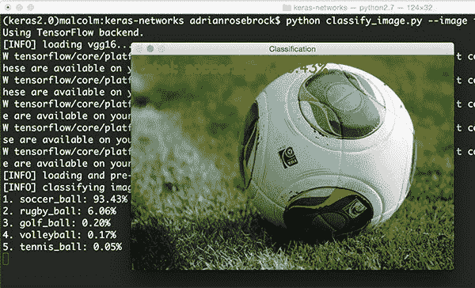
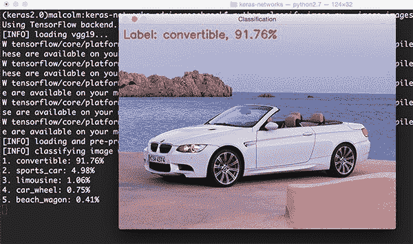
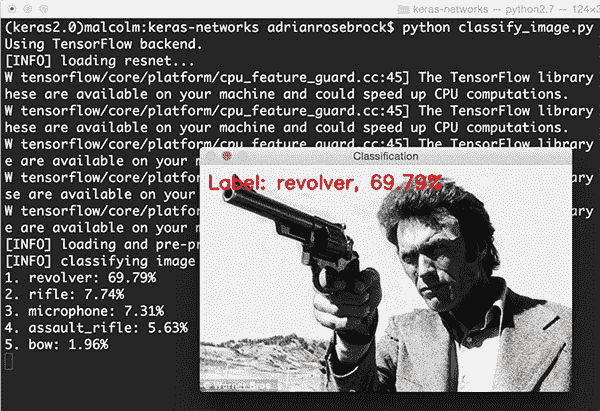
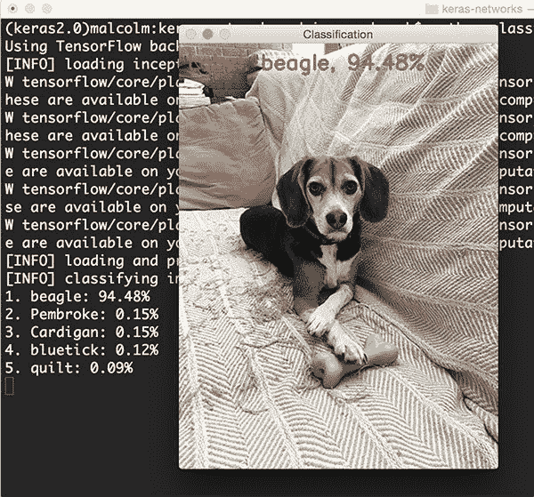
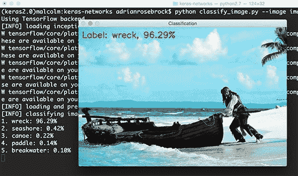
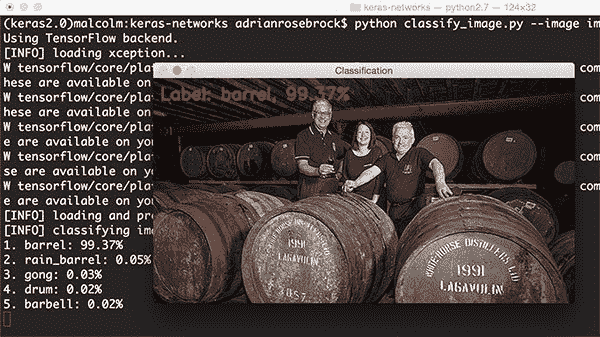
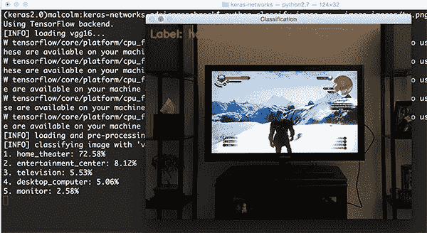

# ImageNet: VGGNet、ResNet、Inception 和 Xception with Keras

> 原文：<https://pyimagesearch.com/2017/03/20/imagenet-vggnet-resnet-inception-xception-keras/>

几个月前，我写了一篇[教程](https://pyimagesearch.com/2016/08/10/imagenet-classification-with-python-and-keras/)，讲述如何使用在 ImageNet 数据集上用 Python 和 Keras 深度学习库预训练的卷积神经网络(具体来说就是 VGG16)对图像进行分类。

Keras 内部预先训练的网络能够识别 *1，000 种不同的物体类别*，与我们日常生活中遇到的物体相似，具有很高的准确性。

当时，预先训练的 ImageNet 模型是从核心 Keras 库中 ***分离*** ，要求我们克隆一个[独立的 GitHub repo](https://github.com/fchollet/deep-learning-models) ，然后*手动*将代码复制到我们的项目中。

这个解决方案足够好；然而，自从我最初的博客文章发表以来，预训练的网络(VGG16、VGG19、ResNet50、Inception V3 和 Xception)已经 ***完全集成到 Keras 核心*** (不再需要克隆一个单独的回购)——这些实现可以在[应用程序子模块](https://github.com/fchollet/keras/tree/master/keras/applications)中找到。

因此，我决定创建一个新的、更新的教程，演示如何在你自己的分类项目中利用这些最先进的网络。

具体来说，我们将创建一个特殊的 Python 脚本，它可以使用*tensor flow 或 Theano 后端加载*这些网络中的任何*，然后对您自己的自定义输入图像进行分类。*

 ***要了解更多关于使用 VGGNet、ResNet、Inception 和 Xception 对图像进行分类的信息，*请继续阅读。***

## VGGNet、ResNet、Inception 和带有 Keras 的 Xception

***2020-06-15 更新:**此博文现已兼容 TensorFlow 2+!*

在这篇博文的前半部分，我将简要讨论 Keras 库中包含的 VGG、ResNet、Inception 和 Xception 网络架构。

然后，我们将使用 Keras 创建一个定制的 Python 脚本，它可以从磁盘加载这些预先训练好的网络架构，并对您自己的输入图像进行分类。

最后，我们将在一些示例图像上查看这些分类的结果。

### Keras 中最先进的深度学习图像分类器

Keras 提供了五个现成的卷积神经网络，它们已经在 ImageNet 数据集上进行了预训练:

1.  VGG16
2.  VGG19
3.  ResNet50
4.  盗梦空间 V3
5.  Xception

让我们从 ImageNet 数据集的概述开始，然后简要讨论每个网络架构。

#### 什么是 ImageNet？

ImageNet 是一个正式的项目，旨在为计算机视觉研究的目的(手动)将图像标记和分类成近 22，000 个独立的对象类别。

然而，当我们在深度学习和卷积神经网络的上下文中听到术语*“ImageNet”*时，我们很可能指的是 [*ImageNet 大规模视觉识别挑战*](http://www.image-net.org/challenges/LSVRC/) ，或简称为 ILSVRC。

这个图像分类挑战的目标是训练一个模型，该模型可以将输入图像正确地分类成 1，000 个单独的对象类别。

模型在大约 120 万张训练图像上进行训练，另外 50，000 张图像用于验证，100，000 张图像用于测试。

这 1，000 个图像类别代表了我们在日常生活中遇到的对象类别，如狗、猫、各种家用物品、车辆类型等。你可以在这里找到 ILSVRC 挑战赛[中物体类别的完整列表](http://image-net.org/challenges/LSVRC/2014/browse-synsets)。

当谈到图像分类时，ImageNet 挑战赛是计算机视觉分类算法事实上的基准测试——自 2012 年以来，这项挑战的排行榜一直由卷积神经网络和深度学习技术的 ***主导*** 。

Keras 核心库中包含的最先进的预训练网络代表了过去几年 ImageNet 挑战赛中一些最高性能的卷积神经网络。这些网络还展示了强大的能力，能够通过*转移学习*将推广到 ImageNet 数据集之外的图像，例如特征提取和微调。

#### VGG16 和 VGG19

Simonyan 和 Zisserman 在他们 2014 年的论文 [*中介绍了 VGG 网络架构，用于大规模图像识别的超深度卷积网络*](https://arxiv.org/abs/1409.1556) 。

这种网络的特点是简单，仅使用 *3×3* 个卷积层，这些卷积层以递增的深度堆叠在一起。减少卷大小是由最大池处理的。两个完全连接的层，每个层有 4，096 个节点，然后是 softmax 分类器(上图)。

“16”和“19”代表网络中重量层的数量(下面图 2 中的**栏 D 和 E):**

在 2014 年，16 层和 19 层网络被认为是非常深的(尽管我们现在有 ResNet 架构，它可以在 ImageNet 的 50-200 深度和 CIFAR-10 的 1000 深度以上成功训练)。

Simonyan 和 Zisserman 发现训练 VGG16 和 VGG19 具有挑战性(特别是关于在更深的网络上的收敛)，因此为了使训练更容易，他们首先训练了具有更轻权重层(A 列和 C 列)的*更小*版本的 VGG。

较小的网络融合在一起，然后被用作更大、更深的网络的*初始化*——这个过程被称为 ***预训练*** 。

虽然从逻辑上讲，预训练是一项非常耗时、乏味的任务，需要在之前对*整个网络*进行训练**，它可以作为更深层次网络的初始化。**

我们不再使用预训练(在大多数情况下)，而是更喜欢 Xaiver/Glorot 初始化或初始化(有时称为何等人的论文初始化， [*深入研究整流器:在 ImageNet 分类上超越人类水平的性能*](https://arxiv.org/abs/1502.01852) )。你可以在 [*内部阅读更多关于权重初始化和深度神经网络收敛的重要性你需要的只是一个好的 init*](https://arxiv.org/abs/1511.06422) 、Mishkin 和 Matas (2015)。

不幸的是，VGGNet 有两个主要缺点:

1.  训练慢得令人痛苦。
2.  网络架构权重本身相当大(就磁盘/带宽而言)。

由于其深度和全连接节点的数量，VGG16 的 VGG 超过 533MB，VGG19 超过 574MB。这使得部署 VGG 成为一项令人厌倦的任务。

我们在很多深度学习的图像分类问题中仍然使用 VGG；然而，更小的网络架构往往更可取(如 SqueezeNet、GoogLeNet 等。).

#### ResNet

与 AlexNet、OverFeat 和 VGG 等传统的*顺序*网络架构不同，ResNet 是一种依赖于微架构模块的“奇异架构”(也称为“网络中的网络架构”)。

术语*微架构*指的是用于构建网络的一组“构建模块”。一组微架构构建块(以及您的标准 CONV、池等)。层)导致了*宏观架构*(即终端网络本身)。

由何等人在其 2015 年的论文 [*中首次介绍的用于图像识别的深度残差学习*](https://arxiv.org/abs/1512.03385) ，ResNet 架构已经成为一项开创性的工作，证明了通过使用残差模块，可以使用标准 SGD(和合理的初始化函数)来训练*极深度*网络:

通过更新残差模块以使用*身份映射*，可以获得进一步的准确性，如他们 2016 年的后续出版物 [*深度残差网络*](https://arxiv.org/abs/1603.05027) 中的身份映射所示:

也就是说，请记住，Keras 核心中的 ResNet50(如 50 个权重层)实施基于之前的 2015 年论文。

尽管 ResNet 比 VGG16 和 vgg 19*深得多*，但由于使用了全局平均池而不是完全连接的层，模型大小实际上*要小得多*—这将 ResNet50 的模型大小降低到了 102MB。

#### 盗梦空间 V3

“盗梦空间”微架构首先由 Szegedy 等人在他们 2014 年的论文 [*中提出，用卷积*](https://arxiv.org/abs/1409.4842) 深化:

初始模块的目标是通过计算网络的*同一个*模块内的 *1×1* 、 *3×3* 和 *5×5* 卷积来充当“多级特征提取器”——这些滤波器的输出随后沿着信道维度堆叠，然后馈入网络的下一层。

这种架构的最初化身被称为 *GoogLeNet* ，但随后的表现形式被简单地称为 *Inception vN* ，其中 *N* 指的是谷歌发布的版本号。

Keras 核心中包含的 Inception V3 架构来自 Szegedy 等人的后续出版物， *[重新思考计算机视觉的 Inception 架构](https://arxiv.org/abs/1512.00567)* (2015)，该出版物提出了对 Inception 模块的更新，以进一步提高 ImageNet 分类的准确性。

Inception V3 的重量比 VGG 和 ResNet 都小，只有 96MB。

#### Xception

提出这一概念的不是别人，正是 Keras 图书馆的创建者和主要维护者 Franç ois Chollet 自己。

Xception 是 Inception 架构的扩展，它用深度方向可分离的卷积代替了标准的 Inception 模块。

原始出版物，*例外:深度可分卷积深度学习*可在[这里](https://arxiv.org/abs/1610.02357)找到。

Xception 是重量最小的系列，只有 91MB。

#### SqueezeNet 怎么样？

值得一提的是， [SqueezeNet 架构](https://arxiv.org/abs/1602.07360)通过使用“挤压”和“扩展”的“发射”模块，可以在仅 4.9MB 的情况下获得 AlexNet 级别的精度(大约 57% rank-1 和大约 80% rank-5)。

虽然留下一个小脚印，但 SqueezeNet 训练起来也非常棘手。

也就是说，在我即将出版的书《用 Python 进行计算机视觉的深度学习 *[】中，我演示了如何在 ImageNet 数据集上从头开始训练 SqueezeNet。](https://pyimagesearch.com/deep-learning-computer-vision-python-book/)*

### 配置您的开发环境

要针对本教程配置您的系统，我建议您遵循以下任一教程:

*   [*如何在 Ubuntu 上安装 tensor flow 2.0*](https://pyimagesearch.com/2019/12/09/how-to-install-tensorflow-2-0-on-ubuntu/)
*   [*如何在 macOS 上安装 tensor flow 2.0*](https://pyimagesearch.com/2019/12/09/how-to-install-tensorflow-2-0-on-macos/)

这两个教程都将帮助您在一个方便的 Python 虚拟环境中，用这篇博文所需的所有软件来配置您的系统。

请注意 [PyImageSearch 不推荐也不支持 CV/DL 项目](https://pyimagesearch.com/faqs/single-faq/can-you-help-me-do-___-on-windows/)的窗口。

### 使用 VGGNet、ResNet、Inception 和 Xception 对图像进行分类，使用 Python 和 Keras

让我们学习如何使用 Keras 库用预训练的卷积神经网络对图像进行分类。

打开一个新文件，将其命名为`classify_image.py`，并插入以下代码:

```py
# import the necessary packages
from tensorflow.keras.applications import ResNet50
from tensorflow.keras.applications import InceptionV3
from tensorflow.keras.applications import Xception # TensorFlow ONLY
from tensorflow.keras.applications import VGG16
from tensorflow.keras.applications import VGG19
from tensorflow.keras.applications import imagenet_utils
from tensorflow.keras.applications.inception_v3 import preprocess_input
from tensorflow.keras.preprocessing.image import img_to_array
from tensorflow.keras.preprocessing.image import load_img
import numpy as np
import argparse
import cv2

```

**第 2-13 行**导入我们需要的 Python 包。如您所见，大多数包都是 Keras 库的一部分。

具体来说，**第 2-6 行**分别处理导入 ResNet50、Inception V3、Xception、VGG16 和 VGG19 的 Keras 实现。

请注意，Xception network 仅与 TensorFlow 后端兼容(如果您试图用 Theano 后端实例化它，该类将抛出一个错误)。

**第 7 行**为我们提供了进入`imagenet_utils`子模块的途径，这是一组方便的功能，将使我们的输入图像预处理和解码输出分类更加容易。

其余的导入是其他辅助函数，接下来是用于数字处理的 NumPy 和用于 OpenCV 绑定的`cv2`。

接下来，让我们解析我们的命令行参数:

```py
# construct the argument parse and parse the arguments
ap = argparse.ArgumentParser()
ap.add_argument("-i", "--image", required=True,
	help="path to the input image")
ap.add_argument("-model", "--model", type=str, default="vgg16",
	help="name of pre-trained network to use")
args = vars(ap.parse_args())

```

我们只需要一个命令行参数，`--image`，它是我们想要分类的输入图像的路径。

我们还将接受一个可选的命令行参数，`--model`，一个指定我们想要使用哪个预训练的卷积神经网络的字符串——对于 VGG16 网络架构，该值默认为`vgg16`。

假设我们通过命令行参数接受预训练网络的名称，我们需要定义一个 Python 字典，将模型名称(字符串)映射到它们实际的 Keras 类:

```py
# define a dictionary that maps model names to their classes
# inside Keras
MODELS = {
	"vgg16": VGG16,
	"vgg19": VGG19,
	"inception": InceptionV3,
	"xception": Xception, # TensorFlow ONLY
	"resnet": ResNet50
}

# esnure a valid model name was supplied via command line argument
if args["model"] not in MODELS.keys():
	raise AssertionError("The --model command line argument should "
		"be a key in the `MODELS` dictionary")

```

**第 25-31 行**定义了我们的`MODELS`字典，它将模型名称字符串映射到相应的类。

如果在`MODELS`中找不到`--model`名称，我们将引发一个`AssertionError` ( **第 34-36 行**)。

卷积神经网络将图像作为输入，然后返回对应于类别标签的一组概率作为输出。

在 ImageNet 上训练的卷积神经网络的典型输入图像大小是 *224×224* 、 *227×227* 、 *256×256* 和*299×299*；然而，你也可以看到其他维度。

VGG16、VGG19 和 ResNet 都接受 *224×224* 输入图像，而 Inception V3 和 Xception 需要 *299×299* 像素输入，如以下代码块所示:

```py
# initialize the input image shape (224x224 pixels) along with
# the pre-processing function (this might need to be changed
# based on which model we use to classify our image)
inputShape = (224, 224)
preprocess = imagenet_utils.preprocess_input

# if we are using the InceptionV3 or Xception networks, then we
# need to set the input shape to (299x299) [rather than (224x224)]
# and use a different image pre-processing function
if args["model"] in ("inception", "xception"):
	inputShape = (299, 299)
	preprocess = preprocess_input

```

这里我们初始化我们的`inputShape`为 *224×224* 像素。我们还将我们的`preprocess`函数初始化为来自 Keras 的标准`preprocess_input`(执行均值减法)。

然而，如果我们正在使用 Inception 或 Xception，我们需要将`inputShape`设置为 *299×299* 像素，然后更新`preprocess`以使用 ***单独的预处理函数*** ，该函数[执行不同类型的缩放](https://github.com/fchollet/keras/blob/master/keras/applications/inception_v3.py#L389)。

下一步是从磁盘加载我们预先训练的网络架构权重，并实例化我们的模型:

```py
# load our the network weights from disk (NOTE: if this is the
# first time you are running this script for a given network, the
# weights will need to be downloaded first -- depending on which
# network you are using, the weights can be 90-575MB, so be
# patient; the weights will be cached and subsequent runs of this
# script will be *much* faster)
print("[INFO] loading {}...".format(args["model"]))
Network = MODELS[args["model"]]
model = Network(weights="imagenet")

```

**第 58 行**使用`MODELS`字典和`--model`命令行参数来获取正确的`Network`类。

然后使用预先训练的 ImageNet 权重在**行 59** 上实例化卷积神经网络；

***注:【VGG16 和 VGG19 的权重为> 500MB。ResNet 权重约为 100MB，而 Inception 和 Xception 权重在 90-100MB 之间。如果这是您第一次*****运行给定网络的脚本，这些权重将(自动)下载并缓存到您的本地磁盘。根据您的网速，这可能需要一段时间。然而，一旦下载了权重，它们将**而不是**需要再次下载，允许`classify_image.py`的后续运行**快得多**。**

 *我们的网络现在已经加载完毕，可以对图像进行分类了——我们只需准备好该图像进行分类:

```py
# load the input image using the Keras helper utility while ensuring
# the image is resized to `inputShape`, the required input dimensions
# for the ImageNet pre-trained network
print("[INFO] loading and pre-processing image...")
image = load_img(args["image"], target_size=inputShape)
image = img_to_array(image)

# our input image is now represented as a NumPy array of shape
# (inputShape[0], inputShape[1], 3) however we need to expand the
# dimension by making the shape (1, inputShape[0], inputShape[1], 3)
# so we can pass it through the network
image = np.expand_dims(image, axis=0)

# pre-process the image using the appropriate function based on the
# model that has been loaded (i.e., mean subtraction, scaling, etc.)
image = preprocess(image)

```

**第 65 行**使用提供的`inputShape`从磁盘加载我们的输入图像，以调整图像的宽度和高度。

第 66 行将图像从 PIL/枕头实例转换成 NumPy 数组。

我们的输入图像现在被表示为一个形状为`(inputShape[0], inputShape[1], 3)`的 NumPy 数组。

然而，我们通常用卷积神经网络对*批*中的图像进行训练/分类，因此我们需要通过**行 72** 上的`np.expand_dims`向数组添加额外的维度。

调用`np.expand_dims`后，`image`的形状为`(1, inputShape[0], inputShape[1], 3)`。当您调用`model`的`.predict`时，忘记添加这个额外的维度将会导致错误。

最后，**行 76** 调用适当的预处理函数来执行均值减法/缩放。

我们现在准备通过网络传递我们的图像，并获得输出分类:

```py
# classify the image
print("[INFO] classifying image with '{}'...".format(args["model"]))
preds = model.predict(image)
P = imagenet_utils.decode_predictions(preds)

# loop over the predictions and display the rank-5 predictions +
# probabilities to our terminal
for (i, (imagenetID, label, prob)) in enumerate(P[0]):
	print("{}. {}: {:.2f}%".format(i + 1, label, prob * 100))

```

对第 80 行**上的`.predict`的调用返回来自卷积神经网络的预测。**

给定这些预测，我们将它们传递到 ImageNet 实用函数`.decode_predictions`中，以给出 ImageNet 类标签 id、“人类可读”标签以及与标签相关联的概率的列表。

然后，前 5 个预测(即概率最大的标签)被打印到我们终端的第 85 行和第 86 行。

在结束示例之前，我们要做的最后一件事是通过 OpenCV 从磁盘加载输入图像，在图像上绘制#1 预测，最后将图像显示在屏幕上:

```py
# load the image via OpenCV, draw the top prediction on the image,
# and display the image to our screen
orig = cv2.imread(args["image"])
(imagenetID, label, prob) = P[0][0]
cv2.putText(orig, "Label: {}, {:.2f}%".format(label, prob * 100),
	(10, 30), cv2.FONT_HERSHEY_SIMPLEX, 0.8, (0, 0, 255), 2)
cv2.imshow("Classification", orig)
cv2.waitKey(0)

```

要查看我们预先培训的 ImageNet 网络的运行情况，请查看下一部分。

### VGGNet、ResNet、Inception 和 Xception 分类结果

本博文中所有 ***更新的*** 例子均为 TensorFlow 2.2 所收集。之前这篇博文使用了 [Keras > = 2.0](https://blog.keras.io/introducing-keras-2.html?t=1) 和 [TensorFlow 后端](https://www.tensorflow.org/install/)(当它们是单独的包时)，并且也用 Theano 后端进行了测试，并确认了实现也可以用 Theano 工作。

一旦安装了 TensorFlow/Theano 和 Keras，确保使用教程底部的 ***“下载”*** 部分将源代码+示例图片下载到这篇博文中。

从这里开始，让我们尝试用 VGG16 对图像进行分类:

```py
$ python classify_image.py --image images/soccer_ball.jpg --model vgg16

```



**Figure 8:** Classifying a soccer ball using VGG16 pre-trained on the ImageNet database using Keras ([source](https://pl.wiktionary.org/wiki/piedpilko)).

看看输出，我们可以看到 VGG16 以 93.43%的准确率正确地将图像分类为*“足球”*。

要使用 VGG19，我们只需更改`--model`命令行参数:

```py
$ python classify_image.py --image images/bmw.png --model vgg19

```



**Figure 9:** Classifying a vehicle as “convertible” using VGG19 and Keras ([source](https://www.pinterest.com/explore/bmw-convertible/)).

VGG19 能够以 91.76%的概率将输入图像正确分类为*“可转换”*。然而，看看其他前 5 的预测:*跑车*4.98%的概率(车就是这样)*豪华轿车*1.06%(不正确，但仍合理)*“车轮”*0.75%(由于图中有车轮，技术上也是正确的)。

在使用预训练 ResNet 架构的下例中，我们可以看到类似的前 5 级精度:

```py
$ python classify_image.py --image images/clint_eastwood.jpg --model resnet

```



**Figure 10:** Using ResNet pre-trained on ImageNet with Keras + Python ([source](http://i.dailymail.co.uk/i/pix/2009/09/24/article-1215766-0009B05300000258-375_468x286.jpg)).

ResNet 以 69.79%的准确率将这张克林特·伊斯特伍德持枪的图像正确分类为*“左轮手枪”*。有趣的是，*《来福枪》*以 7.74%的比率和*《突击步枪》*以 5.63%的比率也位列前五。考虑到左轮手枪的视角和枪管的长度(对于手枪来说),很容易看出卷积神经网络对于步枪也将返回更高的概率。

下一个示例尝试使用 ResNet 对狗的种类进行分类:

```py
$ python classify_image.py --image images/jemma.png --model resnet

```



**Figure 11:** Classifying dog species using ResNet, Keras, and Python.

狗的种类以 94.48%的置信度被正确识别为*【比格犬】*。

然后我试着给下面这张来自《加勒比海盗》系列的约翰尼·德普的照片分类:

```py
$ python classify_image.py --image images/boat.png --model inception

```



**Figure 12:** Classifying a ship wreck with ResNet pre-trained on ImageNet with Keras ([source](https://www.aliexpress.com/item/Pirates-Of-The-Caribbean-Boats-Ship-Boy-Nature-Tropical-Sea-Waves-Trees-Tv-Movie-Film-Poster/32607808033.html)).

虽然 ImageNet 中确实有一个*“船”*类，但有趣的是，盗梦空间网络能够以 96.29%的概率正确识别场景为*(船)残骸*。所有其他预测标签，包括*、【海滨】、【独木舟】、【船桨】、*和*、【防波堤】、*都是相关的，在某些情况下也是绝对正确的。

关于盗梦空间网络的另一个例子，我拍了一张坐在我办公室沙发上的照片:

```py
$ python classify_image.py --image images/office.png --model inception

```


**Figure 13:** Recognizing various objects in an image with Inception V3, Python, and Keras.

Inception 以 69.68%的置信度正确预测图像中有一个*【台灯】*。其他前五名的预测也完全正确，包括一个*、【工作室沙发】、*、【窗帘】、*(在图像的最右边，几乎看不到)、*、【灯罩】、*、*、【枕头】、*。*

在上面的上下文中，Inception 甚至没有被用作对象检测器，但它仍然能够将图像的所有部分分类到它的前 5 个预测中。难怪卷积神经网络是优秀的物体探测器！

继续讨论例外情况:

```py
$ python classify_image.py --image images/scotch.png --model xception

```



**Figure 14:** Using the Xception network architecture to classify an image ([source](http://www.slrmag.co.uk/lagavulin-rolls-out-the-barrel-to-mark-double-century/)).

这里我们有一个苏格兰桶的图像，特别是我最喜欢的苏格兰酒，Lagavulin。异常正确地将该图像分类为*“桶”*。

最后一个例子使用 VGG16 分类:

```py
$ python classify_image.py --image images/tv.png --model vgg16

```



**Figure 15:** VGG16 pre-trained on ImageNet with Keras.

这张照片是几个月前我完成《巫师 III:疯狂狩猎》时拍摄的(很容易就进入了我最喜欢的前三名游戏)。VGG16 的第一个预测是*【家庭影院】*——这是一个合理的预测，因为在前 5 个预测中还有一个*【电视/显示器】*。

从这篇博文中的例子可以看出，在 ImageNet 数据集上预先训练的网络能够识别各种常见的日常物体。我希望您可以在自己的项目中使用这些代码！

## 摘要

在今天的博文中，我们回顾了在 Keras 库中的 ImageNet 数据集上预先训练的五个卷积神经网络:

1.  VGG16
2.  VGG19
3.  ResNet50
4.  盗梦空间 V3
5.  Xception

然后，我演示了如何使用 Keras 库和 Python 编程语言，使用这些架构对您自己的输入图像进行分类。

**如果你有兴趣了解更多关于深度学习和卷积神经网络的知识(以及如何从零开始训练自己的网络)，一定要看看我的书， [*用 Python 进行计算机视觉的深度学习*](https://pyimagesearch.com/deep-learning-computer-vision-python-book/) ，现在可以订购。****