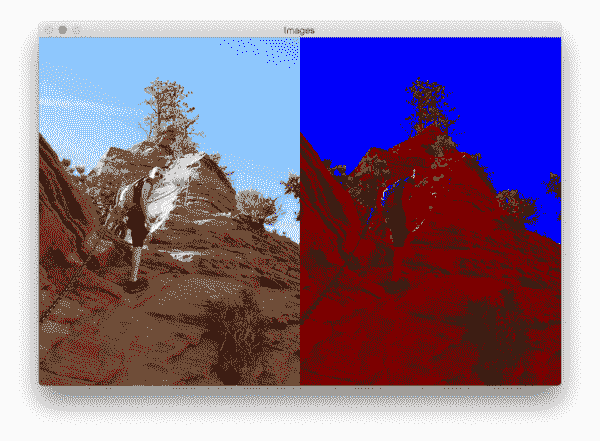
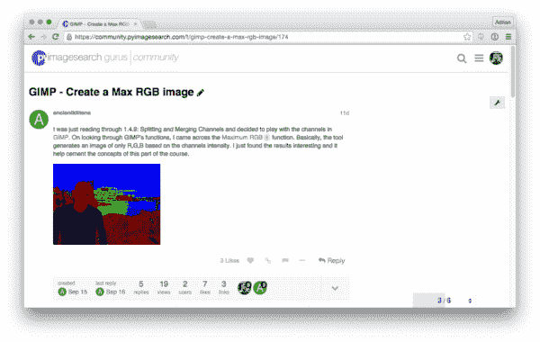
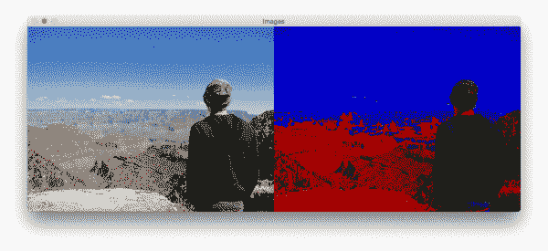
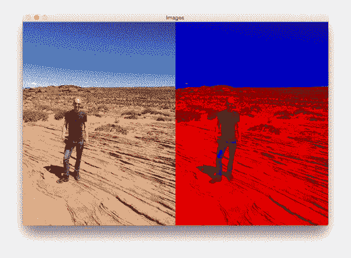
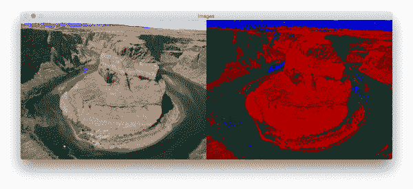
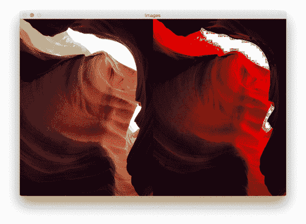

# 在 OpenCV 中实现最大 RGB 滤镜

> 原文：<https://pyimagesearch.com/2015/09/28/implementing-the-max-rgb-filter-in-opencv/>

[](https://pyimagesearch.com/wp-content/uploads/2015/09/max_filter_angels_landing.png)

今天的博客文章直接来自于 [PyImageSearch 大师课程](https://pyimagesearch.com/pyimagesearch-gurus/)。在 PyImageSearch Gurus 内部，我们有一个社区页面(很像论坛+ Q & A + StackOverflow 的组合)，在这里我们讨论各种计算机视觉主题，提出问题，并让彼此对学习计算机视觉和图像处理负责。

这篇文章的灵感来自 PyImageSearch 大师成员克里斯蒂安·史密斯，他问是否有可能使用 OpenCV 和 Python 实现 GIMP 的最大 RGB 过滤器:

[](https://pyimagesearch.com/wp-content/uploads/2015/09/max_filter_community.png)

**Figure 1:** Christian, a member of [PyImageSearch Gurus](https://pyimagesearch.com/pyimagesearch-gurus/), asked if it was possible to replicate GIMP’s Max RGB filter using Python and OpenCV.

这个帖子引发了关于这个话题的大讨论，甚至导致了一个实现(今天我将与你分享)。

最大 RGB 过滤器不用于许多图像处理管道；然而，当可视化图像的红色、绿色和蓝色通道，以及哪个通道对图像的给定区域贡献最大时，这是一个非常有用的工具。对于简单的基于颜色的分割，这也是一个很好的过滤器。

在这篇文章的剩余部分，我将演示如何用几行 Python 和 OpenCV 代码实现 Max RGB 滤镜。

## 什么是 Max RGB 滤镜？

Max RGB 滤镜是一款极其简单直接的图像处理滤镜。算法是这样的。

*   对于图像中的每个像素 *I* :
    *   抓取位于*I【x，y】*的 *r* 、 *g* 和 *b* 像素亮度
    *   确定 *r* 、 *g* 、 *b* : *m = max(r，g，b)* 的最大值
    *   如果 *r < m: r = 0*
    *   如果 *g < m: g = 0*
    *   如果 *b < m: b = 0*
    *   将 *r* 、 *g* 和 *b* 值存储回图像: *I[x，y] = (r，g，b)*

唯一需要说明的是，如果*两个通道*强度相同，比如: *(155，98，155)* 。在这种情况下，*的两个* *值*保持不变，最小的减小为零: *(155，0，155)* 。

输出图像应该如下所示:

[](https://pyimagesearch.com/wp-content/uploads/2015/09/max_filter_grand_canyon.png)

**Figure 2:** An example of applying the Max RGB filter.

我们可以在左边的*看到原始图像，在右边的*看到过滤后的输出图像。**

## 在 OpenCV 中实现 GIMP 的 Max RGB 滤镜

现在我们已经很好地掌握了 Max RGB 滤镜算法(以及预期的输出应该是什么样子)，让我们继续用 Python 和 OpenCV 实现它。打开一个新文件，将其命名为`max_filter.py`，并插入以下代码:

```py
# import the necessary packages
import numpy as np
import argparse
import cv2

def max_rgb_filter(image):
	# split the image into its BGR components
	(B, G, R) = cv2.split(image)

	# find the maximum pixel intensity values for each
	# (x, y)-coordinate,, then set all pixel values less
	# than M to zero
	M = np.maximum(np.maximum(R, G), B)
	R[R < M] = 0
	G[G < M] = 0
	B[B < M] = 0

	# merge the channels back together and return the image
	return cv2.merge([B, G, R])

```

**第 2-4 行**简单导入我们需要的包。

**第 6 行**定义了我们的`max_rgb_filter`功能。这个方法只需要一个参数，即我们想要过滤的`image`。

给定我们的输入`image`，然后我们使用`cv2.split`函数将`image`分割成相应的蓝色、绿色和红色成分(**第 8 行**

***注意:*** *需要记住的是，OpenCV 是以 BGR 顺序存储图像，而不是 RGB。如果你刚刚开始使用 OpenCV* ，这可能会造成一点混乱和一些难以追踪的错误。

给定我们的`R`、`G`和`B`通道，然后我们使用 NumPy 的`maximum`方法(**第 13 行**)来找到在 ***每个*、**、 *(x，y)*-**、*所有三个*、**、`G`和`B`通道的最大强度值

使用 [np.maximum](http://docs.scipy.org/doc/numpy/reference/generated/numpy.maximum.html) 而不是 [np.max](http://docs.scipy.org/doc/numpy/reference/generated/numpy.ndarray.max.html) 是 ***非常重要的*** ！与在每个(x，y)坐标 找到最大值 ***的`np.maximum`相反，`np.max`方法将只找到跨越 ***整个数组*** 的最大值。***

从那里，**行 14-16** 抑制低于最大值 *M* 的红色、绿色和蓝色像素强度。

最后，**第 19 行**将通道合并在一起(再次按照 BGR 顺序，因为这是 OpenCV 所期望的)并将最大 RGB 过滤图像返回给调用函数。

既然已经定义了`max_rgb_filter`方法，我们需要做的就是编写一些代码来从磁盘上加载我们的图像，应用最大 RGB 滤镜，并将结果显示到我们的屏幕上:

```py
# import the necessary packages
import numpy as np
import argparse
import cv2

def max_rgb_filter(image):
	# split the image into its BGR components
	(B, G, R) = cv2.split(image)

	# find the maximum pixel intensity values for each
	# (x, y)-coordinate,, then set all pixel values less
	# than M to zero
	M = np.maximum(np.maximum(R, G), B)
	R[R < M] = 0
	G[G < M] = 0
	B[B < M] = 0

	# merge the channels back together and return the image
	return cv2.merge([B, G, R])

# construct the argument parse and parse the arguments
ap = argparse.ArgumentParser()
ap.add_argument("-i", "--image", required=True,
	help="path to input image")
args = vars(ap.parse_args())

# load the image, apply the max RGB filter, and show the
# output images
image = cv2.imread(args["image"])
filtered = max_rgb_filter(image)
cv2.imshow("Images", np.hstack([image, filtered]))
cv2.waitKey(0)

```

这段代码应该是不言自明的。**第 22-25 行**处理解析我们的命令行参数。我们需要的唯一开关是`--image`，它是我们想要处理的图像在磁盘上驻留的路径。

从那里，**第 29-32 行**处理加载我们的`image`，应用最大 RGB 过滤器，最后在我们的屏幕上显示原始和过滤后的图像。

要查看我们的脚本，只需打开您的终端并执行以下命令:

```py
$ python max_filter.py --image images/horseshoe_bend_02.jpg

```

[](https://pyimagesearch.com/wp-content/uploads/2015/09/max_filter_horseshoebend_02.png)

**Figure 3:** Our original image (left) and the Max RGB filtered image (right).

左边的*是原始图像——我自己在亚利桑那州马蹄弯附近的沙漠中的照片。然后，在右边的*中*，我们得到了应用最大 RGB 滤镜后的图像。在图像的顶部，我们可以看到天空是浓郁的蓝色，这表明蓝色通道在该区域具有较大的像素强度值。在蓝天的对面，图像的底部更红(他们不会无缘无故地称之为红石’)—这里红色通道具有较大的像素强度值，绿色和蓝色通道被抑制。*

让我们试试另一个图像:

```py
$ python max_filter.py --image images/max_filter_horseshoe_bend_01.png

```

[](https://pyimagesearch.com/wp-content/uploads/2015/09/max_filter_horseshoe_bend_01.png)

**Figure 4:** Another example of applying the Max RGB filter using Python and OpenCV.

我特别喜欢这张图片，因为它突出了水并不总是像我们想象的那样是“清澈的蓝色”。毫不奇怪，红石突出显示为红色，天空非常蓝。然而，水本身是蓝色和绿色的混合物。此外，这两个水域彼此明显分开。

让我们做最后一个例子:

```py
$ python max_filter.py --image images/max_filter_antelope_canyon.png

```

[](https://pyimagesearch.com/wp-content/uploads/2015/09/max_filter_antelope_canyon.png)

**Figure 5:** Applying the Max RGB filter to a photo taken in Antelope Canyon. Are you surprised by the results?

这张图片来自亚利桑那州佩奇的羚羊峡谷(可能是世界上最美丽的地区之一)。在插槽峡谷的底部，光线很弱，所以我们根本看不到太多的颜色(虽然如果你仔细看，你可以看到深蓝/紫色的斑块，这些洞穴是众所周知的)。然后，当我们沿着峡谷壁向上移动时，更多的光线进入，呈现出奇妙的红光。最后，在洞穴的顶部是天空，在这张照片中，天空是如此明亮，以至于被洗去了。

就像我说的，我们很少在图像处理管道中使用 Max RGB 滤镜；但是，由于过滤器允许您调查图像的哪些通道对给定区域的贡献最大，因此在执行基本分割和调试时，它是一个很有价值的工具。

## 摘要

今天的博客帖子是受克里斯蒂安·史密斯的一个问题的启发，他是 PyImageSearch 大师的成员(感谢基督徒！).Christian 问是否有可能只用 Python 和 OpenCV 来实现 GIMP 的 Max RGB 滤镜——显然，答案是肯定的。但是令人惊讶的是它只需要几行代码就可以完成！

继续下载这篇文章的代码，将最大 RGB 滤镜应用到你自己的图片上。看看你是否能猜出哪个红色、绿色或蓝色通道对图像的特定区域贡献最大——你可能会惊讶于在某些情况下你对颜色的直觉和感知是多么的错误！

最后，如果你有兴趣加入 PyImageSearch 大师课程，[请务必点击此处，排队领取你的位置](https://pyimagesearch.com/pyimagesearch-gurus/)。课程内的位置是有限的(一次只允许一小批读者进入)，所以*非常重要*如果你对课程感兴趣，就申请你的位置！