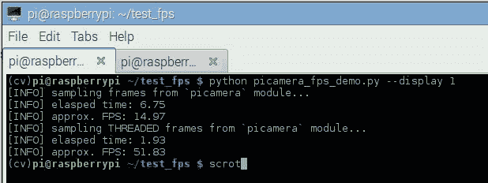

# 使用 Python 和 OpenCV 增加 Raspberry Pi FPS

> 原文：<https://pyimagesearch.com/2015/12/28/increasing-raspberry-pi-fps-with-python-and-opencv/>

今天是我们关于从你的网络摄像头或树莓派相机中榨取最后一点性能的系列文章的第二篇。

[上周](https://pyimagesearch.com/2015/12/21/increasing-webcam-fps-with-python-and-opencv/)我们讨论了如何:

1.  提高我们视频处理管道的 FPS 速率。
2.  使用线程减少 I/O 延迟对标准 USB 和内置网络摄像头的影响。

本周我们将继续利用线程来提高 Raspberry Pi 的 FPS/延迟，使用*T2 模块和 USB 网络摄像头。*

我们将会发现，线程化可以*显著降低*我们的 I/O 延迟，从而*大幅提高*我们流水线的 FPS 处理速率。

<https://www.youtube.com/embed/-VXMgvabKG8?feature=oembed>