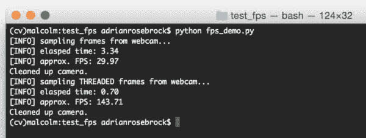
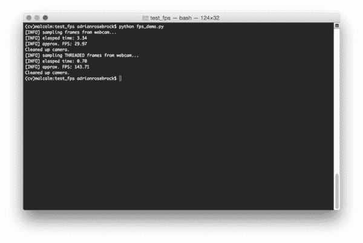
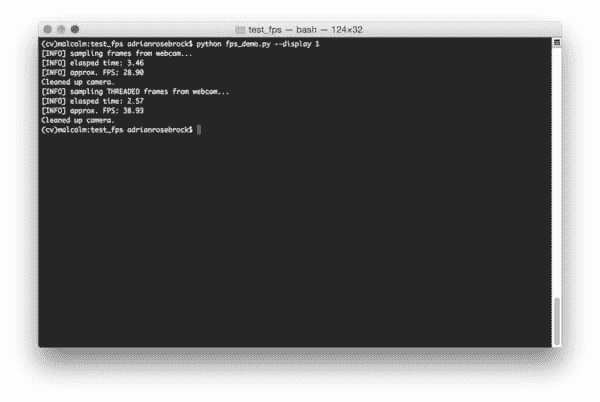

# 使用 Python 和 OpenCV 提高网络摄像头的 FPS

> 原文：<https://pyimagesearch.com/2015/12/21/increasing-webcam-fps-with-python-and-opencv/>

[](https://pyimagesearch.com/wp-content/uploads/2015/12/fps_demo_osx_zoomed.jpg)

在接下来的几周里，我会写一系列博客文章，讲述如何使用 Python、OpenCV 和线程技术 ***提高你的网络摄像头*** 的每秒帧数(FPS)。

使用线程处理 I/O 繁重的任务(例如从相机传感器读取帧)是一种已经存在了几十年的编程模型。

例如，如果我们要构建一个网络爬虫来抓取一系列网页(根据定义，这是一个任务， [I/O 绑定](https://en.wikipedia.org/wiki/I/O_bound))，我们的主程序将产生*多个线程*来处理并行下载一组*页面，而不是仅仅依靠*单线程*(我们的“主线程”)来按照*顺序*下载页面。这样做可以让我们更快地抓取网页。*

同样的概念也适用于计算机视觉和从相机读取帧— **我们可以简单地通过创建一个新线程来提高我们的 FPS，这个新线程除了轮询相机以获取新帧之外什么也不做，而我们的主线程则处理当前帧。**

这是一个简单的概念，但在 OpenCV 示例中很少见到，因为它确实给项目增加了几行额外的代码(或者有时是许多行，这取决于您的线程库)。多线程也可能使你的程序更难调试，但是一旦你做对了，你就可以极大地提高你的 FPS。

我们将通过编写一个线程化的 Python 类来使用 OpenCV 访问您的网络摄像头或 USB 摄像头，从而开始这一系列的帖子。

下周我们将使用线程来提高你的 Raspberry Pi 和 [picamera](https://picamera.readthedocs.org/en/release-1.10/) 模块的 FPS。

最后，我们将通过创建一个类来结束这一系列帖子，该类将*线程化网络摄像头/USB 摄像头代码*和线程化代码`picamera`统一到一个 ***单个类*** ，使得 PyImageSearch *上的所有网络摄像头/视频处理示例不仅运行更快*、*，而且可以在您的笔记本电脑/台式机或 Raspberry Pi **上运行，而无需更改一行代码！***

## 使用线程来获得更高的 FPS

使用 OpenCV 处理视频流时获得更高 FPS 的“秘密”是将 I/O(即从相机传感器读取帧)移动到一个单独的线程。

你看，使用`cv2.VideoCapture`功能和`.read()`方法访问你的网络摄像头/USB 摄像头是一个 *[阻塞操作](https://en.wikipedia.org/wiki/Blocking_(computing))* 。我们的 Python 脚本的主线程被完全阻塞(即“停止”)，直到从相机设备读取帧并将其返回给我们的脚本。

与 CPU 限制的操作相反，I/O 任务往往非常慢。虽然计算机视觉和视频处理应用程序肯定会占用大量 CPU 资源(特别是如果它们打算实时运行的话)，但事实证明相机 I/O 也可能是一个巨大的瓶颈。

正如我们将在本文后面看到的，仅仅通过调整相机 I/O 过程， ***我们就可以将我们的 FPS 提高 379%！***

当然，这不是 FPS 的*真正增加*，因为它是延迟的*显著减少(即，一帧总是可用于处理；我们不需要轮询相机设备并等待 I/O 完成)。在这篇文章的其余部分，为了简洁起见，我将我们的指标称为“FPS 增加”，但也要记住，这是延迟减少和 FPS 增加的*组合*。*

为了实现这种 FPS 增加/延迟减少，我们的目标是将从网络摄像头或 USB 设备读取帧转移到一个完全不同的线程，与我们的主 Python 脚本完全分离。

这将允许从 I/O 线程连续不断地读取帧，同时我们的根线程处理当前帧。一旦根线程处理完它的帧，它只需要从 I/O 线程获取当前帧。这是在*无需*等待阻塞 I/O 操作的情况下完成的。

实现我们的线程视频流功能的第一步是定义一个`FPS`类，我们可以用它来测量我们的每秒帧数。这个课程将帮助我们获得线程化确实增加 FPS 的定量证据。

然后我们将定义一个`WebcamVideoStream`类，它将以线程方式访问我们的网络摄像头或 USB 摄像头。

最后，我们将定义我们的驱动程序脚本`fps_demo.py`，它将比较单线程 FPS 和多线程 FPS。

***注:**感谢[罗斯·米利根](https://rdmilligan.wordpress.com/)和他的博客启发了我写这篇博文。*

## 使用 Python 和 OpenCV 提高网络摄像头的 FPS

我实际上已经在 [imutils](https://github.com/jrosebr1/imutils) 库中实现了网络摄像头/USB 摄像头和`picamera`线程。然而，我认为对实现的讨论可以极大地提高我们对*如何*和*为什么*线程化增加 FPS 的认识。

首先，如果您还没有安装`imutils`，您可以使用`pip`来安装它:

```py
$ pip install imutils

```

否则，您可以通过以下方式升级到最新版本:

```py
$ pip install --upgrade imutils

```

正如我上面提到的，第一步是定义一个`FPS`类，我们可以用它来估算给定相机+计算机视觉处理流水线的每秒帧数:

```py
# import the necessary packages
import datetime

class FPS:
	def __init__(self):
		# store the start time, end time, and total number of frames
		# that were examined between the start and end intervals
		self._start = None
		self._end = None
		self._numFrames = 0

	def start(self):
		# start the timer
		self._start = datetime.datetime.now()
		return self

	def stop(self):
		# stop the timer
		self._end = datetime.datetime.now()

	def update(self):
		# increment the total number of frames examined during the
		# start and end intervals
		self._numFrames += 1

	def elapsed(self):
		# return the total number of seconds between the start and
		# end interval
		return (self._end - self._start).total_seconds()

	def fps(self):
		# compute the (approximate) frames per second
		return self._numFrames / self.elapsed()

```

在**第 5-10 行**我们定义了`FPS`类的构造函数。我们不需要任何参数，但是我们初始化了三个重要的变量:

*   `_start`:我们开始测量帧读取的起始时间戳。
*   `_end`:我们停止测量帧读取的结束时间戳。
*   `_numFrames`:在`_start`和`_end`间隔内读取的总帧数。

**第 12-15 行**定义了`start`方法，顾名思义，它启动计时器。

类似地，**第 17-19 行**定义了获取结束时间戳的`stop`方法。

**行 21-24** 上的`update`方法只是增加在开始和结束间隔期间已经读取的帧数。

我们可以通过使用`elapsed`方法来获取第 26-29 行上**的开始和结束间隔之间经过的总秒数。**

最后，我们可以通过在第 31-33 行的**上使用`fps`方法来近似我们的摄像机+计算机视觉流水线的 FPS。通过获取间隔期间读取的总帧数并除以经过的秒数，我们可以获得估计的 FPS。**

现在我们已经定义了我们的`FPS`类(这样我们可以根据经验比较结果)，让我们定义包含实际线程摄像机读取的`WebcamVideoStream`类:

```py
# import the necessary packages
from threading import Thread
import cv2

class WebcamVideoStream:
	def __init__(self, src=0):
		# initialize the video camera stream and read the first frame
		# from the stream
		self.stream = cv2.VideoCapture(src)
		(self.grabbed, self.frame) = self.stream.read()

		# initialize the variable used to indicate if the thread should
		# be stopped
		self.stopped = False

```

我们在第 6 行的**上为我们的`WebcamVideoStream`类定义构造函数，传入一个(可选的)参数:流的`src`。**

如果`src`是一个*整数*，那么它被假定为您系统上网络摄像头/USB 摄像头的*索引*。例如，`src=0`的值表示第*个*摄像头，`src=1`的值表示连接到您系统的第*个*摄像头(当然，前提是您有第二个)。

如果`src`是一个*字符串*，那么它被假定为一个视频文件的*路径*(比如. mp4 或者。avi)驻留在磁盘上。

**第 9 行**获取我们的`src`值并调用`cv2.VideoCapture`，后者返回一个指向摄像机/视频文件的指针。

现在我们有了我们的`stream`指针，我们可以调用`.read()`方法来轮询流并获取下一个可用的帧(**第 10 行**)。这样做完全是为了初始化的目的，所以我们在类中存储了一个*初始*帧。

我们还将初始化`stopped`，这是一个布尔值，表示线程化的帧读取是否应该停止。

现在，让我们继续使用 OpenCV，利用线程从视频流中读取帧:

```py
	def start(self):
		# start the thread to read frames from the video stream
		Thread(target=self.update, args=()).start()
		return self

	def update(self):
		# keep looping infinitely until the thread is stopped
		while True:
			# if the thread indicator variable is set, stop the thread
			if self.stopped:
				return

			# otherwise, read the next frame from the stream
			(self.grabbed, self.frame) = self.stream.read()

	def read(self):
		# return the frame most recently read
		return self.frame

	def stop(self):
		# indicate that the thread should be stopped
		self.stopped = True

```

**第 16-19 行**定义了我们的`start`方法，顾名思义，它启动线程从我们的视频流中读取帧。我们通过使用线程的`run()`方法调用的`update`方法作为可调用对象来构建一个`Thread`对象来实现这一点。

一旦我们的驱动脚本调用了`WebcamVideoStream`类的`start`方法，就会调用`update`方法(**第 21-29 行**)。

从上面的代码中可以看出，我们在第 23 行的**上开始了一个无限循环，它通过`.read()`方法(**第 29 行**)从视频`stream`中连续读取下一个可用帧。如果`stopped`指示器变量被设置，我们就从无限循环中脱离出来(**第 25 行和第 26 行**)。**

再次请记住，一旦调用了`start`方法，`update`方法就被放置在一个与我们的主 Python 脚本——**分开的*线程中，这个分开的线程就是我们如何获得增加的 FPS 性能的。***

为了从`stream`访问最近轮询的`frame`，我们将在**的第 31-33 行**上使用`read`方法。

最后，`stop`方法(**第 35-37 行**)简单地设置了`stopped`指示器变量，并表示线程应该被终止。

现在我们已经定义了我们的`FPS`和`WebcamVideoStream`类，我们可以把所有的部分放在`fps_demo.py`中:

```py
# import the necessary packages
from __future__ import print_function
from imutils.video import WebcamVideoStream
from imutils.video import FPS
import argparse
import imutils
import cv2

# construct the argument parse and parse the arguments
ap = argparse.ArgumentParser()
ap.add_argument("-n", "--num-frames", type=int, default=100,
	help="# of frames to loop over for FPS test")
ap.add_argument("-d", "--display", type=int, default=-1,
	help="Whether or not frames should be displayed")
args = vars(ap.parse_args())

```

我们从在**2-7 号线**进口必要的包装开始。注意我们是如何从 [imutils](https://github.com/jrosebr1/imutils) 库中导入`FPS`和`WebcamVideoStream`类的。如果您没有安装`imutils`或者您需要升级到最新版本，请参见本节顶部的注释。

**第 10-15 行**处理解析我们的命令行参数。这里我们需要两个开关:`--num-frames`，它是循环获得我们的 FPS 估计的帧数，和`--display`，一个指示变量，用来指定我们是否应该使用`cv2.imshow`函数在我们的监视器上显示帧。

在估算视频处理管道的 FPS 时，`--display`参数实际上非常重要。就像从视频流中读取帧是 I/O 的一种形式一样，*将帧显示到您的显示器上也是如此！*我们将在本帖的**线程结果**部分详细讨论这个问题。

让我们继续下一个代码块，它不执行*线程*并在从摄像机流中读取帧时使用*阻塞 I/O* 。这段代码将帮助我们获得 FPS 的*基线*:

```py
# grab a pointer to the video stream and initialize the FPS counter
print("[INFO] sampling frames from webcam...")
stream = cv2.VideoCapture(0)
fps = FPS().start()

# loop over some frames
while fps._numFrames < args["num_frames"]:
	# grab the frame from the stream and resize it to have a maximum
	# width of 400 pixels
	(grabbed, frame) = stream.read()
	frame = imutils.resize(frame, width=400)

	# check to see if the frame should be displayed to our screen
	if args["display"] > 0:
		cv2.imshow("Frame", frame)
		key = cv2.waitKey(1) & 0xFF

	# update the FPS counter
	fps.update()

# stop the timer and display FPS information
fps.stop()
print("[INFO] elasped time: {:.2f}".format(fps.elapsed()))
print("[INFO] approx. FPS: {:.2f}".format(fps.fps()))

# do a bit of cleanup
stream.release()
cv2.destroyAllWindows()

```

**第 19 和 20 行**抓取一个指向我们视频流的指针，然后启动 FPS 计数器。

然后我们在**行 23** 上循环所需的帧数，从摄像机中读取帧(**行 26** )，更新我们的 FPS 计数器(**行 35** )，并可选地在我们的监视器上显示帧(**行 30-32** )。

在我们从流中读取了`--num-frames`之后，我们停止 FPS 计数器，并在**的第 38-40 行**显示经过的时间和大概的 FPS。

现在，让我们看看从视频流中读取帧的*线程化*代码:

```py
# created a *threaded* video stream, allow the camera sensor to warmup,
# and start the FPS counter
print("[INFO] sampling THREADED frames from webcam...")
vs = WebcamVideoStream(src=0).start()
fps = FPS().start()

# loop over some frames...this time using the threaded stream
while fps._numFrames < args["num_frames"]:
	# grab the frame from the threaded video stream and resize it
	# to have a maximum width of 400 pixels
	frame = vs.read()
	frame = imutils.resize(frame, width=400)

	# check to see if the frame should be displayed to our screen
	if args["display"] > 0:
		cv2.imshow("Frame", frame)
		key = cv2.waitKey(1) & 0xFF

	# update the FPS counter
	fps.update()

# stop the timer and display FPS information
fps.stop()
print("[INFO] elasped time: {:.2f}".format(fps.elapsed()))
print("[INFO] approx. FPS: {:.2f}".format(fps.fps()))

# do a bit of cleanup
cv2.destroyAllWindows()
vs.stop()

```

总的来说，这段代码看起来与上面的代码块几乎相同，只是这次我们利用了`WebcamVideoStream`类。

我们在**行 49** 上启动线程流，在**行 53-65** 上循环所需数量的帧(再次记录读取的总帧数)，然后在**行 69 和 70** 上显示我们的输出。

## 线程结果

要查看网络摄像头 I/O 线程的效果，只需执行以下命令:

```py
$ python fps_demo.py

```

[](https://pyimagesearch.com/wp-content/uploads/2015/12/fps_demo_osx_no_display.jpg)

**Figure 1:** By using threading with Python and OpenCV, ***we are able to increase our FPS by over 379%!***

正如我们所见，通过在 Python 脚本的*主线程*中不使用线程并顺序读取视频流中的帧，我们能够获得可观的 29.97 FPS。

然而，一旦我们切换到使用*线程摄像机 I/O* ，我们就达到了 143.71 FPS — ***，增加了超过 379%！***

这显然是我们延迟的巨大减少和 FPS 的巨大增加，这仅仅是通过使用线程实现的。

然而，正如我们即将发现的，使用`cv2.imshow`可以*大幅降低*我们的 FPS。仔细想想，这种行为是有意义的——`cv2.show`函数只是另一种形式的 I/O，只是这次我们不是从视频流中读取帧，而是将帧发送到显示器上输出。

***注意:*** *我们在这里也使用了`cv2.waitKey(1)`函数，它给我们的主循环增加了 1 毫秒的延迟。也就是说，这个函数对于键盘交互和在屏幕上显示帧是必要的(尤其是在我们学习 Raspberry Pi 线程课程之后)。*

要演示`cv2.imshow` I/O 如何降低 FPS，只需发出以下命令:

```py
$ python fps_demo.py --display 1

```

[](https://pyimagesearch.com/wp-content/uploads/2015/12/fps_demo_osx_with_display.jpg)

**Figure 2:** Using the cv2.imshow function can reduce our FPS — it is another form of I/O, after all!

使用*无线程*，我们达到 28.90 FPS。而*用线程*我们达到了 39.93 FPS。这仍然是 FPS 的 **38%的增长**，但是与我们之前例子中的 **379%的增长**相差甚远。

总的来说，我推荐使用`cv2.imshow`函数来帮助调试你的程序——但是如果你的最终产品代码不需要它，*就没有理由包含它*,因为你会损害你的 FPS。

这种程序的一个很好的例子是开发一个家庭监控运动探测器，它向你发送一条包含刚走进你家前门的人的照片的 txt 消息。实际上，你不需要`cv2.imshow`函数来完成这个任务。通过移除它，您可以提高运动检测器的性能，并允许它更快地处理更多帧。

## 摘要

在这篇博文中，我们了解了如何使用 Python 和 OpenCV，利用线程来提高网络摄像头和 USB 摄像头的 FPS。

正如这篇文章中的例子所展示的，我们能够简单地通过使用线程来获得 379%的 FPS 提升。虽然这不一定是一个公平的比较(因为我们可能会多次处理同一个帧)，但它确实证明了*减少延迟*并始终为处理准备好一个帧的重要性。

**在几乎所有情况下，使用线程访问您的网络摄像头可以显著改善您的视频处理流程。**

下周我们将学习如何使用 [picamera](https://picamera.readthedocs.org/en/release-1.10/) 模块增加我们的树莓 Pi 的 FPS。

请务必在下表中输入您的电子邮件地址，以便在下一篇帖子发布时收到通知！【T2