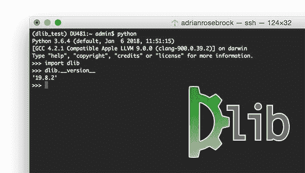
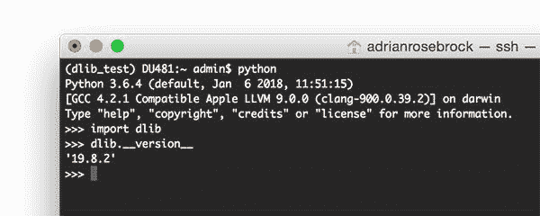
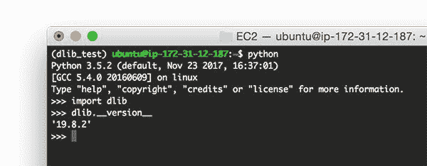
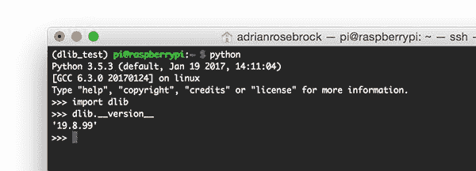
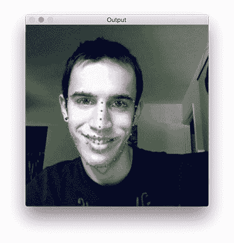
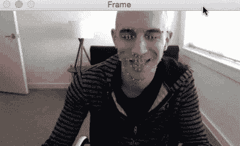
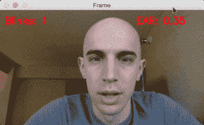

# 安装 dlib(简单完整的指南)

> 原文：<https://pyimagesearch.com/2018/01/22/install-dlib-easy-complete-guide/>



dlib 的最新版本很特别。

它完全消除了对 boost.python 的依赖，使其**更容易在 macOS、Ubuntu 和 Raspbian 上全面安装。**

 **多亏了[Davis King](https://twitter.com/nulhom)(dlib 库的创建者和维护者)和 [Mischan Toos-Haus](https://twitter.com/AboveVacant) (负责移除 boost.python 依赖)的工作，我们现在可以:

*   轻松利用所有 Python + dlib 功能(面部检测、面部标志、相关性跟踪等。)…
*   …依赖性更低，安装过程更简单。

**在今天的博文中，我将提供安装 dlib 的说明:**

*   马科斯
*   人的本质
*   Raspbian (Raspberry Pi 的操作系统)

这些安装说明是完整的、简单的、易于遵循的，并且将在几分钟内让您开始使用 dlib + Python 绑定。

**要了解如何在您的系统上安装 dlib，*继续阅读！***

## 安装 dlib(简单完整的指南)

在本指南中，您将学习如何在 macOS、Ubuntu 和 Raspbian 上安装 dlib。请随意跳到与您的操作系统对应的部分。

一旦您在各自的操作系统上安装了 dlib，我们将使用 Python、dlib 和 OpenCV ( [假设您也安装了 OpenCV](https://pyimagesearch.com/opencv-tutorials-resources-guides/))来验证安装，以检测面部标志。

从那时起，我提供了额外的教程和指南，以帮助将 dlib 应用于计算机视觉和机器学习项目，包括[检测和计数眨眼](https://pyimagesearch.com/2017/04/24/eye-blink-detection-opencv-python-dlib/)以及建立一个系统来[识别车辆驾驶员何时变得困倦/疲劳](https://pyimagesearch.com/2017/05/08/drowsiness-detection-opencv/)(并提醒他们醒来)。

### 在 macOS 上安装 dlib

我假设您已经在 macOS 机器上安装了 XCode。如果没有，请花时间打开 App Store，安装 XCode。

从那里，你需要安装 Homebrew，一个 macOS 的软件包管理器，类似于 Debian/Ubuntu 的`apt-get`:

```py
$ ruby -e "$(curl -fsSL https://raw.githubusercontent.com/Homebrew/install/master/install)"
$ brew update

```

***注意:**确保使用上面代码块中的< >按钮来展开部分——这将确保您复制并粘贴整个**自制软件安装命令。***

 **一旦安装了自制软件，你需要更新你的`PATH`来寻找自制软件的二进制文件、包和库。这可以通过使用编辑器(如 nano、vi 等)手动编辑文件来完成。或者简单地使用`echo`和重定向:

```py
$ echo -e "\n# Homebrew" >> ~/.bash_profile
$ echo "export PATH=/usr/local/bin:$PATH" >> ~/.bash_profile

```

然后，您需要`source`这个`~/.bash_profile`文件来重新加载更改:

```py
$ source ~/.bash_profile

```

然后我们将安装`cmake`(一个用于构建、测试和打包软件的工具)以及 Python 2.7 和 Python 3:

```py
$ brew install cmake
$ brew install python python3

```

您可以使用`which`来验证 Python 2.7 和 Python 3 是否已经成功安装:

```py
$ which python2
/usr/local/bin/python2
$ which python3
/usr/local/bin/python3

```

这里有两个关键点你需要注意。

首先，您希望确保两个 Python 二进制文件的根路径都在`/usr/local/bin`中——这是 Homebrew 存储 Python 二进制文件的地方。

如果您的根路径改为`/usr/bin`，那么您正在利用系统 Python 安装。我们想避免使用系统 Python 安装，所以如果你看到的是`/usr/bin`而不是`/usr/local/bin`，那么很可能是由于更新你的`~/.bash_profile`时出错(确保你返回并确保文件已被正确更新；这可能需要手动打开和编辑文件)。

要考察的第二个关键点是 Python 二进制本身:`python2`和`python3`。注意我们是如何*而不是*执行*只是* `python` — **而不是*明确*提供版本。**

这是因为 Homebrew 现在处理 Python 安装的方式。在旧版本的 Homebrew 中，Homebrew 会*自动*将`python`命令别名为 Python 2.7 或 Python 3 — **这种情况不再存在。**相反，我们需要*明确地*提供 Python 版本号。

这个名字对于`pip`来说也是真实的:我们现在使用`pip2`和`pip3`。

接下来，让我们准备我们的 Python 环境。

如果您正在使用 Python 虚拟环境(如果您遵循了[我的任何 OpenCV 安装教程](https://pyimagesearch.com/opencv-tutorials-resources-guides/)，您可能正在使用它们)，您可以为 dlib 安装创建一个新的 Python 虚拟环境:

```py
$ mkvirtualenv dlib_test -p python3

```

或者访问一个现有的:

```py
$ workon cv

```

使用 Python 虚拟环境完全是*可选的*，但是 ***强烈推荐*** ，因为 Python 虚拟环境是 Python 开发的最佳实践。要了解更多关于 Python 虚拟环境的知识(以及如何使用它们)[请参考我的 OpenCV 安装教程](https://pyimagesearch.com/opencv-tutorials-resources-guides/)，在那里它们有广泛的介绍。

从那里，我们可以安装 NumPy (dlib 唯一的 Python 依赖项),然后安装 dlib 库本身:

```py
$ pip install numpy
$ pip install dlib

```

如果你是使用 Python 虚拟环境的*而不是*，你需要将`pip`命令更新为`pip2`或`pip3`。如果你用的是 Python 2.7，用`pip2`代替`pip`。类似地，如果你正在使用 Python 3，用`pip3`代替`pip`。

从那里，启动 Python shell 并验证 dlib 的安装:

```py
(dlib_test) DU481:~ admin$ python
Python 3.6.4 (default, Jan  6 2018, 11:51:15) 
[GCC 4.2.1 Compatible Apple LLVM 9.0.0 (clang-900.0.39.2)] on darwin
Type "help", "copyright", "credits" or "license" for more information.
>>> import dlib
>>> dlib.__version__
'19.8.2'
>>>

```



**Figure 1:** Successfully installing dlib on macOS.

### 在 Ubuntu 上安装 dlib

以下说明是在 Ubuntu 16.04 上收集的，但应该也适用于较新版本的 Ubuntu。

首先，让我们安装所需的依赖项:

```py
$ sudo apt-get update
$ sudo apt-get install build-essential cmake
$ sudo apt-get install libopenblas-dev liblapack-dev 
$ sudo apt-get install libx11-dev libgtk-3-dev
$ sudo apt-get install python python-dev python-pip
$ sudo apt-get install python3 python3-dev python3-pip

```

我提供了一些关于您应该考虑的依赖项的注释:

1.  我们正在 dlib 中安装 GTK 和 X11 的 GUI 功能。如果你不关心 GUI 功能，这些库*可以跳过*，节省 100-200MB 的空间。
2.  我们为线性代数优化安装了 OpenBLAS，这允许 dlib 功能执行得更快。从技术上来说，你也可以跳过这一步，但是我强烈建议你安装 OpenBLAS，因为它的优化非常重要。

接下来，让我们为 dlib 安装准备 Python 环境。

如果您正在使用 Python 虚拟环境(如果您遵循了[我的任何 OpenCV 安装教程](https://pyimagesearch.com/opencv-tutorials-resources-guides/)，您可能正在使用它们)，您可以为 dlib 安装创建一个新的 Python 虚拟环境:

```py
$ mkvirtualenv dlib_test -p python3

```

或者访问一个现有的:

```py
$ workon cv

```

使用 Python 虚拟环境完全是*可选的*，但是 ***强烈推荐*** ，因为 Python 虚拟环境是 Python 开发的最佳实践。要了解更多关于 Python 虚拟环境的知识(以及如何使用它们)[请参考我的 OpenCV 安装教程](https://pyimagesearch.com/opencv-tutorials-resources-guides/)，在那里它们有广泛的介绍。

然后，您可以在 Ubuntu 系统上安装 dlib:

```py
$ pip install numpy
$ pip install dlib

```

如果使用 Python 虚拟环境的是*而不是*，请确保将`sudo`添加到`pip install`命令的开头(否则`pip install`命令将由于权限错误而失败)。此外，记住`pip`用于安装 Python 2.7 的包，而`pip3`用于 Python 3。根据您想要安装 dlib 的 Python 版本，您可能需要更新上面的`pip`命令。

最后，打开 Python shell，通过导入`dlib`库来验证您在 Ubuntu 上的 dlib 安装:

```py
(dlib_test) ubuntu@ip-172-31-12-187:~$ python
Python 3.5.2 (default, Nov 23 2017, 16:37:01) 
[GCC 5.4.0 20160609] on linux
Type "help", "copyright", "credits" or "license" for more information.
>>> import dlib
>>> dlib.__version__
'19.8.2'
>>>

```



**Figure 2:** Installing dlib on Ubuntu (Note: I was SSH’d into an Ubuntu machine in the Amazon EC2 cloud from my macOS machine when taking this screenshot, hence why the screenshot looks like the macOS GUI).

### 在 Raspberry Pi/Raspbian 上安装 dlib

本节介绍如何在 Raspberry Pi 和 Raspbian Stretch 操作系统上安装 dlib 库。这些说明应该也适用于较新版本的 Rasbpian。

我们的 Raspbian dlib 安装和我们的 Ubuntu dlib 安装是一样的，但是有一些小的调整:

1.  Python 2.7 和 Python 3 都是预装在 Raspbian 上的，所以我们不需要自己安装。
2.  我们需要安装`libatlas-base-dev`。
3.  我们可以通过`USE_NEON_INSTRUCTIONS`开关优化我们在 Raspberry Pi 架构上的 dlib 安装(这将要求您从源代码而不是`pip`安装 dlib)。

让我们开始在我们的 Raspberry Pi 上安装 dlib，确保我们已经满足了库/包的依赖性:

```py
$ sudo apt-get update
$ sudo apt-get install build-essential cmake
$ sudo apt-get install libopenblas-dev liblapack-dev libatlas-base-dev
$ sudo apt-get install libx11-dev libgtk-3-dev

```

关于 X11/GTK 和 OpenBLAS 的一些快速说明:

1.  我们正在 dlib 中安装 GTK 和 X11 的 GUI 功能。如果你不关心 GUI 功能，这些库*可以跳过*，节省 100-200MB 的空间。空间可能是树莓 Pi 的一个溢价，但同样，如果你需要 GUI 功能**确保你安装它们。**
2.  我们为线性代数优化安装了 OpenBLAS，这允许 dlib 功能执行得更快。从技术上来说，你也可以跳过这一步，但是我*强烈建议*你安装 OpenBLAS，因为它的优化非常重要——**你可以在 Raspberry Pi 上实现的任何优化都是值得的！**

接下来，让我们为在 Raspberry Pi 上安装 dlib 准备 Python 环境。

如果您正在使用 Python 虚拟环境(如果您遵循了[我的任何 OpenCV 安装教程](https://pyimagesearch.com/opencv-tutorials-resources-guides/)，您可能正在使用它们)，您可以为 dlib 安装创建一个新的 Python 虚拟环境:

```py
$ mkvirtualenv dlib_test -p python3

```

或者访问一个现有的:

```py
$ workon cv

```

使用 Python 虚拟环境完全是*可选的*，但是 ***强烈推荐*** ，因为 Python 虚拟环境是 Python 开发的最佳实践。要了解更多关于 Python 虚拟环境的知识(以及如何使用它们)[请参考我的 OpenCV 安装教程](https://pyimagesearch.com/opencv-tutorials-resources-guides/)，在那里它们有广泛的介绍。

然后我们可以在 Raspberry Pi 上安装 dlib:

```py
$ pip install numpy
$ pip install dlib

```

如果使用 Python 虚拟环境的是*而不是*，请确保将`sudo`添加到`pip install`命令的开头(否则`pip install`命令将由于权限错误而失败)。此外，记住`pip`用于安装 Python 2.7 的包，而`pip3`用于 Python 3。根据您想要安装 dlib 的 Python 版本，您可能需要更新上面的`pip`命令。

如果您决定使用 NEON 指令来优化 dlib 安装，请跳过通过`pip`安装 dlib，而是通过 source:

```py
$ git clone https://github.com/davisking/dlib.git
$ cd dlib
$ python setup.py install --yes USE_NEON_INSTRUCTIONS

```

从源代码编译将比通过`pip`安装花费更长的时间，所以要有耐心。

最后，打开一个 Python shell，通过导入`dlib`库来验证您在 Raspbian 上的 dlib 安装:

```py
(dlib_test) pi@raspberrypi:~ $ python
Python 3.5.3 (default, Jan 19 2017, 14:11:04) 
[GCC 6.3.0 20170124] on linux
Type "help", "copyright", "credits" or "license" for more information.
>>> import dlib
>>> dlib.__version__
'19.8.99'

```

***注意:**树莓 Pi 的 dlib 安装版本与我的 macOS 和 Ubuntu 输出不同，因为我从 **源**安装的**利用了 NEON 优化，而不是通过 pip 安装的**。*****



**Figure 3:** Successfully installing dlib on the Raspberry Pi and Raspbian operating system.

### 测试您的 dlib 安装

作为在 Raspberry Pi 上使用 dlib 的最后一个例子，这里是我整理的一个简短的例子，我们在输入图像中检测面部标志:

```py
# import the necessary packages
from imutils import face_utils
import dlib
import cv2

# initialize dlib's face detector (HOG-based) and then create
# the facial landmark predictor
p = "shape_predictor_68_face_landmarks.dat"
detector = dlib.get_frontal_face_detector()
predictor = dlib.shape_predictor(p)

# load the input image and convert it to grayscale
image = cv2.imread("example.jpg")
gray = cv2.cvtColor(image, cv2.COLOR_BGR2GRAY)

# detect faces in the grayscale image
rects = detector(gray, 0)

# loop over the face detections
for (i, rect) in enumerate(rects):
	# determine the facial landmarks for the face region, then
	# convert the facial landmark (x, y)-coordinates to a NumPy
	# array
	shape = predictor(gray, rect)
	shape = face_utils.shape_to_np(shape)

	# loop over the (x, y)-coordinates for the facial landmarks
	# and draw them on the image
	for (x, y) in shape:
		cv2.circle(image, (x, y), 2, (0, 255, 0), -1)

# show the output image with the face detections + facial landmarks
cv2.imshow("Output", image)
cv2.waitKey(0)

```

***注意:**这个例子假设您的系统上已经安装了 OpenCV 和 dlib。如果你没有安装 OpenCV，请参考我的 [OpenCV 安装教程](https://pyimagesearch.com/opencv-tutorials-resources-guides/)。*

对于上面用于面部标志预测的代码的详细回顾，请参考我以前的关于面部标志的[基础教程。](https://pyimagesearch.com/2017/04/03/facial-landmarks-dlib-opencv-python/)

要执行上述脚本:

*   确保已经安装了 OpenCV、dlib 和 imutils ( `pip install --upgrade imutils`)。
*   使用下面的 ***“下载”*** 部分下载源代码+示例图像+预训练的 dlib 面部标志预测器。

从那里，您可以发出以下命令来执行我们的示例脚本:

```py
$ python facial_landmarks.py

```

然后，您应该会看到以下输出，其中面部标志显示在图像上:



**Figure 4:** Detecting facial landmarks using the dlib library and Python.

**趣闻:**上图是我~8 年前本科大学时期的我。那时候我真的有头发！

## 现在怎么办？

既然您已经开始使用 dlib，我建议您:

1.  也在您的系统上安装 OpenCV(如果您还没有安装的话)。我这里有很多适用于 macOS、Ubuntu 和 Raspbian 的 OpenCV 安装教程。
2.  使用 OpenCV + dlib 安装程序来构建实际的、真实的项目。

我建议从本教程开始，你将学习如何[应用实时面部标志检测](https://pyimagesearch.com/2017/04/17/real-time-facial-landmark-detection-opencv-python-dlib/):

[](https://pyimagesearch.com/2017/04/17/real-time-facial-landmark-detection-opencv-python-dlib/)

**Figure 5:** Using dlib to apply real-time facial landmark detector.

从那里，你可以利用面部标志来[建立一个眨眼检测器](https://pyimagesearch.com/2017/04/24/eye-blink-detection-opencv-python-dlib/):

[](https://pyimagesearch.com/2017/04/24/eye-blink-detection-opencv-python-dlib/)

**Figure 6:** Building an eye blink detector with dlib, OpenCV, and Python.

最后，我们将前两个教程中的所有内容放在一起[制作一个睡意探测器](https://pyimagesearch.com/2017/05/08/drowsiness-detection-opencv/):

[](https://pyimagesearch.com/2017/05/08/drowsiness-detection-opencv/)

**Figure 7:** Creating a drowsiness detector with dlib, OpenCV, and Python.

一定要看看教程！它们很有趣，可以亲自动手，会给你很多用 dlib 和 OpenCV 构建真实世界的计算机视觉应用程序的经验。

## 摘要

在今天的博文中，你学习了如何在 macOS、Ubuntu 和 Raspbian 上安装 dlib。

多亏了 [Davis King](https://twitter.com/nulhom) 和 [Mischan Toos-Haus](https://twitter.com/AboveVacant) 的工作，现在安装 dlib 比以往任何时候都容易，需要更少的依赖和更快的过程。

现在请花一点时间感谢 Davis 和 Mischan 的辛勤工作以及他们对开源社区的贡献。

我希望你喜欢这篇博文！为了在未来的 PyImageSearch 教程发布时得到通知，*请务必在下表中输入您的电子邮件地址。*****