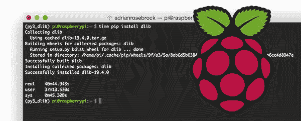
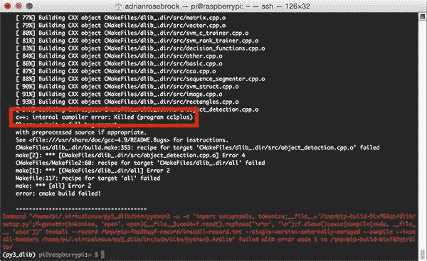
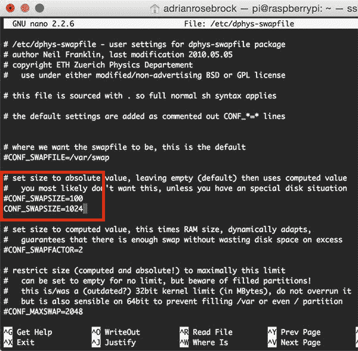
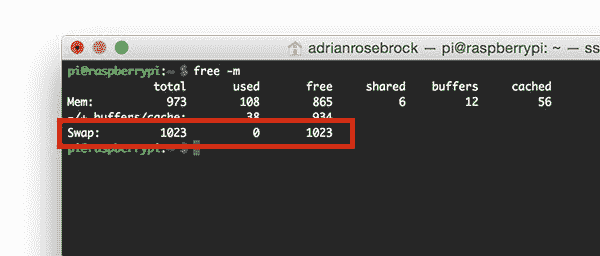
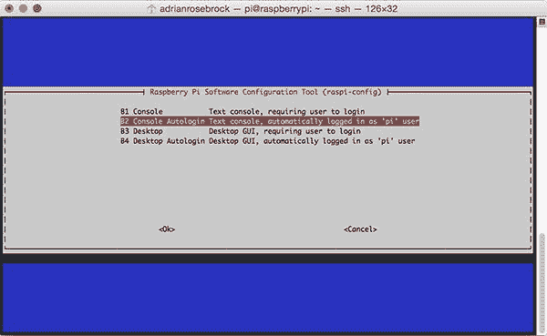
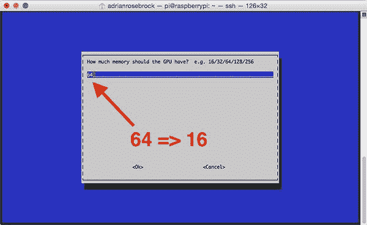
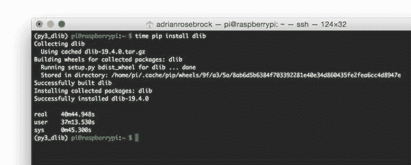
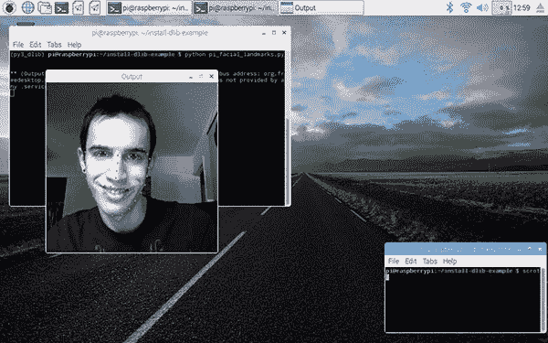
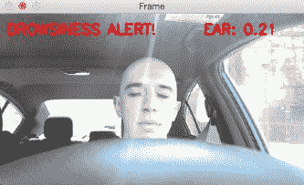

# 在树莓 Pi 上安装 dlib

> 原文：<https://pyimagesearch.com/2017/05/01/install-dlib-raspberry-pi/>



几周前，我写了一篇关于如何在 Ubuntu 和 macOS 上安装 dlib 库的博文。

由于 Raspbian ,(大多数)Raspberry Pi 用户运行的操作系统是基于 Debian 的(Ubuntu 也是如此),相同的*安装指令可以用于 Raspbian，就像 Ubuntu 一样…*

***……不过，这里面有蹊跷。***

Raspberry Pi 3 的内存只有 1GB。这 1GB 的 RAM 负责所有的系统操作，显示 GUI/桌面，并处理我们的编译。

事实上，如果你试图在 Raspberry Pi 上编译 dlib，你的编译可能会出错。

为了让带有 Python 绑定的 dlib 成功安装在你的 Raspberry Pi 上，你需要*更新你的系统来回收尽可能多的内存*以及*更新你的交换文件大小*。

幸运的是，这并不像听起来那样具有挑战性，如果您遵循本指南中详细介绍的步骤，您将在接下来的 45 分钟内将 dlib 安装到您的 Raspbian 系统上。

**要了解如何在你的树莓 Pi 上安装 dlib，*继续阅读。***

## 在树莓 Pi 上安装 dlib

本教程的第一部分讨论了在 Raspberry Pi 上使用 Python 绑定编译 dlib 时会遇到的常见内存错误。

然后我们进入我的在 Raspberry Pi 上安装 dlib 的六步指南。

最后，我们将通过一个示例来展示如何使用 dlib、Python 和 Raspberry Pi 来检测面部标志。

### 遇到内存错误？系统崩溃？

如果你使用我之前的 dlib 安装教程中的 Ubuntu 指令在你的 Raspberry Pi 上安装 dlib，你的编译可能会失败，并显示如下错误信息:



**Figure 1:** The dlib compile failing on the Raspberry Pi due to the C++ compiler being killed.

此错误的原因可以在突出显示的框中找到:

`c++: internal compiler error: Killed (program cc1plus)`

这个错误消息归结为 dlib 编译程序使用了太多的内存，Raspbian 操作系统杀死了这个进程，阻止了 Raspberry Pi 的抓取。

然而，预防措施是不够的——我尝试在我的 Raspberry Pi *上编译 dlib，而没有*更新我的交换文件大小、引导选项和内存分割(详细如下),我的 Pi 只是被锁定，我不得不硬重置它。

为了在 Raspbian 上安装带有 Python 绑定的 dlib，我们需要回收尽可能多的可用内存。我们将在下一节深入探讨如何做到这一点。

### 步骤 1:更新交换文件大小、引导选项和内存分割

为 dlib 编译准备 Raspberry Pi 分为三个步骤，每个步骤都有一个相同的目标——增加编译可用的内存量:

1.  增加交换文件的大小。
2.  切换您的启动选项。
3.  更新你的 GPU/RAM 分割。

***注意:**对于本教程中的几乎所有截图，我都是通过 SSH 从我的主机 macOS 系统进入我的 Raspberry Pi 的(这就是为什么截图来自 macOS 终端而不是 Raspbian 终端)。*

#### 增加交换文件大小

交换文件或交换空间是硬盘/内存卡上的空间，用作系统真实内存(RAM)的扩展*虚拟内存*。

启用交换文件允许您的操作系统“假装”拥有比实际更多的板载内存。使用交换文件体系结构，RAM 中的页面被“换出”到磁盘，直到再次需要它们时才被“换入”。

几乎所有主流操作系统都在某种程度上支持交换。

在 Raspbian 中，使用了 [dphys-swapfile](http://neil.franklin.ch/Projects/dphys-swapfile/) 解决方案，默认 100MB 专用于我们卡上的交换。

为了更新我们的交换空间的大小，我们需要编辑 dphys-swapfile 配置文件，它位于`/etc/dphys-swapfile`中。您可以使用您喜欢的文本编辑器来编辑配置:

```py
$ sudo nano /etc/dphys-swapfile

```

向下滚动到如下配置:

`CONF_SWAPSIZE=100`

然后将其更新为使用 1024MB 而不是 100MB:



**Figure 2:** Updating the Raspbian swap size to be 1024MB rather than 100MB.

注意这里的`CONF_SWAPSIZE=1024`——这对于我们在 Raspberry Pi 上编译 dlib 来说已经足够了。

***注:**增加交换容量是烧掉你的树莓 Pi 卡的好方法。基于闪存的存储可以执行的写入次数有限，直到卡基本上无法再容纳 1 和 0。我们只会在短时间内启用大规模互换，所以这没什么大不了的。不管怎样，一定要在安装 dlib 后备份你的`.img`文件，以防你的卡意外提前死亡。你可以在本页的[阅读更多关于大容量交换损坏存储卡的信息。](https://www.bitpi.co/2015/02/11/how-to-change-raspberry-pis-swapfile-size-on-rasbian/)*

更新完`/etc/dphys-swapfile`文件后，运行以下两个命令来重新启动交换服务:

```py
$ sudo /etc/init.d/dphys-swapfile stop
$ sudo /etc/init.d/dphys-swapfile start

```

`start`命令可能需要几分钟才能执行完，因为交换空间正在增加和重新分配。

然后，您可以运行:

```py
$ free -m

```

以确认您的交换大小已经增加。

在这里，您可以看到我的交换空间从之前的 100MB 增加到了 1024MB:



Figure 3: Running *free -m* confirms that the new swap size of 1024MB is being used.

#### 更改您的启动选项

默认情况下，你的 Raspberry Pi 会引导到 PIXEL 桌面(假设你用的是最新版本的 Raspbian)。这很好；除了 PIXEL 桌面需要内存 dlib 编译急需的 RAM。

我们应该将*直接引导到终端*，而不是引导到 PIXEL GUI。这将为我们节省大量内存。

为此，请执行:

```py
$ sudo raspi-config

```

然后选择`Boot Options => Desktop / CLI => Console Autologin`:



**Figure 4:** How to set your Raspberry Pi to boot to a terminal rather than a desktop.

这将确保你的 Raspberry Pi 直接引导*到终端，跳过 PIXEL 桌面。*

然而，在退出`raspi-config`之前，一定要更新内存分割，如下所述。

#### 更新您的内存分割

默认情况下，Raspberry Pi 为板载 GPU 分配 64MB 内存。我们应该将这个数字减少到 16MB，以便为编译回收内存。

使用`raspi-config`就足够简单了。回到主屏幕，选择`Advanced Options => Memory Split`，在这里你会看到 64MB 的提示:



**Figure 5:** Update your GPU/RAM split to be 16MB rather than 64MB.

将该值更新为 16MB，然后退出。

#### 重启你的树莓派

退出时，`raspi-config`会询问您是否要重新启动系统。

继续并重新启动，然后我们可以继续安装教程的其余部分。

### 步骤 2:安装 dlib 先决条件

dlib 库需要四个先决条件:

1.  促进
2.  助推。计算机编程语言
3.  CMake
4.  X11

这些都可以通过以下命令安装:

```py
$ sudo apt-get update
$ sudo apt-get install build-essential cmake
$ sudo apt-get install libgtk-3-dev
$ sudo apt-get install libboost-all-dev

```

`pip`命令应该*已经*安装在您的 Raspberry Pi 上(您可以通过执行`pip`命令并确保它确实存在来验证这一点)——否则，您可以通过以下方式安装`pip`:

```py
$ wget https://bootstrap.pypa.io/get-pip.py
$ sudo python get-pip.py

```

一旦你确认`pip`已经安装，我们就可以继续了。

### 步骤 3:访问您的 Python 虚拟环境(如果您正在使用它们)

我在 PyImageSearch 博客上的所有 OpenCV 安装教程都使用了 Python 虚拟环境。

使用 Python 的 [virtualenv](https://virtualenv.pypa.io/en/latest/) 和 [virtualenvwrapper](https://virtualenvwrapper.readthedocs.io/en/latest/) 库，我们可以为我们正在进行的*每个*项目创建单独的 Python 环境——这被认为是用 Python 编程语言开发软件时的**最佳实践**。

我以前在 PyImageSearch 博客上多次讨论过 Python 虚拟环境，所以我在这里就不再讨论了。如果你想了解更多关于 Python 虚拟环境的内容，请参考[我的任何安装 OpenCV 教程](https://pyimagesearch.com/opencv-tutorials-resources-guides/)以及这本优秀的 [Python 虚拟环境初级读本](https://realpython.com/blog/python/python-virtual-environments-a-primer/)。

如果您想将 dlib 安装到一个预先存在的 Python 虚拟环境中，请使用`workon`命令:

```py
$ workon <your virtualenv name>

```

例如，PyImageSearch 上的大多数教程都创建了一个名为`cv`的虚拟环境。我们可以通过以下方式访问`cv`虚拟环境:

```py
$ workon cv

```

否则，我建议使用`mkvirtualenv`命令创建一个完全独立的虚拟环境。

下面的命令将使用 Python 2.7 解释器创建一个名为`py2_dlib`的 Python 虚拟环境:

```py
$ mkvirtualenv py2_dlib

```

虽然这个命令将创建一个名为`py3_dlib`的 Python 3 虚拟环境:

```py
$ mkvirtualenv py3_dlib -p python3

```

请记住，这一步是*可选*，但是**T3 强烈推荐 T5。**

对于在 PyImageSearch 上关注过我之前的 OpenCV 安装教程的读者，请确保在进行第 4 步之前访问了您的 Python 虚拟环境。

### 步骤 4:使用 pip 安装带有 Python 绑定的 dlib

我们将从基本的 NumPy + SciPy 栈开始，然后是 [scikit-image](http://scikit-image.org/) ，一个通常与 dlib 一起使用的库:

```py
$ pip install numpy
$ pip install scipy
$ pip install scikit-image

```

然后我们也可以通过`pip`安装 dlib:

```py
$ pip install dlib

```

在我的 Raspberry Pi 3 上，这一编译花费了大约 40 分钟，但是正如您所看到的，库被成功编译，没有出现错误:



**Figure 6:** Successfully compiling dlib with Python bindings on your Raspberry Pi.

### 步骤 5:测试您的 dlib 安装

为了测试您的 dlib 安装，打开一个 Python shell(如果您使用了 Python 虚拟环境，请确保访问您的 Python 虚拟环境)，然后尝试导入`dlib`:

```py
$ python
Python 3.4.2 (default, Oct 19 2014, 13:31:11) 
[GCC 4.9.1] on linux
Type "help", "copyright", "credits" or "license" for more information.
>>> import dlib
>>>

```

如果您想从同一个虚拟环境中访问 OpenCV 绑定和 dlib 绑定，请确保您的`cv2.so`绑定正确地符号链接到 Python 虚拟环境的`site-packages`目录中。

### 第 6 步:重置你的交换文件大小，引导选项和内存分割

**重要提示**—**在离开机器之前，请务必将您的交换文件大小重置为 100MB** (使用上述*“步骤 1:增加交换文件大小”*部分中详述的过程)。

然后，您可以将 GPU/RAM 分割重置为 64MB，并更新引导选项以引导到桌面界面，而不是命令行。

完成这些更改后，重启您的 Raspberry Pi 以确保它们生效。

### 额外收获:使用 dlib 和 Raspberry Pi 进行面部标志检测

作为在 Raspberry Pi 上使用 dlib 的最后一个例子，这里是我编写的一个简短的例子，我们将在输入图像中检测面部标志:

```py
# import the necessary packages
from imutils import face_utils
import dlib
import cv2

# initialize dlib's face detector (HOG-based) and then create
# the facial landmark predictor
p = "shape_predictor_68_face_landmarks.dat"
detector = dlib.get_frontal_face_detector()
predictor = dlib.shape_predictor(p)

# load the input image and convert it to grayscale
image = cv2.imread("example.jpg")
gray = cv2.cvtColor(image, cv2.COLOR_BGR2GRAY)

# detect faces in the grayscale image
rects = detector(gray, 0)

# loop over the face detections
for (i, rect) in enumerate(rects):
	# determine the facial landmarks for the face region, then
	# convert the facial landmark (x, y)-coordinates to a NumPy
	# array
	shape = predictor(gray, rect)
	shape = face_utils.shape_to_np(shape)

	# loop over the (x, y)-coordinates for the facial landmarks
	# and draw them on the image
	for (x, y) in shape:
		cv2.circle(image, (x, y), 2, (0, 255, 0), -1)

# show the output image with the face detections + facial landmarks
cv2.imshow("Output", image)
cv2.waitKey(0)

```

对于上面用于面部标志预测的代码的详细回顾，请参考我以前关于面部标志的[基础的帖子。](https://pyimagesearch.com/2017/04/03/facial-landmarks-dlib-opencv-python/)

要执行脚本:

*   确保你已经通过`pip install --upgrade imutils`安装/升级了 [imutils 库](https://github.com/jrosebr1/imutils)。
*   使用下面的 ***“下载”*** 部分下载代码+示例图像+预训练的 dlib 面部标志预测器)。

从那里，您可以发出以下命令:

```py
$ python pi_facial_landmarks.py

```

然后，您应该会看到以下输出，其中面部标志正确显示在输入图像上:



**Figure 7:** Detecting facial landmarks on an image using dlib on the Raspberry Pi.

***趣闻:**上图是我在大学期间的照片——那时我还留着头发呢！*

不幸的是，从我的测试来看，Raspberry Pi 3 的速度不够快，无法实时执行面部标志检测。在我的实验中，在轮询视频流的下一帧，然后应用面部标志预测之间有一个*显著滞后*，即使在使用[线程视频流以获得最佳性能](https://pyimagesearch.com/2016/01/04/unifying-picamera-and-cv2-videocapture-into-a-single-class-with-opencv/)时也是如此。其原因是因为面部检测过程*极其缓慢*。

请记住，Raspberry Pi 3 处理器的运行频率仅为 1.2Ghz，而我的 Mac(很可能是你的机器)上的处理器运行频率为 3.1GHz(或类似)。这是一个巨大的速度提升。

加速 dlib 的面部标志预测器的方法可以在这里找到—我将在未来的博客文章中回顾它们，并附带 Python 实现，以帮助我们在 Raspberry Pi 上获得实时面部标志预测性能。

## 摘要

在今天的博文中，我们学习了如何在 Raspberry Pi 上编译和安装带有 Python 绑定的 dlib。

为了在 Raspberry Pi 上正确安装 dlib，我们必须采取一些与内存使用相关的预防措施，包括:

1.  增加我们系统可用的交换容量。
2.  将我们的 Raspberry Pi 引导到*终端*而不是*桌面*。
3.  减少分配给 GPU 的内存，并将其分配给主内存。

通过执行这三个步骤，我们能够回收足够的内存来在我们的 Raspberry Pi 上安装 dlib。然而，现在我们遇到了一个问题，Pi 对于实时面部标志预测来说不够快。我们将在以后的教程中讨论如何加速面部标志预测。

最后，我想提一下，下周的教程是关于驾驶机动车 时的 ***睡意检测，这是 PyImageSearch 上一篇被大量引用的博文:***



**Figure 8:** A preview of next week’s tutorial on drowsiness detection while driving a motor vehicle.

**我非常兴奋能够演示如何从头开始构建一个睡意检测器，所以为了确保当*不能错过*的博文发布时，你会得到通知，*请务必在下面的表格中输入你的电子邮件地址！***