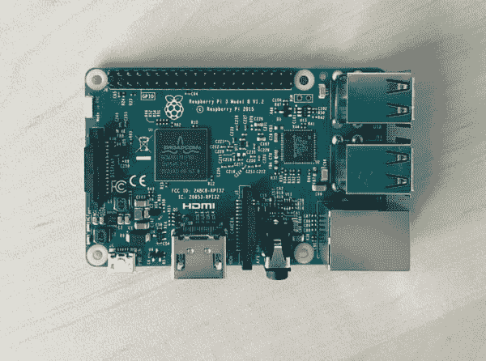
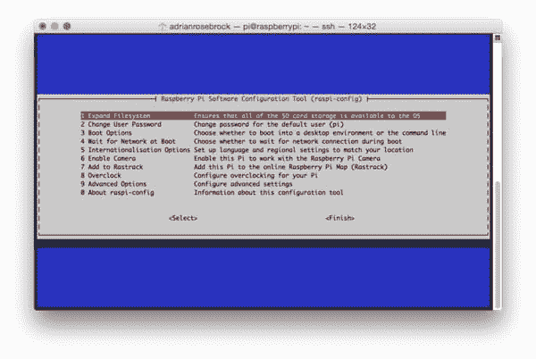
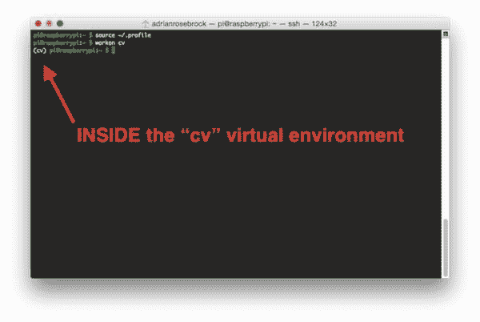
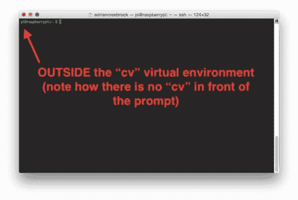
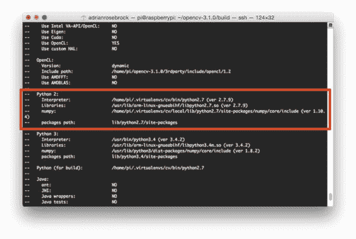
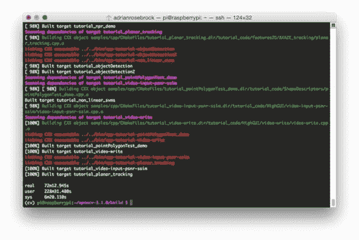
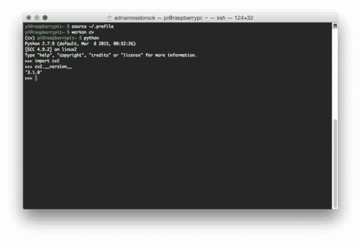

# 安装指南:Raspberry Pi 3+Raspbian Jessie+OpenCV 3

> 原文：<https://pyimagesearch.com/2016/04/18/install-guide-raspberry-pi-3-raspbian-jessie-opencv-3/>



你能相信距离[原版树莓派 B 型](http://www.amazon.com/gp/product/B009SQQF9C/ref=as_li_tl?ie=UTF8&camp=1789&creative=390957&creativeASIN=B009SQQF9C&linkCode=as2&tag=trndingcom-20&linkId=YZLP5GWTKJ5E7BGB)发布已经过去 ***四年*** 了吗？当时，Pi Model B 只配备了 256MB 内存和 700MHz 单核处理器。

刚过 ***一年前***[树莓派 2](http://www.amazon.com/gp/product/B008XVAVAW/ref=as_li_tl?ie=UTF8&camp=1789&creative=390957&creativeASIN=B008XVAVAW&linkCode=as2&tag=trndingcom-20&linkId=KGMCPNATKSKQHAZX) 向全世界发布。而人类，为了一个叫做*“Pi”*的东西，这个野兽像小行星一样对计算机世界造成了冲击。这款主板配有 1GB 内存和 900MHz ***四核*** 处理器——与最初的单核 700MHz 系统相比是相当大的升级！

在我看来， ***树莓 Pi 2 是让计算机视觉在 Pi 平台*** 上成为可能的东西(至少从 Python + OpenCV 的角度来看)。最初的 model B 根本没有足够强大的处理能力(或 RAM)来处理图像和视频流，除了琐碎的操作之外没有任何其他功能——Pi 2 改变了这一切。

事实上，Raspberry Pi 2 对计算机视觉领域产生了如此有意义的影响，以至于我甚至花时间制作了一个与 Pi 兼容的实用 Python 和 OpenCV 的所有代码示例。

现在我们有了[树莓派 3](http://www.amazon.com/gp/product/B01C6FFNY4/ref=as_li_tl?ie=UTF8&camp=1789&creative=390957&creativeASIN=B01C6FFNY4&linkCode=as2&tag=trndingcom-20&linkId=M7C6OJOPQD3EOLIU) :

*   1.2Ghz 64 位四核处理器。
*   1GB 内存。
*   集成 802.11n 无线和蓝牙。

就个人而言，我希望有更多的内存(可能在 1.5-2GB 的范围内)。但是升级到 64 位处理器和 *33%的性能提升*对*来说是非常值得的*。

正如我在以前的博客文章中所做的，我将展示如何在 Raspbian Jessie *上使用 Python 绑定安装 OpenCV 3。*

如果您正在寻找不同平台的先前安装说明，请参考以下列表:

*   [如何在 ***Raspbian Jessie** 上安装 OpenCV 3.0？*](https://pyimagesearch.com/2015/10/26/how-to-install-opencv-3-on-raspbian-jessie/)
*   [在你的*Raspberry Pi Zero*running*Raspbian Jessie 上安装 OpenCV。*](https://pyimagesearch.com/2015/12/14/installing-opencv-on-your-raspberry-pi-zero/)
*   [在 ***拉斯边喘息***上同时安装 Python 2.7 和 Python 3+的 OpenCV 3.0。](https://pyimagesearch.com/2015/07/27/installing-opencv-3-0-for-both-python-2-7-and-python-3-on-your-raspberry-pi-2/)
*   [在 ***拉斯边喘息*** 上为 Python 2.7 安装 OpenCV 2.4。](https://pyimagesearch.com/2015/02/23/install-opencv-and-python-on-your-raspberry-pi-2-and-b/)

否则，让我们继续将 OpenCV 3 安装到您全新的 Raspberry Pi 3 上吧！

## 假设

在本教程中，我将假设您已经拥有一台 **[树莓 Pi 3](http://www.amazon.com/gp/product/B01C6FFNY4/ref=as_li_tl?ie=UTF8&camp=1789&creative=390957&creativeASIN=B01C6FFNY4&linkCode=as2&tag=trndingcom-20&linkId=KQ4HNH4UOHXJG44M)** 并安装了**[Raspbian Jessie](https://www.raspberrypi.org/downloads/raspbian/)**。

你还应该有*或者*:

*   物理访问您的 Raspberry Pi 3，以便您可以打开终端并执行命令。
*   *通过 SSH 远程访问*。

我将通过 SSH 完成本教程的大部分内容，但是只要您可以访问终端，您就可以轻松地跟着做。

## 在运行 Raspbian Jessie 的 Raspberry Pi 3 上安装 OpenCV 3

如果您曾经在 Raspberry Pi(或任何其他平台)上安装过 OpenCV，您会知道这个过程非常耗时，因为必须安装许多依赖项和先决条件。本教程的目标是逐步引导你完成编译和安装过程。

为了使安装过程更加顺利，我已经包括了每个步骤的时间，这样当 Pi 编译 OpenCV 时，您就知道什么时候该休息一下，喝杯咖啡，检查一下电子邮件。也就是说， *Pi 3 比 Pi 2* 快得多，所以编译 OpenCV 所花的时间已经大大减少了***。***

 *无论如何，让我们开始在您全新的运行 Raspbian Jessie 的 Raspberry Pi 3 上安装 OpenCV 3。

### 步骤#1:扩展文件系统

你用的是全新的 Raspbian Jessie 吗？

如果是这样的话，你应该做的第一件事就是扩展你的文件系统，在你的 micro-SD 卡上包含所有可用空间:

```py
$ sudo raspi-config

```



**Figure 1:** Expanding the filesystem on your Raspberry Pi 3.

一旦出现提示，你应该选择第一个选项， ***"1。展开文件系统*** ， ***点击键盘上的 Enter*** ，向下箭头到***<【完成】>***按钮，然后重新启动你的 Pi:

```py
$ sudo reboot

```

重新启动后，您的文件系统应该已经扩展到包括 micro-SD 卡上的所有可用空间。您可以通过执行`df -h`并检查输出来验证磁盘是否已经扩展:

```py
$ df -h
Filesystem      Size  Used Avail Use% Mounted on
/dev/root       7.2G  3.3G  3.6G  48% /
devtmpfs        459M     0  459M   0% /dev
tmpfs           463M     0  463M   0% /dev/shm
tmpfs           463M  6.4M  457M   2% /run
tmpfs           5.0M  4.0K  5.0M   1% /run/lock
tmpfs           463M     0  463M   0% /sys/fs/cgroup
/dev/mmcblk0p1   60M   20M   41M  34% /boot
tmpfs            93M     0   93M   0% /run/user/1000

```

如您所见，我的 Raspbian 文件系统已经扩展到包括所有 8GB 的 micro-SD 卡。

然而，即使我的文件系统扩展了，我已经使用了 48%的 8GB 卡！

OpenCV 及其所有依赖项在编译过程中需要几千兆字节，因此您应该删除 Wolfram 引擎以释放 Pi 上的一些空间:

```py
$ sudo apt-get purge wolfram-engine

```

**移除 Wolfram 引擎后，*您可以回收差不多 700mb！***

### 步骤 2:安装依赖项

[这不是我第一次讨论如何在 Raspberry Pi](https://pyimagesearch.com/opencv-tutorials-resources-guides/) 上安装 OpenCV，所以我将把这些说明保持在更简短的一面，让您能够完成安装过程:我还包括了执行每个命令 所需的 ***时间，这样您就可以相应地计划 OpenCV + Raspberry Pi 3 的安装(OpenCV 本身需要 **1h 12m** 来编译)。***

第一步是更新和升级任何现有的软件包:

```py
$ sudo apt-get update
$ sudo apt-get upgrade

```

**计时:1 米 26 秒**

然后我们需要安装一些开发工具，包括 [CMake](https://cmake.org/) ，它帮助我们配置 OpenCV 构建过程:

```py
$ sudo apt-get install build-essential cmake pkg-config

```

**计时:40 秒**

接下来，我们需要安装一些图像 I/O 包，允许我们从磁盘加载各种图像文件格式。这种文件格式的例子包括 JPEG、PNG、TIFF 等。：

```py
$ sudo apt-get install libjpeg-dev libtiff5-dev libjasper-dev libpng12-dev

```

**计时:32s**

就像我们需要图像 I/O 包一样，我们也需要视频 I/O 包。这些库允许我们从磁盘读取各种视频文件格式，并直接处理视频流:

```py
$ sudo apt-get install libavcodec-dev libavformat-dev libswscale-dev libv4l-dev
$ sudo apt-get install libxvidcore-dev libx264-dev

```

**计时:34 秒**

OpenCV 库附带了一个名为`highgui`的子模块，用于在屏幕上显示图像和构建基本的 GUI。为了编译`highgui`模块，我们需要安装 GTK 开发库:

```py
$ sudo apt-get install libgtk2.0-dev

```

**计时:3m 6s**

OpenCV 内部的许多操作(即矩阵操作)可以通过安装一些额外的依赖项来进一步优化:

```py
$ sudo apt-get install libatlas-base-dev gfortran

```

**计时:46s**

这些优化库对于资源受限的设备(如 Raspberry Pi)尤为重要。

最后，让我们安装 Python 2.7 和 Python 3 头文件，这样我们就可以使用 Python 绑定来编译 OpenCV:

```py
$ sudo apt-get install python2.7-dev python3-dev

```

**计时:45s**

如果您跳过这一步，您可能会注意到在运行`make`来编译 OpenCV 时，没有找到与`Python.h`头文件相关的错误。

### 步骤 3:下载 OpenCV 源代码

现在我们已经安装了依赖项，让我们从官方 [OpenCV 库](https://github.com/Itseez/opencv)获取 OpenCV 的`3.1.0`档案。(*注:*随着 openCV 未来版本的发布，可以用最新的版本号替换`3.1.0`):

```py
$ cd ~
$ wget -O opencv.zip https://github.com/Itseez/opencv/archive/3.1.0.zip
$ unzip opencv.zip

```

**计时:1 米 26 秒**

我们希望 OpenCV 3 的*完整安装*(例如，[可以访问 SIFT 和 SURF](https://pyimagesearch.com/2015/07/16/where-did-sift-and-surf-go-in-opencv-3/) 等特性)，所以我们还需要获取 [opencv_contrib](https://github.com/itseez/opencv_contrib) 库:

```py
$ wget -O opencv_contrib.zip https://github.com/Itseez/opencv_contrib/archive/3.1.0.zip
$ unzip opencv_contrib.zip

```

**计时:43s**

在复制和粘贴过程中，您可能需要使用“<=>”按钮来扩展上面的命令。在某些浏览器中，`3.1.0.zip`中的`.zip`可能会被截断。OpenCV 3.1.0 档案的完整 URL 是:

[https://github.com/Itseez/opencv_contrib/archive/3.1.0.zip](https://github.com/Itseez/opencv_contrib/archive/3.1.0.zip)

***注意:**确保你的`opencv`和`opencv_contrib`版本相同(这里是`3.1.0`)。如果版本号不匹配，那么您可能会遇到编译时或运行时问题。*

### 第四步:Python 2.7 还是 Python 3？

在我们开始在我们的 Raspberry Pi 3 上编译 OpenCV 之前，我们首先需要安装`pip`，一个 Python 包管理器:

```py
$ wget https://bootstrap.pypa.io/get-pip.py
$ sudo python get-pip.py

```

**计时:20 秒**

如果你是一个长期的 PyImageSearch 读者，那么你会知道我是 [virtualenv](https://virtualenv.pypa.io/en/latest/) 和 [virtualenvwrapper](https://virtualenvwrapper.readthedocs.org/en/latest/) 的*超级粉丝*。安装这些包并不是必需的，你完全可以*安装 OpenCV 而不安装它们，但是我强烈建议你安装它们 ***，因为将来的其他 PyImageSearch 教程也将利用 Python 虚拟环境。在本指南的剩余部分，我还假设您已经安装了`virtualenv`和`virtualenvwrapper`。****

 ***那么，既然如此，使用`virtualenv`和`virtualenvwrapper`又有什么意义呢？**

首先，重要的是要理解虚拟环境是一种*特殊工具*，用于通过为每个项目创建*隔离的、独立的* Python 环境，将不同项目所需的依赖关系保存在不同的地方。

简而言之，它解决了*“项目 X 依赖版本 1.x，但项目 Y 需要 4 . X”*的困境。它还能保持你的全球`site-packages`整洁、干净、没有杂乱。

如果你想知道为什么 Python 虚拟环境是好的实践的完整解释，绝对[读一读 RealPython 上这篇出色的博客文章](https://realpython.com/blog/python/python-virtual-environments-a-primer/)。

使用某种虚拟环境是 Python 社区的标准做法**，所以我*强烈建议*你也这么做:**

```py
$ sudo pip install virtualenv virtualenvwrapper
$ sudo rm -rf ~/.cache/pip

```

**计时:9s**

既然已经安装了`virtualenv`和`virtualenvwrapper`，我们需要更新我们的`~/.profile`文件，在文件的*底部*包含以下几行:

```py
# virtualenv and virtualenvwrapper
export WORKON_HOME=$HOME/.virtualenvs
source /usr/local/bin/virtualenvwrapper.sh

```

在之前的教程中，我已经推荐使用您最喜欢的基于终端的文本编辑器，如`vim`、`emacs`或`nano`来更新`~/.profile`文件。如果您对这些编辑器感到满意，请继续更新文件以反映上面提到的更改。

否则，您应该简单地使用`cat`和输出重定向来处理更新`~/.profile`:

```py
$ echo -e "\n# virtualenv and virtualenvwrapper" >> ~/.profile
$ echo "export WORKON_HOME=$HOME/.virtualenvs" >> ~/.profile
$ echo "source /usr/local/bin/virtualenvwrapper.sh" >> ~/.profile

```

现在我们已经更新了我们的`~/.profile`,我们需要重新加载它以确保更改生效。您可以通过以下方式强制重新加载您的`~/.profile`文件:

1.  注销然后重新登录。
2.  关闭终端实例并打开一个新实例
3.  还是我个人最喜欢的， ***就用`source`命令:***

```py
$ source ~/.profile

```

***注意:**我建议每次打开一个新的终端 *时运行`source ~/.profile`文件* **，以确保系统变量设置正确。***

#### 创建您的 Python 虚拟环境

接下来，让我们创建将用于计算机视觉开发的 Python 虚拟环境:

```py
$ mkvirtualenv cv -p python2

```

该命令将使用 ***Python 2.7*** 创建一个名为`cv`的新 Python 虚拟环境。

如果你想使用 ***Python 3*** ，你可以使用这个命令:

```py
$ mkvirtualenv cv -p python3

```

再次， ***这一点我怎么强调都不为过:***`cv`Python 虚拟环境是 ***完全独立于 Raspbian Jessie 下载中包含的默认 Python 版本*** 。任何在*全局* `site-packages`目录*中的 Python 包将*对`cv`虚拟环境不可用。类似的，任何安装在`cv` *的`site-packages`中的 Python 包都不会*对 Python 的全局安装可用。当您在 Python 虚拟环境中工作时，请记住这一点，这将有助于避免许多困惑和头痛。

#### 如何检查你是否在虚拟环境中

如果你重启你的树莓派；注销并重新登录；或者打开一个新的终端，您需要使用`workon`命令来重新访问`cv`虚拟环境。在以前的博文中，我看到读者使用`mkvirtualenv`命令—*T5，这完全没有必要！*`mkvirtualenv`命令只被执行一次:实际上*创建*虚拟环境。

之后，您可以使用`workon`进入您的虚拟环境:

```py
$ source ~/.profile
$ workon cv

```

为了验证并确保您处于`cv`虚拟环境中，请检查您的命令行— *如果您在提示前看到文本`(cv)`，那么您**处于`cv`虚拟环境中的**:*



**Figure 2:** Make sure you see the *“(cv)”* text on your prompt, indicating that you ***are*** in the *cv* virtual environment.

否则，如果你 ***没有*** 看到`(cv)`文本，那么你 ***在`cv`虚拟环境中就不是*** :



**Figure 3:** If you do not see the *“(cv)”* text on your prompt, then you ***are not*** in the *cv* virtual environment and need to run *“source”* and *“workon”* to resolve this issue.

要解决这个问题，只需执行上面提到的`source`和`workon`命令。

### 在您的树莓 Pi 上安装 NumPy

假设你已经走了这么远，你现在应该在`cv`虚拟环境中(在本教程的剩余部分你应该呆在这个环境中)。我们唯一的 Python 依赖项是 [NumPy](http://www.numpy.org/) ，一个用于数值处理的 Python 包:

```py
$ pip install numpy

```

**计时:9 分 39 秒**

一定要喝杯咖啡或散散步，NumPy 安装可能需要一点时间。

***注:**另一个我经常看到的问题是**“救命，我的 NumPy 安装挂了，不安装了！”**实际上，它正在安装，只是需要时间来下载源代码并编译。耐心点。树莓派没有你的笔记本电脑/台式机快。*

### 步骤 5:编译并安装 OpenCV

我们现在准备编译和安装 OpenCV！通过检查您的提示(您应该看到它前面的`(cv)`文本)，再次检查您是否在`cv`虚拟环境中，如果不是，简单地执行`workon`:

```py
$ workon cv

```

一旦您确保您处于`cv`虚拟环境中，我们就可以使用 CMake 设置我们的构建:

```py
$ cd ~/opencv-3.1.0/
$ mkdir build
$ cd build
$ cmake -D CMAKE_BUILD_TYPE=RELEASE \
    -D CMAKE_INSTALL_PREFIX=/usr/local \
    -D INSTALL_PYTHON_EXAMPLES=ON \
    -D OPENCV_EXTRA_MODULES_PATH=~/opencv_contrib-3.1.0/modules \
    -D BUILD_EXAMPLES=ON ..

```

**计时:1 米 57 秒**

现在，在我们进入实际的编译步骤之前， ***确保您检查了 CMake 的输出！***

首先向下滚动标题为`Python 2`和`Python 3`的部分。

***如果你正在为 Python 2.7*** 编译 OpenCV 3，那么请确保你的`Python 2`部分包含到`Interpreter`、`Libraries`、`numpy`和`packages path`的有效路径，类似于我下面的截图:



**Figure 4:** Ensuring that Python 2.7 will be used when compiling OpenCV 3 for Raspbian Jessie on the Raspberry Pi 3.

注意`Interpreter`是如何指向位于`cv`虚拟环境中的`python2.7`二进制文件的。`numpy`变量也指向`cv`环境中的 NumPy 安装。

类似地， ***如果你正在为 Python 3*** 编译 OpenCV，确保`Python 3`部分如下图所示:


**Figure 5:** Checking that Python 3 will be used when compiling OpenCV 3 for Raspbian Jessie on the Raspberry Pi 3.

同样，`Interpreter`指向位于`cv`虚拟环境中的`python3.4`二进制文件，而`numpy`指向我们的 NumPy 安装。

在这两种情况下，如果您 ***没有*** 看到这些变量路径中的`cv`虚拟环境， ***几乎可以肯定是因为您在运行 CMake 之前不在`cv`虚拟环境中！***

如果是这种情况，使用`workon cv`访问`cv`虚拟环境，并重新运行上述`cmake`命令。

最后，我们现在准备编译 OpenCV:

```py
$ make -j4

```

**计时:1 小时 12 分钟**

***注:**在树莓 Pi 3 上用 72 分钟编译 OpenCV，比之前树莓 Pi 2 的 95 分钟提升了 **24%** 。额外的 300MHz 带来了很大的不同！*

`-j4`命令控制编译 OpenCV 3 时要利用的内核数量。Raspberry Pi 3 有*四个内核*，因此我们提供了一个值`4`来允许 OpenCV 更快地编译。

然而，由于竞争条件，当使用多个内核时，有时会出现`make`错误。如果这种情况发生在你身上，我建议重新开始编译，并且只使用*一个*内核:

```py
$ make clean
$ make

```

一旦 OpenCV 3 完成编译，您的输出应该类似于下面的输出:



**Figure 5:** Our OpenCV 3 compile on Raspbian Jessie has completed successfully.

从那里，你需要做的就是在你的 Raspberry Pi 3 上安装 OpenCV 3:

```py
$ sudo make install
$ sudo ldconfig

```

**计时:52s**

### 步骤 6:在您的 Pi 上完成 OpenCV 的安装

我们几乎完成了——只需再走几步，您就可以将您的 Raspberry Pi 3 与 OpenCV 3 一起使用了。

#### 对于 Python 2.7:

如果您的**步骤#5** 没有错误地完成，OpenCV 现在应该安装在`/usr/local/lib/python2.7/site-pacakges`中。您可以使用`ls`命令来验证这一点:

```py
$ ls -l /usr/local/lib/python2.7/site-packages/
total 1852
-rw-r--r-- 1 root staff 1895772 Mar 20 20:00 cv2.so

```

***注意:**某些情况下，OpenCV 可以安装在`/usr/local/lib/python2.7/dist-packages`(注意是`dist-packages`而不是`site-packages`)。如果您在`site-packages`中没有找到`cv2.so`绑定，我们一定要检查`dist-packages`。*

我们的最后一步是将 OpenCV 绑定符号链接到 Python 2.7 的虚拟环境中:

```py
$ cd ~/.virtualenvs/cv/lib/python2.7/site-packages/
$ ln -s /usr/local/lib/python2.7/site-packages/cv2.so cv2.so

```

#### 对于 Python 3:

运行`make install`后，您的 OpenCV + Python 绑定应该安装在`/usr/local/lib/python3.4/site-packages`中。同样，您可以使用`ls`命令来验证这一点:

```py
$ ls -l /usr/local/lib/python3.4/site-packages/
total 1852
-rw-r--r-- 1 root staff 1895932 Mar 20 21:51 cv2.cpython-34m.so

```

老实说，我不知道为什么，也许这是 CMake 脚本中的一个错误，但在为 Python 3+编译 OpenCV 3 绑定时，输出的`.so`文件被命名为`cv2.cpython-34m.so`(或的某种变体)，而不是简单的`cv2.so`(就像在 Python 2.7 绑定中一样)。

再说一次，我不确定为什么会发生这种情况，但这很容易解决。我们需要做的就是重命名文件:

```py
$ cd /usr/local/lib/python3.4/site-packages/
$ sudo mv cv2.cpython-34m.so cv2.so

```

重命名为`cv2.so`后，我们可以将 OpenCV 绑定符号链接到 Python 3.4 的`cv`虚拟环境中:

```py
$ cd ~/.virtualenvs/cv/lib/python3.4/site-packages/
$ ln -s /usr/local/lib/python3.4/site-packages/cv2.so cv2.so

```

### 步骤 7:测试 OpenCV 3 的安装

祝贺你，你现在已经在运行 Raspbian Jessie 的 Raspberry Pi 3 上安装了 OpenCV 3！

但是在我们开香槟庆祝我们的胜利之前，让我们先验证一下您的 OpenCV 安装是否工作正常。

打开一个新的终端，执行`source`和`workon`命令，最后尝试导入 Python + OpenCV 绑定:

```py
$ source ~/.profile 
$ workon cv
$ python
>>> import cv2
>>> cv2.__version__
'3.1.0'
>>>

```

从我自己的终端截图可以看到， **OpenCV 3 已经成功安装在我的树莓 Pi 3 + Python 2.7 环境:**



**Figure 5:** Confirming OpenCV 3 has been successfully installed on my Raspberry Pi 3 running Raspbian Jessie.

一旦安装了 OpenCV，您可以删除`opencv-3.1.0`和`opencv_contrib-3.1.0`目录来释放磁盘上的大量空间:

```py
$ rm -rf opencv-3.1.0 opencv_contrib-3.1.0

```

但是，使用该命令时要小心！在清空这些目录之前，请确保 OpenCV 已经正确安装在您的系统上。这里的一个错误可能会让你在编译时损失 ***小时*** 。

## 故障排除和常见问题

***Q.*** 当我尝试执行`mkvirtualenv`和`workon`时，得到一个“命令未找到错误”。

***A.*** 发生这种情况有三个原因，都与**步骤#4** 有关:

1.  确保您已经通过`pip`安装了`virtualenv`和`virtualenvwrapper`。您可以通过运行`pip freeze`然后检查输出来检查这一点，确保您看到了`virtualenv`和`virtualenvwrapper`的出现。
2.  您可能没有正确更新您的`~/.profile`。使用文本编辑器如`nano`查看您的`~/.profile`文件，并确保正确的`export`和`source`命令存在(再次检查**步骤#4** 中应该追加到`~/.profile`的内容)。
3.  在编辑、重启、打开新终端等操作后，您没有`source`您的`~/.profile`。任何时候你打开一个新的终端并想要使用一个虚拟环境，确保你执行`source ~/.profile`来加载内容——这将让你访问`mkvirtualenv`和`workon`命令。

***问*** 当我打开一个新的终端，注销或者重启我的 Pi 后，我无法执行`mkvirtualenv`或者`workon`。

***A.*** 见**原因#3** 来自上一题。

***Q.*** 当我(1)打开一个导入 OpenCV 的 Python shell 或者(2)执行一个调用 OpenCV 的 Python 脚本时，我得到一个错误:`ImportError: No module named cv2`。

***答:*** 不幸的是，这个错误极难诊断，主要是因为有多个问题可能导致这个问题。首先，使用`workon cv`确保您处于`cv`虚拟环境中。如果`workon`命令失败，那么请看这个 FAQ 中的第一个问题。如果您仍然*得到一个错误，请调查您的`cv`虚拟环境的`site-packages`目录的内容。您可以在`~/.virtualenvs/cv/lib/python2.7/site-packages/`或`~/.virtualenvs/cv/lib/python3.4/site-packages/`中找到`site-packages`目录(取决于您用于安装的 Python 版本)。确保指向`cv2.so`文件的符号链接是有效的，并且指向一个现有的文件。*

## 摘要

在这篇博文中，我们学习了如何在你的 ***Raspberry Pi 3*** 运行 ***Raspbian Jessie*** 上安装带有 Python 2.7 或 Python 3 绑定的 ***OpenCV 3*** 。

如果你运行的是不同版本的 Raspbian(比如 *Raspbian Wheezy* )或者想安装不同版本的 OpenCV(比如 OpenCV 2.4)，请查阅以下教程:

*   [如何在 ***Raspbian Jessie** 上安装 OpenCV 3.0？*](https://pyimagesearch.com/2015/10/26/how-to-install-opencv-3-on-raspbian-jessie/)
*   [在你的*Raspberry Pi Zero*running*Raspbian Jessie 上安装 OpenCV。*](https://pyimagesearch.com/2015/12/14/installing-opencv-on-your-raspberry-pi-zero/)
*   [在 ***拉斯边喘息***上同时安装 Python 2.7 和 Python 3+的 OpenCV 3.0。](https://pyimagesearch.com/2015/07/27/installing-opencv-3-0-for-both-python-2-7-and-python-3-on-your-raspberry-pi-2/)
*   [在 ***拉斯边喘息*** 上为 Python 2.7 安装 OpenCV 2.4。](https://pyimagesearch.com/2015/02/23/install-opencv-and-python-on-your-raspberry-pi-2-and-b/)

## *但是在你走之前……*

我倾向于在这个博客上使用 Raspberry Pi，所以如果你有兴趣了解更多关于 Raspberry Pi +计算机视觉的信息，请在下面的表格中输入你的电子邮件地址，以便在这些帖子发布时得到通知！****