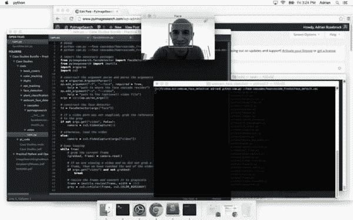
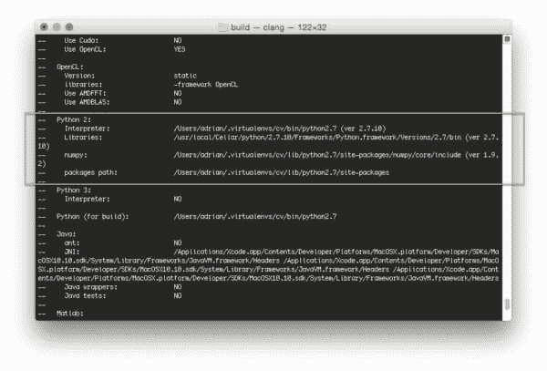
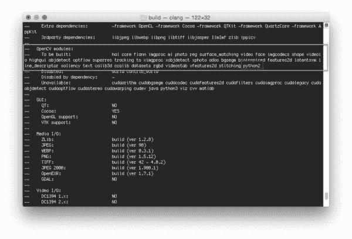
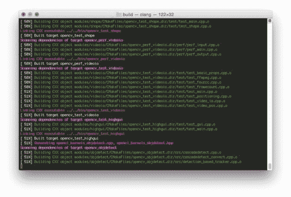
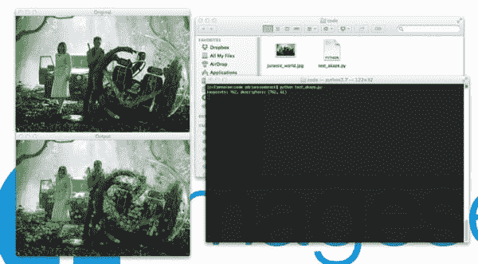

# 在 OSX 上安装 OpenCV 3.0 和 Python 2.7+

> 原文：<https://pyimagesearch.com/2015/06/15/install-opencv-3-0-and-python-2-7-on-osx/>

[](https://pyimagesearch.com/wp-content/uploads/2015/06/face_detection_opencv3.jpg)

正如我上周提到的， **[OpenCV 3.0 终于来了](https://pyimagesearch.com/2015/06/08/opencv-3-0-released-and-the-coming-changes-to-the-pyimagesearch-blog/)** ！

如果你一直在关注我的 [Twitter 流](https://twitter.com/PyImageSearch)，你可能已经注意到了一堆关于[在](https://twitter.com/PyImageSearch/status/606904690169683968) [OSX](https://twitter.com/PyImageSearch/status/606875855952822272) 和 [Ubuntu](https://twitter.com/PyImageSearch/status/606572807573479426) 上安装 T4【OpenCV 的推文(是的，我最近一直在发推文，但那只是因为我对 3.0 版本太兴奋了！)

为了庆祝 OpenCV 3.0，我决定发表一系列博客文章，详细介绍如何在 Python 2.7+ 和 *Python 3+* 上安装 OpenCV 3.0。

我们还将在各种平台上执行这些 Python 2.7 和 Python 3+安装，包括***【OSX】******Ubuntu***以及 ***树莓派*** 。

我相信你已经知道，OpenCV 从来就不是一个容易安装的库。这不像你能让`pip`或`easy_install`为你负重前行。在大多数情况下，你会拉下回购，安装先决条件，手工编译，并希望你的安装顺利进行。

有了 OpenCV 3.0，它并没有变得更容易——而且肯定有一些警告和陷阱需要你留意(例如 [opencv_contrib](https://github.com/itseez/opencv_contrib) 库——没有它，你将会错过一些重要的功能，例如 SIFT、SURF 等。)

但是别担心，我会掩护你的！只要继续关注 PyImageSearch 博客，我保证这些教程会让你很快开始使用 OpenCV 3.0。

我们将通过在*平台上安装带有 ***Python 2.7+** **绑定*** 的 3.0 版来开始我们的 OpenCV 3.0 安装节。*

 *如果你是 Ubuntu 或 Raspberry Pi 用户，请务必关注 PyImageSearch，因为我将发布 OpenCV 3.0 安装 Ubuntu 和 Raspberry Pi 的说明。

**在我们开始之前，有一个小注意:**虽然 OpenCV 3.0 确实兼容 Python 3+，但大多数计算机视觉开发人员仍在使用 Python 2.7(因为 OpenCV 2.4.X 只兼容 Python 2.7)。如果你是 Python 3 的用户，并且很想尝试一下绑定——*不要担心！*我将在以后的教程中介绍 OpenCV 3.0 和 Python 3+的安装。但是现在，让我们坚持我们所知道的，使用 Python 2.7。

**更新:**您现在正在阅读的教程涵盖了如何在 ***OSX 优山美地、*** 以下安装带有 Python 2.7 绑定的 OpenCV 3.0。如果你使用的是 OSX 优胜美地或者更早的版本，这个教程 ***仍然可以很好地工作*** ，但是如果你想在更新的 ***El Capitan 和 macOS Sierra*** 上安装 OpenCV，请使用[这个最新更新的教程](https://pyimagesearch.com/2016/11/28/macos-install-opencv-3-and-python-2-7/)。

# 如何在 OSX 上安装 OpenCV 3.0 和 Python 2.7+

这是我们 OpenCV 3.0 安装系列的第一个教程。在本教程中，我将详细介绍如何在 OSX 操作系统上安装 OpenCV 3.0 和 Python 2.7+—我将在以后的帖子中介绍 Python 3+。

让我们继续深入研究 OpenCV 3.0 和 Python 2.7+安装说明。

## 第一步:

我们需要做的第一步是安装 [Xcode](https://developer.apple.com/xcode/) ，这是一个 IDE 和软件开发工具的组合，用于在 OSX 和 iOS 平台上开发应用程序——我们大多数人已经安装了 Xcode。

但是如果你没有，你会想打开 *App Store* 应用程序并搜索 *Xcode* 。在那里，只需点击*获取*和*安装应用*(当出现提示时，你需要输入你的 Apple ID 用户名和密码):

[](https://pyimagesearch.com/wp-content/uploads/2015/06/xcode_install.jpg)

**Figure 1:** Installing Xcode on your OSX system.

## 第二步:

既然 Xcode 已经安装好了，我们需要安装 [Homebrew](http://brew.sh/) ，它的标签是*【OSX 缺失的软件包管理器】*(他们真的没有拿这个开玩笑)。可以把 Homebrew 看作(几乎)Ubuntu 的 apt-get 的等价物。

要安装家酿软件，只需进入[家酿软件网站](http://brew.sh/)，将*“安装家酿软件”*部分下的命令复制并粘贴到您的终端:

```py
$ cd ~
$ $ ruby -e "$(curl -fsSL https://raw.githubusercontent.com/Homebrew/install/master/install)"

```

既然已经安装了 Homebrew，您需要更新它并获取最新的包(即“formula”)定义。这些公式只是关于如何安装给定软件包或库的简单说明。

要更新 Homebrew，只需执行:

```py
$ brew update

```

## 第三步:

用系统 Python 作为你的主要解释器是不好的形式。如果您打算使用`virtualenv`和`virtualenvwrapper`(我们将会这样做)，这一点尤其正确。

让我们继续使用 Homebrew 来安装我们特定于用户的 Python 2.7 版本:

```py
$ brew install python

```

***注:*** 本教程将涵盖如何用 **Python 2.7** 安装和设置 **OpenCV 3.0** 。我将在本月晚些时候介绍如何用 **Python 3+** 安装 **OpenCV 3.0** 。

然而，在我们继续之前，我们需要更新我们的`~/.bash_profile`文件中的`PATH`,以表明我们想要在任何系统库或包之前使用自制包*。*这是绝对关键的一步，所以一定不要跳过！**

在您最喜欢的编辑器中打开您的 `~/.bash_profile`文件(如果它不存在，**创建它**，并将下面几行添加到文件中:

```py
# Homebrew
export PATH=/usr/local/bin:$PATH

```

从那里，重新加载您的`~./bash_profile`文件以确保已经进行了更改:

```py
$ source ~/.bash_profile

```

作为健全性检查，让我们确认我们使用的是 Python 的自制版本，而不是系统版本:

```py
$ which python
/usr/local/bin/python

```

如果你的`which python`的输出是`/usr/local/bin/python`，那么你确实在使用 Python 的自制版本。如果您的输出是`/usr/bin/python`，那么您仍然在使用 Python 的系统版本——您需要返回并确保您的`~/.bash_profile`文件被正确更新和重新加载。

***还是那句话，这是非常重要的一步，一定不要跳过！***

## 第四步:

好了，是时候正确安装和配置 [virtualenv](https://virtualenv.pypa.io/en/latest/) 和 [virtualenvwrapper](https://virtualenvwrapper.readthedocs.org/en/latest/) 了。这些包允许我们为我们正在进行的每个项目创建单独的 Python 环境。如果您的项目需要给定库的不同(或冲突)版本，这尤其有用。

**需要注意的是**在 OSX 上安装 OpenCV 3.0 和 Python 2.7+绝不需要`virtualenv`和`virtualenvwrapper`是**和*。然而， ***在做 Python 开发的时候，你真的应该使用这些包*** 。更干净。更容易维护。而 ***完全值得*** 前期的努力。***

无论如何，要安装`virtualenv`和`virtualenvwrapper`，只需执行以下命令:

```py
$ pip install virtualenv virtualenvwrapper

```

同样，我们需要通过追加以下两行来更新我们的`~/.bash_profile`文件:

```py
# Virtualenv/VirtualenvWrapper
source /usr/local/bin/virtualenvwrapper.sh

```

更新完`~/.bash_profile`文件后，我们需要重新加载它:

```py
$ source ~/.bash_profile

```

此时，`virtualenv`和`virtualenvwrapper`都已正确安装，因此我们可以创建我们的`cv`虚拟环境:

```py
$ mkvirtualenv cv

```

这个命令将创建一个新的 Python 环境，这个环境与我们的系统和自制 Python 安装完全隔离。虚拟环境是我们进行所有计算机视觉开发的地方(更不用说编译支持 Python 2.7+的 OpenCV 3.0)。

## 第五步:

现在我们可以开始安装一些 Python 包了。我们需要安装 [NumPy](http://www.numpy.org/) ，因为 OpenCV Python 绑定将图像表示为多维 NumPy 数组:

```py
$ pip install numpy

```

## 第六步:

到目前为止，我们主要关注于实际的*设置*和*配置*我们的开发环境来编译和安装 OpenCV — **这里是真正工作开始的地方**。

首先，我们将使用 brew 安装所需的开发人员工具，例如出色的 [CMake](http://www.cmake.org/) 实用程序:

```py
$ brew install cmake pkg-config

```

在这里，我们将安装必要的映像 I/O 包。这些软件包允许您加载各种图像文件格式，如 JPEG、PNG、TIFF 等。

```py
$ brew install jpeg libpng libtiff openexr

```

最后，让我们安装用于优化 OpenCV 中各种操作的库(如果我们愿意的话):

```py
$ brew install eigen tbb

```

## 第七步:

好了，我们的系统已经准备好了——现在是编译和安装 OpenCV 3.0 并支持 Python 2.7+的时候了。

我们要做的第一件事是将目录切换到我们的主目录，然后从 GitHub 下拉 [OpenCV，并检查`3.0.0`版本:](https://github.com/Itseez/opencv)

```py
$ cd ~
$ git clone https://github.com/Itseez/opencv.git
$ cd opencv
$ git checkout 3.0.0

```

***更新(2016 年 1 月 3 日):**你可以用任何当前版本替换`3.0.0`版本(目前是`3.1.0`)。请务必查看[OpenCV.org](http://opencv.org/category/news)了解最新发布的信息。*

不像以前版本的 OpenCV(本质上)是自包含的，我们还需要从 GitHub 下载额外的 [opencv_contrib repo](https://github.com/itseez/opencv_contrib) 。包含 OpenCV 额外模块的`opencv_contrib` repo，例如特征检测、局部不变描述符(SIFT、SURF 等。)、自然图像中的文本检测、行描述符等等。

```py
$ cd ~
$ git clone https://github.com/Itseez/opencv_contrib
$ cd opencv_contrib
$ git checkout 3.0.0

```

同样，确保你为`opencv_contrib`检查的 ***版本与你为上面的`opencv`检查的*** 版本相同，否则你可能会遇到编译错误。

**注意:**如果我们不想的话，我们没有*有*来取消`opencv_contrib`回购。OpenCV 没有它也可以编译和安装。但是如果你编译 OpenCV ***而没有*** `opencv_contrib`，要注意你将会错过一些非常重要的特性，这将变得非常明显，非常快，特别是如果你习惯于使用 OpenCV 的 2.4.X 版本。

## 第八步:

让我们通过创建`build`目录来设置 OpenCV 构建:

```py
$ cd ~/opencv
$ mkdir build
$ cd build

```

我们将使用 CMake 来配置我们的构建:

```py
$ cmake -D CMAKE_BUILD_TYPE=RELEASE -D CMAKE_INSTALL_PREFIX=/usr/local \
	-D PYTHON2_PACKAGES_PATH=~/.virtualenvs/cv/lib/python2.7/site-packages \
	-D PYTHON2_LIBRARY=/usr/local/Cellar/python/2.7.10/Frameworks/Python.framework/Versions/2.7/bin \
	-D PYTHON2_INCLUDE_DIR=/usr/local/Frameworks/Python.framework/Headers \
	-D INSTALL_C_EXAMPLES=ON -D INSTALL_PYTHON_EXAMPLES=ON \
	-D BUILD_EXAMPLES=ON \
	-D OPENCV_EXTRA_MODULES_PATH=~/opencv_contrib/modules ..

```

这里有一些非常重要的****选项我们提供给 CMake，所以让我们把它们分解一下:****

 *****   这个选项表明我们正在构建 OpenCV 的发布二进制文件。
*   `CMAKE_INSTALL_PREFIX`:OpenCV 将要安装的基础目录。
*   `PYTHON2_PACKAGES_PATH`:***显式*** 路径，指向我们的`site-packages`目录在我们的`cv`虚拟环境中的位置。
*   `PYTHON2_LIBRARY`:Python 的 Hombrew 安装路径。
*   `PYTHON2_INCLUDE_DIR`:我们用于编译的 Python 头文件的路径。
*   `INSTALL_C_EXAMPLES`:表示我们要在编译后安装 C/C++示例。
*   `INSTALL_PYTHON_EXAMPLES`:表示我们要安装复杂后的 Python 例子。
*   `BUILD_EXAMPLES`:一个标志，决定是否编译包含的 OpenCV 例子。
*   `OPENCV_EXTRA_MODULES_PATH` : ***这个选项极其重要***——这里我们提供了之前拉下的`opencv_contrib` repo 的路径，表明 OpenCV 也应该编译额外的模块。

***更新(2016 年 1 月 3 日):**为了构建 OpenCV `3.1.0`，需要在`cmake`命令中设置`-D INSTALL_C_EXAMPLES=OFF`(而不是`ON`)。OpenCV v3.1.0 CMake 构建脚本中有一个错误，如果您打开此开关，可能会导致错误。一旦您将此开关设置为 off，CMake 应该会顺利运行。*

咻，有很多选择。

相信我，在 Ubuntu 上安装 OpenCV 3.0 要容易得多，因为这些选项是通过 CMake 自动确定的。

但是当**使用 OSX 时，你需要*明确地*定义**、`PYTHON2_PACKAGES_PATH`、`PYTHON2_LIBRARY`和`PYTHON2_INCLUDE_DIR`。这确实很痛苦，但是如果不这样做，编译就会失败。

下面是我的 CMake 输出的一个例子:

[](https://pyimagesearch.com/wp-content/uploads/2015/06/py2_opencv3_osx_compile_py_options.jpg)

**Figure 2:** Before compiling OpenCV 3.0 on your OSX system, make sure that cmake has picked up the correct Python interpreter, library, numpy version, and packages path.

注意 Python 2 解释器、库、numpy 版本和包路径是如何被正确选择的。

您还需要确保`python2`在要构建的模块列表**中，就像这样:**

[](https://pyimagesearch.com/wp-content/uploads/2015/06/py2_opencv3_osx_compile_modules.jpg)

**Figure 2:** Ensuring the “python2” module is in our list of modules “To be built”.

如果它`python2`不在这个列表中，并且在**不可用**列表中，那么您需要返回到 CMake 步骤并确保您已经正确地提供了您的`PYTHON2_PACKAGES_PATH`、`PYTHON2_LIBRARY`和`PYTHON2_INCLUDE_DIR`。

现在 CMake 已经正确配置了构建，我们可以编译 OpenCV:

```py
$ make -j4

```

其中 *4* 可以用您处理器上的任意数量的内核来替换。下面是一个在我的系统上编译 OpenCV 的例子:

[](https://pyimagesearch.com/wp-content/uploads/2015/06/py2_opencv3_osx_compiling.jpg)

**Figure 3:** OpenCV 3.0 with Python 2.7+ support compiling on my system.

假设 OpenCV 编译无误，现在您可以将它安装在您的 OSX 系统上:

```py
$ make install

```

如果您得到一个与权限相关的错误消息(尽管这真的不应该发生)，您将需要以`sudo`的身份运行 install 命令:

```py
$ sudo make install

```

## 第九步:

假设您已经做到了这一步，让我们执行一个健全性检查并确保安装了 OpenCV:

```py
$ cd ~/.virtualenvs/cv/lib/python2.7/site-packages/
$ ls -l cv2.so 
-rwxr-xr-x  1 adrian  staff  2013052 Jun  5 15:20 cv2.so

```

果然，我们可以看到 OpenCV 已经安装在我们的`cv`虚拟环境的`site-packages`目录下了！

简单地说，您也可以在您的`build/lib`目录中找到`cv2.so`文件(这是您的 OpenCV 绑定)。

让我们通过启动 shell 并导入 OpenCV 来验证我们的安装:

```py
(cv)annalee:~ adrianrosebrock$ python
Python 2.7.8 (default, Jul 31 2014, 15:41:09) 
[GCC 4.2.1 Compatible Apple LLVM 5.1 (clang-503.0.40)] on darwin
Type "help", "copyright", "credits" or "license" for more information.
>>> import cv2
>>> cv2.__version__
'3.0.0'

```

那不是看起来很好吗？

恭喜你，你已经在你的 OSX 系统上安装了 OpenCV 3.0 和 Python 2.7+!

## 第十步:

做完这些工作后，让我们给我们的 OpenCV 3.0 安装一个测试驱动程序吧！

我在计算机视觉方面的大部分工作涉及图像搜索引擎，或者更正式地说，基于内容的图像检索。CBIR 的一个关键步骤是提取特征来量化和抽象地表示图像的内容。

OpenCV 3.0 有许多更新和更改，但我个人最喜欢的可能是 Alcantarilla 等人的 AKAZE 特性的实现— *[非线性尺度空间中加速特性的快速显式扩散](http://isit.u-clermont1.fr/~ab/Publications/Alcantarilla_etal_BMVC13.pdf)* 。

由于*侏罗纪世界*刚刚上映(而*侏罗纪公园*是我一直以来最喜欢的电影)，让我们来探索如何从下图中计算和提取赤泽特征:

[](https://pyimagesearch.com/wp-content/uploads/2015/06/jurassic_world.jpg)

**Figure 4:** Our *Jurassic World* test image that we are going to detect keypoints and extract features in using AKAZE.

打开一个新文件，将其命名为`test_akaze.py`，并插入以下代码:

```py
# import the necessary packages
from __future__ import print_function
import cv2

# load the image and convert it to grayscale
image = cv2.imread("jurassic_world.jpg")
gray = cv2.cvtColor(image, cv2.COLOR_BGR2GRAY)
cv2.imshow("Original", image)

# initialize the AKAZE descriptor, then detect keypoints and extract
# local invariant descriptors from the image
detector = cv2.AKAZE_create()
(kps, descs) = detector.detectAndCompute(gray, None)
print("keypoints: {}, descriptors: {}".format(len(kps), descs.shape))

# draw the keypoints and show the output image
cv2.drawKeypoints(image, kps, image, (0, 255, 0))
cv2.imshow("Output", image)
cv2.waitKey(0)

```

然后通过以下方式执行它:

```py
$ python test_akaze.py
keypoints: 762, descriptors: (762, 61)

```

假设您已经下载了`jurassic_world.jpg`图像并将其放在与`test_akaze.py`脚本相同的目录中，您应该会看到以下输出:

[](https://pyimagesearch.com/wp-content/uploads/2015/06/test_akaze.jpg)

**Figure 5:** We have successfully been able to detect keypoints, extract AKAZE features, and then draw the keypoints on our image using OpenCV 3.0 and Python 2.7+!

请注意我们是如何检测关键点并提取图像中的 AKAZE 特征的！

显然，我们需要做更多的工作来使用 AKAZE 特性构建一个有用的项目——但是这个例子证明了(1)我们的 OpenCV 3.0 安装正在工作，以及(2)我们能够使用 Python 2.7 来使用独特的 OpenCV 3.0 特性。

# 摘要

OpenCV 3.0 终于来了！为了庆祝 OpenCV 3.0 的发布，我们将在各种操作系统上为 ***Python 2.7+*** 和 ***Python 3+*** 执行一次 ***OpenCV 3.0 安装仪式*** ，这些操作系统包括****Ubuntu***和 ***树莓派！****

 *本文通过详细介绍如何在 OSX 操作系统上设置和安装 OpenCV 3.0 和 Python 2.7+拉开了安装节的序幕。

下周，我们将转移到 Ubuntu，并详细说明如何在 Ubuntu 14.04+上安装 OpenCV 3.0 和 Python 2.7(*提示:这比 OSX* *要容易得多)。*

无论如何，我希望你喜欢这篇文章，并发现它很有用！

请考虑通过在下表中输入您的电子邮件地址来订阅 PyImageSearch 时事通讯——随着新的 OpenCV 3.0 + Python 安装说明的发布，我将发送更新！******