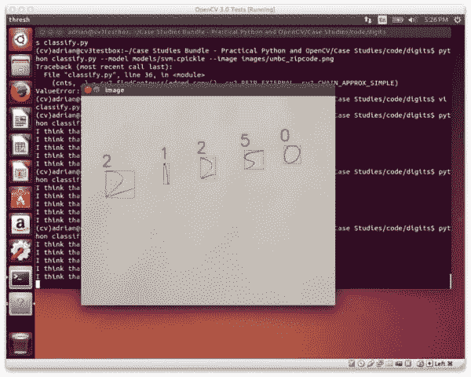
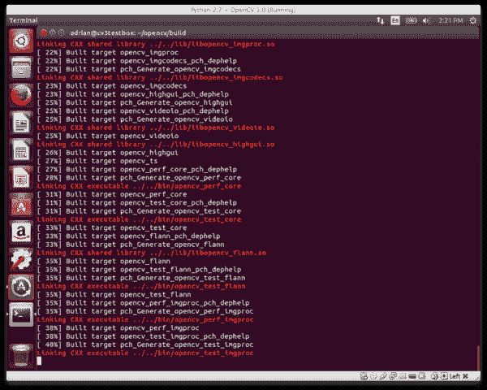
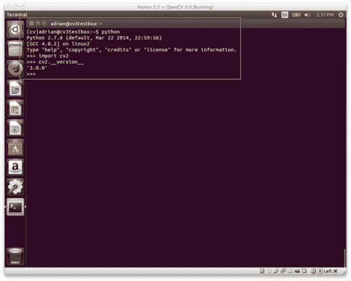
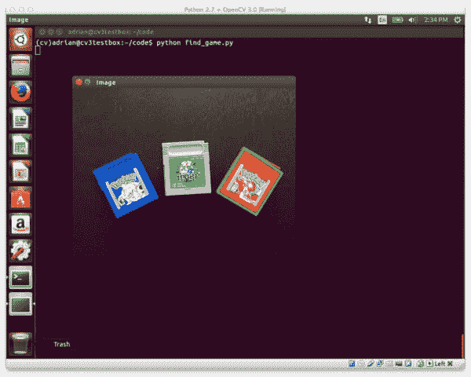

# 在 Ubuntu 上安装 OpenCV 3.0 和 Python 2.7+

> 原文：<https://pyimagesearch.com/2015/06/22/install-opencv-3-0-and-python-2-7-on-ubuntu/>

[](https://pyimagesearch.com/practical-python-opencv/?src=opencv3-install)

上周，我们通过详细介绍如何在 OSX 平台上安装 OpenCV 3.0 和 Python 2.7+开始了 OpenCV 3.0 安装节。

今天我们将继续 OpenCV 3.0 安装说明系列，转到 Ubuntu 操作系统。

在这篇文章的剩余部分，我将提供如何在 Ubuntu 上配置和安装 OpenCV 3.0 和 Python 2.7+的说明。我已经在 Ubuntu 14.04 上亲自测试了这些指令，但是它们应该可以在任何基于 Debian 的操作系统上运行。

**在我们开始之前有一个小提示:**是的，OpenCV 3.0 确实兼容 Python 3+。然而，Python 2.7+和 Python 3+之间的安装说明略有不同。为了让每篇文章保持独立且易于理解，我为 Python 2.7 和 Python 3+创建了单独的 OpenCV 3.0 安装教程。如果你想在你的 Ubuntu 系统上使用 OpenCV 3.0 和 Python 3+，请关注这个博客——我将在本月晚些时候发布 OpenCV 3.0 和 Python 3+的安装说明。但是目前，让我们继续使用 Python 2.7。

# 如何在 Ubuntu 上安装 OpenCV 3.0 和 Python 2.7+

**更新:**您现在正在阅读的教程涵盖了如何在 ***Ubuntu 14.04*** 上安装带有 Python 2.7+绑定的 OpenCV 3.0。本教程 ***仍然可以完美运行*** ，但是如果你想用 OpenCV 3.1 和 Python 2.7(或 Python 3.5)绑定在更新的 ***Ubuntu 16.04*** 上安装 OpenCV，请使用本最新更新的教程:

[https://pyimagesearch . com/2016/10/24/Ubuntu-16-04-how-to-install-opencv/](https://pyimagesearch.com/2016/10/24/ubuntu-16-04-how-to-install-opencv/)

* * *

这是 OpenCV 3.0 install-fest 系列的第二篇文章。上周我们报道了如何在 OSX 上安装 OpenCV 3.0 和 Python 2.7+。今天我们将执行相同的 OpenCV 3.0 和 Python 2.7 安装，只是在 Ubuntu 操作系统上。一般来说，你会发现在 Ubuntu 上安装 OpenCV 3.0 和 Python 2.7+比在 OSX 上安装容易得多。

## 第一步:

打开一个终端，更新`apt-get`包管理器，然后升级任何预安装的包:

```py
$ sudo apt-get update
$ sudo apt-get upgrade

```

## 第二步:

现在我们需要安装我们的开发工具:

```py
$ sudo apt-get install build-essential cmake git pkg-config

```

`pkg-config`可能已经安装了，但是为了以防万一，一定要包括它。我们将使用`git`从 GitHub 下载 OpenCV 库。`cmake`包用于配置我们的构建。

## 第三步:

OpenCV 需要能够从磁盘加载各种图像文件格式，包括 JPEG、PNG、TIFF 等。为了从磁盘加载这些图像格式，我们需要我们的图像 I/O 包:

```py
$ sudo apt-get install libjpeg8-dev libtiff4-dev libjasper-dev libpng12-dev

```

## 第四步:

此时，我们能够从磁盘上加载给定的图像。但是我们如何在屏幕上显示实际的图像呢？答案是 GTK 开发库，OpenCV 的`highgui`模块依赖它来引导图形用户界面(GUI):

```py
$ sudo apt-get install libgtk2.0-dev

```

## 第五步:

我们可以使用 OpenCV 加载图像，但是处理视频流和访问单个帧怎么办？我们在这里已经讨论过了:

```py
$ sudo apt-get install libavcodec-dev libavformat-dev libswscale-dev libv4l-dev

```

## 第六步:

安装用于优化 OpenCV 内部各种例程的库:

```py
$ sudo apt-get install libatlas-base-dev gfortran

```

## 第七步:

安装`pip`，一个 Python 包管理器:

```py
$ wget https://bootstrap.pypa.io/get-pip.py
$ sudo python get-pip.py

```

## 第八步:

安装[虚拟器](https://virtualenv.pypa.io/en/latest/)和[虚拟器包装器](https://virtualenvwrapper.readthedocs.org/en/latest/)。这两个包允许我们为我们正在进行的每个项目创建 ***单独的 Python 环境*** 。虽然安装`virtualenv`和`virtualenvwrapper`是 ***而不是* *要求*** 让 OpenCV 3.0 和 Python 2.7+在你的 Ubuntu 系统上运行， ***我强烈推荐它*** 并且本教程的其余部分 ***将假设你已经安装了它们！***

```py
$ sudo pip install virtualenv virtualenvwrapper
$ sudo rm -rf ~/.cache/pip

```

现在我们已经安装了`virtualenv`和`virtualenvwrapper`，我们需要更新我们的`~/.bashrc`文件:

```py
# virtualenv and virtualenvwrapper
export WORKON_HOME=$HOME/.virtualenvs
source /usr/local/bin/virtualenvwrapper.sh

```

这种快速更新将确保每次登录时都加载`virtualenv`和`virtualenvwrapper`。

要使对我们的`~/.bashrc`文件的更改生效，您可以(1)注销并重新登录，(2)关闭您当前的终端窗口并打开一个新窗口，或者最好是(3)重新加载您的`~/.bashrc`文件的内容:

```py
$ source ~/.bashrc

```

最后，我们可以创建我们的`cv`虚拟环境，在那里我们将进行计算机视觉开发和 OpenCV 3.0 + Python 2.7+安装:

```py
$ mkvirtualenv cv

```

## 第九步:

正如我上面提到的，本教程涵盖了如何安装 OpenCV 3.0 和 Python 2.7+(我将在本月晚些时候推出 OpenCV 3.0 + Python 3 教程)，因此我们需要安装我们的 Python 2.7 开发工具:

```py
$ sudo apt-get install python2.7-dev

```

由于 OpenCV 将图像表示为多维 NumPy 数组，我们最好将 [NumPy](http://www.numpy.org) 安装到我们的`cv`虚拟环境中。我们还安装了[imutils](https://github.com/jrosebr1/imutils)——我的便利功能包:

```py
$ pip install numpy
$ pip install imutils

```

## 第十步:

我们的环境现在已经设置好了——我们可以转到我们的主目录，[从 GitHub](https://github.com/Itseez/opencv) 中下载 OpenCV，并检查`3.0.0`版本:

```py
$ cd ~
$ git clone https://github.com/Itseez/opencv.git
$ cd opencv
$ git checkout 3.0.0

```

***更新(2016 年 1 月 3 日):**你可以用任何当前版本替换`3.0.0`版本(目前是`3.1.0`)。请务必查看[OpenCV.org](http://opencv.org/category/news)了解最新发布的信息。*

正如我上周提到的，我们也需要 [opencv_contrib 回购](https://github.com/itseez/opencv_contrib)。没有这个库，我们将无法访问标准的关键点检测器和局部不变描述符(如 SIFT、SURF 等)。)在 OpenCV 2.4.X 版本中可用。我们还将错过一些新的 OpenCV 3.0 特性，如自然图像中的文本检测:

```py
$ cd ~
$ git clone https://github.com/Itseez/opencv_contrib.git
$ cd opencv_contrib
$ git checkout 3.0.0

```

同样，确保你为`opencv_contrib`检查的 ***版本与你为上面的`opencv`检查的*** 版本相同，否则你可能会遇到编译错误。

设置构建的时间:

```py
$ cd ~/opencv
$ mkdir build
$ cd build
$ cmake -D CMAKE_BUILD_TYPE=RELEASE \
	-D CMAKE_INSTALL_PREFIX=/usr/local \
	-D INSTALL_C_EXAMPLES=ON \
	-D INSTALL_PYTHON_EXAMPLES=ON \
	-D OPENCV_EXTRA_MODULES_PATH=~/opencv_contrib/modules \
	-D BUILD_EXAMPLES=ON ..

```

***更新(2016 年 1 月 3 日):**为了构建 OpenCV `3.1.0`，需要在`cmake`命令中设置`-D INSTALL_C_EXAMPLES=OFF`(而不是`ON`)。OpenCV v3.1.0 CMake 构建脚本中有一个错误，如果您打开此开关，可能会导致错误。一旦您将此开关设置为 off，CMake 应该会顺利运行。*

请注意，与上周的相比，我们的 CMake 命令更加简洁，需要的手动调整也更少——这是因为 CMake 能够更好地自动调整我们的安装参数(至少与 OSX 相比)。

现在我们终于可以编译 OpenCV 了:

```py
$ make -j4

```

在这里，您可以用处理器上的可用内核数替换 *4* ，以加快编译速度。

这里有一个 OpenCV 3.0 在我的系统上编译的例子:

[](https://pyimagesearch.com/wp-content/uploads/2015/06/ubuntu_compiling_opencv3.png)

**Figure 1:** OpenCV 3.0 with Python 2.7+ support compiling on my Ubuntu 14.04 system.

假设 OpenCV 编译无误，您现在可以将它安装到您的 Ubuntu 系统上:

```py
$ sudo make install
$ sudo ldconfig

```

## 第十一步:

如果您已经顺利完成这一步，OpenCV 现在应该安装在`/usr/local/lib/python2.7/site-packages`中

然而，我们的`cv`虚拟环境位于我们的主目录中——因此，要在我们的`cv`环境中使用 OpenCV，我们首先需要将 OpenCV 符号链接到`cv`虚拟环境的`site-packages`目录中:

```py
$ cd ~/.virtualenvs/cv/lib/python2.7/site-packages/
$ ln -s /usr/local/lib/python2.7/site-packages/cv2.so cv2.so

```

## 第十二步:

**恭喜你！您已经在您的 Ubuntu 系统** **上成功安装了 OpenCV 3.0 与 Python 2.7+绑定！**

要确认您的安装，只需确保您在`cv`虚拟环境中，然后导入`cv2`:

```py
$ workon cv
$ python
>>> import cv2
>>> cv2.__version__
'3.0.0'

```

这里有一个在我自己的 Ubuntu 机器上演示 OpenCV 3.0 和 Python 2.7+安装的例子:

[](https://pyimagesearch.com/wp-content/uploads/2015/06/ubuntu_opencv3_installed.jpg)

**Figure 2:** OpenCV 3.0 with Python 2.7+ bindings has been successfully installed on Ubuntu!

## 第十三步:

现在 OpenCV 已经配置并安装好了，让我们构建一个快速的 Python 脚本来检测下面名为`games.jpg`的图片中的 ***红色*** 游戏卡带:

[](https://pyimagesearch.com/wp-content/uploads/2015/06/games.jpg)

**Figure 3:** Our goal is to detect the red game cartridge (on the *right*) in this image.

打开您最喜欢的编辑器，创建一个新文件，将其命名为`find_game.py`，并插入以下代码:

```py
# import the necessary packages
import numpy as np
import imutils
import cv2

# load the games image
image = cv2.imread("games.jpg")

# find the red color game in the image
upper = np.array([65, 65, 255])
lower = np.array([0, 0, 200])
mask = cv2.inRange(image, lower, upper)

# find contours in the masked image and keep the largest one
cnts = cv2.findContours(mask.copy(), cv2.RETR_EXTERNAL,
	cv2.CHAIN_APPROX_SIMPLE)
cnts = imutils.grab_contours(cnts)
c = max(cnts, key=cv2.contourArea)

# approximate the contour
peri = cv2.arcLength(c, True)
approx = cv2.approxPolyDP(c, 0.05 * peri, True)

# draw a green bounding box surrounding the red game
cv2.drawContours(image, [approx], -1, (0, 255, 0), 4)
cv2.imshow("Image", image)
cv2.waitKey(0)

```

你还需要 **[下载 games.jpg 图像](https://pyimagesearch.com/wp-content/uploads/2015/06/games.jpg)** ，并将其放在与你的`find_game.py`文件相同的目录下。下载完`games.jpg`文件后，您可以通过以下方式执行脚本:

```py
$ python find_game.py

```

假设您已经下载了`games.jpg`图像并将其放在与我们的`find_game.py`脚本相同的目录中，您应该会看到以下输出:

[](https://pyimagesearch.com/wp-content/uploads/2015/06/ubuntu_found_game.jpg)

**Figure 4:** We have successfully detected the red game cartridge in the image!

请注意，我们的脚本是如何成功地检测到图像右侧的红色游戏盒，然后在它周围绘制一个绿色的边界框。

显然，这不是世界上最令人兴奋的例子——但它证明了我们已经在 Ubuntu 系统上运行了 OpenCV 3.0 和 Python 2.7+绑定！

# 那么，下一步是什么？

恭喜你。你的 Ubuntu 系统上有一个全新的 OpenCV 安装——我敢肯定你只是渴望利用你的新安装来构建一些很棒的计算机视觉应用程序。

但是我也愿意打赌*你才刚刚开始学习计算机视觉和 OpenCV* ，你可能会对到底从哪里开始感到有点困惑和不知所措。

就我个人而言，我是**通过实例学习**的忠实粉丝，所以好的第一步是阅读[这篇关于使用 OpenCV 访问网络摄像头的博文](https://pyimagesearch.com/2015/12/21/increasing-webcam-fps-with-python-and-opencv/)。本教程详细介绍了*你需要采取的准确步骤*(1)从你的网络摄像头捕捉照片和(2)访问原始视频流。

如果你真的对提升你的计算机视觉技能感兴趣，你绝对应该看看我的书，《实用 Python 和 OpenCV +案例研究》 。我的书不仅*涵盖了计算机视觉和图像处理的基础知识*，还教你如何解决现实世界的计算机视觉问题包括 ***图像和视频流中的人脸检测******视频中的物体跟踪******手写识别。***

[](https://pyimagesearch.com/practical-python-opencv/)

所以，让我们好好利用你在 Ubuntu 系统上新安装的 OpenCV—[***只需点击这里***](https://pyimagesearch.com/practical-python-opencv/) ***了解更多关于你可以使用新的 OpenCV 安装+实用 Python 和 OpenCV 解决的真实项目。***

# 摘要

为了庆祝 OpenCV 3.0 的发布，我正在研究 OpenCV 3.0 和 Python 2.7/Python 3.4 在***【OSX】******【Ubuntu】***和 ***树莓派*** 上的安装说明。

上周我报道了如何在 OSX 上安装 OpenCV 3.0 和 Python 2.7+。

今天我们介绍了如何在 Ubuntu 上安装 OpenCV 3.0 和 Python 2.7 绑定。我已经亲自在我自己的 Ubuntu 14.04 机器上测试了这些指令，但是它们应该可以在任何基于 Debian 的系统上运行。

下周我们将继续安装活动，并返回 OSX——这次安装 OpenCV 3.0 和 Python 3！

这将是我们第一次在 PyImageSearch 博客上使用 Python 3，所以你不会想错过它的！

请考虑通过在下表中输入您的电子邮件地址来订阅 PyImageSearch 时事通讯。当我们在 OpenCV 安装节上工作时，我会在每个新的 OpenCV 3.0 + Python 安装教程发布时发送更新！