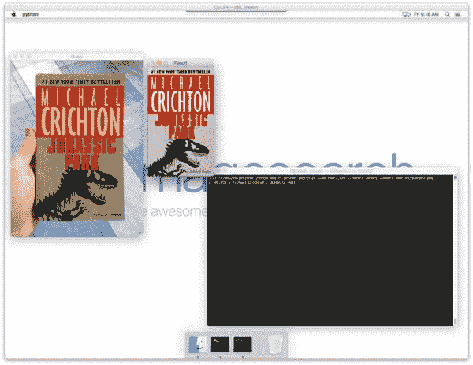
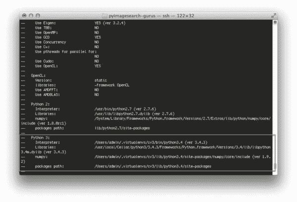

# 在 OSX 上安装 OpenCV 3.0 和 Python 3.4+

> 原文：<https://pyimagesearch.com/2015/06/29/install-opencv-3-0-and-python-3-4-on-osx/>

[](https://pyimagesearch.com/practical-python-opencv/?src=opencv3-install)

两周前，我们以一个关于如何在 OSXT3 上安装 **[OpenCV 3.0 和 Python 2.7 的教程开始了 OpenCV 3.0 安装节。](https://pyimagesearch.com/2015/06/15/install-opencv-3-0-and-python-2-7-on-osx/)**

今天我又带着另一个 OSX 教程回来了——*只是这次我们要用 **Python 3.4+绑定来编译 OpenCV 3.0！***

没错！随着 OpenCV 3.0 黄金版的发布，我们正式拥有了 Python 3 支持。这是一个漫长的过程——在 Python 2.7 领域停滞不前多年后，启动 Python 3 shell 并成为 Python 编程语言未来的一部分是一种很棒的感觉。

在本文的剩余部分，我将向您展示如何使用 Python 3.4+绑定编译和安装 OpenCV 3.0。

**更新:**您现在正在阅读的教程涵盖了如何在 ***OSX 优山美地、*** 以下安装带有 Python 3.4+绑定的 OpenCV 3.0。如果你使用的是 OSX 优胜美地或者更早的版本，这个教程 ***仍然可以很好地工作*** ，但是如果你想在更新的 ***El Capitan 和 macOS Sierra*** 上安装 OpenCV，请使用[这个最新更新的教程](https://pyimagesearch.com/2016/12/05/macos-install-opencv-3-and-python-3-5/)。

# 如何在 OSX 上安装 OpenCV 3.0 和 Python 3.4+

正如我在本文开头提到的，我已经在之前的文章中介绍了如何在 OSX 上安装 OpenCV 3.0 和 Python 2.7 绑定。您会注意到，大多数步骤非常相似(在某些情况下，完全相同)，所以我删减了每个步骤的解释以减少冗余。如果你在寻找每个步骤和命令的更多细节，请查看[之前的帖子](https://pyimagesearch.com/2015/06/15/install-opencv-3-0-and-python-2-7-on-osx/)，我会在那里做更详细的介绍。

也就是说，让我们开始在 OSX 上安装带有 Python 3.4 绑定的 OpenCV 3.0。

## 步骤 1:安装 Xcode

在你的系统上编译 OpenCV 之前，你首先需要安装 [Xcode](https://developer.apple.com/xcode/) ，这是苹果公司为 OSX 和 iOS 开发提供的一套开发工具。安装 Xcode 非常简单，可以通过使用 *App Store* 应用程序来完成。只需搜索 *Xcode* ，点击*获取*，然后是*安装 App* ，你的下载就开始了:

[](https://pyimagesearch.com/wp-content/uploads/2015/06/py3_opencv3_osx_xcode.jpg)

**Figure 1:** Installing Xcode on OSX.

下载本身相当大(> 2gb)，而且苹果的内容交付服务器也不是世界上最快的，所以在 Xcode 安装期间，你可能会想出去走走，呼吸点新鲜空气。

## 步骤 2:安装自制软件

家酿是 OSX 的软件包管理器，类似于 Ubuntu 的 apt-get。我们将使用 Homebrew 来帮助我们安装和管理 OpenCV 的一些先决条件和依赖项。要安装 Homebrew，只需启动终端，复制并粘贴以下命令:

```py
$ cd ~
$ ruby -e "$(curl -fsSL https://raw.githubusercontent.com/Homebrew/install/master/install)"
$ brew update

```

## 步骤 3:安装 Python 3

OSX 没有附带 Python 3 的副本，所以我们需要通过自制软件安装它:

```py
$ brew install python3
$ brew linkapps

```

我们还需要更新`~/.bash_profile`中的`PATH`(如果文件不存在，创建它)以表明自制软件包应该在任何系统软件包之前使用:

```py
# Homebrew
export PATH=/usr/local/bin:$PATH

```

让我们重新加载我们的`~/.bash_profile`以确保更改已经生效:

```py
$ source ~/.bash_profile

```

最后，让我们确认 Python 3.4 已经安装:

```py
$ which python3
/usr/local/bin/python
$ python3 --version
Python 3.4.3

```

## 步骤 4:设置我们的 Python 3.4 环境

现在我们可以专注于为 OpenCV 编译设置 Python 3.4 环境了。

使用 [virtualenv](https://virtualenv.pypa.io/en/latest/) 和 [virtualenvwrapper](https://virtualenvwrapper.readthedocs.org/en/latest/) 绝对是*而不是*在你的 OSX 机器上安装 OpenCV 的一个要求， ***但是我强烈推荐使用* *这些包！*** 能够为每个项目创建单独的 Python 环境非常有用，*所以一定要考虑使用它们！*

无论如何，让我们安装`virtualenv`和`virtualenvwrapper`:

```py
$ pip3 install virtualenv virtualenvwrapper

```

记下`pip3`命令。我使用`pip3`来表示`virtualenv`和`virtualenvwrapper`包应该为 Python 3.4、*而不是* Python 2.7 安装(尽管这些包可以用于这两个 Python 版本)。

我们还需要再次更新我们的`~/.bash_profile`文件，在文件底部添加以下几行:

```py
# Virtualenv/VirtualenvWrapper
export VIRTUALENVWRAPPER_PYTHON=/usr/local/bin/python3
source /usr/local/bin/virtualenvwrapper.sh

```

接着是重装我们的`.bash_profile`:

```py
$ source ~/.bash_profile

```

现在我们有进展了。让我们创建我们的`cv3`虚拟环境，OpenCV 将使用它来编译我们的 Python 3.4 绑定。这个虚拟环境还将包含我们想要存储的用于计算机视觉和图像处理开发的任何额外的包:

```py
$ mkvirtualenv cv3 -p python3

```

注意我是如何明确地指定`-p python3`到*的*表明我们想要使用 Python 3.4 二进制文件创建一个虚拟环境。

在执行完`mkvirtualenv`命令后，我们进入了我们的`cv3`虚拟环境。如果你想再次访问这个虚拟环境(正如我将在本文底部演示的)，只需使用`workon`命令:

```py
$ workon cv3

```

你将被放回我们的`cv3`虚拟环境。

就 Python 的先决条件而言，我们需要的只是 NumPy:

```py
$ pip install numpy

```

注意我在这里是如何使用`pip`而不是`pip3`的——因为我们是在`cv3`虚拟环境中，所以`virtualenv`和`virtualenvwrapper`脚本足够聪明，知道应该使用与`cv3`环境相关联的`pip`,所以没有必要显式使用`pip3`。

## 步骤 5:安装 OpenCV 先决条件

为了从源代码编译 OpenCV，我们需要一些开发工具:

```py
$ brew install cmake pkg-config

```

以及一些处理从磁盘读取各种图像格式的包:

```py
$ brew install jpeg libpng libtiff openexr

```

和另一对优化 OpenCV 内部各种例程的包:

```py
$ brew install eigen tbb

```

## 步骤 6:编译 OpenCV

编译 OpenCV 的第一步是从 GitHub 中抓取[源代码，并检查 3.0.0 版本:](https://github.com/Itseez/opencv)

```py
$ cd ~
$ git clone https://github.com/Itseez/opencv.git
$ cd opencv
$ git checkout 3.0.0

```

***更新(2016 年 1 月 3 日):**你可以用任何当前版本替换`3.0.0`版本(目前是`3.1.0`)。请务必查看[OpenCV.org](http://opencv.org/category/news)了解最新发布的信息。*

我们还将获取包含 opencv 额外模块的 [opencv_contrib](https://github.com/itseez/opencv_contrib) 包，例如特征检测和局部不变描述符(SIFT、SURF 等)。)、文本检测等等:

```py
$ cd ~
$ git clone https://github.com/Itseez/opencv_contrib
$ cd opencv_contrib
$ git checkout 3.0.0

```

同样，确保你为`opencv_contrib`检查的 ***版本与你为上面的`opencv`检查的*** 版本相同，否则你可能会遇到编译错误。

既然存储库已经被删除，我们可以创建`build`目录:

```py
$ cd ~/opencv
$ mkdir build
$ cd build

```

并使用 CMake 来配置构建本身:

```py
$ cmake -D CMAKE_BUILD_TYPE=RELEASE \
	-D CMAKE_INSTALL_PREFIX=/usr/local \
	-D PYTHON3_PACKAGES_PATH=~/.virtualenvs/cv3/lib/python3.4/site-packages \
	-D PYTHON3_LIBRARY=/usr/local/Cellar/python3/3.4.3/Frameworks/Python.framework/Versions/3.4/lib/libpython3.4m.dylib \
	-D PYTHON3_INCLUDE_DIR=/usr/local/Cellar/python3/3.4.3/Frameworks/Python.framework/Versions/3.4/include/python3.4m \
	-D INSTALL_C_EXAMPLES=ON \
	-D INSTALL_PYTHON_EXAMPLES=ON \
	-D BUILD_EXAMPLES=ON \
	-D BUILD_opencv_python3=ON \
	-D OPENCV_EXTRA_MODULES_PATH=~/opencv_contrib/modules ..

```

***更新(2016 年 1 月 3 日):**为了构建 OpenCV `3.1.0`，需要在`cmake`命令中设置`-D INSTALL_C_EXAMPLES=OFF`(而不是`ON`)。OpenCV v3.1.0 CMake 构建脚本中有一个错误，如果您打开此开关，可能会导致错误。一旦您将此开关设置为 off，CMake 应该会顺利运行。*

在我之前关于在 OSX 上安装带有 Python 2.7 绑定的 [OpenCV 3.0 的帖子中，我已经解释了这些选项中的每一个，所以如果你想要每个参数的详细解释，请参考那个帖子。](https://pyimagesearch.com/2015/06/15/install-opencv-3-0-and-python-2-7-on-osx/)

这里的要点是，您希望检查 CMake 的输出，以确保您的 Python 3 绑定将针对通过 Homebrew 和我们的`cv3`虚拟环境安装的 Python 3.4 解释器进行编译:

[](https://pyimagesearch.com/wp-content/uploads/2015/06/py3_opencv3_osx_compile_py_options.jpg)

**Figure 2:** CMake has picked up the correct Python 3 interpreter, libraries, and site-packages path.

注意我们的 Python 3 解释器、库、numpy 版本和包路径是如何被 CMake 选中的。

另一个要做的检查是`python3`在要构建的模块**列表中:**

[](https://pyimagesearch.com/wp-content/uploads/2015/06/py3_opencv3_osx_compile_modules.jpg)

**Figure 3:** A good sanity check to perform prior to kicking off the compile process is to ensure that
“python3” is in the list of modules to be compiled.

如果您在要构建的模块列表中没有看到`python3`，并且在**不可用**列表中，那么您需要返回到 CMake 步骤并确保到您的`PYTHON3_PACKAGES_PATH`、`PYTHON3_LIBRARY`和`PYTHON3_INCLUDE_DIR`的路径是正确的。同样，我已经在我之前关于在 OSX 上安装 OpenCV 3.0 的[帖子](https://pyimagesearch.com/2015/06/15/install-opencv-3-0-and-python-2-7-on-osx/)中提供了每个选项的详细解释，所以请参考那里的更多信息。

假设 CMake 已经返回，没有任何错误，我们现在可以编译 OpenCV:

```py
$ make -j4

```

为了更快地编译，用系统上可用的内核数量替换 *4* 。

编译时间本身不应该超过 5-10 分钟，所以在 OpenCV 安装时喝杯咖啡，当你回来时(当然，假设 OpenCV 编译没有错误)，你可以安装它:

```py
$ make install

```

如果出于某种原因，您得到一个与安装 OpenCV 的权限无效相关的错误，只需在命令前面加上`sudo`:

```py
$ sudo make install

```

## 步骤 7:验证安装

此时，您的系统上应该安装了 OpenCV 3.0 和 Python 3.4+绑定。您可以通过将目录更改为我们的`cv3`虚拟环境所在的位置并检查`cv2.so`文件来验证这一点:

```py
$ cd ~/.virtualenvs/cv3/lib/python3.4/site-packages/
$ ls -l cv2.so
-rwxr-xr-x  1 admin  _developer  2013028 Jun 19 06:11 cv2.so

```

毫无疑问，我们的 OpenCV 绑定位于虚拟环境的目录中。

***注意:**您也可以在您的`build/lib`目录中找到`cv2.so`文件(同样是您的 OpenCV 绑定)。`make install`脚本获取我们的`cv2.so`文件，并将其复制到我们的目标`site-packages`目录。*

最后，让我们打开一个 shell 并导入 OpenCV 来验证我们的安装:

```py
(cv3)74-80-245-164:~ admin$ python3
Python 3.4.3 (default, Jun 19 2015, 05:23:16) 
[GCC 4.2.1 Compatible Apple LLVM 6.1.0 (clang-602.0.53)] on darwin
Type "help", "copyright", "credits" or "license" for more information.
>>> import cv2
>>> cv2.__version__
'3.0.0'

```

祝贺你，你现在已经在你的 OSX 系统上安装了 OpenCV 3.0 和 Python 3.4+绑定！

# 摘要

在本教程中，我们学习了如何使用 CMake 实用程序手动编译和安装 OpenCV 3.0 和 Python 3.4+绑定(如果您正在寻找安装 OpenCV 3.0 和 Python 2.7+绑定的教程，[请参见我之前的帖子](https://pyimagesearch.com/2015/06/15/install-opencv-3-0-and-python-2-7-on-osx/))。当然，手工编译并不是最有趣的体验——但是它确实给了我们对安装的完全控制权。

幸运的是，就在一周前，一个 OpenCV 3.0 安装脚本在[科学论坛](https://github.com/Homebrew/homebrew-science/blob/master/opencv3.rb)中为自制软件创建。在以后的文章中，我将展示如何利用自制软件来大大简化编译和安装过程，让我们的生活变得更加轻松。

尽管如此，我仍然建议你尝试手动安装 OpenCV 3.0 自制软件很好，但你永远不会像使用 CMake 那样获得完全的控制。

为了在 Homebrew + OpenCV 3.0 安装帖子发布时得到通知，请在下面的表格中输入您的电子邮件地址，我会在教程发布时通知您。