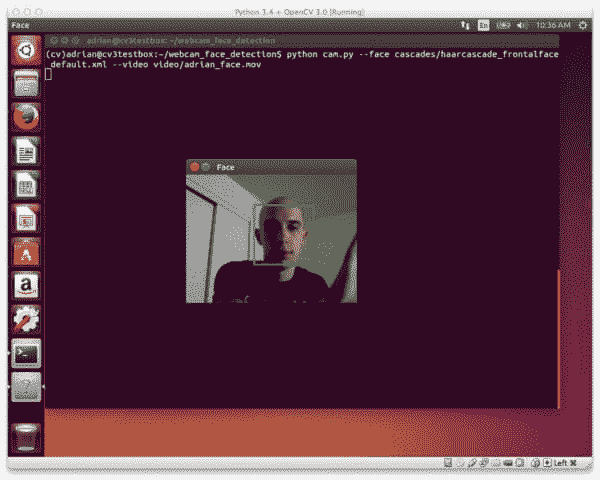
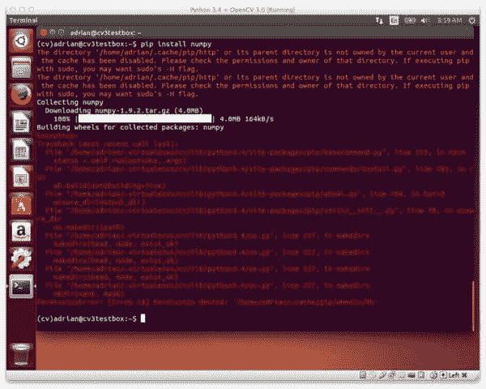
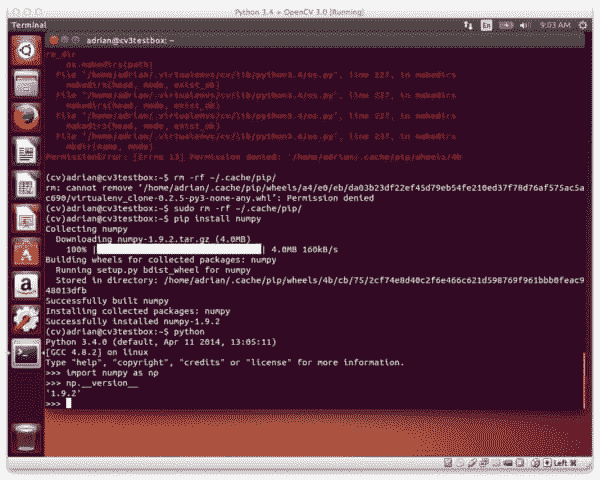
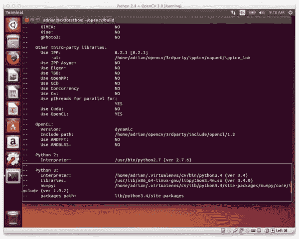
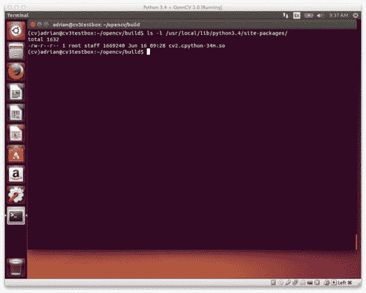
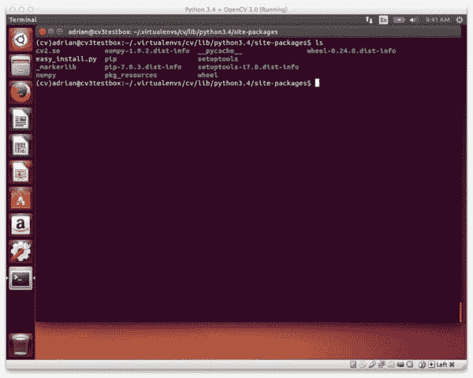
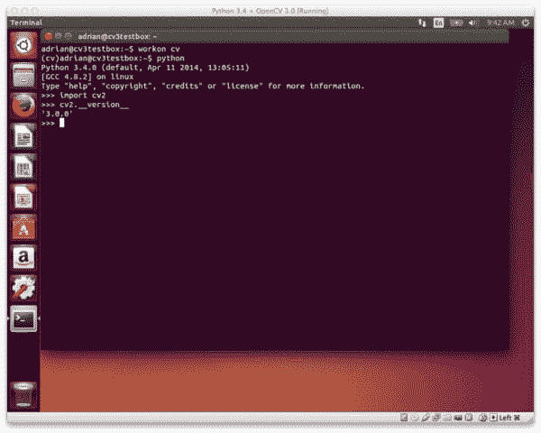

# 在 Ubuntu 上安装 OpenCV 3.0 和 Python 3.4+

> 原文：<https://pyimagesearch.com/2015/07/20/install-opencv-3-0-and-python-3-4-on-ubuntu/>

[](https://pyimagesearch.com/practical-python-opencv/?src=opencv3-install)

几周前，我提供了一步一步的安装说明，让[在你的 Ubuntu 机器](https://pyimagesearch.com/2015/06/22/install-opencv-3-0-and-python-2-7-on-ubuntu/)上安装 OpenCV 3.0 和 Python 2.7+。

然而，迁移到 OpenCV 3.0 的巨大好处之一是新的 Python 3.4+支持。在 OpenCV 之前的 2.4.X 版本中，只支持 Python 2.7+版本。但是现在，我们终于可以在我们的新项目中利用 Python 3.4+了。

在这篇博文的剩余部分，我将详细介绍如何在你的 Ubuntu 14.04+系统上安装 OpenCV 3.0 和 Python 3.4+绑定。如果您遵循了上一篇教程，您会注意到许多步骤是相同的(或者至少非常相似)，所以我对这篇文章进行了压缩。也就是说，当我们在本教程后面开始使用 CMake 时，一定要特别注意，以确保您正在编译支持 Python 3.4+的 OpenCV 3.0！

# 如何在 Ubuntu 上安装 OpenCV 3.0 和 Python 3.4+

**更新:**您现在正在阅读的教程涵盖了如何在 ***Ubuntu 14.04*** 上安装带有 Python 3.4+绑定的 OpenCV 3.0。本教程 ***仍然可以完美运行*** ，但是如果你想在 OpenCV 3.1 和 Python 3.5+的较新 ***Ubuntu 16.04*** 上安装 OpenCV，请使用本最新更新的教程:

[https://pyimagesearch . com/2016/10/24/Ubuntu-16-04-how-to-install-opencv/](https://pyimagesearch.com/2016/10/24/ubuntu-16-04-how-to-install-opencv/)

* * *

几周前我报道了如何在 Ubuntu 上安装 [OpenCV 3.0 和 Python 2.7+，虽然这是一个很棒的教程(因为我们中的许多人仍在使用 Python 2.7)，但我认为它确实错过了 OpenCV 3.0 的一个主要方面——***Python 3.4+支持！***](https://pyimagesearch.com/2015/06/22/install-opencv-3-0-and-python-2-7-on-ubuntu/)

没错，直到 3.0 版本，OpenCV *只提供了到 Python 2.7 编程语言的绑定。*

对我们大多数人来说，这没什么。作为科学开发人员和研究人员，一个非常标准的假设是，我们将被隔离到 Python 2.7。

然而，这种情况正在开始改变。重要的科学库，如 NumPy、SciPy 和 scikit-learn，现在都提供 Python 3 支持。而现在 OpenCV 3.0 也加入了这个行列！

总的来说，你会发现本教程与上一篇关于在 Ubuntu 上安装 OpenCV 3.0 和 Python2.7 的教程非常相似，所以我将根据需要浓缩我对每个步骤的解释。如果你想完整解释每一步，请参考以前的 OpenCV 3.0 文章。否则，只需跟随本教程，不到 10 分钟，你就可以在你的 Ubuntu 系统上安装 OpenCV 3.0 和 Python 3.4+。

## 步骤 1:安装必备组件

升级任何预安装的软件包:

```py
$ sudo apt-get update
$ sudo apt-get upgrade

```

安装用于编译 OpenCV 3.0 的开发工具:

```py
$ sudo apt-get install build-essential cmake git pkg-config

```

安装用于从磁盘读取各种*图像格式*的库和包；

```py
$ sudo apt-get install libjpeg8-dev libtiff4-dev libjasper-dev libpng12-dev

```

安装几个用来从磁盘读取*视频格式*的库:

```py
$ sudo apt-get install libavcodec-dev libavformat-dev libswscale-dev libv4l-dev

```

安装 GTK，这样我们就可以使用 OpenCV 的 GUI 特性:

```py
$ sudo apt-get install libgtk2.0-dev

```

安装用于优化 OpenCV 内部各种功能的软件包，例如矩阵运算:

```py
$ sudo apt-get install libatlas-base-dev gfortran

```

## 步骤 2:设置 Python(第 1 部分)

让我们来看看为 Python 3 安装的 Python 包管理器`pip`:

```py
$ wget https://bootstrap.pypa.io/get-pip.py
$ sudo python3 get-pip.py

```

注意我在安装`pip`的时候特意注明了`python3`**。如果你不提供`python3`，那么 Ubuntu 将试图在你的 Python 2.7 发行版上安装`pip`，这不是我们想要的。**

好吧，我之前在 PyImageSearch 博客上说过，我会再看一遍。您应该真正使用虚拟环境进行 Python 开发！

在本教程中，我们将使用 [virtualenv](https://virtualenv.pypa.io/en/latest/) 和 [virtualenvwrapper](https://virtualenvwrapper.readthedocs.org/en/latest/) 。这些包允许我们创建 ***完全分离和独立的 Python 环境*** ，，确保我们不会破坏我们的系统 Python 安装(更重要的是，这样我们可以为我们的每个项目拥有一个单独的 Python 环境)。

让我们使用新的`pip3`安装来设置`virtualenv`和`virtualenvwrapper`:

```py
$ sudo pip3 install virtualenv virtualenvwrapper

```

同样，注意我是如何指定`pip3`而不仅仅是`pip`的——我只是清楚地表明这些包应该为 Python 3.4 安装。

现在我们可以更新我们的`~/.bashrc`文件(放在文件的底部):

```py
# virtualenv and virtualenvwrapper
export VIRTUALENVWRAPPER_PYTHON=/usr/bin/python3
export WORKON_HOME=$HOME/.virtualenvs
source /usr/local/bin/virtualenvwrapper.sh

```

注意我是如何将`VIRTUALENVWRAPPER_PYTHON`指向我们的 Python 3 二进制文件在 Ubuntu 系统上的位置的。

要使这些更改生效，您可以打开一个新的终端或重新加载您的`~/.bashrc`文件:

```py
$ source ~/.bashrc

```

最后，让我们创建我们的`cv`虚拟环境，在这里我们将使用 OpenCV 3.0 和 Python 3.4 进行计算机视觉开发:

```py
$ mkvirtualenv cv

```

## 步骤 2:设置 Python(第 2 部分)

我们已经完成了一半的 Python 设置。但是为了用 Python 3.4+绑定编译 OpenCV 3.0，我们需要安装 Python 3.4+头文件和开发文件:

```py
$ sudo apt-get install python3.4-dev

```

OpenCV 将图像表示为 NumPy 数组，因此我们需要将 [NumPy](http://www.numpy.org/) 安装到我们的`cv`虚拟环境中:

```py
$ pip install numpy

```

如果你最终得到一个与 pip 的`.cache`目录相关的*权限被拒绝*错误，就像这样:

[](https://pyimagesearch.com/wp-content/uploads/2015/06/ubuntu_pip_permission_error.jpg)

**Figure 1:** If you get a “Permission Denied” error, no worries — that’s an easy fix!

然后只需删除缓存目录并重新运行 NumPy install 命令:

```py
$ sudo rm -rf ~/.cache/pip/
$ pip install numpy

```

现在您应该有一个很好的 NumPy 的干净安装了:

[](https://pyimagesearch.com/wp-content/uploads/2015/06/ubuntu_numpy_installed.jpg)

**Figure 2:** Deleting the .cache/pip directory and re-running pip install numpy will take care of the problem.

## 步骤 3:使用 Python 3.4+绑定构建并安装 OpenCV 3.0

好了，我们的系统已经设置好了！让我们[从 GitHub](https://github.com/Itseez/opencv) 下载 OpenCV 并检查`3.0.0`版本:

```py
$ cd ~
$ git clone https://github.com/Itseez/opencv.git
$ cd opencv
$ git checkout 3.0.0

```

***更新(2016 年 1 月 3 日):**你可以用任何当前版本替换`3.0.0`版本(目前是`3.1.0`)。请务必查看[OpenCV.org](http://opencv.org/category/news)了解最新发布的信息。*

我们还需要获取 [opencv_contrib](https://github.com/itseez/opencv_contrib) 回购(关于我们为什么需要`opencv_contrib`的更多信息，请看我之前的[OpenCV 3.0 Ubuntu 安装帖子](https://pyimagesearch.com/2015/06/22/install-opencv-3-0-and-python-2-7-on-ubuntu/)):

```py
$ cd ~
$ git clone https://github.com/Itseez/opencv_contrib.git
$ cd opencv_contrib
$ git checkout 3.0.0

```

同样，确保你为`opencv_contrib`检查的 ***版本与你为上面的`opencv`检查的*** 版本相同，否则你可能会遇到编译错误。

设置构件的时间:

```py
$ cd ~/opencv
$ mkdir build
$ cd build
$ cmake -D CMAKE_BUILD_TYPE=RELEASE \
	-D CMAKE_INSTALL_PREFIX=/usr/local \
	-D INSTALL_C_EXAMPLES=ON \
	-D INSTALL_PYTHON_EXAMPLES=ON \
	-D OPENCV_EXTRA_MODULES_PATH=~/opencv_contrib/modules \
	-D BUILD_EXAMPLES=ON ..

```

***更新(2016 年 1 月 3 日):**为了构建 OpenCV `3.1.0`，需要在`cmake`命令中设置`-D INSTALL_C_EXAMPLES=OFF`(而不是`ON`)。OpenCV v3.1.0 CMake 构建脚本中有一个错误，如果您打开此开关，可能会导致错误。一旦您将此开关设置为 off，CMake 应该会顺利运行。*

让我们花点时间来看看我的 CMake 输出:

[](https://pyimagesearch.com/wp-content/uploads/2015/06/ubuntu_cv3py3_cmake_output.jpg)

**Figure 3:** It’s a good idea to inspect the output of CMake to ensure the proper Python 3 interpreter, libraries, etc. have been picked up.

请注意 CMake 是如何获得我们的 Python 3 解释器的！这表明 OpenCV 3.0 将使用我们的 Python 3.4+绑定进行编译。

说到编译，让我们开始 OpenCV 编译过程:

```py
$ make -j4

```

其中 *4* 可以替换为处理器上可用内核的数量，以加快编译时间。

假设 OpenCV 3.0 编译无误，您现在可以将它安装到您的系统上:

```py
$ sudo make install
$ sudo ldconfig

```

## 第四步:Sym-link OpenCV 3.0

如果你已经到了这一步，OpenCV 3.0 现在应该已经安装在`/usr/local/lib/python3.4/site-packages/`了

[](https://pyimagesearch.com/wp-content/uploads/2015/06/ubuntu_cv3py3_compiled.jpg)

**Figure 4:** The Python 3.4+ OpenCV 3.0 bindings are now installed in /usr/local/lib/python3.4/site-packages/

这里，我们的 OpenCV 绑定存储在名称`cv2.cpython-34m.so`下

务必记下这个文件名，几秒钟后你就会用到它！

然而，为了在我们的`cv`虚拟环境中使用 OpenCV 3.0，我们首先需要将 OpenCV 符号链接到`cv`环境的`site-packages`目录中，如下所示:

```py
$ cd ~/.virtualenvs/cv/lib/python3.4/site-packages/
$ ln -s /usr/local/lib/python3.4/site-packages/cv2.cpython-34m.so cv2.so

```

注意我是如何将名称从`cv2.cpython-34m.so`改为`cv2.so`的——这样 Python 可以使用名称`cv2`导入我们的 OpenCV 绑定。

所以现在当你列出`cv`虚拟环境的`site-packages`目录的内容时，你会看到我们的 OpenCV 3.0 绑定(`cv2.so`文件):

[](https://pyimagesearch.com/wp-content/uploads/2015/06/ubuntu_cv3py3_symlinked.jpg)

**Figure 5:** In order to access the OpenCV 3.0 bindings from our Python 3.4+ interpreter, we need to sym-link the cv2.so file into our site-packages directory.

***再次强调，t** **his 是非常重要的一步，所以一定要确保你的虚拟环境中有`cv2.so`文件，否则你将无法在你的 Python 脚本中导入 OpenCV！***

## 步骤 5:测试 OpenCV 3.0 和 Python 3.4+安装

做得好！您已经在您的 Ubuntu 系统上成功安装了 OpenCV 3.0 和 Python 3.4+绑定(以及虚拟环境支持)！

但是在我们打开香槟和啤酒之前，让我们确认一下这个装置已经工作了。首先，确保您处于`cv`虚拟环境中，然后启动 Python 3 并尝试导入`cv2`:

```py
$ workon cv
$ python
>>> import cv2
>>> cv2.__version__
'3.0.0'

```

下面是我在自己的 Ubuntu 系统上用 Python 3.4+导入 OpenCV 3.0 的例子:

[](https://pyimagesearch.com/wp-content/uploads/2015/06/ubuntu_cv3py3_installed.jpg)

**Figure 6:** OpenCV 3.0 with Python 3.4+ bindings has been successfully installed on the Ubuntu system!

如你所见，OpenCV 3.0 与 Python 3.4+绑定已经成功安装在我的 Ubuntu 系统上！

# 摘要

在本教程中，我演示了如何在你的 Ubuntu 系统上安装 OpenCV 3.0 和 Python 3.4+绑定。这篇文章与我们之前关于在 Ubuntu 上安装 OpenCV 3.0 和 Python 2.7 的教程非常相似，但是利用了 OpenCV 3.0 新的 Python 3+支持，确保我们可以在工作中使用 Python 3 解释器。

虽然拥有 Python 3.4+支持真的很棒，而且肯定是 Python 编程语言的未来，但我也建议您在考虑从 Python 2.7 迁移到 Python 3.4 时要特别小心。对于许多科学开发人员来说，从 Python 2.7 迁移到 3.4 是一个缓慢而艰难的过程。虽然像 NumPy、SciPy 和 scikit-learn 这样的大型 Python 包已经做出了改变，但是仍然有其他较小的库依赖于 Python 2.7。也就是说，如果你是一名从事计算机视觉、机器学习或数据科学的科学开发人员，当你迁移到 Python 3.4 时，你会想要小心，因为你可以很容易地将你的研究归类。

在接下来的几周内，OpenCV 3.0 安装节将会继续，所以如果你想在新的安装教程发布时收到电子邮件更新(例如用家酿安装 OpenCV 3.0，在 Raspberry Pi 上安装 OpenCV 3.0，等等)，请在下面的表格中输入你的电子邮件地址。