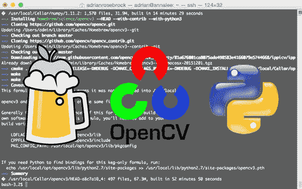
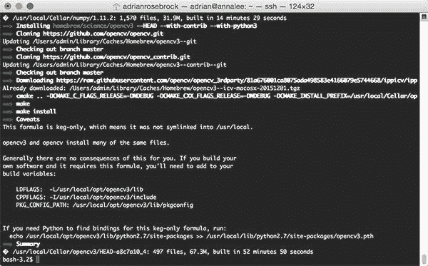
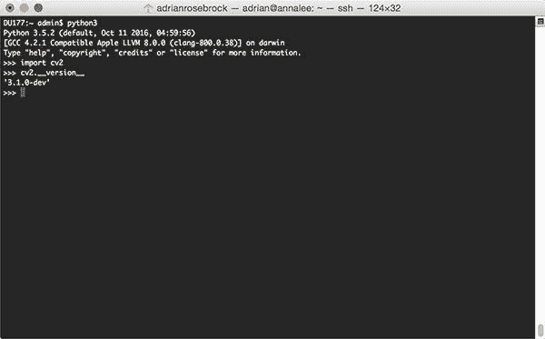
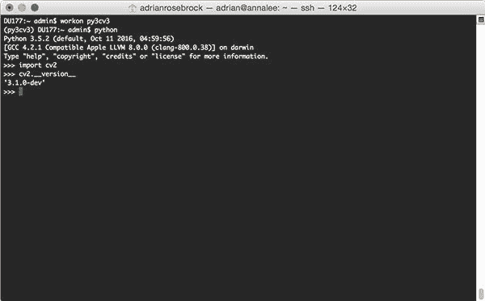

# 用自制软件在 macOS 上安装 OpenCV 3(简单的方法)

> 原文：<https://pyimagesearch.com/2016/12/19/install-opencv-3-on-macos-with-homebrew-the-easy-way/>



在过去的几周里，我演示了如何在 macOS 上使用 Python ( [2.7](https://pyimagesearch.com/2016/11/28/macos-install-opencv-3-and-python-2-7/) ， [3.5](https://pyimagesearch.com/2016/12/05/macos-install-opencv-3-and-python-3-5/) )绑定从源代码编译 OpenCV 3。

通过源代码编译 OpenCV 给你 ***完全和完全的控制权*** 在*你想要构建哪些*模块，*它们是如何构建的*，以及*它们被安装在哪里*。

然而，所有这些控制都是有代价的。

不利的一面是，确定 Python 解释器、库和包含目录的正确 CMake 路径可能*不简单*，尤其是对于不熟悉 OpenCV/Unix 系统的用户。

**这引出了一个问题……**

*“在 macOS 上安装 OpenCV 有没有更简单的方法？*避免*复杂的 CMake 配置的方法？”*

事实证明，有——就用 [Homebrew](http://brew.sh/) 吧，许多人认为它是“Mac 缺失的软件包管理器”。

那么，真的有那么容易吗？仅仅几个简单的键击和命令就可以避免麻烦并安装 OpenCV 3 吗？

嗯，还不止这些… *但是这个过程被大大简化了。*你失去了一点控制权(与从源代码编译相比)，但是你*得到的*是在你的 Mac 系统上安装 OpenCV 的一个更容易遵循的路径。

**要发现通过自制软件在 macOS 上安装 OpenCV 3 的简单方法，*继续阅读*。**

## 用自制软件在 macOS 上安装 OpenCV 3(简单的方法)

这篇博客文章的剩余部分演示了如何通过自制程序在 macOS 上安装 OpenCV 3 与 **Python 2.7** 和 **Python 3** 绑定。使用自制软件的好处是它 ***极大地简化了安装过程*** (尽管如果你不小心的话，它可能会带来自己的问题)只需要运行几组命令。

如果您喜欢在 macOS 上使用 Python 绑定从源代码编译 OpenCV，请参考这些教程:

*   [macOS Sierra:安装 OpenCV 3 和 Python 2.7](https://pyimagesearch.com/2016/11/28/macos-install-opencv-3-and-python-2-7/)
*   [macOS Sierra:安装 OpenCV 3 和 Python 3.5](https://pyimagesearch.com/2016/12/05/macos-install-opencv-3-and-python-3-5/)

### 步骤 1:安装 XCode

在我们可以通过家酿在 macOS 上安装 OpenCV 3 之前，我们首先需要安装 Xcode，这是一套用于 Mac 操作系统的软件开发工具。

#### Download Xcode

下载和安装 Xcode 最简单的方法是在 macOS 系统上使用附带的 *App Store* 应用程序。只需打开*应用商店*，在搜索栏搜索*【Xcode】*，然后点击*【获取】*按钮:


**Figure 1:** Downloading and installing Xcode on macOS.

根据您的互联网连接和系统速度，下载和安装过程可能需要 30 到 60 分钟。我建议您在完成其他工作或者出去散步的时候，在后台安装 Xocde。

#### 接受苹果开发者许可

我假设您正在使用全新安装的 macOS 和 Xcode。如果是这样，你需要[接受开发者许可](http://apple.stackexchange.com/questions/175069/how-to-accept-xcode-license)才能继续。我个人认为，通过终端更容易做到这一点。只需打开一个终端并执行以下命令:

```py
$ sudo xcodebuild -license

```

滚动到许可证的底部并接受它。

如果您已经安装了 Xcode 并且之前接受了 Apple developer license，您可以跳过这一步。

#### 安装 Apple 命令行工具

既然 Xcode 已经安装好了，我们也接受了 Apple developer license，我们就可以安装 Apple 命令行工具了。这些工具包括 make、GCC、clang 等包。 ***这是一个必需的步骤*** ，所以让你通过:

```py
$ sudo xcode-select --install

```

执行上述命令时，您将看到一个弹出的确认窗口，询问您是否批准安装:


**Figure 2:** Installing Apple Command Line Tools on macOS.

只需点击*“安装”*按钮继续。苹果命令行工具的实际安装过程应该不到 5 分钟。

如果您还没有接受 Xcode 许可，请使用以下命令确定您已经接受了 Xcode 许可:

```py
$ sudo xcodebuild -license

```

### 第二步:安装自制软件

我们现在准备安装[家酿](http://brew.sh/)，一个 macOS 的包管理器。你可以把家酿看作是 macOS 上基于 Ubuntu/Debian 的 *apt-get* 。

安装家酿非常简单——只需将命令复制并粘贴到家酿网站的*“安装家酿”*部分下面(确保将*整个*命令复制并粘贴到您的终端中)。我包含了下面的命令作为参考:

```py
$ ruby -e "$(curl -fsSL https://raw.githubusercontent.com/Homebrew/install/master/install)"

```

在 Homebrew 安装之后，您应该通过执行以下命令来确保包定义(即，用于安装给定库/包的指令)是最新的:

```py
$ brew update

```

既然家酿已经成功安装和更新，我们需要更新我们的`~/.bash_profile`文件，以便它在搜索*系统路径*之前搜索*家酿路径*中的包/库。当试图利用 Python 和 OpenCV，**时，不完成这一步可能会导致混乱的错误、导入问题和 segfaults，所以请确保正确更新您的`~/.bash_profile`** **文件！**

文件*的`~/.bash_profile`可能*或者*可能*已经不在你的系统上了。在这两种情况下，用您最喜欢的文本编辑器打开它(在这个例子中我将使用`nano`):

```py
$ nano ~/.bash_profile

```

然后在文件底部插入以下几行(如果`~/.bash_profile`不存在，文件将是空的——这没关系，只需将以下几行添加到文件中):

```py
# Homebrew
export PATH=/usr/local/bin:$PATH

```

这个代码片段所做的就是在搜索*系统路径*之前，更新你的`PATH`变量，沿着*自制程序路径*寻找库/二进制文件。

更新完`~/.bash_profile`文件后，保存并退出文本编辑器。

为了确保你是在正确的道路上，我在下面附上了我的`~/.bash_profile`的截图，这样你就可以和你的进行比较了:


**Figure 3:** Updating my .bash_profile file to include Homebrew.

记住，你的`~/.bash_profile`可能和我的 ***看起来很不一样——没关系！*** 只要确保你已经在你的文件中包含了上面的家酿代码片段，然后成功保存并编辑编辑器。

最后，我们需要手动`source`这个`~/.bash_profile`文件，以确保修改已经被重新加载:

```py
$ source ~/.bash_profile

```

上述命令只需要执行一次*。每当你打开一个新的终端，登录等。，您的`.bash_profile`文件将*自动*为您加载和获取。*

### 步骤 3:使用自制软件安装 Python 2.7 和 Python 3

下一步是安装 Python 2.7 和 Python 3 的自制版本。将 Python 系统作为您的主要解释器来开发被认为是不好的形式。Python 的系统版本应该正好服务于那个——*系统例程*。

相反，你应该安装你自己的 Python 版本，该版本独立于系统安装。使用自制软件，我们可以使用以下命令安装*Python 2.7 和*Python 3:

```py
$ brew install python python3

```

在撰写本文时，自制软件安装的最新 Python 版本是 **Python 2.7.12** 和 **Python 3.5.2** 。

作为健全性检查，让我们确认你使用的是 Python 的*自制版本，而不是 Python* 的*系统版本。您可以通过`which`命令来完成:*

```py
$ which python
/usr/local/bin/python
$ which python3
/usr/local/bin/python3

```

仔细检查`which`的输出。如果你看到每条路径的`/usr/local/bin/python`和`/usr/local/bin/python3`，那么你使用 Python 的*自制版本*就是正确的*。然而，如果输出是`/usr/bin/python`和`/usr/bin/python3`，那么你就*不正确地*使用了 Python 的系统版本。*

如果你发现自己处于这种情况，你应该:

1.  返回到**步骤#2** 并确保自制软件安装无误。
2.  检查`brew install python python3`是否成功完成。
3.  您已经正确更新了您的`~/.bash_profile`文件，并通过`source`重新加载了更改。你的`~/.bash_profile`看起来应该和上面图 3 中我的**相似。**

#### 检查您的 Python 版本

安装 Python 2.7 和 Python 3 之后，*您将需要使用以下命令检查您的 Python 版本号*:

```py
$ python --version
Python 2.7.10
$ python3 --version
Python 3.5.0

```

特别是既要注意 ***大调*** 又要注意 ***小调*** 版本号。对于第一个命令，我的主要 Python 版本是 *2* ，次要版本是 *7* 。类似地，对于第二个命令，我的主要 Python 版本是 *3* ，次要版本是 *5* 。

我提出这个问题的原因是因为*文件路径可以并且将会根据您特定的 Python 版本号而改变*。本教程中的详细说明*将*成功地在你的 macOS 机器*上安装 OpenCV，前提是*你注意你的 Python 版本号。

例如，如果我告诉您检查 Python 3 安装的`site-packages`目录，并提供一个示例命令:

```py
$ ls /usr/local/opt/opencv3/lib/python3.5/site-packages/

```

你应该*首先*检查你的 Python 3 版本。如果上面的`python3 --version`命令报告了 *3.6* ，那么您需要将您的路径更新为:

```py
$ ls /usr/local/opt/opencv3/lib/python3.6/site-packages/

```

注意`python3.5`是如何变成`python3.6`的。

忘记检查和验证文件路径是我看到的读者第一次试图在 macOS 机器上安装 OpenCV 时犯的一个常见错误。*不要*盲目复制粘贴命令和文件路径。相反，应该花时间根据 Python 版本号来验证文件路径。这样做将确保您的命令被正确地构造，并且在您第一次安装 OpenCV 时会对您有很大的帮助。

### 步骤 4:使用自制软件在 macOS 上安装 OpenCV 3 和 Python 绑定

既然我们已经安装了 Python 2.7 和 Python 3 的自制版本，我们现在准备安装 OpenCV 3。

#### 点击“自制/科学”回购

第一步是将`homebrew/science`存储库添加到我们正在跟踪的包集合中。这允许我们访问安装 OpenCV 的公式。为此，只需使用以下命令:

```py
$ brew tap homebrew/science

```

#### 了解“brew install”命令

为了通过自制软件在我们的 macOS 系统上安装 OpenCV，我们将使用`brew install`命令。该命令接受要安装的软件包的名称(如 Debian/Ubuntu 的 *apt-get* )，后跟一组可选参数。

我们的指挥基础是:`brew install opencv3`；但是，我们需要添加一些额外的参数。

*最重要的*组参数如下:

*   `--with-contrib`:这确保安装了 [opencv_contrib](https://github.com/opencv/opencv_contrib) 库，让我们能够访问额外的、关键的 opencv 特性，如 [SIFT、SURF 等](https://pyimagesearch.com/2015/07/16/where-did-sift-and-surf-go-in-opencv-3/)。
*   `--with-python3` : OpenCV 3 + Python 2.7 绑定会被*自动*编译；然而，为了编译 OpenCV 3 + Python 3 绑定，我们需要*显式地*提供`--with-python3`开关。
*   `--HEAD`:而不是编译一个带标签的 OpenCV 版本(即 v3.0、v3.1 等)。)相反，`--HEAD`交换机从 GitHub 克隆了 OpenCV 的最新版本。我们为什么要这么做呢？简单。我们需要避免困扰 macOS Sierra 系统的 QTKit 错误与当前标记的 OpenCV 3 版本(请参见*“避免 QTKit/QTKit.h 文件未找到错误”[的](https://pyimagesearch.com/2016/11/28/macos-install-opencv-3-and-python-2-7/)*部分了解更多信息)

您可以通过运行`brew info opencv3`来查看选项/开关的完整列表，我在下面列出了它的输出:

```py
$ brew info opencv3
...
--32-bit
	Build 32-bit only
--c++11
	Build using C++11 mode
--with-contrib
	Build "extra" contributed modules
--with-cuda
	Build with CUDA v7.0+ support
--with-examples
	Install C and python examples (sources)
--with-ffmpeg
	Build with ffmpeg support
--with-gphoto2
	Build with gphoto2 support
--with-gstreamer
	Build with gstreamer support
--with-jasper
	Build with jasper support
--with-java
	Build with Java support
--with-libdc1394
	Build with libdc1394 support
--with-opengl
	Build with OpenGL support (must use --with-qt5)
--with-openni
	Build with openni support
--with-openni2
	Build with openni2 support
--with-python3
	Build with python3 support
--with-qt5
	Build the Qt5 backend to HighGUI
--with-quicktime
	Use QuickTime for Video I/O instead of QTKit
--with-static
	Build static libraries
--with-tbb
	Enable parallel code in OpenCV using Intel TBB
--with-vtk
	Build with vtk support
--without-eigen
	Build without eigen support
--without-numpy
	Use a numpy you've installed yourself instead of a Homebrew-packaged numpy
--without-opencl
	Disable GPU code in OpenCV using OpenCL
--without-openexr
	Build without openexr support
--without-python
	Build without Python support
--without-test
	Build without accuracy & performance tests
--HEAD
	Install HEAD version

```

对于那些好奇的人来说，自制公式(即用于安装 OpenCV 3 的实际命令)可以在[这里](https://github.com/Homebrew/homebrew-science/blob/master/opencv3.rb)找到。如果您想要添加任何附加的 OpenCV 3 特性，请使用上面的参数和安装脚本作为参考。

我们现在已经准备好通过自制程序在你的 macOS 系统上安装 OpenCV 3 和 Python 绑定。根据您已经安装或尚未安装的依赖项，以及您的系统速度，这种编译可能需要几个小时，所以您可能想在开始安装过程后出去走走。

#### 通过自制程序安装带有 Python 3 绑定的 OpenCV 3

要启动 OpenCV 3 安装过程，只需执行以下命令:

```py
$ brew install opencv3 --with-contrib --with-python3 --HEAD

```

这个命令将通过 Homebew 在您的 macOS 系统上安装 OpenCV 3，同时使用*Python 2.7 和 Python 3 绑定。我们还将编译 OpenCV 3 的最新、最前沿版本(以避免任何 QTKit 错误)以及启用的`opencv_contrib`支持。*

 ** * *

**更新—2017 年 5 月 15 日:**

最近有一个用于在 macOS 机器上安装 OpenCV 的家酿公式的更新，可能会导致两种类型的错误。

理想情况下，家酿公式将在未来更新，以防止这些错误，但在此期间，如果您遇到下面的*或*错误:

*   `opencv3: Does not support building both Python 2 and 3 wrappers`
*   `No such file or directory 3rdparty/ippicv/downloader.cmake`

那么一定要参考 [***这篇更新的博文***](https://pyimagesearch.com/2017/05/15/resolving-macos-opencv-homebrew-install-errors/) ，我在那里提供了两个错误的解决方案。

* * *

正如我提到的，这个安装过程需要一些时间，所以考虑在 OpenCV 安装的时候出去走走。然而，当你离开时，确保你的电脑不会进入睡眠/关机状态！如果是这样，安装过程将会中断，您必须重新启动它。

假设 OpenCV 3 安装没有问题，您的终端输出应该与下面的类似:



**Figure 4:** Compiling and installing OpenCV 3 with Python bindings on macOS with Homebrew.

然而，我们还没有完全完成。

您会在安装输出的底部注意到一个小注释:

```py
If you need Python to find bindings for this keg-only formula, run:
  echo /usr/local/opt/opencv3/lib/python2.7/site-packages >> /usr/local/lib/python2.7/site-packages/opencv3.pth

```

这意味着我们的 **Python 2.7 + OpenCV 3 绑定**现在安装在`/usr/local/opt/opencv3/lib/python2.7/site-packages`中，这是 OpenCV 编译的自制路径。我们可以通过`ls`命令验证这一点:

```py
$ ls -l /usr/local/opt/opencv3/lib/python2.7/site-packages
total 6944
-r--r--r--  1 admin  admin  3552288 Dec 15 09:28 cv2.so

```

然而，我们需要将这些绑定放入`/usr/local/lib/python2.7/site-packages/`，这是 Python 2.7 的`site-packages`目录。我们可以通过执行以下命令来实现这一点:

```py
$ echo /usr/local/opt/opencv3/lib/python2.7/site-packages >> /usr/local/lib/python2.7/site-packages/opencv3.pth

```

上面的命令创建了一个`.pth`文件，它告诉 Homebrew 的 Python 2.7 install 在`/usr/local/opt/opencv3/lib/python2.7/site-packages`中寻找*附加包*——本质上，`.pth`文件可以被认为是一个“美化的符号链接”。

至此，您已经安装了 OpenCV 3 + Python 2.7 绑定！

然而，我们还没有完全完成…对于 Python 3，我们还需要采取一些额外的步骤。

#### 处理 Python 3 问题

还记得我们提供给`brew install opencv3`的`--with-python3`选项吗？

嗯，这个选项*确实*起作用了(虽然看起来不像)——我们*确实*在我们的系统上安装了 Python 3 + OpenCV 3 绑定。

***注:**非常感谢 [Brandon Hurr](https://twitter.com/bhive01) 指出这一点。很长一段时间，我认为这个开关根本不起作用。*

然而，有一个小问题。如果你检查一下`/usr/local/opt/opencv3/lib/python3.5/site-packages/`的内容，你会发现我们的`cv2.so`文件有一个有趣的名字:

```py
$ ls -l /usr/local/opt/opencv3/lib/python3.5/site-packages/
total 6952
-r--r--r--  1 admin  admin  3556384 Dec 15 09:28 cv2.cpython-35m-darwin.so

```

我不知道为什么 Python 3 + OpenCV 3 绑定没有像它们应该的那样被命名为`cv2.so`，但是跨操作系统也是如此。你会在 macOS、Ubuntu 和 Raspbian 上看到同样的问题。

幸运的是，修复很容易——您需要做的只是将`cv2.cpython-35m-darwin.so`重命名为`cv2.so`:

```py
$ cd /usr/local/opt/opencv3/lib/python3.5/site-packages/
$ mv cv2.cpython-35m-darwin.so cv2.so
$ cd ~

```

从那里，我们可以创建另一个`.pth`文件，这次是为了 Python 3 + OpenCV 3 安装:

```py
$ echo /usr/local/opt/opencv3/lib/python3.5/site-packages >> /usr/local/lib/python3.5/site-packages/opencv3.pth

```

至此，你已经通过自制软件在 macOS 系统上安装了*Python 2.7+OpenCV 3 和 Python 3 + OpenCV 3。*

 *#### 验证 OpenCV 3 是否已安装

下面是我用来验证 OpenCV 3 和 Python 2.7 绑定在我的系统上工作的命令:

```py
$ python
Python 2.7.12 (default, Oct 11 2016, 05:20:59) 
[GCC 4.2.1 Compatible Apple LLVM 8.0.0 (clang-800.0.38)] on darwin
Type "help", "copyright", "credits" or "license" for more information.
>>> import cv2
>>> cv2.__version__
'3.1.0-dev'
>>>

```

下面的屏幕截图显示了如何将 OpenCV 3 绑定导入到 Python 3 shell 中:



**Figure 5:** Confirming that OpenCV 3 with Python 3 bindings have been successfully installed on my macOS system via Homebrew.

***恭喜你，你已经通过 Homebrew 在 macOS 系统上安装了带 Python 绑定的 OpenCV 3！***

但是如果你是这个博客的长期读者，你应该知道我广泛使用 Python 虚拟环境— *,你也应该这样做。*

### 步骤 5:设置 Python 虚拟环境(可选)

你会注意到，与我之前的许多 OpenCV 3 安装教程不同，自制软件(T2)没有利用 Python 虚拟环境，这是 Python 开发的最佳实践。

虽然**步骤#5-#7** 是可选的，但是 ***我强烈建议您执行这些步骤*** ，以确保您的系统配置与我之前的教程相同。你会在 PyImageSearch 博客上看到许多教程利用了 Python 虚拟环境。虽然它们确实是可选的，但从长远来看，你会发现它们让你的生活更轻松。

#### 安装 virtualenv 和 virtualenvwrapper

[virtualenv](https://virtualenv.pypa.io/en/latest/) 和 [virtualenvwrapper](https://virtualenvwrapper.readthedocs.org/en/latest/) 包允许我们为*我们正在进行的每个*项目创建单独、独立的 Python 虚拟环境。我在这个博客上已经多次提到 Python 虚拟环境，所以我不会重复已经说过的话。相反，如果你不熟悉 Python 虚拟环境、**它们如何工作**，以及**我们为什么使用它们**，请参考这篇博文的[前半部分。我还推荐 RealPython.com 博客](https://pyimagesearch.com/2016/05/02/accessing-rpi-gpio-and-gpio-zero-with-opencv-python/)[上的这篇优秀教程，它对 Python 虚拟环境进行了更深入的探究。](https://realpython.com/blog/python/python-virtual-environments-a-primer/)

要安装`virtualenv`和`virtualenvwrapper`，只需使用`pip`:

```py
$ pip install virtualenv virtualenvwrapper

```

两个包成功安装后，您需要再次更新您的`~/.bash_profile`文件:

```py
$ nano ~/.bash_profile

```

将下列行追加到文件中:

```py
# Virtualenv/VirtualenvWrapper
source /usr/local/bin/virtualenvwrapper.sh

```

更新后，您的`~/.bash_profile`应该与我的类似:


**Figure 6:** Update your *.bash_profile* file to include virtualenv/virtualenvwrapper.

一旦您确认您的`~/.bash_profile`已经创建，您需要使用`source`命令刷新您的 shell:

```py
$ source ~/.bash_profile

```

该命令只需要执行*一次*。假设您的`~/.bash_profile`已经被正确更新，它将在您每次打开新的 shell、登录等时自动加载并`source`d。

#### 创建您的 Python 虚拟环境

我们现在准备使用`mkvirtualenv`命令创建一个名为`cv`(用于*“计算机视觉”*)的 Python 虚拟环境。

**对于 Python 2.7，使用以下命令:**

```py
$ mkvirtualenv cv -p python

```

**对于 Python 3，使用这个命令:**

```py
$ mkvirtualenv cv -p python3

```

`-p`开关控制使用哪个 Python 版本来创建您的虚拟环境。请注意，每个虚拟环境都需要用唯一的名字*命名*，所以如果你想创建两个独立的虚拟环境，一个用于 Python 2.7，另一个用于 Python 3，你需要确保每个环境都有一个独立的名字——两个都不能命名为*“cv”。*

`mkvirtualenv`命令只需要执行一次。要在创建完`cv` Python 虚拟环境后访问它，只需使用`workon`命令:

```py
$ workon cv

```

为了直观地验证您是否在`cv`虚拟环境中，只需检查您的命令行。如果你在提示前看到文本`(cv)`，那么你 ***在`cv`虚拟环境中是*** :


**Figure 7:** Make sure you see the *“(cv)”* text on your prompt, indicating that you ***are*** in the *cv* virtual environment.

否则，如果你 ***没有*** 看到`cv`文本，那么你 ***在`cv`虚拟环境中就不是*** :


**Figure 8:** If you do not see the *“(cv)”* text on your prompt, then you ***are not*** in the *cv* virtual environment and you need to run the *“workon”* command to resolve this issue before continuing.

#### 安装 NumPy

OpenCV 的唯一 Python 先决条件是一个科学计算包 [NumPy](http://www.numpy.org/) 。

要安装 NumPy，首先确保您在`cv`虚拟环境中，然后让`pip`处理实际安装:

```py
$ pip install numpy

```

### 步骤 6:Sym-link OpenCV 3 绑定(可选)

我们现在准备将`cv2.so`绑定符号链接到我们的`cv`虚拟环境中。我已经包含了用于 Python 2.7 和 Python 3 的*命令，尽管过程与*非常相似。**

#### 对于 Python 2.7

要将`cv2.so`绑定符号链接到名为`cv`的 Python 2.7 虚拟环境中，请使用以下命令:

```py
$ cd ~/.virtualenvs/cv/lib/python2.7/site-packages/
$ ln -s /usr/local/opt/opencv3/lib/python2.7/site-packages/cv2.so cv2.so
$ cd ~

```

#### 对于 Python 3:

要将通过 Homebrew 安装的`cv2.so`绑定符号链接到您的 Python 3 虚拟环境(名为`cv`)，请执行以下命令:

```py
$ cd ~/.virtualenvs/cv/lib/python3.5/site-packages/
$ ln -s /usr/local/opt/opencv3/lib/python3.5/site-packages/cv2.so cv2.so
$ cd ~

```

#### 必要时重复

如果你想为 Python 2.7 和 Python 3 安装 OpenCV 3 绑定，那么你需要为两个 Python 版本重复**步骤#5** 和**步骤#6** 。这包括创建一个唯一命名的 Python 虚拟环境，安装 NumPy，以及在`cv2.so`绑定中进行符号链接。

### 步骤 7:测试 OpenCV 3 的安装(可选)

为了验证您的 OpenCV 3+Python+virtual environment 在 macOS 上的安装是否正常工作，您应该:

1.  打开一个新的终端窗口。
2.  执行`workon`命令来访问`cv` Python 虚拟环境。
3.  尝试在 macOS 上导入您的 Python + OpenCV 3 绑定。

以下是我用来验证我的 Python 虚拟环境+ OpenCV 安装是否正常工作的确切命令:

```py
$ workon cv
$ python
>>> import cv2
>>> cv2.__version__
'3.1.0-dev'
>>>

```

注意，上面的输出演示了如何在虚拟环境中使用 OpenCV 3 + Python 2.7。

我还创建了一个 OpenCV 3 + Python 3 虚拟环境(名为`py3cv3`),安装了 NumPy，并对 OpenCV 3 绑定进行了符号链接。我访问`py3cv3`虚拟环境并导入 OpenCV 的输出如下图所示:



**Figure 10:** Utilizing virtual environments with Python 3 + OpenCV 3 on macOS.

## 那么，下一步是什么？

恭喜你。你现在在 macOS 系统上有了一个全新的 OpenCV 安装——我敢肯定你只是渴望利用你的安装来构建一些很棒的计算机视觉应用程序…

…但我也愿意打赌*你刚刚开始学习计算机视觉和 OpenCV* ，可能会对到底从哪里开始感到有点困惑和不知所措。

就我个人而言，我是**通过实例学习**的忠实粉丝，所以好的第一步是找点乐子，[阅读这篇关于在图像/视频中检测猫的博文](https://pyimagesearch.com/2016/06/20/detecting-cats-in-images-with-opencv/)。本教程旨在*非常实用*，演示如何(快速)构建一个 Python + OpenCV 应用程序来检测图像中猫的存在。

如果你真的对提升你的计算机视觉技能感兴趣，你绝对应该看看我的书《实用 Python 和 OpenCV +案例研究》*。我的书不仅*涵盖了计算机视觉和图像处理的基础知识*，还教你如何解决现实世界的计算机视觉问题包括 ***图像和视频流中的人脸检测******视频中的物体跟踪******手写识别*** 。*

[](https://pyimagesearch.com/practical-python-opencv/)

因此，让我们在 macOS 系统上充分利用 OpenCV 3 新安装程序

## 摘要

在今天的博文中，我演示了如何通过自制程序在 macOS 系统上安装 OpenCV 3 与 Python 2.7 和 Python 3 的绑定。

正如你所看到的，利用家酿是一个很好的方法，可以避免手动配置 CMake 命令来通过源代码编译 OpenCV 的繁琐过程(我的 OpenCV 安装教程的完整列表可以在本页的[中找到)。](https://pyimagesearch.com/opencv-tutorials-resources-guides/)

缺点是您失去了 CMake 提供给您的大部分控制。

此外，虽然家酿方法当然需要执行更少的命令，并避免潜在的令人沮丧的配置，但仍然值得一提的是，你*仍然*需要自己做一些工作，*尤其是*当涉及到 Python 3 绑定时。

如果您决定使用虚拟环境，这些步骤也很复杂，这是进行 Python 开发时的最佳实践。

说到在你自己的 macOS 系统上安装 OpenCV 3，我建议你:

1.  **首先尝试通过源码安装 OpenCV 3。**如果你遇到了相当大的麻烦，并且很难编译 OpenCV 3，*利用这个机会自学更多关于 Unix 环境的知识*。OpenCV 3 编译失败通常是由于不正确的 CMake 参数造成的，只要稍微了解一下 Unix 系统、路径和库，就可以正确地确定这个参数。
2.  使用自制软件作为退路。我会推荐使用自制方法安装 OpenCV 3 作为你的后备选择。当你通过自制软件安装 OpenCV 3 时，你会失去一些控制，更糟糕的是，如果在一个主要的操作系统升级期间任何符号链接中断，你将很难解决它们。不要误会我的意思:我*喜欢*家酿啤酒，并且认为它是一个伟大的工具——但是要确保你明智地使用它。

无论如何，我希望你喜欢这篇博文！我希望它能帮助你在他们的 macOS 系统上安装 OpenCV 3。

如果您有兴趣了解关于 OpenCV、计算机视觉和图像处理的更多信息，请务必在下面的表格中输入您的电子邮件地址，以便在新的博客帖子和教程发布时收到通知！**