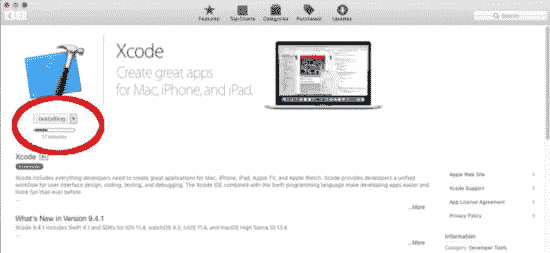
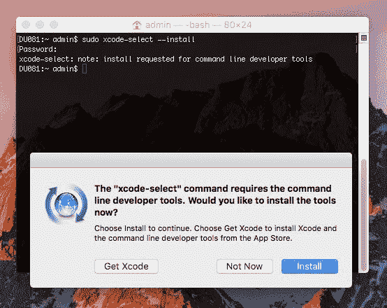
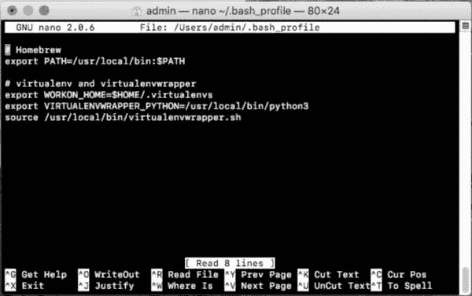
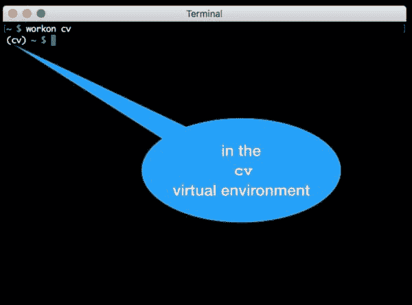
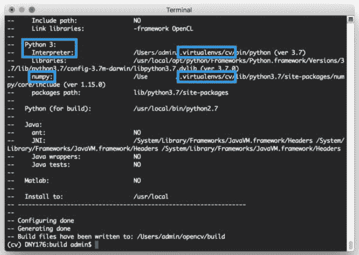
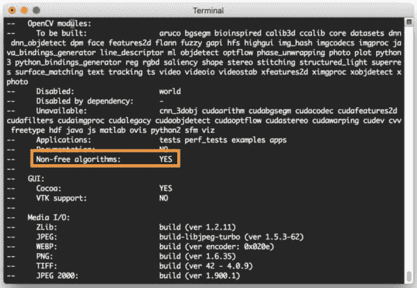
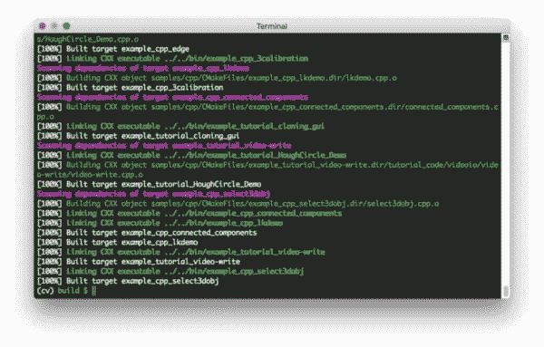
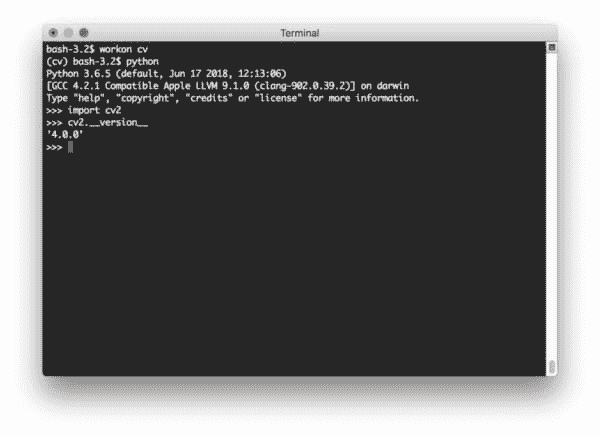
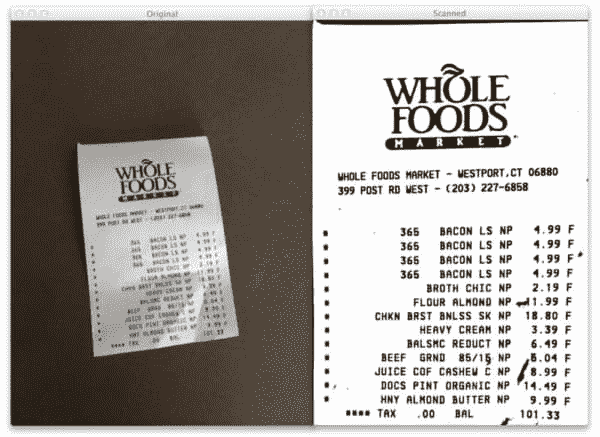

# 在 macOS 上安装 OpenCV 4

> 原文：<https://pyimagesearch.com/2018/08/17/install-opencv-4-on-macos/>

[](https://pyimagesearch.com/wp-content/uploads/2018/08/install-opencv4-macos-header.jpg)

本教程提供了在 macOS 机器上安装 OpenCV 4(带有 Python 绑定)的分步说明。

[OpenCV 4 于 2018 年 11 月 20 日](https://opencv.org/opencv-4-0-0.html)发布。

我最初是在 alpha 版本发布的时候写的这篇博文，现在已经 ***更新于 2018 年 11 月 30 日**支持正式发布。*

OpenCV 4 带有新功能，特别是在深度学习的 DNN 模块中。

**要了解如何在 macOS 上安装 OpenCV 4，*继续阅读。***

## 在 macOS 上安装 OpenCV 4

在这篇博文中，我们将在 macOS 上安装 OpenCV 4。OpenCV 4 充满了新功能，其中许多都是深度学习。

***注:**如果你登陆了错误的安装教程(也许你想在 Ubuntu 或你的树莓 Pi 上安装 OpenCV)，那么你应该访问我的 [OpenCV 安装指南](https://pyimagesearch.com/opencv-tutorials-resources-guides/)页面。我在那里发布了所有 OpenCV 安装教程的链接。*

首先，我们将安装 Xcode 并设置 Homebrew。

从那里，我们将建立 Python 虚拟环境。

然后我们将从源代码编译 OpenCV 4。从源代码编译允许我们完全控制编译和构建，以及安装完整的 OpenCV 4 构建。我将在未来的安装指南中介绍替代方法(pip 和 Homebrew)(在 OpenCV 4 正式发布之前，这两种方法都不会介绍)。

最后，我们将测试我们的 OpenCV 4 安装，并尝试一个真正的 OpenCV 项目。

我们开始吧！

### 步骤 1:安装 Xcode

首先我们需要安装 [Xcode](https://developer.apple.com/xcode/) 。

要安装 Xcode，打开**苹果应用商店**，找到 Xcode 应用，然后安装。如图所示，您需要耐心等待:

[](https://pyimagesearch.com/wp-content/uploads/2018/07/install-opencv4-macos-xcode.jpg)

**Figure 1:** Xcode is a dependency for Homebrew and therefore OpenCV 4 on macOS. To install Xcode, launch the App Store, find Xcode, and run the installation.

Xcode 安装后，我们需要接受许可协议。启动终端并输入以下命令:

```py
$ sudo xcodebuild -license

```

要接受许可证，只需向下滚动并接受它。

一旦你接受了许可协议，让我们安装苹果命令行工具。**这需要****这样你就有了`make``gcc``clang`等等。您可以通过以下方式安装工具:**

```py
$ sudo xcode-select --install

```



**Figure 2:** Installing Apple Command Line Tools on macOS.

点击*“安装”*按钮，等待大约 5 分钟，安装完成。

### 第二步:安装自制软件

在这一步，我们将安装 Mac 社区包管理器， [Homebrew](https://brew.sh/) 。

家酿运行在 Ruby 上，这是一种流行的编程语言。准备好之后，复制下面的整个命令来安装 Homebrew:

```py
$ /usr/bin/ruby -e "$(curl -fsSL https://raw.githubusercontent.com/Homebrew/install/master/install)"

```

自制命令被缩短为`brew`。

让我们更新自制软件的定义:

```py
$ brew update

```

现在让我们编辑 Mac 的 bash 配置文件。每次启动终端时都会运行这个脚本。为简单起见，我建议使用 nano 文本编辑器。如果你更喜欢 vim 或 emacs，那就去用吧。

使用以下命令用 nano 编辑 bash 概要文件:

```py
$ nano ~/.bash_profile

```

一旦您正在编辑文件，在末尾添加以下几行来更新您的`PATH`:

```py
# Homebrew
export PATH=/usr/local/bin:$PATH

```

从那里，保存配置文件。如果你使用的是 nano，你会在窗口底部看到快捷键，演示如何保存(写)和退出。

回到 bash 后，获取 bash 概要文件:

```py
$ source ~/.bash_profile

```

### 步骤 3:使用自制软件安装 OpenCV 先决条件

在本节中，我们将确保安装了 Python 3.6。我们还将安装从源代码构建 OpenCV 的先决条件。

#### 安装 Python 3.6

使用 Python 3.6 非常重要*。默认情况下，High Sierra 和 Mojave 现在随 Python 3.7 一起发布。听起来不错， ***但是*** Python 3.7 不被 Keras/TensorFlow(这两者在这个博客上经常使用)支持，因此对于 OpenCV 也不是一个好的选择。*

 *这些命令将安装 Python 3.6.5_1:

```py
$ brew install https://raw.githubusercontent.com/Homebrew/homebrew-core/f2a764ef944b1080be64bd88dca9a1d80130c558/Formula/python.rb
$ brew switch python 3.6.5_1

```

确保复制整个命令+ URL。

让我们验证一下:

```py
$ python3
Python 3.6.5 (default, Jun 17 2018, 12:13:06) 
[GCC 4.2.1 Compatible Apple LLVM 9.1.0 (clang-902.0.39.2)] on darwin
Type "help", "copyright", "credits" or "license" for more information.
>>>

```

太好了！我可以看到我们现在安装了 Python 3.6.5。

让我们再验证一件事:

```py
$ which python3
/usr/local/bin/python3

```

如果你看到`/usr/local/bin/python3`你正在使用*自制* Python(这正是我们想要的)。如果您看到了`/usr/bin/python3`，那么您正在使用*系统* Python，您可能需要修改您的 bash 概要文件和/或对其进行开源。

**现在花点时间验证你使用的是 Python 的*自制*版本和*而不是*系统版本。**

#### 安装其他必备组件

OpenCV 要求在我们编译它之前安装一些先决条件。这些软件包与(1)用于构建和编译的工具，(2)用于图像 I/O 操作的库(即，从磁盘加载各种图像文件格式，如 JPEG、PNG、TIFF 等)相关。)或(3)优化库。

要在 macOS 上安装 OpenCV 的这些必备组件，请执行以下命令:

```py
$ brew install cmake pkg-config
$ brew install jpeg libpng libtiff openexr
$ brew install eigen tbb

```

你将学会爱上的一个工具是`wget`。所有的`wget`都是从命令行下载文件。我们可以用自制软件安装 wget:

```py
$ brew install wget

```

### 步骤 4:为 OpenCV 4 安装 Python 依赖项

在这一步，我们将为 OpenCV 4 安装 Python 依赖项。

利用我们刚刚安装的`wget`工具，让我们下载并安装 pip(一个 Python 包管理器):

```py
$ wget https://bootstrap.pypa.io/get-pip.py
$ sudo python3 get-pip.py

```

现在我们已经安装了 pip，我们可以安装 [virtualenv](https://virtualenv.pypa.io/en/stable/) 和 [virtualenvwrapper](https://virtualenvwrapper.readthedocs.io/en/latest/) ，这是两个用于管理虚拟环境的工具。Python 虚拟环境是 Python 开发的最佳实践，我 ***强烈建议*** 你充分利用它们。

每周，我都会收到数不清的电子邮件和博客评论，内容是关于使用虚拟环境可以避免的问题。尽管名称相似，但虚拟环境不同于虚拟机。

要了解虚拟环境，[我建议你阅读一下这篇文章](https://realpython.com/python-virtual-environments-a-primer/)。

让我们安装`virtualenv`和`virtualenvwrapper`，然后做一些清理:

```py
$ sudo pip3 install virtualenv virtualenvwrapper
$ sudo rm -rf ~/get-pip.py ~/.cache/pip

```

从那里，我们需要再次编辑 bash 概要文件，以便这两个工具能够正常工作。

启动 nano(或您喜欢的文本编辑器):

```py
$ nano ~/.bash_profile

```

然后将这几行添加到文件的末尾:

```py
# virtualenv and virtualenvwrapper
export WORKON_HOME=$HOME/.virtualenvs
export VIRTUALENVWRAPPER_PYTHON=/usr/local/bin/python3
source /usr/local/bin/virtualenvwrapper.sh

```

[](https://pyimagesearch.com/wp-content/uploads/2018/07/install-opencv4-macos-bashprofile.jpg)

**Figure 3:** Using the `nano` text editor to edit the `~/.bash_profile` prior to installing OpenCV 4 for macOS.

提示:您可以使用 bash 命令在不打开编辑器的情况下向文件追加内容:

```py
$ echo -e "\n# virtualenv and virtualenvwrapper" >> ~/.bash_profile
$ echo "export WORKON_HOME=$HOME/.virtualenvs" >> ~/.bash_profile
$ echo "export VIRTUALENVWRAPPER_PYTHON=/usr/local/bin/python3" >> ~/.bash_profile
$ echo "source /usr/local/bin/virtualenvwrapper.sh" >> ~/.bash_profile

```

然后对文件进行源文件处理:

```py
$ source ~/.bash_profile

```

您将看到在您的终端中打印了几行，表明 virtualenvwrapper 已经设置好了。

`virtualenvwrapper`工具为我们提供了许多终端命令:

*   `mkvirtualenv <env_name> <options>`:用于“制作虚拟环境”
*   `rmvirtualenv <env_name>`:破坏虚拟环境
*   `workon <env_name>`:激活虚拟环境
*   `deactivate`:停用当前虚拟环境
*   *你会想[阅读文档](https://virtualenvwrapper.readthedocs.io/en/latest/command_ref.html)了解更多信息。*

让我们利用第一个命令为 OpenCV 创建一个 Python 虚拟环境:

```py
$ mkvirtualenv cv -p python3
Running virtualenv with interpreter /usr/local/bin/python3
Using base prefix '/usr/local/Cellar/python/3.6.5_1/Frameworks/Python.framework/Versions/3.6'
New python executable in /Users/admin/.virtualenvs/cv/bin/python3.6
Also creating executable in /Users/admin/.virtualenvs/cv/bin/python
Installing setuptools, pip, wheel...
done.
virtualenvwrapper.user_scripts creating /Users/admin/.virtualenvs/cv/bin/predeactivate
virtualenvwrapper.user_scripts creating /Users/admin/.virtualenvs/cv/bin/postdeactivate
virtualenvwrapper.user_scripts creating /Users/admin/.virtualenvs/cv/bin/preactivate
virtualenvwrapper.user_scripts creating /Users/admin/.virtualenvs/cv/bin/postactivate
virtualenvwrapper.user_scripts creating /Users/admin/.virtualenvs/cv/bin/get_env_details

```

请注意，`cv`是我们环境的名称，我正在创建一个 Python 3(由`-p python3`开关控制)环境。

***重要提示:**注意输出中 Python 3.6 也用于环境中(突出显示)。*

如果您愿意，可以用不同的名称命名您的环境。实际上，我喜欢这样命名我的环境:

*   `py3cv4`
*   `py3cv3`
*   `py2cv2`
*   等等。

这里我的`py3cv4`虚拟环境可以用 Python 3 + OpenCV 4。我的`py3cv3`虚拟环境用的是 Python 3 和 OpenCV 3。我的`py2cv2`环境可以用来测试遗留的 Python 2.7 + OpenCV 2.4 代码。这些虚拟环境的名字很容易记住，并且允许我在 OpenCV + Python 版本之间无缝切换。

接下来，让我们在环境中安装 NumPy。

很可能，环境已经是活动的了(由 bash 提示符前的`(cv)`表示)。为了以防万一，让我们`workon`(激活)环境:

```py
$ workon cv

```

[](https://pyimagesearch.com/wp-content/uploads/2018/08/install-opencv4-macos-cv.jpg)

**Figure 4:** We are “in” the `cv` virtual environment as is denoted by `(cv)` before the bash prompt. This is necessary prior to installing packages and compiling OpenCV 4.

每次你想使用这个环境或者在其中安装软件包的时候，你应该使用`workon`命令。

现在我们的环境已经激活，我们可以安装 NumPy:

```py
$ pip install numpy

```

### 第 5 步:为 macOS 编译 OpenCV 4

与 pip、Homebrew 和 Anaconda 等包管理器相比，从源代码进行编译可以让您更好地控制您的构建。

包管理器肯定很方便，我将在未来的安装教程中介绍它们，我只是想给你一个合理的警告——虽然它们表面上看起来很容易，但你无法获得 OpenCV 的最新版本，在某些情况下，它在虚拟环境中不能很好地工作。您也可能会遗漏一些功能。

我仍然一直在编译源代码，如果你真的想使用 OpenCV 的话，你一定要学会如何编译。

#### 下载 OpenCV 4

让我们下载 OpenCV。

首先，导航到我们的主文件夹，下载 opencv 和 T2 的 opencv_contrib。contrib repo 包含我们在 PyImageSearch 博客上经常使用的额外模块和函数。**你应该也在安装 OpenCV 库和附加的 contrib 模块。**

当你准备好了，就跟着下载`opencv`和`opencv_contrib`代码:

```py
$ cd ~
$ wget -O opencv.zip https://github.com/opencv/opencv/archive/4.0.0.zip
$ wget -O opencv_contrib.zip https://github.com/opencv/opencv_contrib/archive/4.0.0.zip

```

***更新 2018-11-30:****[OpenCV 4 . 0 . 0 正式发布](https://opencv.org/opencv-4-0-0.html)我已经更新了上面的下载网址。*

从那里，让我们解压缩档案:

```py
$ unzip opencv.zip
$ unzip opencv_contrib.zip

```

我也喜欢重命名目录:

```py
$ mv opencv-4.0.0 opencv
$ mv opencv_contrib-4.0.0 opencv_contrib

```

如果您跳过了重命名目录，接下来不要忘记更新 CMake 路径。

既然`opencv`和`opencv_contrib`已经下载并准备好了，让我们设置我们的环境。

#### 从源代码编译 OpenCV4

既然`opencv`和`opencv_contrib`已经下载并准备好了，让我们使用 CMake 来设置我们的编译并让 Make 来执行编译。

导航回 OpenCV repo 并创建+输入一个`build`目录:

```py
$ cd ~/opencv
$ mkdir build
$ cd build

```

现在我们准备好了。**在执行`cmake`命令之前，一定要使用`workon`** **命令，如图:**

```py
$ workon cv
$ cmake -D CMAKE_BUILD_TYPE=RELEASE \
    -D CMAKE_INSTALL_PREFIX=/usr/local \
    -D OPENCV_EXTRA_MODULES_PATH=~/opencv_contrib/modules \
    -D PYTHON3_LIBRARY=`python -c 'import subprocess ; import sys ; s = subprocess.check_output("python-config --configdir", shell=True).decode("utf-8").strip() ; (M, m) = sys.version_info[:2] ; print("{}/libpython{}.{}.dylib".format(s, M, m))'` \
    -D PYTHON3_INCLUDE_DIR=`python -c 'import distutils.sysconfig as s; print(s.get_python_inc())'` \
    -D PYTHON3_EXECUTABLE=$VIRTUAL_ENV/bin/python \
    -D BUILD_opencv_python2=OFF \
    -D BUILD_opencv_python3=ON \
    -D INSTALL_PYTHON_EXAMPLES=ON \
    -D INSTALL_C_EXAMPLES=OFF \
    -D OPENCV_ENABLE_NONFREE=ON \
    -D BUILD_EXAMPLES=ON ..

```

***更新 2018-11-30:** 我增加了一个 CMake 编译标志来启用非自由算法(`OPENCV_ENABLE_NONFREE=ON`)。如果您想出于教育目的访问专利算法，这对于 OpenCV 4 是必需的。*

***注意:**对于上面的 CMake 命令，我花了相当多的时间来创建、测试和重构它。**这是一种有效的自我配置，您无需做任何工作。**我相信，如果你完全按照它显示的那样使用它，它会为你节省时间，减少挫折。*

CMake 完成后，向上滚动(稍微向上)直到您在终端中看到以下信息:

[](https://pyimagesearch.com/wp-content/uploads/2018/08/install-opencv4-macos-cmake.jpg)

**Figure 5:** Inspecting CMake output while installing OpenCV 4 on macOS is important. Be sure that your `cv` virtual environment is being used for Python and NumPy.

您的输出应该与我的非常相似。**你所寻求的是确保你的 Python 3 解释器和虚拟环境中的 NumPy 都能被使用。**如果您看不到这一点，那么您可能在没有“在”虚拟环境(或者您命名的 Python 虚拟环境)中的情况下执行了 CMake。如果是这种情况，不用担心——只需删除`build`目录，用`workon`命令激活虚拟环境，然后重新运行 CMake。

接下来，再向上滚动一点，检查您的输出是否与我突出显示的内容相匹配:

[](https://pyimagesearch.com/wp-content/uploads/2018/08/install-opencv4-macos-nonfree.jpg)

Figure 6: Verify that the “Non-free algorithms” will be installed in OpenCV 4.

如果您的 CMake 输出可以运行，您可以通过以下方式开始编译:

```py
$ make -j4

```

***注意:****-j4 参数是可选的，它将指示`make`利用 4 个 CPU 内核。您可以调整数值或完全不使用该参数。这种情况并不经常发生，但有时竞争条件可能会阻止编译完成——此时您应该在没有标志的情况下执行`make`。*

在编译继续的时候休息一下，但是不要忘记回来创建符号链接。

当`make`完成时，您应该会看到:

[](https://pyimagesearch.com/wp-content/uploads/2018/08/install-opencv4-macos-make.jpg)

**Figure 6:** Compiling OpenCV 4 on macOS has reached 100%. We’re now ready to link OpenCV 4 into our `cv` environment.

如果您已经达到 100%，那么在**步骤#6** 之前还有一个额外的命令来安装 OpenCV 4:

```py
$ sudo make install

```

### 步骤 6:将 macOS 上的 OpenCV 4 符号链接到您的虚拟环境`site-packages`

现在让我们创建一个所谓的“符号链接”。我们需要一个从我们的`cv`虚拟环境`site-packages` *到*我们的安装了 OpenCV 的系统`site-packages`的链接*。实际上，OpenCV 将被“链接”到虚拟环境中，允许您将其导入 Python 脚本和命令行解释器。*

在我们创建一个符号链接将 OpenCV 4 链接到我们的 Python 虚拟环境之前，让我们确定一下我们的 Python 版本:

```py
$ workon cv
$ python --version
Python 3.6

```

使用 Python 版本，接下来我们可以很容易地导航到正确的`site-packages`目录(尽管我建议在终端中使用制表符补全)。

***更新 2018-12-20:** 以下路径已更新。以前版本的 OpenCV 在不同的位置(`/usr/local/lib/python3.6/site-packages`)安装了绑定，所以一定要仔细看看下面的路径。*

此时，OpenCV 的 Python 3 绑定应该位于以下文件夹中:

```py
$ ls /usr/local/python/cv2/python-3.6
cv2.cpython-36m-darwin.so

```

让我们简单地将它们重命名为`cv2.so`:

```py
$ cd /usr/local/python/cv2/python-3.6
$ sudo mv cv2.cpython-36m-darwin.so cv2.so

```

***Pro-tip:*** *如果您同时安装 OpenCV 3 和 OpenCV 4，而不是将文件重命名为`cv2.so`，您可以考虑将其命名为`cv2.opencv4.0.0.so`，然后在下一个子步骤中，将该文件适当地 sym-link 到`cv2.so`。*

我们的最后一个子步骤是将 OpenCV `cv2.so`绑定符号链接到我们的`cv`虚拟环境中:

```py
$ cd ~/.virtualenvs/cv/lib/python3.6/site-packages/
$ ln -s /usr/local/python/cv2/python-3.6/cv2.so cv2.so

```

重要注意事项:

1.  花点时间去理解符号链接是如何工作的——你可能会[阅读这篇文章](https://www.howtogeek.com/297721/how-to-create-and-use-symbolic-links-aka-symlinks-on-a-mac/)。
2.  确保你的道路是正确的。我建议使用制表符补全，而不是复制/粘贴。

***我怎么强调这一点都不为过:***`cv`Python 虚拟环境是 ***完全独立于系统上的默认 Python 版本*** 。*全局目录* *中的任何 Python 包将*对`cv`虚拟环境不可用。同样，任何安装在`cv` *的`site-packages`中的 Python 包都不会*对 Python 的全局安装可用。当您在 Python 虚拟环境中工作时，请记住这一点，这将有助于避免许多困惑和头痛。

#### 安装`imutils`

如果你经常访问我的博客，我也建议你安装我自己的 [imutils](https://pyimagesearch.com/2015/02/02/just-open-sourced-personal-imutils-package-series-opencv-convenience-functions/) 包，因为我们经常使用它:

```py
$ workon cv
$ pip install imutils

```

### 步骤 7:测试你的 macOS + OpenCV 3 安装

测试你的 OpenCV 安装以确保正确的链接总是很重要的。

我喜欢在虚拟环境中启动 Python shell，并检查它是否正确导入，以及版本是否符合我的意图:

```py
$ workon cv
$ python
>>> import cv2
>>> cv2.__version__
'4.0.0'
>>> exit()

```

[](https://pyimagesearch.com/wp-content/uploads/2018/08/install-opencv4-macos-verified.jpg)

**Figure 7:** To test that OpenCV 4 is installed on macOS, fire up Python in your virtual environment and execute `cv2.__version__` after importing `cv2`.

如果您没有看到错误并且 OpenCV 4 已经安装，那么您就可以开始了！

### 运行您的第一个 OpenCV 4 新安装的例子！

如果你想用 OpenCV 进入计算机视觉领域，我猜你想用 OpenCV 运行一些很酷的东西。

让我们从用 OpenCV 构建一个简单的“文档扫描仪”开始。

我不会在这里回顾所有的代码——如果你有兴趣或者有更多的时间，你应该[看看最初的帖子](https://pyimagesearch.com/2014/09/01/build-kick-ass-mobile-document-scanner-just-5-minutes/)。

要开始，只需滚动到 ***【下载】*** ，抓取源代码+图片。

在那里，只需输入以下命令进行准备:

```py
$ workon cv
$ unzip document-scanner.zip
$ cd document-scanner
$ tree
.
├── images
│   ├── page.jpg
│   └── receipt.jpg
├── pyimagesearch
│   ├── __init__.py
│   └── transform.py
└── scan.py

2 directories, 5 files

```

如您所见，有两个示例映像，一个`pyimagesearch`模块(需要通过*“下载”*部分下载——它是*而不是* pip-installable)，以及扫描脚本。

我们需要在我们的环境中添加一个额外的库:Scikit-image。要安装它，只需使用画中画。如果您之前没有安装 imutils，那么现在也安装它:

```py
$ pip install scikit-image imutils

```

在那里，您可以执行以下命令来对 OpenCV 4 进行测试:

```py
$ python scan.py --image images/receipt.jpg
STEP 1: Edge Detection
STEP 2: Find contours of paper
STEP 3: Apply perspective transform

```

在每一步结束时，您需要按一个键，此时窗口在您的桌面上处于焦点位置。

有时 OpenCV 会将窗口隐藏在另一个之下，所以一定要拖动 OpenCV 图像窗口，看看有什么可用的。

下面是文档扫描最后一步的截图:

[](https://pyimagesearch.com/wp-content/uploads/2014/08/receipt-scanned.jpg)

**Figure 8:** Applying step 3 of our document scanner, perspective transform. The original image is on the left and the scanned image on the right.

那很有趣！

通过阅读[原始博客文章](https://pyimagesearch.com/2014/09/01/build-kick-ass-mobile-document-scanner-just-5-minutes/)了解代码是如何工作的。

如果你想用 OpenCV 4 构建更多的项目，请继续关注我的博客！

### 故障排除和常见问题

在这一节中，我将解决读者在 macOS 上安装 OpenCV 4 时遇到的一些常见问题。

***Q.*** 能在 macOS 上用 Python 2.7 运行 OpenCV 4 吗？

我建议你坚持使用 Python 3，但是如果你正在从事遗留项目，我知道你可能想要使用 Python 2.7。你需要做的是:

*   使用`brew install python2`通过自制软件安装 Python 2.7
*   你应该在**第三步** : `sudo python get-pip.py`和`sudo pip install virtualenv virtualenvwrapper`中用 2.7 画幅
*   在**步骤#3** 中，简单地创建一个 Python 2.7 环境:`mkvirtualenv cv -p python2.7`
*   在图 5 的**步骤#4、** **中，验证 CMake 输出使用的是您的 Python 2.7 虚拟环境解释器。**

***问*** 我需要运行 brew 安装 Python 吗？Python 好像已经安装在我的 Mac 上了！

***A.*** 是的。Python 已安装，但您可能需要 Brew 的更新 Python，而且 Brew 会将 Python 放在与您的系统 Python 分开的`/usr/local/bin`中。

***Q.*** 执行`mkvirtualenv`或`workon`时，遇到“命令未找到错误”。

***A.*** 你会看到这个错误消息的原因有很多，都来自于**步骤#3:**

1.  首先，确保你已经使用`pip`软件包管理器正确安装了`virtualenv`和`virtualenvwrapper`。通过运行`pip freeze`进行验证，确保在已安装包列表中看到`virtualenv`和`virtualenvwrapper`。
2.  您的`~/.bash_profile`文件可能有错误。查看您的`~/.bash_profile`文件的内容，查看正确的`export`和`source`命令是否存在(检查**步骤#3** 中应该附加到`~/.bash_profile`的命令)。
3.  你可能忘记了你的`~/.bash_profile`。确保编辑完`source ~/.bash_profile`后运行它，以确保你可以访问`mkvirtualenv`和`workon`命令。

***问:*** 当我打开一个新的终端、注销或重启我的 macOS 系统时，我无法执行`mkvirtualenv`或`workon`命令。

***A.*** 见上一题的 **#2** 。

***Q.*** 我到达了终点，然而当我在我的终端中运行 Python 并尝试`import cv2`时，我遇到了一个错误。接下来呢？

***A.*** 不幸的是，如果不在你的系统上，这种情况很难诊断。很多事情都可能出错。最可能的失败点是符号链接步骤。我建议您执行以下操作来检查符号链接:

```py
$ cd ~/.virtualenvs/cv/lib/python3.6/site-packages
$ ls -al cv2*
lrwxr-xr-x  1 admin  _developer  21 Nov 30 11:31 cv2.so -> /usr/local/python/cv2/python-3.6/cv2.so

```

您正在寻找的是`->`箭头，它指向您系统上的一个有效路径。如果路径无效，那么您需要解决符号链接问题。您可以通过删除符号链接并再次尝试**步骤#5** 来纠正它。

***Q.*** 为什么我在尝试使用 SURF 等专利算法时会出现“非自由”错误？

***A.*** 随着 OpenCV 4 对编译有了新的要求。请参考**第 5 步**，这是用 CMake 参数为 OpenCV 4 解决的。

***Q.*** 可以用 Brew 安装 OpenCV 而不用从源码编译吗？

***A.*** 当心！答案是肯定的，但是如果你计划使用虚拟环境，你仍然需要符号链接。以后我会再写一篇关于自制方法的文章。

***问:*** 我可以把 OpenCV 4 和 pip 一起安装到我的虚拟环境中吗？

***A.*** 目前不能用 pip 安装 OpenCV 4。但是可以安装 OpenCV 3.4.3。参见如何*pip 安装 opencv 。*

## 摘要

今天我们在你的 macOS 机器上安装了带有 Python 绑定的 OpenCV4。

我会带着 OpenCV 4 的未来安装教程回来(包括一个关于 Raspberry Pi 的)。如果你正在寻找我的另一个已经出版的 OpenCV 安装教程，一定要参考这个页面。

敬请期待！

**要下载今天教程的源代码，*只需在下表中输入您的电子邮件地址。******