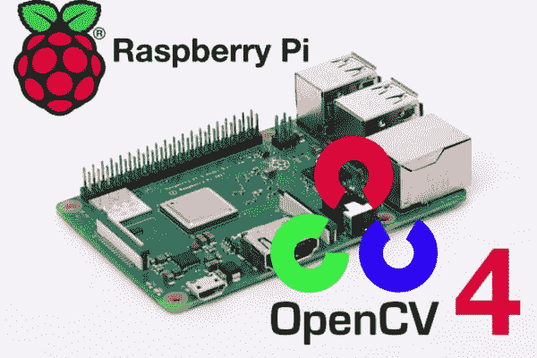
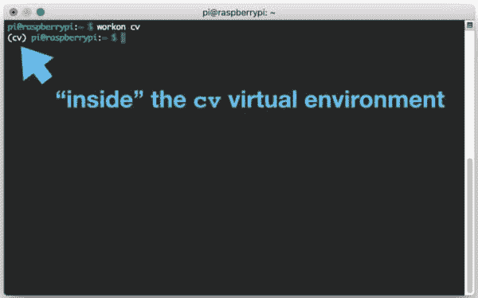
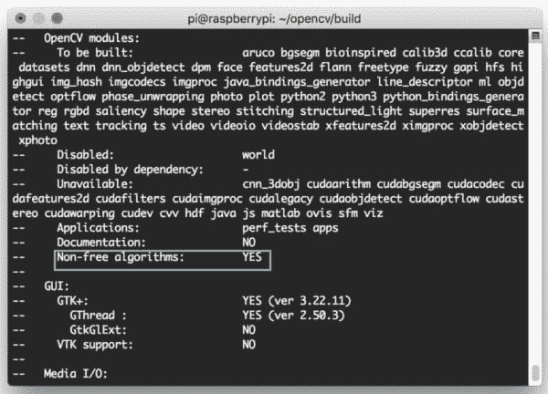
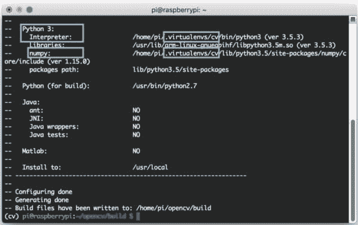
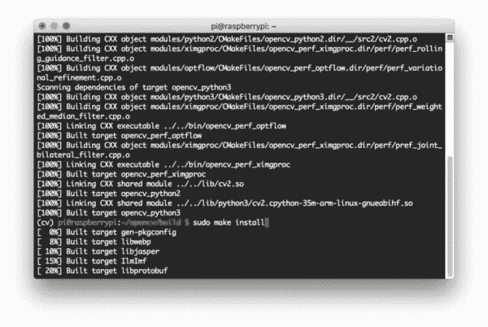
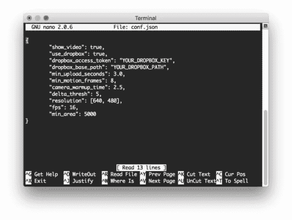

# 在你的树莓 Pi 上安装 OpenCV 4

> 原文：<https://pyimagesearch.com/2018/09/26/install-opencv-4-on-your-raspberry-pi/>

[](https://pyimagesearch.com/wp-content/uploads/2018/08/install-opencv4-rpi-header.jpg)

今天我将向您展示如何在您的 Raspberry Pi 上编译和安装 OpenCV 4。

OpenCV 4 于 2018 年 11 月 20 日[正式发布](https://opencv.org/opencv-4-0-0.html)。

这篇博文随后于 11 月 28 日更新，以适应安装的变化(之前这些说明链接到 alpha 版本源代码)。

也可以 [pip 安装 OpenCV！](https://pyimagesearch.com/2018/09/19/pip-install-opencv/)然而，截至此次更新，PyPi 不包含可通过 pip 安装的预编译 OpenCV 4 二进制文件。

因此，如果你想要 OpenCV 4，那么你需要从源代码编译。

**要了解如何在您的树莓 Pi 上安装 OpenCV 4，*只需遵循本教程！***

## 在你的树莓 Pi 上安装 OpenCV 4

在这篇博文中，我们将在你的树莓 Pi 上安装 OpenCV 4。OpenCV 4 的目标是减少膨胀，增加优化，并更新深度学习模块。

***注:*** *我的博客上有很多安装指南。开始之前，请务必查看我的 **[OpenCV 安装指南](https://pyimagesearch.com/opencv-tutorials-resources-guides/)** 页面上的可用安装教程。*

首先，我们将涵盖本教程附带的假设。

从这里开始，我们将通过 7 个步骤在您的 Raspberry Pi 上编译和安装 OpenCV 4。从源代码编译允许我们完全控制编译和构建。它还允许我们获取最新的代码——这是 pip 和 apt-get 所不提供的。

最后，我们将通过一个有趣的项目来测试我们在 Raspberry Pi 上安装的 OpenCV 4。

让我们开始吧。

### 假设

在本教程中，我将假设您已经拥有一个 **[树莓 Pi 3 B](https://amzn.to/2OzzWKi)** 或更新的 **[树莓 Pi 3 B+](https://amzn.to/2xxGhOO)** 与**[Raspbian Stretch installed](https://www.raspberrypi.org/downloads/raspbian/)**。

如果你还没有 Raspbian Stretch 操作系统，你需要升级你的操作系统来利用 Raspbian Stretch 的新特性。

要将你的树莓 Pi 3 升级到 Raspbian Stretch，你可以[在这里](https://www.raspberrypi.org/downloads/raspbian/)下载，然后按照这些[升级说明](https://www.raspberrypi.org/documentation/installation/installing-images/README.md)(或者[这些是针对 NOOBS 路线](https://www.raspberrypi.org/downloads/noobs/)的，这是推荐给初学者的)。通过 torrent 客户端下载前一个指令大约需要 10 分钟，使用 Etcher 或其他工具刷新 SD 卡大约需要 10 分钟。此时，您可以通电并继续下一部分。

假设您的操作系统是最新的，您将需要以下之一来完成本文的剩余部分:

*   物理访问您的 Raspberry Pi 3，以便您可以打开终端并执行命令
*   *通过 SSH 或 VNC 远程访问*。

我将通过 SSH 完成本教程的大部分内容，但是只要您可以访问终端，您就可以轻松地跟着做。

***宋承宪不会吗？*** 如果您在网络上看到您的 Pi，但无法对其进行 ssh，您可能需要启用 SSH。这可以通过 Raspberry Pi 桌面首选项菜单(你需要一根 HDMI 线和一个键盘/鼠标)或从 Pi 的命令行运行`sudo service ssh start`来轻松完成。

更改设置并重新启动后，您可以使用本地主机地址直接在 Pi 上测试 SSH。打开一个终端，输入`ssh pi@127.0.0.1`看看它是否工作。要从另一台计算机进行 SSH，您需要 Pi 的 IP 地址——您可以通过查看路由器的客户端页面或在 Pi 上运行`ifconfig`来找到它。

***键盘布局给你带来困扰？*** 进入 Raspberry Pi 桌面首选项菜单，更改你的键盘布局。我使用标准的美国键盘布局，但是你会想要选择一个适合你的。

### 步骤 1:在您的 Raspberry Pi 上扩展文件系统

要启动 OpenCV 4 party，启动您的 Raspberry Pi 并打开一个 SSH 连接(或者使用带有键盘+鼠标的 Raspbian 桌面并启动一个终端)。

你用的是全新的 Raspbian Stretch 吗？

如果是这样的话，你应该做的第一件事就是扩展你的文件系统，在你的 micro-SD 卡上包含所有可用空间:

```py
$ sudo raspi-config

```

然后选择*【高级选项】*菜单项:

[](https://pyimagesearch.com/wp-content/uploads/2018/08/install-opencv4-rpi-raspiconfig.jpg)

**Figure 1:** Selecting the “Advanced Options” from the `raspi-config` menu to expand the Raspbian file system on your Raspberry Pi is important before installing OpenCV 4\. Next we’ll actually expand the filesystem.

接着选择*“扩展文件系统”*:

[](https://pyimagesearch.com/wp-content/uploads/2018/08/install-opencv4-rpi-expandfs.jpg)

**Figure 2:** The Raspberry Pi “Expand Filesystem” menu allows us to take advantage of our entire flash memory card. This will give us space necessary to install OpenCV 4 and other packages.

一旦出现提示，你应该选择第一个选项，***“A1。展开文件系统"*** ， ***点击键盘上的回车键*** ，向下箭头到 ***" <完成> "*** 按钮，然后重新启动您的 Pi——可能会提示您重新启动，但如果不是，您可以执行:

```py
$ sudo reboot

```

重新启动后，您的文件系统应该已经扩展到包括 micro-SD 卡上的所有可用空间。您可以通过执行`df -h`并检查输出来验证磁盘是否已经扩展:

```py
$ df -h
Filesystem      Size  Used Avail Use% Mounted on
/dev/root        30G  4.2G   24G  15% /
devtmpfs        434M     0  434M   0% /dev
tmpfs           438M     0  438M   0% /dev/shm
tmpfs           438M   12M  427M   3% /run
tmpfs           5.0M  4.0K  5.0M   1% /run/lock
tmpfs           438M     0  438M   0% /sys/fs/cgroup
/dev/mmcblk0p1   42M   21M   21M  51% /boot
tmpfs            88M     0   88M   0% /run/user/1000

```

如您所见，我的 Raspbian 文件系统已经扩展到包括所有 32GB 的 micro-SD 卡。

然而，即使我的文件系统扩展了，我也已经使用了 32GB 卡的 15%。

如果您使用的是 8GB 卡，您可能会使用将近 50%的可用空间，因此一个简单的方法是删除 LibreOffice 和 Wolfram engine，以释放 Pi 上的一些空间:

```py
$ sudo apt-get purge wolfram-engine
$ sudo apt-get purge libreoffice*
$ sudo apt-get clean
$ sudo apt-get autoremove

```

**移除 Wolfram 引擎和 LibreOffice 后，*您可以回收近 1GB 的空间！***

### 步骤 2:在你的 Raspberry Pi 上安装 OpenCV 4 依赖项

从那里，让我们更新我们的系统:

```py
$ sudo apt-get update && sudo apt-get upgrade

```

然后让我们安装开发工具，包括 [CMake](https://cmake.org/) :

```py
$ sudo apt-get install build-essential cmake unzip pkg-config

```

接下来，让我们安装一系列图像和视频库——这些库对于能够处理图像和视频文件至关重要:

```py
$ sudo apt-get install libjpeg-dev libpng-dev libtiff-dev
$ sudo apt-get install libavcodec-dev libavformat-dev libswscale-dev libv4l-dev
$ sudo apt-get install libxvidcore-dev libx264-dev

```

从那里，让我们安装 GTK，我们的 GUI 后端:

```py
$ sudo apt-get install libgtk-3-dev

```

现在让我们安装一个可以减少讨厌的 GTK 警告的包:

```py
$ sudo apt-get install libcanberra-gtk*

```

星号会抓住手臂特定的 GTK。

然后安装两个包含 OpenCV 数值优化的包:

```py
$ sudo apt-get install libatlas-base-dev gfortran

```

最后，让我们安装 Python 3 开发头:

```py
$ sudo apt-get install python3-dev

```

一旦安装了所有这些先决条件，您就可以进入下一步。

### 步骤 3:为你的树莓 Pi 下载 OpenCV 4

我们的下一步是下载 OpenCV。

让我们导航到我们的主文件夹，下载 opencv 和 T2 的 opencv_contrib。contrib repo 包含我们在 PyImageSearch 博客上经常使用的额外模块和函数。**你应该也在安装 OpenCV 库和附加的 contrib 模块。**

当你准备好了，就跟着下载`opencv`和`opencv_contrib`代码:

```py
$ cd ~
$ wget -O opencv.zip https://github.com/opencv/opencv/archive/4.0.0.zip
$ wget -O opencv_contrib.zip https://github.com/opencv/opencv_contrib/archive/4.0.0.zip

```

从那里，让我们解压缩档案:

```py
$ unzip opencv.zip
$ unzip opencv_contrib.zip

```

我也喜欢重命名目录:

```py
$ mv opencv-4.0.0 opencv
$ mv opencv_contrib-4.0.0 opencv_contrib

```

如果您跳过重命名目录，不要忘记更新 CMake 路径。

既然`opencv`和`opencv_contrib`已经下载并准备好了，让我们设置我们的环境。

### 步骤 4:为 OpenCV 4 配置 Python 3 虚拟环境

让我们抓取并安装 pip，一个 Python 包管理器。

要安装 pip，只需在终端中输入以下内容:

```py
$ wget https://bootstrap.pypa.io/get-pip.py
$ sudo python3 get-pip.py

```

#### 利用虚拟环境进行 Python 开发

如果你不熟悉虚拟环境，请花点时间看看 RealPython 上的这篇[文章，或者读一下 PyImageSearch](https://realpython.com/blog/python/python-virtual-environments-a-primer/) 上的[这篇博文的前半部分。](https://pyimagesearch.com/2016/05/02/accessing-rpi-gpio-and-gpio-zero-with-opencv-python/)

虚拟环境将允许您在系统上独立运行不同版本的 Python 软件。今天我们将只设置一个环境，但是您可以轻松地为每个项目设置一个环境。

现在让我们继续安装`virtualenv`和`virtualenvwrapper`——它们支持 Python 虚拟环境:

```py
$ sudo pip install virtualenv virtualenvwrapper
$ sudo rm -rf ~/get-pip.py ~/.cache/pip

```

为了完成这些工具的安装，我们需要更新我们的`~/.profile`文件(类似于`.bashrc`或`.bash_profile`)。

使用终端文本编辑器，如`vi` / `vim`或`nano`，将下列行添加到您的`~/.profile`中:

```py
# virtualenv and virtualenvwrapper
export WORKON_HOME=$HOME/.virtualenvs
export VIRTUALENVWRAPPER_PYTHON=/usr/bin/python3
source /usr/local/bin/virtualenvwrapper.sh

```

或者，您可以通过 bash 命令直接附加这些行:

```py
$ echo -e "\n# virtualenv and virtualenvwrapper" >> ~/.profile
$ echo "export WORKON_HOME=$HOME/.virtualenvs" >> ~/.profile
$ echo "export VIRTUALENVWRAPPER_PYTHON=/usr/bin/python3" >> ~/.profile
$ echo "source /usr/local/bin/virtualenvwrapper.sh" >> ~/.profile

```

接下来，获取`~/.profile`文件:

```py
$ source ~/.profile

```

#### 创建一个虚拟环境来存放 OpenCV 4 和其他包

现在，您可以在 Raspberry Pi 上创建 OpenCV 4 + Python 3 虚拟环境了:

```py
$ mkvirtualenv cv -p python3

```

这一行简单地创建了一个名为`cv`的 Python 3 虚拟环境。

你可以(也应该)随心所欲地命名你的环境——我喜欢让它们简洁明了，同时提供足够的信息，以便我记住它们的用途。例如，我喜欢这样命名我的环境:

*   `py3cv4`
*   `py3cv3`
*   `py2cv2`
*   等等。

让我们通过使用`workon`命令来验证我们是否处于`cv`环境中:

```py
$ workon cv

```

[](https://pyimagesearch.com/wp-content/uploads/2018/08/install-opencv4-rpi-workoncv.jpg)

**Figure 3:** The **`workon`** command is part of the **virtualenvwrapper** package and allows us to easily activate virtual environments. Here I’m activating the `cv` environment which we’ll install OpenCV 4 into on our Raspberry Pi.

#### 安装 NumPy

我们将安装的第一个 Python 包和唯一的 OpenCV 先决条件是 NumPy:

```py
$ pip install numpy

```

我们现在可以准备 OpenCV 4 在我们的 Raspberry Pi 上进行编译。

### 步骤 5:为你的树莓 Pi 创建并编译 OpenCV 4

对于这一步，我们将使用 CMake 设置我们的编译，然后运行`make`来实际编译 OpenCV。这是今天博文最耗时的一步。

导航回 OpenCV repo 并创建+输入一个`build`目录:

```py
$ cd ~/opencv
$ mkdir build
$ cd build

```

#### 为 OpenCV 4 运行 CMake

现在让我们运行 CMake 来配置 OpenCV 4 版本:

```py
$ cmake -D CMAKE_BUILD_TYPE=RELEASE \
    -D CMAKE_INSTALL_PREFIX=/usr/local \
    -D OPENCV_EXTRA_MODULES_PATH=~/opencv_contrib/modules \
    -D ENABLE_NEON=ON \
    -D ENABLE_VFPV3=ON \
    -D BUILD_TESTS=OFF \
    -D OPENCV_ENABLE_NONFREE=ON \
    -D INSTALL_PYTHON_EXAMPLES=OFF \
    -D BUILD_EXAMPLES=OFF ..

```

***更新 2018-11-27:** 注意`-D OPENCV_ENABLE_NONFREE=ON`旗。用 OpenCV 4 设置这个标志可以确保你可以访问 SIFT/SURF 和其他专利算法。*

**确保更新上述命令以使用正确的`OPENCV_EXTRA_MODULES_PATH`路径。如果你完全按照这个教程*来做*，你应该不需要更新路径。**

一旦 CMake 完成，检查输出是很重要的。您的输出应该类似于下面的内容:

[](https://pyimagesearch.com/wp-content/uploads/2018/09/install-opencv4-rpi-nonfree.jpg)

**Figure 4:** Ensure that “Non-free algorithms” is set to “YES”. This will allow you to use patented algorithms such as SIFT/SURF for educational purposes.

[](https://pyimagesearch.com/wp-content/uploads/2018/08/install-opencv4-rpi-cmake.jpg)

**Figure 5:** The CMake command allows us to generate build files for compiling OpenCV 4 on the Raspberry Pi. Since we’re using virtual environments, you should inspect the output to make sure that the compile will use the proper interpreter and NumPy.

现在花一点时间来确保`Interpreter`指向正确的 Python 3 二进制文件。还要检查`numpy`是否指向我们的 NumPy 包，该包安装在虚拟环境的*中。*

#### 增加树莓派的互换

在你开始编译之前，我建议 ***增加你的交换空间*** 。这将使你能够用树莓派的 ***所有四个内核*** 编译 OpenCV，而不会因为内存耗尽而导致编译挂起。

打开您的`/etc/dphys-swapfile`文件:

```py
$ sudo nano /etc/dphys-swapfile

```

…然后编辑`CONF_SWAPSIZE`变量:

```py
# set size to absolute value, leaving empty (default) then uses computed value
#   you most likely don't want this, unless you have an special disk situation
# CONF_SWAPSIZE=100
CONF_SWAPSIZE=2048

```

请注意，我正在将交换空间从 100MB 增加到 2048MB。

如果你不执行这个步骤，你的 Pi 很可能会挂起。

从那里，重新启动交换服务:

```py
$ sudo /etc/init.d/dphys-swapfile stop
$ sudo /etc/init.d/dphys-swapfile start

```

***注意:**增加交换空间是烧坏你的 Raspberry Pi microSD 卡的好方法。基于闪存的存储可以执行的写入次数有限，直到卡基本上无法再容纳 1 和 0。我们只会在短时间内启用大规模互换，所以这没什么大不了的。无论如何，一定要在安装 OpenCV + Python 后备份你的`.img`文件，以防你的卡意外提前死亡。你可以在本页的[阅读更多关于大容量交换损坏存储卡的信息。](https://www.bitpi.co/2015/02/11/how-to-change-raspberry-pis-swapfile-size-on-rasbian/)*

#### 编译 OpenCV 4

现在我们准备编译 OpenCV 4:

```py
$ make -j4

```

***注意:**在上面的`make`命令中，`-j4`参数指定我有 4 个内核进行编译。**如果你有编译错误或者你的 Raspberry Pi 挂起/冻结**你可以不使用`-j4`开关来消除竞争条件。*

在这里，您可以看到 OpenCV 4 编译时没有任何错误:

[](https://pyimagesearch.com/wp-content/uploads/2018/09/install-opencv4-rpi-makeinstall.jpg)

**Figure 6:** I’ve compiled OpenCV 4 on my Raspberry Pi successfully (the `make` command has reached 100%). So now I’ll issue the `sudo make install` command.

接下来，让我们用另外两个命令安装 OpenCV 4:

```py
$ sudo make install
$ sudo ldconfig

```

***别忘了回去*** 给你的`/etc/dphys-swapfile`文件还有:

1.  将`CONF_SWAPSIZE`重置为 100MB。
2.  重新启动交换服务。

### 步骤 6:将 OpenCV 4 链接到 Python 3 虚拟环境中

让我们创建一个从系统`site-packages`目录中的 OpenCV 安装到我们的虚拟环境的符号链接:

```py
$ cd ~/.virtualenvs/cv/lib/python3.5/site-packages/
$ ln -s /usr/local/python/cv2/python-3.5/cv2.cpython-35m-arm-linux-gnueabihf.so cv2.so
$ cd ~

```

我再怎么强调这一步也不为过——这一步非常关键。 如果你不创建一个符号链接，你将无法在你的脚本中导入 OpenCV。此外，确保上述命令中的路径和文件名对于您的 Raspberry Pi 是正确的。**我建议 tab 补全。**

### 步骤 7:在您的 Raspberry Pi 上测试您的 OpenCV 4 安装

让我们做一个快速的健全性测试，看看 OpenCV 4 是否准备好了。

打开终端并执行以下操作:

```py
$ workon cv
$ python
>>> import cv2
>>> cv2.__version__
'4.0.0'
>>> exit()

```

第一个命令激活我们的虚拟环境。然后我们运行与环境相关的 Python 解释器。

如果你看到你已经安装了 4.0.0 版本，那么你现在全副武装，危险+准备执行计算机视觉和图像处理。

### 一个 Raspberry Pi + OpenCV 4 项目，让您的双脚沾湿

不久前，我正努力通过评论、电子邮件和 Twitter/脸书/LinkedIn 回复 PyImageSearch 的读者。我会尽可能多地回复收到的问题和评论。

当时是下午 4:30，我在“流畅”状态下不停地敲击键盘。

但是当我打字的时候，我的大脑中触发了我口渴的感觉。非常渴。

所以我离开键盘，去冰箱拿了瓶美味的啤酒？。

**WTF？**

我所有的啤酒都不见了！

谁偷了我的啤酒？！

我拿了些水，回到电脑前。我关闭了所有的信件窗口，启动了代码编辑器/IDE ( [我喜欢 PyCharm](https://pyimagesearch.com/2015/08/17/the-perfect-computer-vision-environment-pycharm-opencv-and-python-virtual-environments/) )。

我又开始敲键盘，喝点水。

我在建造什么？

我用我的树莓皮制作了一个**安全摄像头，它将捕捉人们离开/进入我的公寓和打开/关闭我的冰箱。下次我会抓住那个偷我啤酒的混蛋！**

[](https://pyimagesearch.com/wp-content/uploads/2015/05/pi_home_surveillance_animated.gif)

**Figure 7:** Examples of the Raspberry Pi home surveillance system detecting motion in video frames and uploading them to my personal Dropbox account.

如果你想学习如何用你的树莓 Pi 和 OpenCV 4 构建一个安全摄像头，那么我建议你阅读 **[原创博文](https://pyimagesearch.com/2015/06/01/home-surveillance-and-motion-detection-with-the-raspberry-pi-python-and-opencv/)** 。

该项目相对简单，将完成以下工作:

*   通过背景减法检测运动。
*   将入侵者和其他动作的图像上传到 Dropbox，以便您可以稍后查看事件。所有的图片都有时间标记，这样你就能知道什么时候有人在你的 Raspberry Pi 安全摄像头里。

或者，如果您很聪明，并且想要立即获取代码，那么在将 Dropbox API 密钥粘贴到配置文件中之后，您可以很快启动并运行。

要下载这个项目，请滚动到这篇博文的 ***“下载”*** 部分并填写表格。

您可以将 zip 文件下载到您的`~/Downloads`文件夹，然后启动一个终端:

```py
$ cd ~/Downloads
$ scp pi-home-surveillance.zip pi@192.168.1.119:~ # replace IP with your Pi's IP
$ ssh pi@192.168.1.119 # replace with your Pi's IP

```

一旦建立了 SSH 连接，让我们安装几个包，即 Dropbox API:

```py
$ workon cv
$ pip install dropbox
$ pip install imutils
$ pip install "picamera[array]"

```

从那里，解压缩文件并更改工作目录:

```py
$ cd ~
$ unzip pi-home-surveillance.zip
$ cd pi-home-surveillance

```

您将看到如下所示的目录结构:

```py
$ tree --dirsfirst
.
├── pyimagesearch
│   ├── __init__.py
│   └── tempimage.py
├── conf.json
└── pi_surveillance.py

1 directory, 6 files

```

在您能够部署项目之前，您需要编辑配置文件`conf.json`。让我们使用`nano`文本编辑器(或者`vim` / `emacs`)在我们的终端中快速检查一下:

```py
$ nano conf.json

```

您将看到一个如下所示的 JSON 字典:

[](https://pyimagesearch.com/wp-content/uploads/2018/08/install-opencv4-rpi-seccam-conf.jpg)

**Figure 8:** The Raspberry Pi security camera configuration file. An API key must be pasted in, and a base path must be configured. For headless mode, “show_video” should be set to “false”.

**此时，使用 API 键和路径**编辑配置文件很重要。要找到您的 API 密钥，您可以在[应用创建页面](https://www.dropbox.com/developers/apps/create)上创建一个应用。一旦你创建了一个应用，API 密匙可以在[应用控制台](https://www.dropbox.com/developers/apps)上的应用页面的 OAuth 部分下生成(只需点击“生成”按钮并将密匙复制/粘贴到配置文件中)。该路径必须是收存箱文件结构中的有效路径。

***注意:*** *不要和任何人分享你的 API 密匙，除非你信任他们！*

为了测试，你可以离开`"show_video": true`并连接一个 HDMI 屏幕+键盘/鼠标到你的 Pi。最终，您会希望将值设置为`false`,并让您的 Pi 无头运行，只需连接几根电缆，这样您就可以将它隐藏在不显眼的地方。

项目开始工作后，您可以在 web 浏览器中监控 Dropbox 文件夹(您可能需要刷新以检查图像)，或者如果您正在将文件夹同步到您的笔记本电脑/台式机，您可以在那里监控该文件夹。

**我*强烈推荐*你也阅读[整个博文](https://pyimagesearch.com/2015/06/01/home-surveillance-and-motion-detection-with-the-raspberry-pi-python-and-opencv/)。**

祝您使用 Raspberry Pi 和 OpenCV 4 愉快！

### 故障排除和常见问题(FAQ)

在你的 Raspberry Pi 上安装 OpenCV 4 遇到错误了吗？

先不要把这个小玩意儿扔到房间的另一头。第一次在您的 Raspberry Pi 上安装 OpenCV 可能会非常令人沮丧，我最不希望您做的事情就是在此结束学习过程。

如果你真的卡住了，*别忘了*的 ***快速入门捆绑包 **[*的*](https://pyimagesearch.com/practical-python-opencv/)***** 实用 Python 和 OpenCV +案例分析 自带树莓派镜像，已经预配置好，随时可用。包括 RPi 3B/3B+和 RPi Zero W 的图像。这些图片可以帮你省下几个小时和几天的时间(是的，我花了大约 *6 天*来设置 RPi Zero W)。

如果你下定决心要自己解决这个问题，我整理了一个简短的常见问题(FAQ)列表，我建议你熟悉它们。

**问:如何将操作系统闪存到我的 Raspberry Pi 存储卡上？**

 *****A.*** 我推荐你:

*   拿个 16GB 或者 32GB 的内存卡。
*   Flash Raspbian 用蚀刻机对卡片进行拉伸。Etcher 受所有 3 个主要操作系统的支持。
*   将卡片插入你的树莓派，从这篇博文中的*“假设”*和*“第一步”*开始。

***Q.*** 我能用 Python 2.7 吗？

***A.*** 我不推荐使用 Python 2.7，因为它正迅速接近生命的尽头。Python 3 是现在的标准。但是如果你坚持…

以下是如何开始使用 Python 2.7 的方法:

```py
$ sudo apt-get install python2.7 python2.7-dev

```

然后，在您在**步骤#4** 中创建您的虚拟环境之前，首先安装 pip for Python 2.7:

```py
$ sudo python2.7 get-pip.py

```

同样在**步骤#4** 中:当您创建虚拟环境时，只需使用相关的 Python 版本标志:

```py
$ mkvirtualenv cv -p python2.7

```

从那以后，一切都应该是一样的。

***问*** 我能不能就 [pip 安装 OpenCV 4？](https://pyimagesearch.com/2018/09/19/pip-install-opencv/)

***A.*** 未来，是的。目前你需要从源代码编译，直到 piwheels 有 OpenCV 4 二进制文件可用。

***Q.*** 为什么我不能直接 apt-get 安装 OpenCV？

***A.*** 不惜一切代价避免这个【解决方案】*即使它*可能*有效。首先，这种方法可能暂时不会安装 OpenCV 4。其次，apt-get 不适合虚拟环境，而且您无法控制编译和构建。*

 ****q .***`mkvirtualenv`和`workon`命令产生“命令未找到错误”。我不确定下一步该做什么。

***A.*** 你会看到这个错误消息的原因有很多，都来自于**步骤#4:**

1.  首先，确保你已经使用`pip`软件包管理器正确安装了`virtualenv`和`virtualenvwrapper`。通过运行`pip freeze`进行验证，确保在已安装包列表中看到`virtualenv`和`virtualenvwrapper`。
2.  您的`~/.profile`文件可能有错误。查看您的`~/.profile`文件的内容，查看正确的`export`和`source`命令是否存在(检查**步骤#4** 中应该附加到`~/.profile`的命令)。
3.  你可能忘记了你的 T1。确保编辑完`source ~/.profile`后运行它，以确保你可以访问`mkvirtualenv`和`workon`命令。

***问*** 当我打开一个新的终端，注销，或者重启我的树莓派，我无法执行`mkvirtualenv`或者`workon`命令。

***A.*** 如果你在 Raspbian 桌面上，很可能会出现这种情况。由于某种原因，当您启动终端时加载的默认概要文件并不包含`~/.profile`文件。请参考上一个问题的 **#2** 。通过 SSH，你可能不会碰到这种情况。

***Q.*** 当我尝试导入 OpenCV 时，遇到了这个消息:`Import Error: No module named cv2`。

**发生这种情况有几个原因，不幸的是，很难诊断。我推荐以下建议来帮助诊断和解决错误:**

 **1.  使用`workon cv`命令确保您的`cv`虚拟环境处于活动状态。如果这个命令给你一个错误，然后验证`virtualenv`和`virtualenvwrapper`是否正确安装。
2.  尝试在您的`cv`虚拟环境中研究`site-packages`目录的内容。根据您的 Python 版本，您可以在`~/.virtualenvs/cv/lib/python3.5/site-packages/`中找到`site-packages`目录。确保(1)在`site-packages`目录中有一个`cv2`符号链接目录，并且(2)它被正确地符号链接。
3.  务必分别检查位于`/usr/local/python/`的 Python 的系统安装的`site-packages`(甚至`dist-packages`)目录。理想情况下，您应该在那里有一个`cv2`目录。
4.  作为最后一招，检查 OpenCV 构建的`build/lib`目录。那里的*应该是那里的`cv2`目录(如果`cmake`和`make`都执行无误)。如果`cv2`目录存在，*手动将其*复制到`/usr/local/python`中，然后链接。因此，将文件保存到虚拟环境的目录中。*

***问:*** 为什么我会遇到“非自由模块”没有被安装的消息？如何获取 OpenCV 非自由模块？

***答:***OpenCV 4 中新增，必须设置一个特殊的 CMake 标志来获取非自由模块。参考上面的**步骤 5** ，注意 CMake 命令中的标志。

## 摘要

今天我们在树莓 Pi 上安装了 OpenCV 4。

从源代码编译是最重要的，这样我们就可以获得 OpenCV 4，因为还不可能通过 pip 安装 OpenCV 4。

然后，我们测试了我们的安装，并部署了一个 Raspberry Pi 作为安全摄像头。这个安全摄像头将通过背景减法检测运动，并将入侵者的照片上传到 Dropbox。你可以在这里阅读完整的 Raspberry Pi +家庭监控帖子。

**要及时了解 PyImageSearch，*请务必在下面的表格中留下您的电子邮件！********