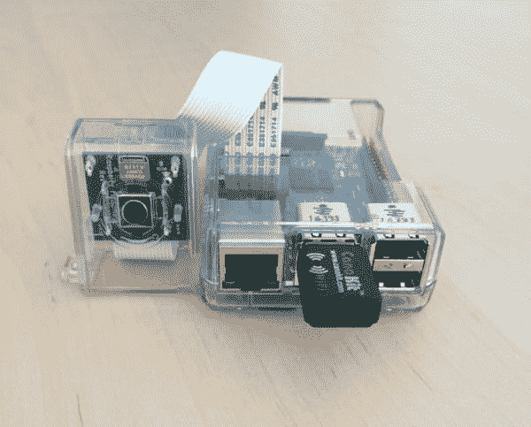
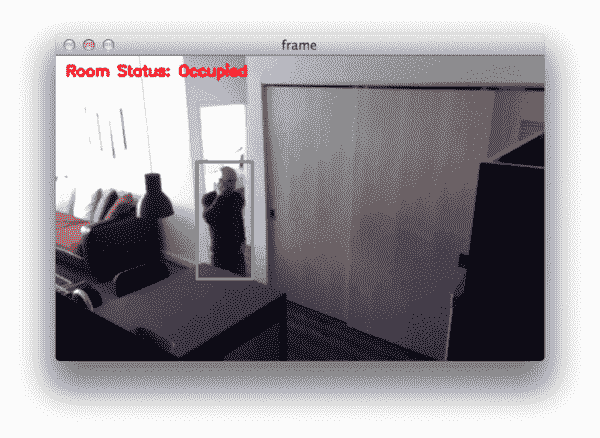
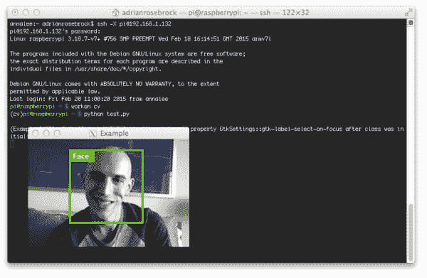

# 在你的 Raspberry Pi 2 和 B+上安装 OpenCV 和 Python

> 原文：<https://pyimagesearch.com/2015/02/23/install-opencv-and-python-on-your-raspberry-pi-2-and-b/>

[](https://pyimagesearch.com/wp-content/uploads/2015/02/raspberry_pi_2_3.jpg)

我的树莓派 2 昨天刚寄到，伙计，这浆果真甜。

这款小巧的个人电脑配备了 900mhz 四核处理器和 1gb 内存，性能强劲。举个例子，Raspberry Pi 2 比我高中计算机实验室的大多数台式机都要快。

无论如何，自从 Raspberry Pi 2 发布以来，我收到了很多请求，要求我提供 OpenCV 和 Python 的详细安装说明。

所以，如果你想让 OpenCV 和 Python 在你的 Raspberry Pi 上运行，不用再犹豫了！

在这篇博文的其余部分，我提供了**树莓 Pi 2 *和*树莓 Pi B+的**详细安装说明**。**

我还为每个步骤提供了**安装时间**。其中一些步骤需要大量的处理时间。例如，在 Raspberry Pi 2 上编译 OpenCV 库大约需要 **2.8 小时**，而在 Raspberry Pi B+上需要 **9.5 小时**，因此请相应地计划您的安装。

最后，值得一提的是，我们将在 [PyImageSearch 大师](https://pyimagesearch.com/pyimagesearch-gurus/)计算机视觉课程中使用 Raspberry Pi。我们的项目将包括家庭监控应用，如检测运动和跟踪房间里的人。

这里有一个快速的例子，当我在我的公寓里走来走去的时候，我可以通过手机来检测运动和跟踪自己:

[](https://pyimagesearch.com/pyimagesearch-gurus/)

# 在你的 Raspberry Pi 2 和 B+上安装 OpenCV 和 Python

**更新:**您现在正在阅读的教程涵盖了如何在***Raspbian wheesy***上安装带有 Python 2.7 和 Python 3 绑定的 OpenCV 3。Raspbian Jessie 现在已经取代了 Raspbian Wheezy，如果这是你第一次阅读本教程*，那么你很可能正在使用 Raspbian Jessie。*请使用以下更新的指南来帮助您在您的 Raspberry Pi 上安装 OpenCV + Python。

*   [如何在 ***拉斯边杰西*** 上安装 OpenCV 3.0？](https://pyimagesearch.com/2015/10/26/how-to-install-opencv-3-on-raspbian-jessie/)
*   [安装指南:Raspberry Pi 3+***Raspbian Jessie***+OpenCV 3。](https://pyimagesearch.com/2016/04/18/install-guide-raspberry-pi-3-raspbian-jessie-opencv-3/)

我将假设您已经开箱并安装了您的 Raspberry Pi 2 或 Raspberry Pi B+。如果你还没有树莓派，我绝对建议你挑一个。它们超级便宜，玩起来很有趣。

就我个人而言，我更喜欢多花一点钱，从 [Canakit](http://www.amazon.com/gp/product/B00G1PNG54/ref=as_li_tl?ie=UTF8&camp=1789&creative=390957&creativeASIN=B00G1PNG54&linkCode=as2&tag=trndingcom-20&linkId=ALHWRQ5K43RPQ4RX) 购买——他们的运输既快速又可靠，加上他们完整的现成包真的很好。

无论如何，让我们进入 OpenCV 和 Python 安装说明。

## 步骤 0:

同样，我将假设您刚刚取消了 Raspberry Pi 2/B+的装箱。打开终端，我们将从更新和升级已安装的软件包开始，然后更新 Raspberry Pi 固件:

```py
$ sudo apt-get update
$ sudo apt-get upgrade
$ sudo rpi-update

```

## 第一步:

安装所需的开发工具和软件包:

```py
$ sudo apt-get install build-essential cmake pkg-config

```

`build-essential`和`pkg-config`可能都已经安装了，但是万一它们没有安装，请确保将它们包含在您的`apt-get`命令中。

**计时:**

**树莓派 B+:** < 2 分钟

**树莓派 2:** < 40 秒

## 第二步:

安装必要的映像 I/O 包。这些软件包允许您加载各种图像文件格式，如 JPEG、PNG、TIFF 等。

```py
$ sudo apt-get install libjpeg8-dev libtiff4-dev libjasper-dev libpng12-dev

```

**计时:**

**树莓派 B+:** < 5 分钟

**树莓派 2:** < 30 秒

## 第三步:

安装 GTK 开发库。该库用于构建图形用户界面(GUI ),并且是 OpenCV 的`highgui`库所必需的，OpenCV 允许您在屏幕上查看图像:

```py
$ sudo apt-get install libgtk2.0-dev

```

**计时:**

**树莓派 B+:** < 10 分钟

**树莓派 2:** < 3 分钟

## 第四步:

安装必要的视频 I/O 包。这些包用于使用 OpenCV 加载视频文件:

```py
$ sudo apt-get install libavcodec-dev libavformat-dev libswscale-dev libv4l-dev

```

**计时:**

**树莓派 B+:** < 5 分钟

**树莓派 2:** < 30 秒

## 第五步:

安装用于优化 OpenCV 中各种操作的库:

```py
$ sudo apt-get install libatlas-base-dev gfortran

```

**计时:**

**树莓派 B+:** < 2 分钟

**树莓派 2:** < 30 秒

## 第六步:

安装`pip`:

```py
$ wget https://bootstrap.pypa.io/get-pip.py
$ sudo python get-pip.py

```

**计时:**

**树莓派 B+:** < 2 分钟

**树莓派 2:** < 30 秒

## 第七步:

安装`virtualenv`和`virtualenvwrapper`:

```py
$ sudo pip install virtualenv virtualenvwrapper
$ sudo rm -rf ~/.cache/pip

```

然后，更新您的`~/.profile`文件以包含以下几行:

```py
# virtualenv and virtualenvwrapper
export WORKON_HOME=$HOME/.virtualenvs
source /usr/local/bin/virtualenvwrapper.sh

```

重新加载您的`.profile`文件:

```py
$ source ~/.profile

```

创建您的计算机视觉虚拟环境:

```py
$ mkvirtualenv cv

```

**计时:**

**树莓派 B+:** < 2 分钟

**树莓派 2:** < 2 分钟

## 第八步:

现在我们可以安装 Python 2.7 开发工具了:

```py
$ sudo apt-get install python2.7-dev

```

***注:**是的，我们要用 Python 2.7。OpenCV 2.4.X 尚不支持 Python 3，OpenCV 3.0 仍处于测试阶段。目前还不清楚 OpenCV 3.0 的 Python 绑定何时会完成，所以我建议暂时坚持使用 OpenCV 2.4.X。*

我们还需要安装 NumPy，因为 OpenCV Python 绑定将图像表示为多维 NumPy 数组:

```py
$ pip install numpy

```

**计时:**

**树莓派 B+:** < 45 分钟

**树莓派 2:** < 15 分钟

## 第九步:

下载 OpenCV 并解压:

```py
$ wget -O opencv-2.4.10.zip http://sourceforge.net/projects/opencvlibrary/files/opencv-unix/2.4.10/opencv-2.4.10.zip/download
$ unzip opencv-2.4.10.zip
$ cd opencv-2.4.10

```

设置版本:

```py
$ mkdir build
$ cd build
$ cmake -D CMAKE_BUILD_TYPE=RELEASE -D CMAKE_INSTALL_PREFIX=/usr/local -D BUILD_NEW_PYTHON_SUPPORT=ON -D INSTALL_C_EXAMPLES=ON -D INSTALL_PYTHON_EXAMPLES=ON  -D BUILD_EXAMPLES=ON ..

```

**计时:**

**树莓派 B+:** < 3 分钟

**树莓派 2:** < 1.5 分钟

编译 OpenCV:

```py
$ make

```

***重要:**确保你在`cv`虚拟环境中，这样 OpenCV 是针对虚拟环境 Python 和 NumPy 编译的。否则，OpenCV 将针对系统 Python 和 NumPy 进行编译，这可能会导致问题。*

**计时:**

**树莓派 B+:** < 9.5 小时

**树莓派 2:** < 2.8 小时

最后，我们可以安装 OpenCV:

```py
$ sudo make install
$ sudo ldconfig

```

**计时:**

**树莓派 B+:** < 3 分钟

**树莓派 2:** < 1 分钟

## 第十步:

如果您已经阅读了本指南，OpenCV 现在应该安装在`/usr/local/lib/python2.7/site-packages`中

但是为了在我们的`cv`虚拟环境中使用 OpenCV，我们首先需要将 OpenCV 符号链接到我们的`site-packages`目录中:

```py
$ cd ~/.virtualenvs/cv/lib/python2.7/site-packages/
$ ln -s /usr/local/lib/python2.7/site-packages/cv2.so cv2.so
$ ln -s /usr/local/lib/python2.7/site-packages/cv.py cv.py

```

## 第十一步:

最后，我们可以测试一下 OpenCV 和 Python 的安装:

```py
$ workon cv
$ python
>>> import cv2
>>> cv2.__version__
'2.4.10'

```

OpenCV 和 Python 现已成功安装在您的 Raspberry Pi 上！

下面是一个例子，我 ssh'ing(带 X11 转发)到我的 Raspberry Pi，然后加载并显示一个图像:

[](https://pyimagesearch.com/wp-content/uploads/2015/02/raspberry_pi_example.jpg)

# 摘要

在这篇博文中，我详细介绍了如何在您的 Raspberry Pi 2 或 Raspberry Pi B+上安装 OpenCV 和 Python。还提供了每个安装步骤的时间，以便您可以相应地计划安装。

随着 Raspberry Pi(以及 Raspbian/NOOBS)的发展，安装说明可能会改变。如果您在安装说明中遇到任何边缘情况或变化，请随时[让我知道](https://pyimagesearch.com/contact/)。虽然我不能保证我能回复每一封邮件，但是我认为在 Raspberry Pi 系统上建立 OpenCV 和 Python 的方法列表是很好的。

在未来的博客文章中，我们将探索如何利用树莓 Pi 的相机插件。

在那之前，看一看 [PyImageSearch 大师计算机视觉课程](https://pyimagesearch.com/pyimagesearch-gurus/)。我们将在课程中的几个项目中使用 Raspberry Pi，包括构建一个可以检测室内运动和人员的家庭监控应用程序。