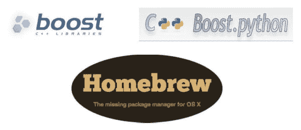

# 用自制软件在 OSX 上安装 boost 和 boost-python

> 原文：<https://pyimagesearch.com/2015/04/27/installing-boost-and-boost-python-on-osx-with-homebrew/>

[](https://pyimagesearch.com/wp-content/uploads/2014/12/logos_header.jpg)

我真的真的希望有人觉得这个资源有用。在过去的几个月里，我浪费了大量的时间(被动地)试图通过自制软件将 [boost](http://www.boost.org/) 和 [boost-python](http://www.boost.org/doc/libs/1_57_0/libs/python/doc/index.html) 安装到我的 OSX 机器上，这简直是折磨人。

别误会，我喜欢自制。如果你在一台 OSX 机器上，而*没有使用[自制软件](http://brew.sh/)，那么我建议你停止阅读这篇文章，现在就安装它。*

无论如何，就像我说的，我希望这篇文章能为其他人节省一些时间和麻烦。虽然这篇文章并不完全是专门针对计算机视觉的，但是如果你正在使用 Python 和 OpenCV 开发基于计算机视觉的应用程序，它仍然非常有意义。

Spotify 的[用于近似最近邻搜索的](https://github.com/spotify/annoy)等软件包在基于内容的图像检索(CBIR)/图像搜索引擎领域有直接应用。

【2015 年 5 月 4 日更新: [埃里克·伯恩哈德森](https://twitter.com/fulhack)发布了一个更新，消除了对 Boost 和 Boost 的依赖。Python 免于烦扰。你现在可以简单地使用 pip: `pip install annoy`安装 angry，而不需要任何额外的依赖。

像 [dlib](http://dlib.net/) 这样的库提供了 Python 绑定，因此您可以从 Python shell 中利用 dlib 的能力。

aroy 和 dlib 只是需要使用 boost 的包的两个例子(如果需要 python 绑定，还需要 boost-python)。

无论如何，让我们开始这个教程吧——我已经浪费了足够多的时间来解决这个问题，我也不想浪费你的时间！

# 什么是自制？

[家酿](http://brew.sh/)是“OSX 缺失的包装经理”。它使得安装和管理默认苹果安装的软件包*而不是*变得轻而易举，就像 Debian `apt-get`一样。

注意:将家酿和 apt-get 进行比较并不完全公平，但是如果这是你第一次听说家酿，这种比较就足够了。

# 什么是 boost 和 boost-python？

Boost 是一个经过同行评审的(也就是非常高质量的)C++库的集合，它可以帮助程序员和开发人员避免重复劳动。Boost 提供了线性代数、多线程、基本图像处理和单元测试等实现。

同样，这些图书馆是同行评审的，质量非常高。大量的 C++应用程序，尤其是在科学领域，都以某种方式依赖于 Boost 库。

我们还有 [boost-python](http://www.boost.org/doc/libs/1_57_0/libs/python/doc/index.html) ，它提供了 C++和 python 编程语言之间的互操作性。

这为什么有用？

好吧，假设你正在实现一个近似最近邻算法(就像 [Spotify 的 asury](https://github.com/spotify/annoy))并且你想提供纯粹的、普通的 Python 支持。

然而，您希望从库中榨出最后一点内存和 CPU 性能，所以您决定在 C++中实现性能关键部分。

为此，您可以使用 boost 在 C++中编写这些关键任务，然后使用 boost-python 与 Python 编程语言进行交互。

事实上，这正是骚扰包所做的。虽然这个包是 pip 可安装的，但是它需要 boost 和 boost-python 才能被编译和安装。

# 用自制软件在 OSX 上安装 boost 和 boost-python

现在我们已经有了一些基本的术语，让我们继续安装我们的软件包。

## 步骤 1:安装自制软件

安装家酿不能更容易。

只需进入 [Homebrew](http://brew.sh/) 主页，将以下代码复制并粘贴到您的终端中:

```py
$ ruby -e "$(curl -fsSL https://raw.githubusercontent.com/Homebrew/install/master/install)"

```

*注:* *这篇博文写于 2015 年 1 月。一定要访问家酿主页，使用家酿社区提供的最新安装脚本。*

## 第二步:更新自制软件

现在您已经安装了 Homebrew，您需要更新它并获取最新的包(即“formula”)定义。这些公式只是关于如何安装给定库或包的简单说明。

要更新 Homebrew，只需:

```py
$ brew update

```

## 步骤 3:安装 Python

用系统 Python 作为你的主要解释器是不好的形式。如果你打算使用 [virtualenv](http://docs.python-guide.org/en/latest/dev/virtualenvs/) ，这一点尤其正确。

在我们继续之前，让我们通过 brew 安装 Python:

```py
$ brew install python

```

## 步骤 4:安装 boost

到目前为止一切顺利。但是现在是时候安装 boost 了。

这是你真正需要开始注意的地方。

要安装 boost，请执行以下命令:

```py
$ brew install boost --with-python

```

你看到那面旗了吗？

是的，别忘了——这很重要。

在我的例子中，我认为已经安装了 boost-python，给出了`--with-python`标志。

显然事实并非如此。您还需要显式安装 boost-python。否则，当您试图从 Python 内部调用一个期望找到 boost 绑定的包时，就会出现可怕的 segfault 错误。

此外，在 boost 下载、编译和安装时，您可能想出去散散步。这是一个很大的图书馆，如果你热衷于优化你工作日的时间(像我一样)，那么我强烈建议你转换环境，做一些其他的工作。

## 步骤 5:安装 boost-python

既然已经安装了 boost，我们也可以安装 boost-python 了:

```py
$ brew install boost-python

```

boost-python 包的安装速度应该比 boost 快得多，但是您可能还是想为自己泡一杯咖啡，尤其是如果您的系统很慢的话。

## 步骤 6:确认安装了 boost 和 boost-python

确保安装了 boost 和 boost-python:

```py
$ brew list | grep 'boost'
boost
boost-python

```

从我的终端输出可以看到，boost 和 boost-python 都已经成功安装(当然前提是你没有从上面的步骤中得到任何错误)。

# 已经在用 Python + virtualenv 了？继续读。

哦，你以为我们结束了？

我也是。天哪，那是个错误。

因为你猜怎么着？如果你已经安装了 Python 并且正在使用 [virtualenv](http://docs.python-guide.org/en/latest/dev/virtualenvs/) (在我的例子中是 [virtualenvwrapper](https://virtualenvwrapper.readthedocs.org/en/latest/) )，你还有一些工作要做。

*注意:如果你还没有使用`virtualenv`和`virtualenvwrapper`来管理你的 Python 包，这是你应该认真考虑的事情。相信我，这让你的生活变得简单多了。*

## 新虚拟环境:

如果你正在创建一个新的虚拟环境，你就可以开始了。不需要额外的工作，一切都将顺利开箱。

## 现有虚拟设备:

**那么让我告诉你一些你已经知道的事情:**当我们构建一个虚拟环境时，我们的 Python 可执行文件，连同相关的库、includes 和 site-packages 被克隆并隔离到它们自己的独立环境中。

**让我告诉你一些你可能不知道的事情:**如果你在编译和安装 boost 和 boost-python 之前已经有了你的 virtualenv 设置*(像我一样)，那么你将不能访问你的 boost 绑定。*

那么解决这个问题的最好方法是什么呢？

老实说，我不确定什么是*【最佳】*方式。一定有比我提议的更好的方法。但是我是这样解决这个问题的:

1.  为我的 virtualenv 生成了一个`requirements.txt`
2.  停用并删除了我的虚拟
3.  再造了我的虚拟人生
4.  那件事就此了结吧

执行完这些步骤后，您的新 virtualenv 将拥有 boost-python 绑定。希望你不会像我一样浪费太多时间。

# 一个恼人例子

现在我们已经安装了 boost 和 boost-python，让我们使用[骚扰包](https://github.com/spotify/annoy)对它们进行测试。

【2015 年 5 月 4 日更新:正如我在这篇文章的顶部提到的，[埃里克·伯恩哈德森](https://twitter.com/fulhack)发布了一个更新，消除了对 Boost 和 Boost 的依赖。Python 免于烦扰。你现在可以简单地安装恼人的使用画中画没有一个有助推或助推。Python 已安装。

让我们从使用 virtualenvwrapper 创建 virtualenv 开始:

```py
$ mkvirtualenv annoy
...
$ pip install numpy annoy
...

```

现在我们的包已经安装好了，让我们用 128-D 创建 1，000 个随机向量。我们将把这些向量传递给 Annoy，并使用 10 棵树构造我们的嵌入:

```py
>>> import numpy as np
>>> M = np.random.normal(size=(1000, 128))
>>> from annoy import AnnoyIndex
>>> ann = AnnoyIndex(128)
>>> for (i, row) in enumerate(M):
...     ann.add_item(i, row.tolist())
... 
>>> ann.build(10)

```

现在我们的嵌入已经创建好了，让我们找到列表中第一个向量的 10 个(近似)最近的邻居:

```py
>>> ann.get_nns_by_item(0, 10)
[0, 75, 934, 148, 506, 915, 392, 849, 602, 95]

```

我们还可以找到不属于索引的最近邻居:

```py
>>> ann.get_nns_by_vector(np.random.normal(size=(128,)).tolist(), 10)
[176, 594, 742, 215, 478, 903, 516, 413, 484, 480]

```

那么，如果您试图在没有安装 boost 和 boost-python 的情况下执行这段代码，会发生什么情况呢？

您的代码会在`get_nns_by_item`和`get_nns_by_vector`函数中出现 segfault。如果您使用的是 [dlib](http://dlib.net/) ，那么您会在导入过程中出现 segfault。一定要牢记在心。如果你在运行这些函数的时候出现了问题，那么你的 boost 和 boost-python 安装就有问题了。

# 摘要

在这篇博文中，我回顾了如何使用自制软件在 OSX 上安装 [boost](http://www.boost.org/) 和 [boost-python](http://www.boost.org/doc/libs/1_57_0/libs/python/doc/index.html) 。

就我个人而言，我在几个月的时间里被动地处理这个问题，浪费了大量的时间——这篇文章的目的是(希望)帮助你节省时间，避免任何痛苦和挫折。

如果你知道一个更好的方法来解决这个问题，请在评论中告诉我，或者发邮件给我！