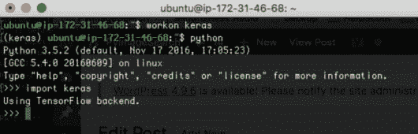
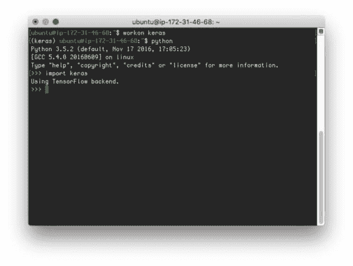
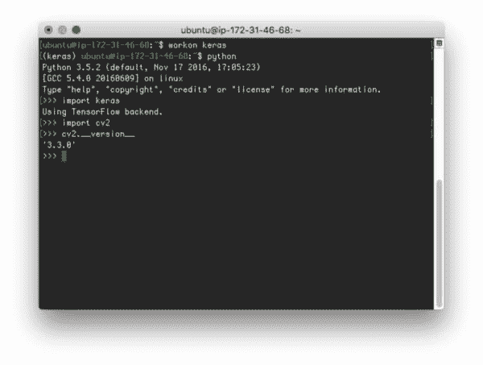

# 为深度学习安装 Keras

> 原文：<https://pyimagesearch.com/2016/07/18/installing-keras-for-deep-learning/>

[](https://pyimagesearch.com/wp-content/uploads/2016/07/install_keras_header.jpg)

这篇博文的目的是演示如何安装用于深度学习的 [Keras](https://github.com/fchollet/keras) 库。安装程序将显示如何安装 Keras:

*   *借助* GPU 支持，您可以利用您的 GPU、CUDA 工具包、cuDNN 等。，用于更快的网络训练。
*   没有 GPU 的支持，所以即使你没有一个用于训练神经网络的 GPU，你仍然可以跟着做。

先说 Keras 是我的*最爱*深度学习 Python 库。这是一个极简的模块化神经网络库，可以使用**tensor flow 或 Theano 作为后端。**

 **此外，Keras *背后的主要动机真的*引起了我的共鸣:**你应该能够超快地实验*——尽可能快地从想法到结果*。****

 *来自一个混合了学术界和企业家的世界，快速迭代的能力非常有价值，尤其是在深度学习领域，训练一个*单一模型可能需要几天到几周的时间。*

在接下来的 PyImageSearch 博客文章中，我将会大量使用 Keras*,所以请确保您按照本教程在您的机器上安装 Keras！*

 *## 为深度学习安装 Keras

我将假设您已经关注了这一系列关于设置深度学习开发环境的博文:

*   [如何安装用于深度学习的 CUDA 工具包和 cuDNN】](https://pyimagesearch.com/2016/07/04/how-to-install-cuda-toolkit-and-cudnn-for-deep-learning/)
*   [编译支持 CUDA 的 OpenCV](https://pyimagesearch.com/2016/07/11/compiling-opencv-with-cuda-support/)

我将使用我在以前的教程中使用的运行 Ubuntu 16.04 的 Amazon EC2 p2.xlarge 实例——也可以随意使用你一直使用的同一台机器。

总的来说，安装 Keras 是一个 4 步的过程，其中三步是可选的。

可选的第一步是你是否愿意使用 Python 虚拟环境— *我建议你使用*，但是这个决定完全取决于你。

第二个可选步骤是你是否想使用 GPU 来加速训练你的神经网络——这显然取决于你是否拥有一个兼容 CUDA 的 GPU。Keras 库可以很好地在 CPU 上运行，但如果你真的想训练深度神经网络，你会想得到一个 GPU 安装设置。

最后一个可选步骤是，您是否希望在您的 Python 虚拟环境中有 OpenCV 绑定以及 Keras 安装。如果你这样做了，你会想要注意**步骤#4** 。

说了这么多，让我们开始吧！

### 步骤 1:创建一个单独的 Python 虚拟环境(可选)

如果你一直在关注这一系列的帖子，那么你已经知道我喜欢使用 Python 虚拟环境。当我们开始与各种深度学习库(Keras、mxnet、TensorFlow 等)合作时，利用虚拟环境*尤其重要*。)和版本问题很容易*发生*(特别是围绕 TensorFlow 使用哪个版本)。

由于与冲突库版本相关的问题，我建议为基于 Keras 的项目专门创建一个虚拟环境:

```py
$ mkvirtualenv keras -p python3

```

这将创建一个名为`keras`的 Python 虚拟环境。任何时候您想要访问这个虚拟环境，只需使用`workon`命令，后跟虚拟环境的名称:

```py
$ workon <virtual env name>

```

在这种情况下，我们可以通过执行以下命令来访问`keras`虚拟环境:

```py
$ workon keras

```

### Step #2: Install Keras

安装 Keras 是一件轻而易举的事情，它可以为我们完成所有的艰苦工作。首先，我们需要安装一些依赖项:

```py
$ pip install numpy scipy
$ pip install scikit-learn
$ pip install pillow
$ pip install h5py

```

我们还需要安装[张量流](https://www.tensorflow.org/)。您当然可以使用`pip`来安装 TensorFlow:

```py
$ pip install tensorflow

```

**已经[安装 CUDA 和 cuDNN](https://pyimagesearch.com/2017/09/27/setting-up-ubuntu-16-04-cuda-gpu-for-deep-learning-with-python/) 的 GPU 用户**可以安装带 pip 的 TensorFlow 的 GPU 版本:

```py
$ pip install tensorflow-gpu

```

从那里，我们也可以使用`pip`来安装 Keras:

```py
$ pip install keras

```

Keras 完成安装后，您可以通过打开一个终端，访问`keras`虚拟环境，然后导入库来验证安装(参见**步骤#3** 中如何操作的示例)。

### 步骤 OpenCV 中的符号链接(可选)

如果您想从`keras`虚拟环境中访问 OpenCV 绑定，您需要将`cv2.so`文件符号链接到`keras`的`site-packages`目录中:

```py
$ ls /usr/local/lib/python3.6/site-packages/
cv2.cpython-36m-x86_64-linux-gnu.so
$ cd /usr/local/lib/python3.6/site-packages/
$ mv cv2.cpython-36m-x86_64-linux-gnu.so cv2.so
$ cd ~/.virtualenvs/keras/lib/python3.6/site-packages/
$ ln -s /usr/local/lib/python3.6/site-packages/cv2.so cv2.so
$ cd ~

```

正如我在[上周的教程](https://pyimagesearch.com/2016/07/11/compiling-opencv-with-cuda-support/)中所详述的，编译安装 OpenCV 后，我的`cv2.so`绑定在`/usr/local/lib/python3.6/site-packages/cv2.cpython-36m-x86_64-linux-gnu.so`中被发现。根据您在自己的系统上安装 OpenCV 的方式，您的`cv2.so`绑定可能位于不同的位置。如果您不记得您的`cv2.so`绑定在哪里，或者如果您不再有您的 CMake 输出(哪个*指示了*绑定将被存储在哪里)，您可以使用`find`实用程序来帮助定位它们:

```py
$ cd /
$ sudo find . -name '*cv2*.so*'
./usr/local/lib/python3.6/site-packages/cv2.cpython-36m-x86_64-linux-gnu.so
./home/adrian/.virtualenvs/cv/lib/python3.6/site-packages/cv2.so

```

同样，这是一个完全可选的步骤，如果您想从`keras`虚拟环境访问 OpenCV，只需*完成*。

### 步骤 4:测试安装

要验证 Keras 是否已经安装，请访问`keras`虚拟环境，打开一个 Python shell，并导入它:

```py
$ workon keras
$ python
>>> import keras
>>>

```

下面是我自己的 EC2 实例的截图:

[](https://pyimagesearch.com/wp-content/uploads/2016/07/install_keras_import_keras.jpg)

**Figure 1:** Installing the Keras Python library for deep learning.

请注意，正在使用 TensorFlow 后端。

还要注意正在使用的 GPU，在本例中是安装在 Amazon EC2 p2.xlarge 实例上的 K80。关于我如何安装 CUDA 工具包和 cuDNN 的更多信息，[请看这篇博文](https://pyimagesearch.com/2017/09/27/setting-up-ubuntu-16-04-cuda-gpu-for-deep-learning-with-python/)。

可选地，如果您执行了**步骤#3** ，并且想要测试您的 OpenCV sym-link，也尝试将您的 OpenCV 绑定导入到`keras`虚拟环境中:

[](https://pyimagesearch.com/wp-content/uploads/2016/07/install_keras_import_opencv.jpg)

**Figure 2:** Importing OpenCV and Keras together for deep learning with Python.

至此，您应该能够将 Keras 和 OpenCV 导入到同一个 Python 虚拟环境中。花一点时间祝贺你自己——你现在已经有了开始构建深度神经网络的所有构建模块！

## 摘要

在今天的博文中，我演示了如何安装深度学习的 Keras Python 包。

在未来的 PyImageSearch 博客帖子中，我们将广泛使用 Keras 库*，所以我强烈建议您在您的机器上安装 Keras，即使它只是 CPU 版本——这将使您能够在未来的深度学习 PyImageSearch 教程中跟随。*

 *下周，我们将通过研究*卷积*，它们是什么，它们如何工作，*，以及你如何在你的计算机视觉应用中使用它们*(无论你是否意识到这一点)，在我们的深度学习之旅中迈出另一步。

请务必使用下面的表格注册 PyImageSearch 时事通讯——你一定不想错过即将发布的关于 convolutions 的帖子！*****