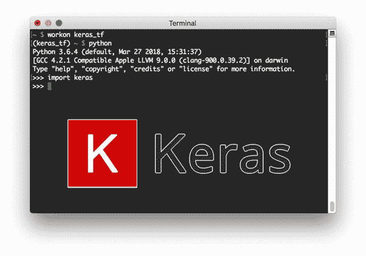
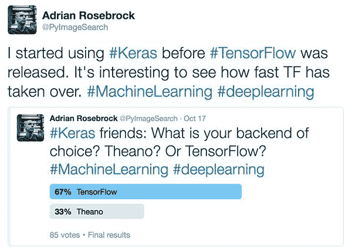
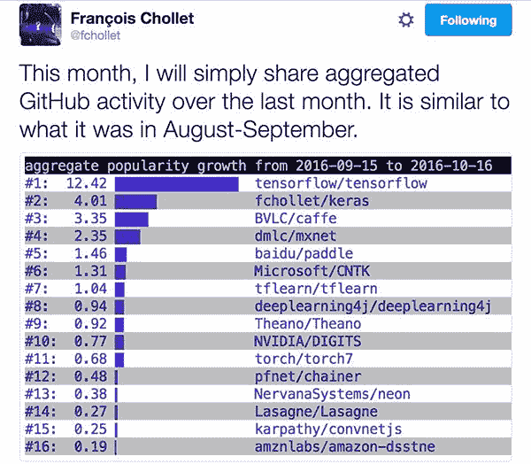
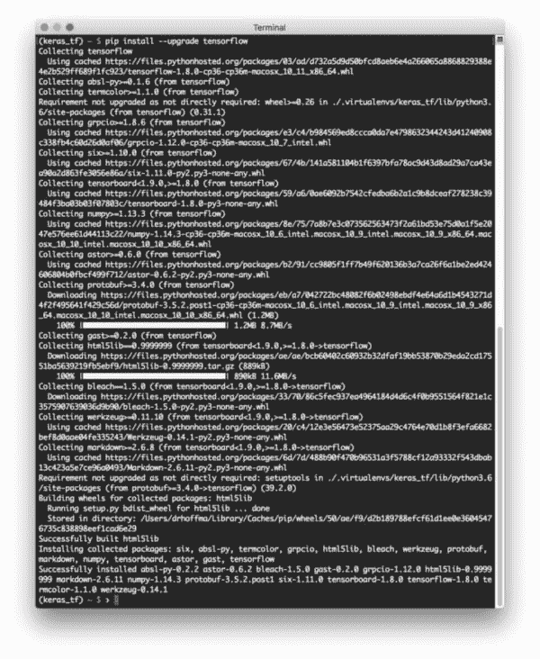

# 使用 TensorFlow 后端安装 Keras

> 原文：<https://pyimagesearch.com/2016/11/14/installing-keras-with-tensorflow-backend/>



几个月前，我演示了如何用 T2 后端安装 Keras 深度学习库。

在今天的博文中，我提供了详细的分步说明，使用最初由谷歌大脑团队的研究人员和工程师开发的 *[TensorFlow](https://www.tensorflow.org/)* 后端安装 Keras。

我还将(可选地)演示如何将 OpenCV 集成到这个设置中，以实现成熟的计算机视觉+深度学习开发环境。

要了解更多，就继续阅读。

## 使用 TensorFlow 后端安装 Keras

这篇博文的第一部分提供了对 Keras 后端的简短讨论，以及为什么我们应该(或不应该)关心我们正在使用的后端。

在那里，我提供了详细的说明，您可以使用 TensorFlow 后端在自己的系统上安装机器学习的 Keras。

### TensorFlow？Theano？谁在乎呢。

在讨论开始时，有一点很重要，那就是 Keras 只是一个更复杂的数值计算引擎的*包装器*，比如 [TensorFlow](https://www.tensorflow.org/) 和 [Theano](http://deeplearning.net/software/theano/) 。

Keras *抽象掉了*构建深度神经网络的大部分复杂性，给我们留下了一个非常简单、漂亮、易于使用的界面来快速构建、测试和部署深度学习架构。

说到 Keras，你有两个后端引擎选择——要么是 *TensorFlow* 要么是*the no*。Theano 比 TensorFlow 更老，最初是为 Keras 选择后端时唯一的*选择。*

那么，为什么你可能想在不同的后端使用 TensorFlow(比如不再开发的 Theano)？

简而言之，TensorFlow 极其*灵活*，允许您将网络计算部署到多个 CPU、GPU、服务器，甚至移动系统，而无需更改*一行*代码。

这使得 TensorFlow 成为以架构不可知的方式训练*分布式*深度学习网络的绝佳选择，这是 ano(目前)不提供的。

老实说，我在 TensorFlow 发布(甚至有传言称其存在)之前很久就开始使用 Keras*——那是在 Theano 是后端唯一可能的选择的时候。*

我还没有太多的考虑 Theano 或 TensorFlow 是否应该成为我的“目标”后端。我需要它的时候，它工作得很好，所以为什么要换呢？

当我在 Twitter 上运行[最近的民意调查，询问我的粉丝在使用 Keras 时他们更喜欢哪个后端时，我的眼睛开始睁开了:](https://twitter.com/PyImageSearch/status/788658742837469184)



**Figure 1:** I polled my Twitter followers ([@pyimagesearch](https://twitter.com/PyImageSearch)) to determine whether they preferred using Theano or TensorFlow as their Keras backend.

67%的受访者表示他们正在使用 TensorFlow 作为后端。老实说，我很惊讶。作为 Keras 的长期用户，我怎么可能是少数呢？

这 67%的受访者可能会动摇，因为 TensorFlow 现在是安装 Keras 时的*默认后端*…或者可能是因为我的许多追随者发现 TensorFlow 是一个更好、更有效的后端(并使用更多 TensorFlow 特定功能)。

不管确切的推理是什么，有一件事你不能否认: ***TensorFlow 会一直存在。***

如果你需要进一步的证明，你需要做的就是看一看来自 Fran ois Chollet(Keras 的创建者和维护者)的这个深度学习 GitHub 活动分析:



**Figure 2:** TensorFlow tops the charts as the deep learning library with most GitHub activity. Keras follows at #2 with Theano all the way at #9.

正如我们所看到的，TensorFlow 遥遥领先于排行榜第一名，而 Theano 排名第九。

虽然 Keras 让我们切换后端变得很简单(我们需要做的只是安装各自的后端并编辑一个简单的 JSON 配置文件)，但我们仍然需要注意趋势告诉我们的东西:***tensor flow 将在(不久的)未来继续成为首选的 Keras 后端。***

***更新 2018-06-04:****[the ano 不再被积极开发(公告 2017-09-29)](https://groups.google.com/forum/#!topic/theano-users/7Poq8BZutbY) 而且如你所料，TensorFlow 现在是默认的。*

### 步骤 1:设置 Python 虚拟环境

如果你曾经读过我以前的任何教程(无论是 OpenCV，CUDA，Keras 等。)你可能已经意识到，我是使用 Python 虚拟环境的《T2》的超级粉丝。

当在深度学习生态系统中工作时，我特别推荐 Python 虚拟环境。许多基于 Python 的深度学习库需要各种依赖的不同版本。

例如，如果你想一起使用 Keras + Theano，你需要最新版本的 Theano(例如，他们最新的 GitHub commit，并不总是发布在 PyPI 上的版本)。

但是，如果您想尝试 scikit-theano 之类的库，您需要一个与 Keras 不兼容的早期版本的 theano。

当您开始添加其他 Python 库时，依赖版本问题只会变得更加复杂，特别是深度学习库(如 TensorFlow)，这些库本质上是不稳定的(因为深度学习是一个快速发展的领域，每天都有更新和新功能被推送到网上)。

解决办法？

***使用 Python 虚拟环境。***

我不会大谈 Python 虚拟环境的好处([，因为我已经在这篇博文的前半部分](https://pyimagesearch.com/2016/05/02/accessing-rpi-gpio-and-gpio-zero-with-opencv-python/)中谈过了)，但是要点是，通过使用 Python 虚拟环境，你可以为你的项目的*每个*创建一个*单独的、隔离的* Python 环境，确保每个 Python 环境相互*独立*。这样做可以让你完全避免版本依赖问题。

我将假设您的系统上已经安装了 [virtualenv](https://virtualenv.pypa.io/en/stable/) 和 [virtualenvwrapper](https://virtualenvwrapper.readthedocs.io/en/latest/) (如果没有，两者都是 pip 可安装的，只需要对您的 shell 配置进行小的更新；请点击上面的链接了解更多信息)。

安装 virtualenv 和 virtualenvwrapper 后，让我们为基于 Keras + TensorFlow 的项目专门创建一个 Python 3 虚拟环境*和*:

```py
$ mkvirtualenv keras_tf -p python3

```

我将这个虚拟环境命名为`keras_tf`为 *Keras + TensorFlow* (我也有一个虚拟环境命名为`keras_th`为 *Keras + Theano* )。

每当您需要访问给定的 Python 虚拟环境时，只需使用`workon`命令:

```py
$ workon <virtual_env_name>

```

在这种特殊情况下，我们可以使用以下方式访问`keras_tf`虚拟环境:

```py
$ workon keras_tf

```

同样，虽然这是一个可选的步骤，但我真的鼓励你花时间正确地设置你的开发环境，如果你甚至是*远程*认真地使用 Python 编程语言进行深度学习研究、实验或开发的话——**虽然这是更多的前期工作，*从长远来看，你会感谢我的。***

### Step #2: Install TensorFlow

安装 TensorFlow 非常简单，因为`pip`将为我们完成所有繁重的工作:

```py
$ pip install --upgrade tensorflow

```

下面你可以看到 TensorFlow 正在下载安装的截图:

[](https://pyimagesearch.com/wp-content/uploads/2016/11/keras_tf_install_process.jpg)

**Figure 3:** Installing TensorFlow for deep learning via pip into my Python virtual environment.

假设您的 TensorFlow 安装已正确退出，您现在可以通过打开 Python shell 并尝试导入`tensorflow`包来测试安装:

```py
$ python
>>> import tensorflow
>>>

```

### Step #3: Install Keras

安装 Keras 甚至比安装 TensorFlow 更容易。

首先，让我们安装一些 Python 依赖项:

```py
$ pip install numpy scipy
$ pip install scikit-learn
$ pip install pillow
$ pip install h5py

```

其次是安装`keras`本身:

```py
$ pip install keras

```

就是这样！Keras 现已安装在您的系统上！

### 步骤 4:验证您的 keras.json 文件配置正确

在我们深入之前，我们应该检查一下我们的`keras.json`配置文件的内容。你可以在`~/.keras/keras.json`中找到这个文件。

用你最喜欢的文本编辑器打开它，看看里面的内容。默认值应该如下所示:

```py
{
    "floatx": "float32",
    "epsilon": 1e-07,
    "backend": "tensorflow",
    "image_data_format": "channels_last"
}

```

具体来说，您需要确保将`image_data_format`设置为`"channels_last"`(表示使用 TensorFlow 图像维度排序，而不是将`"channels_first"`设置为“无”)。

你还需要确保`backend`被正确地设置为`tensorflow`(而不是`theano`)。同样，*默认的 Keras 配置应该满足这两个*要求，但仔细检查一下也无妨。

对配置文件进行任何必要的更新(如果有)，然后退出编辑器。

#### 关于`image_data_format`的快速说明

你可能想知道`image_data_format`到底控制什么。

使用 TensorFlow，图像被表示为具有形状*(高度、宽度、深度)*的 NumPy 数组，其中深度是图像中通道的数量。

但是，如果您使用的是 Theano，图像将被假定为用*(深度、高度、宽度)*表示。

这种细微差别是使用 Keras 时 ***许多令人头疼的*** 的来源(以及许多寻找这些特定配置的`if`声明)。

如果您在使用 Keras 时得到奇怪的结果(或与给定张量的形状相关的错误消息),您应该:

1.  检查你的后端。
2.  确保您的映像维度排序与后端相匹配。

#### 找不到您的 keras.json 文件？

在大多数系统中，直到你打开 Python shell 并直接导入`keras`包本身，才会创建`keras.json`文件(以及相关的子目录)*。*

如果您发现`~/.keras/keras.json`文件*在您的系统*上不存在，只需打开一个 shell，(可选地)访问您的 Python 虚拟环境(如果您正在使用虚拟环境)，然后导入 Keras:

```py
$ workon keras_tf
$ python
>>> import keras
>>> quit()

```

从那里，您应该看到您的`keras.json`文件现在存在于您的本地磁盘上。

如果您在导入`keras`时发现任何错误，请返回到本节的顶部，确保您的`keras.json`配置文件已经正确更新。

### 步骤 OpenCV 中的符号链接(可选)

这一步完全是可选的，但是如果您的系统上安装了 OpenCV，并且想要从 Python 虚拟环境中访问 OpenCV 绑定，您首先需要将`cv2.so`文件符号链接到您的环境的`site-packages`目录。

为此，首先要找到您的`cv2.so`绑定在系统中的位置:

```py
$ cd /
$ sudo find . -name '*cv2.so*'
./Users/adrianrosebrock/.virtualenvs/cv/lib/python3.6/site-packages/cv2.so
./Users/adrianrosebrock/.virtualenvs/gurus/lib/python3.6/site-packages/cv2.so
./Users/adrianrosebrock/.virtualenvs/keras_th/lib/python3.6/site-packages/cv2.so
./usr/local/lib/python3.6/site-packages/cv2.so

```

如果您从源代码构建 OpenCV(除非您指定了一个定制的 OpenCV 安装目录)，您将需要寻找 OpenCV 的*全局安装*，它通常在`/usr/local/lib`目录中。

***注意:**我的`find`命令返回的其他`cv2.so`文件只是简单的符号链接回`/usr/local/lib`中原来的`cv2.so`文件。*

从那里，将目录更改为 Python 虚拟环境的`site-packages`目录(在本例中是`keras_tf`环境)并创建 sym-link:

```py
$ cd ~/.virtualenvs/keras_tf/lib/python3.6/site-packages/
$ ln -s /usr/local/lib/python3.6/site-packages/cv2.so cv2.so
$ cd ~

```

同样，这一步完全是可选的，只有当您想从`keras_tf`虚拟环境中访问 OpenCV 时才需要这样做。

### 步骤 6:测试 Keras + TensorFlow 安装

要验证 Keras + TensorFlow 是否已经安装，只需使用`workon`命令访问`keras_tf`环境，打开一个 Python shell，并导入`keras`:

```py
(keras_tf) ~ $ python
Python 3.6.4 (default, Mar 27 2018, 15:31:37) 
[GCC 4.2.1 Compatible Apple LLVM 9.0.0 (clang-900.0.39.2)] on darwin
Type "help", "copyright", "credits" or "license" for more information.
>>> import keras
Using TensorFlow backend.
>>>

```

具体来说，您可以在导入 Keras 时看到文本`Using TensorFlow backend`显示——这成功地证明了 Keras 已经安装了 TensorFlow 后端。

如果您执行了可选的**步骤#5** 并且想要测试您的 OpenCV sym-link，也尝试导入您的 OpenCV 绑定:

```py
(keras_tf) ~ $ python
Python 3.6.4 (default, Mar 27 2018, 15:31:37) 
[GCC 4.2.1 Compatible Apple LLVM 9.0.0 (clang-900.0.39.2)] on darwin
Type "help", "copyright", "credits" or "license" for more information.
>>> import keras
Using TensorFlow backend.
>>> import cv2
>>>

```

如果你得到一个关于 OpenCV 找不到的错误信息，那么你需要仔细检查你的符号链接，确保它指向一个有效的文件。

## 摘要

在今天的博文中，我演示了如何使用 TensorFlow 后端安装 Keras 深度学习库。

在为 Keras 选择后端时，你需要考虑几个方面。

第一个是*流行度*，因此是一个给定的库在未来继续被更新和支持的*概率*。在这种情况下，TensorFlow 轻而易举地赢得了胜利——它是目前世界上最受欢迎的用于机器学习和深度学习的数值计算引擎。

其次，你需要考虑给定库的*功能*。虽然 Theano 与 TensorFlow 一样易于使用(就 Keras 后端而言)，但 TensorFlow 允许更不受架构限制的部署。通过使用 TensorFlow，无需更改一行代码，就可以跨 CPU、GPU 和其他设备训练*分布式*深度学习网络。

自从 2017 年 9 月 *Theano 开发正式停止*后，我就全面转投 TensorFlow，不回头了。

如果你喜欢这个安装教程，并发现它很有帮助，一定要在评论中留下你的笔记！

**如果您希望在 PyImageSearch 博客上发布新博文时收到电子邮件更新，*请在下表中输入您的电子邮件地址。***