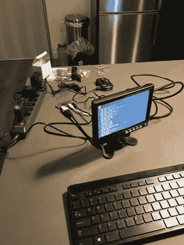
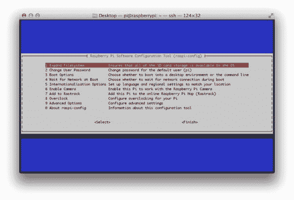
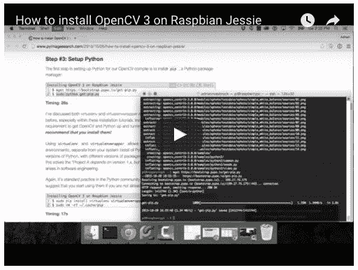

# 在您的 Raspberry Pi Zero 上安装 OpenCV

> 原文：<https://pyimagesearch.com/2015/12/14/installing-opencv-on-your-raspberry-pi-zero/>

[](https://pyimagesearch.com/wp-content/uploads/2015/12/raspberry_pi_zero_setup.jpg)

在这篇博文中，我将演示如何在[树莓 Pi Zero](https://www.raspberrypi.org/blog/raspberry-pi-zero/) 上安装 OpenCV 3。

由于我已经在 ***[多篇、之前的博文](https://pyimagesearch.com/opencv-tutorials-resources-guides/)*** 中介绍了如何在树莓 Pi 上安装 OpenCV，所以我将把这篇博文放在较短的一边，只详述启动和运行 OpenCV 所必需的相关命令。关于如何在你的 Pi 上安装 OpenCV 3 的更详细的讨论(以及一个 *22 分钟的视频安装指南*，请参考[这篇文章](https://pyimagesearch.com/2015/10/26/how-to-install-opencv-3-on-raspbian-jessie/)。

我还将在本安装指南中做出以下假设:

*   您使用的是 ***Raspberry Pi 零硬件*** (因此每个命令提供的时间将匹配)。
*   你有 ***Raspbian 杰西*** 安装在你的圆周率为零。
*   你要用 ***Python 2.7 绑定*** 安装 ***OpenCV v3.0*** (对于 Python 3 的支持，[见本帖](https://pyimagesearch.com/2015/10/26/how-to-install-opencv-3-on-raspbian-jessie/))。

同样，我已经介绍了如何在多种 Raspberry Pi 平台和 Raspbian 风格平台上安装 OpenCV——本教程的主要目标是在您的 Pi Zero 上安装并运行 OpenCV，这样您就可以开始学习计算机视觉、图像处理和 OpenCV 库。

## 在您的 Raspberry Pi Zero 上安装 OpenCV

如果你还没有看过树莓派 Zero(T1 ),这是一款非常酷的硬件。它包含一个单核 1GHz ARM 处理器。512 兆内存。*它比信用卡还小。*

但最精彩的部分呢？

***只要 5 美元！***

虽然 Pi Zero 对于高级视频处理来说不够快，但它仍然是一个很好的工具，可以用来学习计算机视觉和 OpenCV 的基础知识。

### 步骤#1:扩展文件系统

如果你使用的是全新安装的 Raspbian Jessie，那么你要做的第一件事就是确保你的文件系统已经扩展到包括你的 micro-SD 卡上的所有可用空间:

```py
$ sudo raspi-config

```

选择第一个选项 *"1。展开文件系统"*，向下箭头指向*"完成"*，并重启您的 Pi:

[](https://pyimagesearch.com/wp-content/uploads/2015/12/raspberry_pi_zero_expand_filesystem.jpg)

**Figure 1:** Expanding the filesystem on your Raspberry Pi Zero.

重新启动后，您的文件系统将被扩展到包括 micro-SD 卡上的所有可用空间。

### 步骤 2:安装依赖项

我已经在[以前的帖子](https://pyimagesearch.com/2015/10/26/how-to-install-opencv-3-on-raspbian-jessie/)中讨论了这些依赖项，所以我将只提供一个简短的描述，命令本身，以及执行每个命令 所花费的 ***时间，这样你就可以相应地计划你的 OpenCV 安装(仅 OpenCV 的编译就需要 *9 个多小时*)。***

首先，我们需要更新和升级我们现有的软件包:

```py
$ sudo apt-get update
$ sudo apt-get upgrade

```

**计时:2 分 29 秒**

安装我们的开发工具:

```py
$ sudo apt-get install build-essential cmake pkg-config

```

**计时:49 秒**

让我们获取映像 I/O 包并安装它们:

```py
$ sudo apt-get install libjpeg-dev libtiff5-dev libjasper-dev libpng12-dev

```

**计时:36s**

以及一些视频 I/O 包(尽管您不太可能使用 Raspberry Pi Zero 进行大量视频处理):

```py
$ sudo apt-get install libavcodec-dev libavformat-dev libswscale-dev libv4l-dev
$ sudo apt-get install libxvidcore-dev libx264-dev

```

**计时:36s**

我们需要为 OpenCV 的 GUI 界面安装 GTK 开发库:

```py
$ sudo apt-get install libgtk2.0-dev

```

**计时:2 分 57 秒**

让我们来看看 OpenCV 利用的几个例行优化包:

```py
$ sudo apt-get install libatlas-base-dev gfortran

```

**计时:52s**

最后，让我们安装 Python 2.7 头文件，以便 wen 可以编译我们的 OpenCV + Python 绑定:

```py
$ sudo apt-get install python2.7-dev

```

**计时:55s**

***注意:**在这篇文章中，我将只讲述如何安装* OpenCV 3 *和* Python 2.7 绑定*。如果你想用 Python 3 绑定安装 OpenCV 3，[请参考这篇文章](https://pyimagesearch.com/2015/10/26/how-to-install-opencv-3-on-raspbian-jessie/)。*

### 步骤 3:获取 OpenCV 源代码

至此，我们所有的依赖项都已安装完毕，所以让我们从 GitHub 获取 [OpenCV 的`3.0.0`版本并将其拉下来:](https://github.com/Itseez/opencv)

```py
$ cd ~
$ wget -O opencv.zip https://github.com/Itseez/opencv/archive/3.0.0.zip
$ unzip opencv.zip

```

**计时:1 米 58 秒**

让我们也抓住 [opencv_contrib](https://github.com/itseez/opencv_contrib) 库:

```py
$ wget -O opencv_contrib.zip https://github.com/Itseez/opencv_contrib/archive/3.0.0.zip
$ unzip opencv_contrib.zip

```

**计时:1 米 5 秒**

如果你想访问 [SIFT 和 SURF](https://pyimagesearch.com/2015/07/16/where-did-sift-and-surf-go-in-opencv-3/) ，获取`opencv_contrib` repo 尤为重要，这两个功能已经从 OpenCV 的默认安装中移除。

现在`opencv.zip`和`opencv_contrib.zip`已经展开，让我们删除它们以节省空间:

```py
$ rm opencv.zip opencv_contrib.zip

```

### 步骤 4:设置 Python

为 OpenCV 构建设置 Python 的第一步是安装`pip`，这是一个 Python 包管理器:

```py
$ wget https://bootstrap.pypa.io/get-pip.py
$ sudo python get-pip.py

```

**计时:49 秒**

让我们也安装`virtualenv`和`virtualenvwarpper`，允许我们为未来的每个项目创建单独的、隔离的 Python 环境:

```py
$ sudo pip install virtualenv virtualenvwrapper
$ sudo rm -rf ~/.cache/pip

```

**计时:30 秒**

***注:**我在 PyImageSearch 博客上多次讨论过`virtualenv`和`virtualenvwrapper`。如果这是你第一次使用它们，我建议参考[这篇关于在 Raspbian Jessie](https://pyimagesearch.com/2015/10/26/how-to-install-opencv-3-on-raspbian-jessie/) 上安装 OpenCV 3 的博文。*

要完成`virtualenv`和`virtualenvwrapper`的安装，请打开您的`~./profile`:

```py
$ nano ~/.profile

```

并将以下几行附加到文件的底部:

```py
# virtualenv and virtualenvwrapper
export WORKON_HOME=$HOME/.virtualenvs
source /usr/local/bin/virtualenvwrapper.sh

```

现在，`source`你的`~/.profile`文件重新载入修改:

```py
$ source ~/.profile

```

让我们创建一个新的 Python 虚拟环境，适当地命名为`cv`:

```py
$ mkvirtualenv cv

```

**计时:31 秒**

构建 Python + OpenCV 绑定的唯一要求是安装了 [NumPy](http://www.numpy.org/) ，所以让我们使用`pip`来为我们安装 NumPy:

```py
$ pip install numpy

```

**计时:35 米 4 秒**

### 第 5 步:为 Raspberry Pi Zero 编译并安装 OpenCV

我们现在准备编译和安装 OpenCV。使用`workon`命令确保您处于`cv`虚拟环境中:

```py
$ workon cv

```

然后使用 CMake 设置构建:

```py
$ cd ~/opencv-3.0.0/
$ mkdir build
$ cd build
$ cmake -D CMAKE_BUILD_TYPE=RELEASE \
    -D CMAKE_INSTALL_PREFIX=/usr/local \
    -D INSTALL_C_EXAMPLES=ON \
    -D INSTALL_PYTHON_EXAMPLES=ON \
    -D OPENCV_EXTRA_MODULES_PATH=~/opencv_contrib-3.0.0/modules \
    -D BUILD_EXAMPLES=ON ..

```

**计时:4 分 29 秒**

既然构建已经完成，运行`make`开始编译过程(这需要一段时间，所以您可能想让它运行一整夜):

```py
$ make

```

**计时:9 小时 42 分钟**

假设 OpenCV 编译无误，您可以使用以下命令将其安装在您的 Raspberry Pi Zero 上:

```py
$ sudo make install
$ sudo ldconfig

```

**计时:2 米 31 秒**

### 第 6 步:完成安装

如果您没有错误地完成了**步骤#5** ，您的 OpenCV 绑定现在应该安装在`/usr/local/lib/python2.7/site-packages`:

```py
$ ls -l /usr/local/lib/python2.7/site-packages
total 1640
-rw-r--r-- 1 root staff 1677024 Dec  2 08:34 cv2.so

```

我们现在需要做的就是将`cv2.so`文件(这是我们实际的 Python + OpenCV 绑定)符号链接到`cv`虚拟环境的`site-packages`目录中:

```py
$ cd ~/.virtualenvs/cv/lib/python2.7/site-packages/
$ ln -s /usr/local/lib/python2.7/site-packages/cv2.so cv2.so

```

### 步骤 7:验证您的 OpenCV 安装

现在剩下要做的就是验证 OpenCV 已经正确安装在您的 Raspberry Pi Zero 上。

每当您想要使用 OpenCV 时，首先确保您处于`cv`虚拟环境中:

```py
$ workon cv

```

从那里，您可以启动 Python shell 并导入 OpenCV 绑定:

```py
$ workon cv
$ python
>>> import cv2
>>> cv2.__version__
'3.0.0'
>>>

```

或者可以执行导入 OpenCV 的 Python 脚本。

一旦安装了 OpenCV，您就可以删除`opencv-3.0.0`和`opencv_contrib-3.0.0`目录，在您的文件系统上释放一些空间:

```py
$ rm -rf opencv-3.0.0 opencv_contrib-3.0.0

```

但是在运行这个命令之前要小心！在清空这些目录之前，确保 OpenCV 已经正确安装在您的系统上，否则您将不得不重新开始(漫长的，9 个多小时)编译*！*

## 解决纷争

如果你在 Raspberry Pi Zero 上安装 OpenCV 3 时遇到任何错误，我建议你咨询一下 ***[的 ***故障排除*** 部分，这篇文章](https://pyimagesearch.com/2015/10/26/how-to-install-opencv-3-on-raspbian-jessie/)*** 详细介绍了每个安装步骤。

这篇文章还包括一个完整的 **22 分钟的视频**，其中*我演示了如何运行每个*命令来完美地将 OpenCV 3 安装到您的树莓 Pi 上:

[](https://pyimagesearch.com/2015/10/26/how-to-install-opencv-3-on-raspbian-jessie/)

**Figure 2:** Getting OpenCV up and running on your Raspberry Pi.

## 摘要

这篇文章详细介绍了如何在你的 Raspberry Pi Zero 上安装 OpenCV 3。这篇博客文章的目的是提供准确的时间安排，当您计划在 Pi Zero 上安装 OpenCV 时可以使用。

为了启动并运行 OpenCV，我做了以下假设:

*   你正在运行 ***Raspbian 杰西*** 在你的树莓派零。
*   你正在安装***OpenCV v3**T3。*
*   你想在 OpenCV 绑定中使用 ***Python 2.7*** 。

如果您想将 ***Python 3+*** 与您的 OpenCV 绑定一起使用，[请参考这篇文章](https://pyimagesearch.com/2015/10/26/how-to-install-opencv-3-on-raspbian-jessie/)，在这篇文章中，我详细阐述了每个步骤，提供了更详细的信息，并包括一个 22 分钟的视频，带您一步一步地在您的 Raspberry Pi 上安装 OpenCV 3。