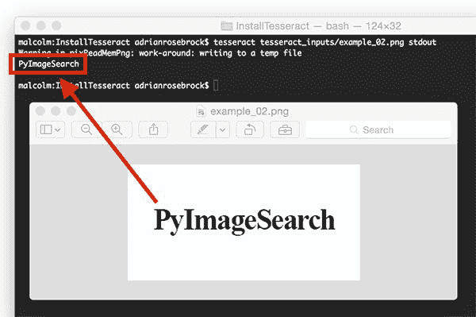
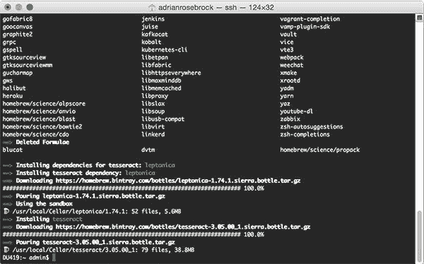
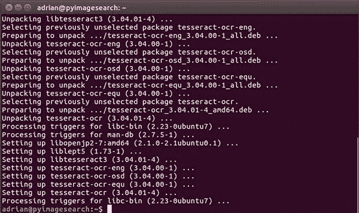
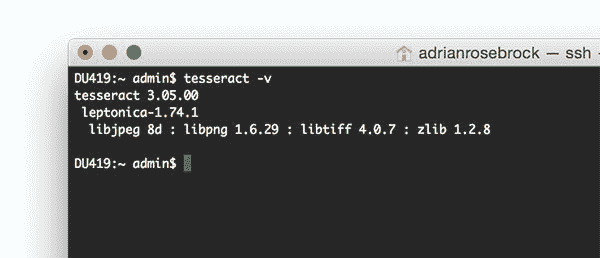
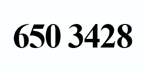
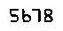

# 正在为 OCR 安装宇宙魔方

> 原文：<https://pyimagesearch.com/2017/07/03/installing-tesseract-for-ocr/>



今天的博客文章是关于安装和使用用于光学字符识别(OCR)的[宇宙魔方库](https://github.com/tesseract-ocr/tesseract)的两部分系列文章的第一部分。

OCR 是将键入的、手写的或印刷的文本转换成机器编码的文本的自动过程，我们可以通过字符串变量来访问和操作这些文本。

本系列的第一部分将着重于在您的机器上安装和配置 Tesseract，然后利用`tesseract`命令对输入图像应用 OCR。

在下周的博客文章中，我们将发现如何使用 Python“绑定”到宇宙魔方库，从 Python 脚本中直接调用宇宙魔方*。*

 ***要了解更多关于宇宙魔方以及它如何用于 OCR 的信息，*继续阅读*。**

## 正在为 OCR 安装宇宙魔方

宇宙魔方最初是由惠普公司在 20 世纪 80 年代开发的，于 2005 年开源。后来，在 2006 年，谷歌采纳了该项目，并一直是赞助商。

宇宙魔方软件适用于许多自然语言，从英语(最初)到旁遮普语到意第绪语。自 2015 年更新以来，它现在支持超过 *100 种书面语言*，并有代码，因此它也可以很容易地在其他语言上进行培训。

最初是 C 程序，1998 年移植到 C++上。该软件是无头的，可以通过命令行执行。它不附带 GUI，但是有几个其他软件包包装 Tesseract 来提供 GUI 界面。

要阅读更多关于宇宙魔方的内容，请访问[项目页面](https://github.com/tesseract-ocr)并阅读[维基百科文章](https://en.wikipedia.org/wiki/Tesseract_(software))。

在这篇博文中，我们将:

*   在我们的系统上安装宇宙魔方。
*   验证宇宙魔方安装是否正常工作。
*   在一些样本输入图像上尝试 Tesseract OCR。

完成本教程后，你将掌握在自己的图像上运行宇宙魔方的知识。

### 步骤 1:安装宇宙魔方

为了使用宇宙魔方库，我们首先需要在我们的系统上安装它。

对于 ***macOS 用户*** ，我们将使用[自制软件](https://brew.sh/)来安装宇宙魔方:

```py
$ brew install tesseract

```



**Figure 1:** Installing Tesseract OCR on macOS.

如果您使用的是 ***Ubuntu 操作系统*** ，只需使用`apt-get`安装 Tesseract OCR:

```py
$ sudo apt-get install tesseract-ocr

```



**Figure 2:** Installing Tesseract OCR on Ubuntu.

对于 ***窗口*** ，请查阅[宇宙魔方文档](https://github.com/tesseract-ocr/tesseract/wiki#windows)，因为 PyImageSearch 不支持或不推荐计算机视觉开发的窗口。

### 步骤#2:验证已经安装了 Tesseract

要验证 Tesseract 是否已成功安装在您的计算机上，请执行以下命令:

```py
$ tesseract -v
tesseract 3.05.00
 leptonica-1.74.1
  libjpeg 8d : libpng 1.6.29 : libtiff 4.0.7 : zlib 1.2.8

```



**Figure 3:** Validating that Tesseract has been successfully installed on my machine.

您应该会看到打印到屏幕上的 Tesseract 版本，以及与 Tesseract 兼容的图像文件格式库列表。

如果您得到的是错误消息:

```py
-bash: tesseract: command not found

```

那么宇宙魔方没有正确安装在你的系统上。回到 ***步骤#1*** 并检查错误。此外，您可能需要更新您的`PATH`变量(仅适用于高级用户)。

### 步骤 3:测试 Tesseract OCR

为了让宇宙魔方 OCR 获得合理的结果，您需要提供经过干净预处理的**图像。**

 **当使用宇宙魔方时，我建议:

*   使用尽可能高的分辨率和 DPI 作为输入图像。
*   应用阈值将文本从背景中分割出来。
*   确保前景尽可能清晰地从背景中分割出来(即，没有像素化或字符变形)。
*   对输入图像应用[文本倾斜校正](https://pyimagesearch.com/2017/02/20/text-skew-correction-opencv-python/)以确保文本正确对齐。

偏离这些建议会导致不正确的 OCR 结果，我们将在本教程的后面部分了解这一点。

现在，让我们将 OCR 应用于下图:


**Figure 4:** An example image we are going to apply OCR to using Tesseract.

只需在终端中输入以下命令:

```py
$ tesseract tesseract_inputs/example_01.png stdout 
Warning in pixReadMemPng: work-around: writing to a temp file
Testing Tesseract OCR

```

正确！宇宙魔方正确识别，*“测试宇宙魔方 OCR”*，并在终端打印出来。

接下来，让我们试试这张图片:


**Figure 5:** A second example image to apply Optical Character Recognition to using Tesseract.

在您的终端中输入以下内容，注意更改后的输入文件名:

```py
$ tesseract tesseract_inputs/example_02.png stdout 
Warning in pixReadMemPng: work-around: writing to a temp file
PyImageSearch

```


**Figure 6:** Tesseract is able to correctly OCR our image.

成功！宇宙魔方正确地识别了图像中的文本*“PyImageSearch”*。

现在，让我们尝试 OCR 识别*数字*而不是*字母字符*:



**Figure 7:** Using Tesseract to OCR digits in images.

本例使用命令行`digits`开关来*仅*报告数字:

```py
$ tesseract tesseract_inputs/example_03.png stdout digits
Warning in pixReadMemPng: work-around: writing to a temp file
650 3428

```

宇宙魔方再一次正确地识别了我们的字符串(在这种情况下只有数字)。

在这三种情况下，Tesseract 都能够正确地 OCR 我们所有的图像——你甚至可能认为 Tesseract 是所有 OCR 用例的正确工具。

然而，正如我们将在下一节中发现的，宇宙魔方有许多限制。

## OCR 的宇宙魔方的限制

几周前，我在做一个识别信用卡上 16 位数字的项目。

我可以很容易地编写 Python 代码来本地化四组 4 位数中的每一组。

以下是一个 4 位数感兴趣区域的示例:


**Figure 8:** Localizing a 4-digit grouping of characters on a credit card.

然而，当我尝试将 Tesseract 应用于下图时，结果并不令人满意:



**Figure 9:** Trying to apply Tesseract to “noisy” images.

```py
$ tesseract tesseract_inputs/example_04.png stdout digits
Warning in pixReadMemPng: work-around: writing to a temp file
5513

```

注意宇宙魔方是如何报告`5513`的，但是图像清楚地显示了`5678`。

不幸的是，这是宇宙魔方局限性的一个很好的例子。虽然我们已经将前景文本从背景中分割出来，但是文本的像素化性质“混淆”了宇宙魔方。也有可能宇宙魔方没有被训练成类似信用卡的字体。

Tesseract 最适合构建文档处理管道，在这种管道中，图像被扫描进来，进行预处理，然后需要应用光学字符识别。

我们应该注意到，Tesseract 是*而不是*OCR 的现成解决方案，可以在所有(甚至大多数)图像处理和计算机视觉应用程序中工作。

为了实现这一点，你需要应用特征提取技术、机器学习和深度学习。

## 摘要

今天我们学习了如何在我们的机器上安装和配置 Tesseract，这是将 Tesseract 用于 OCR 的两部分系列的第一部分。然后，我们使用`tesseract`二进制文件对输入图像进行 OCR。

然而，我们发现，除非我们的图像被干净地分割，否则立方体将给出糟糕的结果。在“嘈杂”的输入图像的情况下，我们可能会通过训练一个定制的机器学习模型来识别我们特定的*用例中的字符，从而获得更好的准确性。*

宇宙魔方*最适合*高分辨率输入的情况，其中前景文本 ***从背景中干净地分割*** 。

下周我们将学习如何通过 Python 代码访问宇宙魔方，敬请关注。

为了在下一篇关于宇宙魔方的博文发布时得到通知，请务必在下面的表格中输入您的电子邮件地址！***