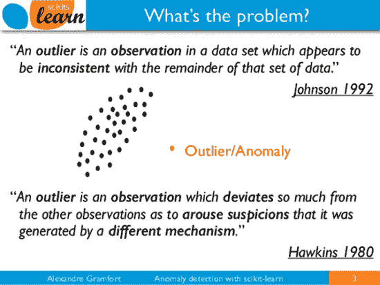
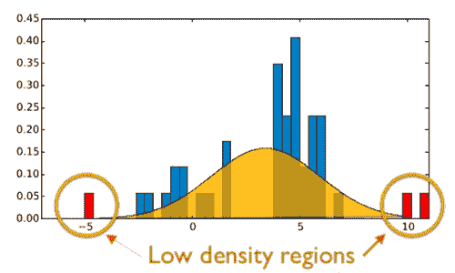
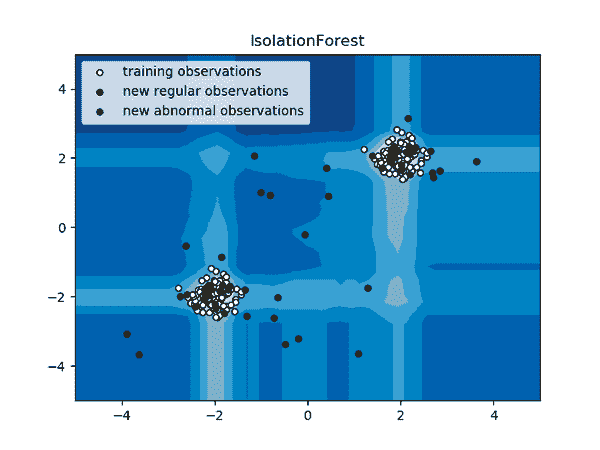
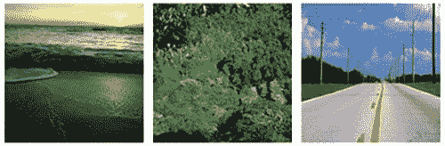
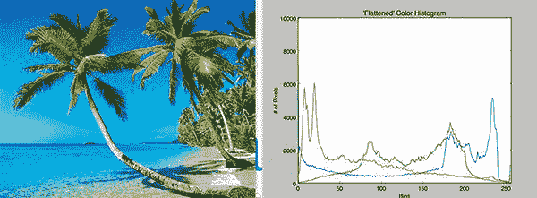
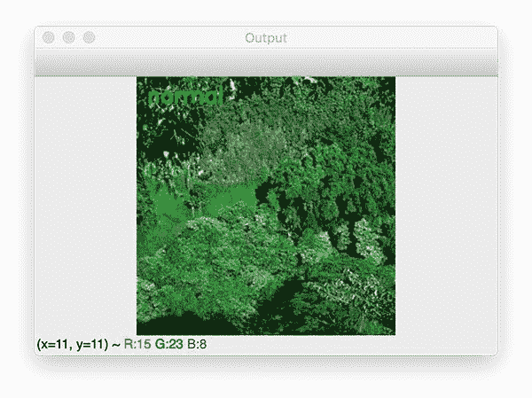
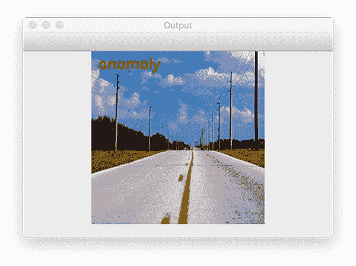
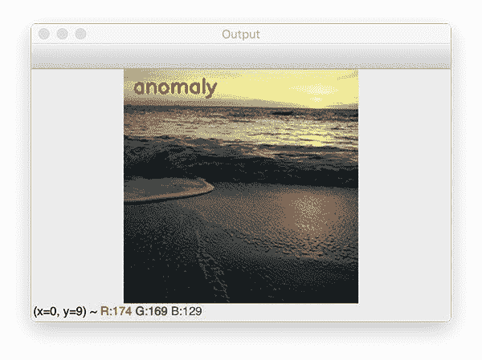

# OpenCV、计算机视觉和 scikit 异常检测简介-学习

> 原文：<https://pyimagesearch.com/2020/01/20/intro-to-anomaly-detection-with-opencv-computer-vision-and-scikit-learn/>

[](https://pyimagesearch.com/wp-content/uploads/2020/01/intro_anomaly_detection_header.jpg)

在本教程中，您将学习如何使用 OpenCV、计算机视觉和 scikit-learn 机器学习库在图像数据集中执行异常/新奇检测。

想象一下，你刚从大学毕业，获得了计算机科学学位。你的研究重点是计算机视觉和机器学习。

你离开学校后的第一份工作是在美国国家公园部。

你的任务？

**建立一个能够*自动识别公园里的花卉品种*的计算机视觉系统。**这样的系统可以用来**检测可能对公园整体生态系统有害的入侵植物物种**。

你马上意识到计算机视觉可以用来识别花卉种类。

**但首先你需要:**

1.  收集公园内各花卉品种的*示例图像(即**建立数据集**)。*
2.  量化图像数据集，**训练机器学习模型**识别物种。
3.  **发现异常/异常植物物种，**通过这种方式，受过训练的植物学家可以检查植物，并确定它是否对公园的环境有害。

第 1 步和第 2 步相当简单，但是第 3 步就*难多了*。

你应该如何训练一个机器学习模型来自动检测给定的输入图像是否在公园植物外观的“正态分布”之外？

答案在于一类特殊的机器学习算法，包括**异常值检测**和**新奇/异常检测。**

在本教程的剩余部分，您将了解这些算法之间的区别，以及如何使用它们来发现您自己的影像数据集中的异常值和异常值。

**要了解如何在图像数据集中执行异常/新奇检测，*继续阅读！***

## OpenCV、计算机视觉和 scikit 异常检测简介-学习

在本教程的第一部分，我们将讨论自然发生的标准事件和异常事件之间的区别。

我们还将讨论为什么机器学习算法很难检测到这些类型的事件。

在这里，我们将回顾本教程的示例数据集。

然后，我将向您展示如何:

1.  从磁盘加载我们的输入图像。
2.  量化它们。
3.  训练用于在我们的量化图像上进行异常检测的机器学习模型。
4.  从那里，我们将能够检测新输入图像中的异常值/异常。

我们开始吧！

### 什么是异常值和异常值？为什么它们很难被发现？

[](https://pyimagesearch.com/wp-content/uploads/2020/01/intro_anomaly_detection_definition.png)

**Figure 1:** Scikit-learn’s definition of an outlier is an important concept for anomaly detection with OpenCV and computer vision ([image source](https://www.slideshare.net/agramfort/anomalynovelty-detection-with-scikitlearn)).

异常被定义为**偏离标准、很少发生、不遵循“模式”其余部分的事件。**

异常情况的例子包括:

*   由世界事件引起的股票市场的大幅下跌和上涨
*   工厂里/传送带上的次品
*   实验室中被污染的样本

如果你想一个钟形曲线，异常存在于尾部的远端。

[](https://pyimagesearch.com/wp-content/uploads/2020/01/intro_anomaly_detection_bell_curve.png)

**Figure 2:** Anomalies exist at either side of a bell curve. In this tutorial we will conduct anomaly detection with OpenCV, computer vision, and scikit-learn ([image source](https://www.slideshare.net/agramfort/anomalynovelty-detection-with-scikitlearn)).

这些事件会发生，但发生的概率非常小。

从机器学习的角度来看，这使得检测异常*变得困难*——根据定义，我们有许多“标准”事件的例子，很少有“异常”事件的例子。

**因此，我们的数据集中有一个*大规模偏斜*。**

当我们想要检测的异常可能只发生 1%、0.1%或 0.0001%的时候，倾向于以最佳方式处理平衡数据集的机器学习算法应该如何工作？

幸运的是，机器学习研究人员已经研究了这种类型的问题，并设计了处理这项任务的算法。

### 异常检测算法

[](https://pyimagesearch.com/wp-content/uploads/2020/01/intro_anomaly_detection_plot.png)

**Figure 3:** To detect anomalies in time-series data, be on the lookout for spikes as shown. We will use scikit-learn, computer vision, and OpenCV to detect anomalies in this tutorial ([image source](https://www.engineering.com/AdvancedManufacturing/ArticleID/19058/Anomaly-Detection-Industrial-Asset-Insights-Without-Historical-Data.aspx)).

异常检测算法可以分为两个子类:

*   **异常值检测:**我们的输入数据集包含*标准事件和异常事件的例子。这些算法试图拟合标准事件最集中的训练数据区域，忽略并因此隔离异常事件。这种算法通常以**无人监管的方式**(即没有标签)进行训练。在应用其他机器学习技术之前，我们有时会使用这些方法来帮助清理和预处理数据集。*
**   **新奇检测:**与包括标准和异常事件的例子的离群点检测不同，**新奇检测算法在训练时间内只有*标准事件数据点*(即*没有异常事件*)。**在训练过程中，我们为这些算法提供了标准事件的标记示例(**监督学习**)。在测试/预测时，新异检测算法必须检测输入数据点何时是异常值。*

 *离群点检测是**无监督学习**的一种形式。在这里，我们提供了示例数据点的整个数据集，并要求算法将它们分组为**内点**(标准数据点)和**外点**(异常)。

新奇检测是**监督学习**的一种形式，但我们只有标准数据点的标签——由新奇检测算法来预测给定数据点在测试时是内部还是外部。

在这篇博文的剩余部分，我们将重点关注作为异常检测形式的新奇检测。

### 用于异常检测的隔离林

[](https://pyimagesearch.com/wp-content/uploads/2020/01/intro_anomaly_detection_isolation_forest.png)

**Figure 4:** A technique called “Isolation Forests” based on [Liu et al.’s 2012 paper](https://cs.nju.edu.cn/zhouzh/zhouzh.files/publication/tkdd11.pdf) is used to conduct anomaly detection with OpenCV, computer vision, and scikit-learn (image source).

我们将使用**隔离森林**来执行异常检测，基于刘等人 2012 年的论文，[基于隔离的异常检测。](https://cs.nju.edu.cn/zhouzh/zhouzh.files/publication/tkdd11.pdf)

隔离林是一种集成算法，由多个决策树组成，用于将输入数据集划分为不同的内联体组。

正如上面的图 4 所示，隔离森林接受一个输入数据集(*白点*，然后围绕它们建立一个流形。

在测试时，隔离林可以确定输入点是否落在流形内(标准事件；*绿点*或高密度区域外(异常事件；*红点*。

回顾隔离林如何构建分区树的集合超出了本文的范围，因此请务必参考[刘等人的论文以了解更多细节](https://cs.nju.edu.cn/zhouzh/zhouzh.files/publication/tkdd11.pdf)。

### 配置您的异常检测开发环境

为了跟随今天的教程，你需要一个安装了以下软件包的 **Python 3 *虚拟环境*** :

*   [scikit-learn](https://scikit-learn.org/stable/)
*   [OpenCV](https://opencv.org/)
*   [NumPy](https://numpy.org/)
*   [imutils](https://github.com/jrosebr1/imutils)

幸运的是，这些包都是 pip 可安装的，但是有一些先决条件(包括 Python 虚拟环境)。请务必遵循以下指南，首先使用 OpenCV 设置您的虚拟环境: **[*pip 安装 opencv*](https://pyimagesearch.com/2018/09/19/pip-install-opencv/)**

一旦 Python 3 虚拟环境准备就绪，pip 安装命令包括:

```py
$ workon <env-name>
$ pip install numpy
$ pip install opencv-contrib-python
$ pip install imutils
$ pip install scikit-learn

```

***注意:**根据 [pip install opencv](https://pyimagesearch.com/2018/09/19/pip-install-opencv/) 安装指南安装`virtualenv`和`virtualenvwrapper`后，`workon`命令变为可用。*

### 项目结构

确保使用教程的 ***“下载”*** 部分获取今天帖子的源代码和示例图片。在您将。您将看到以下项目结构:

```py
$ tree --dirsfirst
.
├── examples
│   ├── coast_osun52.jpg
│   ├── forest_cdmc290.jpg
│   └── highway_a836030.jpg
├── forest
│   ├── forest_bost100.jpg
│   ├── forest_bost101.jpg
│   ├── forest_bost102.jpg
│   ├── forest_bost103.jpg
│   ├── forest_bost98.jpg
│   ├── forest_cdmc458.jpg
│   ├── forest_for119.jpg
│   ├── forest_for121.jpg
│   ├── forest_for127.jpg
│   ├── forest_for130.jpg
│   ├── forest_for136.jpg
│   ├── forest_for137.jpg
│   ├── forest_for142.jpg
│   ├── forest_for143.jpg
│   ├── forest_for146.jpg
│   └── forest_for157.jpg
├── pyimagesearch
│   ├── __init__.py
│   └── features.py
├── anomaly_detector.model
├── test_anomaly_detector.py
└── train_anomaly_detector.py

3 directories, 24 files

```

我们的项目由`forest/`图像和`example/`测试图像组成。**我们的异常探测器将尝试确定这三个例子中的任何一个与这组森林图像相比是否是异常。**

在`pyimagesearch`模块中有一个名为`features.py`的文件。这个脚本包含两个函数，负责从磁盘加载我们的图像数据集，并计算每个图像的颜色直方图特征。

我们将分两个阶段运行我们的系统— (1)培训，和(2)测试。

首先，`train_anomaly_detector.py`脚本计算特征并训练用于异常检测的隔离森林机器学习模型，将结果序列化为`anomaly_detector.model`。

然后我们将开发`test_anomaly_detector.py`,它接受一个示例图像并确定它是否是一个异常。

### 我们的示例图像数据集

[](https://pyimagesearch.com/wp-content/uploads/2020/01/intro_anomaly_detection_dataset.jpg)

**Figure 5:** We will use a subset of the [8Scenes](https://people.csail.mit.edu/torralba/code/spatialenvelope/) dataset to detect anomalies among pictures of forests using scikit-learn, OpenCV, and computer vision.

本教程的示例数据集包括 **16 幅森林图像**(每一幅都显示在上面的 ****图 5**** 中)。

这些示例图像是 Oliva 和 Torralba 的论文 *[中的 8 个场景数据集的子集，该论文对场景的形状进行建模:空间包络](https://people.csail.mit.edu/torralba/code/spatialenvelope/)* 的整体表示。

我们将获取这个数据集，并在此基础上训练一个异常检测算法。

当呈现新的输入图像时，我们的异常检测算法将返回两个值之一:

1.  是的，那是一片森林
2.  `-1` : *“不，看起来不像森林。肯定是离群值。”*

因此，您可以将该模型视为“森林”与“非森林”检测器。

该模型是在森林图像上训练的，现在必须决定新的输入图像是否符合“森林流形”或者是否确实是异常/异常值。

为了评估我们的异常检测算法，我们有 **3 个测试图像:**

[](https://pyimagesearch.com/wp-content/uploads/2020/01/intro_anomaly_detection_test_images.jpg)

**Figure 6:** Three testing images are included in today’s Python + computer vision anomaly detection project.

正如你所看到的，这些图像中只有一个是森林，另外两个分别是高速公路和海滩的例子。

如果我们的异常检测管道工作正常，我们的模型应该为*森林*图像返回`1` (inlier)，为两个*非森林*图像返回`-1`。

### 实现我们的特征提取和数据集加载器辅助函数

[](https://pyimagesearch.com/wp-content/uploads/2020/01/intro_anomaly_detection_histogram.jpg)

**Figure 7:** Color histograms characterize the color distribution of an image. Color will be the basis of our anomaly detection introduction using OpenCV, computer vision, and scikit-learn.

在我们可以训练机器学习模型来检测异常和异常值之前，我们必须首先定义一个过程来量化和表征我们输入图像的内容。

为了完成这项任务，我们将使用**颜色直方图。**

颜色直方图是表征图像颜色分布的简单而有效的方法。

由于我们在这里的任务是描述森林和非森林图像的特征，我们可以假设森林图像比非森林图像包含更多的绿色阴影。

让我们看看如何使用 OpenCV 实现颜色直方图提取。

打开`pyimagesearch`模块中的`features.py`文件，插入以下代码:

```py
# import the necessary packages
from imutils import paths
import numpy as np
import cv2

def quantify_image(image, bins=(4, 6, 3)):
	# compute a 3D color histogram over the image and normalize it
	hist = cv2.calcHist([image], [0, 1, 2], None, bins,
		[0, 180, 0, 256, 0, 256])
	hist = cv2.normalize(hist, hist).flatten()

	# return the histogram
	return hist

```

**2-4 线**导入我们的套餐。我们将使用我的`imutils`包中的`paths`来列出输入目录中的所有图像。OpenCV 将用于计算和归一化直方图。NumPy 用于数组操作。

既然导入已经处理好了，让我们定义一下`quantify_image`函数。该函数接受两个参数:

*   `image`:OpenCV 加载的图像。
*   `bins`:绘制直方图时，*x*-轴充当我们的“仓”在这种情况下，我们的`default`指定了`4`色调箱、`6`饱和度箱和`3`值箱。这里有一个简单的例子——如果我们只使用 2 个(等间距)面元，那么我们将计算一个像素在范围*【0，128】*或*【128，255】*内的次数。然后在 *y* 轴上绘制合并到 *x* 轴值的像素数。

***注:**要了解包括 HSV、RGB、L*a*b 和灰度在内的直方图和色彩空间的更多信息，请务必参考[实用 Python 和 OpenCV](https://pyimagesearch.com/practical-python-opencv/) 和 [PyImageSearch 大师](https://pyimagesearch.com/pyimagesearch-gurus/)。*

**第 8-10 行**计算颜色直方图并归一化。归一化允许我们计算百分比，而不是原始频率计数，在一些图像比其他图像大或小的情况下有所帮助。

**第 13 行**将归一化直方图返回给调用者。

我们的下一个函数处理:

1.  接受包含图像数据集的目录的路径。
2.  在图像路径上循环，同时使用我们的`quantify_image`方法量化它们。

现在让我们来看看这个方法:

```py
def load_dataset(datasetPath, bins):
	# grab the paths to all images in our dataset directory, then
	# initialize our lists of images
	imagePaths = list(paths.list_images(datasetPath))
	data = []

	# loop over the image paths
	for imagePath in imagePaths:
		# load the image and convert it to the HSV color space
		image = cv2.imread(imagePath)
		image = cv2.cvtColor(image, cv2.COLOR_BGR2HSV)

		# quantify the image and update the data list
		features = quantify_image(image, bins)
		data.append(features)

	# return our data list as a NumPy array
	return np.array(data)

```

我们的`load_dataset`函数接受两个参数:

*   到我们的图像数据集的路径。
*   `bins`:颜色直方图的箱数。参考上面的解释。容器被传递给`quantify_image`功能。

**第 18 行**抓取`datasetPath`中的所有图像路径。

第 19 行初始化一个列表来保存我们的特性`data`。

从那里，**线 22** 开始在`imagePaths`上循环。在循环中，我们加载一幅图像，并将其转换到 HSV 颜色空间(**第 24 行和第 25 行**)。然后我们量化`image`，并将结果`features`添加到`data`列表中(**第 28 行和第 29 行**)。

最后， **Line 32** 将我们的`data`列表作为 NumPy 数组返回给调用者。

### 使用 scikit-learn 实施我们的异常检测培训脚本

实现了助手函数后，我们现在可以继续训练异常检测模型。

正如本教程前面提到的，我们将使用隔离森林来帮助确定异常/新奇数据点。

我们对[隔离森林的实现来自 scikit-learn 库](https://scikit-learn.org/stable/modules/generated/sklearn.ensemble.IsolationForest.html)。

打开`train_anomaly_detector.py`文件，让我们开始工作:

```py
# import the necessary packages
from pyimagesearch.features import load_dataset
from sklearn.ensemble import IsolationForest
import argparse
import pickle

# construct the argument parser and parse the arguments
ap = argparse.ArgumentParser()
ap.add_argument("-d", "--dataset", required=True,
	help="path to dataset of images")
ap.add_argument("-m", "--model", required=True,
	help="path to output anomaly detection model")
args = vars(ap.parse_args())

```

2-6 号线处理我们的进口。这个脚本使用了我们定制的`load_dataset`函数和 [scikit-learn 的隔离森林](https://scikit-learn.org/stable/modules/generated/sklearn.ensemble.IsolationForest.html#sklearn.ensemble.IsolationForest)实现。我们将把生成的模型序列化为 pickle 文件。

**第 8-13 行**解析我们的[命令行参数](https://pyimagesearch.com/2018/03/12/python-argparse-command-line-arguments/)包括:

*   到我们的图像数据集的路径。
*   `--model`:输出异常检测模型的路径。

此时，我们已经准备好加载数据集并**训练我们的隔离森林模型:**

```py
# load and quantify our image dataset
print("[INFO] preparing dataset...")
data = load_dataset(args["dataset"], bins=(3, 3, 3))

# train the anomaly detection model
print("[INFO] fitting anomaly detection model...")
model = IsolationForest(n_estimators=100, contamination=0.01,
	random_state=42)
model.fit(data)

```

**第 17 行**加载并量化图像数据集。

**第 21 行和第 22 行**用以下参数初始化我们的`IsolationForest`模型:

*   `n_estimators`:集合中基本估计量(即树)的数量。
*   `contamination`:数据集中离群点的比例。
*   `random_state`:再现性的随机数发生器种子值。可以使用任意整数；`42`常用于机器学习领域，因为它与[书中的一个笑话、*银河系漫游指南*T5 有关。](https://www.dictionary.com/e/slang/42/)

确保参考 [scikit-learn 文档](https://scikit-learn.org/stable/modules/generated/sklearn.ensemble.IsolationForest.html#sklearn.ensemble.IsolationForest)中隔离林的其他可选参数。

**第 23 行**在直方图`data`顶部训练异常检测器。

既然我们的模型已经定型，剩下的几行将异常检测器序列化到磁盘上的 pickle 文件中:

```py
# serialize the anomaly detection model to disk
f = open(args["model"], "wb")
f.write(pickle.dumps(model))
f.close()

```

### 训练我们的异常探测器

既然我们已经实现了我们的异常检测训练脚本，让我们把它投入工作。

首先确保您已经使用了本教程的 ******【下载】****** 部分来下载源代码和示例图像。

从那里，打开一个终端并执行以下命令:

```py
$ python train_anomaly_detector.py --dataset forest --model anomaly_detector.model
[INFO] preparing dataset...
[INFO] fitting anomaly detection model...

```

要验证异常检测器是否已序列化到磁盘，请检查工作项目目录的内容:

```py
$ ls *.model
anomaly_detector.model

```

### 创建异常检测器测试脚本

在这一点上，我们已经训练了我们的异常检测模型— **，但是我们如何使用实际的*来检测新数据点中的异常*？**

要回答这个问题，让我们看看`test_anomaly_detector.py`脚本。

在高层次上，这个脚本:

1.  **加载上一步训练的异常检测模型**。
2.  加载、预处理和**量化查询图像**。
3.  **使用我们的异常检测器进行预测**,以确定查询图像是内部图像还是外部图像(即异常)。
4.  **显示结果**。

继续打开`test_anomaly_detector.py`并插入以下代码:

```py
# import the necessary packages
from pyimagesearch.features import quantify_image
import argparse
import pickle
import cv2

# construct the argument parser and parse the arguments
ap = argparse.ArgumentParser()
ap.add_argument("-m", "--model", required=True,
	help="path to trained anomaly detection model")
ap.add_argument("-i", "--image", required=True,
	help="path to input image")
args = vars(ap.parse_args())

```

**2-5 号线**办理我们的进口业务。注意，我们导入自定义的`quantify_image`函数来计算输入图像的特征。我们还导入`pickle`来加载我们的异常检测模型。OpenCV 将用于加载、预处理和显示图像。

我们的脚本需要两个[命令行参数](https://pyimagesearch.com/2018/03/12/python-argparse-command-line-arguments/):

*   `--model`:驻留在磁盘上的序列化异常检测器。
*   `--image`:输入图像的路径(即我们的查询)。

让我们加载我们的异常检测器并**量化我们的输入图像:**

```py
# load the anomaly detection model
print("[INFO] loading anomaly detection model...")
model = pickle.loads(open(args["model"], "rb").read())

# load the input image, convert it to the HSV color space, and
# quantify the image in the *same manner* as we did during training
image = cv2.imread(args["image"])
hsv = cv2.cvtColor(image, cv2.COLOR_BGR2HSV)
features = quantify_image(hsv, bins=(3, 3, 3))

```

**17 号线**装载我们预先训练的异常探测器。

**第 21-23 行**加载、预处理和量化我们的输入`image`。我们的预处理步骤*必须*与我们的训练脚本相同(即从 BGR 转换到 HSV 色彩空间)。

此时，我们准备好**进行异常预测**并显示结果:

```py
# use the anomaly detector model and extracted features to determine
# if the example image is an anomaly or not
preds = model.predict([features])[0]
label = "anomaly" if preds == -1 else "normal"
color = (0, 0, 255) if preds == -1 else (0, 255, 0)

# draw the predicted label text on the original image
cv2.putText(image, label, (10,  25), cv2.FONT_HERSHEY_SIMPLEX,
	0.7, color, 2)

# display the image
cv2.imshow("Output", image)
cv2.waitKey(0)

```

**第 27 行**对输入图像`features`进行预测。我们的异常检测模型将为“正常”数据点返回`1`，为“异常”数据点返回`-1`。

**第 28 行**给我们的预测分配一个`"anomaly"`或`"normal"`标签。

**第 32-37 行**然后在查询图像上标注`label`并显示在屏幕上，直到按下任何键。

### 使用计算机视觉和 scikit-learn 检测图像数据集中的异常

要查看我们的异常检测模型，请确保您已使用本教程的 ***【下载】*** 部分下载源代码、示例图像数据集和预训练模型。

在那里，您可以使用以下命令来测试异常检测器:

```py
$ python test_anomaly_detector.py --model anomaly_detector.model \
	--image examples/forest_cdmc290.jpg 
[INFO] loading anomaly detection model...

```

[](https://pyimagesearch.com/wp-content/uploads/2020/01/intro_anomaly_detection_forest_result.jpg)

**Figure 8:** This image is clearly not an anomaly as it is a green forest. Our intro to anomaly detection method with computer vision and Python has passed the first test.

这里你可以看到我们的异常检测器已经正确地将森林标记为**内层。**

现在让我们来看看这个模型如何处理一幅公路的图像，它当然不是森林:

```py
$ python test_anomaly_detector.py --model anomaly_detector.model \
	--image examples/highway_a836030.jpg
[INFO] loading anomaly detection model...

```

[](https://pyimagesearch.com/wp-content/uploads/2020/01/intro_anomaly_detection_highway_result.jpg)

**Figure 9:** A highway is an anomaly compared to our set of forest images and has been marked as such in the top-left corner. This tutorial presents an intro to anomaly detection with OpenCV, computer vision, and scikit-learn.

我们的异常检测器正确地将该图像标记为**异常值/异常值。**

作为最后的测试，让我们向异常探测器提供一个海滩/海岸的图像:

```py
$ python test_anomaly_detector.py --model anomaly_detector.model \
	--image examples/coast_osun52.jpg 
[INFO] loading anomaly detection model...

```

[](https://pyimagesearch.com/wp-content/uploads/2020/01/intro_anomaly_detection_coast_result.jpg)

**Figure 10:** A coastal landscape is marked as an anomaly against a set of forest images using Python, OpenCV, scikit-learn, and computer vision anomaly detection techniques.

我们的异常检测器再次正确地将图像识别为**异常值/异常。**

## 摘要

在本教程中，您学习了如何使用计算机视觉和 scikit-learn 机器学习库在图像数据集中执行异常和异常值检测。

为了执行异常检测，我们:

1.  收集了森林图像的示例图像数据集。
2.  使用颜色直方图和 OpenCV 库量化图像数据集。
3.  根据我们的量化图像训练了一个隔离森林。
4.  使用隔离林检测图像异常值和异常。

除了隔离森林，您还应该研究单类支持向量机、椭圆包络和局部异常因子算法，因为它们也可以用于异常值/异常检测。

**但是深度学习呢？**

深度学习也可以用来执行异常检测吗？

我将在以后的教程中回答这个问题。

**要下载这篇文章的源代码(并在未来教程在 PyImageSearch 上发布时得到通知)，*只需在下面的表格中输入您的电子邮件地址！****