# 红外视觉介绍:近红外与中远红外图像

> 原文：<https://pyimagesearch.com/2022/10/10/introduction-to-infrared-vision-near-vs-mid-far-infrared-images/>

* * *

## **目录**

* * *

## [**红外视觉介绍:近中远红外图像**](#TOC)

在本教程中，您将学习红外成像的基础知识，包括:

*   什么是红外图像:近红外与中远红外
*   红外摄像机的类型
*   它们有什么用处

本教程是关于**红外视觉基础知识**的 4 部分系列中的第一部分:

1.  ***[红外视觉入门:近中远红外图像](https://pyimg.co/oj6kb)* (今日教程)**
2.  *热视觉:使用 Python 和 OpenCV 从图像中测量第一个温度*
3.  *热视觉:使用 Python 和 OpenCV 的发热探测器(初始项目)*
4.  *热视觉:用 PyTorch 和 YOLOv5 探测夜间物体(真实项目)*

本课结束时，你将知道什么是红外图像，它们的技术，以及它们现在的用途。

* * *

### [**什么是红外图像？近红外图像**](#TOC)

在开始处理这种奇怪的图像之前，我们应该了解它们来自哪里。

我们都熟悉常见的数字彩色可视图片(**图 1** 、*左*)，因为我们每年都会用智能手机、平板电脑和数码相机生成数百张甚至数千张图片。

[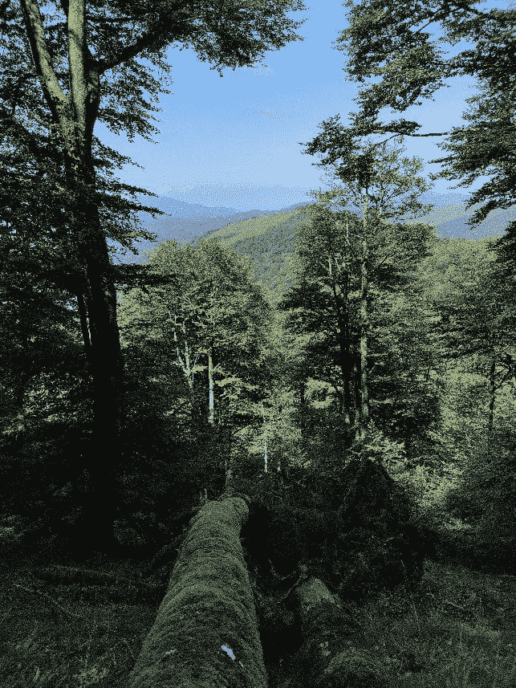](https://pyimagesearch.com/wp-content/uploads/2022/02/figure-1-a.jpg)[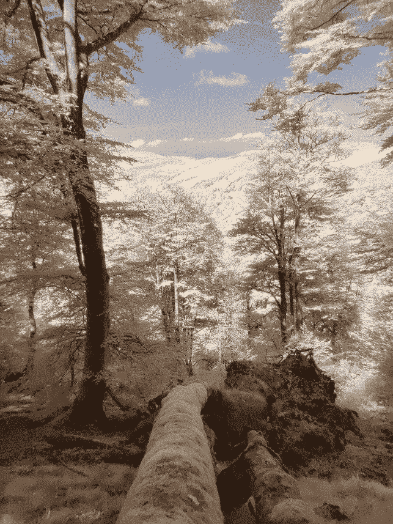](https://pyimagesearch.com/wp-content/uploads/2022/02/figure-1-b.jpg)

**Figure 1:** *Left:* Color visible-light image. *Right:* Color near-infrared-light image.

数码相机内部的传感器不仅能够捕捉可见光或辐射，还能够捕捉来自太阳和人造聚光灯的近红外光。

然而，我们的眼睛无法感知红外辐射，所以我们看到了我们周围的世界，如图**图 1** ( *左*)所示。

为了复制我们眼睛的工作方式，数码相机通常在传感器和镜头之间包含一个近红外阻挡滤光玻璃。由于这个原因，传感器只捕捉可见光，就像我们的眼睛一样。

在少数不包括这个滤镜的情况下，我们有一个**近红外相机**，它可以拍摄像**图 1** ( *右*)中所示的照片，同时还可以捕捉可见光。

所以是的，你可能在想的是可能的！如果你从相机上取下玻璃滤镜，你会得到一个惊人的可见光和近红外捕捉设备！

* * *

***免责声明:*** *PyImageSearch 如果你对程序没有信心，不建议你遵循这个流程。对设备的不正确操作可能会导致相机损坏。*

* * *

**图 2** 显示了不带近红外阻挡滤光片的单色或黑白(BW)普通摄像机的响应。

通过查看**图 3** 中所示的电磁光谱，我们了解到可见光的波长从 380 纳米的紫色到 750 纳米的红色，近红外辐射从大约 760 到 1500 纳米。

我们说过，如果没有近红外阻挡滤光片，我们常见的可见光数码相机就变成了近红外和可见光相机，如图**图 3** 所示(这种相机光谱响应的最高光吸收发生在可见光部分，在 400 到 750 nm 之间)。

但是，如果我们想在红外辐射中使用不同的波长(即中红外和远红外或长红外)，会发生什么呢？

答案是，我们需要一种不同的技术，称为**热红外成像**。

* * *

### [****中远红外图像:热红外成像****](#TOC)

再次查看**图 3** ，我们可以识别大约 1500 nm 到 100 万 nm 之间的中波和长波/远红外。

这些热像或者红外中远红外像是什么样子的？

**图 4** ( *左*)展示了用小型热感相机**拍摄的中远距或热感图片图 4** ( *右*)。

[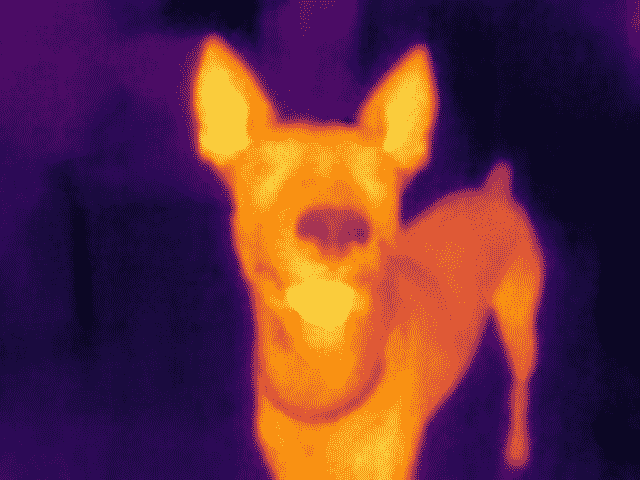](https://pyimagesearch.com/wp-content/uploads/2022/10/figure-4-a.jpg)[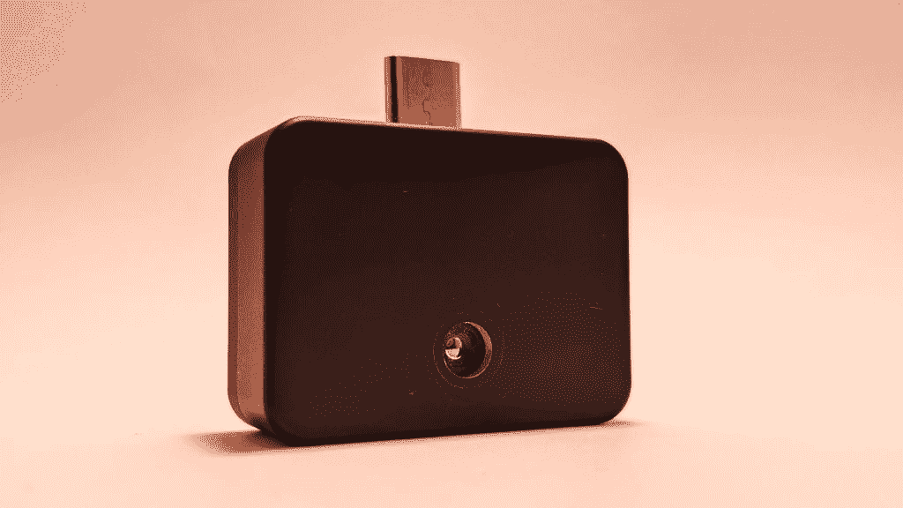](https://pyimagesearch.com/wp-content/uploads/2022/10/figure-4-b-scaled.jpg)

**Figure 4:** *Left:* Thermal image example. *Right:* Small thermal camera ([source](https://www.rgmvision.com/)).

* * *

### [****红外摄像机类型****](#TOC)

正如我们已经看到的，根据当前的技术，有两种类型的红外图像:

1.  近红外光谱
2.  中远红外(MIR，FIR)

* * *

### [****近红外或夜视摄像头****](#TOC)

众所周知，普通的彩色或单色可见光相机可以很容易地转换成近红外和可见光相机。

捕获的近红外辐射让我们在黑暗中也能看见！

这也是我们通常称之为**夜视摄像头**的原因。

它们通常包括单色或黑白传感器，**图 5** ( *顶部*)。这项技术需要外部人工聚光灯来照亮拍摄的夜景。为此，如图**图 5** ( *下图*所示的夜间监控摄像头，包括一个环绕镜头的 LED 红外线灯环。

[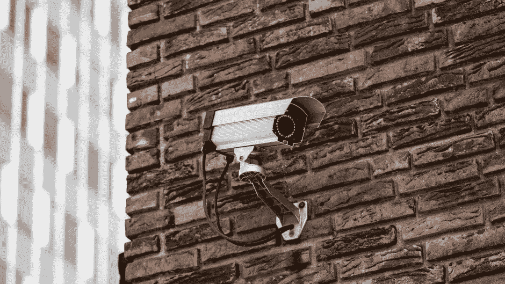](https://pyimagesearch.com/wp-content/uploads/2022/10/figure-5-a.jpg)[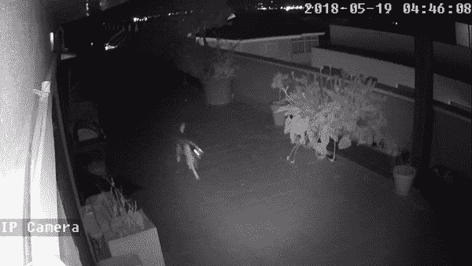](https://pyimagesearch.com/wp-content/uploads/2022/10/figure-5-bb-new.gif)

**Figure 5:** *Top:* Security surveillance camera. *Bottom:* Security surveillance camera ([source](https://domoticaencasa.es/home-assistant-16-instalamos-camara/)), night scene.

在下一节中，除了安全监控，我们将看到这项技术更有趣的应用。

* * *

### [****中远红外或热感摄像机****](#TOC)

这种成像需要一种不同的技术，称为**热感相机**。

为什么**热感**相机，你可能会疑惑。

这项技术可以让我们通过获得温度分布图来测量任何场景的温度，如图**图 6** 所示！

[](https://pyimagesearch.com/wp-content/uploads/2022/10/image6a-color.png)[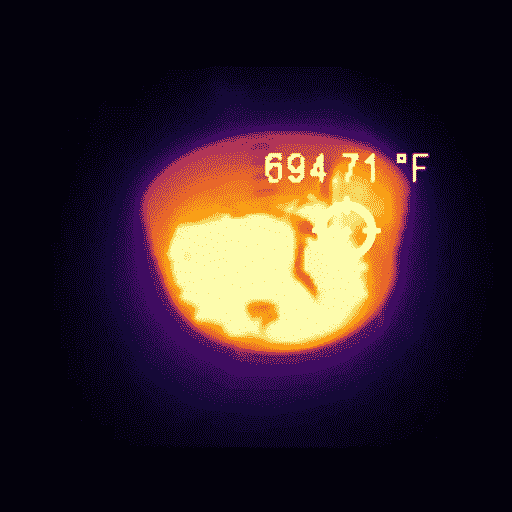](https://pyimagesearch.com/wp-content/uploads/2022/10/image6b-thermal.png)

**Figure 6:** Measuring a BBQ temperature distribution with a thermal camera. *Left:* visible color image. *Right:* thermal image.

是的，这就是捕捉中远红外辐射的“魔力”。

最终得到的图像是灰度格式，用不同的调色板着色，让我们可以实时测量和显示每个像素的温度，我们将在下一篇教程的**中发现这一点。**

就像近红外相机一样，这项技术使我们有可能在黑暗中看到东西。更重要的是，我们不需要外部人工聚光灯/手电筒来照亮夜景。

是的，再次，中远红外“魔法”！

* * *

### [****它们对近红外或夜视摄像机有什么用****](#TOC)

夜视摄像头通常用作监控摄像头。

但是它们还有什么用呢？

最常见的用途是:

1.  面部和虹膜生物识别
2.  动物研究监督
3.  打猎

生物识别是一项需求量很大的技术，已经完全融入到我们的日常生活中。例如，这些摄像头可以在我们的智能手机中找到，用于虹膜或面部识别。因此，我们可以在银行交易中验证我们的身份，或者在夜间、低质量的照明条件下，甚至在戴着太阳镜的情况下解锁我们的设备。

动物研究是这项技术的另一个巧妙应用。**图 7** ( *左下方*)让我们了解到分布在特定野生区域的几个这样的设备是如何为生物学家研究人员提供可靠的信息的，例如，关于山猫活动的信息。

[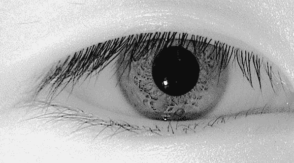](https://pyimagesearch.com/wp-content/uploads/2022/02/figure-7-a.jpg)[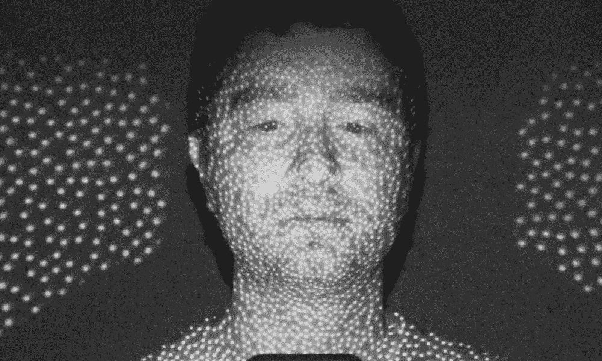](https://pyimagesearch.com/wp-content/uploads/2022/02/figure-7-b.jpg)[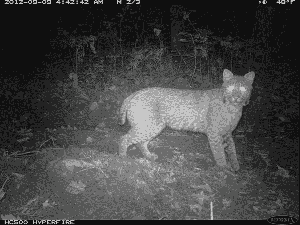](https://pyimagesearch.com/wp-content/uploads/2022/10/figure-7-c.jpg)[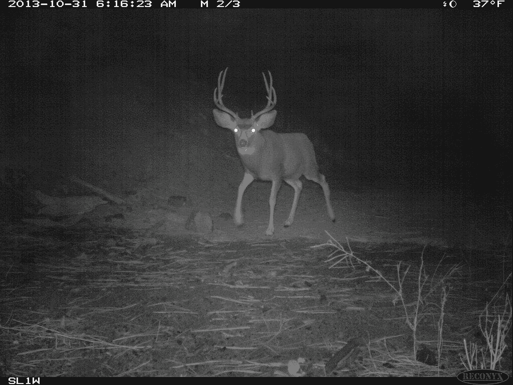](https://pyimagesearch.com/wp-content/uploads/2022/10/figure-7-d.jpg)

**Figure 7:** Common uses of near-infrared cameras. *Top-left:* Iris biometric recognition ([source](https://commons.wikimedia.org/wiki/File:IRiris.jpg)). *Top-right:* Facial biometric recognition ([source](https://www.aixtron.com/investoren/events/konferenzen/180320_3CMD_Laser_muLED_final.pdf)). *Bottom-left:* Animal research surveillance ([source](https://wildlife.org/snap-trap-series-bobcats-ranges/)), bobcat activity tracking. *Bottom-right:* Hunting, deer detection ([source](https://www.flickr.com/photos/oregondot/10696965166)).

同样的，猎人可以探测并跟踪目标鹿的行动。

* * *

### [****中远红外或热感摄像机****](#TOC)

在本教程的最后一点，我们将学习热感相机的常见用途。

需要指出的是，它是一种比近红外相机更昂贵的技术。

然而，尽管成本较高，但热感相机受益于不需要限制工作距离的人工聚光灯。

为了利用其温度测量能力，这些摄像机用于以下用途:

1.  野火探测
2.  配电板和电子设备监管
3.  新冠肺炎温度访问控制

不幸的是，我们的星球每年遭受数百次野火。为了对抗这个问题，嵌入无人机的热感摄像机可以帮助灭火，我们可以从**图 8** ( *左上*)中提取。

[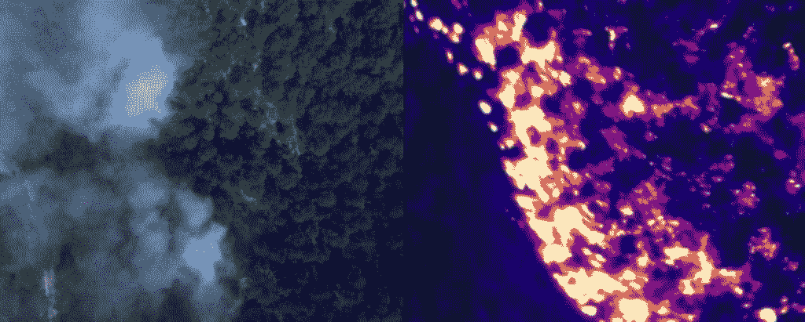](https://pyimagesearch.com/wp-content/uploads/2022/02/figure-8-a.jpg)[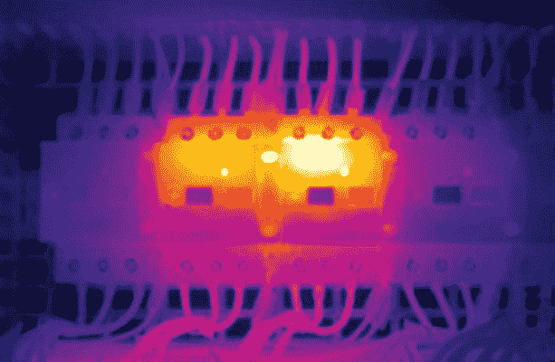](https://pyimagesearch.com/wp-content/uploads/2022/02/figure-8-b.jpg)[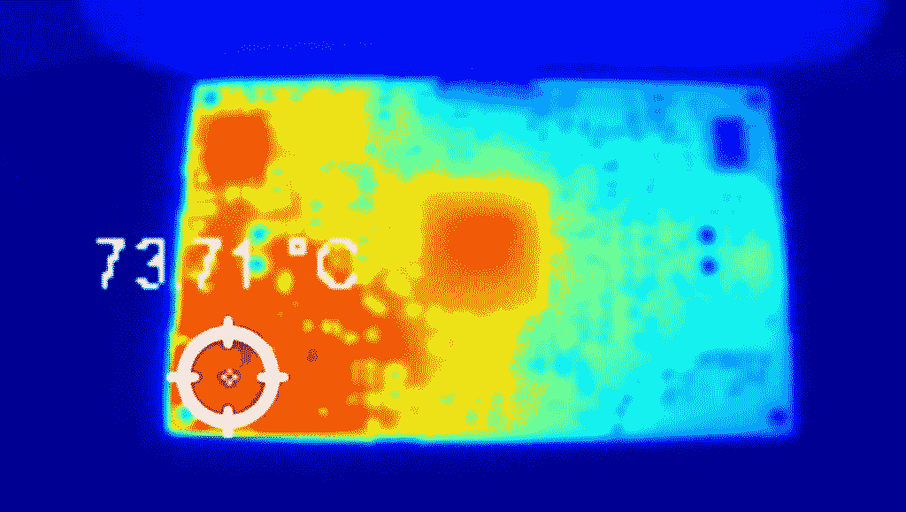](https://pyimagesearch.com/wp-content/uploads/2022/02/figure-8-c.jpg)[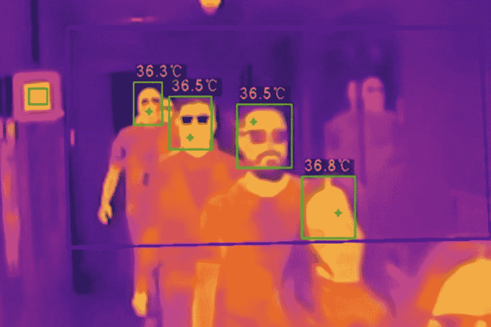](https://pyimagesearch.com/wp-content/uploads/2022/02/figure-8-d.jpg)

**Figure 8:** Common uses of middle-far-infrared cameras. *Top-left:* Fire areas detection ([source](https://www.dlr.de/content/en/articles/news/2019/02/20190628_summertime-is-forest-fire-season.html)). *Top-right:* Electric panel heat distribution ([source](https://www.engineeringworldchannel.com/thermography/)). *Bottom-left:* Electronic PCB temperature map for efficient design ([source](https://www.rgmvision.com/)). *Bottom-right:* COVID-19 temperature access control ([source](https://www.smartcitiesworld.net/news/news/thermal-imaging-service-developed-to-protect-against-the-spread-of-coronavirus-5215)).

在工业中，热像仪非常有助于获得分布加热图，以在设计过程中优化电气和电子设备或预防故障。

它们还可用于防止和检测液体泄漏和水分问题。

最后但同样重要的是，由于新冠肺炎，热感摄像机可以控制接入点的温度。

* * *

* * *

## [**汇总**](#TOC)

在本教程中，我们学习了什么是红外图像，以及近红外(NIR)和中远红外(MIR 和 FIR)图像之间的区别，认识了支持它们的不同技术。我们还发现了这些特殊相机的常见用途，我们将在接下来的课程中探讨将它们与人工智能结合的最佳方式。

在下一个教程中，我们将进入热成像。你将学会从这些特殊的图像中测量你的第一个温度，以将这一令人敬畏的技术应用到你的项目中。

那里见！

* * *

### [**引用信息**](#TOC)

**Garcia-Martin，R.** “红外视觉简介:近中远红外图像”， *PyImageSearch* ，P. Chugh，A. R. Gosthipaty，S. Huot，K. Kidriavsteva 和 R. Raha 编辑。，2022 年，【https://pyimg.co/oj6kb 

```py
@incollection{Garcia-Martin_2022_Intro-Infrared-Vision,
  author = {Raul Garcia-Martin},
  title = {Introduction to Infrared Vision: Near vs. Mid-Far Infrared Images},
  booktitle = {PyImageSearch},
  editor = {Puneet Chugh and Aritra Roy Gosthipaty and Susan Huot and Kseniia Kidriavsteva and Ritwik Raha},
  year = {2022},
  note = {https://pyimg.co/oj6kb},
}
```

* * *