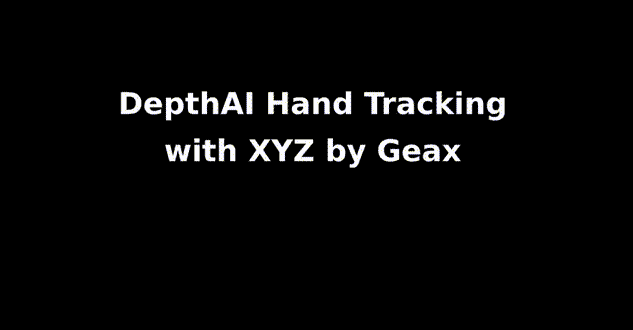
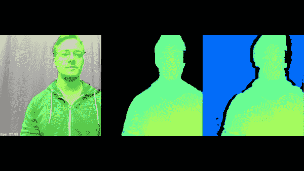

# OpenCV AI Kit (OAK)简介

> 原文：<https://pyimagesearch.com/2022/11/28/introduction-to-opencv-ai-kit-oak/>

* * *

## **目录**

* * *

## [**OpenCV AI Kit 介绍(橡树)**](#TOC)

我们非常兴奋能够在 Luxonis OpenCV AI Kit (OAK)上开始新的系列，这是一款独一无二的嵌入式视觉硬件。OAK 是部署计算机视觉和深度学习解决方案的一站式解决方案，因为它在一个硬币大小的设备中内置了多个摄像头和神经网络推理加速器。它由英特尔 Movidius Myriad X 视觉处理单元(VPU)提供支持，用于神经网络推理。

在今天的教程中，我们将向您介绍 OAK 硬件系列，并讨论它的功能和众多可以在 OAK 上运行的应用程序。此外，讨论具有立体深度的 OAK 如何同时运行高级神经网络并提供深度信息，使其成为市场上独一无二的嵌入式硬件。简而言之，我们想让您对 OAK 设备有一个全面的了解，并展示其真正的潜力。

本课是关于**橡树 101** 的 4 部分系列中的第一部分:

1.  [***OpenC 简介***](https://pyimg.co/dus4w)***[V](https://pyimg.co/dus4w)***[***AI Kit(橡树)***](https://pyimg.co/dus4w) **(今日教程)**
2.  *橡树 101:第二部*
3.  *橡树 101:第三部*
4.  *橡树 101:第四部*

**要了解 OAK-D 在计算机视觉和空间人工智能方面提供了什么，以及为什么它是市场上对爱好者和企业来说最好的嵌入式视觉硬件之一，** ***请继续阅读。***

* * *

## [****OpenCV AI Kit 简介(橡树)****](#TOC)

* * *

### [**简介**](#TOC)

为了庆祝 OpenCV 库成立 20 周年， [Luxonis](https://www.luxonis.com/) 与 OpenCV.org 官方[组织](http://opencv.org/)合作创建了 OpenCV AI Kit，这是一个麻省理工学院许可的开源软件 API，以及无数基于 X 的嵌入式板/相机。

2020 年 7 月，Luxonis 和 OpenCV 组织[发起了一项 Kickstarter 活动](https://www.kickstarter.com/projects/opencv/opencv-ai-kit)来资助这些奇妙的嵌入式人工智能板的创建。这场运动获得了巨大的成功；它从 6500 多名 Kickstarter 支持者那里筹集了大约 130 万美元的资金，有可能使它成为众筹史上最成功的嵌入式主板之一！

当他们第一次通过 Kickstarter 公开他们的产品时，OAK 由 OAK API 软件套件组成，支持 Python 和 OpenCV，允许对设备和两种不同类型的硬件进行编程:

1.  **OAK-1:** 标准的 OpenCV AI 板(如图**图 1** ( *左*))，可以进行神经网络推理、物体检测、物体跟踪、特征检测、基本的图像处理操作。
2.  **OAK-D:**OAK-1 中的一切，但带有立体深度相机，3D 对象定位，并在 3D 空间中跟踪对象。OAK-D(如图**图 1** ( *右*)是一款旗舰产品，可以同时运行高级神经网络并提供物体深度信息。

除了 OAK-1 和 OAK-D 型号共享的 4K/30FPS 12MP 摄像头之外，OAK-D 还利用两个单目摄像头提供空间人工智能。OAK-1 和 OAK-D 非常容易使用，使用 DepthAI API 更是如此。相信我们，如果你是一名研究人员、业余爱好者或专业人士，你不会失望的，因为 OAK 允许任何人充分利用它的力量。

在推出 OAK-1 和 OAK-D 一年后，2021 年 9 月，Luxonis 带着 OpenCV [发起了第二次 Kickstarter 战役](https://www.kickstarter.com/projects/opencv/opencv-ai-kit-oak-depth-camera-4k-cv-edge-object-detection)，这次是 OAK 的变种 OAK-D Lite(如图**图 2** )。顾名思义，它的重量和外形尺寸更小，但空间 AI 功能与 OAK-D 相同。此外，虽然 OAK-1 和 OAK-D 的价格分别为 99 美元和 149 美元，但 OAK-D Lite 的价格甚至低于 OAK-1(即仅 89 美元)。

为了降低成本和缩小尺寸，OAK-D Lite 采用了分辨率更低的单目摄像头，并取消了 IMU(惯性测量单元)的使用，因为它们价格昂贵且很少使用。有了许多这样的变化，OAK-D Lite 需要更少的功率，你可以用一个在 5V 电源下提供 900 毫安的 USB-C 来旋转它。

OAK 变体的列表不仅限于 OAK-1、OAK-D 和 OAK-D Lite。尽管如此，Luxonis 提供了更多的变体，它面向几乎所有的细分市场，如开发人员、研究人员和企业，用于生产级部署。

然而，所有的 OAK 模块都有许多标准功能，包括神经网络推理、计算机视觉方法(对象跟踪、特征跟踪、裁剪、Warp/Dewarp)、板载 Python 脚本、部署深度学习模型的 OpenVINO 兼容性(如图**图 3** )。

* * *

### [**橡木五金**](#TOC)

到目前为止，我们已经讨论了 OAK 硬件家族中的 OAK-1 和 OAK-D，我们还讨论了 OAK 的一个变体(即 OAK-D Lite)。在本节中，我们将深入探讨除 OAK-1、OAK-D 和 OAK-D Lite 之外的所有 Luxonis 产品，因为它们将其所有硬件产品分为三类:系列、变体和连接性，如图**图 4** 所示。

如上图所示，OAK 系列模块提供了三种类型的硬件；所有这些都有相同的板载 Myriad X VPU 用于神经网络推理，并提供一组标准功能，在**图 3** 中讨论。

如果您想了解更多关于英特尔 Myriad X VPU 的信息，请查看本产品文档。

* * *

#### [**橡树-1**](#TOC)

它附带一个 12MP RGB 摄像头，支持基于 USB 的连接和以太网供电(PoE)连接。Myriad X VPU 芯片允许它每秒执行 4 万亿次板载运算，保持主机(计算机)空闲。由于该设备具有 12 MP 摄像头和板载神经推理芯片，通信通过板载 2.1 Gbps MIPI 接口进行，速度超快。因此，总体推断速度是标准设置(通过 USB 连接到计算机的神经计算棒 2)的六倍以上，其中主机处理视频流。**图 5** 显示了通过 USB 连接到笔记本电脑的 NCS2。

以下是在 OAK-1 viz-a-viz NCS2 上运行对象检测网络(MobileNet-SSD)时获得的数字，主机为 Raspberry Pi:

*   OAK-1 + Raspberry Pi: 50+FPS，0% RPi CPU 利用率
*   NCS2 + Raspberry Pi: 8FPS，225% RPi CPU 利用率

* * *

#### [**奥克-D**](#TOC)

像 OAK-1 一样，OAK-D 模块配备了 12 MP RGB 彩色摄像头，并支持 USB 和 PoE 连接。除了 RGB 摄像头，它还有一对灰度立体摄像头，有助于执行深度感知。所有三个机载相机都实现了立体和 RGB 视觉，直接传输到 OAK System on Module (SoM)进行深度感知和人工智能推理。

引起我们注意的一个有趣的事实是左、右灰度立体相机之间的距离是 7.5 厘米，类似于两只眼睛瞳孔中心之间的距离。这种距离估计适用于大多数应用。最小可感知距离为 20 厘米，最大可感知距离为 35 米。

* * *

##### [**限制**](#TOC)

OAK-D 中的立体摄像机基线为 7.5 厘米，在图 6 的**中表示为`BL`。灰度立体摄像机对具有 89.5°的视野(FOV)，由于两个摄像机相距 7.5 厘米，它们将具有特定的盲点区域。两个摄像头中只有一个能看到这个盲点区域。**

由于我们需要从视差计算深度(深度与视差成反比)，这需要像素重叠，因此存在盲点。例如，在左单声道相机的左侧和右单声道相机的右侧的区域，其中深度不能被计算，因为它仅被两个相机中的一个看到。因此在**图 6** 中，该区域标有``B`` (即无法计算深度的条带宽度)。

* * *

#### [**奥克-FFC**](#TOC)

如图 7 所示，OAK FFC 模块化产品系列面向需要灵活硬件设置的开发人员和从业人员，而标准 OAK-D 并不适合他们的应用。它们更适合需要自定义安装、自定义基线(左右摄像机之间的距离)或自定义摄像机方向的应用。模块化允许您将立体摄像机放置在不同的基线上，不像 OAK-D 那样设置为 7.5 厘米。

俗话说，“没有值得拥有的东西是容易的”，这意味着这种灵活性带来了一个挑战，你需要弄清楚如何以及在哪里安装摄像机，一旦安装完毕，你需要执行[立体校准](https://docs.luxonis.com/en/latest/pages/calibration/)。当然，OAK-D 已经为你做好了所有的基础工作，所以记住这些 OAK-FFC 模块不像 OAK-1、OAK-D、OAK-D Lite 等那样是“即插即用”的，这一点很重要。因此，简而言之，你需要成为处理这些模块化设备的专家，或者有一些设置定制硬件的经验，以利用奥克-FFC 的力量。

* * *

#### [**橡树 USB 硬件产品**](#TOC)

通过 Kickstarter 活动首次推向市场的 OAK 模块是带有 USB 连接的 OAK，这也是最受欢迎的模块。OAK-1、OAK-D 和 OAK-D Lite 已经解决了两年多的实际问题。USB 连接非常适合开发——它易于使用，允许高达 10Gbps 的吞吐量。

OAK 的最新版本，如 OAK-D Pro，具有主动立体和夜视功能，使其成为市场上更有前景的边缘设备。通常很难找到支持夜视的摄像机，更不用说在这种情况下运行神经网络推理了。然而，有什么比将所有这些能力都烘焙到一个设备中更好的呢？该设备可以感知弱光环境，然后对这些帧进行神经网络推理(如图**图 9** )。

* * *

#### [**橡坡硬件产品**](#TOC)

OAK PoE 模块与 USB 模块非常相似，但它们没有 USB 连接，而是具有 PoE 连接。PoE 电缆的覆盖范围比 USB 大得多。另一个关键区别是，它们还具有板载闪存，因此您可以在[独立模式](https://docs.luxonis.com/projects/api/en/latest/tutorials/standalone_mode/)下运行管道。这意味着您不需要将 OAK 连接到主机，OAK PoE 可以无主机或在边缘运行推理。

PoE 设备具有 IP67 等级的外壳，这意味着它具有防水和防尘功能。

* * *

#### [**橡树开发者套件**](#TOC)

OAK developer kit 是 Luxonis 提供的所有变体中我们最喜欢的。简单来说，开发者套件就像在一个紧凑的解决方案中结合了 Raspberry Pi(或任何像 Nvidia 的 Jetson Nano 这样的微处理器)和 OAK-D。微处理器充当 OAK-D 的主机，使其完全独立。

**图 11** 显示了三种型号:OAK-D-CM3、OAK-D-CM4 和 OAK-D CM4 PoE。最新的计算模块 4 变体集成了 Raspberry Pi 计算模块 4(无线、4 GB RAM)及其所有接口(USB、以太网、3.5 mm 音频等。).此外，Raspberry Pi 操作系统也闪存到 32 GB eMMC 存储中。最后，为了连接、配置、构建管道并与 OAK 设备通信，它有一个 DepthAI Python 接口。

* * *

#### [**橡树模块对比**](#TOC)

**表 1** 显示了所有 OAK 变体，以及每种变体提供的特性和功能。从下表中可以看出，所有的 OAK 型号都支持 AI 和 CV 功能，因为所有的模块都配有至少一个摄像头和无数的 X 芯片。此外，除 OAK-1 变体之外的所有设备都支持空间数据(即深度感知)。

所有基于 PoE 连接的 OAK 型号也具有 IP67 等级，如下表所示。此外，OAK-D Pro USB 和 PoE 具有主动立体和夜视支持，使计算机视觉更上一层楼。

回想一下，带有 PoE 的 OAK 具有板载闪存，因此它可以在没有主机的情况下运行。类似地，那些有 Raspberry Pi 计算模块的已经有了主机。因此，PoE 和 CM 版本都支持独立模式。此外，CM 模块有一个协处理器(即 Raspberry Pi CM 4)。

* * *

### [**橡树上的应用**](#TOC)

在这一节中，我们将讨论一些可以在 OAK-1 上开箱即用的应用程序，而有些应用程序需要 OAK-D。

* * *

#### [**图像分类器 On-Device**](#TOC)

图像分类对于计算机视觉来说就像是深度学习的“hello world”。像大多数边缘设备一样，您也可以在 OAK 设备上高效地运行图像分类模型。**图 12** 显示了运行 Efficientnet-b0 变体的示例，该变体将动物分类为 Ibex(山羊)的概率为 34.46%。这个 Efficientnet 分类器是在 1000 类 ImageNet 数据集上训练的，可以在 DepthAI API 中动态加载。

* * *

#### [**人脸检测**](#TOC)

**图 13** 展示了基于 [libfacedetection](https://github.com/ShiqiYu/libfacedetection) 实现的 OAK 设备上的人脸检测应用演示。它检测图像中的人脸和五个面部标志:一双眼睛、鼻尖和嘴角点。检测器在 OAK 设备上达到 40 FPS。

* * *

#### [**人脸面具检测**](#TOC)

**图 14** 显示了一个面具/无面具检测器，它使用 MobileNet SSD v2 对象检测模型来检测人们是否戴着面具。从下面的 gif 可以看出，模型做得相当不错。当然，这是在 OAK-D 上运行的。你可以在这里阅读更多关于这个[的内容。](https://github.com/luxonis/depthai-experiments/tree/master/gen2-coronamask)

* * *

#### [**人数统计**](#TOC)

对象计数是一个两步过程，包括检测对象，然后在对象跟踪器的帮助下计数唯一出现的对象。**图 15** 显示了对向左和向右行走的人进行计数的演示。它的灵感来自于 PyImageSearch 博客文章 [OpenCV 人物计数器](https://pyimagesearch.com/2018/08/13/opencv-people-counter/)。当您需要计算进出商场或百货公司的人数时，人数计算非常有用。参考 [GitHub 库](https://github.com/luxonis/depthai-experiments/tree/master/gen2-cumulative-object-counting)来了解更多关于 OAK 的物体追踪。

* * *

#### [**年龄和性别识别**](#TOC)

**图 16** 显示了在 OAK-D 上使用 DepthAI 库运行两阶段推理的一个很好的例子。它首先检测给定帧中的人脸，裁剪它们，然后将这些人脸发送到年龄-性别分类模型。面部检测和年龄性别模型可在[英特尔目录](https://github.com/openvinotoolkit/open_model_zoo/tree/master/models/intel)内的 OpenVINO 的 GitHub 存储库中获得。你也可以参考[这个](https://docs.openvino.ai/2021.4/omz_models_group_intel.html)官方 OpenVINO 文档进行预训练的车型。

* * *

#### [**凝视估计**](#TOC)

凝视估计是一个有点复杂但有趣的例子。根据一个人的整张脸，它可以预测这个人看向哪里。如图**图 17** 所示，两个注视向量基于人的眼球运动而移动。

这个例子显示了在 OAK 上运行更复杂的应用程序的能力，这些应用程序涉及运行不是 1 个而是 4-5 个不同的神经网络模型。像前面的例子是两阶段推理流水线一样，凝视估计是使用 DepthAI 的三阶段推理(3 阶段，2 并行)。你可以在 [luxonis 库](https://github.com/luxonis/depthai-experiments/tree/master/gen2-gaze-estimation)上了解更多信息。

* * *

#### [](#TOC)

 **另一个简单的例子是在 OAK 设备上运行预训练的人脸检测神经网络，从给定的图像中提取感兴趣的人脸区域。然后在主机上使用标准的 OpenCV 方法来模糊人脸区域。图 18 中的**所示的端到端应用实时运行。**


**Figure 18:** Automate Face-Blurring.

* * *

#### [**人体骨骼姿态估计**](#TOC)

**图 19** 显示了一个在 OAK 设备上使用 Gen2 Pipeline Builder 的人体姿势估计网络示例。这是一个多人 2D 姿态估计网络(基于 [OpenPose](https://github.com/CMU-Perceptual-Computing-Lab/openpose) 方法)。该网络检测图像中每个人的姿势:由关键点和它们之间的连接组成的身体骨架。例如，姿势可以包含 18 个关键点，如耳朵、眼睛、鼻子、脖子、肩膀、肘部等。您可以使用`blobconverter`模块加载现成的人体姿势估计模型，该模块有助于将 OpenVINO 转换为 MyriadX blob 格式。

* * *

#### [**三维物体检测**](#TOC)

具有深度的对象检测需要 OAK-D；它不能在 OAK-1 设备上工作，下面两个例子也需要 OAK-D。

简单来说，3D 对象检测是关于在物理空间而不是像素空间(2D)中找到对象的位置/坐标。因此，当实时测量或与物理世界互动时，它是有用的。**图 20** 显示了一个融合了立体深度的神经推理示例，其中 DepthAI 使用空间信息扩展了 SSD 和 YOLO 等 2D 物体检测器，为其提供 3D 环境。

因此，在下图中，MobileNet 检测对象，并将对象检测与深度图融合，以提供它看到的对象的空间坐标(XYZ ):人、监视器、盆栽植物、瓶子和椅子。如果你仔细注意，瓶子的``z`` 比人小，显示器的``z`` 最大。而``z`` 是物体离相机的距离。

* * *

#### [**3D 地标定位**](#TOC)

3D 手标志检测器与前面的例子非常相似。使用常规相机，该网络返回所有 21 个手部标志(手指中所有关节的轮廓)的 2D (XY)坐标。然后，使用与立体深度融合的神经推理的相同概念，将这 21 个手标志转换为物理空间中的 3D 点，如**图 21** 所示。该应用在 OAK-D 上实现了大约 20 FPS。



**Figure 21:** Hand Landmark Detection with Depth.

* * *

#### [**语义切分带深度**](#TOC)

像图像分类、对象检测和关键点检测一样，您也可以在 OAK-D 上运行语义分割。**图 22** 展示了一个使用 DepthAI API 以 27 FPS 运行 DeepLabv3+的示例。它基于语义分割模型输出进一步裁剪深度图像。第一个窗口是语义分割输出，第二个是基于语义分割输出的裁剪的深度图，第三个是深度图。



**Figure 22:** Person Semantic Segmentation with Depth Image Cropping.

* * *

* * *

## [**汇总**](#TOC)

在本教程中，我们向您介绍了 OAK 硬件系列，并讨论了它的功能以及可以在 OAK 设备上运行的众多应用。

具体来说，我们详细讨论了 Luxonis 的两款旗舰产品，即 OAK-1 和 OAK-D，以及它们如何借助 Kickstarter 活动获得市场的牵引力。我们还讨论了 OAK-D 的局限性。

我们进一步研究了 Luxonis 硬件产品，讨论了 OAK-FFC、OAK USB 产品、OAK PoE 硬件、开发套件和 OAK 完整模块。

最后，我们讨论了可以在 OAK 硬件上运行的各种计算机视觉应用程序。

* * *

### [**引用信息**](#TOC)

**Sharma，a .**“OpenCV AI Kit(OAK)简介”， *PyImageSearch* ，P. Chugh，A. R. Gosthipaty，S. Huot，K. Kidriavsteva，R. Raha，A. Thanki 编辑。，2022 年，【https://pyimg.co/dus4w 

```py
@incollection{Sharma_2022_OAK1,
  author = {Aditya Sharma},
  title = {Introduction to {OpenCV AI} Kit {(OAK)}},
  booktitle = {PyImageSearch},
  editor = {Puneet Chugh and Aritra Roy Gosthipaty and Susan Huot and Kseniia Kidriavsteva and Ritwik Raha and Abhishek Thanki},
  year = {2022},
  note = {https://pyimg.co/dus4w},
}
```

* * *

* * ***