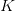

# YOLO 家族简介

> 原文：<https://pyimagesearch.com/2022/04/04/introduction-to-the-yolo-family/>

* * *

* * *

## [YOLO 家族简介](#TOC)

目标检测是计算机视觉中最重要的课题之一。大多数计算机视觉问题涉及检测视觉对象类别，如行人、汽车、公共汽车、人脸等。这是一个不仅限于学术界的领域，在视频监控、医疗保健、车载传感和自动驾驶等领域也有潜在的真实世界商业用例。

很多用例，尤其是自动驾驶，需要很高的精度和实时推理速度。因此，选择一款既能满足速度要求又能满足精度要求的物体检测器变得至关重要。YOLO(你只看一次)是一个单级对象检测器，介绍了实现两个目标(即，速度和准确性)。今天，我们将介绍 YOLO 家族，包括所有的 YOLO 变种(例如，YOLOv1，YOLOv2，…，YOLOX，YOLOR)。

从一开始，对象检测领域就有了很大的发展，最先进的体系结构在各种测试数据集上得到了很好的推广。但是为了理解这些当前最好的架构背后的魔力，有必要知道这一切是如何开始的，以及我们在 YOLO 家族中已经达到了什么程度。

在对象检测中有三类算法:

*   基于传统的计算机视觉
*   基于两阶段深度学习的算法
*   第三种是基于单阶段深度学习的算法

今天，我们将讨论 YOLO 对象检测家族，它属于单阶段深度学习算法。

我们相信这是一篇独一无二的博客文章，在一篇文章中涵盖了所有 YOLO 版本，将帮助您深入了解每个版本，并可能帮助您为您的项目选择最佳的 YOLO 版本。

这节课是我们关于 **YOLO 天体探测器**的 7 部分系列的第一节课:

1.  [](https://pyimg.co/dgbvi)***(今日教程)***
2.  *[*了解一个实时物体检测网络:你只看一次(YOLOv1)*](https://pyimg.co/3cpmz)*
3.  *[*更好、更快、更强的物体探测器(YOLOv2)*](https://pyimg.co/ehaox)*
4.  *[*使用 COCO 评估器*](https://pyimg.co/nwoka) 平均精度(mAP)*
5.  *[*用 Darknet-53 和多尺度预测的增量改进(YOLOv3)*](https://pyimg.co/8xfpg)*
6.  *[*【yolov 4】*](https://pyimg.co/c6kiu)*
7.  *[***在自定义数据集上训练 YOLOv5 物体检测器***](https://pyimg.co/fq0a3)*

 ***要了解 YOLO 家族是如何进化的，每一个变种在检测图像中的物体方面都不同于前一个版本，并且比前一个版本更好，*继续阅读*。**

* * *

## **[物体探测简介](#TOC)**

回忆在图像分类中，目标是回答“图像中存在什么？”其中模型试图通过给图像分配特定的标签来理解整个图像。

通常，我们处理图像分类中只存在一个对象的情况。如图**图 1** 所示，我们有一个圣诞老人，还有几个物体，但主要物体是圣诞老人，有 98%的概率被正确分类。太好了。在像这样的特定情况下，当一幅图像描绘一个单一的物体时，分类足以回答我们的问题。

然而，在许多情况下，我们无法用单个标签说出图像中的内容，图像分类不足以帮助回答这个问题。例如，考虑**图 2** ，其中模型检测三个对象:两个人和一个棒球手套，不仅如此，它还识别每个对象的位置。这被称为对象检测。

物体检测的另一个关键用例是自动车牌识别，如图**图 3** 所示。现在问你自己一个问题，如果你不知道车牌的位置，你如何识别车牌上的字母和数字？当然，首先，你需要用物体检测器识别车牌的位置，然后应用第二种算法来识别数字。

对象检测包括分类和定位任务，用于分析图像中可能存在多个对象的更真实的情况。因此，目标检测是一个两步过程；第一步是找到物体的位置。

第二步是将这些边界框分类成不同的类别，因为这种对象检测会遇到与图像分类相关的所有问题。此外，它还有本地化和执行速度的挑战。

* * *

### [**挑战**](#TOC)

*   **拥挤或杂乱场景:**图像中过多的物体(**图 4** )使其变得极其拥挤。这给对象检测模型带来了各种挑战，如遮挡可能很大，对象可能很小，以及比例可能不一致。

*   **类内方差:**对象检测的另一个主要挑战是正确检测同一类的对象，这可能具有高方差。比如**图五**所示，狗的品种有六种，而且都有不同的大小、颜色、皮毛长度、耳朵等。，所以检测这些同类的物体可能具有挑战性。

*   **类别不平衡:**这是一个影响几乎所有模态的挑战，无论是图像、文本还是时间序列；更具体地说，在图像领域，图像分类非常困难，对象检测也不例外。我们称之为物体检测中的前景-背景类不平衡，如图**图 6** 所示。

    为了理解类别不平衡如何在对象检测中造成问题，考虑包含很少主要对象的图像。图像的其余部分用背景填充。因此，该模型将查看图像(数据集)中的许多区域，其中大多数区域将被认为是负面的。由于这些负面因素，模型学不到任何有用的信息，并且会淹没模型的整个训练。

许多其他挑战与对象检测相关，如*遮挡*、*变形*、*视点变化*、*光照条件*，以及实时检测的基本*速度*(许多工业应用中需要)。

* * *

### [**物体探测的历史**](#TOC)

目标检测是计算机视觉中最关键和最具挑战性的问题之一，在过去的十年中，它的发展创造了历史。然而，这一领域的进展是显著的；每年，研究界都会实现一个新的最先进的基准。当然，如果没有深度神经网络的力量和 NVIDIA GPUs 的大规模计算，这一切都不可能实现。

在物体检测的历史中，有两个截然不同的时代:

1.  传统的计算机视觉方法一直持续到 2010 年，
2.  从 2012 年开始，当 AlexNet(一种图像分类网络)赢得 [ImageNet 视觉识别](https://www.image-net.org/)挑战赛时，卷积神经网络的新时代开始了。

这两个时代之间的区别在图 7 中也很明显，该图显示了物体检测的路线图，从 2004 年的[Viola–Jones](https://en.wikipedia.org/wiki/Viola%E2%80%93Jones_object_detection_framework)探测器到 2019 年的 [EfficientDet](https://arxiv.org/pdf/1911.09070.pdf) 。值得一提的是，基于深度学习的检测方法进一步分为两级检测器和单级检测器。

大多数传统的对象检测算法，如 Viola–Jones、梯度方向直方图(HOG)和可变形部分模型(DPM ),都依赖于从图像中提取手工特征，如边缘、角、梯度和经典的机器学习算法。例如，第一个对象检测器 Viola–Jones 仅设计用于检测人的正面，而在侧面和上下面部上表现不佳。

然后，2012 年迎来了一个新时代。一场彻底改变了计算机视觉游戏的革命，当一种深度卷积神经网络(CNN)架构 [AlexNet](https://en.wikipedia.org/wiki/AlexNet) 因需要改善 ImageNet challenge 的结果而诞生时，在 2012 ImageNet LSVRC-2012 challenge 上实现了相当高的准确度，其**准确度为 84.7%** ，而第二名的准确度为 73.8%。

那么，这些最先进的图像分类架构开始被用作对象检测管道中的特征提取器只是时间问题。这两个问题是相互关联的，它们依赖于学习健壮的高级特征。因此， [Girschick 等人(2014)](https://arxiv.org/pdf/1311.2524.pdf) 展示了我们如何使用卷积特征进行对象检测，引入了 R-CNN(将 CNN 应用于区域提议)。从那时起，物体检测开始以前所未有的速度发展。

如图**图 7** 所示，深度学习检测方法可以分为两个阶段；第一种称为两阶段检测算法，在多个阶段进行预测，包括像 RCNN，Fast-RCNN Faster-RCNN 等网络。

第二类探测器称为单级探测器，如 [SSD](https://arxiv.org/pdf/1512.02325.pdf) ，YOLO，EfficientDet 等。

在**图 8** 中，你可以看到所有的 YOLO 物体检测算法以及它们是如何进化的，从 2016 年 YOLOv1 在 Pascal VOC (20 类)数据集上获得 63.4mAP 到 2021 年 YOLOR 在更具挑战性的 MS COCO 数据集(80 类)上获得 73.3 mAP。这就是学术界的魅力所在。凭借持续的努力和应变能力，YOLO 天体探测已经取得了长足的进步！

* * *

### [**什么是单级物体探测器？**](#TOC)

单级对象检测器是一类单级对象检测架构。他们将目标检测视为简单的回归问题。例如，馈送到网络的输入图像直接输出类别概率和边界框坐标。

这些模型跳过区域提议阶段，也称为区域提议网络，它通常是两阶段对象检测器的一部分，是图像中可能包含对象的区域。

**图 9** 显示了单级和两级探测器的工作流程。在单阶段中，我们直接在特征图上应用检测头，而在两阶段中，我们首先在特征图上应用区域建议网络。

然后，这些区域被进一步传递到第二阶段，对每个区域进行预测。fast-RCNN 和 Mask-RCNN 是一些最流行的两阶段对象检测器。

虽然两级检测器被认为比单级对象检测器更准确，但是它们涉及多级时推理速度较慢。另一方面，单级检测器比两级检测器快得多。

* * *

## **[yolov 1](#TOC)**

2016 年，Joseph Redmon 等人在 CVPR 会议上发布了第一款单级物体探测器 [You Only Look Once: Unified，Real-Time Object Detection](https://www.cv-foundation.org/openaccess/content_cvpr_2016/papers/Redmon_You_Only_Look_CVPR_2016_paper.pdf) 。

**YOLO** (你只看一次)是物体探测领域的突破，因为它是第一个将探测视为回归问题的单级物体探测器方法。检测架构仅查看图像一次，以预测对象的位置及其类别标签。

与两阶段检测器方法(快速 RCNN，更快 RCNN)不同，YOLOv1 没有建议生成器和细化阶段；它使用一个单一的神经网络，从一个完整的图像中预测类别概率和边界框坐标。因为检测管道本质上是一个网络，所以它可以被端到端地优化；可以把它想象成一个图像分类网络。

由于该网络旨在以类似于图像分类的端到端方式进行训练，因此该架构速度极快，并且基本 YOLO 模型在 Titan X GPU 上以 45 FPS(每秒帧数)的速度预测图像。作者还提出了一种更轻便的 YOLO 版本，称为快速 YOLO，具有更少的以 155 FPS 处理图像的层。是不是很神奇？

YOLO 实现了 **63.4 mAP** (均值平均精度)，如**表 1** 所示，是其他实时探测器的两倍多，让它更加特别。我们可以看到，在平均精度(接近 2 倍)和 FPS 方面，YOLO 和快速 YOLO 都远远超过 DPM 的实时对象检测器变体。

YOLO 的概括能力在来自互联网的艺术作品和自然图像上进行了测试。此外，它大大优于可变形部分模型(DPM)和基于区域的卷积神经网络(RCNN)等检测方法。

在我们接下来的第 2 课中，我们将深入探讨 YOLOv1，所以一定要去看看！

* * *

## **[约洛夫 2](#TOC)**

雷德蒙和法尔哈迪(2017)在 CVPR 会议上发表了 [YOLO9000:更好、更快、更强](https://openaccess.thecvf.com/content_cvpr_2017/papers/Redmon_YOLO9000_Better_Faster_CVPR_2017_paper.pdf)的论文。作者在本文中提出了两种*最先进的* YOLO 变种:YOLOv2 和 YOLO9000 两者完全相同，但训练策略不同。

YOLOv2 在检测数据集上接受训练，如 [Pascal VOC](http://host.robots.ox.ac.uk/pascal/VOC/) 和 [MS COCO](https://cocodataset.org/#home) 。同时，YOLO9000 被设计成通过在 MS COCO 和 [ImageNet](https://www.image-net.org/index.php) 数据集上联合训练来预测 9000 多种不同的物体类别。

改进的 YOLOv2 模型使用了各种新技术，在速度和准确性方面都优于 Faster-RCNN 和 SSD 等最先进的方法。一种这样的技术是多尺度训练，它允许网络在不同的输入规模下进行预测，从而允许在速度和准确性之间进行权衡。

在 416×416 输入分辨率下，YOLOv2 在 VOC 2007 数据集上实现了 **76.8 mAP** ，在 Titan X GPU 上实现了 **67 FPS** 。在 544×544 输入的同一数据集上，YOLOv2 获得了 **78.6 mAP** 和 **40 FPS** 。

**图 10** 显示了 YOLOv2 在 Titan X GPU 上不同分辨率下的基准测试，以及其他检测架构，如更快的 R-CNN、YOLOv1、SSD。我们可以观察到，几乎所有的 YOLOv2 变体在速度或准确性方面都优于其他检测框架，并且在 YOLOv2 中可以观察到准确性(mAP)和 FPS 之间的明显权衡。

关于 YOLOv2 的详细回顾，请关注我们即将到来的第 3 课。

* * *

## **[约洛夫 3](#TOC)**

雷德蒙和法尔哈迪(2018)发表了关于 arXiv 的 [YOLOv3:增量改进](https://arxiv.org/pdf/1804.02767.pdf)论文。作者对网络架构做了许多设计上的修改，并采用了 YOLOv1 的大部分其他技术，尤其是 YOLOv2。

本文介绍了一种新的网络体系结构 Darknet-53。Darknet-53 是一个比以前大得多的网络，并且更加精确和快速。它在各种图像分辨率下进行训练，如 320×320、416×416。在 320×320 分辨率下，YOLOv3 在 Titan X GPU 上实现了 **28.2 mAP** 以 **45 FPS** 运行，精度与单镜头探测器(SSD321)一样，但速度快 3 倍(如图**图 11** )。

在接下来的第 5 课中，我们将彻底分解 YOLOv3。

* * *

## **[约洛夫 4](#TOC)**

YOLOv4 是许多实验和研究的产物，结合了各种提高卷积神经网络准确性和速度的小型新技术。

[本文](https://arxiv.org/pdf/2004.10934v1.pdf)对不同的 GPU 架构进行了广泛的实验，结果显示 YOLOv4 在速度和准确性方面优于所有其他对象检测网络架构。

2020 年，Bochkovskiy 等人(著名 GitHub 知识库:Darknet 的作者)在 arXiv 上发表了 [YOLOv4:物体检测的最佳速度和精度](https://arxiv.org/pdf/2004.10934v1.pdf)论文。我们可以从**图 12** 中观察到，在性能相当的情况下，YOLOv4 的运行速度是 EfficientDet 的两倍，它将 YOLOv3 的 mAP 和 FPS 提高了 10%和 12%。

卷积神经网络(CNN)的性能很大程度上取决于我们使用和组合的特征。例如，某些功能仅适用于特定的模型、问题陈述和数据集。但是批量规范化和残差连接等功能适用于大多数模型、任务和数据集。因此，这些特征可以被称为普遍性的。

[Bochkovskiy 等人](https://arxiv.org/pdf/2004.10934v1.pdf)利用这一想法并假设一些通用特征，包括

*   加权剩余连接(WRC)
*   跨级部分连接(CSP)
*   交叉小批量归一化(CmBN)
*   自我对抗训练
*   Mish 激活
*   镶嵌数据增强
*   丢弃块正则化
*   CIoU 损失

上述功能相结合，实现了最先进的结果:在特斯拉 V100 GPU 上以 65 FPS 的实时速度在 MS COCO 数据集上实现了 43.5%的 mAP (65.7% mAP50)。

YOLOv4 模型结合了上述和更多的特征，形成了用于改进模型训练的“赠品包”和用于改进物体检测器精度的“特殊包”。

我们将在即将到来的第 6 课中用代码全面介绍 YOLOv4。

* * *

## **[约洛夫 5](#TOC)**

2020 年，YOLOv4 发布后，短短两个月内， [Ultralytics](https://ultralytics.com) 的创始人兼首席执行官 Glenn Jocher 在 [GitHub](https://github.com/ultralytics/yolov5) 上发布了 YOLOv5 的开源实现。YOLOv5 提供了一系列在 MS COCO 数据集上预先训练的对象检测架构。紧接着发布了 [EfficientDet](https://arxiv.org/pdf/1911.09070.pdf) 和 YOLOv4。这是唯一一个没有研究论文的 YOLO 天体探测器，最初导致了一些争议；然而，很快，这种想法被打破了，因为它的能力破坏了噪音。

今天，YOLOv5 是官方最先进的模型之一，拥有巨大的支持，并且在生产中更容易使用。最好的部分是 YOLOv5 是在 PyTorch 中本地实现的，消除了 Darknet 框架的限制(基于 C 编程语言，而不是从生产环境的角度构建的)。Darknet 框架已经随着时间的推移而发展，是一个很好的研究框架，可以使用 TensorRT 进行训练、微调和推理；所有这些都可以通过 Darknet 实现。然而，它有一个较小的社区，因此，支持较少。

PyTorch 中 YOLO 的这一巨大变化使得开发人员更容易修改架构并直接导出到许多部署环境中。别忘了，YOLOv5 是火炬中心展示区的官方最先进车型之一。

正如您在下面的 shell 块中所看到的，您可以用 YOLOv5 和 PyTorch Hub 在仅仅五行代码中运行一个推理。是不是很神奇？

```py
$ import torch
$ model = torch.hub.load('ultralytics/yolov5', 'yolov5s')  # or yolov5m, yolov5l
$ img = 'https://ultralytics.cimg/zidane.jpg'  # or file, Path, PIL, OpenCV
$ results = model(img)
$ results.print()  # or .show(), .save()
```

在发布的时候，YOLOv5 是所有已知的 YOLO 实现中最先进的。自从 YOLOv5 发布以来，这个库一直非常活跃，自从 YOLOv5-v1.0 发布以来，已经有超过 90 个贡献者。

从开发的角度来看，YOLOv5 存储库提供了大量的功能，使得在各种目标平台上训练、调整、测试和部署变得更加容易。他们提供的一些现成教程包括:

*   [自定义数据集训练](https://github.com/ultralytics/yolov5/wiki/Train-Custom-Data)
*   [多 GPU 训练](https://github.com/ultralytics/yolov5/issues/475)
*   在[tensort、CoreML、ONNX 和 TFLite](https://github.com/ultralytics/yolov5/issues/251) 上导出训练好的 YOLOv5 模型
*   [修剪 YOLOv5 架构](https://github.com/ultralytics/yolov5/issues/304)
*   [使用 TensorRT 部署](https://github.com/wang-xinyu/tensorrtx)

此外，他们还开发了一款名为 [iDetection](https://ultralytics.com/yolov5) 的 iOS 应用，提供了 YOLOv5 的四种变体。我们在 iPhone 13 Pro 上测试了该应用，结果令人印象深刻；该模型以接近 30FPS 的速度运行检测。

与 YOLOv4 相同，YOLO v5 使用跨级部分连接，主干是 Darknet-53，路径聚合网络是瓶颈。主要改进包括新的镶嵌数据增强(来自 YOLOv3 PyTorch 实现)和自动学习边界框锚点。

* * *

### [**镶嵌数据增强**](#TOC)

镶嵌数据增强的想法最初由 Glenn Jocher 在 YOLOv3 PyTorch 实现中使用，现在用于 YOLOv5。镶嵌增强将四幅训练图像按照特定的比例拼接成一幅图像，如图**图 13** 所示。马赛克增强对流行的 COCO 对象检测基准特别有用，有助于模型学习解决众所周知的“小对象问题”——小对象不如较大对象检测得准确。

使用镶嵌数据增强的好处在于

*   网络在一个图像中看到更多的上下文信息，甚至在它们的正常上下文之外。
*   允许模型学习如何在比通常更小的尺度上识别对象。
*   批量标准化将减少 4 倍，因为它将在每层计算 4 个不同图像的激活统计数据。这将减少在训练期间对大的小批量的需求。

* * *

### [**量化基准**](#TOC)

在**表 2** 中，我们展示了 Volta 100 GPU 上 640×640 图像分辨率的 MS COCO 验证数据集上五个 YOLOv5 变体的性能(mAP)和速度(FPS)基准。所有五个模型都是在 MS COCO 训练数据集上训练的。型号性能指标评测从 YOLOv5n 开始按升序显示(即，具有最小型号尺寸的 nano 变体到最大型号 YOLOv5x)。

考虑 YOLOv5l 它实现了 10.1ms(或 100 FPS)的推理速度，批量大小= 1，在 0.5 IOU 时的 mAP 为 67.2。相比之下，V100 上 608 分辨率的 YOLOv4 在 0.5 IOU 下用 65.7 mAP 实现了 62 FPS 的推理速度。YOLOv5 是这里的明显赢家，因为它提供了最好的性能，甚至比 YOLOv4 更快。

* * *

### [**YOLOv5 纳米释放**](#TOC)

2021 年 10 月，YOLOv5-v6.0 发布，整合了许多新功能和错误修复([来自 73 名贡献者](https://github.com/ultralytics/yolov5/compare/v5.0...v6.0)的 465 条 PRs)，带来了架构调整，并重点介绍了新的 P5 和 P6 **Nano** 型号:YOLOv5n 和 YOLOv5n6。Nano 型号的参数比以前的型号少`~75%`，从 7.5M 到 1.9M，小到足以在移动设备和 CPU 上运行(如图**图 14** 所示)。从下图中还可以明显看出，YOLOv5 的性能远远优于 EfficientDet。此外，即使是最小的 YOLOv5 变体(即 YOLOv5n6)也能比 EfficientDet 更快地达到相当的精度。

* * *

#### [**约洛夫 5n 与约洛夫 4 相比——微小的**](#TOC)

由于 YOLOv5n 是 YOLOv5 最小的变体，我们将其与 YOLOv4-Tiny 进行比较，YOLOv4-Tiny 也是 yolov 4 型号中最轻的变体。**图 15** 显示 YOLOv5 nano 变体在训练时间和准确性方面明显优于 YOLOv4-Tiny。

* * *

## **[PP-YOLO](#TOC)**

到目前为止，我们已经在两个不同的框架中看到了 YOLO，即 Darknet 和 PyTorch 然而，还有第三个实现 YOLO 的框架叫做 PaddlePaddle framework，因此得名 [PP-YOLO](https://arxiv.org/pdf/2007.12099v3.pdf) 。PaddlePaddle 是百度编写的深度学习框架，拥有海量的计算机视觉和自然语言处理模型知识库。

YOLOv4 发布还不到四个月，2020 年 8 月，[百度](https://en.wikipedia.org/wiki/Baidu) ( [龙等](https://arxiv.org/pdf/2007.12099v3.pdf))的研究人员发表了《PP-YOLO:物体检测器的有效实现》。与 YOLOv4 类似，PP-YOLO 物体探测器也是基于 YOLOv3 架构构建的。

* * *

### [](#TOC)

 **PP-YOLO 是 [PaddleDetection](https://github.com/PaddlePaddle/PaddleDetection) 的一部分，这是一个基于 PaddlePaddle 框架的端到端对象检测开发套件(如图**图 16** 所示)。它提供了大量的对象检测架构、主干、数据增强技术、组件(如 losses、特征金字塔网络等)。)可以组合成不同的配置来设计最佳的对象检测网络。

简而言之，它提供了图像处理功能，如对象检测、实例分割、多对象跟踪、关键点检测，从而以更快、更好的方式简化了这些模型的构建、训练、优化和部署中的对象检测过程。

现在让我们回到 PP-YOLO 论文。

PP-YOLO 论文的目标不是发布一个新颖的对象检测模型，而是一个具有相对平衡的有效性和效率的对象检测器，可以直接应用于实际应用场景。这个目标与 PaddleDetection 开发套件的动机产生了共鸣。因此，新奇的是证明这些技巧和技术的组合更好地平衡了有效性和效率，并提供了一个[消融研究](https://blog.roboflow.com/glossary/#:~:text=ablation%20study)每一步对探测器有多大帮助。

与 YOLOv4 类似，本文还尝试结合现有的各种技巧，在不增加模型参数和 FLOPs 数量的情况下，尽可能提高检测器的精度，并保证检测器的速度几乎不变。然而，与 YOLOv4 不同，这篇论文没有探索不同的主干网络(Darknet-53，ResNext50)和数据增强方法，也没有使用神经架构搜索(NAS)来搜索模型超参数。

* * *

### [**PP-YOLO 表演**](#TOC)

通过结合所有的技巧和技术，当在批量= 1 的 Volta 100 GPU 上测试时，PP-YOLO 实现了 45.2%的 mAP 和 72.9 FPS 的推理速度(如图**图 17** 所示)，标志着有效性和效率之间的更好平衡，超过了著名的最先进的检测器，如 EfficientDet、YOLOv4 和 RetinaNet。

* * *

### [**PP-YOLO 建筑**](#TOC)

单级检测模型通常由主干、检测颈和检测头组成。PP-YOLO 的架构(如图**图 18** 所示)与 YOLOv3 和 YOLO4 检测模型非常相似。

PP-YOLO 检测器分为三个部分:

*   **主干:**物体检测器的主干是一个完全卷积的网络，有助于从图像中提取特征图。它在精神上类似于预先训练的图像分类模型。提议的模型使用 ResNet50-vd-dcn 作为主干，而不是使用 Darknet-53 架构(在 YOLOv3 和 YOLOv4 中)。

    在提出的主干模型中，3×3 卷积层在架构的最后一级被可变形卷积代替。ResNet50-vd 的参数数和 FLOPs 数比 Darknet-53 少得多。这有助于实现比 YOLOv3 略高的 39.1 的 mAP。

*   **检测瓶颈**:特征金字塔网络(FPN)通过特征地图之间的横向连接创建特征金字塔。如果你仔细观察下图，来自 C3、C4 和 C5 阶段的特征地图作为输入被馈送到 FPN 模块。

*   **检测头**:检测头是物体检测流水线的最后一部分，预测物体的包围盒(定位)和分类。PP-YOLO 的头部与 YOLOv3 的头部相同。预测最终输出使用 3×3 卷积层，然后是 1×1 卷积层。

    最终输出的输出通道为")，其中为类数(MS COCO 数据集为 80)，3 为每个网格的锚点数。对于每个锚点，前 K 个通道是预测类别概率，四个通道是边界框坐标预测，一个通道是客观分数预测。

在上面的 PP-YOLO 架构中，菱形注入点表示坐标-conv 层，紫色三角形表示拖放块，红色星形标记表示空间金字塔池。

* * *

### [**选择招数和技巧**](#TOC)

如果您还记得，我们讨论过本文结合了各种技巧和技术来设计有效且高效的对象检测网络；现在，我们将简要介绍每一项。这些技巧都是已经存在的，来自不同的论文。

*   **更大的批量:**利用更大的批量有助于稳定训练，并让模型产生更好的结果。批次大小从 64 个更改为 192 个，相应地，学习率和培训计划也将更新。
*   **指数移动平均:**作者声称，使用训练参数的移动平均在推断过程中产生了更好的结果。
*   **DropBlock 正则化:**这是一种类似于用于防止过拟合的 drop 正则化的技术。然而，在丢弃块正则化中，丢弃的特征点不再随机分布，而是组合成块，并且丢弃整个块。因此，这是一种结构性缺失，其中来自特征图相邻区域的神经元被一起丢弃，如图**图 19** 所示。

在 PP-YOLO 中，DropBlock 仅应用于检测头(即 FPN)，因为将其添加到主干会降低模型的性能。

*   **交集超过并集(IoU)损耗:**增加了一个额外的损耗(即 IoU 损耗)来训练模型，而 YOLOv3 中使用了现有的 L1 损耗，大部分 YOLO 架构都没有替换。增加了一个额外的分支来计算 IoU 损失。这是因为 mAP 评估指标强烈依赖于 IoU。
*   **IoU Aware:** 由于在最终检测置信度中不考虑定位精度，所以增加了 IoU 预测分支来测量定位精度。而在推断期间，预测的 IoU 分数乘以分类概率和客观性分数来预测最终的检测置信度。
*   **矩阵非最大值抑制(NMS):** 软 NMS 版本的并行实现比传统 NMS 使用得更快，并且不会带来任何效率损失。软 NMS 按顺序工作，不能并行实现。
*   **空间金字塔池(SPP)层:**yolov 4 中实现的 SPP 层也应用于 PP-YOLO，但仅应用于顶部要素地图。添加 SPP 会增加 2%的模型参数和 1%的 FLOPS，但这会让模型增加特征的感受域。
*   **更好的预训练模型:**使用 ImageNet 上分类精度更好的预训练模型，检测性能更好。提取的 ResNet50-vd 模型被用作预训练模型。

* * *

### [**结果**](#TOC)

在前面对 PP-YOLO 的介绍中，我们了解到 PP-YOLO 的运行速度比 YOLOv4 更快，平均精度得分从 43.5%提高到 45.2%。PP-YOLO 的详细性能如**表 3** 所示。

[Long et al. (2020)](https://arxiv.org/pdf/2007.12099v3.pdf) 在 Volta 100 GPU 上比较了有无 TensorRT 的模型(以加快推断速度)。从表中，我们可以得出结论，与 YOLOv4 相比，MS COCO 数据集上的 mAP 得分从 43.5%增加到 45.2%，FPS 从 62 增加到 72.9(不含 TensorRT)。

该表还显示了具有其他图像分辨率的 PP-YOLO，与其他最先进的检测器相比，PP-YOLO 在速度和准确性的平衡方面确实具有优势。

* * *

### [**消融研究**](#TOC)

作者进行的烧蚀研究显示了技巧和技术如何影响模型的参数和性能。在**表 4** 中，PP-YOLO 从表示为 B 的第二行开始，其中检测器使用 ResNet50 作为具有可变形卷积的主干。当您移动到下一行 C 时，技巧被添加到先前的模型架构中，并且贯穿始终。参数和触发器的性能增益和增加显示在相应的列中。

我们强烈建议您查看论文了解更多细节。

* * *

## **[【约洛夫 4】](#TOC)**

[王等(2021)](https://arxiv.org/pdf/2011.08036.pdf) 在会议上发表了题为“Scaled-YOLOv4: Scaling 跨级局部网络”的论文。这篇论文到目前为止已经收集了 190 多篇引用！有了 Scaled-YOLOv4，作者通过有效地扩展网络的设计和规模，推动了 YOLOv4 模型的发展，超过了今年早些时候由谷歌研究大脑团队发布的先前最先进的 [EfficientDet](https://arxiv.org/pdf/1911.09070.pdf) 。

PyTorch 框架中 Scaled-YOLOv4 的实现可以在[这里](https://github.com/WongKinYiu/ScaledYOLOv4)找到。

所提出的基于跨阶段部分方法的检测网络可以向上和向下扩展，在速度和准确性的两端都超过了以前的小型和大型对象检测模型的基准。此外，网络扩展方法修改了网络的深度、宽度、分辨率和结构。

**图 20** 显示了缩放的 YOLOv4-large 模型在 Tesla V100 GPU 上以 16 FPS 的速度对 MS COCO 数据集实现了 55.5%的 AP (73.4% AP50)。

另一方面，名为 Scaled-YOLOv4-tiny 的较轻版本在 RTX 2080Ti GPU 上以 443 FPS 的速度实现了 22.0% AP (42.0% AP50)，同时使用 TensorRT(具有半精度 FP-16)优化(批量大小= 4)。

**图 20** 显示，与其他最先进的检测器相比，Scaled-YOLOv4 获得了最佳结果。

* * *

### [**什么是模型缩放？**](#TOC)

卷积神经网络架构可以在三个维度上扩展:*深度、宽度和分辨率*。网络的**深度**对应于网络的层数。**宽度**与卷积层中滤波器或信道的数量相关。最后，**分辨率**就是输入图像的高度和宽度。

**图 21** 给出了跨这三个维度的模型缩放的更直观的理解，其中(a)是基线网络示例；(b)-(d)是仅增加网络宽度、深度或分辨率的一个维度的传统缩放；以及(e)是提出的(在效率上)复合缩放方法，其以固定的比率均匀地缩放所有三个维度。

传统的模型缩放方法是改变一个模型的深度，即增加更多的卷积层数。例如，Simonyan 等人设计的 VGGNet 在不同阶段堆叠了额外的卷积层，并使用这一概念设计了 VGG-16 和 VGG-19 架构。

以下方法通常遵循相同的模型缩放方法。首先是由[何等(2015)](https://arxiv.org/pdf/1512.03385.pdf) 提出的 ResNet 架构，使用深度缩放来构造非常深的网络，如 ResNet-50、ResNet-101，这种架构允许网络学习更复杂的特征，但遭受消失梯度问题。后来， [Zagoruyko 和 Komodakis (2017)](https://arxiv.org/pdf/1605.07146.pdf) 想到了网络的宽度，他们改变了卷积层的核的数量来实现缩放，于是，wide ResNet (WRN)，同时保持了相同的精度。尽管 WRN 的参数比 ResNet 多，但推理速度却快得多。

然后近年来，复合缩放使用*复合系数*统一缩放卷积神经网络架构的深度/宽度/分辨率的所有维度。与任意缩放这些因素的传统实践不同，复合缩放方法使用一组固定的缩放系数统一缩放网络宽度、深度和分辨率。

而这也是 scaled-YOLOv4 试图做的事情，即使用最优网络缩放技术来实现 YOLOv4-CSP -> P5 -> P6 -> P7 检测网络。

* * *

### [**约洛夫 4 对约洛夫 4 的改进**](#TOC)

*   Scaled-YOLOv4 使用最佳网络扩展技术来实现 YOLOv4-CSP -> P5 -> P6 -> P7 网络。
*   修改了宽度和高度的激活，允许更快的网络训练。
*   改进的网络架构:主干优化和颈部(路径聚合网络)使用 CSP 连接和 Mish 激活。
*   在训练期间使用指数移动平均线(EMA)。
*   对于网络的每个分辨率，训练一个单独的网络，而在 YOLOv4 中，在多个分辨率上训练单个网络。

* * *

### [**约洛夫 4 设计**](#TOC)

* * *

#### [**CSP 化的 yolov 4**](#TOC)

YOLOv4 是为通用 GPU 上的实时对象检测而设计的。在缩放 YOLOv4 中，YOLOv4 根据 YOLOv4-CSP 进行了重新设计，以获得最佳的速度/精度平衡。

[王等(2021)](https://arxiv.org/pdf/2011.08036.pdf) 在论文中经常提到，他们将物体检测网络的某个给定部分“CSP 化”。这里的 CSP-ize 意味着应用[跨级部分网络](https://arxiv.org/pdf/1911.11929)论文中提出的概念。CSP 是一种构建卷积神经网络的新方法，它减少了各种 CNN 网络的计算量:高达 50%(对于 FLOPs 中的暗网主干)。

在 CSP 连接中:

*   一半的输出信号沿着主路径，这有助于利用大的感受野产生更多的语义信息。
*   信号中枢的另一半通过一个小的感受野帮助保留更多的空间信息。

**图 22** 显示了一个 CSP 连接的例子。左边是标准网络，右边是 CSP 网络。

* * *

#### [**缩放 yolov 4-微型模型**](#TOC)

YOLOv4-tiny 模型与缩放的 YOLOv4 模型有不同的考虑，因为在 edge 上，各种约束开始起作用，如内存带宽和内存访问。对于 YOLOv4-tiny 的浅层 CNN，作者期待 [OSANet](https://arxiv.org/pdf/2011.08036.pdf) 在小深度的有利计算复杂性。

**表 5** 显示了 YOLOv4-tiny 与其他微小物体探测器的性能对比。同样，与其他微型型号相比，YOLOv4-tiny 实现了最佳性能。

**表 6** 显示了 YOLOv4-tiny 在不同嵌入式 GPU 上测试的结果，包括 Xavier AGX、Xavier NX、Jetson TX2、Jetson NANO。如果采用 FP16 和 batch size = 4 来测试 **Xavier AGX** 和 **Xavier NX** ，帧率可以分别达到 **290 FPS** 和 **118 FPS** 。

另外，如果一个人使用 TensorRT FP16 在通用 GPU **RTX 2080ti** 上运行 YOLOv4-tiny，当**批量**分别等于 **1** 和 **4** 时，各自的帧率可以达到 **773 FPS** 和 **1774 FPS** ，速度极快。

YOLOv4-tiny 无论使用哪种设备都能实现实时性能。

* * *

#### [**缩放 YOLOv4-CSP 型号**](#TOC)

为了检测大图像中的大物体，作者发现增加 CNN 主干和颈部的深度和级数是必不可少的(据报道，增加宽度几乎没有影响)。这允许他们首先扩大输入大小和级数，并根据实时推理速度要求动态调整宽度和深度。除了这些比例因子之外，作者还在论文中改变了他们的模型体系结构的配置。

YOLOv4-large 是为云 GPU 设计的；主要目的是实现物体检测的高精度。此外，开发了一个完全 CSP 化的型号 YOLOv4-P5，并将其放大到 YOLOv4-P6 和 YOLOv4-P7，如图**图 23** 所示。

当宽度缩放因子等于 1 时，YOLOv4-P6 可以在视频上达到 30 FPS 的实时性能。当宽度缩放因子等于 1.25 时，YOLOv4-P7 可以在视频上实现 16 FPS 的实时性能。

* * *

#### [**数据扩充**](#TOC)

YOLOv4 中的数据增强是 YOLOv4 令人印象深刻的性能的关键贡献之一。在 Scaled-YOLOv4 中，作者首先在一个较少扩充的数据集上进行训练，然后在训练结束时打开扩充进行微调。他们还使用“测试时间扩充”，将几个扩充应用于测试集。然后，对这些测试增强的预测进行平均，以进一步提高其非实时结果。

总之，作者表明基于 CSP 方法的 YOLOv4 对象检测神经网络可向上和向下扩展，并适用于小型和大型网络；因此，他们称之为缩放 YOLOv4。此外，建议的模型(YOLOv4-large)在测试开发 MS COCO 数据集上实现了 56.0% AP 的最高精度，通过使用 TensorRT-FP16，小模型 YOLOv4-tiny RTX 2080Ti 实现了极高的速度 1774 FPS，以及其他 YOLOv4 模型的最佳速度和精度。

到目前为止，我们已经覆盖了七个 YOLO 物体探测器，我们可以说，对于物体探测来说，2020 年是迄今为止最好的一年，对 YOLO 家族来说更是如此。我们了解到，YOLOv4、YOLOv5、PP-YOLO 和 Scaled-YOLOv4 相继达到了物体检测的最新水平。

现在让我们继续下一个 YOLO 探测器，看看 2021 年会发生什么！

* * *

## **[PP-yolov 2](#TOC)**

2021 年，百度发布了 PP-YOLO 的第二个版本，名为 [PP-YOLOv2:黄兴等人的实用对象检测器](https://arxiv.org/pdf/2104.10419.pdf)，发表在 arXiv 上，实现了对象检测领域的新高度。

从该论文的标题中，人们可以很容易地推断出该论文背后的动机是开发一种目标检测器，该检测器实现良好的准确性并以更快的速度执行推理。因此，这是一种实用的物体检测器。此外，由于本文是之前工作(即 PP-YOLO)的后续，作者希望开发一种在有效性和效率之间达到完美平衡的检测器，为了实现这一点，采用了类似的组合技巧和技术，重点是消融研究。

通过结合多种有效的改进，PP-YOLOv2 显著提高了性能(即在 MS COCO2017 测试集上从 45.9%的 mAP 提高到 49.5%的 mAP)。再者，在速度上，PP-YOLOv2 在 640×640 图像分辨率下运行在 68.9FPS，如图**图 24** 所示。此外，PPYOLOv2 还引入了两种不同的主干架构:ResNet-50 和 ResNet-101，这与 PPYOLOv1 不同，ppyolov 1 只发布了 ResNet-50 主干。

在 TensorRT 引擎的支持下，on half-precision (FP16，批处理大小= 1)进一步将 PP-YOLOv2-ResNet50 推理速度提高到 106.5 FPS，超过了 YOLOv4-CSP 和 YOLOv5l 等其他最先进的对象检测器，模型参数数量大致相同。

当检测器的主干从 ResNet50 更换为 ResNet101 时，PP-YOLOv2 在 MS COCO2017 测试集上实现了 50.3%的 mAP，实现了与 YOLOv5x 相似的性能，在速度上大幅领先 YOLOv5x 近 16%。

所以现在你知道如果你的老板让你处理一个涉及物体检测的问题，你需要选择哪个检测器。当然，如果 KPI 要以快得多的速度取得好的业绩，答案会是 PP-YOLOv2:)！

* * *

### [**重访 PP-YOLO**](#TOC)

到目前为止，我们知道 PP-YOLOv2 建立在 PP-YOLO 论文的研究进展基础上，该论文是 PP-YOLOv2 的基线模型。

PP-YOLO 是 YOLOv3 的增强版本，其中骨架被来自 Darknet-53 的 ResNet50-vd 取代。通过利用总共 10 个技巧进行严格的消融研究，实现了许多其他改进，例如

*   丢弃块正则化
*   可变形卷积
*   CoordConv
*   空间金字塔池
*   欠条损失和分支
*   网格灵敏度
*   矩阵 NMS
*   更好的图像预处理模型

* * *

### [**选择细化的**](#TOC)

*   **路径聚合网络(PAN):** 为了检测不同尺度的对象，作者在对象检测网络的颈部使用 PAN。在 PP-YOLO 中，特征金字塔网络被用来构建自底向上的路径。与 YOLOv4 类似，在 PP-YOLOv2 中，作者遵循 PAN 的设计来聚合自顶向下的信息。
*   **Mish 激活函数:**[Mish 激活函数](https://arxiv.org/pdf/1908.08681.pdf)用于检测网络的颈部；因为 PP-YOLOv2 使用预训练的参数，因为它在 ImageNet 分类数据集上具有稳健的 82.4% top-1 准确度。在 YOLOv4 和 YOLOv5 等各种实际物体探测器的主干中，它被证明是有效的。
*   **更大的输入尺寸:**检测更小的物体通常是一项挑战，随着图像在网络中穿行，小尺寸物体的信息会丢失。因此，在 PP-YOLOv2 中，输入尺寸增加，从而扩大了对象的面积。因此，性能将会提高。最大输入大小 608 增加到 768。因为，较大的输入分辨率会占用更多的内存，因此，批量大小会从每 GPU 24 张图像减少到每 GPU 12 张图像，并在不同的输入大小上均匀绘制`[320, 352, 384, 416, 448, 480, 512, 544, 576, 608, 640, 672, 704, 736, 768]`。
*   **欠条感知分支:**在 PP-YOLO 中，欠条感知损失以软权重格式计算，与初衷不符。因此，在 PP-YOLOv2 中，软标签格式可以更好地调整 PP-YOLO 损失函数，并使其更加了解边界框之间的重叠。

**表 7** 显示了在 Volta 100 GPU 上对 MS COCO mini 验证分割推断进行改进的消融研究。表中， **A** 指基线 PP-YOLO 模型。然后在 **B** 中，潘和米什加入到 **A** 中，对 **2 地图**进行了大幅提升；虽然 **B** 比 **A** 慢，但是精度的跃升还是值得的。

YOLOv4 和 YOLOv5 在 640 图像分辨率上进行评估，PP-YOLOv2 的输入大小增加到 640，用于训练和评估，以便进行公平的比较(如 **C** 所示)。

在推断时间没有减少的情况下，可以看到在 **D** (更大的输入大小)和 **E** (IoU 感知分支)中增加的 mAP 增益，这是一个好现象。

有关 PP-YOLOv2 与其他最先进的物体探测器的速度和精度比较的更多详细信息，请查看他们关于 arXiv 的[论文中的表 2。](https://arxiv.org/pdf/2104.10419.pdf)

* * *

## **[YOLOX](#TOC)**

2021 年，Ge 等人在 arXiv 上发表了名为[YOLOX:2021 年超越 YOLO 系列](https://arxiv.org/pdf/2107.08430.pdf)的技术报告。到目前为止，我们知道的唯一无锚 YOLO 物体探测器是 YOLOv1，但 YOLOX 也以无锚方式探测物体。此外，它还实施其他先进的检测技术，如**解耦头**，利用稳健的**数据增强**技术，以及领先的标签分配策略 **SimOTA** 来实现最先进的结果。

YOLOX 使用单个 YOLOX-L 模型在串流感知挑战赛(与 CVPR 2021 联合举办的自动驾驶研讨会)中获得第一名。

如图**图 25** (右)所示，YOLOX-Nano 仅用 0.91M 的参数，在 MS COCO 数据集上取得了 25.3%的 AP，超过[NanoDet](https://github.com/RangiLyu/nanodet)1.8%的 AP。对 YOLOv3 添加各种修改将 COCO 上的准确率从 44.3%提高到 47.3%。

YOLOX-L 在 Tesla V100 上以 68.9 FPS 的速度在 COCO 上实现了 50.0%的 AP，参数与 YOLOv4- CSP、YOLOv5-L 大致相同，超过 yolo V5-L 1.8%的 AP。

YOLOX】在 PyTorch 框架中实现，设计时考虑了开发人员和研究人员的实际使用。因此，YOLOX deploy 版本也可以在 ONNX、TensorRT 和 OpenVino 框架中使用。

在过去的两年中，目标检测学术界的重大进展集中在无锚点检测器、高级标签分配策略和端到端(无 NMS)检测器上。然而，这些技术还没有一个被应用于 YOLO 目标检测体系结构，包括最近的模型:YOLOv4、YOLOv5 和 PP-YOLO。它们中的大多数仍然是基于锚的检测器，具有用于训练的手工分配规则。这就是出版 YOLOX 的动机！

* * *

### [**YOLOX-darknet 53**](#TOC)

选择具有 Darknet-53 骨架的 YOLOv3 作为基线。然后，对基本模型进行了一系列改进。

从基线到最终的 YOLOX 模型，训练设置基本相似。在批量为 128 的 MS COCO train2017 数据集上对所有模型进行了 300 个时期的训练。输入大小从 448 到 832 以 32 步均匀绘制。在单个 Tesla Volta 100 GPU 上使用 FP16 精度(半精度)和批量= 1 测量 FPS 和延迟。

* * *

#### [**——约洛夫 3——基线**](#TOC)

它使用 DarkNet-53 主干和一个称为 YOLOv3-SPP 的 SPP 层。与最初的实现相比，一些培训策略被修改，例如

*   指数移动平均权重更新
*   余弦学习率计划
*   分类和目标处的 BCE 损失
*   回归分支的 IoU 损失

通过这些改进，YOLOv3 基线在 MS COCO 验证集上获得了 38.5%的 AP，如**表 8** 所示。所有模型都在 Tesla V100 上以 640×640 分辨率测试，FP16 精度，批量= 1。下表中的延迟和 FPS 是在没有后处理的情况下测量的。

* * *

#### [**解耦头**](#TOC)

**图 26** 显示了 YOLOv3 至 YOLOv5 型号中使用的耦合头(*顶部*)和 YOLOX 中的分离头(*底部*)。这里的头是指不同尺度下的输出预测。例如，在耦合头中，我们有一个预测张量}")

(the detailed explanation is shown in the below figure). And the problem with this way is that usually, we have the classification and localization tasks in the same head during the training, which often compete with each other during the training. As a result, the model struggles to classify and localize each object in the image correctly.

因此，在 YOLOX 中使用了用于分类和定位的解耦头，如图**图 26** ( *底部*)所示。对于 FPN 特征的每个级别，首先，应用 1×1 conv 层以将特征通道减少到 256 个。然后增加两个 3×3 conv 层的并行分支，分别用于分类和定位任务。最后，一个额外的 IoU 分支被添加到本地化分支。

如图**图 27** 所示，去耦头允许 YOLOX 模型比耦合头收敛得更快。此外，在 x 轴上，我们可以观察到去耦头的 COCO AP 分数如何比 YOLOv3 头提高得更快。

* * *

#### [**强数据增强**](#TOC)

添加了类似于 YOLOv4 的镶嵌和混合数据增强技术，以提高 YOLOX 的性能。Mosaic 是由 [ultralytics-YOLOv3](https://github.com/ultralytics/yolov3) 提出的一种高效增强策略。

使用上述两种增强技术，作者发现在 ImageNet 数据集上预先训练主干并没有更多好处，所以他们从头开始训练模型。

* * *

#### [**无锚检测**](#TOC)

为了开发高速物体探测器，YOLOX 采用了无锚机制，减少了设计参数的数量，因为现在我们不必再处理锚盒，这大大增加了预测的数量。因此，对于预测头中的每个位置或网格，我们现在只有一个预测，而不是预测三个不同锚盒的输出。每个对象的中心位置被视为正样本，并且有预定义的缩放范围。

简单来说，在无锚检测中，对每个网格的预测从 3 个减少到 1 个，它直接预测 4 个值，即网格左上角和预测框的高度和宽度方面的两个偏移量。

通过这种方法，检波器的网络参数和 GFLOPs 降低，检波器速度更快，甚至性能提高到 42.9% AP，如**表 8** 所示。

* * *

#### [**多重阳性**](#TOC)

为了与 YOLOv3 的分配规则保持一致，无锚点版本只为每个对象选择一个正样本(中心位置)，而忽略其他高质量的预测。然而，优化那些高质量的预测也可能带来有益的梯度，这可能会缓解训练过程中正/负采样的极端不平衡。在 YOLOX 中，中心 3×3 区域被指定为阳性，在 [FCOS 论文](https://arxiv.org/pdf/1904.01355.pdf)中也被称为“中心采样”。结果，探测器的性能提高到 45.0% AP，如**表 2** 所示。

* * *

### [**其他骨干**](#TOC)

* * *

#### [**修改了 CSPNet 中的 yolov 5**](#TOC)

为了进行公平的比较，YOLOX 用 YOLOv5 的改良 CSP v5 主干以及路斯激活和 PAN 头替换了 Darknet-53 主干。通过利用其缩放规则，产生了 YOLOX-S、YOLOX-M、YOLOX-L 和 YOLOX-X 模型。

**表 9** 显示了 YOLOv5 型号和 YOLOX 生产的型号之间的比较。所有 YOLOX 变体都显示出一致的改善，AP 提高了 3.0%至 1.0%，使用分离式磁头仅略微增加了时间。以下模型在 Tesla Volta 100 GPU 上以 640×640 图像分辨率、FP16 精度(半精度)和批量= 1 进行了测试。

* * *

#### [**微小和纳米探测器**](#TOC)

我们对比了 YOLOX 和 YOLOv5 的型号，分别是小号、中号、大号和超大号(更多参数)。作者更进一步，缩小了 YOLOX 模型，使其参数低于 YOLOX-S 变体，从而生产出 YOLOX-Tiny 和 YOLOX-Nano。YOLOX-Nano 是专门为移动设备设计的。为了构造该模型，采用了深度方向卷积，结果得到了只有 0.91M 参数和 1.08G FLOPs 的模型。

如**表 10** 所示，YOLOX-Tiny 与 YOLOv4-Tiny、PPYOLO-Tiny 对比。同样，YOLOX 在比同类产品更小的模型尺寸下表现良好。

* * *

* * *

## **[汇总](#TOC)**

恭喜你走到这一步。如果你能轻松地跟上，甚至多花一点努力，那就做得很好！所以让我们快速总结一下:

1.  我们从介绍对象检测开始教程:对象检测如何不同于图像分类，检测中的挑战，以及什么是单级和两级对象检测器。
2.  随后，我们向您介绍了第一款名为 YOLOv1 的单级检波器。
3.  然后我们简要介绍了 YOLOv2、YOLOv3 和 YOLOv4。
4.  接下来，我们讨论了 Ultralytics 开发的 YOLOv5，这是继 YOLOv4 之后 PyTorch 中实现的第一个 YOLO 模型。
5.  然后是百度在 PaddlePaddle 框架中实现的 PP-YOLO，它显示了优于 YOLOv4 和 EfficientDet 的有希望的结果。
6.  然后讨论了 YOLOv4 的扩展，称为 Scaled-YOLOv4，基于跨阶段部分方法放大和缩小，在速度和准确性方面击败了以前的小型和大型对象检测模型(如 EfficientDet、YOLOv4 和 PP-YOLO)的基准。
7.  然后我们讨论了 PP-YOLO 的第二个版本，称为 PP-YOLOv2，它对 PP-YOLO 进行了各种改进，从而显著提高了 MS COCO2017 测试集上的性能(即从 45.9% mAP 到 49.5% mAP)。
8.  然后，我们讨论了 YOLOX，这是继 YOLOv1 之后的一种无锚点对象检测网络。YOLOX 在 CVPR 研讨会上赢得了流式感知挑战赛的第一名，在准确性和速度方面都超过了 YOLOv5 large 和 nano 模型。

* * *

### [**参考文献**](#TOC)

1.  [https://alexeyab 84 . medium . com/scaled-yolo-v4-is-the-best-neural-network-for-object-detection-on-ms-coco-dataset-39 DFA 22 fa 982](https://alexeyab84.medium.com/scaled-yolo-v4-is-the-best-neural-network-for-object-detection-on-ms-coco-dataset-39dfa22fa982)
2.  [https://blog.roboflow.com/scaled-yolov4-tops-efficientdet/](https://blog.roboflow.com/scaled-yolov4-tops-efficientdet/)

* * *

### [**引用信息**](#TOC)

****夏尔马，a .****【YOLO 家族简介】 *PyImageSearch* ，d .查克拉博蒂，p .丘格，A. R .戈斯蒂帕蒂，s .霍特，k .基德里亚夫斯特瓦，r .拉哈，A. Thanki 合编。，2022 年，[https://pyimg.co/dgbvi](https://pyimg.co/dgbvi)

```py
@incollection{Sharma_2022_YOLO_Intro,
  author = {Aditya Sharma},
  title = {Introduction to the {YOLO} Family},
  booktitle = {PyImageSearch},
  editor = {Devjyoti Chakraborty and Puneet Chugh and Aritra Roy Gosthipaty and Susan Huot and Kseniia Kidriavsteva and Ritwik Raha and Abhishek Thanki},
  year = {2022},
  note = {https://pyimg.co/dgbvi},
}
```

* * ****