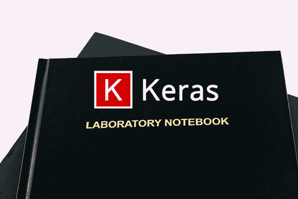
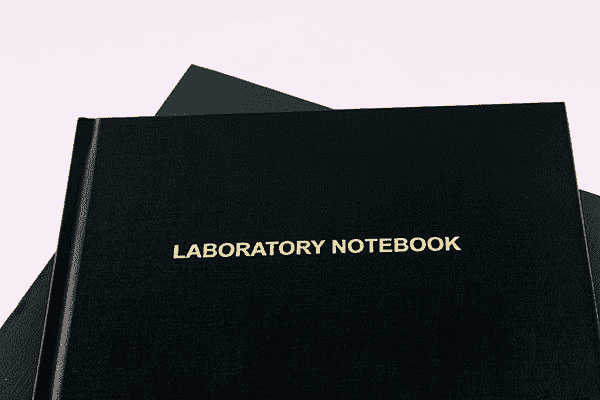
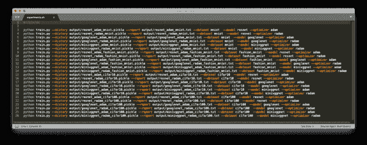
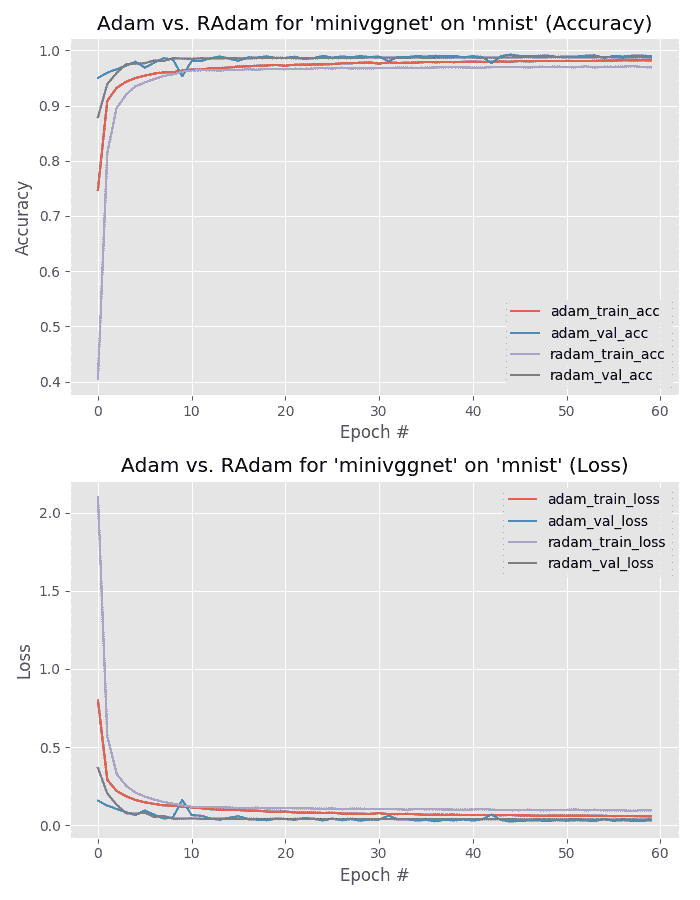
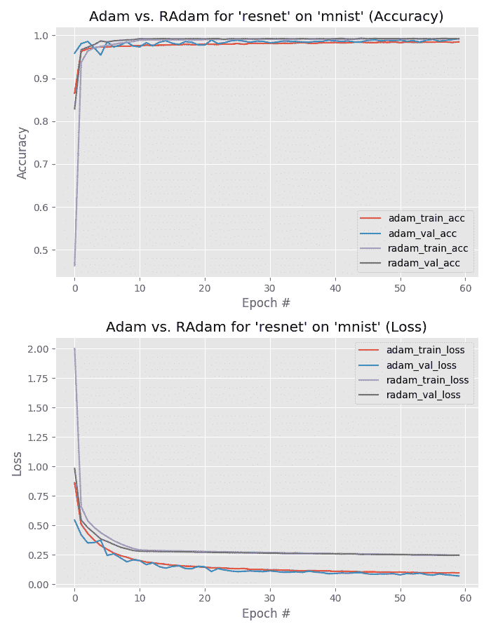
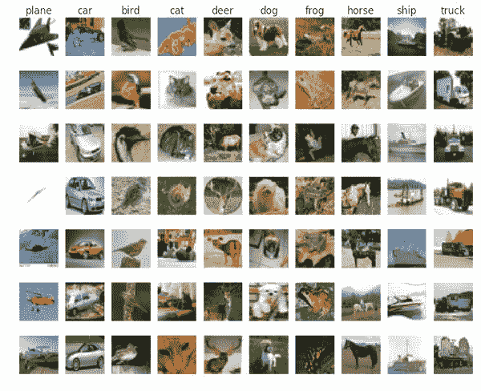
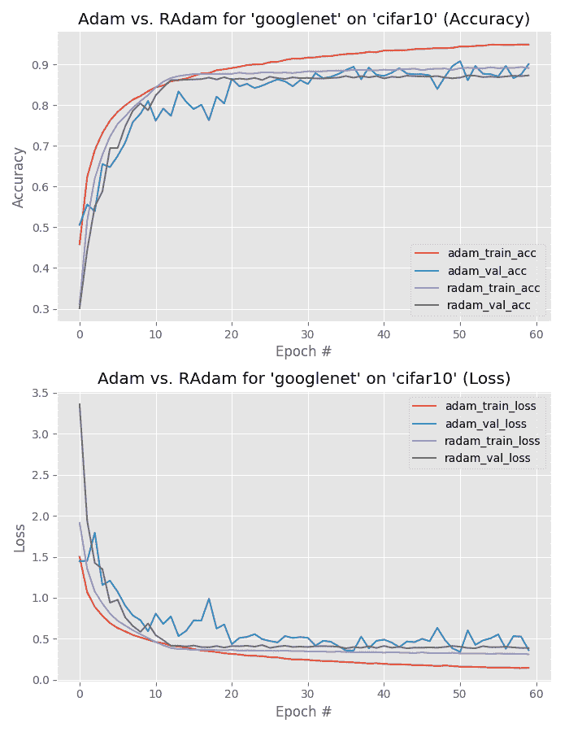
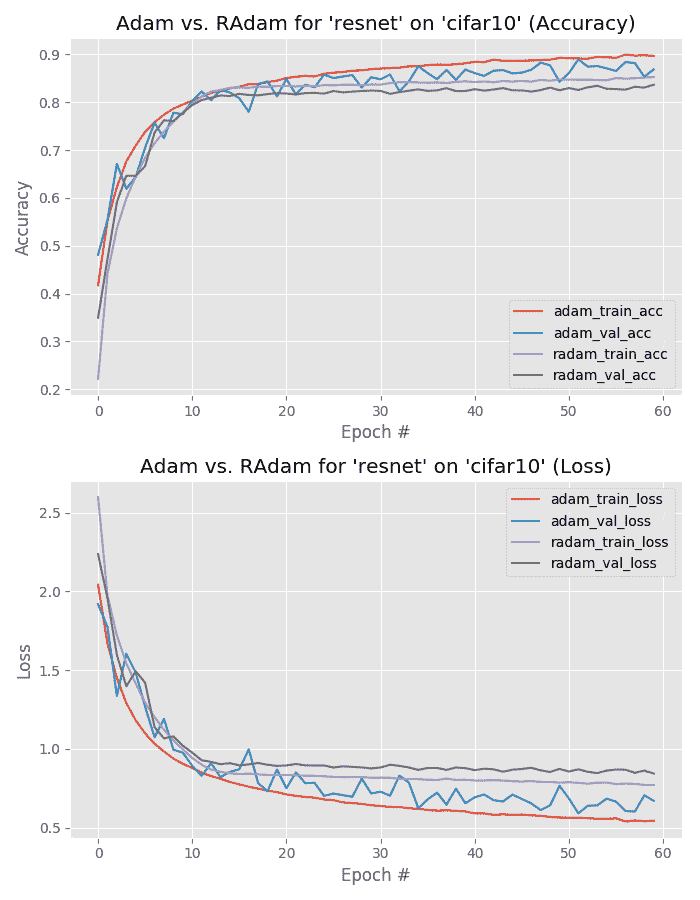
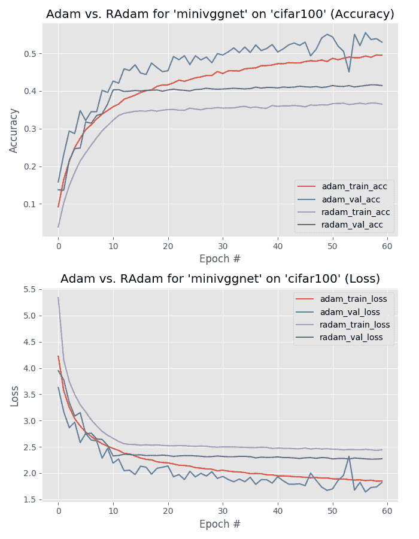
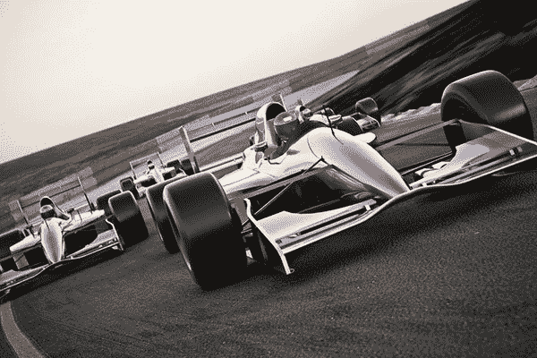

# 被修正的亚当真的比亚当更好吗？

> 原文：<https://pyimagesearch.com/2019/10/07/is-rectified-adam-actually-better-than-adam/>

[](https://pyimagesearch.com/wp-content/uploads/2019/10/rectified_adam_comparison_header.png)

修正的 Adam (RAdam)优化器真的比标准的 Adam 优化器更好吗？根据我的 24 次实验，答案是否定的，通常不会(但也有你*确实*想用它代替 Adam 的情况)。

在刘等人 2018 年的论文*关于自适应学习率的方差和超越*中，作者声称修正后的 Adam 可以得到:

*   **更高的准确性**(或至少与 Adam 相比具有相同的准确性)
*   并且在比标准 Adam 更少的时期内

作者在三个不同的数据集上测试了他们的假设，包括一个 NLP 数据集和两个计算机视觉数据集(ImageNet 和 CIFAR-10)。

在每个案例中，修正的 Adam 优于标准的 Adam… **，但是*未能优于标准的随机梯度下降(SGD)！***

修正的 Adam 优化器有一些强有力的理论依据——但作为深度学习实践者，你需要的不仅仅是理论——**你需要看到*经验结果*应用于*各种数据集*。**

也许更重要的是，**您还需要获得操作/驱动优化器(或一小部分优化器)的精通水平的经验。**

今天是我们关于修正 Adam 优化器的两部分系列的第二部分:

1.  [*用 Keras*](https://pyimagesearch.com/2019/09/30/rectified-adam-radam-optimizer-with-keras/) 修正了 Adam (RAdam)优化器(上周帖子)
2.  *被矫正的亚当真的比亚当*更好吗(今天的教程)

如果您还没有，请继续阅读第一部分，以确保您很好地理解了 Adam 优化器是如何工作的。

从那里，阅读今天的帖子，以帮助您了解如何设计、编码和运行用于比较深度学习优化器的实验。

**要学习如何比较修正亚当和标准亚当，*继续阅读！***

## 被修正的亚当真的比亚当更好吗？

在本教程的第一部分，我们将简要讨论修正的 Adam 优化器，包括它是如何工作的，以及为什么它对我们这些深度学习实践者来说是有趣的。

从那里，我将指导你设计和规划我们的一组实验，以比较校正的 Adam 和 Adam — **你也可以使用这一部分来学习如何设计自己的深度学习实验。**

然后我们将回顾这篇文章的项目结构，包括手工实现我们的培训和评估脚本。

最后，我们将运行我们的实验，收集结果，并最终决定**是否比亚当更好*？***

### 什么是修正的 Adam 优化器？

[](https://pyimagesearch.com/wp-content/uploads/2019/09/rectified_adam_keras_paper.png)

**Figure 1:** The Rectified Adam (RAdam) deep learning optimizer. Is it better than the standard Adam optimizer? (image source: Figure 6 from Liu et al.)

修正的 Adam 优化器是刘等人在他们 2019 年的论文 [*中提出的关于自适应学习率的方差和超越*](https://arxiv.org/pdf/1908.03265.pdf) 。在他们的论文中，他们讨论了他们对 Adam 优化器的更新，称为**整流 Adam** ，如何能够:

1.  获得一个**精度更高/更通用的**深度神经网络。
2.  在**个更少的时期**内完成训练。

他们的工作也有一些强有力的理论依据。他们发现自适应学习率优化器(如 Adam)既:

*   在最初的几批更新中努力归纳
*   有*非常*高的方差

刘等人对该问题进行了详细研究，发现该问题可以通过以下方法进行纠正(因此命名为“已纠正的 Adam ”):

1.  用**低初始收益率**进行热身。
2.  简单地**关闭前几组输入训练批次的动量项**。

作者评估了他们在一个 NLP 数据集和两个图像分类数据集上的实验，发现他们的**修正 Adam 实现*优于*标准 Adam(但是*和*优化器都没有优于标准 SGD)。**

今天我们将继续刘等人的实验，并在 24 个单独的实验中比较校正 Adam 和标准 Adam。

关于 Adam 优化器如何工作的更多细节，请务必查看我之前的博客文章。

### 计划我们的实验

[](https://pyimagesearch.com/wp-content/uploads/2019/10/rectified_adam_comparison_plan_experiments.jpg)

**Figure 2:** We will plan our set of experiments to evaluate the performance of the Rectified Adam (RAdam) optimizer using Keras.

为了比较 Adam 和整流 Adam，**我们将训练*三个*卷积神经网络(CNN)**，包括:

1.  ResNet
2.  谷歌网
3.  MiniVGGNet

这些 CNN 的实现直接来自我的书， [*用 Python 进行计算机视觉的深度学习*](https://pyimagesearch.com/deep-learning-computer-vision-python-book/) 。

这些网络**将在*四个*数据集上进行训练:**

1.  梦妮丝
2.  时尚 MNIST
3.  CIFAR-10
4.  西发尔-100

对于数据集和 CNN 架构的每个组合，**我们将应用*两个*优化器:**

1.  圣经》和《古兰经》传统中）亚当（人类第一人的名字
2.  整流器 adam

取所有可能的组合，我们最终得到*3×4×2 = 24*个单独的训练实验。

我们将分别运行这些实验，收集结果，然后解释它们，以确定哪个优化器确实更好。

每当你计划你自己的实验时，确保你花时间写出你打算应用它们的模型架构、优化器和数据集的列表。此外，您可能希望列出您认为重要且值得调整的超参数(例如，学习率、L2 重量衰减强度等)。).

考虑到我们计划进行的 24 个实验，自动化数据收集阶段是最有意义的。从那里，我们将能够在计算进行的同时处理其他任务(通常需要几天的计算时间)。在完成我们 24 个实验的数据收集后，我们将能够坐下来分析图和分类报告，以便在我们的 CNN、数据集和优化器上评估 RAdam。

### 如何设计自己的深度学习实验

[](https://pyimagesearch.com/wp-content/uploads/2019/10/rectified_adam_comparison_plan_lab_notebook.jpg)

**Figure 3:** Designing your own deep learning experiments, requires thought and planning. Consider your typical deep learning workflow and design your initial set of experiments such that a thorough preliminary investigation can be conducted using automation. Planning for automated evaluation now will save you time (and money) down the line.

通常，我的实验设计工作流程是这样的:

1.  **选择 2-3 个我认为适合特定数据集的模型架构**(即 ResNet、VGGNet 等)。).
2.  决定我是要**从零开始训练**还是执行 [**转移学习**](https://pyimagesearch.com/2019/05/20/transfer-learning-with-keras-and-deep-learning/) 。
3.  使用我的 [**学习率查找器**](https://pyimagesearch.com/2019/08/05/keras-learning-rate-finder/) 为 SGD 优化器找到一个可接受的初始学习率**。**
4.  使用 SGD 和**Keras 的标准衰变时间表 T5 在我的数据集**上训练模型。****
5.  查看我的训练结果，选择表现最好的架构，**开始调整我的超参数**，包括模型容量、正则化强度、重新访问初始学习率、应用[循环学习率](https://pyimagesearch.com/2019/07/29/cyclical-learning-rates-with-keras-and-deep-learning/)，并潜在地探索其他优化器。

你会注意到我在最初的实验中倾向于使用 SGD，而不是 Adam、RMSprop 等。

这是为什么呢？

要回答这个问题，你需要阅读下面的*“你需要获得操作这三个优化器的大师级经验”*部分。

***注:**关于我在设计和运行自己的实验时的更多建议、提示和最佳实践，请务必参考我的书，[用 Python 进行计算机视觉的深度学习](https://pyimagesearch.com/deep-learning-computer-vision-python-book/)。*

然而，在本教程的上下文中，我们试图将我们的结果与刘等人的工作进行比较。

因此，我们需要修正模型架构、从头开始的训练、学习率和优化器— **我们的实验设计现在变成:**

1.  分别在 MNIST、时尚 MNIST、CIFAR-10 和 CIFAR-100 上训练 ResNet、GoogLeNet 和 MiniVGGNet。
2.  从头开始训练所有网络。
3.  使用 Adam/修正 Adam (1e-3)的初始默认学习率。
4.  利用 Adam 和修正的 Adam 优化器进行培训。
5.  由于这些是一次性的实验，我们不会对调整超参数进行详尽的探讨(如果您想了解如何调整超参数的详细信息，可以参考 *[使用 Python 的计算机视觉深度学习](https://pyimagesearch.com/deep-learning-computer-vision-python-book/)* )。

在这一点上，我们已经激励并计划了我们的一组实验——现在让我们学习如何实现我们的培训和评估脚本。

### 项目结构

继续抓取 ***【下载】*** ，然后用`tree`命令检查项目目录:

```py
$ tree --dirsfirst --filelimit 10
.
├── output [48 entries]
├── plots [12 entries]
├── pyimagesearch
│   ├── __init__.py
│   ├── minigooglenet.py
│   ├── minivggnet.py
│   └── resnet.py
├── combinations.py
├── experiments.sh
├── plot.py
└── train.py

3 directories, 68 files

```

我们的项目包含两个输出目录:

*   `output/`:保存我们按实验组织的分类报告`.txt`文件。此外，每个实验都有一个`.pickle`文件，包含序列化的训练历史数据(用于绘图)。
*   `plots/`:对于每个 CNN/数据集组合，输出一个堆叠的精度/损失曲线图，以便我们可以方便地比较 Adam 和 RAdam 优化器。

`pyimagesearch`模块包含三个用 Keras 构建的卷积神经网络(CNN)架构。这些 CNN 实现直接来自于 [*用 Python 进行计算机视觉深度学习*](https://pyimagesearch.com/deep-learning-computer-vision-python-book/) 。

在今天的教程中，我们将回顾三个 Python 脚本:

*   `train.py`:我们的训练脚本通过命令行参数接受 CNN 架构、数据集和优化器，并开始相应地拟合模型。这个脚本将通过`experiments.sh` bash 脚本为我们的 24 个实验中的每个实验自动调用。我们的训练脚本生成两种类型的输出文件:
    *   `.txt`:sci kit-learn 标准格式的分类报告打印件。
    *   `.pickle`:序列化的训练历史，以便以后可以调用用于绘图目的。
*   这个脚本计算我们将训练模型和收集数据的所有实验组合。执行这个脚本的结果是一个名为`experiments.sh`的 bash/shell 脚本。
*   `plot.py`:直接从`output/*.pickle`文件使用 matplotlib 绘制 Adam/RAdam 的精度/损耗曲线。

### 实施培训脚本

我们的培训脚本将负责接受:

1.  给定的模型架构
2.  数据集
3.  优化器

然后，脚本将使用指定的优化器，在提供的数据集上处理指定模型的训练。

我们将使用这个脚本来运行 24 个实验中的每一个。

现在让我们继续执行`train.py`脚本:

```py
# import the necessary packages
from pyimagesearch.minigooglenet import MiniGoogLeNet
from pyimagesearch.minivggnet import MiniVGGNet
from pyimagesearch.resnet import ResNet
from sklearn.preprocessing import LabelBinarizer
from sklearn.metrics import classification_report
from keras.preprocessing.image import ImageDataGenerator
from keras.optimizers import Adam
from keras_radam import RAdam
from keras.datasets import fashion_mnist
from keras.datasets import cifar100
from keras.datasets import cifar10
from keras.datasets import mnist
import numpy as np
import argparse
import pickle
import cv2

```

导入包括我们的三个 CNN 架构、四个数据集和两个优化器(`Adam`和`RAdam`)。

让我们[解析命令行参数](https://pyimagesearch.com/2018/03/12/python-argparse-command-line-arguments/):

```py
# construct the argument parser and parse the arguments
ap = argparse.ArgumentParser()
ap.add_argument("-i", "--history", required=True,
	help="path to output training history file")
ap.add_argument("-r", "--report", required=True,
	help="path to output classification report file")
ap.add_argument("-d", "--dataset", type=str, default="mnist",
	choices=["mnist", "fashion_mnist", "cifar10", "cifar100"],
	help="dataset name")
ap.add_argument("-m", "--model", type=str, default="resnet",
	choices=["resnet", "googlenet", "minivggnet"],
	help="type of model architecture")
ap.add_argument("-o", "--optimizer", type=str, default="adam",
	choices=["adam", "radam"],
	help="type of optmizer")
args = vars(ap.parse_args())

```

我们的命令行参数包括:

*   `--history`:输出训练历史`.pickle`文件的路径。
*   `--report`:输出分类报告`.txt`文件的路径。
*   `--dataset`:训练我们模型的数据集可以是**第 26 行**中列出的任何一个`choices`。
*   `--model`:深度学习模型架构必须是**29 线**上的`choices`之一。
*   `--optimizer`:我们的`adam`或`radam`深度学习优化方法。

通过终端提供命令行参数后，我们的训练脚本会动态设置并启动实验。输出文件根据实验的参数命名。

在这里，我们将设置两个常数，并初始化数据集的默认通道数:

```py
# initialize the batch size and number of epochs to train
BATCH_SIZE = 128
NUM_EPOCHS = 60

# initialize the number of channels in the dataset
numChans = 1

```

如果我们的`--dataset`是 MNIST 或时尚 MNIST，我们将以下列方式加载数据集:

```py
# check if we are using either the MNIST or Fashion MNIST dataset
if args["dataset"] in ("mnist", "fashion_mnist"):
	# check if we are using MNIST
	if args["dataset"] == "mnist":
		# initialize the label names for the MNIST dataset
		labelNames = [str(i) for i in range(0, 10)]

		# load the MNIST dataset
		print("[INFO] loading MNIST dataset...")
		((trainX, trainY), (testX, testY)) = mnist.load_data()

	# otherwise, are are using Fashion MNIST
	else:
		# initialize the label names for the Fashion MNIST dataset
		labelNames = ["top", "trouser", "pullover", "dress", "coat",
			"sandal", "shirt", "sneaker", "bag", "ankle boot"]

		# load the Fashion MNIST dataset
		print("[INFO] loading Fashion MNIST dataset...")
		((trainX, trainY), (testX, testY)) = fashion_mnist.load_data()

	# MNIST dataset images are 28x28 but the networks we will be
	# training expect 32x32 images
	trainX = np.array([cv2.resize(x, (32, 32)) for x in trainX])
	testX = np.array([cv2.resize(x, (32, 32)) for x in testX])

	# reshape the data matrices to include a channel dimension which
	# is required for training)
	trainX = trainX.reshape((trainX.shape[0], 32, 32, 1))
	testX = testX.reshape((testX.shape[0], 32, 32, 1))

```

请记住，MNIST 图像是 *28×28* ，但我们的架构需要 *32×32* 图像。因此，**行 66 和**行 67 是数据集中的所有图像。**第 71 行和第 72 行**然后添加批次维度。

否则，我们需要加载一个 CIFAR 变量`--dataset`:

```py
# otherwise, we must be using a variant of CIFAR
else:
	# update the number of channels in the images
	numChans = 3

	# check if we are using CIFAR-10
	if args["dataset"] == "cifar10":
		# initialize the label names for the CIFAR-10 dataset
		labelNames = ["airplane", "automobile", "bird", "cat",
			"deer", "dog", "frog", "horse", "ship", "truck"]

		# load the CIFAR-10 dataset
		print("[INFO] loading CIFAR-10 dataset...")
		((trainX, trainY), (testX, testY)) = cifar10.load_data()

	# otherwise, we are using CIFAR-100
	else:
		# initialize the label names for the CIFAR-100 dataset
		labelNames = ["apple", "aquarium_fish", "baby", "bear",
			"beaver", "bed", "bee", "beetle",  "bicycle", "bottle",
			"bowl", "boy", "bridge", "bus", "butterfly", "camel",
			"can", "castle", "caterpillar", "cattle", "chair",
			"chimpanzee", "clock",  "cloud", "cockroach", "couch",
			"crab", "crocodile", "cup", "dinosaur",  "dolphin",
			"elephant", "flatfish", "forest", "fox", "girl",
			"hamster",  "house", "kangaroo", "keyboard", "lamp",
			"lawn_mower", "leopard", "lion", "lizard", "lobster",
			"man", "maple_tree", "motorcycle", "mountain", "mouse",
			"mushroom", "oak_tree", "orange", "orchid", "otter",
			"palm_tree", "pear", "pickup_truck", "pine_tree", "plain",
			"plate", "poppy", "porcupine", "possum", "rabbit",
			"raccoon", "ray", "road", "rocket", "rose", "sea", "seal",
			"shark", "shrew", "skunk", "skyscraper", "snail", "snake",
			"spider", "squirrel", "streetcar", "sunflower",
			"sweet_pepper", "table", "tank", "telephone", "television",
			"tiger", "tractor", "train", "trout", "tulip", "turtle",
			"wardrobe", "whale", "willow_tree", "wolf", "woman", "worm"]

		# load the CIFAR-100 dataset
		print("[INFO] loading CIFAR-100 dataset...")
		((trainX, trainY), (testX, testY)) = cifar100.load_data()

```

CIFAR 数据集包含 3 通道彩色图像(**第 77 行**)。这些数据集已经由 *32×32* 的图像组成(不需要调整大小)。

从这里开始，我们将扩展我们的数据并确定类的总数:

```py
# scale the data to the range [0, 1]
trainX = trainX.astype("float32") / 255.0
testX = testX.astype("float32") / 255.0

# determine the total number of unique classes in the dataset
numClasses = len(np.unique(trainY))
print("[INFO] {} classes in dataset".format(numClasses))

```

随后初始化本实验的**深度学习优化器:**

```py
# check if we are using Adam
if args["optimizer"] == "adam":
	# initialize the Adam optimizer
	print("[INFO] using Adam optimizer")
	opt = Adam(lr=1e-3)

# otherwise, we are using Rectified Adam
else:
	# initialize the Rectified Adam optimizer
	print("[INFO] using Rectified Adam optimizer")
	opt = RAdam(total_steps=5000, warmup_proportion=0.1, min_lr=1e-5)

```

根据`--optimizer`命令行参数开关初始化`Adam`或`RAdam`。

然后，根据`--model`命令行参数构建我们的`model`:

```py
# check if we are using the ResNet architecture
if args["model"] == "resnet":
	# utilize the ResNet architecture
	print("[INFO] initializing ResNet...")
	model = ResNet.build(32, 32, numChans, numClasses, (9, 9, 9),
		(64, 64, 128, 256), reg=0.0005)

# check if we are using Tiny GoogLeNet
elif args["model"] == "googlenet":
	# utilize the MiniGoogLeNet architecture
	print("[INFO] initializing MiniGoogLeNet...")
	model = MiniGoogLeNet.build(width=32, height=32, depth=numChans,
		classes=numClasses)

# otherwise, we must be using MiniVGGNet
else:
	# utilize the MiniVGGNet architecture
	print("[INFO] initializing MiniVGGNet...")
	model = MiniVGGNet.build(width=32, height=32, depth=numChans,
		classes=numClasses)

```

一旦构建了 ResNet、GoogLeNet 或 MiniVGGNet，我们将二进制化我们的标签并构建我们的[数据扩充](https://pyimagesearch.com/2019/07/08/keras-imagedatagenerator-and-data-augmentation/)对象:

```py
# convert the labels from integers to vectors
lb = LabelBinarizer()
trainY = lb.fit_transform(trainY)
testY = lb.transform(testY)

# construct the image generator for data augmentation
aug = ImageDataGenerator(rotation_range=18, zoom_range=0.15,
	width_shift_range=0.2, height_shift_range=0.2, shear_range=0.15,
	horizontal_flip=True, fill_mode="nearest")

```

然后编译我们的模型并训练网络:

```py
# compile the model and train the network
print("[INFO] training network...")
model.compile(loss="categorical_crossentropy", optimizer=opt,
	metrics=["accuracy"])
H = model.fit_generator(
	aug.flow(trainX, trainY, batch_size=BATCH_SIZE),
	validation_data=(testX, testY),
	steps_per_epoch=trainX.shape[0] // BATCH_SIZE,
	epochs=NUM_EPOCHS,
	verbose=1)

```

然后，我们评估经过训练的模型，并将训练历史转储到磁盘:

```py
# evaluate the network
print("[INFO] evaluating network...")
predictions = model.predict(testX, batch_size=BATCH_SIZE)
report = classification_report(testY.argmax(axis=1),
	predictions.argmax(axis=1), target_names=labelNames)

# serialize the training history to disk
print("[INFO] serializing training history...")
f = open(args["history"], "wb")
f.write(pickle.dumps(H.history))
f.close()

# save the classification report to disk
print("[INFO] saving classification report...")
f = open(args["report"], "w")
f.write(report)
f.close()

```

每个实验将包含一个分类报告`.txt`文件以及一个序列化的训练历史`.pickle`文件。

分类报告将被手动检查，而训练历史文件稍后将通过`plot.py`内的操作打开，训练历史将被解析并最终绘制。

正如您所了解的，创建一个动态设置实验的训练脚本非常简单。

### 创建我们的实验组合

在这一点上，我们有我们的训练脚本，它可以接受(1)模型架构，(2)数据集，和(3)优化器，然后使用各自的组合来拟合模型。

也就是说，我们要手动*运行每个单独的命令吗？*

不，这不仅是一项乏味的任务，*还容易出现人为错误*。

相反，让我们创建一个 Python 脚本来为我们想要运行的每个实验生成一个包含命令的 shell 脚本。

打开`combinations.py`文件并插入以下代码:

```py
# import the necessary packages
import argparse
import os

# construct the argument parser and parse the arguments
ap = argparse.ArgumentParser()
ap.add_argument("-o", "--output", required=True,
	help="path to output output directory")
ap.add_argument("-s", "--script", required=True,
	help="path to output shell script")
args = vars(ap.parse_args())

```

我们的脚本需要两个命令行参数:

*   `--output`:存储训练文件的输出目录的路径。
*   `--script`:输出 shell 脚本的路径，它将包含我们所有的训练脚本命令和命令行参数组合。

让我们打开一个新文件进行写入:

```py
# open the output shell script for writing, then write the header
f = open(args["script"], "w")
f.write("#!/bin/sh\n\n")

# initialize the list of datasets, models, and optimizers
datasets = ["mnist", "fashion_mnist", "cifar10", "cifar100"]
models = ["resnet", "googlenet", "minivggnet"]
optimizers = ["adam", "radam"]

```

**第 14 行**打开一个 shell 脚本文件写。随后，**第 15 行**写[“shebang”](https://en.wikipedia.org/wiki/Shebang_(Unix))表示这个 shell 脚本是可执行的。

**第 18-20 行**然后列出我们的`datasets`、`models`、`optimizers`。

我们将在嵌套循环中从这些列表中形成所有可能的实验组合:

```py
# loop over all combinations of datasets, models, and optimizers
for dataset in datasets:
	for model in models:
		for opt in optimizers:
			# build the path to the output training log file
			histFilename = "{}_{}_{}.pickle".format(model, opt, dataset)
			historyPath = os.path.sep.join([args["output"],
				histFilename])

			# build the path to the output report log file
			reportFilename = "{}_{}_{}.txt".format(model, opt, dataset)
			reportPath = os.path.sep.join([args["output"],
				reportFilename])

			# construct the command that will be executed to launch
			# the experiment
			cmd = ("python train.py --history {} --report {} "
				   "--dataset {}  --model {} --optimizer {}").format(
						historyPath, reportPath, dataset, model, opt)

			# write the command to disk
			f.write("{}\n".format(cmd))

# close the shell script file
f.close()

```

在循环内部，我们:

*   构建我们的历史文件路径(**第 27-29 行**)。
*   组装我们的报告文件路径(**第 32-34 行**)。
*   按照当前循环迭代的组合连接每个命令，并将其写入 shell 文件(**第 38-43 行**)。

最后，我们关闭 shell 脚本文件。

***注意:**我假设您正在使用一台 Unix 机器来运行这些实验。如果您使用的是 Windows，您应该(1)更新这个脚本来生成一个批处理文件，或者(2)为每个实验手动执行`train.py`命令。请注意，[我不支持 PyImageSearch 博客上的 Windows](https://pyimagesearch.com/faqs/single-faq/can-you-help-me-do-___-on-windows) ,所以你需要自己基于这个脚本来实现它。*

### 生成实验外壳脚本

继续使用本教程的 ***【下载】*** 部分将源代码下载到指南中。

从那里，打开一个终端并执行`combinations.py`脚本:

```py
$ python combinations.py --output output --script experiments.sh

```

脚本执行后，您的工作目录中应该有一个名为`experiments.sh`的文件——该文件包含我们将运行的 24 个单独的实验，以比较 Adam 和修正的 Adam。

现在就开始调查`experiments.sh`:

```py
#!/bin/sh

python train.py --history output/resnet_adam_mnist.pickle --report output/resnet_adam_mnist.txt --dataset mnist  --model resnet --optimizer adam
python train.py --history output/resnet_radam_mnist.pickle --report output/resnet_radam_mnist.txt --dataset mnist  --model resnet --optimizer radam
python train.py --history output/googlenet_adam_mnist.pickle --report output/googlenet_adam_mnist.txt --dataset mnist  --model googlenet --optimizer adam
python train.py --history output/googlenet_radam_mnist.pickle --report output/googlenet_radam_mnist.txt --dataset mnist  --model googlenet --optimizer radam
python train.py --history output/minivggnet_adam_mnist.pickle --report output/minivggnet_adam_mnist.txt --dataset mnist  --model minivggnet --optimizer adam
python train.py --history output/minivggnet_radam_mnist.pickle --report output/minivggnet_radam_mnist.txt --dataset mnist  --model minivggnet --optimizer radam
python train.py --history output/resnet_adam_fashion_mnist.pickle --report output/resnet_adam_fashion_mnist.txt --dataset fashion_mnist  --model resnet --optimizer adam
python train.py --history output/resnet_radam_fashion_mnist.pickle --report output/resnet_radam_fashion_mnist.txt --dataset fashion_mnist  --model resnet --optimizer radam
python train.py --history output/googlenet_adam_fashion_mnist.pickle --report output/googlenet_adam_fashion_mnist.txt --dataset fashion_mnist  --model googlenet --optimizer adam
python train.py --history output/googlenet_radam_fashion_mnist.pickle --report output/googlenet_radam_fashion_mnist.txt --dataset fashion_mnist  --model googlenet --optimizer radam
python train.py --history output/minivggnet_adam_fashion_mnist.pickle --report output/minivggnet_adam_fashion_mnist.txt --dataset fashion_mnist  --model minivggnet --optimizer adam
python train.py --history output/minivggnet_radam_fashion_mnist.pickle --report output/minivggnet_radam_fashion_mnist.txt --dataset fashion_mnist  --model minivggnet --optimizer radam
python train.py --history output/resnet_adam_cifar10.pickle --report output/resnet_adam_cifar10.txt --dataset cifar10  --model resnet --optimizer adam
python train.py --history output/resnet_radam_cifar10.pickle --report output/resnet_radam_cifar10.txt --dataset cifar10  --model resnet --optimizer radam
python train.py --history output/googlenet_adam_cifar10.pickle --report output/googlenet_adam_cifar10.txt --dataset cifar10  --model googlenet --optimizer adam
python train.py --history output/googlenet_radam_cifar10.pickle --report output/googlenet_radam_cifar10.txt --dataset cifar10  --model googlenet --optimizer radam
python train.py --history output/minivggnet_adam_cifar10.pickle --report output/minivggnet_adam_cifar10.txt --dataset cifar10  --model minivggnet --optimizer adam
python train.py --history output/minivggnet_radam_cifar10.pickle --report output/minivggnet_radam_cifar10.txt --dataset cifar10  --model minivggnet --optimizer radam
python train.py --history output/resnet_adam_cifar100.pickle --report output/resnet_adam_cifar100.txt --dataset cifar100  --model resnet --optimizer adam
python train.py --history output/resnet_radam_cifar100.pickle --report output/resnet_radam_cifar100.txt --dataset cifar100  --model resnet --optimizer radam
python train.py --history output/googlenet_adam_cifar100.pickle --report output/googlenet_adam_cifar100.txt --dataset cifar100  --model googlenet --optimizer adam
python train.py --history output/googlenet_radam_cifar100.pickle --report output/googlenet_radam_cifar100.txt --dataset cifar100  --model googlenet --optimizer radam
python train.py --history output/minivggnet_adam_cifar100.pickle --report output/minivggnet_adam_cifar100.txt --dataset cifar100  --model minivggnet --optimizer adam
python train.py --history output/minivggnet_radam_cifar100.pickle --report output/minivggnet_radam_cifar100.txt --dataset cifar100  --model minivggnet --optimizer radam

```

***注意:**务必使用水平滚动条查看`experiments.sh`脚本的全部内容。为了更好地显示，我故意不换行。你也可以参考下面的**图 4**—我建议**点击图像放大+检查**它。*

[](https://pyimagesearch.com/wp-content/uploads/2019/10/rectified_adam_comparison_experiments.png)

**Figure 4:** The output of our `combinations.py` file is a shell script listing the training script commands to run in succession. Click image to enlarge.

注意模型架构、数据集和优化器的 24 种可能组合中的每一种都有一个`train.py`调用。此外，**行 1** 上的“shebang”表示这个 shell 脚本是可执行的。

### 运行我们的实验

下一步是实际执行这些实验。

我用 NVIDIA K80 GPU 在一个亚马逊 EC2 实例上执行了 shell 脚本。运行所有实验大约需要 48 小时。

要自己启动实验，只需运行以下命令:

```py
$ ./experiments.sh

```

脚本运行完成后，您的`output/`目录中应该会充满`.pickle`和`.txt`文件:

```py
$ ls -l output/
googlenet_adam_cifar10.pickle
googlenet_adam_cifar10.txt
googlenet_adam_cifar100.pickle
googlenet_adam_cifar100.txt
...
resnet_radam_fashion_mnist.pickle
resnet_radam_fashion_mnist.txt
resnet_radam_mnist.pickle
resnet_radam_mnist.txt

```

`.txt`文件包含 scikit-learn 的`classification_report`输出，这是一个人类可读的输出，告诉我们我们的模型执行得有多好。

`.pickle`文件包含模型的训练历史。在下一节中，我们将使用这个`.pickle`文件来绘制 Adam 和修正 Adam 的性能。

### 实施我们的 Adam 与修正的 Adam 绘图脚本

我们最终的 Python 脚本`plot.py`将用于绘制 Adam 与修正 Adam 的性能对比图，为我们提供在特定数据集上训练的给定模型架构的清晰可视化效果。

绘图文件打开每个 Adam/RAdam `.pickle`文件对，并生成相应的绘图。

打开`plot.py`并插入以下代码:

```py
# import the necessary packages
import matplotlib.pyplot as plt
import numpy as np
import argparse
import pickle
import os

def plot_history(adamHist, rAdamHist, accTitle, lossTitle):
	# determine the total number of epochs used for training, then
	# initialize the figure
	N = np.arange(0, len(adamHist["loss"]))
	plt.style.use("ggplot")
	(fig, axs) = plt.subplots(2, 1, figsize=(7, 9))

	# plot the accuracy for Adam vs. Rectified Adam
	axs[0].plot(N, adamHist["acc"], label="adam_train_acc")
	axs[0].plot(N, adamHist["val_acc"], label="adam_val_acc")
	axs[0].plot(N, rAdamHist["acc"], label="radam_train_acc")
	axs[0].plot(N, rAdamHist["val_acc"], label="radam_val_acc")
	axs[0].set_title(accTitle)
	axs[0].set_xlabel("Epoch #")
	axs[0].set_ylabel("Accuracy")
	axs[0].legend(loc="lower right")

	# plot the loss for Adam vs. Rectified Adam
	axs[1].plot(N, adamHist["loss"], label="adam_train_loss")
	axs[1].plot(N, adamHist["val_loss"], label="adam_val_loss")
	axs[1].plot(N, rAdamHist["loss"], label="radam_train_loss")
	axs[1].plot(N, rAdamHist["val_loss"], label="radam_val_loss")
	axs[1].set_title(lossTitle)
	axs[1].set_xlabel("Epoch #")
	axs[1].set_ylabel("Loss")
	axs[1].legend(loc="upper right")

	# update the layout of the plot
	plt.tight_layout()

```

**第 2-6 行**处理进口，即`matplotlib.pyplot`模块。

`plot_history`函数负责通过子图功能生成两个堆叠图:

*   训练/验证 ***准确度*** 曲线(**第 16-23 行**)。
*   训练/验证 ***损失*** 曲线(**第 26-33 行**)。

Adam 和修正的 Adam 训练历史曲线均由作为参数传递给函数的`adamHist`和`rAdamHist`数据生成。

***注意:**如果您使用 TensorFlow 2.0(即`tf.keras`)来运行此代码，您需要将所有出现的`acc`和`val_acc`分别更改为`accuracy`和`val_accuracy`，因为 TensorFlow 2.0 对精确度名称进行了重大更改。*

让我们来处理解析命令行参数:

```py
# construct the argument parser and parse the arguments
ap = argparse.ArgumentParser()
ap.add_argument("-i", "--input", required=True,
	help="path to input directory of Keras training history files")
ap.add_argument("-p", "--plots", required=True,
	help="path to output directory of training plots")
args = vars(ap.parse_args())

# initialize the list of datasets and models
datasets = ["mnist", "fashion_mnist", "cifar10", "cifar100"]
models = ["resnet", "googlenet", "minivggnet"]

```

我们的命令行参数包括:

*   `--input`:要解析生成图的训练历史文件的输入目录路径。
*   `--plots`:我们将储存图形的输出路径。

**第 47 和 48 行**列出了我们的`datasets`和`models`。我们将遍历数据集和模型的组合来生成我们的图:

```py
# loop over all combinations of datasets and models
for dataset in datasets:
	for model in models:
		# construct the path to the Adam output training history files
		adamFilename = "{}_{}_{}.pickle".format(model, "adam",
			dataset)
		adamPath = os.path.sep.join([args["input"], adamFilename])

		# construct the path to the Rectified Adam output training
		# history files
		rAdamFilename = "{}_{}_{}.pickle".format(model, "radam",
			dataset)
		rAdamPath = os.path.sep.join([args["input"], rAdamFilename])

		# load the training history files for Adam and Rectified Adam,
		# respectively
		adamHist = pickle.loads(open(adamPath, "rb").read())
		rAdamHist = pickle.loads(open(rAdamPath, "rb").read())

		# plot the accuracy/loss for the current dataset, comparing
		# Adam vs. Rectified Adam
		accTitle = "Adam vs. RAdam for '{}' on '{}' (Accuracy)".format(
			model, dataset)
		lossTitle = "Adam vs. RAdam for '{}' on '{}' (Loss)".format(
			model, dataset)
		plot_history(adamHist, rAdamHist, accTitle, lossTitle)

		# construct the path to the output plot
		plotFilename = "{}_{}.png".format(model, dataset)
		plotPath = os.path.sep.join([args["plots"], plotFilename])

		# save the plot and clear it
		plt.savefig(plotPath)
		plt.clf()

```

在嵌套的`datasets` / `models`循环中，我们:

*   构造 Adam 并修正 Adam 的文件路径(**第 54-62 行**)。
*   加载序列化的培训历史(**行 66 和 67** )。
*   使用我们的`plot_history`函数生成图表(**第 71-75 行**)。
*   将数字导出到磁盘(**第 78-83 行**)。

### 绘制 Adam vs .修正 Adam

我们现在准备运行`plot.py`脚本。

同样，确保你已经使用了本教程的 ***【下载】*** 部分来下载源代码。

从那里，执行以下命令:

```py
$ python plot.py --input output --plots plots

```

然后，您可以检查`plots/`目录，并确保它已经填充了培训历史数据:

```py
$ ls -l plots/
googlenet_cifar10.png
googlenet_cifar100.png
googlenet_fashion_mnist.png
googlenet_mnist.png
minivggnet_cifar10.png
minivggnet_cifar100.png
minivggnet_fashion_mnist.png
minivggnet_mnist.png
resnet_cifar10.png
resnet_cifar100.png
resnet_fashion_mnist.png
resnet_mnist.png

```

在下一部分，我们将回顾我们的实验结果。

### 亚当 vs .修正亚当与 MNIST 的实验

[](https://pyimagesearch.com/wp-content/uploads/2014/06/mnist_sample.jpg)

**Figure 5:** Montage of samples from the MNIST digit dataset.

我们的第一组实验将在 [MNIST 数据集](http://yann.lecun.com/exdb/mnist/)上比较 Adam 与修正的 Adam，这是一个用于手写数字识别的标准基准图像分类数据集。

#### mnst–minivvnet

[](https://pyimagesearch.com/wp-content/uploads/2019/10/minivggnet_mnist.png)

**Figure 6:** Which is better — Adam or RAdam optimizer using MiniVGGNet on the MNIST dataset?

当在 MNIST 数据集上训练 MiniVGGNet 时，我们的第一个实验比较了 Adam 和修正的 Adam。

下面是 **Adam 优化器的输出分类报告:**

```py
              precision    recall  f1-score   support

           0       0.99      1.00      1.00       980
           1       0.99      1.00      0.99      1135
           2       0.98      0.96      0.97      1032
           3       1.00      1.00      1.00      1010
           4       0.99      1.00      0.99       982
           5       0.97      0.98      0.98       892
           6       0.98      0.98      0.98       958
           7       0.99      0.99      0.99      1028
           8       0.99      0.99      0.99       974
           9       1.00      0.99      0.99      1009

   micro avg       0.99      0.99      0.99     10000
   macro avg       0.99      0.99      0.99     10000
weighted avg       0.99      0.99      0.99     10000

```

以及**修正的 Adam 优化器的分类报告:**

```py
              precision    recall  f1-score   support

           0       0.99      1.00      0.99       980
           1       1.00      0.99      1.00      1135
           2       0.97      0.97      0.97      1032
           3       0.99      0.99      0.99      1010
           4       0.99      0.99      0.99       982
           5       0.98      0.97      0.97       892
           6       0.98      0.98      0.98       958
           7       0.99      0.99      0.99      1028
           8       0.99      0.99      0.99       974
           9       0.99      0.99      0.99      1009

   micro avg       0.99      0.99      0.99     10000
   macro avg       0.99      0.99      0.99     10000
weighted avg       0.99      0.99      0.99     10000

```

如你所见，我们在两个 T2 实验中都获得了 99%的准确率。

查看**图 6** ，您可以观察到与整流 Adam 相关的预热时间:

损耗开始时非常高，精度非常低

预热完成后，经过修正的 Adam 优化器会赶上 Adam

有趣的是，与经过整流的 Adam 相比， **Adam 获得了更低的损耗**——我们实际上会看到这一趋势在我们运行的其余实验中继续(我将解释*为什么*也会发生这种情况)。

#### mnst–Google net

[](https://pyimagesearch.com/wp-content/uploads/2019/10/googlenet_mnist.png)

**Figure 7:** Which deep learning optimizer is actually better — Rectified Adam or Adam? This plot is from my experiment notebook while testing RAdam and Adam using GoogLeNet on the MNIST dataset.

下一个实验将 Adam 与在 MNIST 数据集上训练的 GoogLeNet 的修正 Adam 进行比较。

下面是 **Adam 优化器的输出:**

```py
              precision    recall  f1-score   support

           0       1.00      1.00      1.00       980
           1       1.00      0.99      1.00      1135
           2       0.96      0.99      0.97      1032
           3       0.99      1.00      0.99      1010
           4       0.99      0.99      0.99       982
           5       0.99      0.96      0.98       892
           6       0.98      0.99      0.98       958
           7       0.99      0.99      0.99      1028
           8       1.00      1.00      1.00       974
           9       1.00      0.98      0.99      1009

   micro avg       0.99      0.99      0.99     10000
   macro avg       0.99      0.99      0.99     10000
weighted avg       0.99      0.99      0.99     10000

```

以及经过**修正的 Adam 优化器的输出:**

```py
              precision    recall  f1-score   support

           0       1.00      1.00      1.00       980
           1       1.00      0.99      1.00      1135
           2       0.98      0.98      0.98      1032
           3       1.00      0.99      1.00      1010
           4       1.00      0.99      1.00       982
           5       0.97      0.99      0.98       892
           6       0.99      0.98      0.99       958
           7       0.99      1.00      0.99      1028
           8       0.99      1.00      1.00       974
           9       1.00      0.99      1.00      1009

   micro avg       0.99      0.99      0.99     10000
   macro avg       0.99      0.99      0.99     10000
weighted avg       0.99      0.99      0.99     10000

```

同样，两个优化器都获得了 99%的准确度。

这一次，两个训练/验证图在准确性和损失方面几乎相同。

#### MNIST-雷斯内特

[](https://pyimagesearch.com/wp-content/uploads/2019/10/resnet_mnist.png)

**Figure 8:** Training accuracy/loss plot for ResNet on the MNIST dataset using both the RAdam (Rectified Adam) and Adam deep learning optimizers with Keras.

我们最后的 MNIST 实验比较了使用 Adam 和修正 Adam 的训练 ResNet。

鉴于 MNIST 不是一个非常具有挑战性的数据集，我们为 **Adam 优化器**获得了 **99%的准确率**

```py
              precision    recall  f1-score   support

           0       1.00      1.00      1.00       980
           1       1.00      0.99      1.00      1135
           2       0.98      0.98      0.98      1032
           3       0.99      1.00      1.00      1010
           4       0.99      1.00      0.99       982
           5       0.99      0.98      0.98       892
           6       0.98      0.99      0.99       958
           7       0.99      1.00      0.99      1028
           8       0.99      1.00      1.00       974
           9       1.00      0.98      0.99      1009

   micro avg       0.99      0.99      0.99     10000
   macro avg       0.99      0.99      0.99     10000
weighted avg       0.99      0.99      0.99     10000

```

以及**整改后的 Adam 优化器:**

```py
              precision    recall  f1-score   support

           0       1.00      1.00      1.00       980
           1       1.00      1.00      1.00      1135
           2       0.97      0.98      0.98      1032
           3       1.00      1.00      1.00      1010
           4       0.99      1.00      1.00       982
           5       0.99      0.97      0.98       892
           6       0.99      0.98      0.99       958
           7       0.99      1.00      0.99      1028
           8       1.00      1.00      1.00       974
           9       1.00      0.99      1.00      1009

   micro avg       0.99      0.99      0.99     10000
   macro avg       0.99      0.99      0.99     10000
weighted avg       0.99      0.99      0.99     10000

```

但是看看图 8——注意 Adam 如何获得比整流 Adam 低得多的损耗。

这不一定是一件坏事，因为它可能意味着修正的亚当正在获得一个更通用的模型；然而，测试集上的性能是相同的，所以我们需要在 MNIST 之外的*上测试图像(这超出了本文的范围)。*

### 亚当 vs .纠正亚当实验与时尚 MNIST

[](https://pyimagesearch.com/wp-content/uploads/2019/02/fashion_mnist_dataset_sample.png)

**Figure 9:** The Fashion MNIST dataset was created by e-commerce company, [Zalando](https://github.com/zalandoresearch/fashion-mnist), as a drop-in replacement for MNIST Digits. It is a great dataset to practice/experiment with when using Keras for deep learning. ([image source](https://medium.com/deep-learning-turkey/deep-learning-lab-episode-1-fashion-mnist-c7af60029836))

我们的下一组实验在时尚 MNIST 数据集上评估了 Adam 与修正的 Adam，这是标准 MNIST 数据集的替代物。

你可以在这里阅读更多关于[时尚 MNIST 的信息。](https://pyimagesearch.com/2019/02/11/fashion-mnist-with-keras-and-deep-learning/)

#### 时尚梦游者 minivggnet

[](https://pyimagesearch.com/wp-content/uploads/2019/10/minivggnet_fashion_mnist.png)

**Figure 10:** Testing optimizers with deep learning, including new ones such as RAdam, requires multiple experiments. Shown in this figure is the MiniVGGNet CNN trained on the Fashion MNIST dataset with both Adam and RAdam optimizers.

我们的第一个实验评估了在时尚 MNIST 数据集上训练的 MiniVGGNet 架构。

下面你可以找到使用 **Adam 优化器的训练输出:**

```py
              precision    recall  f1-score   support

         top       0.95      0.71      0.81      1000
     trouser       0.99      0.99      0.99      1000
    pullover       0.94      0.76      0.84      1000
       dress       0.96      0.80      0.87      1000
        coat       0.84      0.90      0.87      1000
      sandal       0.98      0.98      0.98      1000
       shirt       0.59      0.91      0.71      1000
     sneaker       0.96      0.97      0.96      1000
         bag       0.98      0.99      0.99      1000
  ankle boot       0.97      0.97      0.97      1000

   micro avg       0.90      0.90      0.90     10000
   macro avg       0.92      0.90      0.90     10000
weighted avg       0.92      0.90      0.90     10000

```

以及**整改后的 Adam 优化器:**

```py
              precision    recall  f1-score   support

         top       0.85      0.85      0.85      1000
     trouser       1.00      0.97      0.99      1000
    pullover       0.89      0.84      0.87      1000
       dress       0.93      0.81      0.87      1000
        coat       0.85      0.80      0.82      1000
      sandal       0.99      0.95      0.97      1000
       shirt       0.62      0.77      0.69      1000
     sneaker       0.92      0.96      0.94      1000
         bag       0.96      0.99      0.97      1000
  ankle boot       0.97      0.95      0.96      1000

   micro avg       0.89      0.89      0.89     10000
   macro avg       0.90      0.89      0.89     10000
weighted avg       0.90      0.89      0.89     10000

```

请注意，Adam 优化器*优于*修正的 Adam，与修正的 Adam 的 90%准确度相比，获得了 **92%的准确度**。

此外，看一下**图 10** 中的训练图——训练非常稳定，验证损失低于训练损失。

随着 Adam 更积极的训练，我们可能会进一步提高我们的准确性。

#### 时尚 MNIST——谷歌网

[](https://pyimagesearch.com/wp-content/uploads/2019/10/googlenet_fashion_mnist.png)

**Figure 11:** Is either RAdam or Adam a better deep learning optimizer using GoogLeNet? Using the Fashion MNIST dataset with Adam shows signs of overfitting past epoch 30\. RAdam appears more stable in this experiment.

我们现在使用 Adam 和 Rectified Adam 来评估在时尚 MNIST 上训练的 GoogLeNet。

下面是来自 **Adam 优化器的分类报告:**

```py
              precision    recall  f1-score   support

         top       0.84      0.89      0.86      1000
     trouser       1.00      0.99      0.99      1000
    pullover       0.87      0.94      0.90      1000
       dress       0.95      0.88      0.91      1000
        coat       0.95      0.85      0.89      1000
      sandal       0.98      0.99      0.98      1000
       shirt       0.79      0.82      0.81      1000
     sneaker       0.99      0.90      0.94      1000
         bag       0.98      0.99      0.99      1000
  ankle boot       0.91      0.99      0.95      1000

   micro avg       0.92      0.92      0.92     10000
   macro avg       0.93      0.92      0.92     10000
weighted avg       0.93      0.92      0.92     10000

```

以及来自**整流 Adam 优化器的输出:**

```py
              precision    recall  f1-score   support

         top       0.91      0.83      0.87      1000
     trouser       0.99      0.99      0.99      1000
    pullover       0.94      0.85      0.89      1000
       dress       0.96      0.86      0.90      1000
        coat       0.90      0.91      0.90      1000
      sandal       0.98      0.98      0.98      1000
       shirt       0.70      0.88      0.78      1000
     sneaker       0.97      0.96      0.96      1000
         bag       0.98      0.99      0.99      1000
  ankle boot       0.97      0.97      0.97      1000

   micro avg       0.92      0.92      0.92     10000
   macro avg       0.93      0.92      0.92     10000
weighted avg       0.93      0.92      0.92     10000

```

这次两个优化器都获得了 **93%的准确率**，但更有趣的是看一看**图 11** 中的训练历史情节。

在这里，我们可以看到，对于 Adam 优化器，训练损失在超过第 30 个时期后开始偏离——随着我们继续训练，这种偏离越来越大。在这一点上，我们应该开始关注使用 Adam 的过度拟合。

另一方面，经过调整的 Adam 的表现*稳定*，没有过度拟合的迹象。

在这个特定的实验中，很明显，经过修正的 Adam 推广得更好，如果我们希望将这个模型部署到生产环境中，那么经过修正的 Adam 优化器版本将是最佳选择。

#### 时尚 MNIST-ResNet

[](https://pyimagesearch.com/wp-content/uploads/2019/10/resnet_fashion_mnist.png)

**Figure 12:** Which deep learning optimizer is better — Adam or Rectified Adam (RAdam) — using the ResNet CNN on the Fashion MNIST dataset?

我们最后的实验比较了 Adam 与使用 ResNet 在时尚 MNIST 数据集上训练的修正 Adam 优化器。

下面是 **Adam 优化器的输出:**

```py
              precision    recall  f1-score   support

         top       0.89      0.83      0.86      1000
     trouser       0.99      0.99      0.99      1000
    pullover       0.84      0.93      0.88      1000
       dress       0.94      0.83      0.88      1000
        coat       0.93      0.85      0.89      1000
      sandal       0.99      0.92      0.95      1000
       shirt       0.71      0.85      0.78      1000
     sneaker       0.88      0.99      0.93      1000
         bag       1.00      0.98      0.99      1000
  ankle boot       0.98      0.93      0.95      1000

   micro avg       0.91      0.91      0.91     10000
   macro avg       0.92      0.91      0.91     10000
weighted avg       0.92      0.91      0.91     10000

```

下面是经过**修正的 Adam 优化器的输出:**

```py
              precision    recall  f1-score   support

         top       0.88      0.86      0.87      1000
     trouser       0.99      0.99      0.99      1000
    pullover       0.91      0.87      0.89      1000
       dress       0.96      0.83      0.89      1000
        coat       0.86      0.92      0.89      1000
      sandal       0.98      0.98      0.98      1000
       shirt       0.72      0.80      0.75      1000
     sneaker       0.95      0.96      0.96      1000
         bag       0.98      0.99      0.99      1000
  ankle boot       0.97      0.96      0.96      1000

   micro avg       0.92      0.92      0.92     10000
   macro avg       0.92      0.92      0.92     10000
weighted avg       0.92      0.92      0.92     10000

```

两个模型都获得了 **92%的准确度**，但是请看一下**图 12** 中的训练历史图。

您可以观察到 Adam optimizer 导致更低的损失*和*，验证损失遵循训练曲线。

经修正的 Adam 损耗可以说更稳定，波动更少(与标准 Adam 相比)。

在这个实验中，到底哪一个“更好”将取决于该模型对训练、验证和测试集之外的图像的推广程度。

这里需要进一步的实验来标记获胜者，但我的直觉告诉我，它纠正了 Adam，因为(1)测试集上的准确性是相同的，以及(2)更低的损失不一定意味着更好的泛化(在某些情况下，这意味着模型可能*不能*很好地泛化)——但同时，训练/验证损失对于 Adam 来说几乎是相同的。没有进一步的实验，很难做出判断。

### 利用 CIFAR-10 进行的 Adam 对比校正 Adam 实验

[](https://pyimagesearch.com/wp-content/uploads/2018/10/keras_vs_tensorflow_cifar10.jpg)

**Figure 13:** The CIFAR-10 benchmarking dataset has 10 classes. We will use it for Rectified Adam experimentation to evaluate if RAdam or Adam is the better choice ([image source](https://www.cs.toronto.edu/~kriz/cifar.html)).

在这些实验中，我们将使用 MiniVGGNet、GoogLeNet 和 ResNet 比较 Adam 与修正 Adam 的性能，所有这些都是在 [CIFAR-10 数据集](https://www.cs.toronto.edu/~kriz/cifar.html)上训练的。

#### cifar-10 mini vvnet

[](https://pyimagesearch.com/wp-content/uploads/2019/10/minivggnet_cifar10.png)

**Figure 14:** Is the RAdam or Adam deep learning optimizer better using the MiniVGGNet CNN on the CIFAR-10 dataset?

我们的下一个实验通过在 CIFAR-10 数据集上训练 MiniVGGNet 来比较 Adam 和修正的 Adam。

下面是使用 **Adam 优化器的训练输出:**

```py
              precision    recall  f1-score   support

    airplane       0.90      0.79      0.84      1000
  automobile       0.90      0.93      0.91      1000
        bird       0.90      0.63      0.74      1000
         cat       0.78      0.68      0.73      1000
        deer       0.83      0.79      0.81      1000
         dog       0.81      0.76      0.79      1000
        frog       0.70      0.95      0.81      1000
       horse       0.85      0.91      0.88      1000
        ship       0.93      0.89      0.91      1000
       truck       0.77      0.95      0.85      1000

   micro avg       0.83      0.83      0.83     10000
   macro avg       0.84      0.83      0.83     10000
weighted avg       0.84      0.83      0.83     10000

```

这是经过**整流的 Adam:** 的输出

```py
              precision    recall  f1-score   support

    airplane       0.84      0.72      0.78      1000
  automobile       0.89      0.84      0.86      1000
        bird       0.80      0.41      0.54      1000
         cat       0.66      0.43      0.52      1000
        deer       0.66      0.65      0.66      1000
         dog       0.72      0.55      0.62      1000
        frog       0.48      0.96      0.64      1000
       horse       0.84      0.75      0.79      1000
        ship       0.87      0.88      0.88      1000
       truck       0.68      0.95      0.79      1000

   micro avg       0.71      0.71      0.71     10000
   macro avg       0.74      0.71      0.71     10000
weighted avg       0.74      0.71      0.71     10000

```

在这里，Adam 优化器( **84%的准确度**)击败了经过修正的 Adam (74%的准确度)。

此外，对于大多数训练，验证损失低于训练损失，这意味着我们可以通过降低正则化强度和潜在增加模型容量来“更努力地训练”。

#### CIFAR-10–谷歌网络

[](https://pyimagesearch.com/wp-content/uploads/2019/10/googlenet_cifar10.png)

**Figure 15:** Which is a better deep learning optimizer with the GoogLeNet CNN? The training accuracy/loss plot shows results from using Adam and RAdam as part of automated deep learning experiment data collection.

接下来，让我们看看使用 Adam 和 Rectified Adam 在 CIFAR-10 上训练的 GoogLeNet。

下面是**亚当的输出:**

```py
              precision    recall  f1-score   support

    airplane       0.89      0.92      0.91      1000
  automobile       0.92      0.97      0.94      1000
        bird       0.90      0.87      0.88      1000
         cat       0.79      0.86      0.82      1000
        deer       0.92      0.85      0.89      1000
         dog       0.92      0.81      0.86      1000
        frog       0.87      0.96      0.91      1000
       horse       0.95      0.91      0.93      1000
        ship       0.96      0.92      0.94      1000
       truck       0.90      0.94      0.92      1000

   micro avg       0.90      0.90      0.90     10000
   macro avg       0.90      0.90      0.90     10000
weighted avg       0.90      0.90      0.90     10000

```

这里是经过**整流的 Adam 的输出:**

```py
              precision    recall  f1-score   support

    airplane       0.88      0.88      0.88      1000
  automobile       0.93      0.95      0.94      1000
        bird       0.84      0.82      0.83      1000
         cat       0.79      0.75      0.77      1000
        deer       0.89      0.82      0.85      1000
         dog       0.89      0.77      0.82      1000
        frog       0.80      0.96      0.87      1000
       horse       0.89      0.92      0.91      1000
        ship       0.95      0.92      0.93      1000
       truck       0.88      0.95      0.91      1000

   micro avg       0.87      0.87      0.87     10000
   macro avg       0.87      0.87      0.87     10000
weighted avg       0.87      0.87      0.87     10000

```

Adam 优化器获得了 **90%的准确性**，略微超过了修正 Adam 的 87%的准确性。

然而，**图 15** 讲述了一个有趣的故事——在过去的 20 年中，亚当的训练和验证损失之间存在很大的差异。

虽然 Adam 优化模型获得了更高的精度，但有过度拟合的迹象，因为验证损失在 30 个时期后基本上停滞不前。

将需要额外的实验来标记一个真正的赢家，但我想它会在一些额外的超参数调整后得到纠正。

#### CIFAR-10 – ResNet

[](https://pyimagesearch.com/wp-content/uploads/2019/10/resnet_cifar10.png)

**Figure 16:** This Keras deep learning tutorial helps to answer the question: Is Rectified Adam or Adam the better deep learning optimizer? One of the 24 experiments uses the ResNet CNN and CIFAR-10 dataset.

接下来，让我们看看在 CIFAR-10 上使用 Adam 和 Rectified Adam 训练的 ResNet。

下面你可以找到标准的 **Adam 优化器的输出:**

```py
              precision    recall  f1-score   support

    airplane       0.80      0.92      0.86      1000
  automobile       0.92      0.96      0.94      1000
        bird       0.93      0.74      0.82      1000
         cat       0.93      0.63      0.75      1000
        deer       0.95      0.80      0.87      1000
         dog       0.77      0.88      0.82      1000
        frog       0.75      0.97      0.84      1000
       horse       0.90      0.92      0.91      1000
        ship       0.93      0.93      0.93      1000
       truck       0.91      0.93      0.92      1000

   micro avg       0.87      0.87      0.87     10000
   macro avg       0.88      0.87      0.87     10000
weighted avg       0.88      0.87      0.87     10000

```

以及来自**整流 Adam:** 的输出

```py
              precision    recall  f1-score   support

    airplane       0.86      0.86      0.86      1000
  automobile       0.89      0.95      0.92      1000
        bird       0.85      0.72      0.78      1000
         cat       0.78      0.66      0.71      1000
        deer       0.83      0.81      0.82      1000
         dog       0.82      0.70      0.76      1000
        frog       0.72      0.95      0.82      1000
       horse       0.86      0.90      0.87      1000
        ship       0.94      0.90      0.92      1000
       truck       0.84      0.93      0.88      1000

   micro avg       0.84      0.84      0.84     10000
   macro avg       0.84      0.84      0.83     10000
weighted avg       0.84      0.84      0.83     10000

```

亚当是这里的赢家，获得了 88%的准确率，而修正后的亚当只有 84%。

### 用 CIFAR-100 进行的 Adam 与修正的 Adam 实验

[](https://pyimagesearch.com/wp-content/uploads/2019/10/rectified_adam_comparison_cifar100.png)

**Figure 17:** The CIFAR-100 classification dataset is the brother of CIFAR-10 and includes more classes of images. ([image source](https://medium.com/@birdortyedi_23820/deep-learning-lab-episode-5-cifar-100-a557e19219ba))

[CIFAR-100 数据集](https://www.cs.toronto.edu/~kriz/cifar.html)是 CIFAR-10 数据集的兄弟。顾名思义，CIFAR-100 包括 100 个类别标签，而 CIFAR-10 只有 10 个类别标签。

虽然在 CIFAR-100 中有更多的类标签，但实际上每个类的*图像更少* (CIFAR-10 每个类有 6000 个图像，而 CIFAR-100 每个类只有 600 个图像)。

因此，CIFAR-100 是一个比 CIFAR-10 更具挑战性的数据集。

在本节中，我们将在 CIFAR-100 数据集上研究 Adam 与修正 Adam 的性能。

#### CIFAR-100 迷你 vvnet

[](https://pyimagesearch.com/wp-content/uploads/2019/10/minivggnet_cifar100.png)

**Figure 18:** Will RAdam stand up to Adam as a preferable deep learning optimizer? How does Rectified Adam stack up to SGD? In this experiment (one of 24), we train MiniVGGNet on the CIFAR-100 dataset and analyze the results.

让我们将 Adam 和修正的 Adam 应用于在 CIFAR-100 上训练的 MiniVGGNet 架构。

下面是来自 **Adam 优化器的输出:**

```py
               precision    recall  f1-score   support

        apple       0.94      0.76      0.84       100
aquarium_fish       0.69      0.66      0.67       100
         baby       0.56      0.45      0.50       100
         bear       0.45      0.22      0.30       100
       beaver       0.31      0.14      0.19       100
          bed       0.48      0.59      0.53       100
          bee       0.60      0.69      0.64       100
       beetle       0.51      0.49      0.50       100
      bicycle       0.50      0.65      0.57       100
       bottle       0.74      0.63      0.68       100
         bowl       0.51      0.38      0.44       100
          boy       0.45      0.37      0.41       100
       bridge       0.64      0.68      0.66       100
          bus       0.42      0.57      0.49       100
    butterfly       0.52      0.50      0.51       100
        camel       0.61      0.33      0.43       100
          can       0.44      0.68      0.54       100
       castle       0.74      0.71      0.72       100
  caterpillar       0.78      0.40      0.53       100
       cattle       0.58      0.48      0.52       100
        chair       0.72      0.80      0.76       100
   chimpanzee       0.74      0.64      0.68       100
        clock       0.39      0.62      0.48       100
        cloud       0.88      0.46      0.61       100
    cockroach       0.80      0.66      0.73       100
        couch       0.56      0.27      0.36       100
         crab       0.43      0.52      0.47       100
    crocodile       0.34      0.32      0.33       100
          cup       0.74      0.73      0.73       100
..."d" - "t" classes omitted for brevity
     wardrobe       0.67      0.87      0.76       100
        whale       0.67      0.58      0.62       100
  willow_tree       0.52      0.44      0.48       100
         wolf       0.40      0.48      0.44       100
        woman       0.39      0.19      0.26       100
         worm       0.66      0.56      0.61       100

    micro avg       0.53      0.53      0.53     10000
    macro avg       0.58      0.53      0.53     10000
 weighted avg       0.58      0.53      0.53     10000

```

这是经过**整流的 Adam:** 的输出

```py
               precision    recall  f1-score   support

        apple       0.82      0.70      0.76       100
aquarium_fish       0.57      0.46      0.51       100
         baby       0.55      0.26      0.35       100
         bear       0.22      0.11      0.15       100
       beaver       0.17      0.18      0.17       100
          bed       0.47      0.37      0.42       100
          bee       0.49      0.47      0.48       100
       beetle       0.32      0.52      0.39       100
      bicycle       0.36      0.64      0.46       100
       bottle       0.74      0.40      0.52       100
         bowl       0.47      0.29      0.36       100
          boy       0.54      0.26      0.35       100
       bridge       0.38      0.43      0.40       100
          bus       0.34      0.35      0.34       100
    butterfly       0.40      0.34      0.37       100
        camel       0.37      0.19      0.25       100
          can       0.57      0.45      0.50       100
       castle       0.50      0.57      0.53       100
  caterpillar       0.50      0.21      0.30       100
       cattle       0.47      0.35      0.40       100
        chair       0.54      0.72      0.62       100
   chimpanzee       0.59      0.47      0.53       100
        clock       0.29      0.37      0.33       100
        cloud       0.77      0.60      0.67       100
    cockroach       0.57      0.64      0.60       100
        couch       0.42      0.18      0.25       100
         crab       0.25      0.50      0.33       100
    crocodile       0.30      0.28      0.29       100
          cup       0.71      0.60      0.65       100
..."d" - "t" classes omitted for brevity
     wardrobe       0.61      0.82      0.70       100
        whale       0.57      0.39      0.46       100
  willow_tree       0.36      0.27      0.31       100
         wolf       0.32      0.39      0.35       100
        woman       0.35      0.09      0.14       100
         worm       0.62      0.32      0.42       100

    micro avg       0.41      0.41      0.41     10000
    macro avg       0.46      0.41      0.41     10000
 weighted avg       0.46      0.41      0.41     10000

```

Adam 优化器是明显的赢家( **58%的准确度**)超过了修正的 Adam (46%的准确度)。

就像在我们的 CIFAR-10 实验中一样，我们可以通过放松正则化和增加模型容量来进一步提高我们的模型性能。

#### CIFAR-100–谷歌网络

[](https://pyimagesearch.com/wp-content/uploads/2019/10/googlenet_cifar100.png)

**Figure 19:** Adam vs. RAdam optimizer on the CIFAR-100 dataset using GoogLeNet.

现在让我们进行同样的实验，只是这次使用 GoogLeNet。

下面是来自 **Adam 优化器的输出:**

```py
               precision    recall  f1-score   support

        apple       0.95      0.80      0.87       100
aquarium_fish       0.88      0.66      0.75       100
         baby       0.59      0.39      0.47       100
         bear       0.47      0.28      0.35       100
       beaver       0.20      0.53      0.29       100
          bed       0.79      0.56      0.65       100
          bee       0.78      0.69      0.73       100
       beetle       0.56      0.58      0.57       100
      bicycle       0.91      0.63      0.75       100
       bottle       0.80      0.71      0.75       100
         bowl       0.46      0.37      0.41       100
          boy       0.49      0.47      0.48       100
       bridge       0.80      0.61      0.69       100
          bus       0.62      0.60      0.61       100
    butterfly       0.34      0.64      0.44       100
        camel       0.93      0.37      0.53       100
          can       0.42      0.69      0.52       100
       castle       0.94      0.50      0.65       100
  caterpillar       0.28      0.77      0.41       100
       cattle       0.56      0.55      0.55       100
        chair       0.85      0.77      0.81       100
   chimpanzee       0.95      0.58      0.72       100
        clock       0.56      0.62      0.59       100
        cloud       0.88      0.68      0.77       100
    cockroach       0.82      0.74      0.78       100
        couch       0.66      0.40      0.50       100
         crab       0.40      0.72      0.52       100
    crocodile       0.36      0.47      0.41       100
          cup       0.65      0.68      0.66       100
..."d" - "t" classes omitted for brevity
     wardrobe       0.86      0.82      0.84       100
        whale       0.40      0.80      0.53       100
  willow_tree       0.46      0.62      0.53       100
         wolf       0.86      0.37      0.52       100
        woman       0.56      0.31      0.40       100
         worm       0.79      0.57      0.66       100

    micro avg       0.56      0.56      0.56     10000
    macro avg       0.66      0.56      0.57     10000
 weighted avg       0.66      0.56      0.57     10000

```

这是经过**整流的 Adam:** 的输出

```py
               precision    recall  f1-score   support

        apple       0.93      0.76      0.84       100
aquarium_fish       0.72      0.77      0.74       100
         baby       0.53      0.54      0.53       100
         bear       0.47      0.26      0.34       100
       beaver       0.26      0.22      0.24       100
          bed       0.53      0.49      0.51       100
          bee       0.52      0.62      0.56       100
       beetle       0.50      0.55      0.52       100
      bicycle       0.67      0.79      0.72       100
       bottle       0.78      0.62      0.69       100
         bowl       0.41      0.42      0.41       100
          boy       0.45      0.41      0.43       100
       bridge       0.59      0.72      0.65       100
          bus       0.45      0.53      0.49       100
    butterfly       0.27      0.58      0.37       100
        camel       0.56      0.50      0.53       100
          can       0.58      0.68      0.63       100
       castle       0.81      0.73      0.77       100
  caterpillar       0.51      0.52      0.51       100
       cattle       0.56      0.59      0.58       100
        chair       0.68      0.76      0.72       100
   chimpanzee       0.83      0.73      0.78       100
        clock       0.46      0.56      0.50       100
        cloud       0.88      0.69      0.78       100
    cockroach       0.79      0.68      0.73       100
        couch       0.44      0.39      0.41       100
         crab       0.46      0.47      0.46       100
    crocodile       0.40      0.40      0.40       100
          cup       0.76      0.62      0.68       100
..."d" - "t" classes omitted for brevity
     wardrobe       0.76      0.87      0.81       100
        whale       0.56      0.61      0.59       100
  willow_tree       0.65      0.30      0.41       100
         wolf       0.61      0.55      0.58       100
        woman       0.39      0.30      0.34       100
         worm       0.62      0.61      0.62       100

    micro avg       0.57      0.57      0.57     10000
    macro avg       0.59      0.57      0.57     10000
 weighted avg       0.59      0.57      0.57     10000

```

Adam 优化器获得了 **66%的准确率**，比修正后的 Adam 的 59%要好。

然而，查看图 19 我们可以看到，来自 Adam 的验证损失非常不稳定——接近训练结束时，验证损失甚至开始增加，这是过度拟合的迹象。

#### CIFAR-100 – ResNet

[](https://pyimagesearch.com/wp-content/uploads/2019/10/resnet_cifar100.png)

**Figure 20:** Training a ResNet model on the CIFAR-100 dataset using both RAdam and Adam for comparison. Which deep learning optimizer is actually better for this experiment?

下面我们可以在 CIFAR-100 数据集上使用 **Adam** 找到训练 ResNet 的输出:

```py
               precision    recall  f1-score   support

        apple       0.80      0.89      0.84       100
aquarium_fish       0.86      0.75      0.80       100
         baby       0.75      0.40      0.52       100
         bear       0.71      0.29      0.41       100
       beaver       0.40      0.40      0.40       100
          bed       0.91      0.59      0.72       100
          bee       0.71      0.76      0.73       100
       beetle       0.82      0.42      0.56       100
      bicycle       0.54      0.89      0.67       100
       bottle       0.93      0.62      0.74       100
         bowl       0.75      0.36      0.49       100
          boy       0.43      0.49      0.46       100
       bridge       0.54      0.78      0.64       100
          bus       0.68      0.48      0.56       100
    butterfly       0.34      0.71      0.46       100
        camel       0.72      0.68      0.70       100
          can       0.69      0.60      0.64       100
       castle       0.96      0.69      0.80       100
  caterpillar       0.57      0.62      0.60       100
       cattle       0.91      0.51      0.65       100
        chair       0.79      0.82      0.80       100
   chimpanzee       0.80      0.79      0.79       100
        clock       0.41      0.86      0.55       100
        cloud       0.89      0.74      0.81       100
    cockroach       0.85      0.78      0.81       100
        couch       0.73      0.44      0.55       100
         crab       0.42      0.70      0.53       100
    crocodile       0.47      0.55      0.51       100
          cup       0.88      0.75      0.81       100
..."d" - "t" classes omitted for brevity
     wardrobe       0.79      0.85      0.82       100
        whale       0.58      0.75      0.65       100
  willow_tree       0.71      0.37      0.49       100
         wolf       0.79      0.64      0.71       100
        woman       0.42      0.49      0.45       100
         worm       0.48      0.80      0.60       100

    micro avg       0.63      0.63      0.63     10000
    macro avg       0.68      0.63      0.63     10000
 weighted avg       0.68      0.63      0.63     10000

```

这里是经过**整流的 Adam 的输出:**

```py
               precision    recall  f1-score   support

        apple       0.86      0.72      0.78       100
aquarium_fish       0.56      0.62      0.59       100
         baby       0.49      0.43      0.46       100
         bear       0.36      0.20      0.26       100
       beaver       0.27      0.17      0.21       100
          bed       0.45      0.42      0.43       100
          bee       0.54      0.61      0.57       100
       beetle       0.47      0.55      0.51       100
      bicycle       0.45      0.69      0.54       100
       bottle       0.64      0.54      0.59       100
         bowl       0.39      0.31      0.35       100
          boy       0.43      0.35      0.38       100
       bridge       0.52      0.67      0.59       100
          bus       0.34      0.47      0.40       100
    butterfly       0.33      0.39      0.36       100
        camel       0.47      0.37      0.41       100
          can       0.49      0.55      0.52       100
       castle       0.76      0.67      0.71       100
  caterpillar       0.43      0.43      0.43       100
       cattle       0.56      0.45      0.50       100
        chair       0.63      0.78      0.70       100
   chimpanzee       0.70      0.71      0.71       100
        clock       0.38      0.49      0.43       100
        cloud       0.80      0.61      0.69       100
    cockroach       0.73      0.72      0.73       100
        couch       0.49      0.36      0.42       100
         crab       0.27      0.45      0.34       100
    crocodile       0.32      0.26      0.29       100
          cup       0.63      0.49      0.55       100
..."d" - "t" classes omitted for brevity
     wardrobe       0.68      0.84      0.75       100
        whale       0.53      0.54      0.54       100
  willow_tree       0.60      0.29      0.39       100
         wolf       0.38      0.35      0.36       100
        woman       0.33      0.29      0.31       100
         worm       0.59      0.63      0.61       100

    micro avg       0.50      0.50      0.50     10000
    macro avg       0.51      0.50      0.49     10000
 weighted avg       0.51      0.50      0.49     10000

```

Adam 优化器( **68%精度**)在这里粉碎修正的 Adam (51%精度)，但是我们需要小心过度拟合。正如**图 20** 所示，当使用 Adam 优化器时，训练和验证损失之间有很大的差异。

但另一方面，修正的亚当确实停滞在 20 世纪之后。

我倾向于使用 Adam 优化模型，因为它获得了更高的准确性；然而，我建议使用模型的 Adam 和修正 Adam 版本运行一些泛化测试。

### 我们能从这些实验中学到什么？

第一个收获来自于观察实验的训练图— **使用修正的 Adam 优化器可以导致更稳定的训练。**

当使用修正的 Adam 进行培训时，我们看到*验证损失的波动、峰值和下降明显*减少(与标准 Adam 相比)。

此外，调整后的 Adam 验证损失更有可能跟随培训损失，在某些情况下几乎是准确的。

请记住，在训练你自己的定制神经网络时，**原始精度并不代表一切**——**稳定性也很重要**，因为它与**泛化**密切相关。

每当我训练一个定制的 CNN 时，我不仅要寻找高精度的模型，还要寻找稳定性。稳定性通常意味着模型很好地收敛，并且在理想情况下会很好地概括。

在这方面， **Rectified Adam 兑现了刘等人论文中的承诺**。

**其次，你应该注意到，在*的每一次实验*中，Adam 获得的损耗都比经过整流的 Adam 低。**

这种行为不一定是坏事——它*可能*暗示修正后的 Adam 泛化得更好，但在没有使用各自训练和测试集外的图像*进行进一步实验的情况下，很难说。*

**再次提醒，请记住，更低的损失是*而不是*一定是更好的模型！**当您遇到非常低的损失(尤其是接近零的损失)时，您的模型可能会过度拟合您的训练集。

### 你需要掌握操作这三个优化器的经验

[](https://pyimagesearch.com/wp-content/uploads/2019/10/rectified_adam_comparison_race_car.jpg)

**Figure 21:** Mastering deep learning optimizers is like driving a car. You know your car and you drive it well no matter the road condition. On the other hand, if you get in an unfamiliar car, something doesn’t feel right until you have a few hours cumulatively behind the wheel. Optimizers are no different. I suggest that SGD be your daily driver until you are comfortable trying alternatives. Then you can mix in RMSprop and Adam. Learn how to use them before jumping into the latest deep learning optimizer.

熟悉一个给定的优化算法类似于掌握如何驾驶一辆汽车— **你驾驶自己的车比别人的车更好，因为你花了太多时间驾驶它；**你了解你的汽车及其复杂性。

通常，选择一个给定的优化器在数据集*而不是*上训练网络，是因为优化器本身更好，而是因为*驱动者*(即，你，深度学习实践者)*更熟悉优化器*，并且理解调整其各自参数背后的“艺术”。

作为一名深度学习实践者，你应该获得操作各种优化器的经验，**但在我看来，你应该集中精力学习如何使用下面的*三个*优化器来训练网络:**

1.  签名于
2.  RMSprop
3.  圣经》和《古兰经》传统中）亚当（人类第一人的名字

看到 SGD 包括在这个列表中，您可能会感到惊讶——难道 SGD 不是一个比较新的自适应方法(包括 Adam、Adagrad、Adadelta 等)更老、效率更低的优化器吗？？

是的，绝对是。

**但是事情是这样的——几乎每个最先进的计算机视觉模型都是用 SGD 训练的。**

以 ImageNet 分类挑战为例:

*   AlexNet (论文中没有提到，但是官方实现和 CaffeNet 都使用了 SGD)
*   [VGGNet](https://arxiv.org/pdf/1409.1556)(3.1 节，*训练*)
*   [ResNet](https://arxiv.org/pdf/1512.03385.pdf) (第 3.4 节，*实现*)
*   [SqueezeNet](https://arxiv.org/pdf/1602.07360.pdf) (文中没有提到，但是他们的 [solver.prototxt](https://github.com/DeepScale/SqueezeNet/blob/master/SqueezeNet_v1.0/solver.prototxt) 中使用了 SGD)

使用 SGD 来训练这些分类网络中的每一个。

现在让我们考虑在 [COCO 数据集](http://cocodataset.org/#home)上训练的对象检测网络:

*   [更快的 R-CNN](https://arxiv.org/pdf/1506.01497.pdf) (第 3.1.3 节，*训练 RPN*和第 3.2 节，*共享 RPN 和快速 R-CNN 的特性*，以及 [Girshick 等人的 GitHub solver.prototxt](https://github.com/rbgirshick/py-faster-rcnn/blob/master/models/coco/VGG16/fast_rcnn/solver.prototxt) )
*   [单发探测器](https://arxiv.org/pdf/1512.02325.pdf)(第三节，*实验结果*
*   [RetinaNet](https://arxiv.org/pdf/1708.02002.pdf) (第 4.1 节，*优化*)
*   YOLO(我在报纸上找不到它，但我相信约瑟夫·雷德蒙使用了新加坡元，如果我错了，请纠正我)

你猜对了——SGD 是用来训练他们所有人的。

是的，与年轻的对手相比，SGD 可能是“旧的，不性感的”优化器，**但是事情是这样的，标准 SGD *只是工作*。**

这并不是说你不应该学习如何使用其他优化器，你绝对应该学习！

但是在你进入那个兔子洞之前，先获得一个 SGD 的掌握等级。从那里开始探索其他优化器——我通常推荐 RMSprop 和 Adam。

**如果你发现 Adam 工作得很好，考虑用修正的 Adam 替换 Adam，看看你是否能在准确性上得到额外的提升**(有点像用 eLUs 替换 ReLUs 通常能给你一点提升)。

一旦您理解了如何在各种数据集上使用这些优化器，请继续学习并探索其他优化器。

综上所述， ***如果你是深度学习*的新手，不要马上尝试跳入更“高级”的优化器**——你只会在你的深度学习生涯中遇到麻烦。

## 摘要

在本教程中，我们研究了刘等人的观点，即**修正的 Adam 优化器在以下方面优于标准 Adam 优化器**:

1.  **更高的准确性**(或至少与 Adam 相比具有相同的准确性)
2.  并且在比标准 Adam 更少的时期内

为了评估这些说法，我们训练了三个 CNN 模型:

1.  ResNet
2.  谷歌网
3.  MiniVGGNet

这些模型在四个数据集上进行训练:

1.  梦妮丝
2.  时尚 MNIST
3.  CIFAR-10
4.  西发尔-100

使用两个优化器来训练模型架构和数据集的每个组合:

*   圣经》和《古兰经》传统中）亚当（人类第一人的名字
*   整流器 adam

总之，我们运行了 *3 x 4 x 2 = 24* 个不同的实验来比较标准 Adam 和修正 Adam。

结果呢？

**在每一次实验中，与标准 Adam 相比，修正 Adam 要么表现得*更差*，要么获得*相同的准确度*。**

也就是说，**用修正的 Adam 训练的*比标准的 Adam 更稳定*，这可能意味着修正的 Adam *可以*更好地概括**(但需要额外的实验来验证这一说法)。

刘等人的热身研究可用于自适应学习率优化器，并可能有助于未来的研究人员在他们的工作基础上创造出*甚至更好的*优化器。

就目前而言，我个人的意见是，你最好还是坚持用标准的 Adam 来做你的初始实验。如果你发现 Adam 在你的实验中表现良好，代入修正后的 Adam，看看能否提高你的准确度。

如果您注意到 Adam 运行良好，您应该特别尝试使用修正的 Adam 优化器，但是您需要更好的泛化。

本指南的第二个要点是**你应该掌握操作这三个优化器的经验:**

1.  签名于
2.  RMSprop
3.  圣经》和《古兰经》传统中）亚当（人类第一人的名字

你应该*特别是*学习如何操作 SGD。

是的，与更新的自适应学习率方法相比，SGD“不那么性感”，但是几乎每一个计算机视觉最先进的架构都是用它来训练的。

先学学这三个优化器*怎么操作*。

一旦您很好地理解了它们是如何工作的，以及如何调整它们各自的超参数，*然后*继续其他优化器。

如果您需要帮助学习如何使用这些优化器和调整它们的超参数，请务必参考使用 Python 的计算机视觉深度学习[](https://pyimagesearch.com/deep-learning-computer-vision-python-book/)*，在那里我详细介绍了我的技巧、建议和最佳实践。*

 ***要下载这篇文章的源代码(并在未来教程在 PyImageSearch 上发布时得到通知)，*只需在下面的表格中输入您的电子邮件地址！****