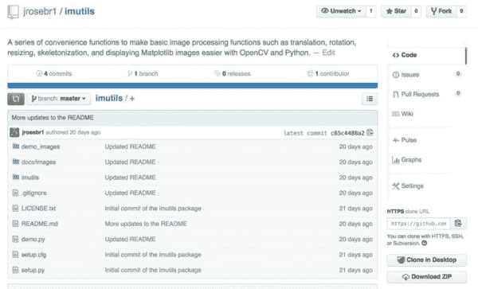
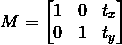
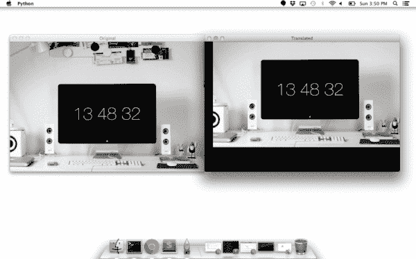
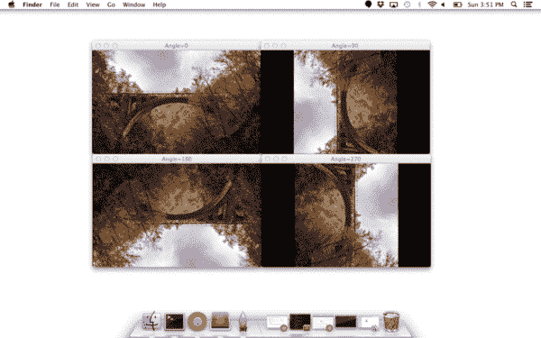
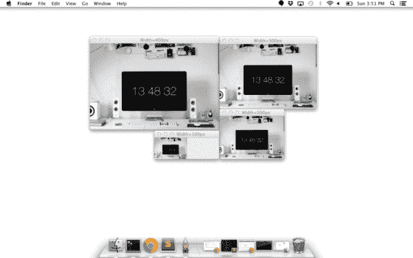
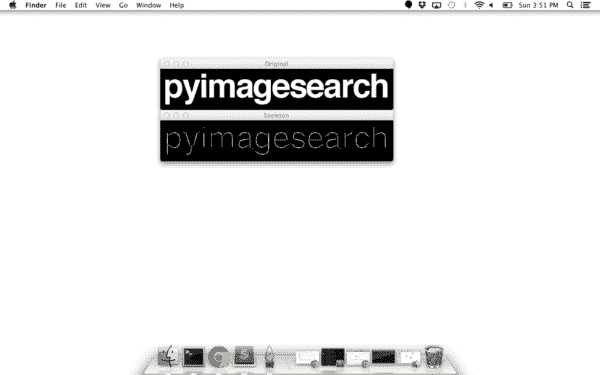
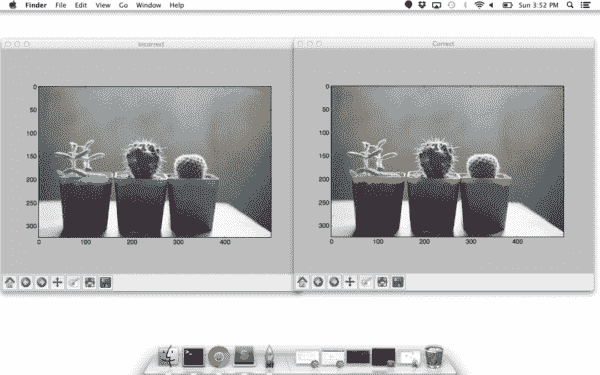

# 我刚刚开源了我的个人 imutils 包:一系列 OpenCV 便利函数。

> 原文：<https://pyimagesearch.com/2015/02/02/just-open-sourced-personal-imutils-package-series-opencv-convenience-functions/>

[](https://pyimagesearch.com/wp-content/uploads/2015/01/imutils_github_screenshot.jpg)

你知道什么是真正好的感觉吗？

为开源社区做贡献。

[PyPI](https://pypi.python.org/pypi) ，Python 包索引库是个奇妙的东西。它使得下载、安装和管理 Python 库和包变得轻而易举。

***说了这么多，*** ***我已经把自己的个人 [imutils](https://github.com/jrosebr1/imutils) 包推上线了。在处理计算机视觉和图像处理问题时，我几乎每天都使用这个软件包。***

这个包包括一系列 OpenCV +便利函数，执行基本任务，如平移、旋转、调整大小和骨架化。

在未来，我们将(很可能，取决于评论部分的反馈)对`imutils`包中的每个函数进行详细的代码审查，但是现在，看看这篇博文的其余部分，看看`imutils`中包含的功能，然后确保将它安装在您自己的系统上！

# 安装

这个包假设你已经安装了 [NumPy](http://www.numpy.org/) 和 [OpenCV](http://opencv.org) (以及 [matplotlib](http://matplotlib.org/) ，如果你打算使用`opencv2matplotlib`函数的话)。

要安装`imutils`库，只需发出以下命令:

```py
$ pip install imutils

```

# 我的 imutils 包:一系列 OpenCV 便利函数

让我们来看看我们可以用`imutils`包做些什么。

## 翻译

平移是图像在 *x* 或 *y* 方向的移动。要在 OpenCV 中翻译图像，您需要提供 *(x，y)* -shift，表示为 *(t [x] ，t [y] )* 来构造翻译矩阵 *M* :

[](https://pyimagesearch.com/wp-content/uploads/2015/01/translation_eq.png)

然后，您需要应用`cv2.warpAffine`函数。

不用手动构造平移矩阵 *M* 并调用`cv2.warpAffine`，只需调用`imutils`的`translate`函数即可。

#### 示例:

```py
# translate the image x=25 pixels to the right and y=75 pixels up
translated = imutils.translate(workspace, 25, -75)

```

#### 输出:

[](https://pyimagesearch.com/wp-content/uploads/2015/01/translation.png)

## 旋转

在 OpenCV 中旋转图像是通过调用`cv2.getRotationMatrix2D`和`cv2.warpAffine`来完成的。还需要注意提供图像旋转点的 *(x，y)* 坐标。这些计算调用会很快累积起来，使您的代码变得庞大，可读性更差。`imutils`中的`rotate`功能有助于解决这个问题。

#### 示例:

```py
# loop over the angles to rotate the image
for angle in xrange(0, 360, 90):
	# rotate the image and display it
	rotated = imutils.rotate(bridge, angle=angle)
	cv2.imshow("Angle=%d" % (angle), rotated)

```

#### 输出:

[](https://pyimagesearch.com/wp-content/uploads/2015/01/rotation.png)

## 调整大小

在 OpenCV 中调整图像大小是通过调用`cv2.resize`函数来完成的。但是，需要特别注意确保纵横比保持不变。`imutils`的这个`resize`函数维护纵横比并提供关键字参数`width`和`height`，因此图像可以调整到预期的宽度/高度，同时(1)维护纵横比和(2)确保图像的尺寸不必由开发人员显式计算。

另一个可选的关键字参数`inter`，也可以用来指定插值方法。

#### 示例:

```py
# loop over varying widths to resize the image to
for width in (400, 300, 200, 100):
	# resize the image and display it
	resized = imutils.resize(workspace, width=width)
	cv2.imshow("Width=%dpx" % (width), resized)

```

#### 输出:

[](https://pyimagesearch.com/wp-content/uploads/2015/01/resizing.png)

## 骨骼化

骨架化是构建图像中对象的“拓扑骨架”的过程，其中对象被假定为黑色背景上的白色。OpenCV 没有提供显式构建框架的函数，但是提供了形态学和二进制函数来实现。

为了方便起见，可以使用`imutils`的`skeletonize`函数来构建图像的拓扑骨架。

第一个参数，`size`是结构化元素内核的大小。可选参数`structuring`可用于控制结构化元素——默认为`cv2.MORPH_RECT`，但可以是任何有效的结构化元素。

#### 示例:

```py
# skeletonize the image
gray = cv2.cvtColor(logo, cv2.COLOR_BGR2GRAY)
skeleton = imutils.skeletonize(gray, size=(3, 3))
cv2.imshow("Skeleton", skeleton)

```

#### 输出:

[](https://pyimagesearch.com/wp-content/uploads/2015/01/skeletonization.png)

## 使用 Matplotlib 显示

在 OpenCV 的 Python 绑定中，图像以 BGR 顺序表示为 NumPy 数组。这在使用`cv2.imshow`功能时工作良好。但是，如果您打算使用 Matplotlib，`plt.imshow`函数假定图像是 RGB 顺序的。一个简单的调用`cv2.cvtColor`将解决这个问题，或者您可以使用`opencv2matplotlib`便利功能。

#### 示例:

```py
# INCORRECT: show the image without converting color spaces
plt.figure("Incorrect")
plt.imshow(cactus)

# CORRECT: convert color spaces before using plt.imshow
plt.figure("Correct")
plt.imshow(imutils.opencv2matplotlib(cactus))
plt.show()

```

**输出:**

[](https://pyimagesearch.com/wp-content/uploads/2015/01/matplotlib.png)

# 摘要

这就是你要的 imutils 软件包！

希望你安装一下，试一试。这肯定会使用 OpenCV 和 Python 执行简单的图像处理任务变得更加容易(并且代码更少)。

在接下来的几周里，我们将对每个功能进行代码审查，并讨论在引擎盖下发生了什么。

直到那时！

# 下载:

从 GitHub 获取 imutils 包。