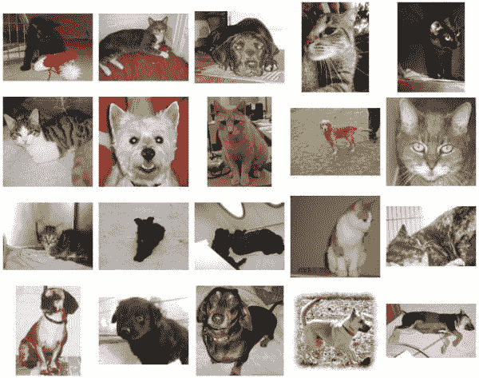
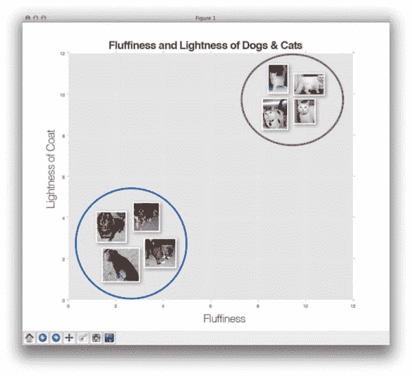
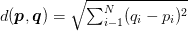
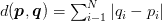
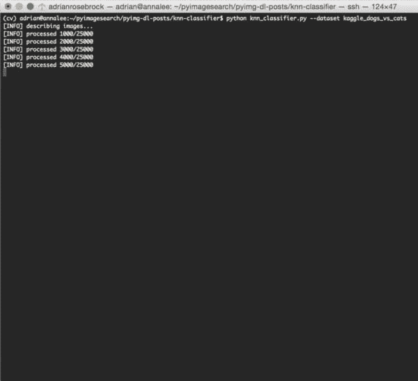
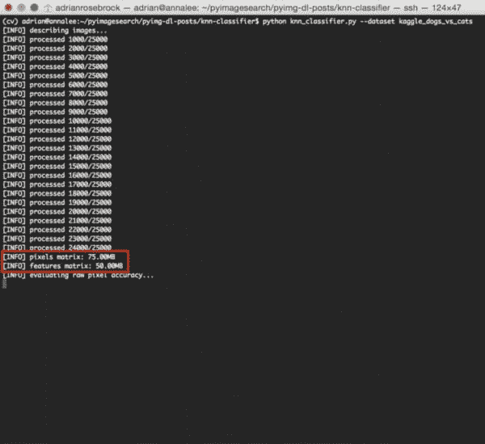
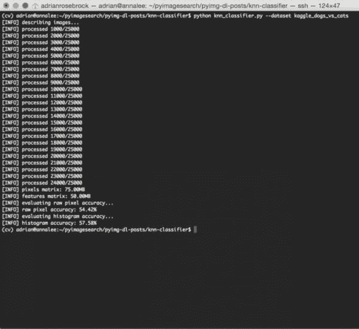

# 用于图像分类的 k-NN 分类器

> 原文：<https://pyimagesearch.com/2016/08/08/k-nn-classifier-for-image-classification/>


现在我们已经在 LeNet 上的上周博客文章[中领略了深度学习和卷积神经网络，我们将后退一步，开始更深入地研究图像分类背景下的机器学习。](https://pyimagesearch.com/2016/08/01/lenet-convolutional-neural-network-in-python/)

首先，我们将回顾 k-最近邻(k-NN)分类器，可以说是最简单、最容易理解的机器学习算法。**事实上，k-NN 是*如此简单的*，它根本不执行任何“学习”！**

在这篇博文的剩余部分，我将详细说明 k-NN 分类器是如何工作的。然后，我们将 k-NN 应用于 [Kaggle Dogs vs. Cats 数据集](https://www.kaggle.com/c/dogs-vs-cats/data)，这是来自微软的 [Asirra 数据集的子集。](http://research.microsoft.com/en-us/um/redmond/projects/asirra/)

顾名思义，狗与猫数据集的目标是对给定图像是否包含一只*狗*或一只*猫*进行分类。我们将在未来的博客文章中大量使用这个数据集*(原因我将在本教程稍后解释)，所以请确保你现在花时间通读这篇文章并熟悉这个数据集。*

 *说了这么多， ***让我们开始实现用于图像分类的 k-NN，以识别图像中的狗和猫！***

## 用于图像分类的 k-NN 分类器

在上周第一次体验了卷积神经网络的[之后，你可能会觉得我们今天讨论 k-NN 是在向*倒退*一大步。](https://pyimagesearch.com/2016/08/01/lenet-convolutional-neural-network-in-python/)

怎么回事？

好吧，是这样的。

我曾经写过一篇关于[摆脱深度学习潮流并获得一些观点](https://pyimagesearch.com/2014/06/09/get-deep-learning-bandwagon-get-perspective/)的(有争议的)博文。尽管标题令人反感，但这篇文章的总主题围绕着机器学习历史的各种趋势，如神经网络(以及神经网络的研究如何在 70-80 年代几乎消亡)、支持向量机和集成方法。

当这些方法中的每一种被引入时，研究人员和从业者都配备了新的、强大的技术——实质上，他们得到了一把锤子，每个问题看起来都像一个钉子 ，而在现实中，他们需要的只是简单地转动几下菲利普头来解决特定的问题。

我有消息告诉你:**深度学习也没什么不同。**

去参加绝大多数流行的机器学习和计算机视觉会议，看看最近的出版物列表。最重要的主题是什么？

*深度学习。*

然后，跳上与计算机视觉和机器学习相关的大型 LinkedIn 群。很多人在问什么？

*如何将深度学习应用于他们的数据集。*

在那之后，去看看流行的计算机科学分支，比如 [/r/machinelearning](https://www.reddit.com/r/machinelearning) 。有哪些教程是最被一致看好的？

*你猜对了:深度学习。*

这是底线:

**是的，我会在这个博客上教你关于深度学习和卷积神经网络的知识——*但是你会明白深度学习只是一种工具，就像任何其他工具一样，使用它有一个*正确的*和*错误的*时间。***

正因为如此，在我们走得太远之前，了解机器学习的基础知识对我们来说很重要。在接下来的几周里，我将讨论机器学习和神经网络的基础知识，最终建立深度学习(在这里你将能够更多地欣赏这些算法的内部工作方式)。

### Kaggle 狗对猫数据集

狗对猫的数据集实际上是几年前的一个 Kaggle 挑战赛的一部分。这个挑战本身很简单:*给定一张图片，预测它是包含一只狗还是一只猫:*



**Figure 1:** Examples from the Kaggle Dogs vs. Cats dataset.

很简单，但是如果你了解图像分类，你就会明白:

*   视点变化
*   标度变化
*   变形
*   闭塞
*   背景杂斑
*   类内变异

这个问题比表面上看起来要困难得多。

通过简单的随机猜测，**你应该可以达到 50%的准确率**(因为只有两个类别标签)。一个机器学习算法将需要获得> 50%的准确性，以证明它事实上已经“学习”了一些东西(或在数据中发现了一个潜在的模式)。

**就我个人而言，我喜欢狗与猫的挑战，*尤其是教授深度学习的*。**

为什么？

数据集简单到足以让你晕头转向——只有两个类:*【狗】*或*【猫】*。

然而，数据集的大小很好，在训练数据中包含 *25，000* 张图像。这意味着你有足够的数据从头开始训练数据饥渴的卷积神经网络。

在未来的博客文章中，我们会大量使用这个数据集。为了您的方便，我实际上已经将它包含在这篇博文的 ***【下载】*** 部分，所以在您继续之前，请向下滚动以获取代码+数据。

### 项目结构

一旦你下载了这篇博文的归档文件，把它解压到一个方便的地方。从这里我们来看一下项目目录结构:

```py
$ tree --filelimit 10
.
├── kaggle_dogs_vs_cats
│   └── train [25000 entries exceeds filelimit, not opening dir]
└── knn_classifier.py

2 directories, 1 file

```

Kaggle 数据集包含在`kaggle_dogs_vs_cats/train`目录中(它来自 [Kaggle 网页](https://www.kaggle.com/c/dogs-vs-cats/data)上的`train.zip`)。

我们今天将回顾一个 Python 脚本— `knn_classifier.py`。该文件将加载数据集，建立并运行 K-NN 分类器，并打印出评估指标。

### k-NN 分类器是如何工作的？

[k 近邻](https://en.wikipedia.org/wiki/K-nearest_neighbors_algorithm)分类器是*到目前为止*最简单的机器学习/图像分类算法。事实上，*非常简单*，它实际上并没有“学习”任何东西。

在内部，这种算法简单地依赖于特征向量之间的距离，[很像构建一个图像搜索引擎](https://pyimagesearch.com/2014/12/01/complete-guide-building-image-search-engine-python-opencv/)——只是这一次，我们有了与每张图像相关联的*标签*，因此我们可以预测并返回该图像的实际*类别*。

简单来说，k-NN 算法通过在 ***k 个最接近的例子中找到*个最常见的类*来对未知数据点进行分类。**T5*k*最接近的例子中的每个数据点进行投票，得票最多的类别获胜！*

或者，说白了:*“告诉我你的邻居是谁，我就知道你是谁”*

为了形象化这一点，看一下下面的玩具示例，我沿着 *x 轴*绘制了动物的“蓬松度”，并在 *y 轴*绘制了它们皮毛的亮度:



**Figure 2:** Plotting the fluffiness of animals along the *x-axis* and the lightness of their coat on the *y-axis*.

这里我们可以看到有两类图像，每个类别中的每个数据点在一个 *n-* 维空间中相对紧密地组合在一起。我们的狗往往有深色的皮毛，不是很蓬松，而我们的猫有非常浅色的皮毛，非常蓬松。

这意味着*红色圆圈*中的两个数据点之间的距离*比*红色圆圈*中的数据点和*蓝色圆圈*中的数据点之间的距离*小得多。

为了应用 k-最近邻分类，我们需要定义一个[距离度量或相似性函数](https://pyimagesearch.com/2014/02/17/building-an-image-search-engine-defining-your-similarity-metric-step-3-of-4/)。常见的选择包括[欧几里德距离](https://en.wikipedia.org/wiki/Euclidean_distance):



**Figure 3:** The Euclidean distance.

以及[曼哈顿/城市街区距离](https://en.wikipedia.org/wiki/Taxicab_geometry):



**Figure 4:** The Manhattan/city block distance.

根据您的数据类型，可以使用其他距离度量/相似性函数(卡方距离通常用于分布[即直方图])。在今天的博文中，为了简单起见，我们将使用欧几里德距离来比较图像的相似性。

### 用 Python 实现 k-NN 图像分类

既然我们已经讨论了 k-NN 算法是什么，以及我们要将它应用到什么数据集，那么让我们编写一些代码来使用 k-NN 实际执行图像分类。

打开一个新文件，命名为`knn_classifier.py`，让我们开始编码:

```py
# import the necessary packages
from sklearn.neighbors import KNeighborsClassifier
from sklearn.model_selection import train_test_split
from imutils import paths
import numpy as np
import argparse
import imutils
import cv2
import os

```

我们从第 2-9 行开始，导入我们需要的 Python 包。如果你还没有安装 [scikit-learn 库](http://scikit-learn.org/stable/)，那么你会希望[按照这些说明](http://scikit-learn.org/stable/install.html)现在就安装它。

***注:**此博文已更新为兼容未来`scikit-learn==0.20`其中`sklearn.cross_validation`已被`sklearn.model_selection`取代。*

其次，我们将使用 [imutils 库](https://github.com/jrosebr1/imutils)，这是我创建的一个包，用来存储常见的计算机视觉处理函数。如果您还没有安装`imutils`,您现在就想安装:

```py
$ pip install imutils

```

接下来，我们将定义两种方法来获取输入图像并将其转换为[特征向量](https://pyimagesearch.com/2014/03/03/charizard-explains-describe-quantify-image-using-feature-vectors/)，或者量化图像内容的数字列表。第一种方法如下图所示:

```py
def image_to_feature_vector(image, size=(32, 32)):
	# resize the image to a fixed size, then flatten the image into
	# a list of raw pixel intensities
	return cv2.resize(image, size).flatten()

```

`image_to_feature_vector`方法是一个非常简单的函数，它简单地获取一个输入`image`并将其调整为固定的宽度和高度(`size`)，然后将 RGB 像素亮度展平为一个数字列表。

这意味着我们的输入`image`将被缩小到*32×32*像素，并且分别给每个红色、绿色和蓝色分量三个通道，我们的输出“特征向量”将是一列*32×32×3 = 3072 个*数字。

严格地说，`image_to_feature_vector`的输出不是真正的“特征向量”,因为我们倾向于将“特征”和“描述符”视为图像内容的抽象量化。

此外，利用原始像素强度作为机器学习算法的输入往往会产生很差的结果，即使是旋转、平移、视点、比例等的小变化。，能否*显著*影响图像本身(从而影响你的输出特征表示)。

***注:**正如我们将在后面的教程中发现的，卷积神经网络使用原始像素强度作为输入获得了惊人的结果——但这是因为它们**在训练过程中学习了**一组强大的鉴别过滤器。*

然后我们定义第二个方法，这个方法叫做`extract_color_histogram`:

```py
def extract_color_histogram(image, bins=(8, 8, 8)):
	# extract a 3D color histogram from the HSV color space using
	# the supplied number of `bins` per channel
	hsv = cv2.cvtColor(image, cv2.COLOR_BGR2HSV)
	hist = cv2.calcHist([hsv], [0, 1, 2], None, bins,
		[0, 180, 0, 256, 0, 256])

	# handle normalizing the histogram if we are using OpenCV 2.4.X
	if imutils.is_cv2():
		hist = cv2.normalize(hist)

	# otherwise, perform "in place" normalization in OpenCV 3 (I
	# personally hate the way this is done
	else:
		cv2.normalize(hist, hist)

	# return the flattened histogram as the feature vector
	return hist.flatten()

```

顾名思义，这个函数接受一个输入`image`并构建一个颜色直方图来描述图像的颜色分布。

首先，我们将第 19 行的`image`转换到 HSV 色彩空间。然后我们应用`cv2.calcHist`函数来计算`image` ( **行 20 和 21** )的 3D 颜色直方图。你可以在这篇文章中阅读更多关于[计算颜色直方图的内容。您可能还会对](https://pyimagesearch.com/2014/01/22/clever-girl-a-guide-to-utilizing-color-histograms-for-computer-vision-and-image-search-engines/)[将颜色直方图应用于图像搜索引擎](https://pyimagesearch.com/2014/12/01/complete-guide-building-image-search-engine-python-opencv/)以及[如何比较颜色直方图的相似性](https://pyimagesearch.com/2014/07/14/3-ways-compare-histograms-using-opencv-python/)感兴趣。

给定我们计算出的`hist`，然后我们将其规范化，注意使用基于 OpenCV 版本的适当的`cv2.normalize`函数签名(**第 24-30 行**)。

给定分别用于色调、饱和度和值通道的 *8 个面元*，我们的最终特征向量的大小为*8×8×8 = 512*，因此我们的图像由 *512-d* 特征向量表征。

接下来，让我们解析我们的命令行参数:

```py
# construct the argument parse and parse the arguments
ap = argparse.ArgumentParser()
ap.add_argument("-d", "--dataset", required=True,
	help="path to input dataset")
ap.add_argument("-k", "--neighbors", type=int, default=1,
	help="# of nearest neighbors for classification")
ap.add_argument("-j", "--jobs", type=int, default=-1,
	help="# of jobs for k-NN distance (-1 uses all available cores)")
args = vars(ap.parse_args())

```

我们只需要一个命令行参数，后面跟着两个可选参数，下面详细介绍了每个参数:

*   这是我们输入的 Kaggle 狗对猫数据集目录的路径。
*   `--neighbors`:这里我们可以提供给定数据点分类时考虑的最近邻的数量。我们将这个值默认为*一个*，这意味着图像将通过在一个*n*–*维*空间中找到其最近的邻居来分类，然后取最近图像的标签。在下周的帖子中，我将演示如何自动调优 *k* 以获得最佳精度。
*   `--jobs`:找到给定图像的最近邻居需要我们计算从我们的*输入图像*到我们数据集中每隔一个图像的*的距离。这显然是一个线性伸缩的 *O(N)* 运算。对于较大的数据集，这可能会变得非常慢。为了加速这个过程，我们可以将最近邻的计算分布在机器的多个处理器/内核上。将`--jobs`设置为`-1`可确保*所有的*处理器/内核都用于帮助加速分类过程。*

***注:*** *我们也可以通过利用专门的数据结构如 [kd-trees](https://en.wikipedia.org/wiki/K-d_tree) 或近似最近邻算法如 [FLANN](http://www.cs.ubc.ca/research/flann/) 或[ony](https://github.com/spotify/annoy)来加速 k-NN 分类器。在实践中，这些算法可以将最近邻搜索减少到大约*O(log N)*；然而，在这篇文章中，为了简单起见，我们将执行一个详尽的最近邻搜索。*

我们现在准备好为特征提取准备我们的图像:

```py
# grab the list of images that we'll be describing
print("[INFO] describing images...")
imagePaths = list(paths.list_images(args["dataset"]))

# initialize the raw pixel intensities matrix, the features matrix,
# and labels list
rawImages = []
features = []
labels = []

```

**第 47 行**从磁盘获取所有 25，000 个训练图像的路径。

然后我们初始化三个列表(**行 51-53** )来存储原始图像像素强度( *3072-d* 特征向量)，另一个存储直方图特征( *512-d* 特征向量)，最后是类标签本身(或者是“狗”或者是“猫”)。

让我们继续从数据集中提取要素:

```py
# loop over the input images
for (i, imagePath) in enumerate(imagePaths):
	# load the image and extract the class label (assuming that our
	# path as the format: /path/to/dataset/{class}.{image_num}.jpg
	image = cv2.imread(imagePath)
	label = imagePath.split(os.path.sep)[-1].split(".")[0]

	# extract raw pixel intensity "features", followed by a color
	# histogram to characterize the color distribution of the pixels
	# in the image
	pixels = image_to_feature_vector(image)
	hist = extract_color_histogram(image)

	# update the raw images, features, and labels matricies,
	# respectively
	rawImages.append(pixels)
	features.append(hist)
	labels.append(label)

	# show an update every 1,000 images
	if i > 0 and i % 1000 == 0:
		print("[INFO] processed {}/{}".format(i, len(imagePaths)))

```

我们开始在第 56 行的**上循环我们的输入图像。每个图像从磁盘加载，并且从`imagePath` ( **行 59 和 60** )提取类别标签。**

我们在第 65 和 66 行的**上应用`image_to_feature_vector`和`extract_color_histogram`函数——这些函数用于从输入`image`中提取我们的特征向量。**

给定我们的特性标签，然后我们更新第 70-72 行上的`rawImages`、`features`和`labels`列表。

最后，我们在终端上显示一个更新，通知我们每 1000 张图像的特征提取进度(**行 75 和 76** )。

您可能会好奇我们的`rawImages`和`features`矩阵占用了多少内存——下面的代码块会在执行时告诉我们:

```py
# show some information on the memory consumed by the raw images
# matrix and features matrix
rawImages = np.array(rawImages)
features = np.array(features)
labels = np.array(labels)
print("[INFO] pixels matrix: {:.2f}MB".format(
	rawImages.nbytes / (1024 * 1000.0)))
print("[INFO] features matrix: {:.2f}MB".format(
	features.nbytes / (1024 * 1000.0)))

```

我们首先将列表转换成 NumPy 数组。然后，我们使用 NumPy 数组的`.nbytes`属性来显示表示使用的内存兆字节数(大约 75MB 用于原始像素亮度，50MB 用于颜色直方图。这意味着我们可以*轻松地*将我们的特征存储在主存中。

接下来，我们需要将我们的数据分区分成两部分——一部分用于*训练*，另一部分用于*测试*:

```py
# partition the data into training and testing splits, using 75%
# of the data for training and the remaining 25% for testing
(trainRI, testRI, trainRL, testRL) = train_test_split(
	rawImages, labels, test_size=0.25, random_state=42)
(trainFeat, testFeat, trainLabels, testLabels) = train_test_split(
	features, labels, test_size=0.25, random_state=42)

```

这里，我们将使用 75%的数据进行训练，剩下的 25%用于测试 k-NN 算法。

让我们将 k-NN 分类器应用于原始像素强度:

```py
# train and evaluate a k-NN classifer on the raw pixel intensities
print("[INFO] evaluating raw pixel accuracy...")
model = KNeighborsClassifier(n_neighbors=args["neighbors"],
	n_jobs=args["jobs"])
model.fit(trainRI, trainRL)
acc = model.score(testRI, testRL)
print("[INFO] raw pixel accuracy: {:.2f}%".format(acc * 100))

```

这里，我们使用提供的数量`--neighbors`和`--jobs`实例化来自 [scikit-learn 库](http://scikit-learn.org/stable/modules/generated/sklearn.neighbors.KNeighborsClassifier.html)的`KNeighborsClassifier`对象。

然后，我们通过调用 99 线**上的`.fit`来“训练”我们的模型，随后评估 100** 线**上的测试数据。**

以类似的方式，我们也可以在直方图表示上训练和评估 k-NN 分类器:

```py
# train and evaluate a k-NN classifer on the histogram
# representations
print("[INFO] evaluating histogram accuracy...")
model = KNeighborsClassifier(n_neighbors=args["neighbors"],
	n_jobs=args["jobs"])
model.fit(trainFeat, trainLabels)
acc = model.score(testFeat, testLabels)
print("[INFO] histogram accuracy: {:.2f}%".format(acc * 100))

```

### k-NN 图像分类结果

为了测试我们的 k-NN 图像分类器，确保你已经使用本教程底部的 ***【下载】*** 表单下载了这篇博文的源代码。

下载中包含了 [Kaggle 狗与猫的数据集](https://www.kaggle.com/c/dogs-vs-cats/data)。

从那里，只需执行以下命令:

```py
$ python knn_classifier.py --dataset kaggle_dogs_vs_cats

```

首先，您会看到我们的图像是通过`image_to_feature_vector`和`extract_color_histogram`函数描述和量化的:



**Figure 5:** Quantifying and extracting features from the Dogs vs. Cats dataset.

根据机器的速度，这个过程不会超过 1-3 分钟。

要素提取过程完成后，我们可以看到一些关于要素制图表达大小(MB)的信息:



**Figure 6:** Measuring the size of our feature matrices.

原始像素特征占用 75MB，而颜色直方图仅需要 50MB 的 RAM。

最后，对原始像素强度和颜色直方图训练和评估 k-NN 算法:



**Figure 7:** Evaluating our k-NN algorithm for image classification.

如上图所示，通过利用*原始像素强度，我们能够达到 **54.42%的准确度。**另一方面，将 k-NN 应用于颜色直方图获得了稍好的 **57.58%的准确度**。*

 *在这两种情况下，我们能够获得超过 50%的准确性，表明原始像素强度和颜色直方图的图像都有一个潜在的模式。

然而，57%的准确率还有待提高。

正如你可能想象的那样，颜色直方图并不是区分狗和猫的最佳方式:

*   有棕色的狗。还有棕色的猫。
*   有黑狗。还有黑猫。
*   当然，狗和猫可以出现在相同的环境中(例如房子、公园、海滩等)。)其中*背景颜色分布*是相似的。

正因为如此，严格利用颜色来区分猫和狗并不是一个很好的选择——但这没关系。这篇博文的目的只是简单地介绍使用 k-NN 算法进行图像分类的概念。

我们可以很容易地应用方法来获得更高的精度。正如我们将看到的，利用卷积神经网络，我们可以**达到> 95%的准确性，而不需要太多的努力**——但是我将把它留到将来我们更好地理解图像分类时讨论。

### 现在想了解更多关于卷积神经网络的信息吗？

如果你喜欢这个关于图像分类的教程，你肯定会*想看看 ***[PyImageSearch 大师课程](https://pyimagesearch.com/pyimagesearch-gurus/?src=post-knn-classifier)***——今天最*完整、全面的*计算机视觉在线课程。*

在课程里面，你会发现超过 **168 课**，涵盖**2161+页**的内容，关于*深度学习*、*卷积神经网络*、*图像分类、*、 *F* 、*王牌识别*、*、**以及更多**。*

要了解更多关于 PyImageSearch 大师课程的信息(并获取 ***10 节免费样课+课程大纲*** )，只需点击下面的按钮:

[Click here to learn more about PyImageSearch Gurus!](https://pyimagesearch.com/pyimagesearch-gurus/?src=post-knn-classifier)

### 我们能做得更好吗？

你可能想知道，我们能比 57%的分类准确率做得更好吗？

你会注意到，在这个例子中我只使用了 *k=1* ，这意味着在对每张图像进行分类时，只考虑了*一个*最近的邻居。如果我使用 *k=3* 或 *k=5* ，结果会有什么变化？

那么距离度量的选择呢——曼哈顿/城市街区的距离会是更好的选择吗？

同时改变***k*和距离*度量*的值怎么样？**

 **分类准确度会提高吗？变得更糟？保持不变？

事实是*几乎所有的*机器学习算法都需要一点调整来获得最佳结果。为了确定这些模型变量的最优值，我们应用了一个叫做*超参数调整*的过程，这正是下周博客文章的主题。

## 摘要

在这篇博文中，我们回顾了使用 k-NN 算法进行图像分类的基础知识。然后，我们将 k-NN 分类器应用于 Kaggle Dogs vs. Cats 数据集，以识别给定图像中包含的是狗还是猫。

仅利用输入图像的原始像素强度，我们获得了 54.42%的准确度。通过使用颜色直方图，我们获得了略好的 57.58%的准确率。由于这两个结果都大于 50%(我们应该期望简单地通过随机猜测获得 50%的准确性)，我们可以确定在原始像素/颜色直方图中有一个潜在的模式，可以用来区分狗和猫(尽管 57%的准确性相当差)。

这就提出了一个问题:*“使用 k-NN 有可能获得> 57%的分类准确率吗？如果有，怎么做？”*

答案是 ***超参数调整***——这正是我们将在下周的博客文章中涉及的内容。

请务必使用下面的表格注册 PyImageSearch 时事通讯，以便在下一篇博文发布时得到通知！****