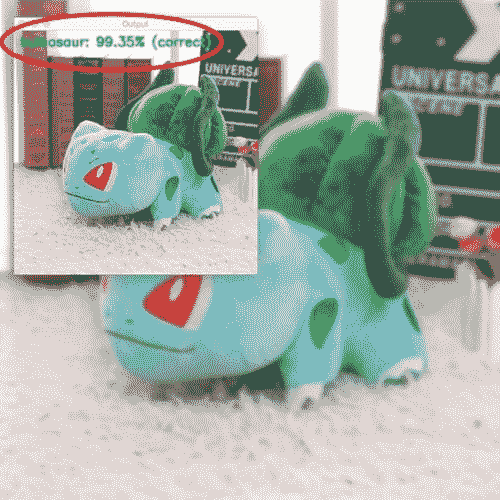
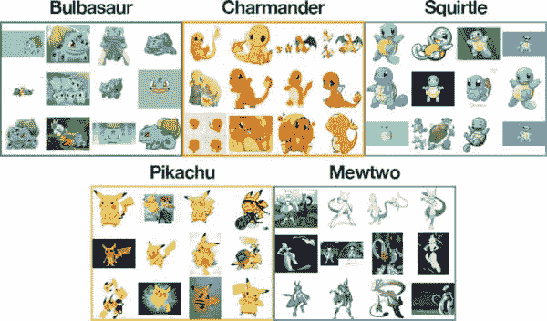
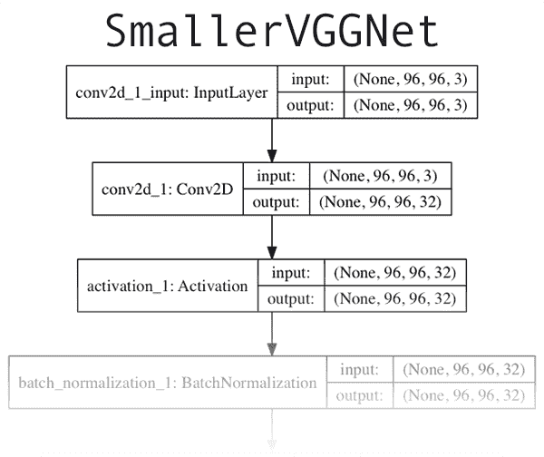
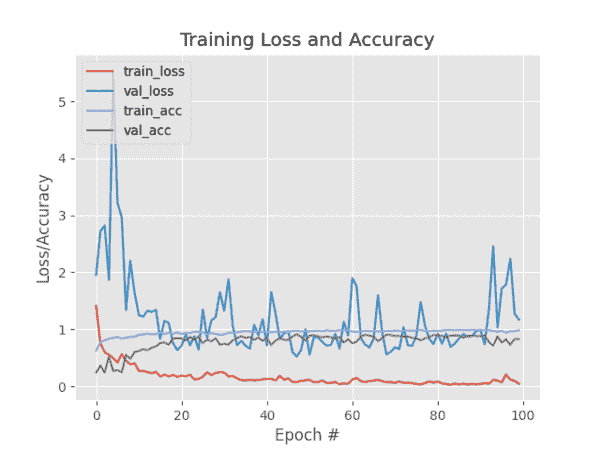
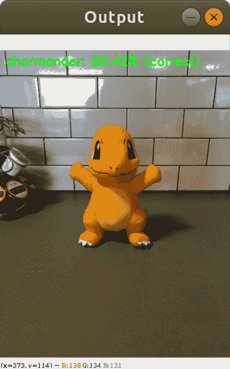
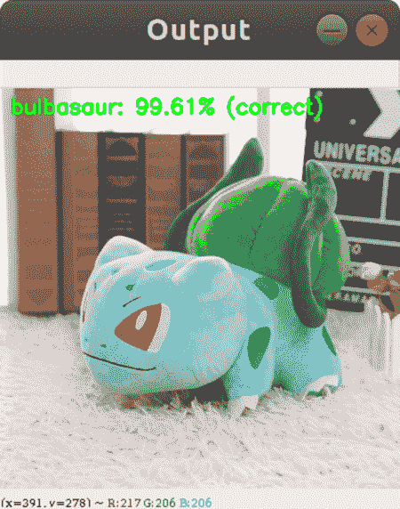
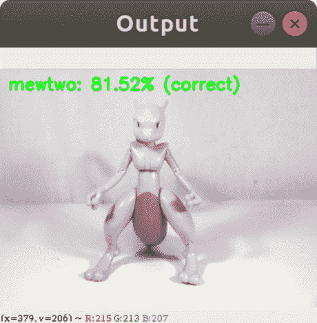
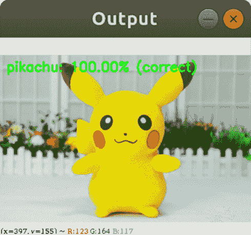
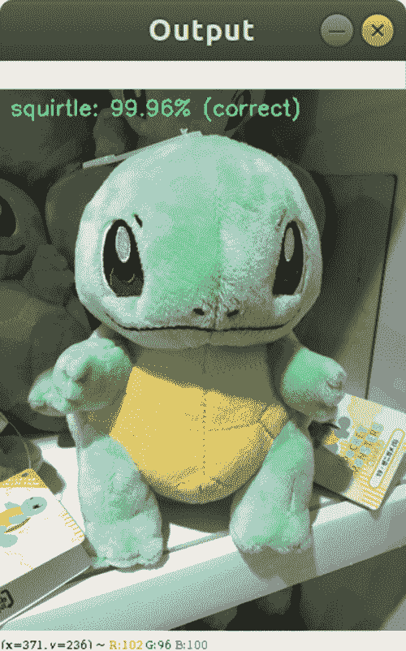
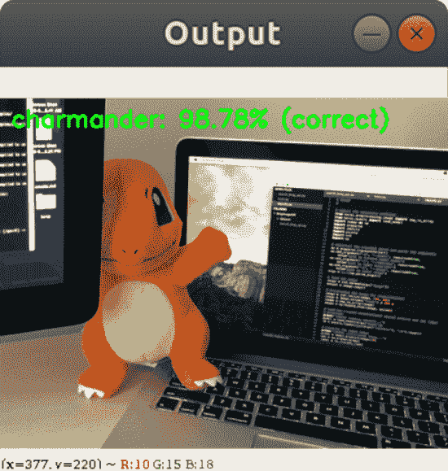

# Keras 和卷积神经网络(CNN)

> 原文：<https://pyimagesearch.com/2018/04/16/keras-and-convolutional-neural-networks-cnns/>

[](https://pyimagesearch.com/wp-content/uploads/2018/04/cnn_keras_header.jpg)

Creating a Convolutional Neural Network using Keras to recognize a Bulbasaur stuffed Pokemon 

今天的博客文章是关于构建完整的端到端图像分类+深度学习应用的三部分系列的第二部分:

*   **第一部分:** [如何(快速)建立深度学习图像数据集](https://pyimagesearch.com/2018/04/09/how-to-quickly-build-a-deep-learning-image-dataset/)
*   第二部分: Keras 和卷积神经网络(今日邮报)
*   第三部分:在 iOS 上运行 Keras 模型(将于下周发布)

在今天的博文结束时，你将理解如何在你自己的定制数据集上实现、训练和评估卷积神经网络。

在下周的帖子中，我将展示如何使用经过训练的 Keras 模型，并通过几行代码将其部署到智能手机应用程序中！

为了让这个系列轻松有趣，*我正在实现我童年的一个梦想*建造一个 Pokedex。Pokedex 是一种存在于口袋妖怪世界的设备，口袋妖怪是一种流行的电视节目，视频游戏和交易卡系列(我过去是/现在仍然是一个超级口袋妖怪迷)。

如果你不熟悉口袋妖怪，你应该把 Pokedex 想象成一个智能手机应用程序，它可以识别口袋妖怪，即存在于口袋妖怪世界中的类似动物的生物。

你可以交换你自己的数据集，当然，我只是玩玩，享受一点童年的怀旧。

**要了解如何在自己定制的数据集上用 Keras 和深度学习训练一个卷积神经网络，*继续阅读。***

## Keras 和卷积神经网络

***2020-05-13 更新:**此博文现已兼容 TensorFlow 2+!*

在上周的博客文章中，我们学习了如何快速构建深度学习图像数据集——我们使用了文章中介绍的过程和代码来收集、下载和组织磁盘上的图像。

现在我们已经下载并组织了我们的图像，下一步是在数据的基础上训练一个卷积神经网络(CNN)。

在今天的帖子中，我将向你展示如何使用 Keras 和深度学习来训练你的 CNN。本系列的最后一部分将于下周发布，将展示如何使用经过训练的 Keras 模型，只需几行代码就能将其部署到智能手机(尤其是 iPhone)上。

本系列的最终目标是帮助您构建一个功能齐全的深度学习应用程序——使用本系列作为灵感和起点，帮助您构建自己的深度学习应用程序。

让我们开始用 Keras 和深度学习来训练 CNN。

### **配置您的开发环境**

要针对本教程配置您的系统，我首先建议您遵循以下任一教程:

*   *[如何在 Ubuntu 上安装 tensor flow 2.0](https://pyimagesearch.com/2019/12/09/how-to-install-tensorflow-2-0-on-ubuntu/)*
*   *[如何在 macOS 上安装 tensor flow 2.0](https://pyimagesearch.com/2019/12/09/how-to-install-tensorflow-2-0-on-macos/)*

这两个教程都将帮助您在一个方便的 Python 虚拟环境中，用这篇博文所需的所有软件来配置您的系统。

请注意 [PyImageSearch 不推荐也不支持 CV/DL 项目](https://pyimagesearch.com/faqs/single-faq/can-you-help-me-do-___-on-windows/)的窗口。

### 我们的深度学习数据集

[](https://pyimagesearch.com/wp-content/uploads/2018/04/cnn_keras_dataset.jpg)

**Figure 1:** A montage of samples from our Pokemon deep learning dataset depicting each of the classes (i.e., Pokemon species). As we can see, the dataset is diverse, including illustrations, movie/TV show stills, action figures, toys, etc.

我们的深度学习数据集由 1，191 张口袋妖怪(存在于流行的电视节目、视频游戏和交易卡系列口袋妖怪世界中的类似动物的生物)的图像组成。

我们的目标是使用 Keras 和深度学习训练一个卷积神经网络，以 ***识别*** 和 ***对这些口袋妖怪的每一个进行分类*** 。

我们将认识的口袋妖怪包括:

*   [妙蛙种子](https://bulbapedia.bulbagarden.net/wiki/Bulbasaur_(Pok%C3%A9mon)) (234 张图片)
*   [小火龙](https://bulbapedia.bulbagarden.net/wiki/Charmander_(Pok%C3%A9mon)) (238 张图片)
*   [杰尼龟](https://bulbapedia.bulbagarden.net/wiki/Squirtle_(Pok%C3%A9mon)) (223 张图片)
*   [皮卡丘](https://bulbapedia.bulbagarden.net/wiki/Pikachu_(Pok%C3%A9mon)) (234 张图片)
*   [Mewtwo](https://bulbapedia.bulbagarden.net/wiki/Mewtwo_(Pok%C3%A9mon)) (239 张图片)

在上面的**图 1** 中可以看到每个班级的训练图像剪辑。

如您所见，我们的培训图像包括以下内容:

*   电视节目和电影中的静止画面
*   交易卡
*   动作玩偶
*   玩具和 plus
*   粉丝提供的图纸和艺术效果图

这种训练图像的多样化组合将允许我们的 CNN 在一系列图像中识别我们的五个口袋妖怪类别— **正如我们将看到的，我们将能够获得 *82%+* 的分类准确性！**

### 卷积神经网络和 Keras 项目结构

今天的项目有几个移动部分，为了帮助我们理解项目，让我们先回顾一下项目的目录结构:

```py
├── dataset
│   ├── bulbasaur [234 entries]
│   ├── charmander [238 entries]
│   ├── mewtwo [239 entries]
│   ├── pikachu [234 entries]
│   └── squirtle [223 entries]
├── examples [6 entries]
├── pyimagesearch
│   ├── __init__.py
│   └── smallervggnet.py
├── plot.png
├── lb.pickle
├── pokedex.model
├── classify.py
└── train.py

```

有 3 个目录:

1.  `dataset`:包含五个类，每个类都有自己的子目录，以方便解析类标签。
2.  包含我们将用来测试 CNN 的图片。
3.  `pyimagesearch`模块:包含我们的`SmallerVGGNet`模型类(我们将在本文稍后实现)。

和根目录中的 5 个文件:

1.  `plot.png`:运行训练脚本后生成的我们的训练/测试准确度和损失图。
2.  `lb.pickle`:我们的`LabelBinarizer`序列化对象文件——它包含类名查找机制的类索引。
3.  `pokedex.model`:这是我们序列化的 Keras 卷积神经网络模型文件(即“权重文件”)。
4.  `train.py`:我们将使用这个脚本来训练我们的 Keras CNN，绘制准确度/损失，然后序列化 CNN 并将二进制化器标记到磁盘。
5.  我们的测试脚本。

### 我们的 Keras 和 CNN 架构

[](https://pyimagesearch.com/wp-content/uploads/2018/04/cnn_keras_smallervggnet.png)

**Figure 2:** A VGGNet-like network that I’ve dubbed “SmallerVGGNet” will be used for training a deep learning classifier with Keras. You can find the full resolution version of this network architecture diagram [here](https://pyimagesearch.com/wp-content/uploads/2018/04/smallervggnet_model.png).

我们今天将利用的 CNN 架构是 VGGNet 网络的一个更小、更紧凑的变体，由 Simonyan 和 Zisserman 在他们 2014 年的论文 [*中介绍，用于大规模图像识别的超深度卷积网络*](https://arxiv.org/abs/1409.1556) 。

类似 VGGNet 的架构具有以下特征:

1.  仅使用 3×3 的卷积层，以递增的深度相互堆叠
2.  通过最大池化减少卷大小
3.  softmax 分类器之前网络末端的全连接图层

我假设您已经在系统上安装并配置了 Keras。如果没有，下面是我整理的几个深度学习开发环境配置教程的链接:

*   [用 Python 为深度学习配置 Ubuntu](https://pyimagesearch.com/2017/09/25/configuring-ubuntu-for-deep-learning-with-python/)
*   [用 Python 设置 Ubuntu 16.04 + CUDA + GPU 进行深度学习](https://pyimagesearch.com/2017/09/27/setting-up-ubuntu-16-04-cuda-gpu-for-deep-learning-with-python/)
*   [用 Python 配置 macOS 进行深度学习](https://pyimagesearch.com/2017/09/29/macos-for-deep-learning-with-python-tensorflow-and-keras/)

如果你想*跳过配置你的深度学习环境*，我会推荐使用以下**云中预先配置的实例**之一:

*   [用 Python 进行深度学习的亚马逊 AMI](https://pyimagesearch.com/2017/09/20/pre-configured-amazon-aws-deep-learning-ami-with-python/)
*   [微软用于深度学习的数据科学虚拟机(DSVM)](https://pyimagesearch.com/2018/03/21/my-review-of-microsofts-deep-learning-virtual-machine/)

让我们继续实现`SmallerVGGNet`，我们的小版本 VGGNet。在`pyimagesearch`模块中创建一个名为`smallervggnet.py`的新文件，并插入以下代码:

```py
# import the necessary packages
from tensorflow.keras.models import Sequential
from tensorflow.keras.layers import BatchNormalization
from tensorflow.keras.layers import Conv2D
from tensorflow.keras.layers import MaxPooling2D
from tensorflow.keras.layers import Activation
from tensorflow.keras.layers import Flatten
from tensorflow.keras.layers import Dropout
from tensorflow.keras.layers import Dense
from tensorflow.keras import backend as K

```

首先我们导入我们的模块——注意它们都来自 Keras。在阅读使用 Python 进行计算机视觉的深度学习[](https://pyimagesearch.com/deep-learning-computer-vision-python-book/)*的整个过程中，这些都被广泛涵盖。*

 ****注意:**您还需要在`pyimagesearch`中创建一个`__init__.py`文件，这样 Python 就知道这个目录是一个模块。如果你不熟悉`__init__.py`文件或者它们是如何被用来创建模块的，不要担心，只需使用这篇博文末尾的**“下载”**部分来下载我的目录结构、源代码和数据集+示例图像。*

从那里，我们定义了我们的`SmallerVGGNet`类:

```py
class SmallerVGGNet:
	@staticmethod
	def build(width, height, depth, classes):
		# initialize the model along with the input shape to be
		# "channels last" and the channels dimension itself
		model = Sequential()
		inputShape = (height, width, depth)
		chanDim = -1

		# if we are using "channels first", update the input shape
		# and channels dimension
		if K.image_data_format() == "channels_first":
			inputShape = (depth, height, width)
			chanDim = 1

```

我们的构建方法需要四个参数:

*   `width`:图像宽度尺寸。
*   `height`:图像高度尺寸。
*   `depth`:图像的深度——也称为通道数。
*   `classes`:我们数据集中的类的数量(这将影响我们模型的最后一层)。我们在本帖中使用了 5 个口袋妖怪类别，但是不要忘记，如果你为每个物种下载了足够多的示例图片，你*可以*使用 807 个口袋妖怪物种！

***注意:*** *我们将处理深度为`3``96 x 96`的输入图像(我们将在本文后面看到)。当我们解释输入量在网络中的空间维度时，请记住这一点。*

由于我们使用 TensorFlow 后端，我们用“通道最后”数据排序来安排输入形状，但是如果您想使用“通道优先”(Theano，等等。)然后在**行 23-25** 上自动处理。

现在，让我们开始添加层到我们的模型:

```py
		# CONV => RELU => POOL
		model.add(Conv2D(32, (3, 3), padding="same",
			input_shape=inputShape))
		model.add(Activation("relu"))
		model.add(BatchNormalization(axis=chanDim))
		model.add(MaxPooling2D(pool_size=(3, 3)))
		model.add(Dropout(0.25))

```

上面是我们的第一个`CONV => RELU => POOL`区块。

卷积层有带`3 x 3`内核的`32`滤镜。我们使用`RELU`激活函数，然后进行批量标准化。

我们的`POOL`层使用一个`3 x 3` `POOL`大小来快速将空间维度从`96 x 96`减少到`32 x 32`(我们将使用`96 x 96 x 3`输入图像来训练我们的网络，我们将在下一节中看到)。

从代码块中可以看出，我们还将在网络架构中利用 dropout。Dropout 通过随机断开从当前层到下一层的*节点来工作。这种在训练批次期间随机断开的过程有助于自然地将冗余引入到模型中——层中没有单个节点负责预测某个类、对象、边或角。*

在应用另一个`POOL`层之前，我们将添加`(CONV => RELU) * 2`层:

```py
		# (CONV => RELU) * 2 => POOL
		model.add(Conv2D(64, (3, 3), padding="same"))
		model.add(Activation("relu"))
		model.add(BatchNormalization(axis=chanDim))
		model.add(Conv2D(64, (3, 3), padding="same"))
		model.add(Activation("relu"))
		model.add(BatchNormalization(axis=chanDim))
		model.add(MaxPooling2D(pool_size=(2, 2)))
		model.add(Dropout(0.25))

```

将多个`CONV`和`RELU`层堆叠在一起(在减少体积的空间维度之前)允许我们学习更丰富的特征集。

注意如何:

*   我们将过滤器的尺寸从`32`增加到`64`。我们在网络中走得越深，我们体积的空间维度就越小，我们学习的过滤器就越多。
*   我们将 how max pooling size 从`3 x 3`减少到`2 x 2`，以确保我们不会过快地减少空间维度。

在这个阶段再次执行退出。

再来补充一组`(CONV => RELU) * 2 => POOL`:

```py
		# (CONV => RELU) * 2 => POOL
		model.add(Conv2D(128, (3, 3), padding="same"))
		model.add(Activation("relu"))
		model.add(BatchNormalization(axis=chanDim))
		model.add(Conv2D(128, (3, 3), padding="same"))
		model.add(Activation("relu"))
		model.add(BatchNormalization(axis=chanDim))
		model.add(MaxPooling2D(pool_size=(2, 2)))
		model.add(Dropout(0.25))

```

请注意，我们在这里将过滤器的大小增加到了`128`。执行 25%节点的丢弃以再次减少过度拟合。

最后，我们有一组`FC => RELU`层和一个 softmax 分类器:

```py
		# first (and only) set of FC => RELU layers
		model.add(Flatten())
		model.add(Dense(1024))
		model.add(Activation("relu"))
		model.add(BatchNormalization())
		model.add(Dropout(0.5))

		# softmax classifier
		model.add(Dense(classes))
		model.add(Activation("softmax"))

		# return the constructed network architecture
		return model

```

全连接层由`Dense(1024)`指定，带有整流线性单元激活和批量标准化。

丢弃是最后一次执行——这一次请注意，我们在训练期间丢弃了 50%的节点。通常，在我们的全连接层中使用 40-50%的压降，而在之前的层中使用低得多的压降，通常为 10-25%(如果有压降的话)。

我们使用 softmax 分类器来完善模型，该分类器将返回每个类别标签的预测概率。

在本节顶部的**图 2** 中可以看到`SmallerVGGNet`前几层网络架构的可视化。要查看我们的 Keras CNN 实现`SmallerVGGNet`的完整分辨率，请参考下面的[链接](https://pyimagesearch.com/wp-content/uploads/2018/04/smallervggnet_model.png)。

### 实施我们的 CNN + Keras 培训脚本

现在`SmallerVGGNet`已经实现，我们可以使用 Keras 训练我们的卷积神经网络。

打开一个新文件，将其命名为`train.py`，并插入以下代码，我们将在其中导入所需的包和库:

```py
# set the matplotlib backend so figures can be saved in the background
import matplotlib
matplotlib.use("Agg")

# import the necessary packages
from tensorflow.keras.preprocessing.image import ImageDataGenerator
from tensorflow.keras.optimizers import Adam
from tensorflow.keras.preprocessing.image import img_to_array
from sklearn.preprocessing import LabelBinarizer
from sklearn.model_selection import train_test_split
from pyimagesearch.smallervggnet import SmallerVGGNet
import matplotlib.pyplot as plt
from imutils import paths
import numpy as np
import argparse
import random
import pickle
import cv2
import os

```

我们将使用`"Agg"` matplotlib 后端，以便数字可以保存在后台(**行 3** )。

`ImageDataGenerator`类将用于数据扩充，这是一种用于获取数据集中现有图像并应用随机变换(旋转、剪切等)的技术。)来生成附加的训练数据。数据扩充有助于防止过度拟合。

**第 7 行**引入了`Adam`优化器，用于训练我们网络的优化器方法。

`LabelBinarizer` ( **第 9 行**)是一个需要注意的重要类，这个类将使我们能够:

1.  输入一组类标签(即，在我们的数据集中表示人类可读的类标签的字符串)。
2.  将我们的类标签转换成一次性编码向量。
3.  允许我们从我们的 Keras CNN 获取一个整数类标签预测，并将其转换回人类可读的标签。

在 PyImageSearch 博客上，我经常被问到如何将类标签字符串转换成整数，反之亦然。现在你知道解决方法是使用`LabelBinarizer`类。

`train_test_split`函数(**第 10 行**)将用于创建我们的训练和测试分割。还要注意我们在**11 号线**的`SmallerVGGNet`导入——这是我们在前一部分刚刚实现的 Keras CNN。

这个博客的读者熟悉[我自己的 imutils 包](https://github.com/jrosebr1/imutils)。如果您没有安装/更新它，您可以通过以下方式安装:

```py
$ pip install --upgrade imutils

```

如果您正在使用 Python 虚拟环境(正如我们通常在 PyImageSearch 博客上所做的)，请确保在安装/升级`imutils`之前使用`workon`命令访问您的特定虚拟环境。

从那里，让我们解析我们的[命令行参数](https://pyimagesearch.com/2018/03/12/python-argparse-command-line-arguments/):

```py
# construct the argument parse and parse the arguments
ap = argparse.ArgumentParser()
ap.add_argument("-d", "--dataset", required=True,
	help="path to input dataset (i.e., directory of images)")
ap.add_argument("-m", "--model", required=True,
	help="path to output model")
ap.add_argument("-l", "--labelbin", required=True,
	help="path to output label binarizer")
ap.add_argument("-p", "--plot", type=str, default="plot.png",
	help="path to output accuracy/loss plot")
args = vars(ap.parse_args())

```

对于我们的训练脚本，我们需要提供三个必需的[命令行参数](https://pyimagesearch.com/2018/03/12/python-argparse-command-line-arguments/):

*   `--dataset`:输入数据集的路径。我们的数据集组织在一个`dataset`目录中，子目录代表每个类。每个子目录中有大约 250 个口袋妖怪图片。更多细节见本文顶部的项目目录结构。
*   `--model`:输出模型的路径——这个训练脚本将训练模型并将其输出到磁盘。
*   `--labelbin`:输出标签二进制化器的路径——很快您就会看到，我们将从数据集目录名中提取类标签并构建标签二进制化器。

我们还有一个可选参数，`--plot`。如果你不指定路径/文件名，那么一个`plot.png`文件将被放在当前的工作目录中。

你 ***不需要*** 修改**第 22-31 行**来提供新的文件路径。命令行参数在运行时处理。如果这对你没有意义，一定要看看我的[命令行参数](https://pyimagesearch.com/2018/03/12/python-argparse-command-line-arguments/)博文。

现在我们已经处理了命令行参数，让我们初始化一些重要的变量:

```py
# initialize the number of epochs to train for, initial learning rate,
# batch size, and image dimensions
EPOCHS = 100
INIT_LR = 1e-3
BS = 32
IMAGE_DIMS = (96, 96, 3)

# initialize the data and labels
data = []
labels = []

# grab the image paths and randomly shuffle them
print("[INFO] loading images...")
imagePaths = sorted(list(paths.list_images(args["dataset"])))
random.seed(42)
random.shuffle(imagePaths)

```

**第 35-38 行**初始化训练我们的 Keras CNN 时使用的重要变量:

*   我们将训练我们的网络的总次数(即，我们的网络“看到”每个训练示例并从中学习模式的次数)。
*   `INIT_LR:`初始学习率-1e-3 是 Adam 优化器的默认值，我们将使用该优化器来训练网络。
*   我们会将一批批图像传入我们的网络进行训练。每个时期有多个批次。`BS`值控制批量大小。
*   这里我们提供输入图像的空间维度。我们将要求我们的输入图像是带有`3`通道的`96 x 96`像素(即 RGB)。我还会注意到，我们特别设计 SmallerVGGNet 时考虑到了`96 x 96`映像。

我们还初始化了两个列表— `data`和`labels`，它们将分别保存预处理后的图像和标签。

**第 46-48 行**抓取所有的图像路径并随机洗牌。

从这里开始，我们将循环遍历这些`imagePaths`:

```py
# loop over the input images
for imagePath in imagePaths:
	# load the image, pre-process it, and store it in the data list
	image = cv2.imread(imagePath)
	image = cv2.resize(image, (IMAGE_DIMS[1], IMAGE_DIMS[0]))
	image = img_to_array(image)
	data.append(image)

	# extract the class label from the image path and update the
	# labels list
	label = imagePath.split(os.path.sep)[-2]
	labels.append(label)

```

我们循环遍历第 51 行第**行的`imagePaths`，然后加载图像(**行第 53** )并调整其大小以适应我们的模型(**行第 54** )。**

现在是时候更新我们的`data`和`labels`列表了。

我们调用 Keras `img_to_array`函数将图像转换成 Keras 兼容的数组(**第 55 行**)，然后将图像附加到我们的列表`data` ( **第 56 行**)。

对于我们的`labels`列表，我们从第 60 行的**文件路径中提取出`label`，并将其(标签)附加到第 61** 行的**上。**

那么，这个类标签解析过程为什么会起作用呢？

考虑这样一个事实，我们*特意*创建了我们数据集目录结构，使其具有以下格式:

```py
dataset/{CLASS_LABEL}/{FILENAME}.jpg

```

使用第 60 行**上的路径分隔符，我们可以将路径分成一个数组，然后获取列表中倒数第二个条目 class 标签。**

如果这个过程让您感到困惑，我建议您打开 Python shell，通过在操作系统各自的路径分隔符上分割路径来探索示例`imagePath`。

让我们继续前进。下一个代码块中发生了一些事情—额外的预处理、二进制化标签和数据分区:

```py
# scale the raw pixel intensities to the range [0, 1]
data = np.array(data, dtype="float") / 255.0
labels = np.array(labels)
print("[INFO] data matrix: {:.2f}MB".format(
	data.nbytes / (1024 * 1000.0)))

# binarize the labels
lb = LabelBinarizer()
labels = lb.fit_transform(labels)

# partition the data into training and testing splits using 80% of
# the data for training and the remaining 20% for testing
(trainX, testX, trainY, testY) = train_test_split(data,
	labels, test_size=0.2, random_state=42)

```

这里我们首先将`data`数组转换为 NumPy 数组，然后将像素亮度缩放到范围`[0, 1]` ( **第 64 行**)。我们还将第 65 行上的`labels`从列表转换为 NumPy 数组。打印一条信息消息，显示`data`矩阵的大小(MB)。

然后，我们利用 scikit-learn 的`LabelBinarizer` ( **第 70 行和第 71 行**)将标签二进制化。

对于深度学习或任何机器学习来说，一种常见的做法是将训练和测试分开。这在第 75 行和第 76 行进行处理，我们创建了一个 80/20 的随机数据分割。

接下来，让我们创建我们的图像数据增强对象:

```py
# construct the image generator for data augmentation
aug = ImageDataGenerator(rotation_range=25, width_shift_range=0.1,
	height_shift_range=0.1, shear_range=0.2, zoom_range=0.2,
	horizontal_flip=True, fill_mode="nearest")

```

由于我们使用的数据点数量有限(每类少于 250 张图片)，因此我们可以在训练过程中利用数据扩充来为我们的模型提供更多的图片(基于现有的图片)进行训练。

数据增强是每个深度学习从业者工具箱里都应该有的工具。我在用 Python 进行计算机视觉深度学习的 [*的*从业者捆绑包*中介绍了数据增强。*](https://pyimagesearch.com/deep-learning-computer-vision-python-book/)

我们在第 79-81 行的**上初始化我们的`ImageDataGenerator`aug。**

接下来，让我们编译模型并开始培训:

```py
# initialize the model
print("[INFO] compiling model...")
model = SmallerVGGNet.build(width=IMAGE_DIMS[1], height=IMAGE_DIMS[0],
	depth=IMAGE_DIMS[2], classes=len(lb.classes_))
opt = Adam(lr=INIT_LR, decay=INIT_LR / EPOCHS)
model.compile(loss="categorical_crossentropy", optimizer=opt,
	metrics=["accuracy"])

# train the network
print("[INFO] training network...")
H = model.fit(
	x=aug.flow(trainX, trainY, batch_size=BS),
	validation_data=(testX, testY),
	steps_per_epoch=len(trainX) // BS,
	epochs=EPOCHS, verbose=1)

```

在**第 85 和 86 行**，我们用`96 x 96 x 3`输入空间维度初始化我们的 Keras CNN 模型。当我经常收到这个问题时，我将再次声明这一点——SmallerVGGNet 被设计为接受`96 x 96 x 3`输入图像。如果您想要使用不同的空间维度，您可能需要:

1.  对于较小的图像，减少网络的深度
2.  为更大的图像增加网络的深度

不要盲目地编辑代码。首先考虑较大或较小图像的含义！

我们将使用学习率衰减的`Adam`优化器(**第 87 行**)，然后使用分类交叉熵的`compile`我们的`model`，因为我们有> 2 个类(**第 88 行和第 89 行**)。

***注意:**对于仅有的两类你应该使用二进制交叉熵作为损失。*

从那里，我们调用 Keras `fit`方法来训练网络(**第 93-97 行**)。耐心点——这可能需要一些时间，取决于您是使用 CPU 还是 GPU 进行训练。

***2020-05-13 更新:**以前，TensorFlow/Keras 需要使用一种叫做`fit_generator`的方法来完成数据扩充。现在,`fit`方法可以处理数据扩充，也可以产生更加一致的代码。请务必查看我关于 [fit 和 fit 生成器](https://pyimagesearch.com/2018/12/24/how-to-use-keras-fit-and-fit_generator-a-hands-on-tutorial/)以及[数据扩充](https://pyimagesearch.com/2019/07/08/keras-imagedatagenerator-and-data-augmentation/)的文章。*

一旦我们的 Keras CNN 完成训练，我们将希望保存(1)模型和(2)标签二值化器，因为当我们在训练/测试集之外的图像上测试网络时，我们需要从磁盘加载它们:

```py
# save the model to disk
print("[INFO] serializing network...")
model.save(args["model"], save_format="h5")

# save the label binarizer to disk
print("[INFO] serializing label binarizer...")
f = open(args["labelbin"], "wb")
f.write(pickle.dumps(lb))
f.close()

```

我们序列化了模型(**第 101 行**)和标签二进制化器(**第 105-107 行**)，这样我们可以在后面的`classify.py`脚本中轻松使用它们。

标签二进制文件包含人类可读的类别标签字典的类别索引。这个对象确保我们不必在希望使用我们的 Keras CNN 的脚本中硬编码我们的类标签。

最后，我们可以绘制我们的训练和损失准确性:

```py
# plot the training loss and accuracy
plt.style.use("ggplot")
plt.figure()
N = EPOCHS
plt.plot(np.arange(0, N), H.history["loss"], label="train_loss")
plt.plot(np.arange(0, N), H.history["val_loss"], label="val_loss")
plt.plot(np.arange(0, N), H.history["accuracy"], label="train_acc")
plt.plot(np.arange(0, N), H.history["val_accuracy"], label="val_acc")
plt.title("Training Loss and Accuracy")
plt.xlabel("Epoch #")
plt.ylabel("Loss/Accuracy")
plt.legend(loc="upper left")
plt.savefig(args["plot"])

```

***2020-05-13 更新:**为了使该绘图片段与 TensorFlow 2+兼容，更新了`H.history`字典键，以完全拼出“精度”而没有“acc”(即`H.history["val_accuracy"]`和`H.history["accuracy"]`)。“val”没有拼成“validation”，这有点令人困惑；我们必须学会热爱 API 并与之共存，并永远记住这是一项正在进行的工作，世界各地的许多开发人员都为此做出了贡献。*

我选择将我的绘图保存到磁盘( **Line** **121** )而不是显示它有两个原因:(1)我在云中的一个无头服务器上，(2)我想确保我不会忘记保存绘图。

### 用 Keras 训练我们的 CNN

现在我们准备训练我们的 Pokedex CNN。

请务必访问本帖的 ***【下载】*** 部分，以便**下载代码+数据。**

然后执行以下命令来训练模式；在确保正确提供[命令行参数](https://pyimagesearch.com/2018/03/12/python-argparse-command-line-arguments/)的同时:

```py
$ python train.py --dataset dataset --model pokedex.model --labelbin lb.pickle
Using TensorFlow backend.
[INFO] loading images...
[INFO] data matrix: 252.07MB
[INFO] compiling model...
[INFO] training network...
Train for 29 steps, validate on 234 samples
Epoch 1/100
29/29 [==============================] - 7s 237ms/step - loss: 1.4218 - accuracy: 0.6271 - val_loss: 1.9534 - val_accuracy: 0.2436
Epoch 2/100
29/29 [==============================] - 6s 208ms/step - loss: 0.7470 - accuracy: 0.7703 - val_loss: 2.7184 - val_accuracy: 0.3632
Epoch 3/100
29/29 [==============================] - 6s 207ms/step - loss: 0.5928 - accuracy: 0.8080 - val_loss: 2.8207 - val_accuracy: 0.2436
...
29/29 [==============================] - 6s 208ms/step - loss: 0.2108 - accuracy: 0.9423 - val_loss: 1.7813 - val_accuracy: 0.8248
Epoch 98/100
29/29 [==============================] - 6s 208ms/step - loss: 0.1170 - accuracy: 0.9645 - val_loss: 2.2405 - val_accuracy: 0.7265
Epoch 99/100
29/29 [==============================] - 6s 208ms/step - loss: 0.0961 - accuracy: 0.9689 - val_loss: 1.2761 - val_accuracy: 0.8333
Epoch 100/100
29/29 [==============================] - 6s 207ms/step - loss: 0.0449 - accuracy: 0.9834 - val_loss: 1.1710 - val_accuracy: 0.8291
[INFO] serializing network...
[INFO] serializing label binarizer...

```

查看我们训练脚本的输出，我们看到我们的 Keras CNN 获得:

*   **在*训练集*上的分类准确率为 98.34%**
*   在*测试集*上**准确率为 82.91%**

训练损失/精度图如下:

[](https://pyimagesearch.com/wp-content/uploads/2018/04/cnn_keras_plot.png)

**Figure 3:** Training and validation loss/accuracy plot for a Pokedex deep learning classifier trained with Keras.

正如您在**图 3** 中看到的，我对模型进行了 100 个历元的训练，并在有限的过拟合情况下实现了低损耗。有了额外的训练数据，我们也可以获得更高的准确度。

### 创建我们的 CNN 和 Keras 测试脚本

现在我们的 CNN 已经训练好了，我们需要实现一个脚本来对不属于我们训练或验证/测试集的图像进行分类。打开一个新文件，将其命名为`classify.py`，并插入以下代码:

```py
# import the necessary packages
from tensorflow.keras.preprocessing.image import img_to_array
from tensorflow.keras.models import load_model
import numpy as np
import argparse
import imutils
import pickle
import cv2
import os

```

首先，我们导入必要的包(**第 2-9 行**)。

接下来，让我们解析命令行参数:

```py
# construct the argument parser and parse the arguments
ap = argparse.ArgumentParser()
ap.add_argument("-m", "--model", required=True,
	help="path to trained model model")
ap.add_argument("-l", "--labelbin", required=True,
	help="path to label binarizer")
ap.add_argument("-i", "--image", required=True,
	help="path to input image")
args = vars(ap.parse_args())

```

我们有三个必需的[命令行参数](https://pyimagesearch.com/2018/03/12/python-argparse-command-line-arguments/)需要解析:

*   `--model`:我们刚刚训练的模型的路径。
*   `--labelbin`:标签二进制文件的路径。
*   `--image`:我们输入的图像文件路径。

这些参数中的每一个都是在第 12-19 行上建立和解析的。请记住，您不需要修改这些行——在下一节中，我将向您展示如何使用运行时提供的命令行参数来运行程序。

接下来，我们将加载并预处理图像:

```py
# load the image
image = cv2.imread(args["image"])
output = image.copy()

# pre-process the image for classification
image = cv2.resize(image, (96, 96))
image = image.astype("float") / 255.0
image = img_to_array(image)
image = np.expand_dims(image, axis=0)

```

这里我们加载输入`image` ( **第 22 行**)并制作一个名为`output`的副本用于显示目的(**第 23 行**)。

然后我们以与训练完全相同的方式预处理`image`(**第 26-29 行**)。

从那里，让我们加载模型+标签二值化器，然后对图像进行分类:

```py
# load the trained convolutional neural network and the label
# binarizer
print("[INFO] loading network...")
model = load_model(args["model"])
lb = pickle.loads(open(args["labelbin"], "rb").read())

# classify the input image
print("[INFO] classifying image...")
proba = model.predict(image)[0]
idx = np.argmax(proba)
label = lb.classes_[idx]

```

为了对图像进行分类，我们需要`model`和内存中的标签二值化器。我们在第 34 行和第 35 行都加载了。

随后，我们对`image`进行分类并创建`label` ( **第 39-41 行**)。

剩余的代码块用于显示目的:

```py
# we'll mark our prediction as "correct" of the input image filename
# contains the predicted label text (obviously this makes the
# assumption that you have named your testing image files this way)
filename = args["image"][args["image"].rfind(os.path.sep) + 1:]
correct = "correct" if filename.rfind(label) != -1 else "incorrect"

# build the label and draw the label on the image
label = "{}: {:.2f}% ({})".format(label, proba[idx] * 100, correct)
output = imutils.resize(output, width=400)
cv2.putText(output, label, (10, 25),  cv2.FONT_HERSHEY_SIMPLEX,
	0.7, (0, 255, 0), 2)

# show the output image
print("[INFO] {}".format(label))
cv2.imshow("Output", output)
cv2.waitKey(0)

```

在**第 46 和 47 行**，我们从`filename`中提取口袋妖怪的名字，并将其与`label`进行比较。基于此，`correct`变量将是`"correct"`或`"incorrect"`。显然，这两行假设您的输入图像有一个包含真实标签的文件名。

在此基础上，我们采取以下步骤:

1.  将概率百分比和`"correct"` / `"incorrect"`文本附加到类`label` ( **第 50 行**)中。
2.  调整`output`图像的大小，使其适合我们的屏幕(**第 51 行**)。
3.  在`output`图像上绘制`label`文本(**第 52 行和第 53 行**)。
4.  显示`output`图像并等待按键退出(**第 57 和 58 行**)。

### 用我们的 CNN 和 Keras 分类图片

我们现在准备好运行`classify.py`脚本了！

确保你已经从这篇文章底部的 ***【下载】*** 部分抓取了代码+图片。

一旦你下载并解压了这个项目的根目录下的存档文件，从小火龙的图片开始。注意，为了运行脚本，我们提供了三个命令行参数:

```py
$ python classify.py --model pokedex.model --labelbin lb.pickle \
	--image examples/charmander_counter.png
Using TensorFlow backend.
[INFO] loading network...
[INFO] classifying image...
[INFO] charmander: 85.42% (correct)

```

[](https://pyimagesearch.com/wp-content/uploads/2018/04/cnn-keras-charmander_counter.png)

**Figure 4:** Correctly classifying an input image using Keras and Convolutional Neural Networks.

现在让我们用忠诚而凶猛的[妙蛙种子](https://bulbapedia.bulbagarden.net/wiki/Bulbasaur_(Pok%C3%A9mon))填充口袋妖怪来质疑我们的模型:

```py
$ python classify.py --model pokedex.model --labelbin lb.pickle \
	--image examples/bulbasaur_plush.png
Using TensorFlow backend.
[INFO] loading network...
[INFO] classifying image...
[INFO] bulbasaur: 99.61% (correct)

```

[](https://pyimagesearch.com/wp-content/uploads/2018/04/cnn-keras-bulbasaur_result_01.png)

**Figure 5:** Again, our Keras deep learning image classifier is able to correctly classify the input image [[image source](http://yysboutique.ca/product/ys-pokemon-stuffed-toy-bulbasaur/)]

让我们试试一个玩具动作人偶 [Mewtwo](https://bulbapedia.bulbagarden.net/wiki/Mewtwo_(Pok%C3%A9mon)) (一个基因工程口袋妖怪):

```py
$ python classify.py --model pokedex.model --labelbin lb.pickle \
	--image examples/mewtwo_toy.png
Using TensorFlow backend.
[INFO] loading network...
[INFO] classifying image...
[INFO] mewtwo: 81.52% (correct)

```

[](https://pyimagesearch.com/wp-content/uploads/2018/04/cnn-keras-mewtwo_result_01.png)

**Figure 6:** Using Keras, deep learning, and Python we are able to correctly classify the input image using our CNN. [[image source](https://shukuenshinobi.com/2016/09/22/pokemon-mewtwo-and-greninja-hero-figure-review/)]

如果 Pokedex 不能识别臭名昭著的[皮卡丘](https://bulbapedia.bulbagarden.net/wiki/Pikachu_(Pok%C3%A9mon))，它会是什么样的例子呢:

```py
$ python classify.py --model pokedex.model --labelbin lb.pickle \
	--image examples/pikachu_toy.png
Using TensorFlow backend.
[INFO] loading network...
[INFO] classifying image...
[INFO] pikachu: 100.00% (correct)

```

[](https://pyimagesearch.com/wp-content/uploads/2018/04/cnn_keras_pikachu_result_01.png)

**Figure 7:** Using our Keras model we can recognize the iconic Pikachu Pokemon. [[image source](https://www.lelong.com.my/pokemon-pikachu-soft-toys-35cm-yenzenvision-I5356985-2007-01-Sale-I.htm)]

让我们试试可爱的杰尼龟口袋妖怪:

```py
$ python classify.py --model pokedex.model --labelbin lb.pickle \
	--image examples/squirtle_plush.png
Using TensorFlow backend.
[INFO] loading network...
[INFO] classifying image...
[INFO] squirtle: 99.96% (correct)

```

[](https://pyimagesearch.com/wp-content/uploads/2018/04/cnn_keras_squirtle_result_01.png)

**Figure 8:** Correctly classifying image data using Keras and a CNN. [[image source](https://mikitzune.com/collaboration-pokemon-forever-at-kiddyland/)]

最后但同样重要的是，让我们再次对我的火尾小火龙进行分类。这次他害羞了，被我的监视器遮住了一部分。

```py
$ python classify.py --model pokedex.model --labelbin lb.pickle \
	--image examples/charmander_hidden.png
Using TensorFlow backend.
[INFO] loading network...
[INFO] classifying image...
[INFO] charmander: 98.78% (correct)

```

[](https://pyimagesearch.com/wp-content/uploads/2018/04/cnn_keras_charmander_result_02.png)

**Figure 9:** One final example of correctly classifying an input image using Keras and Convolutional Neural Networks (CNNs).

这些口袋妖怪都不是我的新口袋妖怪的对手。

目前，大约有 807 种不同种类的口袋妖怪。我们的分类器只在五个不同的口袋妖怪上训练过(为了简单起见)。

如果你想训练一个分类器来识别更大的口袋妖怪，**你将需要每个职业** **的额外训练图像。**理想情况下，你的目标应该是每类 有**500-1000 张你想识别的图像*。***

要获得训练图像，我建议你[只需看看微软 Bing 的图像搜索 API](https://pyimagesearch.com/2018/04/09/how-to-quickly-build-a-deep-learning-image-dataset/) 。这个 API 比我之前分享的谷歌图片搜索的[版本更容易使用](https://pyimagesearch.com/2017/12/04/how-to-create-a-deep-learning-dataset-using-google-images/)(但那也能工作)。

### 这种模式的局限性

这个模型的主要限制之一是训练数据量少。我测试了各种图像，有时分类是不正确的。当这种情况发生时，我更仔细地检查了输入图像+网络，发现图像中最主要的颜色会显著地影响分类。

例如，图像中大量的红色和橙色很可能会返回*“小火龙”*作为标签。类似地，图像中大量的黄色通常会导致一个*“皮卡丘”*标签。

这部分是由于我们的输入数据。口袋妖怪显然是虚构的，所以没有他们的实际“现实世界”的图像(除了动作人物和玩具 plushes)。

我们的大部分图片来自粉丝插图或电影/电视节目的剧照。此外，我们每个类只有有限的数据量(大约 225-250 张图片)。

理想情况下，当训练一个卷积神经网络时，我们每个类至少应该有 500-1000 个图像。在处理自己的数据时，请记住这一点。

### **我们可以把这个 Keras 深度学习模型作为 REST API 吗？**

如果你想将这个模型(或任何其他深度学习模型)作为 REST API 运行，我写了三篇博文来帮助你开始:

1.  [搭建一个简单的 Keras +深度学习 REST API](https://blog.keras.io/building-a-simple-keras-deep-learning-rest-api.html) (Keras.io 客座博文)
2.  [一个可扩展的 Keras +深度学习 REST API](https://pyimagesearch.com/2018/01/29/scalable-keras-deep-learning-rest-api/)
3.  [使用 Keras、Redis、Flask 和 Apache 在生产中进行深度学习](https://pyimagesearch.com/2018/02/05/deep-learning-production-keras-redis-flask-apache/)

## 摘要

在今天的博文中，你学习了如何使用 Keras 深度学习库来训练卷积神经网络(CNN)。

我们的数据集是使用上周博文中讨论的程序[收集的。](https://pyimagesearch.com/2018/04/09/how-to-quickly-build-a-deep-learning-image-dataset/)

特别是，我们的数据集由 5 个独立的口袋妖怪(存在于流行的电视节目、视频游戏和交易卡系列口袋妖怪世界中的类似动物的生物)的 1，191 张图像组成。

使用我们的卷积神经网络和 Keras，我们能够获得 82%的准确度**，考虑到(1)我们数据集的有限大小和(2)我们网络中的参数数量，这是相当可观的。**

 **在下周的博文中，我将展示我们如何做到:

1.  以我们训练好的 Keras +卷积神经网络模型为例…
2.  只需几行代码就能将其部署到智能手机上！

这将是一个伟大的职位，不要错过它！

**要下载这篇文章的源代码(并在下周的《不能错过的文章》发布时得到通知)，*只需在下面的表格中输入您的电子邮件地址！******