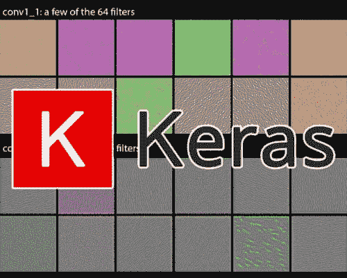
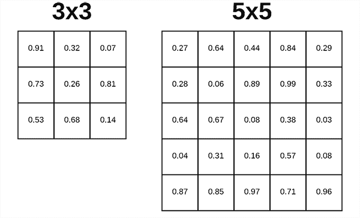
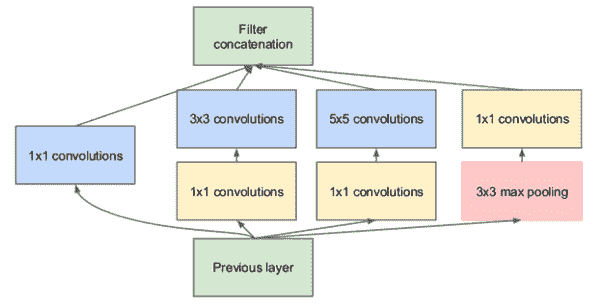
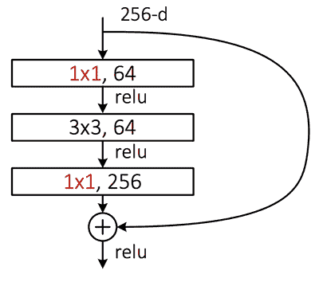
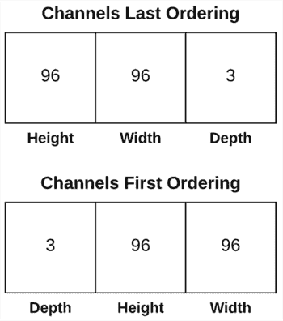
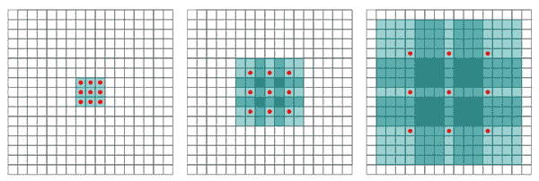
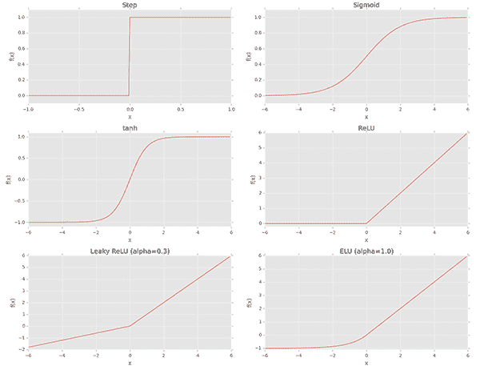
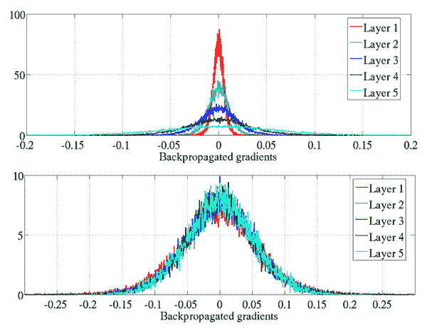
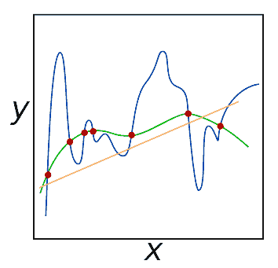
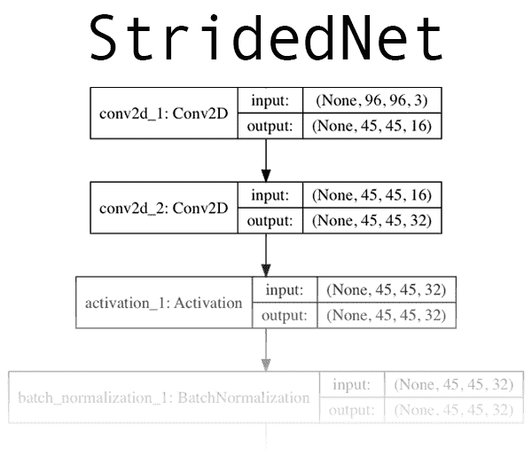

# Keras Conv2D 和卷积层

> 原文：<https://pyimagesearch.com/2018/12/31/keras-conv2d-and-convolutional-layers/>

[](https://pyimagesearch.com/wp-content/uploads/2018/12/keras_conv2d_header.jpg)

在今天的教程中，我们将讨论 Keras Conv2D 类，包括在训练自己的卷积神经网络(CNN)时需要调整的最重要的参数。接下来，我们将使用 Keras Conv2D 类实现一个简单的 CNN。然后我们将在 CALTECH-101 数据集上训练和评估这个 CNN。

今天这篇文章的灵感来自于 PyImageSearch 的读者 Danny。

丹尼问道:

> 嗨，Adrian，我在理解 Keras 的 Conv2D 类的参数时遇到了一些问题。
> 
> 哪些是重要的？
> 
> 哪些应该保留默认值？
> 
> 我对深度学习有点陌生，所以在创建自己的 CNN 时，我对如何选择参数值有点困惑。

Danny 提出了一个很好的问题 Keras 的 Conv2D 类有很多参数。如果你是计算机视觉和深度学习领域的新手，那么这个数字可能会有点令人难以招架。

**在今天的教程中，我将讨论 Keras Conv2D 类的每一个参数，**解释每一个参数，并举例说明何时何地需要设置特定值，使您能够:

1.  **快速确定*是否*需要对 Keras Conv2D 类使用特定参数**
2.  ***为该特定参数确定适当值***
3.  **有效训练**自己的卷积神经网络

总的来说，我的目标是帮助减少使用 Keras 的 Conv2D 类时的任何困惑、焦虑或挫折。阅读完本教程后，您将对 Keras Conv2D 参数有一个深入的了解。

**要了解更多关于 Keras Conv2D 类和卷积层的信息，*请继续阅读！***

## Keras Conv2D 和卷积层

***2020-06-03 更新:**此博文现已兼容 TensorFlow 2+!*

在本教程的第一部分，我们将讨论 Keras Conv2D 类的参数。

接下来，我们将利用 Conv2D 类来实现一个简单的卷积神经网络。

然后，我们将采用我们的 CNN 实现，然后在 CALTECH-101 数据集上训练它。

最后，我们将评估网络并检查其性能。

让我们开始吧！

### Keras Conv2D 类

Keras Conv2D 类构造函数具有以下签名:

```py
tensorflow.keras.layers.Conv2D(filters, kernel_size, strides=(1, 1),
  padding='valid', data_format=None, dilation_rate=(1, 1),
  activation=None, use_bias=True, kernel_initializer='glorot_uniform',
  bias_initializer='zeros', kernel_regularizer=None,
  bias_regularizer=None, activity_regularizer=None,
  kernel_constraint=None, bias_constraint=None)

```

看起来有点势不可挡，对吧？

你究竟应该如何正确地设置这些值呢？

不要担心——让我们分别检查这些参数，让你不仅清楚地了解*每个参数控制*什么，还清楚地了解*如何正确设置每个参数*。

#### 过滤

[](https://pyimagesearch.com/wp-content/uploads/2018/12/keras_conv2d_num_filters.png)

**Figure 1:** The Keras Conv2D parameter, `filters` determines the number of kernels to [convolve](https://pyimagesearch.com/2016/07/25/convolutions-with-opencv-and-python/) with the input volume. Each of these operations produces a 2D activation map.

第一个必需的 Conv2D 参数是卷积层将学习的`filters`的编号。

网络架构中较早的*层(即，更接近实际输入图像)学习*较少的*卷积滤波器，而网络中较深的*层(即，更接近输出预测)将学习*较多的*滤波器。

中间的 Conv2D 层将比早期的 Conv2D 层学习更多的滤波器，但比更靠近输出的层学习更少的滤波器。让我们来看一个例子:

```py
model.add(Conv2D(32, (3, 3), padding="same", activation="relu"))
model.add(MaxPooling2D(pool_size=(2, 2)))
...
model.add(Conv2D(64, (3, 3), padding="same", activation="relu"))
model.add(MaxPooling2D(pool_size=(2, 2)))
...
model.add(Conv2D(128, (3, 3), padding="same", activation="relu"))
model.add(MaxPooling2D(pool_size=(2, 2)))
...
model.add(Activation("softmax"))

```

在第 1 行的**上，我们总共学习了`32`个过滤器。然后使用最大池来减少输出体积的空间维度。**

然后我们学习**线 4** 上的`64`滤波器。同样，最大池用于减少空间维度。

最终的 Conv2D 层学习`128`滤波器。

请注意，随着我们的输出空间音量*减少*，我们学习的滤波器数量*增加*——这是设计 CNN 架构的常见做法，我建议您也这样做。至于选择合适的`filters`数，我几乎总是推荐使用 2 的幂作为值。

您可能需要根据(1)数据集的复杂性和(2)神经网络的深度来调整确切的值，但我建议从早期的*【32，64，128】*范围内的过滤器开始，增加到更深层的*【256，512，1024】*。

同样，这些值的确切范围可能因人而异，但开始时要减少*个过滤器，只在必要时增加数量。*

#### 内核大小

[](https://pyimagesearch.com/wp-content/uploads/2018/12/keras_conv2d_filter_size.png)

**Figure 2:** The Keras deep learning Conv2D parameter, `filter_size`, determines the dimensions of the kernel. Common dimensions include *1×1*, *3×3*, *5×5*, and *7×7* which can be passed as `(1, 1)`, `(3, 3)`, `(5, 5)`, or `(7, 7)` tuples.

您需要向 Keras Conv2D 类提供的第二个必需参数是`kernel_size`，它是一个 2 元组，指定 2D 卷积窗口的宽度和高度。

**`kernel_size`也必须是一个*奇*整数。**

`kernel_size`的典型值包括:`(1, 1)`、`(3, 3)`、`(5, 5)`、`(7, 7)`。很少看到内核大小大于 *7×7* 的。

那么，你什么时候使用它们呢？

如果您的输入图像大于 *128×128* ，您可以选择使用内核大小> 3 来帮助(1)学习更大的空间过滤器和(2)帮助减少体积大小。

其他网络，如 VGGNet、*exclusive*在整个网络中使用`(3, 3)`过滤器。

更高级的架构，如 Inception、ResNet 和 SqueezeNet，设计整个*微架构*，它们是网络内部的【模块】*，学习不同尺度的本地特征(即 *1×1* 、 *3×3* 和 *5×5* )，然后*组合*输出。*

一个很好的例子可以在下面的 Inception 模块中看到:

[](https://pyimagesearch.com/wp-content/uploads/2018/12/keras_conv2d_inception_module.png)

**Figure 3:** The Inception/GoogLeNet CNN architecture uses “micro-architecture” modules inside the network that learn local features at different scales (`filter_size`) and then *combine* the outputs.

ResNet 架构中的残差模块使用 *1×1* 和 *3×3* 过滤器作为一种降维形式，这有助于保持网络中的参数数量较少(或在给定网络深度的情况下尽可能少):

[](https://pyimagesearch.com/wp-content/uploads/2018/12/keras_conv2d_resnet_module.png)

**Figure 4:** The ResNet “Residual module” uses 1×1 and 3×3 filters for dimensionality reduction. This helps keep the overall network smaller with fewer parameters.

**那么，你应该如何选择你的`filter_size`？**

首先，检查您的输入图像—它是否大于 *128×128* ？

如果是这样，考虑使用一个 *5×5* 或 *7×7* 内核来学习更大的特性，然后快速降低空间维度——然后开始使用 *3×3* 内核:

```py
model.add(Conv2D(32, (7, 7), activation="relu"))
...
model.add(Conv2D(32, (3, 3), activation="relu"))

```

如果你的图像小于 *128×128* ，你可能要考虑坚持使用严格的 *1×1* 和 *3×3* 滤镜。

如果您打算使用 ResNet 或类似 Inception 的模块，您将希望手工实现相关的模块和架构。涵盖如何实现这些模块超出了本教程的范围，但如果你有兴趣了解更多关于它们的知识(包括如何手工编码)，请参考我的书， [*用 Python*](https://pyimagesearch.com/deep-learning-computer-vision-python-book/) 进行计算机视觉的深度学习。

#### 大步

`strides`参数是一个二元整数组，指定沿着输入体积的 *x* 和 *y* 轴的卷积的“步长”。

`strides`值默认为`(1, 1)`，这意味着:

1.  给定的卷积滤波器被应用于输入体积的当前位置
2.  滤波器向右移动 1 个像素，再次将滤波器应用于输入体积
3.  这个过程一直执行到我们到达体积的最右边界，在这里我们将滤波器向下移动一个像素，然后再从最左边开始

通常情况下，`strides`参数会保留默认的`(1, 1)`值；但是，您可能偶尔会将它增加到`(2, 2)`，以帮助减少输出音量的大小(因为滤波器的步长更大)。

通常情况下，您会看到以 *2×2* 的步幅取代最大池:

```py
model.add(Conv2D(128, (3, 3), strides=(1, 1), activation="relu"))
model.add(Conv2D(128, (3, 3), strides=(1, 1), activation="relu"))
model.add(Conv2D(128, (3, 3), strides=(2, 2), activation="relu"))

```

在这里，我们可以看到前两个 Conv2D 层的跨距为 1×1。最终的 Conv2D 层；但是，取代了最大池层，而是通过步长卷积减少了输出体积的空间维度。

2014 年，Springenber 等人发表了一篇题为 [*力求简单:全卷积网*](https://arxiv.org/abs/1412.6806) 的论文，该论文证明了在某些情况下，用步长卷积替换池层可以提高准确性。

受欢迎的 CNN ResNet 已经接受了这一发现——如果你曾经查看过 ResNet 实现(或自己实现)的源代码，你会看到 ResNet 基于步长卷积而不是最大池来减少剩余模块之间的空间维度。

#### 填料


**Figure 5:** A *3×3* kernel applied to an image with padding. The Keras Conv2D padding parameter accepts either `"valid"` (no padding) or `"same"` (padding + preserving spatial dimensions). This animation was contributed to StackOverflow ([source](https://stackoverflow.com/questions/52067833/how-to-plot-an-animated-matrix-in-matplotlib)).

Keras Conv2D 类的`padding`参数可以取两个值之一:`valid`或`same`。

使用`valid`参数，输入体积不是零填充的，空间尺寸允许通过卷积的自然应用来减少。

下面的例子自然会减少我们体积的空间维度:

```py
model.add(Conv2D(32, (3, 3), padding="valid"))

```

***注:**如果你需要帮助理解应用卷积时空间维度如何以及为什么会自然减少，请参见本教程的[卷积基础知识](https://pyimagesearch.com/2016/07/25/convolutions-with-opencv-and-python/)。*

如果您希望保留体积的空间维度，以使输出体积大小与输入体积大小相匹配，那么您可能希望为`padding`提供一个值`same`:

```py
model.add(Conv2D(32, (3, 3), padding="same"))

```

虽然默认的 Keras Conv2D 值为`valid`，但我通常会将网络中大多数层的值设置为`same`，然后通过以下任一方式减小我的体积的空间维度:

1.  最大池化
2.  步进卷积

我建议您也使用类似的方法填充 Keras Conv2D 类。

#### 数据格式

[](https://pyimagesearch.com/wp-content/uploads/2018/12/keras_conv2d_channel_ordering.png)

**Figure 6:** Keras, as a high-level framework, supports multiple deep learning backends. Thus, it includes support for both “channels last” and “channels first” channel ordering.

Conv2D 类中的数据格式值可以是`channels_last`或`channels_first`:

*   Keras 的 TensorFlow 后端使用上次订购的渠道。
*   Theano 后端使用通道优先排序。

出于两个原因，您通常不应该像 Keras 那样接触这个值:

1.  您很可能使用 TensorFlow 后端来访问 Keras
2.  如果没有，您可能已经更新了您的`~/.keras/keras.json`配置文件来设置您的后端和相关的通道排序

我的建议是永远不要在 Conv2D 类中显式设置`data_format`，除非你有非常好的理由这样做。

#### 膨胀率

[](https://pyimagesearch.com/wp-content/uploads/2018/12/keras_conv2d_dilation_rate.png)

**Figure 7:** The Keras deep learning Conv2D parameter, `dilation_rate`, accepts a 2-tuple of integers to control dilated convolution ([source](http://www.erogol.com/dilated-convolution/)).

Conv2D 类的`dilation_rate`参数是一个 2 元组整数，控制膨胀卷积的膨胀率。扩张卷积是一种基本卷积，仅应用于具有确定间隙的输入体积，如上面的图 7 所示。

在以下情况下，可以使用扩张卷积:

1.  您正在处理更高分辨率的图像，但精细的细节仍然很重要
2.  您正在构建一个参数更少的网络

#### 激活

[](https://pyimagesearch.com/wp-content/uploads/2018/12/keras_conv2d_activation_functions.png)

**Figure 8:** Keras provides a number of common activation functions. The `activation` parameter to Conv2D is a matter of convenience and allows the activation function for use after convolution to be specified.

Conv2D 类的`activation`参数只是一个方便的参数，允许您提供一个字符串，指定在执行卷积后要应用*的激活函数的名称。*

在以下示例中，我们执行卷积，然后应用 ReLU 激活函数:

```py
model.add(Conv2D(32, (3, 3), activation="relu"))

```

上面的代码相当于:

```py
model.add(Conv2D(32, (3, 3)))
model.add(Activation("relu"))

```

我的建议？

使用`activation`参数，如果它有助于保持您的代码更干净——这完全取决于您，不会对您的卷积神经网络的性能产生影响。

#### 使用偏差

Conv2D 类的`use_bias`参数控制是否将偏置向量添加到卷积层。

通常情况下，您会希望将该值保留为`True`，尽管 ResNet 的一些实现将会省略 bias 参数。

我建议保持偏见，除非你有充分的理由不这样做。

#### 内核初始化器和偏差初始化器

[](https://pyimagesearch.com/wp-content/uploads/2018/12/keras_conv2d_initializers.png)

**Figure 9:** Keras offers a number of initializers for the Conv2D class. Initializers can be used to help train deeper neural networks more effectively.

在实际训练网络之前，`kernel_initializer`控制用于初始化 Conv2D 类中所有值的初始化方法。

类似地，`bias_initializer`控制训练开始前如何初始化偏置向量。

初始化器的完整列表可以在 Keras 文档中找到；然而，这里是我的建议:

1.  不要管`bias_initialization`——默认情况下，它会用零填充(你很少需要改变偏置初始化方法。
2.  `kernel_initializer`默认为`glorot_uniform`， [Xavier Glorot 统一初始化](http://proceedings.mlr.press/v9/glorot10a/glorot10a.pdf)方法，这对于大多数任务来说非常好；然而，对于更深层次的神经网络，您可能希望使用`he_normal` ( [和何等人的初始化](https://arxiv.org/abs/1502.01852))，当您的网络有大量参数(即 VGGNet)时，它尤其适用。

在我实现的绝大多数 CNN 中，我要么使用`glorot_uniform`要么使用`he_normal`——我建议你也这样做，除非你有特定的理由使用不同的初始化器。

#### 核正则化、偏差正则化和活动正则化

[](https://pyimagesearch.com/wp-content/uploads/2018/12/keras_conv2d_regularization.png)

**Figure 10:** Regularization hyperparameters should be adjusted especially when working with large datasets and really deep networks. The kernel_regularizer parameter in particular is one that I adjust often to reduce overfitting and increase the ability for a model to generalize to unfamiliar images.

`kernel_regularizer`、`bias_regularizer`和`activity_regularizer`控制应用于 Conv2D 层的正则化方法的*类型*和*数量*。

应用正规化有助于您:

1.  *减少*过度拟合的影响
2.  *提高*你的模型的概括能力

**当处理大型数据集和深度神经网络时，应用正则化通常是必须的*。***

 *通常情况下，您会遇到应用 L1 或 L2 正则化的情况，如果我发现过度拟合的迹象，我会在我的网络上使用 L2 正则化:

```py
from tensorflow.keras.regularizers import l2
...
model.add(Conv2D(32, (3, 3), activation="relu"),
	kernel_regularizer=l2(0.0005))

```

您应用的正则化量是一个超参数，您需要针对自己的数据集进行调整，但我发现 0.0001-0.001 的值是一个很好的开始范围。

**我建议不要管你的偏差正则化器** —正则化偏差通常对减少过度拟合影响很小。

**我还建议将`activity_regularizer`保留为默认值(即没有活动调整)。**

虽然权重正则化方法对权重本身 *f(W)* 进行操作，其中 *f* 是激活函数，而 *W* 是权重，但是活动正则化方法对*输出*、 *f(O)* 进行操作，其中 *O* 是层的输出。

除非有非常特殊的原因，否则最好不要使用这个参数。

#### 内核约束和偏差约束

Keras Conv2D 类的最后两个参数是`kernel_constraint`和`bias_constraint`。

这些参数允许您对 Conv2D 层施加约束，包括非负性、单位归一化和最小-最大归一化。

您可以在 [Keras 文档](https://keras.io/constraints/)中看到支持的约束的完整列表。

同样，我建议不要考虑内核约束和偏差约束，除非您有特定的理由对 Conv2D 层施加约束。

### 配置您的开发环境

要针对本教程配置您的系统，我首先建议您遵循以下任一教程:

*   [*如何在 Ubuntu 上安装 tensor flow 2.0*](https://pyimagesearch.com/2019/12/09/how-to-install-tensorflow-2-0-on-ubuntu/)
*   [*如何在 macOS 上安装 tensor flow 2.0*](https://pyimagesearch.com/2019/12/09/how-to-install-tensorflow-2-0-on-macos/)

这两个教程都将帮助您在一个方便的 Python 虚拟环境中，用这篇博文所需的所有软件来配置您的系统。

请注意 [PyImageSearch 不推荐也不支持 CV/DL 项目](https://pyimagesearch.com/faqs/single-faq/can-you-help-me-do-___-on-windows/)的窗口。

### 加州理工学院-101(子集)数据集

[](https://pyimagesearch.com/wp-content/uploads/2018/12/keras_conv2d_caltech101.jpg)

**Figure 11:** The CALTECH-101 dataset consists of 101 object categories with 40-80 images per class. The dataset for today’s blog post example consists of just 4 of those classes: faces, leopards, motorbikes, and airplanes ([source](http://www.robots.ox.ac.uk/~vgg/research/caltech/index.html)).

CALTECH-101 数据集是 101 个对象类别的数据集，每个类别有 40 到 800 幅图像。

大多数图像每类大约有 50 个图像。

数据集的目标是训练一个能够预测目标类的模型。

在神经网络和深度学习重新兴起之前，最先进的准确率只有约 65%。

然而，通过使用卷积神经网络，有可能实现 90%以上的准确性(如何等人在 2014 年的论文中所展示的， [*深度卷积网络中的空间金字塔池用于视觉识别*](https://arxiv.org/abs/1406.4729v1) )。

今天，我们将实现一个简单而有效的 CNN，它能够在数据集的 4 类子集上实现 96%以上的准确率:

*   **面孔:** 436 张图片
*   **豹子:** 201 张图片
*   **摩托车:** 799 张图片
*   **飞机:** 801 张图片

我们使用数据集子集的原因是，即使您没有 GPU，您也可以轻松地按照这个示例从头开始训练网络。

同样，本教程的目的是*而不是*提供 CALTECH-101 的最新结果，而是教你如何使用 Keras 的 Conv2D 类实现和训练自定义卷积神经网络的基础知识。

### 下载数据集和源代码

有兴趣跟随今天的教程吗？如果是这样，您需要下载两者:

1.  这篇帖子的源代码(使用了 ***【下载】*** 部分的帖子)
2.  加州理工学院-101 数据集

下载完。源代码的 zip 文件，将其解压缩，然后将目录更改为`keras-conv2d-example`目录:

```py
$ cd /path/to/keras-conv2d-example

```

从那里，使用下面的`wget`命令下载并解压缩 CALTECH-101 数据集:

```py
$ wget http://www.vision.caltech.edu/Image_Datasets/Caltech101/101_ObjectCategories.tar.gz
$ tar -zxvf 101_ObjectCategories.tar.gz

```

现在我们已经下载了代码和数据集，我们可以继续检查项目结构。

### 项目结构

要查看我们的项目是如何组织的，只需使用`tree`命令:

```py
$ tree --dirsfirst -L 2 -v
.
├── 101_ObjectCategories
...
│   ├── Faces [436 entries]
...
│   ├── Leopards [201 entries]
│   ├── Motorbikes [799 entries]
...
│   ├── airplanes [801 entries]
...
├── pyimagesearch
│   ├── __init__.py
│   └── stridednet.py
├── 101_ObjectCategories.tar.gz
├── train.py
└── plot.png

104 directories, 5 files

```

第一个目录`101_ObjectCategories/`是我们在上一节中提取的数据集。它包含 102 个文件夹，所以我为今天的博客文章删除了我们不关心的行。剩下的是前面讨论过的四个对象类别的子集。

`pyimagesearch/`模块不是 pip 可安装的。你必须使用 ***【下载】*** 来抓取文件。在模块内部，您会发现包含 StridedNet 类的`stridendet.py`。

除了`stridednet.py`，我们还将回顾根文件夹中的`train.py`。我们的训练脚本将利用 StridedNet 和我们的小型数据集来训练一个用于示例目的的模型。

训练脚本将生成一个训练历史图`plot.png`。

### Keras Conv2D 示例

[](https://pyimagesearch.com/wp-content/uploads/2018/12/keras_conv2d_stridednet_arch_full.png)

**Figure 12:** A deep learning CNN dubbed “StridedNet” serves as the example for today’s blog post about Keras Conv2D parameters. [Click](https://pyimagesearch.com/wp-content/uploads/2018/12/keras_conv2d_stridednet_arch_full.png) to expand.

现在，我们已经了解了(Keras Conv2D 类的工作方式，以及(2)我们将在其上训练网络的数据集，让我们继续实现我们将训练的卷积神经网络。

我们今天要用的 CNN，“StridedNet”，是我为了本教程的目的而编造的。

**StridedNet 有三个重要特征:**

1.  它使用步长卷积而不是池化操作来减少卷大小
2.  第一个 CONV 层使用 *7×7* 滤波器，但是网络中的所有其他层使用 3×3 滤波器(类似于 VGG)
3.  使用 MSRA/何等人的正态分布算法来初始化网络中的所有权重

现在让我们继续实现 StridedNet。

打开一个新文件，将其命名为`stridednet.py`，并插入以下代码:

```py
# import the necessary packages
from tensorflow.keras.models import Sequential
from tensorflow.keras.layers import BatchNormalization
from tensorflow.keras.layers import Conv2D
from tensorflow.keras.layers import Activation
from tensorflow.keras.layers import Flatten
from tensorflow.keras.layers import Dropout
from tensorflow.keras.layers import Dense
from tensorflow.keras import backend as K

class StridedNet:
	@staticmethod
	def build(width, height, depth, classes, reg, init="he_normal"):
		# initialize the model along with the input shape to be
		# "channels last" and the channels dimension itself
		model = Sequential()
		inputShape = (height, width, depth)
		chanDim = -1

		# if we are using "channels first", update the input shape
		# and channels dimension
		if K.image_data_format() == "channels_first":
			inputShape = (depth, height, width)
			chanDim = 1

```

我们所有的 Keras 模块都是在**线 2-9** 即`Conv2D`导入的。

我们的`StridedNet`类是在**行 11** 上用**行 13** 上的单个`build`方法定义的。

`build`方法接受六个参数:

*   `width`:以像素为单位的图像宽度。
*   `height`:以像素为单位的图像高度。
*   `depth`:图像的通道数。
*   `classes`:模型需要预测的类别数。
*   `reg`:正则化方法。
*   `init`:内核初始化器。

`width`、`height`和`depth`参数影响输入体积形状。

对于`"channels_last"`排序，输入形状在`depth`最后的**行 17** 指定。

我们可以使用 Keras 后端来检查`image_data_format`，看看我们是否需要适应`"channels_first"`订购(**第 22-24 行**)。

让我们看看如何构建前三个 CONV 层:

```py
		# our first CONV layer will learn a total of 16 filters, each
		# Of which are 7x7 -- we'll then apply 2x2 strides to reduce
		# the spatial dimensions of the volume
		model.add(Conv2D(16, (7, 7), strides=(2, 2), padding="valid",
			kernel_initializer=init, kernel_regularizer=reg,
			input_shape=inputShape))

		# here we stack two CONV layers on top of each other where
		# each layerswill learn a total of 32 (3x3) filters
		model.add(Conv2D(32, (3, 3), padding="same",
			kernel_initializer=init, kernel_regularizer=reg))
		model.add(Activation("relu"))
		model.add(BatchNormalization(axis=chanDim))
		model.add(Conv2D(32, (3, 3), strides=(2, 2), padding="same",
			kernel_initializer=init, kernel_regularizer=reg))
		model.add(Activation("relu"))
		model.add(BatchNormalization(axis=chanDim))
		model.add(Dropout(0.25))

```

每个`Conv2D`与`model.add`堆叠在网络上。

注意，对于第一个`Conv2D`层，我们已经明确指定了我们的`inputShape`,这样 CNN 架构就有了开始和构建的地方。然后，从这里开始，每次调用`model.add`时，前一层就作为下一层的输入。

考虑到前面讨论过的`Conv2D`的参数，你会注意到我们正在使用步长卷积来减少空间维度，而不是合并操作。

应用 ReLU 激活(参见**图 8** )以及批量标准化和丢弃。

我几乎总是推荐批处理规范化，因为它有助于稳定训练并使超参数的调整更容易。也就是说，它可以让你的训练时间增加两倍或三倍。明智地使用它。

辍学的目的是帮助你的网络一般化，而不是过度拟合。来自当前层的*的神经元，以概率 *p* ，将随机断开与下一层*的神经元的连接，因此网络必须依赖现有的连接。我强烈建议利用辍学。**

让我们看看 StridedNet 的更多层:

```py
		# stack two more CONV layers, keeping the size of each filter
		# as 3x3 but increasing to 64 total learned filters
		model.add(Conv2D(64, (3, 3), padding="same",
			kernel_initializer=init, kernel_regularizer=reg))
		model.add(Activation("relu"))
		model.add(BatchNormalization(axis=chanDim))
		model.add(Conv2D(64, (3, 3), strides=(2, 2), padding="same",
			kernel_initializer=init, kernel_regularizer=reg))
		model.add(Activation("relu"))
		model.add(BatchNormalization(axis=chanDim))
		model.add(Dropout(0.25))

		# increase the number of filters again, this time to 128
		model.add(Conv2D(128, (3, 3), padding="same",
			kernel_initializer=init, kernel_regularizer=reg))
		model.add(Activation("relu"))
		model.add(BatchNormalization(axis=chanDim))
		model.add(Conv2D(128, (3, 3), strides=(2, 2), padding="same",
			kernel_initializer=init, kernel_regularizer=reg))
		model.add(Activation("relu"))
		model.add(BatchNormalization(axis=chanDim))
		model.add(Dropout(0.25))

```

网络越深入，我们学到的过滤器就越多。

在大多数网络的末端，我们会添加一个全连接层:

```py
		# fully-connected layer
		model.add(Flatten())
		model.add(Dense(512, kernel_initializer=init))
		model.add(Activation("relu"))
		model.add(BatchNormalization())
		model.add(Dropout(0.5))

		# softmax classifier
		model.add(Dense(classes))
		model.add(Activation("softmax"))

		# return the constructed network architecture
		return model

```

具有`512`节点的单个全连接层被附加到 CNN。

最后，一个`"softmax"`分类器被添加到网络中——这一层的输出是预测值本身。

那是一个包裹。

正如您所看到的，一旦您知道了参数的含义，Keras 的语法就非常简单了(`Conv2D`可能有相当多的参数)。

让我们来学习如何用一些数据写一个脚本来训练 StridedNet！

### 实施培训脚本

现在我们已经实现了我们的 CNN 架构，让我们创建用于训练网络的驱动程序脚本。

打开`train.py`文件并插入以下代码:

```py
# set the matplotlib backend so figures can be saved in the background
import matplotlib
matplotlib.use("Agg")

# import the necessary packages
from pyimagesearch.stridednet import StridedNet
from sklearn.preprocessing import LabelBinarizer
from sklearn.model_selection import train_test_split
from sklearn.metrics import classification_report
from tensorflow.keras.preprocessing.image import ImageDataGenerator
from tensorflow.keras.optimizers import Adam
from tensorflow.keras.regularizers import l2
from imutils import paths
import matplotlib.pyplot as plt
import numpy as np
import argparse
import cv2
import os

```

我们在**线 2-18** 导入我们的模块和包。注意，我们没有在任何地方导入`Conv2D`。我们的 CNN 实现包含在`stridednet.py`中，我们的`StridedNet`导入处理它(**行 6** )。

我们的`matplotlib`后端设置在**行 3**——这是必要的，这样我们可以将我们的绘图保存为图像文件，而不是在 GUI 中查看。

我们从第 7-9 行的**上的`sklearn`导入功能:**

*   `LabelBinarizer`:对我们的类标签进行“一次性”编码。
*   用于分割我们的数据，这样我们就有了训练集和评估集。
*   我们将用它来打印评估的统计数据。

从`keras`开始，我们将使用:

*   `ImageDataGenerator`:用于数据扩充。关于 Keras 数据生成器的更多信息，请参见上周的博客文章。
*   `Adam`:SGD 的替代优化器。
*   我们将使用的正则化子。向上滚动阅读正则项。应用正则化可以减少过度拟合，有助于泛化。

我的 [imutils](https://github.com/jrosebr1/imutils) `paths`模块将用于获取数据集中图像的路径。

我们将使用`argparse`在运行时处理命令行参数，OpenCV ( `cv2`)将用于从数据集中加载和预处理图像。

现在让我们继续[解析命令行参数](https://pyimagesearch.com/2018/03/12/python-argparse-command-line-arguments/):

```py
# construct the argument parser and parse the arguments
ap = argparse.ArgumentParser()
ap.add_argument("-d", "--dataset", required=True,
	help="path to input dataset")
ap.add_argument("-e", "--epochs", type=int, default=50,
	help="# of epochs to train our network for")
ap.add_argument("-p", "--plot", type=str, default="plot.png",
	help="path to output loss/accuracy plot")
args = vars(ap.parse_args())

```

我们的脚本可以接受三个命令行参数:

*   `--dataset`:输入数据集的路径。
*   `--epochs`:训练的历元数。到`default`，我们将为`50`时代而训练。
*   `--plot`:我们的损失/精度图将被输出到磁盘。此参数包含文件路径。默认就是简单的`"plot.png"`。

让我们准备加载数据集:

```py
# initialize the set of labels from the CALTECH-101 dataset we are
# going to train our network on
LABELS = set(["Faces", "Leopards", "Motorbikes", "airplanes"])

# grab the list of images in our dataset directory, then initialize
# the list of data (i.e., images) and class images
print("[INFO] loading images...")
imagePaths = list(paths.list_images(args["dataset"]))
data = []
labels = []

```

在实际加载数据集之前，我们将继续初始化:

*   我们将用于培训的标签。
*   `imagePaths`:数据集目录的图像路径列表。我们将很快根据从文件路径中解析的类标签过滤这些文件。
*   一个保存我们的图像的列表，我们的网络将被训练。
*   `labels`:一个列表，用于保存与数据相对应的类标签。

让我们填充我们的`data`和`labels`列表:

```py
# loop over the image paths
for imagePath in imagePaths:
	# extract the class label from the filename
	label = imagePath.split(os.path.sep)[-2]

	# if the label of the current image is not part of of the labels
	# are interested in, then ignore the image
	if label not in LABELS:
		continue

	# load the image and resize it to be a fixed 96x96 pixels,
	# ignoring aspect ratio
	image = cv2.imread(imagePath)
	image = cv2.resize(image, (96, 96))

	# update the data and labels lists, respectively
	data.append(image)
	labels.append(label)

```

从第 42 行的**开始，我们将循环所有的`imagePaths`。在循环中，我们:**

*   从路径中提取`label`(**行 44** )。
*   仅过滤`LABELS`集合中的类(**第 48 行和第 49 行**)。这两行使我们跳过任何分别属于面孔、豹子、摩托车或飞机类的`label` *而不是*，如**行 32** 所定义。
*   载和`resize`我们的`image`(**53 线和 54 线**)。
*   最后，将`image`和`label`添加到它们各自的列表中(**行 57 和 58** )。

下一个模块中有四个动作:

```py
# convert the data into a NumPy array, then preprocess it by scaling
# all pixel intensities to the range [0, 1]
data = np.array(data, dtype="float") / 255.0

# perform one-hot encoding on the labels
lb = LabelBinarizer()
labels = lb.fit_transform(labels)

# partition the data into training and testing splits using 75% of
# the data for training and the remaining 25% for testing
(trainX, testX, trainY, testY) = train_test_split(data, labels,
	test_size=0.25, stratify=labels, random_state=42)

# construct the training image generator for data augmentation
aug = ImageDataGenerator(rotation_range=20, zoom_range=0.15,
	width_shift_range=0.2, height_shift_range=0.2, shear_range=0.15,
	horizontal_flip=True, fill_mode="nearest")

```

这些行动包括:

*   将`data`转换成一个 NumPy 数组，每个`image`缩放到范围*【0，1】*(**第 62 行**)。
*   用我们的`LabelBinarizer` ( **第 65 行和第 66 行**)将我们的`labels`二进制化为“一热编码”。这意味着我们的`labels`现在用数字表示，而“一个热点”的例子可能是:
    *   `[0, 0, 0, 1]`为“飞机”
    *   `[0, 1, 0, 0]`为“豹子”
    *   等等。
*   将我们的`data`分成培训和测试(**第 70 行和第 71 行**)。
*   初始化我们的`ImageDataGenerator`进行数据扩充(**第 74-76 行**)。你可以[在这里](https://pyimagesearch.com/2018/12/24/how-to-use-keras-fit-and-fit_generator-a-hands-on-tutorial/)了解更多。

现在我们准备编写代码来实际训练我们的模型:

```py
# initialize the optimizer and model
print("[INFO] compiling model...")
opt = Adam(lr=1e-4, decay=1e-4 / args["epochs"])
model = StridedNet.build(width=96, height=96, depth=3,
	classes=len(lb.classes_), reg=l2(0.0005))
model.compile(loss="categorical_crossentropy", optimizer=opt,
	metrics=["accuracy"])

# train the network
print("[INFO] training network for {} epochs...".format(
	args["epochs"]))
H = model.fit(x=aug.flow(trainX, trainY, batch_size=32),
	validation_data=(testX, testY), steps_per_epoch=len(trainX) // 32,
	epochs=args["epochs"])

```

***2020-06-03 更新:**以前，TensorFlow/Keras 需要使用一种叫做`.fit_generator`的方法来完成数据扩充。现在，`.fit`方法也可以处理数据扩充，使代码更加一致。这也适用于从`.predict_generator`到`.predict`的迁移。请务必查看我关于 [fit 和 fit 生成器](https://pyimagesearch.com/2018/12/24/how-to-use-keras-fit-and-fit_generator-a-hands-on-tutorial/)以及[数据扩充](https://pyimagesearch.com/2019/07/08/keras-imagedatagenerator-and-data-augmentation/)的文章。*

**第 80-84 行**准备我们的`StridedNet` `model`，用`Adam`优化器和学习率衰减、我们指定的输入形状、类的数量和`l2`正则化来构建它。

从那里开始，在**第 89-91 行**我们将使我们的模型符合数据。在这种情况下，“fit”意味着“train”，`.fit`意味着我们正在使用我们的[数据增强图像数据生成器](https://pyimagesearch.com/2018/12/24/how-to-use-keras-fit-and-fit_generator-a-hands-on-tutorial/)。

为了评估我们的模型，我们将使用`testX`数据并打印一个`classification_report`:

```py
# evaluate the network
print("[INFO] evaluating network...")
predictions = model.predict(x=testX, batch_size=32)
print(classification_report(testY.argmax(axis=1),
	predictions.argmax(axis=1), target_names=lb.classes_))

```

***2020-06-03 更新:**每 TensorFlow 2.0+，我们不再使用`.predict_generator`方法；它被替换为`.predict`，并具有相同的函数签名(即，第一个参数可以是 Python 生成器对象)。*

最后，我们将绘制我们的准确度/损失训练历史，并将其保存到磁盘:

```py
# plot the training loss and accuracy
N = args["epochs"]
plt.style.use("ggplot")
plt.figure()
plt.plot(np.arange(0, N), H.history["loss"], label="train_loss")
plt.plot(np.arange(0, N), H.history["val_loss"], label="val_loss")
plt.plot(np.arange(0, N), H.history["accuracy"], label="train_acc")
plt.plot(np.arange(0, N), H.history["val_accuracy"], label="val_acc")
plt.title("Training Loss and Accuracy on Dataset")
plt.xlabel("Epoch #")
plt.ylabel("Loss/Accuracy")
plt.legend(loc="lower left")
plt.savefig(args["plot"])

```

***2020-06-03 更新:**为了使该绘图片段与 TensorFlow 2+兼容，更新了`H.history`字典键，以完全拼出“精度”而没有“acc”(即`H.history["val_accuracy"]`和`H.history["accuracy"]`)。“val”没有拼成“validation”，这有点令人困惑；我们必须学会热爱 API 并与之共存，并永远记住这是一项正在进行的工作，世界各地的许多开发人员都为此做出了贡献。*

### 培训和评估我们的 Keras CNN

至此，我们已经准备好训练我们的网络了！

确保您已经使用今天教程的 ***【下载】*** 部分下载了源代码和示例图像。

在那里，打开一个终端，将目录切换到下载代码和 CALTECH-101 数据集的位置，然后执行以下命令:

```py
$ python train.py --dataset 101_ObjectCategories
[INFO] loading images...
[INFO] compiling model...
[INFO] training network for 50 epochs...
Epoch 1/50
52/52 [==============================] - 2s 45ms/step - loss: 2.0399 - accuracy: 0.4963 - val_loss: 1.4532 - val_accuracy: 0.5671
Epoch 2/50
52/52 [==============================] - 2s 38ms/step - loss: 1.5679 - accuracy: 0.6748 - val_loss: 1.9899 - val_accuracy: 0.4651
Epoch 3/50
52/52 [==============================] - 2s 39ms/step - loss: 1.3503 - accuracy: 0.7284 - val_loss: 2.0150 - val_accuracy: 0.5510
...
Epoch 48/50
52/52 [==============================] - 2s 38ms/step - loss: 0.5473 - accuracy: 0.9689 - val_loss: 0.5118 - val_accuracy: 0.9857
Epoch 49/50
52/52 [==============================] - 2s 38ms/step - loss: 0.5734 - accuracy: 0.9555 - val_loss: 0.7230 - val_accuracy: 0.9410
Epoch 50/50
52/52 [==============================] - 2s 38ms/step - loss: 0.5697 - accuracy: 0.9653 - val_loss: 0.6236 - val_accuracy: 0.9517
[INFO] evaluating network...
              precision    recall  f1-score   support

       Faces       0.97      0.99      0.98       109
    Leopards       1.00      0.76      0.86        50
  Motorbikes       0.91      1.00      0.95       200
   airplanes       0.98      0.93      0.95       200

    accuracy                           0.95       559
   macro avg       0.97      0.92      0.94       559
weighted avg       0.95      0.95      0.95       559

```

[](https://pyimagesearch.com/wp-content/uploads/2018/12/keras_conv2d_plot.png)

**Figure 13:** My accuracy/loss plot generated with Keras and matplotlib for training StridedNet, an example CNN to showcase Keras Conv2D parameters.

如您所见，我们的网络在测试集上以最小的过拟合获得了 ***~95%的准确率*** ！

## 摘要

在今天的教程中，我们讨论了卷积层和 Keras Conv2D 类。

你现在知道了:

*   什么是*最重要的参数是*到 Keras Conv2D 类(`filters`、`kernel_size`、`strides`、`padding`)
*   这些参数的合适值是什么
*   如何使用 Keras Conv2D 类创建自己的卷积神经网络
*   如何训练 CNN 并在一个示例数据集上对其进行评估

我希望本教程对理解 Keras 的 Conv2D 类的参数有所帮助——如果有，请在评论部分留下评论。

**如果您想下载这篇博文的源代码(并在未来教程在 PyImageSearch 上发布时得到通知)，*只需在下表中输入您的电子邮件地址。****