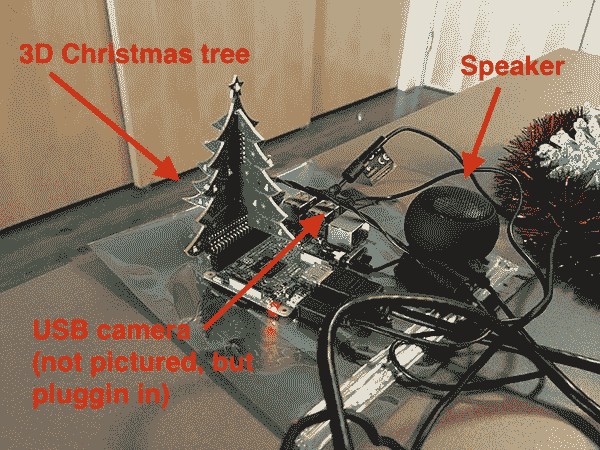
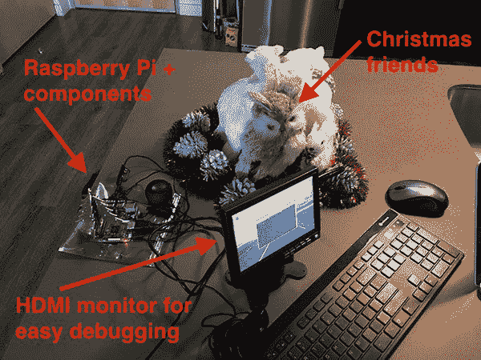
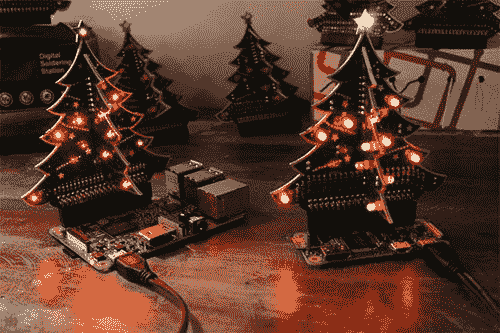
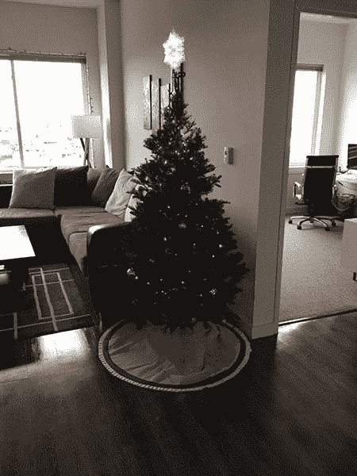

# Keras 和深度学习在树莓派上的应用

> 原文：<https://pyimagesearch.com/2017/12/18/keras-deep-learning-raspberry-pi/>


今天的博文是我曾经**写过的一篇 PyImageSearch 教程中*最有趣的*。**

 **它包含了我们过去几周讨论的所有内容，包括:

*   深度学习
*   覆盆子馅饼
*   3D 圣诞树
*   参考 HBO 的硅谷*“不是热狗”*探测器
*   我打扮成圣诞老人！

为了与圣诞节和假期保持一致，我将演示如何采用深度学习模型(用 Keras 训练)，然后将其部署到 Raspberry Pi。

但这不是任何机器学习模型…

这个图像分类器已经过*专门训练*来检测圣诞老人是否在我们的视频流中。

如果我们真的发现了圣诞老人…

好吧。我不会破坏这个惊喜(但它确实包括一棵 3D 圣诞树和一首欢快的曲子)。

享受教程。下载代码。用它来破解。

最重要的是，玩得开心！

## Keras 和深度学习在树莓派上的应用

今天的博客文章是一个使用 Keras 在 Raspberry Pi 上运行深度神经网络的完整指南。

我把这个项目设计成一个*而不是*检测器，给你一个实际的实现(并且一路上有一些乐趣)。

在这篇博文的第一部分，我们将讨论什么是*非圣诞老人*探测器(以防你不熟悉 [HBO 的硅谷*【非热狗】*探测器](https://medium.com/@timanglade/how-hbos-silicon-valley-built-not-hotdog-with-mobile-tensorflow-keras-react-native-ef03260747f3)，它已经发展了一批狂热的追随者)。

然后，我们将通过安装 TensorFlow、Keras 和许多其他先决条件来配置我们的 Raspberry Pi 以进行深度学习。

一旦我们的 Raspberry Pi 配置为深度学习，我们将继续构建 Python 脚本，该脚本可以:

1.  从磁盘加载我们的 Keras 模型
2.  访问我们的 Raspberry Pi 摄像头模块/USB 网络摄像头
3.  应用深度学习来检测圣诞老人是否在框架中
4.  如果检测到圣诞老人，访问我们的 GPIO 引脚并播放音乐

这些是我最喜欢在 PyImageSearch 上写的博文类型，因为它们整合了我们讨论过的一系列技术，包括:

*   [对树莓派的深度学习](https://pyimagesearch.com/2017/10/02/deep-learning-on-the-raspberry-pi-with-opencv/)
*   [访问您的 Raspberry Pi 摄像头模块/USB 网络摄像头](https://pyimagesearch.com/2016/01/04/unifying-picamera-and-cv2-videocapture-into-a-single-class-with-opencv/)
*   [在树莓 Pi 上使用 GPIO +计算机](https://pyimagesearch.com/2016/05/02/accessing-rpi-gpio-and-gpio-zero-with-opencv-python/)

我们开始吧！

### 什么是*非圣诞老人*探测器？

### 我需要什么硬件？

[](https://pyimagesearch.com/wp-content/uploads/2017/12/not_santa_detector_setup03.jpg)

**Figure 2:** The *Not Santa* detector setup includes the Raspberry Pi 3, speakers, 3D Christmas tree, and a webcam (not pictured). The Pi has LeNet implemented with Keras in a Python script in order to detect Santa.

为了准确地跟随*本教程(没有修改)，你需要:*

*   一个[树莓 Pi 3](http://amzn.to/2BDZZx0) (或者[树莓 Pi 3 入门套装](https://www.amazon.com/CanaKit-Raspberry-Complete-Starter-Kit/dp/B01C6Q2GSY/ref=as_li_ss_tl?s=pc&ie=UTF8&qid=1512999342&sr=1-4&keywords=raspberry+pi+3&linkCode=sl1&tag=trndingcom-20&linkId=155e01ef371aebb99db7cb8ea02c8a53)，我也强烈推荐)
*   一个 [Raspberry Pi 摄像头模块](http://a.co/at6gpLa)或者一个 USB 摄像头。出于本教程的目的，我选择了[罗技 C920](http://a.co/4xltunW) ，因为这是一款性价比很高的相机(与 Pi 相机上的短色带相比，USB 线给了你更多的工作空间)
*   树莓派的 [3D 圣诞树](https://thepihut.com/products/3d-xmas-tree-for-raspberry-pi)(由[瑞秋·瑞恩斯](https://twitter.com/rachelrayns/)设计)
*   一套扬声器——我推荐 Pi Hut 的[这些，Adafruit](https://thepihut.com/products/mini-portable-speaker-for-the-raspberry-pi?variant=897680793) 的[立体声扬声器，或者如果你正在寻找一些小的但仍然有冲击力的东西，你可以从亚马逊](https://www.adafruit.com/product/1363)得到[这个扬声器](http://amzn.to/2AF920r)

当然，你不需要所有这些零件。

如果你只有一个 Raspberry Pi +摄像头模块/USB 摄像头，你就一切就绪了(但你必须修改代码，以便它不会试图访问 GPIO 引脚或通过扬声器播放音乐)。

你的设置看起来应该和我在上面的图 2 中的设置相似，我已经连接了我的扬声器、3D 圣诞树和网络摄像头(因为它不在摄像头下，所以没有显示)。

我还建议连接一个 HDMI 显示器+键盘来测试和调试你的脚本:

[](https://pyimagesearch.com/wp-content/uploads/2017/12/not_santa_detector_setup01.jpg)

**Figure 3:** My deep learning setup includes the Raspberry Pi and components along with a keyboard, mouse, and small HDMI display. With this setup, we will surely catch Santa delivering presents in front of my tree.

在上图中，你可以看到我的树莓 Pi、HDMI、键盘和圣诞小动物朋友在我整理今天的教程时陪伴着我。

### 如何在树莓 Pi 上安装 TensorFlow 和 Keras？

[](https://pyimagesearch.com/wp-content/uploads/2017/12/not_santa_detector_dl_logos.jpg)

**Figure 4:** We’re going to use Keras with the TensorFlow backend on the Raspberry Pi to implement a deep learning Not Santa detector.

上周，我们学习了如何使用 Keras 训练一个卷积神经网络来确定圣诞老人是否在输入图像中。

今天，我们将把预先训练好的模型部署到 Raspberry Pi 中。

正如我之前提到的，树莓派不适合训练神经网络(除了“玩具”的例子)。然而，树莓 Pi 可以用来*部署*一个神经网络[，一旦它已经被训练好](https://pyimagesearch.com/2017/12/11/image-classification-with-keras-and-deep-learning/)(当然，前提是该模型能够适合足够小的内存占用)。

我假设你已经在你的 Raspberry Pi 上安装了 OpenCV。

如果你还没有在你的 Raspberry Pi 上安装 OpenCV，从使用本教程开始吧，在本教程中，我演示了如何优化你的 Raspberry Pi + OpenCV 安装速度(导致 30%以上的性能提升)。

***注意:**本指南不适用于 Python 3 — **你需要使用 Python 2.7** 。我将在本节稍后解释原因。现在花点时间用 Python 2.7 和 OpenCV 绑定来配置您的 Raspberry Pi。在 [Raspberry Pi + OpenCV 安装指南](https://pyimagesearch.com/2017/10/09/optimizing-opencv-on-the-raspberry-pi/)的第 4 步中，确保使用`-p python2`开关创建一个虚拟环境。*

从这里开始，我建议增加 Pi 上的交换空间。增加交换空间将使您能够使用 Raspberry Pi SD 卡获得额外的内存(当试图在内存有限的 Raspberry Pi 上编译和安装大型库时，这是一个关键步骤)。

要增加交换空间，打开`/etc/dphys-swapfile`，然后编辑`CONF_SWAPSIZE`变量:

```py
# set size to absolute value, leaving empty (default) then uses computed value
#   you most likely don't want this, unless you have a special disk situation
# CONF_SWAPSIZE=100
CONF_SWAPSIZE=1024

```

请注意，我将交换空间从 100MB 增加到了 1024MB。

从那里，重新启动交换服务:

```py
$ sudo /etc/init.d/dphys-swapfile stop
$ sudo /etc/init.d/dphys-swapfile start

```

***注意:**增加交换空间是烧坏你存储卡的一个好方法，所以**当你完成后，一定要恢复这个改变并重启交换服务**。你可以在这里阅读更多关于大尺寸损坏存储卡[的信息。](https://www.bitpi.co/2015/02/11/how-to-change-raspberry-pis-swapfile-size-on-rasbian/)*

既然您的交换空间已经增加了，让我们开始配置我们的开发环境。

首先，使用 **Python 2.7** 创建一个名为`not_santa`的 Python 虚拟环境(当我们使用 TensorFlow install 命令时，我将解释为什么使用 Python 2.7):

```py
$ mkvirtualenv not_santa -p python2

```

注意这里的`-p`开关是如何指向`python2`的，这表明 Python 2.7 将用于虚拟环境。

如果你不熟悉 Python 虚拟环境，不知道它们是如何工作的，也不知道我们为什么使用它们，请参考[这个指南来帮助你快速了解](https://pyimagesearch.com/2016/05/02/accessing-rpi-gpio-and-gpio-zero-with-opencv-python/)以及[这个来自 RealPython](https://realpython.com/blog/python/python-virtual-environments-a-primer/) 的优秀虚拟入门。

您还需要确保已经将您的`cv2.so`绑定符号链接到您的`not_santa`虚拟环境中(如果您还没有这样做):

```py
$ cd ~/.virtualenvs/not_santa/lib/python2.7/site-packages
$ ln -s /usr/local/lib/python2.7/site-packages/cv2.so cv2.so

```

同样，确保你已经用 **Python 2.7** 绑定编译了 OpenCV。您还需要仔细检查您的`cv2.so`文件的路径，以防您的安装路径与我的略有不同。

如果您编译了 Python 3 + OpenCV 绑定，创建了 sym-link，然后试图`import cv2`到您的 Python shell 中，您将得到一个令人困惑的回溯，说导入失败。

***重要提示:**对于接下来的几个 pip 命令，请确保您处于`not_santa`环境中(或者您选择的 Python 环境)，否则您将把这些包安装到您的 Raspberry Pi 的系统 Python 中。*

要进入环境，只需在 bash 提示符下使用`workon`命令:

```py
$ workon not_santa

```

从那里，您将在 bash 提示符的开头看到“`(not_santa)`”。

使用以下命令确保在`not_santa`环境中安装了 NumPy:

```py
$ pip install numpy

```

由于我们将访问这个项目的 GPIO 引脚，我们需要安装两个 [RPi。GPIO](https://pypi.python.org/pypi/RPi.GPIO) 和 [gpiozero](https://pypi.python.org/pypi/gpiozero) :

```py
$ sudo pip install RPi.GPIO gpiozero

```

**我们现在准备在您的树莓 Pi 上安装 TensorFlow。**

问题是没有一个官方的(谷歌发布的)张量流分布。

我们可以在树莓派上跟随从零开始编译 TensorFlow 的漫长、艰难、痛苦的过程

或者我们可以使用 Sam Abrahams 创建的预编译二进制文件(发布在 [GitHub](https://github.com/samjabrahams/tensorflow-on-raspberry-pi) )。

问题是只有两种预编译的 TensorFlow 二进制文件:

1.  一个用于 Python 2.7
2.  另一个用于 Python 3.4

Raspbian Stretch 发行版(在撰写本文时 Raspbian 操作系统的最新版本)随 Python 3.5 一起发布，因此我们有一个版本不匹配的问题。

为了避免 Python 3.4 和 Python 3.5 之间的任何问题，我决定继续安装 Python 2.7。

虽然我希望在本指南中使用 Python 3，但是安装过程会变得更加复杂(我可以轻松地写多篇关于在 Raspberry Pi 上安装 TensorFlow + Keras 的文章，但是由于安装不是本教程的主要重点，所以我决定让它更简单)。

让我们使用以下命令安装 TensorFlow for Python 2.7:

```py
$ wget https://github.com/samjabrahams/tensorflow-on-raspberry-pi/releases/download/v1.1.0/tensorflow-1.1.0-cp27-none-linux_armv7l.whl
$ pip install tensorflow-1.1.0-cp27-none-linux_armv7l.whl

```

***注意:**你需要展开上面的代码块来复制完整的 URL。我建议你在复制命令之前按下< >按钮。*

一旦 TensorFlow 编译并安装完毕(在我的 Raspberry Pi 上花了大约一个小时)，你就需要安装 HDF5 和 h5py。这些库将允许我们从磁盘加载预先训练好的模型:

```py
$ sudo apt-get install libhdf5-serial-dev
$ pip install h5py

```

我在没有运行`time`命令的情况下安装了 HDF5 + h5py，所以我不记得安装的确切时间了，但我相信大约是 30-45 分钟。

最后，让我们安装 Keras 和这个项目所需的其他先决条件:

```py
$ pip install pillow imutils
$ pip install scipy --no-cache-dir
$ pip install keras==2.1.5

```

特别是 SciPy 的安装需要几个小时，所以请确保让安装运行一整夜/在你工作的时候。

***很重要*** 你安装 Keras 2 . 1 . 5 版是为了兼容 TensorFlow 1.1.0。

为了测试您的配置，打开一个 Python shell(在`not_santa`环境中)并执行以下命令:

```py
$ workon not_santa
$ python
>>> import h5py
>>> from gpiozero import LEDBoard
>>> from gpiozero.tools import random_values
>>> import cv2
>>> import imutils
>>> import keras
Using TesnsorFlow backend.
>>> print("OpenCV version: {}".format(cv2.__version__))
'OpenCV version: 3.3.1'
>>> print("Keras version: {}".format(keras.__version__))
'Keras version: 2.1.5'
>>> exit()

```

如果一切按计划进行，您应该会看到使用 TensorFlow 后端导入的 Keras。

正如上面的输出所示，您还应该仔细检查您的 OpenCV 绑定(`cv2`)是否也可以被导入。

最后， ***不要忘记将您的交换空间*** 从 1024MB 减少到 100MB:

1.  开放`/etc/dphys-swapfile`。
2.  将`CONF_SWAPSIZE`重置为 100MB。
3.  重启交换服务(正如我们在本文前面讨论的)。

正如上面提到的，将你的交换空间重新设置为 100MB 对于存储卡的寿命是很重要的。如果跳过这一步，您可能会遇到内存损坏问题，并缩短卡的使用寿命。

### 在树莓 Pi 上运行 Keras +深度学习模型


**Figure 5:** Running a deep learning model on the Raspberry Pi using Keras and Python.

我们现在准备使用 Keras、TensorFlow 和 Raspberry Pi 编写我们的 *Not Santa* 检测器。

同样，我将假设你有和我一样的硬件设置(即，3D 圣诞树和扬声器)，所以如果你的设置不同，你需要破解下面的代码。

首先，打开一个新文件，将其命名为`not_santa_detector.py`，并插入以下代码:

```py
# import the necessary packages
from keras.preprocessing.image import img_to_array
from keras.models import load_model
from gpiozero import LEDBoard
from gpiozero.tools import random_values
from imutils.video import VideoStream
from threading import Thread
import numpy as np
import imutils
import time
import cv2
import os

```

**第 2-12 行**处理我们的进口，特别是:

*   `keras`用于预处理输入帧以进行分类，并从磁盘加载我们预先训练好的模型。
*   `gpiozero`用于访问 3D 圣诞树。
*   `imutils`用于访问视频流(无论是 Raspberry Pi 摄像头模块还是 USB)。
*   `threading`用于非阻塞操作，特别是当我们想要点亮圣诞树或播放音乐而不阻塞主线程执行时。

从那里，我们将定义一个函数来点亮我们的 3D 圣诞树:

```py
def light_tree(tree, sleep=5):
	# loop over all LEDs in the tree and randomly blink them with
	# varying intensities
	for led in tree:
		led.source_delay = 0.1
		led.source = random_values()

	# sleep for a bit to let the tree show its Christmas spirit for
	# santa clause
	time.sleep(sleep)

	# loop voer the LEDs again, this time turning them off
	for led in tree:
		led.source = None
		led.value = 0

```

我们的`light_tree`函数接受一个`tree`参数(假设是一个`LEDBoard`对象)。

首先，我们循环遍历`tree`中的所有 led，随机点亮每一个 led 来创造一个“闪烁”的效果(**第 17-19 行**)。

我们让灯开一段时间来营造节日气氛(**第 23 行**)，然后我们再次循环播放 led 灯，这一次关掉它们(**第 26-28 行**)。

打开 3D 圣诞树灯的示例如下所示:



**Figure 6:** The 3D Christmas tree for the Raspberry Pi. You can get yours from [Pi Hut](https://thepihut.com/products/3d-xmas-tree-for-raspberry-pi) (photo credit: Pi Hut).

我们的下一个函数处理检测到圣诞老人时播放的音乐:

```py
def play_christmas_music(p):
	# construct the command to play the music, then execute the
	# command
	command = "aplay -q {}".format(p)
	os.system(command)

```

在`play_christmas_music`函数中，我们对`aplay`命令进行系统调用，这使我们能够从命令行播放音乐文件。

使用`os.system`调用有点麻烦，但是通过纯 Python(使用 Pygame 之类的库)播放音频文件对这个项目来说是大材小用。

接下来，让我们对将要使用的配置进行硬编码:

```py
# define the paths to the Not Santa Keras deep learning model and
# audio file
MODEL_PATH = "santa_not_santa.model"
AUDIO_PATH = "jolly_laugh.wav"

# initialize the total number of frames that *consecutively* contain
# santa along with threshold required to trigger the santa alarm
TOTAL_CONSEC = 0
TOTAL_THRESH = 20

# initialize is the santa alarm has been triggered
SANTA = False

```

**第 38 行和第 39 行**硬编码到我们[预训练的 Keras 模型](https://pyimagesearch.com/2017/12/11/image-classification-with-keras-and-deep-learning/)和音频文件的路径。一定要使用这篇博文的 ***【下载】*** 部分来抓取文件。

我们还初始化用于检测的参数，包括`TOTAL_CONSEC`和`TOTAL_THRESH`。这两个值分别代表包含圣诞老人的帧数和播放音乐并打开圣诞树的阈值(**第 43 行和第 44 行**)。

最后的初始化是`SANTA = False`，一个布尔(**第 47 行**)。我们将在稍后的脚本中使用`SANTA`变量作为状态标志来帮助我们的逻辑。

接下来，我们将加载预训练的 Keras 模型，并初始化我们的圣诞树:

```py
# load the model
print("[INFO] loading model...")
model = load_model(MODEL_PATH)

# initialize the christmas tree
tree = LEDBoard(*range(2, 28), pwm=True)

```

Keras 允许我们将模型保存到磁盘上以备将来使用。[上周](https://pyimagesearch.com/2017/12/11/image-classification-with-keras-and-deep-learning/)，我们把*不是圣诞老人*的模型保存到磁盘上，本周我们将把它加载到我们的树莓派上。我们用 Keras `load_model`函数将模型加载到**行 51** 上。

我们的`tree`对象在**行 54** 被实例化。如图所示，`tree`是来自`gpiozero`包的一个`LEDBoard`对象。

现在我们将初始化我们的视频流:

```py
# initialize the video stream and allow the camera sensor to warm up
print("[INFO] starting video stream...")
vs = VideoStream(src=0).start()
# vs = VideoStream(usePiCamera=True).start()
time.sleep(2.0)

```

要访问相机，我们将使用我的 [imutils](https://github.com/jrosebr1/imutils) 包中的`VideoStream`(你可以在这里找到[文档来进行视频流)在**线 58 或 59** 上。](https://pyimagesearch.com/2016/01/04/unifying-picamera-and-cv2-videocapture-into-a-single-class-with-opencv/)

***重要提示:**如果你想在这个项目中使用 PiCamera 模块(而不是 USB 摄像头)，只需注释**第 58 行**，取消注释**第 59 行**。*

我们`sleep`了短暂的 2 秒钟，这样我们的相机可以在我们开始循环画面之前预热一下( **Line 60** ):

```py
# loop over the frames from the video stream
while True:
	# grab the frame from the threaded video stream and resize it
	# to have a maximum width of 400 pixels
	frame = vs.read()
	frame = imutils.resize(frame, width=400)

```

在第**行第 63** 处，我们开始在视频帧上循环，直到满足停止条件(在脚本的后面显示)。

首先，我们将通过调用`vs.read` ( **第 66 行**)来获取一个`frame`。

然后我们调整`frame`到`width=400`，*的大小，保持纵横比* ( **第 67 行**)。在通过我们的神经网络模型发送之前，我们将对这个`frame`进行预处理。稍后，我们将在屏幕上显示这个框架以及一个文本标签。

从这里开始，我们对图像进行预处理，并通过我们的 Keras +深度学习模型进行预测:

```py
	# prepare the image to be classified by our deep learning network
	image = cv2.resize(frame, (28, 28))
	image = image.astype("float") / 255.0
	image = img_to_array(image)
	image = np.expand_dims(image, axis=0)

	# classify the input image and initialize the label and
	# probability of the prediction
	(notSanta, santa) = model.predict(image)[0]
	label = "Not Santa"
	proba = notSanta

```

**第 70-73 行**对`image`进行预处理，为分类做准备。要了解更多关于深度学习的预处理，请务必查看我最新著作的入门包， [*用 Python 进行计算机视觉的深度学习*](https://pyimagesearch.com/deep-learning-computer-vision-python-book/) 。

从那里，我们用我们的`image`作为参数查询`model.predict`。这将通过神经网络发送`image`，返回包含类别概率的元组(**第 77 行**)。

我们将`label`初始化为“不是圣诞老人”(我们稍后将重新访问`label`)，并将概率`proba`初始化为第 78 行**和第 79 行**上`notSanta`的值。

让我们来看看圣诞老人是否在图片中:

```py
	# check to see if santa was detected using our convolutional
	# neural network
	if santa > notSanta:
		# update the label and prediction probability
		label = "Santa"
		proba = santa

		# increment the total number of consecutive frames that
		# contain santa
		TOTAL_CONSEC += 1

```

在第 83 行的**上，我们检查`santa`的概率是否大于`notSanta`。如果是这种情况，我们继续更新`label`和`proba`，然后递增`TOTAL_CONSEC` ( **第 85-90 行**)。**

假设足够多的连续“圣诞老人”帧已经过去，我们需要触发圣诞老人警报:

```py
		# check to see if we should raise the santa alarm
		if not SANTA and TOTAL_CONSEC >= TOTAL_THRESH:
			# indicate that santa has been found
			SANTA = True

			# light up the christmas tree
			treeThread = Thread(target=light_tree, args=(tree,))
			treeThread.daemon = True
			treeThread.start()

			# play some christmas tunes
			musicThread = Thread(target=play_christmas_music,
				args=(AUDIO_PATH,))
			musicThread.daemon = False
			musicThread.start()

```

如果`SANTA`是`False`并且如果`TOTAL_CONSEC`达到`TOTAL_THRESH`阈值，我们有两个动作要执行:

1.  创建并启动一个`treeThread`来闪烁圣诞树灯(**第 98-100 行**)。
2.  创建并启动一个`musicThread`来在后台播放音乐(**第 103-106 行**)。

这些线程将在不停止脚本向前执行的情况下独立运行(即一个*非阻塞*操作)。

你还可以看到，在**第 95 行**上，我们将`SANTA`状态标志设置为`True`，这意味着我们已经在输入框中找到了圣诞老人。在下一次循环中，我们将像在**第 93 行**一样查看这个值。

否则(`SANTA`为`True`或`TOTAL_THRESH`未满足)，我们将`TOTAL_CONSEC`重置为零，将`SANTA`重置为`False`:

```py
	# otherwise, reset the total number of consecutive frames and the
	# santa alarm
	else:
		TOTAL_CONSEC = 0
		SANTA = False

```

最后，我们在屏幕上显示带有生成的文本标签的框架:

```py
	# build the label and draw it on the frame
	label = "{}: {:.2f}%".format(label, proba * 100)
	frame = cv2.putText(frame, label, (10, 25),
		cv2.FONT_HERSHEY_SIMPLEX, 0.7, (0, 255, 0), 2)

	# show the output frame
	cv2.imshow("Frame", frame)
	key = cv2.waitKey(1) & 0xFF

	# if the `q` key was pressed, break from the loop
	if key == ord("q"):
		break

# do a bit of cleanup
print("[INFO] cleaning up...")
cv2.destroyAllWindows()
vs.stop()

```

概率值被附加到包含“圣诞老人”或“非圣诞老人”的`label`(**行 115** )。

然后使用 OpenCV 的`cv2.putText`，我们可以在将帧显示到屏幕上之前，在帧的顶部写下标签(以圣诞主题的绿色)(**第 116-120 行**)。

我们的无限 while 循环的退出条件是在键盘上按下‘q’键(**行 121-125** )。

如果循环的退出条件被满足，我们`break`在脚本退出之前对**的第 129 行和第 130 行**执行一些清理。

这就是全部了。回头看看我们一起回顾的 130 行——这个框架/模板也可以很容易地用于树莓 Pi 上的其他深度学习项目。

现在让我们抓住镜头里那个胖胖的，留着胡子的，快乐的男人！

### 深度学习+ Keras +树莓 Pi 结果

在上周的博客文章中，我们使用从网络上收集的股票图片测试了我们的*而非圣诞老人*深度学习模型。

**但这一点都不好玩— *当然也不足以写这篇博文。***

我一直想打扮成善良的圣尼古拉斯，所以上周我订购了一套便宜的圣诞老人服装:

[](https://pyimagesearch.com/wp-content/uploads/2017/12/not_santa_detector_me.jpg)

**Figure 7:** Me, Adrian Rosebrock, dressed up as Santa. I’ll be personally testing our *Not Santa* detector, built using deep learning, Keras, Python, and and OpenCV.

我和真正的圣诞老人相差甚远，但这服装应该能达到目的。

然后，我把挂在树莓皮上的相机对准了公寓里的圣诞树:

[](https://pyimagesearch.com/wp-content/uploads/2017/12/not_santa_detector_tree.jpg)

**Figure 8:** My very own Christmas tree will serve as the background for testing our *Not Santa* detector deep learning model which has been deployed to the Raspberry Pi.

如果圣诞老人来给乖孩子分发礼物，我想通过闪烁 3D 圣诞树灯和播放一些圣诞歌曲来确保他感到受欢迎。

然后，我使用以下命令启动了 *Not Santa* 深度学习+ Keras 检测器:

```py
$ python not_santa_detector.py

```

要跟进，请确保您使用下面的 ***【下载】*** 部分下载本指南中使用的源代码+预训练模型+音频文件。

一旦*不是圣诞老人*探测器启动并运行，我就开始行动:


**Figure 9:** Successfully detecting Santa in a video stream using deep learning, Python, Keras, and a Raspberry Pi.

每当检测到圣诞老人，3D 圣诞树就会亮起，音乐开始播放！(您听不到，因为这是一个示例 GIF 动画)。

要查看完整的 *Not Santa* 探测器(带声音)，请看下面的视频:

<https://www.youtube.com/embed/RdK-8pSQIP0?feature=oembed>**