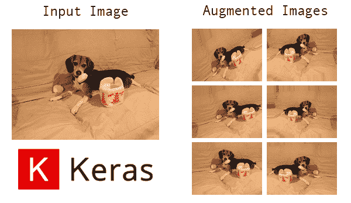
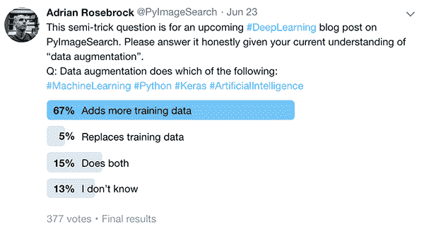
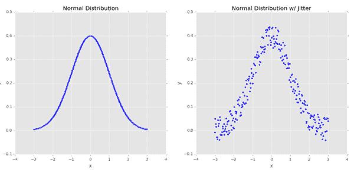
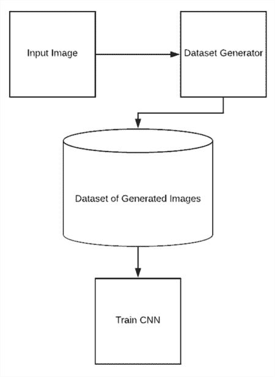
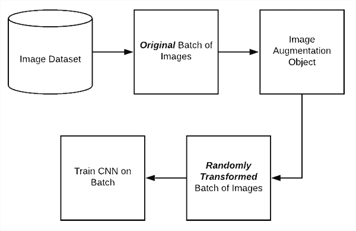
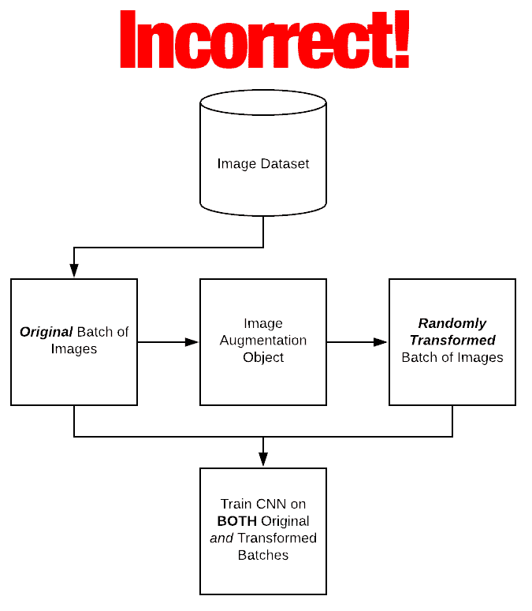
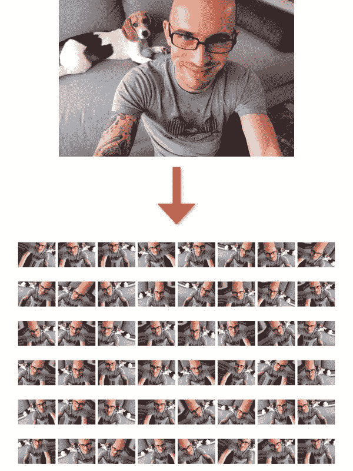
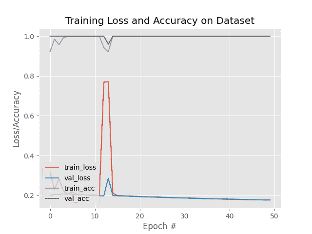
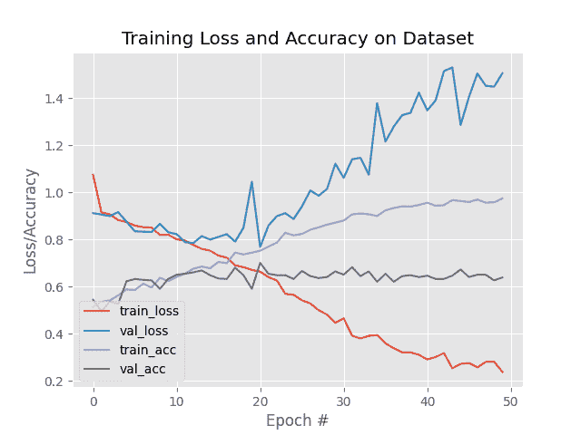
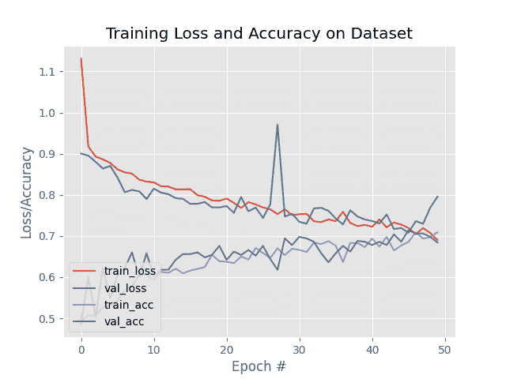

# Keras 图像数据生成器和数据扩充

> 原文：<https://pyimagesearch.com/2019/07/08/keras-imagedatagenerator-and-data-augmentation/>

[](https://pyimagesearch.com/wp-content/uploads/2019/07/keras_data_augmentation_header.png)

在今天的教程中，您将学习如何使用 Keras 的 ImageDataGenerator 类来执行数据扩充。我还将消除围绕什么是数据增强、我们为什么使用数据增强以及它做什么/不做什么的常见困惑。

知道我要写一篇关于数据扩充的教程，两个周末前我决定找点乐子，故意在我的 [Twitter feed](https://twitter.com/PyImageSearch/status/1142765698575413248) 上发布一个*半恶作剧问题*。

问题很简单— **数据增强能做以下哪些事情？**

1.  添加更多培训数据
2.  替换培训数据
3.  两者都有吗
4.  我不知道

结果如下:

[](https://pyimagesearch.com/wp-content/uploads/2019/07/keras_data_augmentation_poll.png)

**Figure 1:** My [**@PyImageSearch**](https://twitter.com/pyimagesearch) [twitter poll](https://twitter.com/PyImageSearch/status/1142765698575413248) on the concept of Data Augmentation.

只有 5%的受访者“正确”回答了这个问题(至少如果你使用的是 Keras 的 ImageDataGenerator 类)。

同样，这是一个棘手的问题，因此这并不是一个公平的评估，但事情是这样的:

虽然单词*“augment”*的意思是使某物“更大”或“增加”某物(在本例中是数据)，但 Keras ImageDataGenerator 类*实际上是通过以下方式工作的:*

1.  接受一批用于训练的图像。
2.  取这一批并对这一批中的每个图像应用一系列随机变换(包括随机旋转、调整大小、剪切等。).
3.  用新的、随机转换的批次替换原始批次。
4.  在这个随机转换的批次上训练 CNN(即原始数据*本身*是*而不是*用于训练)。

没错——**Keras imagedata generator 类是*而不是*一个“加法”运算。**它不是获取原始数据，对其进行随机转换，然后返回*原始数据和转换后的数据。*

**相反，ImageDataGenerator 接受原始数据，对其进行随机转换，并只向*返回*新的转换后的数据。**

但还记得我说过这是个棘手的问题吗？

*从技术上来说*，所有的答案都是正确的——**但是你知道一个给定的数据增强定义是否正确的唯一方法是通过它的应用环境。**

我将帮助您澄清一些关于数据扩充的困惑(并为您提供成功应用它所需的背景)。

在今天的剩余教程中，您将:

*   了解三种类型的数据扩充。
*   消除你对数据扩充的任何困惑。
*   了解如何使用 Keras 和`ImageDataGenerator`类应用数据扩充。

**要了解更多关于数据增强的信息，包括使用 Keras 的 ImageDataGenerator 类，*请继续阅读！***

## Keras 图像数据生成器和数据扩充

***2020-06-04 更新:**此博文现已兼容 TensorFlow 2+!*

我们将从讨论数据扩充和我们为什么使用它开始本教程。

然后，我将介绍在训练深度神经网络时您将看到的三种类型的数据增强:

1.  通过数据扩充生成数据集和扩展数据(不太常见)
2.  就地/动态数据扩充(最常见)
3.  组合数据集生成和就地扩充

从那以后，我将教您如何使用 Keras 的`ImageDataGenerator`类将数据扩充应用到您自己的数据集(使用所有三种方法)。

### 什么是数据增强？

数据扩充包括一系列技术，用于通过应用随机抖动和扰动(但同时确保数据的类别标签不变)从原始样本生成“新”训练样本。

**我们应用数据扩充的目标是提高模型的概化能力。**

假设我们的网络不断看到输入数据的新的、稍微修改的版本，网络能够学习更健壮的特征。

在测试时，我们不应用数据扩充，而是简单地在未修改的测试数据上评估我们的训练网络——在大多数情况下，您会看到测试准确性的提高，也许是以训练准确性的轻微下降为代价。

#### 一个简单的数据扩充示例

[](https://pyimagesearch.com/wp-content/uploads/2019/07/keras_data_augmentation_jitter.png)

**Figure 2:** ***Left:*** A sample of 250 data points that follow a normal distribution exactly. ***Right:*** Adding a small amount of random “jitter” to the distribution. This type of data augmentation increases the generalizability of our networks.

让我们考虑均值和单位方差为零的正态分布的**图 2** ( *左*)。

在这些数据上训练一个机器学习模型可能会导致我们精确地模拟分布*——然而，在现实世界的应用中，数据很少遵循这样一个漂亮、整洁的分布。*

 *相反，为了增加我们分类器的泛化能力，我们可以首先通过添加一些随机值来随机抖动分布中的点

drawn from a random distribution (*right*).

我们的图仍然遵循一个近似的正态分布，但是它不像左边的那样是一个完美的 T2 分布。

根据这种修改的、扩充的数据训练的模型更有可能推广到不包括在训练集中的示例数据点。

#### 计算机视觉和数据增强

[](https://pyimagesearch.com/wp-content/uploads/2019/07/keras_data_augmentation_random_adjustments.jpg)

**Figure 3:** In computer vision, data augmentation performs random manipulations on images. It is typically applied in three scenarios discussed in this blog post.

在计算机视觉的背景下，数据增强自然地有助于它自己。

例如，我们可以通过应用简单的几何变换从原始图像中获得增强数据，例如随机:

1.  翻译
2.  旋转
3.  规模的变化
4.  剪羊毛
5.  水平(在某些情况下，垂直)翻转

对输入图像应用(少量)变换会略微改变其外观，但它*不会*改变类别标签——从而使数据增强成为应用于计算机视觉任务的非常自然、简单的方法。

### 三种类型的数据扩充

在计算机视觉应用的背景下应用深度学习时，您可能会遇到三种类型的数据增强。

**数据扩充的确切定义是“正确的”,*完全取决于*你的项目/一组实验的背景。**

花时间仔细阅读这一部分*，因为我看到许多深度学习从业者混淆了数据增强做什么和不做什么。*

 *#### 类型 1:数据集生成和扩展现有数据集(不太常见)

[](https://pyimagesearch.com/wp-content/uploads/2019/07/keras_data_augmentation_dataset_generation.png)

**Figure 4:** **Type #1** of data augmentation consists of dataset generation/dataset expansion. This is a less common form of data augmentation.

第一种类型的数据扩充是我所说的**数据集生成**或**数据集扩展**。

正如你所知，机器学习模型，尤其是神经网络，可能需要相当多的训练数据— **但是如果你一开始就没有太多的训练数据，那该怎么办呢？**

让我们来看看最简单的情况，您只有*一张图像*，并且您想要应用数据扩充来创建一个完整的图像数据集，所有这些都基于那一张图像。

要完成这项任务，您需要:

1.  从磁盘加载原始输入图像。
2.  通过一系列随机平移、旋转等随机变换原始图像。
3.  将转换后的图像写回磁盘。
4.  总共重复步骤 2 和 3N 次。

执行此过程后，您将拥有一个目录，其中包含随机转换的“新”图像，您可以使用这些图像进行训练，所有这些都基于单个输入图像。

当然，这是一个非常简单的例子。

你很可能有不止一张图片——你可能有 10 张或 100 张图片，现在你的目标是将这个较小的集合变成 1000 张图片用于训练。

在这些情况下，数据集扩展和数据集生成可能值得探索。

但是这种方法有一个问题——我们并没有增加模型的泛化能力。

是的，我们通过生成额外的示例增加了我们的训练数据，但所有这些示例都基于一个*超小型*数据集。

请记住，我们的神经网络的好坏取决于它接受训练的数据。

**我们*不能*期望在少量数据上训练一个神经网络，然后期望它推广到它*从未*训练过并且从未见过的数据。**

如果您发现自己正在认真考虑数据集生成和数据集扩展，您应该后退一步，转而花时间收集额外的数据或研究**行为克隆**的方法(然后应用下面的*“组合数据集生成和就地增强”*部分中涵盖的数据增强类型)。

#### 类型 2:就地/动态数据扩充(最常见)

[](https://pyimagesearch.com/wp-content/uploads/2019/07/keras_data_augmentation_in_place.png)

**Figure 5:** **Type #2** of data augmentation consists of on-the-fly image batch manipulations. This is the most common form of data augmentation with Keras.

第二种类型的数据增强被称为**就地数据增强**或**动态数据增强**。这种类型的数据扩充是 Keras ' T0 '类实现的。

使用这种类型的数据增强，我们希望确保我们的网络在接受训练时，在每个时期都能看到我们数据的新变化。

**图 5** 展示了应用就地数据扩充的过程:

1.  **步骤#1:** 一批输入图像被呈现给`ImageDataGenerator`。
2.  **步骤# 2:**`ImageDataGenerator`通过一系列的随机平移、旋转等来变换批中的每个图像。
3.  **步骤#3:** 然后将随机转换的批处理返回给调用函数。

**我想提醒你注意两点:**

1.  `ImageDataGenerator`是*而不是*返回原始数据和转换后的数据— ***该类只返回随机转换后的数据。***
2.  我们称之为“就地”和“实时”数据增强，因为**这种增强是在训练时间** 完成的*(即，我们不是提前/在训练之前生成这些例子)。*

当我们的模型被训练时，我们可以把我们的`ImageDataGenerator`类想象成“截取”原始数据，随机转换它，然后返回给神经网络进行训练，*而神经网络一直不知道数据被修改了！*

我在 PyImageSearch 博客上写过以前的教程，读者认为 Keras 的 ImageDateGenerator 类是一个“加法运算”，类似于下图(不正确):

[](https://pyimagesearch.com/wp-content/uploads/2019/07/keras_data_augmentation_incorrect.png)

**Figure 6:** How Keras data augmentation does **not** work.

在上图中，`ImageDataGenerator`接受一批输入图像，随机转换该批图像，然后返回原始图像和修改后的数据— **，这是*而不是*Keras`ImageDataGenerator`所做的。相反，`ImageDataGenerator`类将返回*随机转换的数据。***

当我向读者解释这个概念时，下一个问题通常是:

> 但是艾利安，原始的训练数据呢？为什么不用？原来的训练数据不是对训练还有用吗？

**请记住，本节描述的数据增强技术的*整点*是为了确保网络在每个时期都能看到以前*从未“见过”的“新”图像。***

如果我们在每一批中包括原始训练数据和扩充数据，那么网络将多次“看到”原始训练数据，实际上违背了目的。其次，回想一下，数据扩充的总体目标是增加模型的可推广性。

为了实现这个目标，我们用随机转换的、扩充的数据“替换”训练数据。

在实践中，这导致模型在我们的验证/测试数据上表现更好，但在我们的训练数据上表现稍差(由于随机转换引起的数据变化)。

在本教程的后面，您将学习如何使用 Keras `ImageDataGenerator`类。

#### 类型 3:结合数据集生成和就地扩充

最后一种数据扩充寻求将*数据集生成*和就地扩充结合起来——在执行**行为克隆**时，您可能会看到这种类型的数据扩充。

行为克隆的一个很好的例子可以在自动驾驶汽车应用中看到。

创建自动驾驶汽车数据集可能非常耗时且昂贵——解决这个问题的一个方法是使用视频游戏和汽车驾驶模拟器。

视频游戏图形已经变得如此栩栩如生，以至于现在可以将它们用作训练数据。

因此，您可以不驾驶*实际的*车辆，而是:

*   玩电子游戏
*   写一个玩电子游戏的程序
*   使用视频游戏的底层渲染引擎

**…生成可用于训练的实际数据。**

一旦获得了训练数据，您就可以返回并对通过模拟收集的数据应用类型 2 数据扩充(即就地/即时数据扩充)。

### 配置您的开发环境

要针对本教程配置您的系统，我首先建议您遵循以下任一教程:

*   [*如何在 Ubuntu 上安装 tensor flow 2.0*](https://pyimagesearch.com/2019/12/09/how-to-install-tensorflow-2-0-on-ubuntu/)
*   *[如何在 macOS 上安装 tensor flow 2.0](https://pyimagesearch.com/2019/12/09/how-to-install-tensorflow-2-0-on-macos/)*

这两个教程都将帮助您在一个方便的 Python 虚拟环境中，用这篇博文所需的所有软件来配置您的系统。

请注意 [PyImageSearch 不推荐也不支持 CV/DL 项目](https://pyimagesearch.com/faqs/single-faq/can-you-help-me-do-___-on-windows/)的窗口。

### 项目结构

在深入研究代码之前，让我们先回顾一下项目的目录结构:

```py
$ tree --dirsfirst --filelimit 10
.
├── dogs_vs_cats_small
│   ├── cats [1000 entries]
│   └── dogs [1000 entries]
├── generated_dataset
│   ├── cats [100 entries]
│   └── dogs [100 entries]
├── pyimagesearch
│   ├── __init__.py
│   └── resnet.py
├── cat.jpg
├── dog.jpg
├── plot_dogs_vs_cats_no_aug.png
├── plot_dogs_vs_cats_with_aug.png
├── plot_generated_dataset.png
├── train.py
└── generate_images.py

7 directories, 9 files

```

首先，有两个数据集目录**，不要混淆:**

*   `dogs_vs_cats_small/`:流行的[卡格狗对猫](https://www.kaggle.com/c/dogs-vs-cats)比赛数据集的子集。在我策划的子集中，只有 2，000 幅图像(每类 1，000 幅)(与挑战赛的 25，000 幅图像相反)。
*   `generated_dataset/`:我们将使用父目录中的`cat.jpg`和`dog.jpg`图像创建这个生成的数据集。我们将利用数据扩充类型#1 来自动生成这个数据集，并用图像填充这个目录。

接下来，我们有我们的`pyimagesearch`模块，它包含我们的 ResNet CNN 分类器的实现。

今天，我们将回顾两个 Python 脚本:

*   `train.py`:用于训练**类型#1** 和**类型#2** (如果用户愿意，还可以选择**类型#3** )数据增强技术的模型。我们将执行三个训练实验，分别生成项目文件夹中的三个`plot*.png`文件。
*   `generate_images.py`:用于使用**类型#1** 从单幅图像生成数据集。

我们开始吧。

### 实施我们的培训脚本

在本教程的剩余部分，我们将进行三个实验:

1.  **实验#1:** 通过数据集扩展生成数据集，并在其上训练 CNN。
2.  **实验#2:** 使用 [Kaggle Dogs vs. Cats 数据集](https://www.kaggle.com/c/dogs-vs-cats)的子集，训练一个没有数据增强的 CNN *。*
3.  **实验#3:** 重复第二个实验，但是这次*用*数据增强。

所有这些实验都将使用相同的 Python 脚本来完成。

打开`train.py`脚本，让我们开始吧:

```py
# set the matplotlib backend so figures can be saved in the background
import matplotlib
matplotlib.use("Agg")

# import the necessary packages
from pyimagesearch.resnet import ResNet
from sklearn.preprocessing import LabelEncoder
from sklearn.model_selection import train_test_split
from sklearn.metrics import classification_report
from tensorflow.keras.preprocessing.image import ImageDataGenerator
from tensorflow.keras.optimizers import SGD
from tensorflow.keras.utils import to_categorical
from imutils import paths
import matplotlib.pyplot as plt
import numpy as np
import argparse
import cv2
import os

```

在**2-18 行**我们需要的包装是进口的。**第 10 行**是我们从 Keras 库的`ImageDataGenerator`导入——一个用于数据扩充的类。

让我们继续[解析我们的命令行参数](https://pyimagesearch.com/2018/03/12/python-argparse-command-line-arguments/):

```py
# construct the argument parser and parse the arguments
ap = argparse.ArgumentParser()
ap.add_argument("-d", "--dataset", required=True,
	help="path to input dataset")
ap.add_argument("-a", "--augment", type=int, default=-1,
	help="whether or not 'on the fly' data augmentation should be used")
ap.add_argument("-p", "--plot", type=str, default="plot.png",
	help="path to output loss/accuracy plot")
args = vars(ap.parse_args())

```

我们的脚本通过终端接受三个命令行参数:

*   `--dataset`:输入数据集的路径。
*   `--augment`:是否应使用“即时”数据增强(参见上文**类型#2** )。默认情况下，该方法是*而不是*执行的。
*   `--plot`:输出训练历史图的路径。

让我们继续初始化超参数并加载我们的图像数据:

```py
# initialize the initial learning rate, batch size, and number of
# epochs to train for
INIT_LR = 1e-1
BS = 8
EPOCHS = 50

# grab the list of images in our dataset directory, then initialize
# the list of data (i.e., images) and class images
print("[INFO] loading images...")
imagePaths = list(paths.list_images(args["dataset"]))
data = []
labels = []

# loop over the image paths
for imagePath in imagePaths:
	# extract the class label from the filename, load the image, and
	# resize it to be a fixed 64x64 pixels, ignoring aspect ratio
	label = imagePath.split(os.path.sep)[-2]
	image = cv2.imread(imagePath)
	image = cv2.resize(image, (64, 64))

	# update the data and labels lists, respectively
	data.append(image)
	labels.append(label)

```

在第 32-34 行的**处初始化训练超参数，包括初始学习率、批量大小和训练的时期数。**

从那里**第 39-53 行**抓取`imagePaths`，加载图像，并填充我们的`data`和`labels`列表。此时我们执行的唯一图像预处理是将每个图像的大小调整为 *64×64* px。

接下来，让我们完成预处理，对标签进行编码，并对数据进行分区:

```py
# convert the data into a NumPy array, then preprocess it by scaling
# all pixel intensities to the range [0, 1]
data = np.array(data, dtype="float") / 255.0

# encode the labels (which are currently strings) as integers and then
# one-hot encode them
le = LabelEncoder()
labels = le.fit_transform(labels)
labels = to_categorical(labels, 2)

# partition the data into training and testing splits using 75% of
# the data for training and the remaining 25% for testing
(trainX, testX, trainY, testY) = train_test_split(data, labels,
	test_size=0.25, random_state=42)

```

在第 57 行的**上，我们将数据转换成一个 NumPy 数组，并将所有像素亮度缩放到范围 *[0，1]* 。这就完成了我们的预处理。**

从那里我们执行我们的`labels` ( **第 61-63 行**)的“一键编码”。这种对我们的`labels`进行编码的方法会产生一个如下所示的数组:

```py
array([[0., 1.],
       [0., 1.],
       [0., 1.],
       [1., 0.],
       [1., 0.],
       [0., 1.],
       [0., 1.]], dtype=float32)

```

对于这个数据样本，有两只猫(`[1., 0.]`)和五只狗(`[0., 1]`)，其中对应于图像的标签被标记为“热”。

从那里我们将`data`划分为训练和测试部分，标记 75%的数据用于训练，剩下的 25%用于测试(**第 67 行和第 68 行**)。

现在，我们准备好**初始化我们的数据扩充对象:**

```py
# initialize an our data augmenter as an "empty" image data generator
aug = ImageDataGenerator()

```

第 71 行初始化我们的空数据扩充对象(即不执行任何扩充)。这是该脚本的默认操作。

让我们检查一下是否要用`--augment`命令行参数覆盖默认设置:

```py
# check to see if we are applying "on the fly" data augmentation, and
# if so, re-instantiate the object
if args["augment"] > 0:
	print("[INFO] performing 'on the fly' data augmentation")
	aug = ImageDataGenerator(
		rotation_range=20,
		zoom_range=0.15,
		width_shift_range=0.2,
		height_shift_range=0.2,
		shear_range=0.15,
		horizontal_flip=True,
		fill_mode="nearest")

```

第 75 行检查我们是否正在执行数据扩充。如果是这样，我们用随机转换参数重新初始化数据扩充对象(**第 77-84 行**)。如参数所示，随机旋转、缩放、移动、剪切和翻转将在原地/动态数据扩充期间执行。

让我们编译和训练我们的模型:

```py
# initialize the optimizer and model
print("[INFO] compiling model...")
opt = SGD(lr=INIT_LR, momentum=0.9, decay=INIT_LR / EPOCHS)
model = ResNet.build(64, 64, 3, 2, (2, 3, 4),
	(32, 64, 128, 256), reg=0.0001)
model.compile(loss="binary_crossentropy", optimizer=opt,
	metrics=["accuracy"])

# train the network
print("[INFO] training network for {} epochs...".format(EPOCHS))
H = model.fit(
	x=aug.flow(trainX, trainY, batch_size=BS),
	validation_data=(testX, testY),
	steps_per_epoch=len(trainX) // BS,
	epochs=EPOCHS)

```

***2020-06-04 更新:**以前，TensorFlow/Keras 需要使用一种叫做`.fit_generator`的方法来完成数据扩充。现在，`.fit`方法也可以处理数据扩充，使代码更加一致。这也适用于从`.predict_generator`到`.predict`的迁移。阅读完本教程后，请务必查看我的另一篇文章 [fit 和 fit_generator](https://pyimagesearch.com/2018/12/24/how-to-use-keras-fit-and-fit_generator-a-hands-on-tutorial/) 。*

**第 88-92 行**使用随机梯度下降优化和学习率衰减构建我们的`ResNet`模型。对于这个 2 类问题，我们使用`"binary_crossentropy"`损失。如果你有两个以上的班级，一定要使用`"categorial_crossentropy"`。

**第 96-100 行**然后训练我们的模型。`aug`对象成批处理数据扩充(尽管请记住，只有在设置了`--augment`命令行参数的情况下，`aug`对象才会执行数据扩充)。

最后，我们将评估我们的模型，打印统计数据，并生成一个训练历史图:

```py
# evaluate the network
print("[INFO] evaluating network...")
predictions = model.predict(x=testX.astype("float32"), batch_size=BS)
print(classification_report(testY.argmax(axis=1),
	predictions.argmax(axis=1), target_names=le.classes_))

# plot the training loss and accuracy
N = np.arange(0, EPOCHS)
plt.style.use("ggplot")
plt.figure()
plt.plot(N, H.history["loss"], label="train_loss")
plt.plot(N, H.history["val_loss"], label="val_loss")
plt.plot(N, H.history["accuracy"], label="train_acc")
plt.plot(N, H.history["val_accuracy"], label="val_acc")
plt.title("Training Loss and Accuracy on Dataset")
plt.xlabel("Epoch #")
plt.ylabel("Loss/Accuracy")
plt.legend(loc="lower left")
plt.savefig(args["plot"])

```

***2020-06-04 更新:**为了使该绘图片段与 TensorFlow 2+兼容，更新了`H.history`字典键，以完全拼出“精度”而没有“acc”(即`H.history["val_accuracy"]`和`H.history["accuracy"]`)。“val”没有拼成“validation”，这有点令人困惑；我们必须学会热爱 API 并与之共存，并永远记住这是一项正在进行的工作，世界各地的许多开发人员都为此做出了贡献。*

**第 104 行**为评估目的对测试集进行预测。通过**线 105 和 106** 打印分类报告。

从那里，**行 109-120** 生成并保存准确度/损失训练图。

### 使用数据扩充和 Keras 生成数据集/数据集扩展

在我们的第一个实验中，我们将使用 Keras 通过数据扩充来执行数据集扩展。

我们的数据集将包含 2 个类，最初，数据集通常每个类只包含 1 个图像:

*   **猫:** 1 张图片
*   **狗:** 1 图像

我们将利用 **Type #1** 数据扩充(参见上面的*“Type # 1:Dataset generation and expanding a existing Dataset”*部分)来生成一个新的数据集，每个类包含 100 幅图像:

*   **猫:** 100 张图片
*   **狗:** 100 张图片

同样，这意味着是一个*示例*——在现实世界的应用程序中，您会有 100 个示例图像，但我们在这里保持简单，以便您可以学习这个概念。

#### 生成示例数据集

[](https://pyimagesearch.com/wp-content/uploads/2019/07/keras_data_augmentation_generated_dataset.jpg)

**Figure 7:** Data augmentation with Keras performs random manipulations on images.

在我们训练 CNN 之前，我们首先需要生成一个示例数据集。

从我们上面的*“项目结构”*部分，您知道我们在根目录中有两个示例图像:`cat.jpg`和`dog.jpg`。我们将使用这些示例图像为每个类生成 100 个新的训练图像(总共 200 个图像)。

要了解我们如何使用数据扩充来生成新的示例，请打开`generate_images.py`文件并按照以下步骤操作:

```py
# import the necessary packages
from tensorflow.keras.preprocessing.image import ImageDataGenerator
from tensorflow.keras.preprocessing.image import img_to_array
from tensorflow.keras.preprocessing.image import load_img
import numpy as np
import argparse

# construct the argument parser and parse the arguments
ap = argparse.ArgumentParser()
ap.add_argument("-i", "--image", required=True,
	help="path to the input image")
ap.add_argument("-o", "--output", required=True,
	help="path to output directory to store augmentation examples")
ap.add_argument("-t", "--total", type=int, default=100,
	help="# of training samples to generate")
args = vars(ap.parse_args())

```

**2-6 线**导入我们必要的包。我们的`ImageDataGenerator`在**线 2** 上导入，并将使用 Keras 处理我们的数据扩充。

从那里，我们将解析三个命令行参数:

*   `--image`:输入图像的路径。我们将生成此图像的额外随机变异版本。
*   `--output`:存储数据扩充实例的输出目录路径。
*   `--total`:要生成的样本图像的数量。

让我们继续加载我们的`image`和**初始化我们的数据扩充对象:**

```py
# load the input image, convert it to a NumPy array, and then
# reshape it to have an extra dimension
print("[INFO] loading example image...")
image = load_img(args["image"])
image = img_to_array(image)
image = np.expand_dims(image, axis=0)

# construct the image generator for data augmentation then
# initialize the total number of images generated thus far
aug = ImageDataGenerator(
	rotation_range=30,
	zoom_range=0.15,
	width_shift_range=0.2,
	height_shift_range=0.2,
	shear_range=0.15,
	horizontal_flip=True,
	fill_mode="nearest")
total = 0

```

我们的`image`通过**线路 21-23** 加载并准备数据扩充。图像加载和处理是通过 Keras 功能处理的(即我们没有使用 OpenCV)。

从那里，我们初始化`ImageDataGenerator`对象。这个对象将有助于在我们的输入图像上执行随机旋转、缩放、移动、剪切和翻转。

接下来，我们将构建一个 Python 生成器，并让它工作，直到我们的所有图像都已生成:

```py
# construct the actual Python generator
print("[INFO] generating images...")
imageGen = aug.flow(image, batch_size=1, save_to_dir=args["output"],
	save_prefix="image", save_format="jpg")

# loop over examples from our image data augmentation generator
for image in imageGen:
	# increment our counter
	total += 1

	# if we have reached the specified number of examples, break
	# from the loop
	if total == args["total"]:
		break

```

我们将使用`imageGen`随机变换输入图像(**第 39 行和第 40 行**)。此生成器将图像存储为。jpg 文件到指定的输出目录包含在`args["output"]`内。

最后，我们将遍历来自图像数据生成器的示例，并对它们进行计数，直到我们达到所需的`total`数量的图像。

要运行`generate_examples.py`脚本，请确保您已经使用了教程的 ***【下载】*** 部分来下载源代码和示例图像。

从那里打开一个终端并执行以下命令:

```py
$ python generate_images.py --image cat.jpg --output generated_dataset/cats
[INFO] loading example image...
[INFO] generating images...

```

检查`generated_dataset/cats`目录的输出，你现在会看到 100 张图片:

```py
$ ls generated_dataset/cats/*.jpg | wc -l
     100

```

现在让我们为“狗”类做同样的事情:

```py
$ python generate_images.py --image dog.jpg --output generated_dataset/dogs
[INFO] loading example image...
[INFO] generating images...

```

现在检查狗的图像:

```py
$ ls generated_dataset/dogs/*.jpg | wc -l
     100

```

通过数据扩充生成数据集的可视化可以在本节顶部的**图 6** 中看到——注意我们是如何接受单个输入图像(我的图像——不是狗或猫的图像),然后从该单个图像中创建了 100 个新的训练示例(其中 48 个是可视化的)。

#### 实验#1:数据集生成结果

我们现在准备进行我们的第一个实验:

```py
$ python train.py --dataset generated_dataset --plot plot_generated_dataset.png
[INFO] loading images...
[INFO] compiling model...
[INFO] training network for 50 epochs...
Epoch 1/50
18/18 [==============================] - 1s 60ms/step - loss: 0.3191 - accuracy: 0.9220 - val_loss: 0.1986 - val_accuracy: 1.0000
Epoch 2/50
18/18 [==============================] - 0s 9ms/step - loss: 0.2276 - accuracy: 0.9858 - val_loss: 0.2044 - val_accuracy: 1.0000
Epoch 3/50
18/18 [==============================] - 0s 8ms/step - loss: 0.2839 - accuracy: 0.9574 - val_loss: 0.2046 - val_accuracy: 1.0000
...
Epoch 48/50
18/18 [==============================] - 0s 9ms/step - loss: 0.1770 - accuracy: 1.0000 - val_loss: 0.1768 - val_accuracy: 1.0000
Epoch 49/50
18/18 [==============================] - 0s 9ms/step - loss: 0.1767 - accuracy: 1.0000 - val_loss: 0.1763 - val_accuracy: 1.0000
Epoch 50/50
18/18 [==============================] - 0s 8ms/step - loss: 0.1767 - accuracy: 1.0000 - val_loss: 0.1758 - val_accuracy: 1.0000
[INFO] evaluating network...
              precision    recall  f1-score   support

        cats       1.00      1.00      1.00        25
        dogs       1.00      1.00      1.00        25

    accuracy                           1.00        50
   macro avg       1.00      1.00      1.00        50
weighted avg       1.00      1.00      1.00        50

```

[](https://pyimagesearch.com/wp-content/uploads/2019/07/plot_generated_dataset.png)

**Figure 8:** Data augmentation with Keras **Experiment #1** training accuracy/loss results.

我们的结果表明，我们能够毫不费力地获得 **100%** 的准确性。

当然，这是一个微不足道的、人为的例子。实际上，你不会只拍摄一张*单个*图像，然后通过数据扩充建立一个由 100 或 1000 张图像组成的数据集。相反，您将拥有一个包含数百张图像的数据集，然后将数据集生成应用于该数据集，但同样，本节的目的是通过一个简单的示例进行演示，以便您能够理解该过程。

### 用就地数据扩充训练网络

更受欢迎的(基于图像的)数据增强形式被称为**就地数据增强**(参见本文的*“类型#2:就地/动态数据增强”*部分了解更多细节)。

在进行原位增强时，我们的 Keras `ImageDataGenerator`将:

1.  接受一批输入图像。
2.  随机转换输入批次。
3.  将转换后的批次返回网络进行训练。

我们将通过两个实验来探索数据扩充如何减少过度拟合并提高我们的模型的泛化能力。

为了完成这项任务，我们将使用 [Kaggle Dogs vs. Cats 数据集](https://www.kaggle.com/c/dogs-vs-cats)的一个子集:

*   **猫:**1000 张图片
*   **狗:**1000 张图片

然后，我们将从头开始，在这个数据集上训练 ResNet 的一个变体，有数据增强和没有数据增强。

#### 实验 2:获得基线(没有数据扩充)

在我们的第一个实验中，我们不进行数据扩充:

```py
$ python train.py --dataset dogs_vs_cats_small --plot plot_dogs_vs_cats_no_aug.png
[INFO] loading images...
[INFO] compiling model...
[INFO] training network for 50 epochs...
Epoch 1/50
187/187 [==============================] - 3s 13ms/step - loss: 1.0743 - accuracy: 0.5134 - val_loss: 0.9116 - val_accuracy: 0.5440
Epoch 2/50
187/187 [==============================] - 2s 9ms/step - loss: 0.9149 - accuracy: 0.5349 - val_loss: 0.9055 - val_accuracy: 0.4940
Epoch 3/50
187/187 [==============================] - 2s 9ms/step - loss: 0.9065 - accuracy: 0.5409 - val_loss: 0.8990 - val_accuracy: 0.5360
...
Epoch 48/50
187/187 [==============================] - 2s 9ms/step - loss: 0.2796 - accuracy: 0.9564 - val_loss: 1.4528 - val_accuracy: 0.6500
Epoch 49/50
187/187 [==============================] - 2s 10ms/step - loss: 0.2806 - accuracy: 0.9578 - val_loss: 1.4485 - val_accuracy: 0.6260
Epoch 50/50
187/187 [==============================] - 2s 9ms/step - loss: 0.2371 - accuracy: 0.9739 - val_loss: 1.5061 - val_accuracy: 0.6380
[INFO] evaluating network...
              precision    recall  f1-score   support

        cats       0.61      0.70      0.65       243
        dogs       0.67      0.58      0.62       257

    accuracy                           0.64       500
   macro avg       0.64      0.64      0.64       500
weighted avg       0.64      0.64      0.64       500

```

查看原始分类报告，你会发现我们获得了 **64%的准确率** — **，但是有一个问题！**

看看与我们训练相关的情节:

[](https://pyimagesearch.com/wp-content/uploads/2019/07/plot_dogs_vs_cats_no_aug.png)

**Figure 9:** For **Experiment #2** we did not perform data augmentation. The result is a plot with strong indications of overfitting.

**出现了*戏剧性的过度拟合***—大约在第 15 代，我们看到我们的验证损失开始上升，而训练损失继续下降。到了第 20 个纪元，验证损失的上升尤其明显。

这种类型的行为表明过度拟合。

解决方案是(1)减少模型容量，和/或(2)执行正则化。

#### 实验 3:改进我们的结果(通过数据扩充)

现在让我们研究一下数据扩充如何作为一种正则化形式:

```py
[INFO] loading images...
[INFO] performing 'on the fly' data augmentation
[INFO] compiling model...
[INFO] training network for 50 epochs...
Epoch 1/50
187/187 [==============================] - 3s 14ms/step - loss: 1.1307 - accuracy: 0.4940 - val_loss: 0.9002 - val_accuracy: 0.4860
Epoch 2/50
187/187 [==============================] - 2s 8ms/step - loss: 0.9172 - accuracy: 0.5067 - val_loss: 0.8952 - val_accuracy: 0.6000
Epoch 3/50
187/187 [==============================] - 2s 8ms/step - loss: 0.8930 - accuracy: 0.5074 - val_loss: 0.8801 - val_accuracy: 0.5040
...
Epoch 48/50
187/187 [==============================] - 2s 8ms/step - loss: 0.7194 - accuracy: 0.6937 - val_loss: 0.7296 - val_accuracy: 0.7060
Epoch 49/50
187/187 [==============================] - 2s 8ms/step - loss: 0.7071 - accuracy: 0.6971 - val_loss: 0.7690 - val_accuracy: 0.6980
Epoch 50/50
187/187 [==============================] - 2s 9ms/step - loss: 0.6901 - accuracy: 0.7091 - val_loss: 0.7957 - val_accuracy: 0.6840
[INFO] evaluating network...
              precision    recall  f1-score   support

        cats       0.72      0.56      0.63       243
        dogs       0.66      0.80      0.72       257

    accuracy                           0.68       500
   macro avg       0.69      0.68      0.68       500
weighted avg       0.69      0.68      0.68       500

```

我们现在达到了 69%的准确率，比之前的 64%有所提高。

**但更重要的是，我们不再过度适应:**

[](https://pyimagesearch.com/wp-content/uploads/2019/07/plot_dogs_vs_cats_with_aug.png)

**Figure 10:** For **Experiment #3**, we performed data augmentation with Keras on batches of images in-place. Our training plot shows no signs of overfitting with this form of regularization.

请注意验证和训练损失是如何一起下降的，几乎没有差异。类似地，训练和验证拆分的分类准确性也在一起增长。

**通过使用数据扩充，我们能够应对过度拟合！**

几乎在所有情况下，除非你有很好的理由不这样做，否则你应该在训练自己的神经网络时进行数据扩充。

## 摘要

在本教程中，您了解了数据扩充以及如何通过 Keras 的 ImageDataGenerator 类应用数据扩充。

您还了解了三种类型的数据扩充，包括:

1.  通过数据扩充进行数据集生成和数据扩展(不太常见)。
2.  就地/动态数据增强(最常见)。
3.  组合数据集生成器和就地扩充。

默认情况下， **Keras' `ImageDataGenerator`类执行就地/动态数据扩充**，这意味着该类:

1.  接受一批用于训练的图像。
2.  获取该批图像，并对该批图像中的每个图像应用一系列随机变换。
3.  用随机转换的新批次替换原始批次
4.  4.在这个随机转换的批次上训练 CNN(即原始数据本身是用于训练的*而不是*)。

话虽如此，我们实际上也可以将`ImageDataGenerator`类用于数据集生成/扩展——我们只需要在训练之前使用它来生成我们的数据集*。*

数据扩充的最后一种方法是就地扩充和数据集扩充相结合，这种方法很少使用。在这些情况下，您可能有一个小数据集，需要通过数据扩充生成额外的示例，然后在训练时进行额外的扩充/预处理。

我们通过对数据扩充进行大量实验来总结本指南，**注意到数据扩充是一种*正规化*** 的形式，使我们的网络能够更好地推广到我们的测试/验证集。

在我们的实验中验证了这种将数据扩充作为正则化的主张，我们发现:

1.  在训练中不应用数据扩充导致过度拟合
2.  而应用数据扩充允许平滑训练、没有过度拟合以及更高的精度/更低的损失

你应该在你所有的实验中应用数据扩充，除非你有一个很好的理由不这样做。

要了解更多关于数据增强的信息，包括我的最佳实践、技巧和建议，请务必看看我的书， [***用 Python 进行计算机视觉的深度学习***](https://pyimagesearch.com/deep-learning-computer-vision-python-book/) 。

我希望你喜欢今天的教程！

**要下载这篇文章的源代码(并在未来教程在 PyImageSearch 上发布时接收电子邮件更新)，*只需在下面的表格中输入您的电子邮件地址！*****