# Keras 学习率时间表和衰减

> 原文：<https://pyimagesearch.com/2019/07/22/keras-learning-rate-schedules-and-decay/>

在本教程中，您将了解如何使用 Keras 学习速率计划和衰减。您将了解如何使用 Keras 的标准学习率衰减以及基于步长、线性和多项式的学习率计划。

[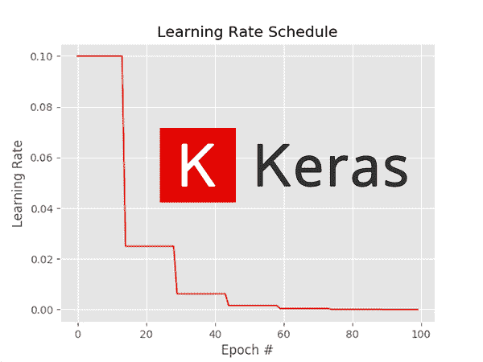](https://pyimagesearch.com/wp-content/uploads/2019/07/keras_learning_rates_header.png)

在训练一个神经网络的时候，**学习率往往是*你要调优的最重要的超参数*:**

*   **太小**一个学习率，你的神经网络可能根本不会学习
*   **过大的**学习率，你可能会超越低损失区域(甚至从训练开始就超负荷)

当涉及到训练神经网络时，最大的回报(就准确性而言)将来自于选择正确的学习率和适当的学习率计划。

但是说起来容易做起来难。

为了帮助像你这样的深度学习实践者学习如何评估问题和选择合适的学习速率，我们将开始一系列关于学习速率计划、衰减和 Keras 超参数调整的教程。

到本系列结束时，您将会很好地理解如何恰当有效地将 Keras 的学习进度应用到您自己的深度学习项目中。

**要了解如何使用 Keras 来学习速率表和衰减，*只需继续阅读***

## Keras 学习率时间表和衰减

***2020-06-11 更新:**此博文现已兼容 TensorFlow 2+!*

在本指南的第一部分，我们将讨论为什么在训练你自己的深度神经网络时，学习率是最重要的超参数。

然后我们将深入探讨为什么我们可能想要在训练中调整我们的学习速度。

**接下来，我将向您展示如何使用 Keras 实施和利用许多学习率计划，包括:**

*   大多数 Keras 优化器都内置了衰减时间表
*   基于步骤的学习率计划
*   线性学习率衰减
*   多项式学习速率表

然后，我们将使用这些学习率计划在 CIFAR-10 上执行大量实验，并评估哪一个执行得最好。

这几组实验将作为一个模板，你可以在探索自己的深度学习项目和选择合适的学习速率和学习速率时间表时使用。

### 为什么要调整我们的学习率和使用学习率计划？

要了解为什么学习速率表是一种值得应用的方法，有助于提高模型准确性并下降到较低损失的区域，请考虑几乎所有神经网络都使用的标准权重更新公式:

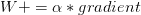

回想一下学习率，

, controls the “step” we make along the gradient. Larger values of imply that we are taking *bigger steps.* While smaller values of will make *tiny steps*. If is *zero* the network cannot make any steps at all (since the gradient multiplied by zero is zero).

你遇到的大多数初始学习率(但不是全部)通常在集合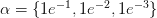中

.

然后，在不改变学习速率的情况下，对网络进行固定次数的训练。

这种方法在某些情况下可能很有效，但随着时间的推移，降低我们的学习速度通常是有益的。当训练我们的网络时，我们试图沿着我们的损失范围找到一些位置，在那里网络获得合理的准确性。不一定是全局极小值，甚至也不一定是局部极小值，但在实践中，简单地找到一个损失相当低的损失区域就“足够好”了。

如果我们一直保持较高的学习率，我们可能会越过这些低损失区域，因为我们将采取*太大的*步骤来下降到这些系列。

**相反，我们能做的是降低我们的学习率，从而允许我们的网络采取更小的步骤** —这种降低的学习率使我们的网络能够下降到“更优”的损失领域，否则我们的学习率学习将会完全*错过*。

因此，我们可以将学习率计划的过程视为:

1.  在训练过程的早期以较大的学习率找到一组合理的“好”重量。
2.  稍后在该过程中调整这些权重，以使用较小的学习速率找到更优的权重。

我们将在本教程中讨论一些最流行的学习进度。

### 配置您的开发环境

要针对本教程配置您的系统，我首先建议您遵循以下任一教程:

*   [*如何在 Ubuntu 上安装 tensor flow 2.0*](https://pyimagesearch.com/2019/12/09/how-to-install-tensorflow-2-0-on-ubuntu/)
*   [*如何在 macOS 上安装 tensor flow 2.0*](https://pyimagesearch.com/2019/12/09/how-to-install-tensorflow-2-0-on-macos/)

这两个教程都将帮助您在一个方便的 Python 虚拟环境中，用这篇博文所需的所有软件来配置您的系统。

请注意 [PyImageSearch 不推荐也不支持 CV/DL 项目](https://pyimagesearch.com/faqs/single-faq/can-you-help-me-do-___-on-windows/)的窗口。

### 项目结构

一旦你抓取并提取了 ***【下载】*** ，继续使用`tree`命令检查项目文件夹:

```py
$ tree
.
├── output
│   ├── lr_linear_schedule.png
│   ├── lr_poly_schedule.png
│   ├── lr_step_schedule.png
│   ├── train_linear_schedule.png
│   ├── train_no_schedule.png
│   ├── train_poly_schedule.png
│   ├── train_standard_schedule.png
│   └── train_step_schedule.png
├── pyimagesearch
│   ├── __init__.py
│   ├── learning_rate_schedulers.py
│   └── resnet.py
└── train.py

2 directories, 12 files

```

我们的`output/`目录将包含学习率和训练历史图。结果部分包含的五个实验分别对应于文件名为`train_*.png`的五个图。

`pyimagesearch`模块包含我们的 ResNet CNN 和我们的`learning_rate_schedulers.py`。`LearningRateDecay`父类简单地包含了一个名为`plot`的方法，用于绘制我们每种类型的学习率衰减。还包括子类`StepDecay`和`PolynomialDecay`，它们在每个时期完成时计算学习率。这两个类都通过继承(一个面向对象的概念)包含了`plot`方法。

我们的训练脚本`train.py`将在 CIFAR-10 数据集上训练 ResNet。我们将在没有学习率衰减以及标准、线性、基于步长和多项式学习率衰减的情况下运行脚本。

### Keras 的标准“衰变”时间表

Keras 库附带了一个基于时间的学习率调度器——它是通过优化器类的`decay`参数(如`SGD`、`Adam`等)来控制的。).

为了发现我们如何利用这种类型的学习率衰减，让我们看一个如何初始化 ResNet 体系结构和 SGD 优化器的示例:

```py
# initialize our optimizer and model, then compile it
opt = SGD(lr=1e-2, momentum=0.9, decay=1e-2/epochs)
model = ResNet.build(32, 32, 3, 10, (9, 9, 9),
	(64, 64, 128, 256), reg=0.0005)
model.compile(loss="categorical_crossentropy", optimizer=opt,
	metrics=["accuracy"])

```

这里我们用初始学习率`1e-2`初始化我们的 SGD 优化器。然后，我们将我们的`decay`设置为学习率除以我们为其训练网络的总时期数(一个常见的经验法则)。

在内部，Keras 应用以下学习率时间表来调整每批更新后*的学习率——这是一个**误解**，Keras 在每个*时期*后更新标准衰减。**使用 Keras 提供的默认学习率调度程序时，请记住这一点。***

更新公式如下: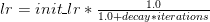

以 CIFAR-10 数据集为例，我们总共有 50，000 个训练图像。

如果我们使用批量大小`64`，这意味着总共有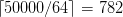

steps per epoch. Therefore, a total of `782` weight updates need to be applied before an epoch completes.

为了查看学习率进度计算的示例，让我们假设我们的初始学习率是

and our 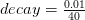(with the assumption that we are training for forty epochs).

在应用任何学习率计划之前，步骤 0 的学习率为:

} = 0.01")

在第一时段开始时，我们可以看到以下学习率:

} = 0.00836")

**下面的图 1** 继续计算 Keras 的标准学习率衰减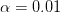

and a decay of 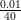:[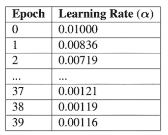](https://pyimagesearch.com/wp-content/uploads/2019/07/keras_learning_rate_standard_table.png)

**Figure 1:** Keras’ standard learning rate decay table.

在这篇文章的*“实施我们的培训脚本”*和*“Keras 学习率进度结果”*部分，你将分别学习如何利用这种学习率衰减。

### 我们的学习率衰减类

在本教程的剩余部分，我们将实现我们自己的自定义学习率计划，然后在训练我们的神经网络时将它们与 Keras 合并。

为了保持我们的代码整洁，更不用说遵循面向对象编程的最佳实践，让我们首先定义一个基类`LearningRateDecay`,我们将为每个相应的学习率计划创建子类。

打开目录结构中的`learning_rate_schedulers.py`,插入以下代码:

```py
# import the necessary packages
import matplotlib.pyplot as plt
import numpy as np

class LearningRateDecay:
	def plot(self, epochs, title="Learning Rate Schedule"):
		# compute the set of learning rates for each corresponding
		# epoch
		lrs = [self(i) for i in epochs]

		# the learning rate schedule
		plt.style.use("ggplot")
		plt.figure()
		plt.plot(epochs, lrs)
		plt.title(title)
		plt.xlabel("Epoch #")
		plt.ylabel("Learning Rate")

```

我们实施的每一个学习进度计划都将有一个绘图功能，使我们能够可视化我们的学习进度。

有了我们的基本`LearningRateSchedule`类实现，让我们继续创建一个基于步骤的学习率计划。

### 使用 Keras 的基于步骤的学习率计划

[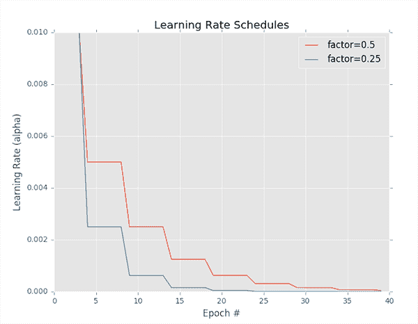](https://pyimagesearch.com/wp-content/uploads/2019/07/keras_learning_rates_drop_scheduling.png)

**Figure 2:** Keras learning rate step-based decay. The schedule in *red* is a decay factor of 0.5 and *blue* is a factor of 0.25.

一种流行的学习速率调度器是基于步长的衰减，在训练期间，我们在特定时期之后系统地降低学习速率。

阶跃衰减学习率调度器可以被视为一个分段函数，如图 2 中的**所示——这里学习率在多个时期内保持不变，然后下降，再次保持不变，然后再次下降，以此类推。**

当对我们的学习率应用步长衰减时，我们有两种选择:

1.  定义一个方程来模拟我们希望实现的分段插入学习率。
2.  使用我称之为`ctrl + c`的方法来训练一个深度神经网络。在这里，我们以给定的学习速率训练一些时期，并最终注意到验证性能停滞/停止，然后`ctrl + c`停止脚本，调整我们的学习速率，并继续训练。

在这篇文章中，我们将主要关注基于等式的分段下降学习率调度。

`ctrl + c`方法稍微高级一点，通常应用于使用更深层次神经网络的更大数据集，其中获得合理模型所需的确切历元数是未知的。

如果您想了解更多关于`ctrl + c`方法的训练，请参考 [***用 Python 进行计算机视觉深度学习***](https://pyimagesearch.com/deep-learning-computer-vision-python-book/) 。

当应用阶跃衰减时，我们经常在每个固定数量的时期之后，将我们的学习速率降低(1)一半或(2)一个数量级。例如，让我们假设我们的初始学习率是

.

在 10 个时期后，我们将学习速率降至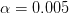

.

再过 10 个历元(即第 20 个总历元)后，

is dropped by a factor of `0.5` again, such that 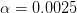, etc.

事实上，这与**图 2** ( *红线*)中描述的学习率计划完全相同。

*蓝线*显示一个更积极的下降因子`0.25`。通过数学建模，我们可以将基于阶跃的衰减方程定义为:

 / D}")

其中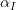

is the initial learning rate, is the factor value controlling the rate in which the learning date drops, D is the “Drop every” epochs value, and E is the current epoch.

我们的因子越大

is, the slower the learning rate will decay.

反之，系数越小

, the faster the learning rate will decay.

说了这么多，现在让我们继续实现我们的`StepDecay`类。

返回到您的`learning_rate_schedulers.py`文件并插入以下代码:

```py
class StepDecay(LearningRateDecay):
	def __init__(self, initAlpha=0.01, factor=0.25, dropEvery=10):
		# store the base initial learning rate, drop factor, and
		# epochs to drop every
		self.initAlpha = initAlpha
		self.factor = factor
		self.dropEvery = dropEvery

	def __call__(self, epoch):
		# compute the learning rate for the current epoch
		exp = np.floor((1 + epoch) / self.dropEvery)
		alpha = self.initAlpha * (self.factor ** exp)

		# return the learning rate
		return float(alpha)

```

**第 20 行**定义了我们的`StepDecay`类的构造函数。然后，我们存储初始学习速率(`initAlpha`)、丢弃因子和`dropEvery`历元值(**第 23-25 行**)。

`__call__`功能:

*   接受当前的`epoch`号。
*   根据上面详述的基于步长的衰减公式计算学习率(**第 29 行和第 30 行**)。
*   返回当前时期的计算学习率(**行 33** )。

在这篇文章的后面，你会看到如何使用这个学习进度计划。

### Keras 中的线性和多项式学习率计划

我最喜欢的两个学习率时间表是**线性学习率衰减**和**多项式学习率衰减**。

使用这些方法，我们的**学习率在固定数量的时期**内衰减为零。

学习率衰减的速率基于多项式函数的参数。较小的多项式指数/幂将导致学习速率“更慢地”衰减，而较大的指数使学习速率“更快地”衰减。

方便的是，这两种方法都可以在一个类中实现:

```py
class PolynomialDecay(LearningRateDecay):
	def __init__(self, maxEpochs=100, initAlpha=0.01, power=1.0):
		# store the maximum number of epochs, base learning rate,
		# and power of the polynomial
		self.maxEpochs = maxEpochs
		self.initAlpha = initAlpha
		self.power = power

	def __call__(self, epoch):
		# compute the new learning rate based on polynomial decay
		decay = (1 - (epoch / float(self.maxEpochs))) ** self.power
		alpha = self.initAlpha * decay

		# return the new learning rate
		return float(alpha)

```

**第 36 行**定义了我们的`PolynomialDecay`类的构造函数，它需要三个值:

*   我们将接受训练的总次数。
*   `initAlpha`:初始学习率。
*   `power`:多项式的幂/指数。

**注意，如果你设置`power=1.0`，那么你有一个线性学习率衰减。**

**行 45 和 46** 计算当前时期的调整学习率，而**行 49** 返回新的学习率。

### 实施我们的培训脚本

现在，我们已经实现了一些不同的 Keras 学习率计划，让我们看看如何在实际的培训脚本中使用它们。

在编辑器中创建一个名为`train.py` file 的文件，并插入以下代码:

```py
# set the matplotlib backend so figures can be saved in the background
import matplotlib
matplotlib.use("Agg")

# import the necessary packages
from pyimagesearch.learning_rate_schedulers import StepDecay
from pyimagesearch.learning_rate_schedulers import PolynomialDecay
from pyimagesearch.resnet import ResNet
from sklearn.preprocessing import LabelBinarizer
from sklearn.metrics import classification_report
from tensorflow.keras.callbacks import LearningRateScheduler
from tensorflow.keras.optimizers import SGD
from tensorflow.keras.datasets import cifar10
import matplotlib.pyplot as plt
import numpy as np
import argparse

```

**第 2-16 行**导入所需的包。**第 3 行**设置`matplotlib`后端，这样我们可以创建图像文件。我们最显著的进口产品包括:

*   `StepDecay`:我们的类，计算并绘制基于步长的学习率衰减。
*   `PolynomialDecay`:我们写的计算基于多项式的学习率衰减的类。
*   我们在 Keras 中实现的卷积神经网络。
*   一个 Keras 回调。我们将把我们的学习率`schedule`传递给这个类，它将在每个时期结束时被调用作为回调来计算我们的学习率。

让我们继续，[解析我们的命令行参数](https://pyimagesearch.com/2018/03/12/python-argparse-command-line-arguments/):

```py
# construct the argument parser and parse the arguments
ap = argparse.ArgumentParser()
ap.add_argument("-s", "--schedule", type=str, default="",
	help="learning rate schedule method")
ap.add_argument("-e", "--epochs", type=int, default=100,
	help="# of epochs to train for")
ap.add_argument("-l", "--lr-plot", type=str, default="lr.png",
	help="path to output learning rate plot")
ap.add_argument("-t", "--train-plot", type=str, default="training.png",
	help="path to output training plot")
args = vars(ap.parse_args())

```

当通过终端调用脚本时，我们的脚本接受四个命令行参数中的任何一个:

*   `--schedule`:学习率进度法。有效选项包括“标准”、“步进”、“线性”、“多边形”。默认情况下，不会使用学习率计划。
*   `--epochs`:训练的时期数(`default=100`)。
*   `--lr-plot`:输出图的路径。我建议用更具描述性的路径+文件名来覆盖`lr.png`的`default`。
*   `--train-plot`:输出精度/损耗训练历史图的路径。我再次建议一个描述性的路径+文件名，否则`training.png`将被`default`设置。

有了导入和命令行参数，现在是时候**初始化我们的学习速率时间表:**

```py
# store the number of epochs to train for in a convenience variable,
# then initialize the list of callbacks and learning rate scheduler
# to be used
epochs = args["epochs"]
callbacks = []
schedule = None

# check to see if step-based learning rate decay should be used
if args["schedule"] == "step":
	print("[INFO] using 'step-based' learning rate decay...")
	schedule = StepDecay(initAlpha=1e-1, factor=0.25, dropEvery=15)

# check to see if linear learning rate decay should should be used
elif args["schedule"] == "linear":
	print("[INFO] using 'linear' learning rate decay...")
	schedule = PolynomialDecay(maxEpochs=epochs, initAlpha=1e-1, power=1)

# check to see if a polynomial learning rate decay should be used
elif args["schedule"] == "poly":
	print("[INFO] using 'polynomial' learning rate decay...")
	schedule = PolynomialDecay(maxEpochs=epochs, initAlpha=1e-1, power=5)

# if the learning rate schedule is not empty, add it to the list of
# callbacks
if schedule is not None:
	callbacks = [LearningRateScheduler(schedule)]

```

**第 33 行**直接从命令行`args`变量设置我们要训练的`epochs`的数量。从那里我们将初始化我们的`callbacks`列表和学习率`schedule` ( **第 34 和 35 行**)。

**第 38-50 行**如果`args["schedule"]`包含有效值，则选择学习率`schedule`:

*   `"step"`:初始化`StepDecay`。
*   `"linear"`:用`power=1`初始化`PolynomialDecay`，表示将利用线性学习率衰减。
*   将使用带有`power=5`的`"poly"` : `PolynomialDecay`。

在你复制了本教程中的实验结果后，一定要重温一下**第 38-50 行**，并插入你自己的附加`elif`语句，这样你就可以自己运行一些实验了！

**第 54 行和第 55 行**用调度初始化`LearningRateScheduler`，作为`callbacks`列表的单个回调部分。有一种情况是不会使用学习率衰减(即，如果执行脚本时没有覆盖`--schedule`命令行参数)。

让我们继续加载我们的数据:

```py
# load the training and testing data, then scale it into the
# range [0, 1]
print("[INFO] loading CIFAR-10 data...")
((trainX, trainY), (testX, testY)) = cifar10.load_data()
trainX = trainX.astype("float") / 255.0
testX = testX.astype("float") / 255.0

# convert the labels from integers to vectors
lb = LabelBinarizer()
trainY = lb.fit_transform(trainY)
testY = lb.transform(testY)

# initialize the label names for the CIFAR-10 dataset
labelNames = ["airplane", "automobile", "bird", "cat", "deer",
	"dog", "frog", "horse", "ship", "truck"]

```

**第 60 行**加载我们的 CIFAR-10 数据。数据集已经方便地分成了训练集和测试集。

我们必须执行的唯一预处理是将数据缩放到范围*【0，1】*(**行 61 和 62** )。

**第 65-67 行**将标签二进制化，然后**第 70 和 71 行**初始化我们的`labelNames`(即类)。不要添加或更改`labelNames`列表，因为列表的顺序和长度很重要。

让我们初始化`decay`参数:

```py
# initialize the decay for the optimizer
decay = 0.0

# if we are using Keras' "standard" decay, then we need to set the
# decay parameter
if args["schedule"] == "standard":
	print("[INFO] using 'keras standard' learning rate decay...")
	decay = 1e-1 / epochs

# otherwise, no learning rate schedule is being used
elif schedule is None:
	print("[INFO] no learning rate schedule being used")

```

第 74 行初始化我们的学习速率`decay`。

如果我们使用`"standard"`学习率衰减时间表，那么衰减被初始化为`1e-1 / epochs` ( **第 78-80 行**)。

完成所有的初始化后，让我们继续编译并训练我们的`ResNet`模型:

```py
# initialize our optimizer and model, then compile it
opt = SGD(lr=1e-1, momentum=0.9, decay=decay)
model = ResNet.build(32, 32, 3, 10, (9, 9, 9),
	(64, 64, 128, 256), reg=0.0005)
model.compile(loss="categorical_crossentropy", optimizer=opt,
	metrics=["accuracy"])

# train the network
H = model.fit(x=trainX, y=trainY, validation_data=(testX, testY),
	batch_size=128, epochs=epochs, callbacks=callbacks, verbose=1)

```

我们的随机梯度下降(`SGD`)优化器使用我们的`decay`在**第 87 行**初始化。

从那里，**行 88 和 89** 构建我们的`ResNet` CNN，输入形状为 *32x32x3* 和 10 个类。关于 ResNet 的深入复习，一定要参考*第 10 章:ResNet* of [***用 Python 进行计算机视觉的深度学习***](https://pyimagesearch.com/deep-learning-computer-vision-python-book/) 。

我们的`model`是用`"categorical_crossentropy"`的`loss`函数编译的，因为我们的数据集有 **> 2** 个类。如果你使用一个不同的只有 2 个类的数据集，一定要使用`loss="binary_crossentropy"`。

**94、95 线**踢我们的训练流程。**注意，我们已经提供了`callbacks`作为参数。**每个历元完成后会调用`callbacks`。其中包含的`LearningRateScheduler`将处理我们的学习率衰减(只要`callbacks`不是空列表)。

最后，让我们评估我们的网络并生成图表:

```py
# evaluate the network
print("[INFO] evaluating network...")
predictions = model.predict(x=testX, batch_size=128)
print(classification_report(testY.argmax(axis=1),
	predictions.argmax(axis=1), target_names=labelNames))

# plot the training loss and accuracy
N = np.arange(0, args["epochs"])
plt.style.use("ggplot")
plt.figure()
plt.plot(N, H.history["loss"], label="train_loss")
plt.plot(N, H.history["val_loss"], label="val_loss")
plt.plot(N, H.history["accuracy"], label="train_acc")
plt.plot(N, H.history["val_accuracy"], label="val_acc")
plt.title("Training Loss and Accuracy on CIFAR-10")
plt.xlabel("Epoch #")
plt.ylabel("Loss/Accuracy")
plt.legend()
plt.savefig(args["train_plot"])

# if the learning rate schedule is not empty, then save the learning
# rate plot
if schedule is not None:
	schedule.plot(N)
	plt.savefig(args["lr_plot"])

```

***2020-06-11 更新:**为了使该绘图片段与 TensorFlow 2+兼容，更新了`H.history`字典键，以完全拼出“精度”而没有“acc”(即`H.history["val_accuracy"]`和`H.history["accuracy"]`)。“val”没有拼成“validation”，这有点令人困惑；我们必须学会热爱 API 并与之共存，并永远记住这是一项正在进行的工作，世界各地的许多开发人员都为此做出了贡献。*

**第 99-101 行**评估我们的网络，并将分类报告打印到我们的终端。

**第 104-115 行**生成并保存我们的训练历史图(准确度/损失曲线)。**第 119-121 行**生成学习率图表，如果适用。我们将在下一节中检查这些绘图可视化。

### Keras 学习率计划结果

实施了(1)学习率计划和(2)培训脚本后，让我们进行一些实验，看看哪种学习率计划在给定的情况下表现最佳:

1.  初始学习率为`1e-1`
2.  总共`100`个时期的训练

#### 实验#1:没有学习率衰减/进度

作为基线，让我们首先在 CIFAR-10 上训练我们的 ResNet 模型，没有学习率衰减或时间表:

```py
$ python train.py --train-plot output/train_no_schedule.png
[INFO] loading CIFAR-10 data...
[INFO] no learning rate schedule being used
Epoch 1/100
391/391 [==============================] - 35s 89ms/step - loss: 2.0893 - accuracy: 0.4525 - val_loss: 1.7665 - val_accuracy: 0.5566
Epoch 2/100
391/391 [==============================] - 34s 88ms/step - loss: 1.4742 - accuracy: 0.6599 - val_loss: 1.4228 - val_accuracy: 0.6673
Epoch 3/100
391/391 [==============================] - 33s 86ms/step - loss: 1.1942 - accuracy: 0.7456 - val_loss: 1.4430 - val_accuracy: 0.6697
...
Epoch 98/100
391/391 [==============================] - 33s 86ms/step - loss: 0.5259 - accuracy: 0.9554 - val_loss: 1.0222 - val_accuracy: 0.8232
Epoch 99/100
391/391 [==============================] - 34s 86ms/step - loss: 0.5176 - accuracy: 0.9570 - val_loss: 0.9845 - val_accuracy: 0.8386
Epoch 100/100
391/391 [==============================] - 34s 86ms/step - loss: 0.5328 - accuracy: 0.9516 - val_loss: 0.9788 - val_accuracy: 0.8414
[INFO] evaluating network...
              precision    recall  f1-score   support

    airplane       0.84      0.88      0.86      1000
  automobile       0.92      0.94      0.93      1000
        bird       0.85      0.74      0.79      1000
         cat       0.67      0.77      0.72      1000
        deer       0.80      0.87      0.83      1000
         dog       0.89      0.64      0.74      1000
        frog       0.90      0.86      0.88      1000
       horse       0.76      0.95      0.84      1000
        ship       0.92      0.90      0.91      1000
       truck       0.94      0.85      0.90      1000

    accuracy                           0.84     10000
   macro avg       0.85      0.84      0.84     10000
weighted avg       0.85      0.84      0.84     10000

```

[](https://pyimagesearch.com/wp-content/uploads/2019/07/train_no_schedule.png)

**Figure 3:** Our first experiment for training ResNet on CIFAR-10 does not have learning rate decay.

在这里，我们获得了 **~85%的准确度**，但是正如我们所看到的，验证损失和准确度在第 15 个时期后停滞不前，并且在其余的 100 个时期内没有改善。

我们现在的目标是利用学习率计划来击败我们 85%的准确率(没有过度拟合)。

#### 实验:#2: Keras 标准优化器学习率衰减

在我们的第二个实验中，我们将使用 Keras 的基于衰减的标准学习速率表:

```py
$ python train.py --schedule standard --train-plot output/train_standard_schedule.png
[INFO] loading CIFAR-10 data...
[INFO] using 'keras standard' learning rate decay...
Epoch 1/100
391/391 [==============================] - 37s 95ms/step - loss: 2.0800 - accuracy: 0.4342 - val_loss: 1.8035 - val_accuracy: 0.5263
Epoch 2/100
391/391 [==============================] - 34s 87ms/step - loss: 1.5053 - accuracy: 0.6380 - val_loss: 1.4067 - val_accuracy: 0.6742
Epoch 3/100
391/391 [==============================] - 34s 86ms/step - loss: 1.2313 - accuracy: 0.7293 - val_loss: 1.3025 - val_accuracy: 0.7043
...
Epoch 98/100
391/391 [==============================] - 34s 87ms/step - loss: 0.1746 - accuracy: 1.0000 - val_loss: 0.9269 - val_accuracy: 0.8112
Epoch 99/100
391/391 [==============================] - 34s 86ms/step - loss: 0.1741 - accuracy: 0.9999 - val_loss: 0.9301 - val_accuracy: 0.8123
Epoch 100/100
391/391 [==============================] - 34s 86ms/step - loss: 0.1732 - accuracy: 1.0000 - val_loss: 0.9210 - val_accuracy: 0.8151
[INFO] evaluating network...
              precision    recall  f1-score   support

    airplane       0.84      0.84      0.84      1000
  automobile       0.89      0.92      0.91      1000
        bird       0.72      0.76      0.74      1000
         cat       0.67      0.65      0.66      1000
        deer       0.78      0.78      0.78      1000
         dog       0.75      0.73      0.74      1000
        frog       0.85      0.85      0.85      1000
       horse       0.87      0.83      0.85      1000
        ship       0.89      0.92      0.90      1000
       truck       0.88      0.88      0.88      1000

    accuracy                           0.82     10000
   macro avg       0.81      0.82      0.81     10000
weighted avg       0.81      0.82      0.81     10000

```

[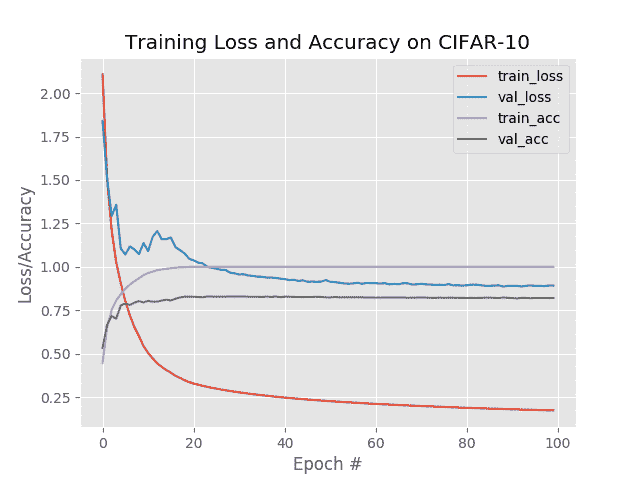](https://pyimagesearch.com/wp-content/uploads/2019/07/train_standard_schedule.png)

**Figure 4:** Our second learning rate decay schedule experiment uses Keras’ standard learning rate decay schedule.

这一次我们只获得了 81%的正确率，这表明，学习率衰减/时间安排将永远提高你的成绩，而不是 T2！你需要小心你使用的学习进度。

#### 实验#3:基于步骤的学习率计划结果

让我们继续执行基于步骤的学习率计划，这将使我们的学习率每 15 个时期下降 0.25 倍:

```py
$ python train.py --schedule step --lr-plot output/lr_step_schedule.png --train-plot output/train_step_schedule.png
[INFO] using 'step-based' learning rate decay...
[INFO] loading CIFAR-10 data...
Epoch 1/100
391/391 [==============================] - 35s 89ms/step - loss: 2.1558 - accuracy: 0.4447 - val_loss: 1.7844 - val_accuracy: 0.5635 - lr: 0.1000
Epoch 2/100
391/391 [==============================] - 34s 86ms/step - loss: 1.5154 - accuracy: 0.6567 - val_loss: 1.5359 - val_accuracy: 0.6482 - lr: 0.1000
Epoch 3/100
391/391 [==============================] - 33s 86ms/step - loss: 1.2203 - accuracy: 0.7384 - val_loss: 1.3994 - val_accuracy: 0.6768 - lr: 0.1000
...
Epoch 98/100
391/391 [==============================] - 33s 86ms/step - loss: 0.1821 - accuracy: 1.0000 - val_loss: 0.7240 - val_accuracy: 0.8679 - lr: 2.4414e-05
Epoch 99/100
391/391 [==============================] - 33s 85ms/step - loss: 0.1820 - accuracy: 1.0000 - val_loss: 0.7191 - val_accuracy: 0.8693 - lr: 2.4414e-05
Epoch 100/100
391/391 [==============================] - 33s 85ms/step - loss: 0.1821 - accuracy: 1.0000 - val_loss: 0.7220 - val_accuracy: 0.8680 - lr: 2.4414e-05
[INFO] evaluating network...
              precision    recall  f1-score   support

    airplane       0.86      0.90      0.88      1000
  automobile       0.94      0.94      0.94      1000
        bird       0.83      0.80      0.81      1000
         cat       0.74      0.74      0.74      1000
        deer       0.84      0.84      0.84      1000
         dog       0.83      0.79      0.81      1000
        frog       0.88      0.91      0.89      1000
       horse       0.93      0.90      0.91      1000
        ship       0.91      0.94      0.92      1000
       truck       0.92      0.92      0.92      1000

    accuracy                           0.87     10000
   macro avg       0.87      0.87      0.87     10000
weighted avg       0.87      0.87      0.87     10000

```

[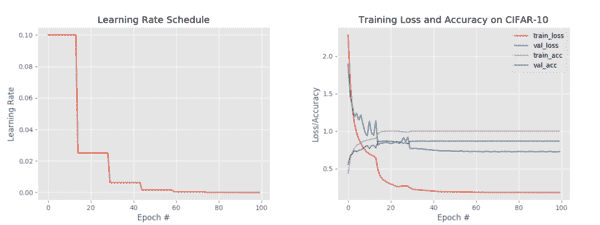](https://pyimagesearch.com/wp-content/uploads/2019/07/keras_learning_rates_step_output.png)

**Figure 5:** Experiment #3 demonstrates a step-based learning rate schedule (*left*). The training history accuracy/loss curves are shown on the *right*.

**图 5** ( *左*)可视化我们的学习率计划表。注意在每 15 个周期之后，我们的学习速度是如何下降的，产生了“阶梯”效应。

**图 5** ( *右*)展示了基于步骤的学习率计划的经典标志——您可以清楚地看到我们的:

1.  培训/验证损失减少
2.  培训/验证准确性提高

…当我们的学习速度下降时。

这在前两次下降(时期 15 和 30)中特别明显，之后下降变得不明显。

**这种类型的急剧下降是正在使用的基于步长的学习率计划的典型标志——如果你在论文、出版物或其他教程中看到这种类型的训练行为，你几乎可以肯定他们使用了基于步长的衰减！**

回到我们的精确度，我们现在达到了 87%的精确度，比我们第一次实验有所提高。

#### 实验#4:线性学习率计划结果

让我们通过设置`power=1.0`来尝试使用 Keras 的线性学习率计划:

```py
$ python train.py --schedule linear --lr-plot output/lr_linear_schedule.png --train-plot output/train_linear_schedule.png
[INFO] using 'linear' learning rate decay...
[INFO] loading CIFAR-10 data...
Epoch 1/100
391/391 [==============================] - 35s 89ms/step - loss: 2.1397 - accuracy: 0.4394 - val_loss: 2.5532 - val_accuracy: 0.4208 - lr: 0.1000
Epoch 2/100
391/391 [==============================] - 34s 86ms/step - loss: 1.5470 - accuracy: 0.6350 - val_loss: 1.4195 - val_accuracy: 0.6732 - lr: 0.0990
Epoch 3/100
391/391 [==============================] - 33s 85ms/step - loss: 1.2511 - accuracy: 0.7252 - val_loss: 1.2352 - val_accuracy: 0.7238 - lr: 0.0980
...
Epoch 98/100
391/391 [==============================] - 33s 86ms/step - loss: 0.1047 - accuracy: 1.0000 - val_loss: 0.6106 - val_accuracy: 0.8719 - lr: 0.0030
Epoch 99/100
391/391 [==============================] - 33s 86ms/step - loss: 0.1043 - accuracy: 1.0000 - val_loss: 0.6091 - val_accuracy: 0.8718 - lr: 0.0020
Epoch 100/100
391/391 [==============================] - 33s 86ms/step - loss: 0.1040 - accuracy: 1.0000 - val_loss: 0.6094 - val_accuracy: 0.8724 - lr: 0.0010
[INFO] evaluating network...
              precision    recall  f1-score   support

    airplane       0.87      0.89      0.88      1000
  automobile       0.93      0.95      0.94      1000
        bird       0.83      0.81      0.82      1000
         cat       0.74      0.75      0.75      1000
        deer       0.88      0.84      0.86      1000
         dog       0.82      0.79      0.80      1000
        frog       0.90      0.93      0.91      1000
       horse       0.92      0.91      0.91      1000
        ship       0.93      0.94      0.93      1000
       truck       0.92      0.92      0.92      1000

    accuracy                           0.87     10000
   macro avg       0.87      0.87      0.87     10000
weighted avg       0.87      0.87      0.87     10000

```

[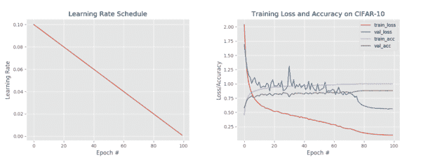](https://pyimagesearch.com/wp-content/uploads/2019/07/keras_learning_rates_linear_output.png)

**Figure 6:** Linear learning rate decay (*left*) applied to ResNet on CIFAR-10 over 100 epochs with Keras. The training accuracy/loss curve is displayed on the *right*.

**图 6** ( *左*)显示我们的学习率随着时间线性下降，而**图 6** ( *右*)可视化我们的培训历史。

我们现在看到训练和验证损失的急剧下降，特别是在大约 75 年以后；但是，请注意，我们的训练损失比验证损失下降得快得多——我们可能有过度拟合的风险。

无论如何，我们现在在我们的数据上获得了 87%的准确率，类似于**实验 3** (基于步骤)。

#### 实验#5:多项式学习率计划结果

作为最后一个实验，让我们通过设置`power=5`将多项式学习率调度应用于 Keras:

```py
$ python train.py --schedule poly --lr-plot output/lr_poly_schedule.png --train-plot output/train_poly_schedule.png
[INFO] using 'polynomial' learning rate decay...
[INFO] loading CIFAR-10 data...
Epoch 1/100
391/391 [==============================] - 35s 89ms/step - loss: 2.1474 - accuracy: 0.4376 - val_loss: 2.0406 - val_accuracy: 0.4850 - lr: 0.1000
Epoch 2/100
391/391 [==============================] - 34s 86ms/step - loss: 1.5195 - accuracy: 0.6429 - val_loss: 1.5406 - val_accuracy: 0.6380 - lr: 0.0951
Epoch 3/100
391/391 [==============================] - 34s 86ms/step - loss: 1.2210 - accuracy: 0.7337 - val_loss: 1.3527 - val_accuracy: 0.6878 - lr: 0.0904
...
Epoch 98/100
391/391 [==============================] - 34s 86ms/step - loss: 0.1548 - accuracy: 1.0000 - val_loss: 0.6880 - val_accuracy: 0.8627 - lr: 2.4300e-09
Epoch 99/100
391/391 [==============================] - 34s 86ms/step - loss: 0.1548 - accuracy: 1.0000 - val_loss: 0.6824 - val_accuracy: 0.8636 - lr: 3.2000e-10
Epoch 100/100
391/391 [==============================] - 33s 85ms/step - loss: 0.1549 - accuracy: 1.0000 - val_loss: 0.6883 - val_accuracy: 0.8651 - lr: 1.0000e-11
[INFO] evaluating network...
              precision    recall  f1-score   support

    airplane       0.86      0.90      0.88      1000
  automobile       0.93      0.94      0.93      1000
        bird       0.84      0.78      0.81      1000
         cat       0.75      0.72      0.73      1000
        deer       0.87      0.85      0.86      1000
         dog       0.78      0.82      0.80      1000
        frog       0.87      0.90      0.88      1000
       horse       0.91      0.89      0.90      1000
        ship       0.93      0.94      0.93      1000
       truck       0.91      0.92      0.91      1000

    accuracy                           0.87     10000
   macro avg       0.86      0.87      0.86     10000
weighted avg       0.86      0.87      0.86     10000

```

[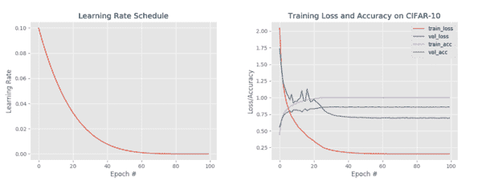](https://pyimagesearch.com/wp-content/uploads/2019/07/keras_learning_rates_poly_output.png)

**Figure 7:** Polynomial-based learning decay results using Keras.

**图 7** ( *左*)可视化了我们的学习率现在根据我们的多项式函数衰减的事实，而**图 7** ( *右*)绘制了我们的训练历史。

这一次我们获得了 86-87%的准确率。

### 学习率计划实验述评

我们最好的实验来自我们的第四个实验，在那里我们使用了线性学习率计划。

但是，这是否意味着我们应该总是使用线性学习率计划？

不，事实上，远非如此。

这里的关键要点是:

*   特定数据集(CIFAR-10)
*   特定神经网络架构(ResNet)
*   1e-2 的初始学习率
*   训练时期的数量(100)

线性学习率计划效果最好。

没有两个深度学习项目是相同的，因此您需要运行自己的一组实验，*包括改变初始学习速率和总周期数*，以确定合适的学习速率时间表(本教程的*“总结”*部分也包含了额外的注释)。

### 是否存在其他学习费率表？

还存在其他学习速率表，事实上，任何可以接受一个时期或批号作为输入并返回学习速率的数学函数都可以被认为是“学习速率表”。你可能会遇到的另外两种学习速率表包括 **(1)指数学习速率衰减**，以及 **(2)周期学习速率**。

我不经常使用指数衰减，因为我发现线性和多项式衰减已经足够了，但是如果您愿意，我们非常欢迎您创建`LearningRateDecay`类的子类并实现指数衰减。

另一方面，循环学习率非常强大——我们将在本系列后面的教程中讨论循环学习率。

### 我如何选择我的初始学习率？

你会注意到，在本教程中，我们没有改变我们的学习速率，我们将它保持在`1e-2`不变。

在进行您自己的实验时，您需要结合:

1.  学习费率表…
2.  …学习速度不同

不要害怕混搭！

您想要探索的四个最重要的超参数包括:

1.  初始学习率
2.  训练时期的数量
3.  学习率计划
4.  正规化强度/数量(L2、辍学等。)

找到两者的适当平衡可能具有挑战性，但通过许多实验，您将能够找到一个导致高度精确的神经网络的配方。

**如果你想了解更多关于我的学习率、学习率时间表和训练你自己的神经网络的技巧、建议和最佳实践，请参考我的书， [*用 Python 进行计算机视觉的深度学习*](https://pyimagesearch.com/deep-learning-computer-vision-python-book/)** 。

## 摘要

在本教程中，您学习了如何利用 Keras 进行学习率衰减和学习率计划。

具体来说，您了解了如何使用 Keras 实施和利用许多学习率计划，包括:

*   大多数 Keras 优化器都内置了衰减时间表
*   基于步骤的学习率计划
*   线性学习率衰减
*   多项式学习速率表

在实现我们的学习率时间表后，我们在 CIFAR-10 数据集上的一组实验中评估了每个时间表。

我们的结果表明，对于初始学习速率`1e-2`，线性学习速率时间表，在`100`个时期内衰减，表现最好。

**然而，这个*并不*意味着线性学习率计划将*总是*优于其他类型的计划。**相反，这一切的意思是，对于这一点:

*   特定数据集(CIFAR-10)
*   特定神经网络架构(ResNet)
*   `1e-2`的初始学习率
*   训练时期数(`100`)

…线性学习率计划效果最好。

没有两个深度学习项目是相同的，因此你需要运行自己的一组实验， ***，包括改变初始学习速率*** ，以确定适当的学习速率计划。

我建议你保留一个实验日志，详细记录任何超参数选择和相关结果，这样你就可以参考它，并对看起来有希望的实验加倍下注。

不要期望你能够训练一个神经网络并“一劳永逸”——这很少发生。相反，你应该给自己设定一个预期，即你将进行许多实验，并在实验过程中调整超参数。机器学习、深度学习和人工智能作为一个整体是迭代的——你建立在你之前的结果之上。

在这一系列教程的后面，我还会告诉你如何选择你的初始学习速度。

**要下载这篇文章的源代码，并在 PyImageSearch 上发布未来教程时得到通知，*只需在下面的表格中输入您的电子邮件地址！***