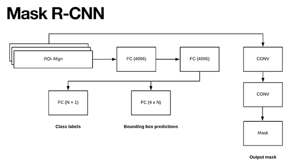
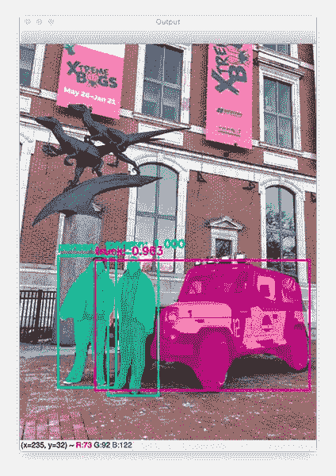
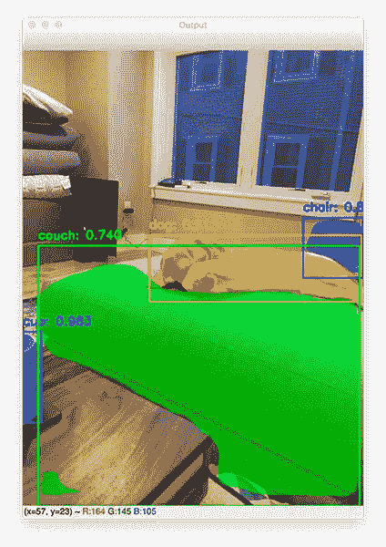
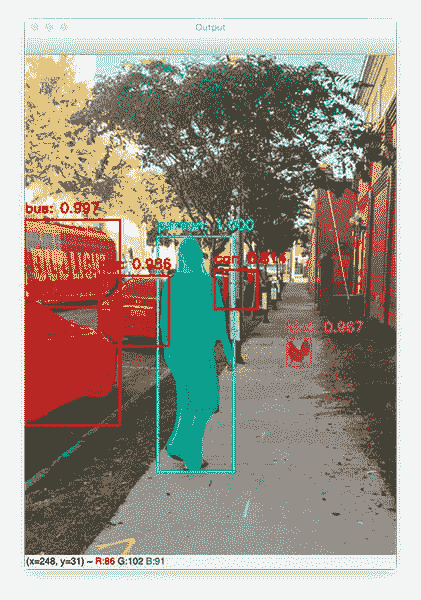

# Keras Mask R-CNN

> 原文：<https://pyimagesearch.com/2019/06/10/keras-mask-r-cnn/>


在本教程中，您将学习如何使用 Keras 和 Mask R-CNN 来执行实例分割(无论有无 GPU)。

使用掩码 R-CNN，我们可以同时执行这两项操作:

1.  **物体检测，**给出图像中每个物体的 *(x，y)*-包围盒坐标。
2.  **实例分割，**使我们能够为图像中的每个单独对象获得一个**像素式掩模**。

通过遮罩 R-CNN 进行实例分割的示例可以在本教程顶部的图像中看到——请注意，我们不仅拥有图像中对象的**边界框**,还拥有每个对象的**像素遮罩**,使我们能够**分割每个单独的对象**(这是对象检测本身无法提供的)。

实例分割和 Mask R-CNN 一起，推动了我们在计算机视觉中看到的“魔法”的一些最新进展，包括自动驾驶汽车、机器人等。

在本教程的剩余部分，您将学习如何将 Mask R-CNN 与 Keras 一起使用，包括如何在您自己的图像上执行实例分割。

**想了解更多关于 Keras 和 Mask R-CNN 的信息，*继续阅读！***

## Keras Mask R-CNN

在本教程的第一部分中，我们将简要回顾一下 Mask R-CNN 架构。从那里，我们将回顾我们这个项目的目录结构，然后在我们的系统上安装 Keras + Mask R-CNN。

然后我将向您展示如何使用 Python 实现 Mask R-CNN 和 Keras。

最后，我们将 Mask R-CNN 应用于我们自己的图像并检查结果。

我还将分享关于如何在您自己的自定义数据集上训练 Mask R-CNN 模型的资源。

### 面具 R-CNN 的历史

[](https://pyimagesearch.com/wp-content/uploads/2018/11/mask_rcnn_arch.png)

**Figure 1:** The Mask R-CNN architecture by He et al. enables object detection and pixel-wise instance segmentation. This blog post uses Keras to work with a Mask R-CNN model trained on the COCO dataset.

用于*实例分割*的掩模 R-CNN 模型已经从用于*对象检测的三个在先架构中发展而来:*

*   **R-CNN:** 将输入图像呈现给网络，对图像进行选择性搜索，然后使用预训练的 CNN 将选择性搜索的输出区域用于特征提取和分类。
*   **Fast R-CNN:** 仍然使用选择性搜索算法获取区域建议，但是增加了**感兴趣区域(ROI)池模块**。从特征映射中提取固定大小的窗口，并使用这些特征来获得最终的类标签和边界框。好处是网络现在是*端到端可训练的*。
*   **更快的 R-CNN:** 引入区域提议网络(RPN)，将区域提议*直接*烘焙到架构中，减轻了对选择性搜索算法的需求。

Mask R-CNN 算法基于之前更快的 R-CNN，使网络不仅能够执行*对象检测*，还能够执行*像素级实例分割！*

我已经深入报道了 R-CNN 面具:

1.  *“什么是面具 R-CNN？”*段 [*用 OpenCV* 屏蔽 R-CNN](https://pyimagesearch.com/2018/11/19/mask-r-cnn-with-opencv/)帖子。
2.  我的书， **[*用 Python 进行计算机视觉的深度学习*](https://pyimagesearch.com/deep-learning-computer-vision-python-book/)** 。

请参考这些资源，了解关于该架构如何工作的更多详细信息，包括 ROI Align 模块以及它如何促进实例细分。

### 项目结构

继续使用今天博客文章的 ***【下载】*** 部分下载代码和预先训练好的模型。让我们检查一下我们的 Keras Mask R-CNN 项目结构:

```py
$ tree --dirsfirst
.
├── images
│   ├── 30th_birthday.jpg
│   ├── couch.jpg
│   ├── page_az.jpg
│   └── ybor_city.jpg
├── coco_labels.txt
├── mask_rcnn_coco.h5
└── maskrcnn_predict.py

1 directory, 7 files

```

我们的项目包括一个测试目录和三个文件:

*   `coco_labels.txt`:由 81 个分类标签的逐行列表组成。第一个标签是“背景”类，所以通常我们说有 80 个类。
*   `mask_rcnn_coco.h5`:我们的预训练掩模 R-CNN 模型权重文件，将从磁盘加载。
*   `maskrcnn_predict.py`:Mask R-CNN 演示脚本加载标签和模型/权重。从那里，对通过命令行参数提供的测试图像进行推断。你可以用我们自己的图片或者 ***【下载】*** 包含的`images/`目录中的任何一张图片进行测试。

在我们回顾今天的脚本之前，我们将安装 Keras + Mask R-CNN，然后简单回顾一下 COCO 数据集。

### 安装 Keras 面罩 R-CNN

Keras + Mask R-CNN 安装过程用 pip、git 和`setup.py`直接引用。我建议您在今天项目的专用虚拟环境中安装这些包，这样就不会使系统的包树变得复杂。

首先，安装所需的 Python 包:

```py
$ pip install numpy scipy
$ pip install pillow scikit-image matplotlib imutils
$ pip install "IPython[all]"
$ pip install tensorflow # or tensorflow-gpu
$ pip install keras h5py

```

如果您的机器上安装了 GPU、CUDA 和 cuDNN，请务必安装`tensorflow-gpu`。

从那里，继续安装 OpenCV，或者通过 pip 编译[或者从源代码](https://pyimagesearch.com/2018/09/19/pip-install-opencv/)编译[:](https://pyimagesearch.com/opencv-tutorials-resources-guides/)

```py
$ pip install opencv-contrib-python

```

接下来，我们将在 Keras 中安装掩码 R-CNN 的 [Matterport 实现:](https://github.com/matterport/Mask_RCNN)

```py
$ git clone https://github.com/matterport/Mask_RCNN.git
$ cd Mask_RCNN
$ python setup.py install

```

最后，在您的虚拟环境中启动一个 Python 解释器，以验证 Mask R-CNN + Keras 和 OpenCV 已经成功安装:

```py
$ python
>>> import mrcnn
>>> import cv2
>>>

```

如果没有导入错误，那么您的环境现在已经为今天的博客文章做好了准备。

### 面具 R-CNN 和 COCO

我们今天将在这里使用的 Mask R-CNN 模型是在 COCO 数据集上预先训练的**。**

该数据集总共包括 80 个类(加上一个背景类)，您可以从输入影像中检测和分割这些类(第一个类是背景类)。我已经在与这篇文章相关的 ***【下载】*** 中包含了名为`coco_labels.txt`的标签文件，但是为了方便起见，我在这里为您包含了它们:

* * *

在下一节中，我们将学习如何使用 Keras 和 Mask R-CNN 来检测和分割这些类别。

### 用 Keras 和 Python 实现屏蔽 R-CNN

让我们开始实现 Mask R-CNN 分段脚本。

打开`maskrcnn_predict.py`并插入以下代码:

```py
# import the necessary packages
from mrcnn.config import Config
from mrcnn import model as modellib
from mrcnn import visualize
import numpy as np
import colorsys
import argparse
import imutils
import random
import cv2
import os

```

**第 2-11 行**导入我们需要的包。

`mrcnn`导入来自 Matterport 对 Mask R-CNN 的实现。从`mrcnn`开始，我们将使用`Config`为我们的配置创建一个自定义子类，`modellib`加载我们的模型，`visualize`绘制我们的遮罩。

让我们继续[解析我们的命令行参数](https://pyimagesearch.com/2018/03/12/python-argparse-command-line-arguments/):

```py
# construct the argument parse and parse the arguments
ap = argparse.ArgumentParser()
ap.add_argument("-w", "--weights", required=True,
	help="path to Mask R-CNN model weights pre-trained on COCO")
ap.add_argument("-l", "--labels", required=True,
	help="path to class labels file")
ap.add_argument("-i", "--image", required=True,
	help="path to input image to apply Mask R-CNN to")
args = vars(ap.parse_args())

```

我们的脚本需要三个命令行参数:

*   `--weights`:COCO 上预训练的我们的 Mask R-CNN 模型权重之路。
*   `--labels`:我们的 COCO 类标签文本文件的路径。
*   `--image`:我们的输入图像路径。我们将对通过命令行提供的图像执行实例分割。

使用第二个参数，让我们继续为每个变量加载我们的`CLASS_NAMES`和`COLORS`:

```py
# load the class label names from disk, one label per line
CLASS_NAMES = open(args["labels"]).read().strip().split("\n")

# generate random (but visually distinct) colors for each class label
# (thanks to Matterport Mask R-CNN for the method!)
hsv = [(i / len(CLASS_NAMES), 1, 1.0) for i in range(len(CLASS_NAMES))]
COLORS = list(map(lambda c: colorsys.hsv_to_rgb(*c), hsv))
random.seed(42)
random.shuffle(COLORS)

```

第 24 行将 COCO 类标签名称直接从文本文件加载到一个列表中。

从那里，**行 28-31** 为每个类标签生成随机的、不同的`COLORS`。方法来自 [Matterport 的 Mask R-CNN 在 GitHub](https://github.com/matterport/Mask_RCNN/blob/master/mrcnn/visualize.py#L59) 上的实现。

让我们继续构建我们的`SimpleConfig`类:

```py
class SimpleConfig(Config):
	# give the configuration a recognizable name
	NAME = "coco_inference"

	# set the number of GPUs to use along with the number of images
	# per GPU
	GPU_COUNT = 1
	IMAGES_PER_GPU = 1

	# number of classes (we would normally add +1 for the background
	# but the background class is *already* included in the class
	# names)
	NUM_CLASSES = len(CLASS_NAMES)

```

我们的`SimpleConfig`类继承自 Matterport 的 Mask R-CNN `Config` ( **第 33 行**)。

配置给定一个`NAME` ( **行 35** )。

从那里我们设置了`GPU_COUNT`和`IMAGES_PER_GPU`(即批处理)。如果你安装了 GPU 和`tensorflow-gpu`,那么 Keras + Mask R-CNN 会自动使用你的 GPU。否则，将使用您的 CPU。

***注:**我在使用单个 Titan X GPU 的机器上执行了今天的实验，所以我设置了我的`GPU_COUNT = 1`。虽然我的 12GB GPU 在技术上可以一次处理多个图像(无论是在训练期间还是在预测期间，就像在这个脚本中一样)，但我决定设置`IMAGES_PER_GPU = 1`,因为大多数读者不会有这么大内存的 GPU。如果您的 GPU 能够处理，请随意增加该值。*

然后我们的`NUM_CLASSES`被设置为等于`CLASS_NAMES`列表的长度(**第 45 行**)。

接下来，我们将初始化我们的配置并加载我们的模型:

```py
# initialize the inference configuration
config = SimpleConfig()

# initialize the Mask R-CNN model for inference and then load the
# weights
print("[INFO] loading Mask R-CNN model...")
model = modellib.MaskRCNN(mode="inference", config=config,
	model_dir=os.getcwd())
model.load_weights(args["weights"], by_name=True)

```

**第 48 行**实例化我们的`config`。

然后，使用我们的`config`、**行 53-55** 加载我们在 COCO 数据集上预先训练的掩码 R-CNN `model`。

让我们继续**执行实例分段:**

```py
# load the input image, convert it from BGR to RGB channel
# ordering, and resize the image
image = cv2.imread(args["image"])
image = cv2.cvtColor(image, cv2.COLOR_BGR2RGB)
image = imutils.resize(image, width=512)

# perform a forward pass of the network to obtain the results
print("[INFO] making predictions with Mask R-CNN...")
r = model.detect([image], verbose=1)[0]

```

**第 59-61 行**加载并预处理我们的`image`。我们的模型需要 RGB 格式的图像，所以我们使用`cv2.cvtColor`来交换颜色通道(相比之下，OpenCV 的默认 BGR 颜色通道排序)。

**线 65** 然后通过网络执行`image`的前向传递，以进行对象检测和像素式掩模预测。

剩下的两个代码块将处理结果，以便我们可以使用 OpenCV 可视化对象的边界框和遮罩:

```py
# loop over of the detected object's bounding boxes and masks
for i in range(0, r["rois"].shape[0]):
	# extract the class ID and mask for the current detection, then
	# grab the color to visualize the mask (in BGR format)
	classID = r["class_ids"][i]
	mask = r["masks"][:, :, i]
	color = COLORS[classID][::-1]

	# visualize the pixel-wise mask of the object
	image = visualize.apply_mask(image, mask, color, alpha=0.5)

```

为了可视化结果，我们开始循环对象检测(**行 68** )。在循环内部，我们:

*   抓取唯一的`classID`整数(**第 71 行**)。
*   提取当前检测的`mask`(**线 72** )。
*   确定用于`visualize`屏蔽的`color`(**线 73** )。
*   **使用半透明`alpha`通道在物体上应用/绘制我们预测的像素蒙版**(**第 76 行**)。

从这里开始，我们将为图像中的每个对象绘制边界框和类标签+分数文本:

```py
# convert the image back to BGR so we can use OpenCV's drawing
# functions
image = cv2.cvtColor(image, cv2.COLOR_RGB2BGR)

# loop over the predicted scores and class labels
for i in range(0, len(r["scores"])):
	# extract the bounding box information, class ID, label, predicted
	# probability, and visualization color
	(startY, startX, endY, endX) = r["rois"][i]
	classID = r["class_ids"][i]
	label = CLASS_NAMES[classID]
	score = r["scores"][i]
	color = [int(c) for c in np.array(COLORS[classID]) * 255]

	# draw the bounding box, class label, and score of the object
	cv2.rectangle(image, (startX, startY), (endX, endY), color, 2)
	text = "{}: {:.3f}".format(label, score)
	y = startY - 10 if startY - 10 > 10 else startY + 10
	cv2.putText(image, text, (startX, y), cv2.FONT_HERSHEY_SIMPLEX,
		0.6, color, 2)

# show the output image
cv2.imshow("Output", image)
cv2.waitKey()

```

第 80 行将我们的`image`转换回 BGR (OpenCV 的默认颜色通道排序)。

在第 83 行，我们开始遍历对象。在循环内部，我们:

*   提取包围盒坐标、`classID`、`label`、`score` ( **第 86-89 行**)。
*   计算边界框和文本的`color`(**第 90 行**)。
*   画出每个边界框(**第 93 行**)。
*   串接类别/概率`text` ( **第 94 行**)然后画在`image` ( **第 95-97 行**)的顶部。

一旦该过程完成，产生的输出`image`显示在屏幕上，直到按下一个键(**行 100-101** )。

### 屏蔽 R-CNN 和 Keras 结果

现在我们的 Mask R-CNN 脚本已经实现了，我们来试试吧。

确保您已经使用本教程的 ***【下载】*** 部分下载了源代码。

您需要了解命令行参数的概念来运行代码。如果您不熟悉，在尝试执行代码之前，请仔细阅读 [argparse 和命令行参数](https://pyimagesearch.com/2018/03/12/python-argparse-command-line-arguments/)。

准备就绪后，打开终端并执行以下命令:

```py
$ python maskrcnn_predict.py --weights mask_rcnn_coco.h5 --labels coco_labels.txt \
	--image images/30th_birthday.jpg
Using TensorFlow backend.
[INFO] loading Mask R-CNN model...
[INFO] making predictions with Mask R-CNN...
Processing 1 images
image                    shape: (682, 512, 3)         min:    0.00000  max:  255.00000  uint8
molded_images            shape: (1, 1024, 1024, 3)    min: -123.70000  max:  151.10000  float64
image_metas              shape: (1, 93)               min:    0.00000  max: 1024.00000  float64
anchors                  shape: (1, 261888, 4)        min:   -0.35390  max:    1.29134  float32

```

[](https://pyimagesearch.com/wp-content/uploads/2019/06/keras_mask_rcnn_30th_birthday.jpg)

**Figure 2:** The Mask R-CNN model trained on COCO created a pixel-wise map of the Jurassic Park jeep (truck), my friend, and me while we celebrated my 30th birthday.

在我 30 岁生日的时候，我妻子找到了一个人，开着一辆仿《侏罗纪公园》吉普车带我们在费城转了一圈——这是我和我最好的朋友在自然科学院外面。

请注意，不仅为每个对象(即人和吉普车)生成了边界框，*而且还生成了像素遮罩！*

让我们试试另一个图像:

```py
$ python maskrcnn_predict.py --weights mask_rcnn_coco.h5 --labels coco_labels.txt \
	--image images/couch.jpg
Using TensorFlow backend.
[INFO] loading Mask R-CNN model...
[INFO] making predictions with Mask R-CNN...
Processing 1 images
image                    shape: (682, 512, 3)         min:    0.00000  max:  255.00000  uint8
molded_images            shape: (1, 1024, 1024, 3)    min: -123.70000  max:  151.10000  float64
image_metas              shape: (1, 93)               min:    0.00000  max: 1024.00000  float64
anchors                  shape: (1, 261888, 4)        min:   -0.35390  max:    1.29134  float32

```

[](https://pyimagesearch.com/wp-content/uploads/2019/06/keras_mask_rcnn_couch.jpg)

**Figure 3:** My dog, Janie, has been segmented from the couch and chair using a Keras and Mask R-CNN deep learning model.

这是我的狗珍妮躺在沙发上的一张超级可爱的照片:

1.  尽管沙发上的绝大部分看不见，R-CNN 的面具 T2 仍然能够给它贴上这样的标签。
2.  掩模 R-CNN 能够正确地标记图像中的狗。
3.  尽管我的咖啡杯*几乎看不见*，面具 R-CNN 也能给杯子贴上标签(如果你仔细看，你会发现我的咖啡杯是一个*侏罗纪公园*的杯子！)

Mask R-CNN 唯一不能正确标记的图像部分是沙发的背部，它误认为是椅子——仔细看图像，你可以看到 Mask R-CNN 是如何犯错误的(该区域看起来很像椅子，而不是沙发的一部分)。

下面是使用 Keras + Mask R-CNN 进行实例分割的另一个示例:

```py
$ python maskrcnn_predict.py --weights mask_rcnn_coco.h5 --labels coco_labels.txt \
	--image images/page_az.jpg
Using TensorFlow backend.
[INFO] loading Mask R-CNN model...
[INFO] making predictions with Mask R-CNN...
Processing 1 images
image                    shape: (682, 512, 3)         min:    0.00000  max:  255.00000  uint8
molded_images            shape: (1, 1024, 1024, 3)    min: -123.70000  max:  149.10000  float64
image_metas              shape: (1, 93)               min:    0.00000  max: 1024.00000  float64
anchors                  shape: (1, 261888, 4)        min:   -0.35390  max:    1.29134  float32

```

[](https://pyimagesearch.com/wp-content/uploads/2019/06/keras_mask_rcnn_page_az.jpg)

**Figure 4:** A Mask R-CNN segmented image (created with Keras, TensorFlow, and Matterport’s Mask R-CNN implementation). This picture is of me in Page, AZ.

几年前，我和妻子去了趟亚利桑那州的佩奇(这张照片是在马蹄弯外拍摄的)——你可以看到 R-CNN 的面具不仅探测到了我，还为我的身体构建了一个像素面具。

让我们将遮罩 R-CNN 应用于一个最终图像:

```py
$ python maskrcnn_predict.py --weights mask_rcnn_coco.h5 --labels coco_labels.txt \
	--image images/ybor_city.jpg
Using TensorFlow backend.
[INFO] loading Mask R-CNN model...
[INFO] making predictions with Mask R-CNN...
Processing 1 images
image                    shape: (688, 512, 3)         min:    5.00000  max:  255.00000  uint8
molded_images            shape: (1, 1024, 1024, 3)    min: -123.70000  max:  151.10000  float64
image_metas              shape: (1, 93)               min:    0.00000  max: 1024.00000  float64
anchors                  shape: (1, 261888, 4)        min:   -0.35390  max:    1.29134  float32

```

[](https://pyimagesearch.com/wp-content/uploads/2019/06/keras_mask_rcnn_ybor_city.jpg)

**Figure 5:** Keras + Mask R-CNN with Python of a picture from Ybor City.

在美国，我最喜欢参观的城市之一是 Ybor 市——这正是我喜欢这个地区的地方(也许是因为公鸡在这个城市受到保护，可以自由漫步)。

在这里你可以看到我和这样一只公鸡——注意我们每个人是如何被面具 R-CNN 正确标记和分割的。您还会注意到，Mask R-CNN 模型能够定位每辆单独的汽车*和*标记公共汽车！

### Mask R-CNN 可以实时运行吗？

此时你可能想知道是否有可能实时运行 Keras + Mask R-CNN，对吗？

正如你从*“面具 R-CNN 的历史？”*上一节，Mask R-CNN 基于更快的 R-CNN 物体探测器。

**更快的 R-CNN 是*难以置信的*计算开销，**并且当你在对象检测之上添加实例分割时，模型只会变得*计算开销更大，因此:*

*   **在 CPU 上，**一个 Mask R-CNN 无法实时运行。
*   **但是在 GPU 上，** Mask R-CNN 最高可以达到 5-8 FPS。

如果你想半实时地运行 Mask R-CNN，你需要一个图形处理器。

## 摘要

在本教程中，您学习了如何使用 Keras + Mask R-CNN 来执行**实例分割**。

与**对象检测**不同，它只为您提供图像中对象的边界框 *(x，y)*-坐标，实例分割则更进一步， ***为每个对象生成逐像素的遮罩*** 。

使用实例分割，我们实际上可以从图像中*分割*一个对象。

为了执行实例分割，我们使用了 Matterport Keras + Mask R-CNN 实现。

然后，我们创建了一个 Python 脚本:

1.  为 Mask R-CNN 构造了一个配置类(有无 GPU 均可)。
2.  已从磁盘加载 Keras + Mask R-CNN 架构
3.  预处理我们的输入图像
4.  图像中检测到的对象/遮罩
5.  将结果可视化

**如果您对如何进行感兴趣:**

1.  标注和注释您自己的自定义图像数据集
2.  然后在你的标注数据集之上训练一个 Mask R-CNN 模型…

…然后你会想看看我的书， **[*用 Python 进行计算机视觉的深度学习*](https://pyimagesearch.com/deep-learning-computer-vision-python-book/)** ，我在那里详细地掩盖了 R-CNN 和注释。

我希望你喜欢今天的帖子！

**下载源代码(包括预先训练好的 Keras + Mask R- CNN 模型)，*只需在下面的表格中输入你的邮箱地址！*当未来的教程在 PyImageSearch 上发布时，我会通知你的。**