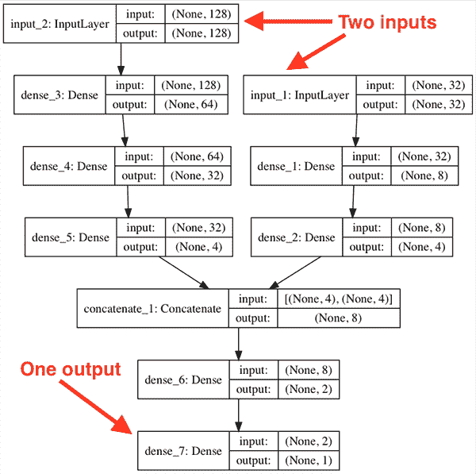
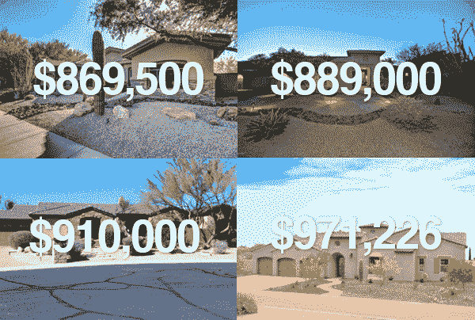
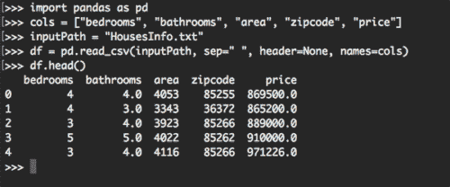
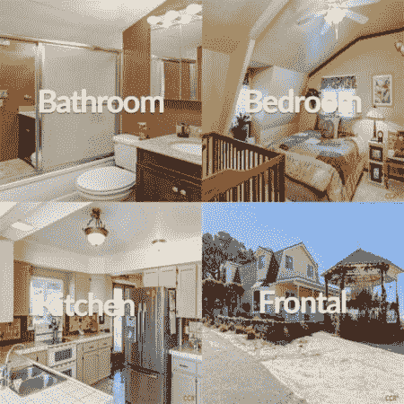
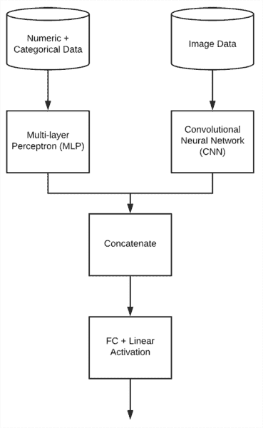

# Keras:多重输入和混合数据

> 原文：<https://pyimagesearch.com/2019/02/04/keras-multiple-inputs-and-mixed-data/>

最后更新于 2021 年 7 月 8 日。

在本教程中，您将学习如何使用 Keras 处理多输入和混合数据。

您将学习如何定义一个能够接受多种输入的 Keras 架构，包括数字、分类和图像数据。然后，我们将在这种混合数据上训练单个端到端网络。

**今天是我们关于 Keras 和回归的三部分系列的最后一部分:**

1.  [带 Keras 的基本回归](https://pyimagesearch.com/2019/01/21/regression-with-keras/)
2.  [为回归预测训练一个 Keras CNN](https://pyimagesearch.com/2019/01/28/keras-regression-and-cnns/)
3.  Keras 的多输入和混合数据(今日邮报)

在这一系列的文章中，我们在*房价预测*的背景下探索了回归预测。

我们使用的房价数据集不仅包括 ***数字和分类*****数据，还包括 ***图像数据*** —我们称多种类型的数据为 ***混合数据*** ，因为我们的模型需要能够接受我们的多种输入(不属于同一类型)并对这些输入进行预测。**

 **在本教程的剩余部分，您将学习如何:

1.  定义一个 Keras 模型，能够同时接受多个输入，包括数字、分类和图像数据**。**
2.  **在**混合数据输入**上训练端到端 Keras 模型。**
3.  **使用多输入评估我们的模型。**

 ****要了解有关 Keras 的多输入和混合数据的更多信息，*请继续阅读！***

*   【2021 年 7 月更新:添加了与一次性编码分类数据相关的问题以及学习嵌入如何帮助解决该问题的章节，*尤其是在多输入网络场景中工作时的*。

## Keras:多重输入和混合数据

***2020-06-12 更新:**此博文现已兼容 TensorFlow 2+!*

在本教程的第一部分，我们将简要回顾一下混合数据和 T2 的概念，Keras 如何接受多个输入。

从那里，我们将审查我们的房价数据集和这个项目的目录结构。

接下来，我将向您展示如何:

1.  从磁盘加载数值、分类和图像数据。
2.  对数据进行预处理，这样我们就可以在此基础上训练一个网络。
3.  准备混合数据，以便将其应用于多输入 Keras 网络。

一旦我们的数据准备好了，您将学习**如何定义和训练一个多输入 Keras 模型**，该模型在一个单一的端到端网络中接受多种类型的输入数据。

最后，我们将在我们的测试集上评估我们的多输入和混合数据模型，并将结果与我们在本系列中以前的文章进行比较。

### 什么是混合数据？

在机器学习中，混合数据是指具有多种类型的独立数据的概念。

例如，让我们假设我们是在一家医院工作的机器学习工程师，开发一个能够对病人的健康状况进行分类的系统。

对于给定的患者，我们会有多种类型的输入数据，包括:

1.  **数值/连续值，**如年龄、心率、血压
2.  **分类值，**包括性别和种族
3.  **图像数据，**如任何核磁共振、x 光等。

所有这些值构成不同的数据类型；然而，我们的机器学习模型必须能够摄取这种“混合数据”，并对其进行(准确的)预测。

当处理多种数据形式时，您会在机器学习文献中看到术语“混合数据”。

开发能够处理混合数据的机器学习系统极具挑战性，因为每种数据类型可能需要单独的预处理步骤，包括缩放、归一化和特征工程。

处理混合数据仍然是一个非常开放的研究领域，并且通常在很大程度上依赖于特定的任务/最终目标。

在今天的教程中，我们将使用混合数据来帮助您了解与之相关的一些挑战。

### Keras 如何接受多个输入？

Keras 能够通过其**功能 API 处理多个输入(甚至[多个输出](https://pyimagesearch.com/2018/06/04/keras-multiple-outputs-and-multiple-losses/))。**

了解更多关于 [*使用 TensorFlow 2.0 创建 Keras 模型的 3 种方法(顺序、函数和模型子类化)*](https://pyimagesearch.com/2019/10/28/3-ways-to-create-a-keras-model-with-tensorflow-2-0-sequential-functional-and-model-subclassing/) 。

与顺序 API(您几乎肯定已经通过`Sequential`类使用过)相反，函数 API 可用于定义更复杂的非顺序模型，包括:

*   多输入模型
*   多输出模型
*   多输入多输出的模型
*   有向无环图
*   具有共享层的模型

**例如，我们可以将简单的序列神经网络定义为:**

```py
model = Sequential()
model.add(Dense(8, input_shape=(10,), activation="relu"))
model.add(Dense(4, activation="relu"))
model.add(Dense(1, activation="linear"))

```

该网络是一个简单的前馈神经网络，有 10 个输入，第一个隐层有 8 个节点，第二个隐层有 4 个节点，最后一个输出层用于回归。

**我们可以使用函数 API 定义样本神经网络:**

```py
inputs = Input(shape=(10,))
x = Dense(8, activation="relu")(inputs)
x = Dense(4, activation="relu")(x)
x = Dense(1, activation="linear")(x)
model = Model(inputs, x)

```

注意我们不再依赖于`Sequential`类。

**要了解 Keras 函数 API 的强大功能，请考虑下面的代码，我们在其中创建了一个接受多个输入的模型:**

```py
# define two sets of inputs
inputA = Input(shape=(32,))
inputB = Input(shape=(128,))

# the first branch operates on the first input
x = Dense(8, activation="relu")(inputA)
x = Dense(4, activation="relu")(x)
x = Model(inputs=inputA, outputs=x)

# the second branch opreates on the second input
y = Dense(64, activation="relu")(inputB)
y = Dense(32, activation="relu")(y)
y = Dense(4, activation="relu")(y)
y = Model(inputs=inputB, outputs=y)

# combine the output of the two branches
combined = concatenate([x.output, y.output])

# apply a FC layer and then a regression prediction on the
# combined outputs
z = Dense(2, activation="relu")(combined)
z = Dense(1, activation="linear")(z)

# our model will accept the inputs of the two branches and
# then output a single value
model = Model(inputs=[x.input, y.input], outputs=z)

```

在这里，您可以看到我们为 Keras 神经网络定义了两个输入:

1.  `inputA` : 32-dim
2.  `inputB` : 128-dim

**第 21-23 行**使用 Keras 的功能 API 定义了一个简单的`32-8-4`网络。

类似地，**行 26-29** 定义了一个`128-64-32-4`网络。

然后*将`x`和`y`的输出在**线 32** 上组合*。`x`和`y`的输出都是四维的，所以一旦我们把它们连接起来，我们就有了一个 8 维的向量。

然后我们在第 36 行和第 37 行应用两个完全连接的层。第一层有 2 个节点，随后是 ReLU 激活，而第二层只有一个线性激活的节点(即我们的回归预测)。

构建多输入模型的最后一步是定义一个`Model`对象，它:

1.  接受我们的两个`inputs`
2.  将`outputs`定义为最后一组 FC 层(即`z`)。

如果您要使用 Keras 来可视化模型架构，它将如下所示:

[](https://pyimagesearch.com/wp-content/uploads/2019/02/keras_multi_input_arch.png)

**Figure 3:** This model has two input branches that ultimately merge and produce one output. The Keras functional API allows for this type of architecture and others you can dream up.

注意我们的模型有两个不同的分支。

第一个分支接受我们的 128-d 输入，而第二个分支接受 32-d 输入。这些分支相互独立运行，直到它们被连接在一起。从那里，从网络输出单个值。

在本教程的剩余部分，您将学习如何使用 Keras 创建多个输入网络。

### 房价数据集

[](https://pyimagesearch.com/wp-content/uploads/2019/01/keras_regression_dataset.png)

**Figure 4:** The House Prices dataset consists of both numerical/categorical data and image data. Using Keras, we’ll build a model supporting the multiple inputs and mixed data types. The result will be a Keras regression model which predicts the price/value of houses.

在这一系列帖子中，我们一直使用 Ahmed 和 Moustafa 2016 年论文中的房价数据集， [*从视觉和文本特征进行房价估计*](https://github.com/emanhamed/Houses-dataset) 。

该数据集包括数据集中 535 个示例房屋中每个房屋的**数字/分类数据**以及**图像数据**。

**数字和分类属性包括:**

1.  卧室数量
2.  浴室数量
3.  面积(即平方英尺)
4.  邮政区码

**也为每个房屋提供总共四幅图像:**

1.  卧室
2.  浴室
3.  厨房
4.  房子的正面图

在本系列的第一篇文章中，您了解了如何在数字和分类数据上训练一个 Keras 回归网络。

然后，上周，你学习了如何用 Keras CNN 进行回归。

**今天，我们将使用 Keras 处理多个输入和混合数据。**

我们将接受数字/分类数据以及我们的图像数据到网络。

将定义网络的两个分支来处理每种类型的数据。这些分支将在最后合并，以获得我们最终的房价预测。

通过这种方式，我们将能够利用 Keras 来处理多个输入和混合数据。

### 获取房价数据集

要获取今天这篇文章的源代码，请使用 ***“下载”*** 部分。获得 zip 文件后，导航到下载该文件的位置，并将其解压缩:

```py
$ cd path/to/zip
$ unzip keras-multi-input.zip
$ cd keras-multi-input

```

在那里，您可以通过以下方式下载房价数据集:

```py
$ git clone https://github.com/emanhamed/Houses-dataset

```

房价数据集现在应该在`keras-multi-input`目录中，这是我们在这个项目中使用的目录。

### 配置您的开发环境

要针对本教程配置您的系统，我建议您遵循以下任一教程:

*   [*如何在 Ubuntu 上安装 tensor flow 2.0*](https://pyimagesearch.com/2019/12/09/how-to-install-tensorflow-2-0-on-ubuntu/)
*   [*如何在 macOS 上安装 tensor flow 2.0*](https://pyimagesearch.com/2019/12/09/how-to-install-tensorflow-2-0-on-macos/)

这两个教程都将帮助您在一个方便的 Python 虚拟环境中，用这篇博文所需的所有软件来配置您的系统。

请注意 [PyImageSearch 不推荐也不支持 CV/DL 项目](https://pyimagesearch.com/faqs/single-faq/can-you-help-me-do-___-on-windows/)的窗口。

### 项目结构

让我们看看今天的项目是如何组织的:

```py
$ tree --dirsfirst --filelimit 10
.
├── Houses-dataset
│   ├── Houses\ Dataset [2141 entries]
│   └── README.md
├── pyimagesearch
│   ├── __init__.py
│   ├── datasets.py
│   └── models.py
└── mixed_training.py

3 directories, 5 files

```

Houses-dataset 文件夹包含我们在本系列中使用的房价数据集。当我们准备好运行`mixed_training.py`脚本时，您只需要提供一个路径作为数据集的[命令行参数](https://pyimagesearch.com/2018/03/12/python-argparse-command-line-arguments/)(我将在结果部分向您展示这是如何完成的)。

今天我们将回顾三个 Python 脚本:

*   `pyimagesearch/datasets.py`:处理数字/分类数据以及图像数据的加载和预处理。过去两周我们已经回顾了这个脚本，但今天我将再次向您演示。
*   `pyimagesearch/models.py`:包含我们的多层感知器(MLP)和卷积神经网络(CNN)。这些组件是我们的多输入混合数据模型的输入分支。上周我们回顾了这个脚本，今天我们也将简要回顾一下。
*   `mixed_training.py`:我们的训练脚本将使用`pyimagesearch`模块便利函数来加载+分割数据，并将两个分支连接到我们的网络+添加头。然后，它将训练和评估模型。

### 加载数值和分类数据

[](https://pyimagesearch.com/wp-content/uploads/2019/01/keras_regression_pandas.png)

**Figure 5:** We use pandas, a Python package, to read CSV housing data.

我们在我们的 [Keras regression post](https://pyimagesearch.com/2019/01/28/keras-regression-and-cnns/) 中讨论了如何加载房价数据集的数值和分类数据，但是为了完整起见，我们今天将在这里回顾一下代码(不太详细)。

如果你想要代码的详细浏览，请务必参考[之前的帖子](https://pyimagesearch.com/2019/01/28/keras-regression-and-cnns/)。

打开`datasets.py`文件并插入以下代码:

```py
# import the necessary packages
from sklearn.preprocessing import LabelBinarizer
from sklearn.preprocessing import MinMaxScaler
import pandas as pd
import numpy as np
import glob
import cv2
import os

def load_house_attributes(inputPath):
	# initialize the list of column names in the CSV file and then
	# load it using Pandas
	cols = ["bedrooms", "bathrooms", "area", "zipcode", "price"]
	df = pd.read_csv(inputPath, sep=" ", header=None, names=cols)

	# determine (1) the unique zip codes and (2) the number of data
	# points with each zip code
	zipcodes = df["zipcode"].value_counts().keys().tolist()
	counts = df["zipcode"].value_counts().tolist()

	# loop over each of the unique zip codes and their corresponding
	# count
	for (zipcode, count) in zip(zipcodes, counts):
		# the zip code counts for our housing dataset is *extremely*
		# unbalanced (some only having 1 or 2 houses per zip code)
		# so let's sanitize our data by removing any houses with less
		# than 25 houses per zip code
		if count < 25:
			idxs = df[df["zipcode"] == zipcode].index
			df.drop(idxs, inplace=True)

	# return the data frame
	return df

```

我们的进口在第 2-8 条线**处理。**

从那里我们在**的第 10-33 行**定义`load_house_attributes`函数。该函数通过第 13 行**和第 14 行**上的熊猫`pd.read_csv`以 CSV 文件的形式从房价数据集中读取数值/分类数据。

数据被过滤以适应不平衡。有些邮政编码仅由 1 或 2 个房屋代表，因此我们只需继续搜索邮政编码中房屋数量少于`25`的记录`drop` ( **第 23-30 行**)。结果是以后会有一个更精确的模型。

现在让我们定义`process_house_attributes`函数:

```py
def process_house_attributes(df, train, test):
	# initialize the column names of the continuous data
	continuous = ["bedrooms", "bathrooms", "area"]

	# performin min-max scaling each continuous feature column to
	# the range [0, 1]
	cs = MinMaxScaler()
	trainContinuous = cs.fit_transform(train[continuous])
	testContinuous = cs.transform(test[continuous])

	# one-hot encode the zip code categorical data (by definition of
	# one-hot encoding, all output features are now in the range [0, 1])
	zipBinarizer = LabelBinarizer().fit(df["zipcode"])
	trainCategorical = zipBinarizer.transform(train["zipcode"])
	testCategorical = zipBinarizer.transform(test["zipcode"])

	# construct our training and testing data points by concatenating
	# the categorical features with the continuous features
	trainX = np.hstack([trainCategorical, trainContinuous])
	testX = np.hstack([testCategorical, testContinuous])

	# return the concatenated training and testing data
	return (trainX, testX)

```

该功能通过 scikit-learn 的`MinMaxScaler` ( **第 41-43 行**)将**最小-最大缩放**应用于*连续特征*。

然后，计算*分类特征*的**一键编码**，这次是通过 scikit-learn 的`LabelBinarizer` ( **第 47-49 行**)。

然后*连续*和*分类*特征被**连接**并返回(**第 53-57 行**)。

请务必参考本系列中以前的文章，以了解我们在本节中讨论的两个函数的更多详细信息:

1.  [*回归与*](https://pyimagesearch.com/2019/01/21/regression-with-keras/)
2.  [*Keras，回归，CNN*](https://pyimagesearch.com/2019/01/28/keras-regression-and-cnns/)

### 加载影像数据集

[](https://pyimagesearch.com/wp-content/uploads/2019/01/keras_regression_cnns_houses.jpg)

**Figure 6:** One branch of our model accepts a single image — a montage of four images from the home. Using the montage combined with the numerical/categorial data input to another branch, our model then uses regression to predict the value of the home with the Keras framework.

下一步是定义一个助手函数来加载我们的输入图像。再次打开`datasets.py`文件并插入以下代码:

```py
def load_house_images(df, inputPath):
	# initialize our images array (i.e., the house images themselves)
	images = []

	# loop over the indexes of the houses
	for i in df.index.values:
		# find the four images for the house and sort the file paths,
		# ensuring the four are always in the *same order*
		basePath = os.path.sep.join([inputPath, "{}_*".format(i + 1)])
		housePaths = sorted(list(glob.glob(basePath)))

```

`load_house_images`功能有三个目标:

1.  加载房价数据集中的所有照片。回想一下，我们每栋房子有**四张照片**(**图 6** )。
2.  从四张照片中生成一张**单幅蒙太奇图像**。蒙太奇将始终按照您在图中看到的方式排列。
3.  将所有这些主蒙太奇添加到一个列表/数组中，并返回到调用函数。

从第 59 行的**开始，我们定义了接受熊猫数据帧和数据集`inputPath`的函数。**

从那里，我们继续:

*   初始化`images`列表(**行 61** )。我们将用我们创建的所有蒙太奇图像填充这个列表。
*   在我们的数据框中循环遍历房屋(**行 64** )。在循环内部，我们:
    *   获取当前房屋的四张照片的路径(**行 67 和 68** )。

让我们在循环中不断进步:

```py
		# initialize our list of input images along with the output image
		# after *combining* the four input images
		inputImages = []
		outputImage = np.zeros((64, 64, 3), dtype="uint8")

		# loop over the input house paths
		for housePath in housePaths:
			# load the input image, resize it to be 32 32, and then
			# update the list of input images
			image = cv2.imread(housePath)
			image = cv2.resize(image, (32, 32))
			inputImages.append(image)

		# tile the four input images in the output image such the first
		# image goes in the top-right corner, the second image in the
		# top-left corner, the third image in the bottom-right corner,
		# and the final image in the bottom-left corner
		outputImage[0:32, 0:32] = inputImages[0]
		outputImage[0:32, 32:64] = inputImages[1]
		outputImage[32:64, 32:64] = inputImages[2]
		outputImage[32:64, 0:32] = inputImages[3]

		# add the tiled image to our set of images the network will be
		# trained on
		images.append(outputImage)

	# return our set of images
	return np.array(images)

```

到目前为止，代码已经完成了上面讨论的第一个目标(为每个房子获取四个房子图像)。让我们总结一下`load_house_images`函数:

*   仍然在循环中，我们:
    *   执行初始化(**第 72 行和第 73 行**)。我们的`inputImages`将以列表形式包含每条记录的四张照片。我们的`outputImage`将是照片的蒙太奇(像**图 6** )。
    *   循环 4 张照片(**第 76 行**):
        *   将每张照片加载、调整大小并附加到`inputImages` ( **第 79-81 行**)。
    *   用以下方法为四个房屋图像(**行 87-90** )创建拼贴(蒙太奇):
        *   左上角的*中的浴室图像。*
        *   右上角中的*卧室图像。*
        *   右下中*的正视图。*
        *   厨房在*左下方*。
    *   将拼贴/蒙太奇`outputImage`追加到`images` ( **第 94 行**)。
*   跳出循环，我们将所有的`images`以一个 NumPy 数组的形式`return`(**行 97** )。

我们将拥有和我们训练的记录一样多的`images`(记住，我们在`process_house_attributes`函数中删除了一些记录)。

我们平铺的每个`images`将看起来像**图 6** (当然没有覆盖的文本)。您可以看到其中的四张照片被安排在一个蒙太奇中(我使用了更大的图像尺寸，这样我们可以更好地可视化代码在做什么)。正如我们的数字和分类属性代表房子一样，这四张照片(平铺成一张图像)将代表房子的视觉美学。

如果您需要更详细地回顾这个过程，请务必参考上周的帖子。

### 定义我们的多层感知器(MLP)和卷积神经网络(CNN)

[](https://pyimagesearch.com/wp-content/uploads/2019/02/keras_multi_input_design.png)

**Figure 7:** Our Keras multi-input + mixed data model has one branch that accepts the numerical/categorical data *(left)* and another branch that accepts image data in the form a 4-photo montage *(right)*.

正如您到目前为止所收集的，我们不得不使用多个库仔细地处理我们的数据:Pandas、scikit-learn、OpenCV 和 NumPy。

此时，我们已经通过`datasets.py`组织并预处理了数据集的两种形态:

*   数字和分类数据
*   图像数据

我们用来实现这一点的技能是通过经验+实践、机器学习最佳实践以及这篇博文背后的一点点调试开发出来的。请不要忽视我们到目前为止使用数据按摩技巧所讨论的内容，因为这是我们项目成功的关键。

让我们换个话题，讨论我们将使用 Keras 的 functional API 构建的多输入和混合数据网络。

**为了建立我们的多输入网络，我们需要两个分支:**

*   第一个分支将是一个**简单的多层感知器(MLP)** ，用于处理**分类/数字输入**。
*   第二个分支将是一个**卷积神经网络**，对**图像数据**进行操作。
*   这些**分支**然后将**连接**在一起，形成最终的**多输入 Keras 模型**。

我们将在下一节中处理最终级联多输入模型的构建，我们当前的任务是定义这两个分支。

打开`models.py`文件并插入以下代码:

```py
# import the necessary packages
from tensorflow.keras.models import Sequential
from tensorflow.keras.layers import BatchNormalization
from tensorflow.keras.layers import Conv2D
from tensorflow.keras.layers import MaxPooling2D
from tensorflow.keras.layers import Activation
from tensorflow.keras.layers import Dropout
from tensorflow.keras.layers import Dense
from tensorflow.keras.layers import Flatten
from tensorflow.keras.layers import Input
from tensorflow.keras.models import Model

def create_mlp(dim, regress=False):
	# define our MLP network
	model = Sequential()
	model.add(Dense(8, input_dim=dim, activation="relu"))
	model.add(Dense(4, activation="relu"))

	# check to see if the regression node should be added
	if regress:
		model.add(Dense(1, activation="linear"))

	# return our model
	return model

```

**2-11 线**处理我们的 Keras 进口。您将在这个脚本中看到每个导入的函数/类。

我们的**分类/数字数据**将由一个简单的多层感知器(MLP)处理。

MLP 由第 13-24 行**上的`create_mlp`定义。**

在本系列的第一篇文章[中详细讨论过，MLP 依赖于 Keras `Sequential` API。我们的 MLP 非常简单:](https://pyimagesearch.com/2019/01/21/regression-with-keras/)

*   带有 ReLU `activation` ( **线 16** )的全连接(`Dense`)输入层。
*   一个全连通的隐藏层，也有 ReLU `activation` ( **Line 17** )。
*   最后，一个具有线性激活的**可选**回归输出(**行 20 和 21** )。

虽然我们在第一篇文章中使用了 MLP 的回归输出，但它**不会在这个多输入、混合数据网络中使用**。您很快就会看到，我们将显式地设置`regress=False`，尽管它也是默认设置。**回归实际上稍后将在*整个*多输入、混合数据网络**(图 7**的底部**)的头部执行。

MLP ***支路*** 在**线路 24** 返回。

回头参考**图 7** ，我们现在已经建立了网络的左上角分支*。*

现在让我们定义一下我们网络的右上角的分支，CNN:

```py
def create_cnn(width, height, depth, filters=(16, 32, 64), regress=False):
	# initialize the input shape and channel dimension, assuming
	# TensorFlow/channels-last ordering
	inputShape = (height, width, depth)
	chanDim = -1

	# define the model input
	inputs = Input(shape=inputShape)

	# loop over the number of filters
	for (i, f) in enumerate(filters):
		# if this is the first CONV layer then set the input
		# appropriately
		if i == 0:
			x = inputs

		# CONV => RELU => BN => POOL
		x = Conv2D(f, (3, 3), padding="same")(x)
		x = Activation("relu")(x)
		x = BatchNormalization(axis=chanDim)(x)
		x = MaxPooling2D(pool_size=(2, 2))(x)

```

`create_cnn`函数处理**图像数据**并接受五个参数:

*   `width`:输入图像的宽度，单位为像素。
*   `height`:输入图像有多少像素高。
*   `depth`:我们输入图像的通道数。对于 RGB 彩色图像，它是三。
*   一组逐渐变大的过滤器，这样我们的网络可以学习更多有区别的特征。
*   `regress`:一个布尔值，表示是否将一个全连接的线性激活层附加到 CNN 用于回归目的。

我们网络的`inputShape`定义在**线 29** 上。它假设 TensorFlow 后端的“最后频道”排序。

通过**线 33** 上的`inputShape`定义模型的`Input`。

从那里，我们开始循环过滤器，并创建一组`CONV => RELU > BN => POOL` 层。循环的每次迭代都会附加这些层。如果你不熟悉这些图层类型的更多信息，请务必查看第 11 章的*入门包*的 *[的【使用 Python 进行计算机视觉的深度学习】](https://pyimagesearch.com/deep-learning-computer-vision-python-book/)* 。

让我们完成我们网络的 CNN 分支:

```py
	# flatten the volume, then FC => RELU => BN => DROPOUT
	x = Flatten()(x)
	x = Dense(16)(x)
	x = Activation("relu")(x)
	x = BatchNormalization(axis=chanDim)(x)
	x = Dropout(0.5)(x)

	# apply another FC layer, this one to match the number of nodes
	# coming out of the MLP
	x = Dense(4)(x)
	x = Activation("relu")(x)

	# check to see if the regression node should be added
	if regress:
		x = Dense(1, activation="linear")(x)

	# construct the CNN
	model = Model(inputs, x)

	# return the CNN
	return model

```

我们`Flatten`下一层(**第 49 行**)，然后添加一个带有`BatchNormalization`和`Dropout` ( **第 50-53 行**)的全连接层。

应用另一个全连接层来匹配来自多层感知器的四个节点(**行 57 和 58** )。匹配节点的数量不是必需的，但它有助于平衡分支。

在**行 61 和 62** 上，进行检查以查看是否应该附加回归节点；然后相应地添加它。**同样，我们也不会在这个分支的末尾进行回归。**回归将在多输入、混合数据网络的头部进行(图 7**的最底部)。**

最后，这个模型是由我们的`inputs`和我们组装在一起的所有图层`x` ( **第 65 行**)构建而成的。

然后我们可以`return`CNN***分支*** 来调用函数( **Line 68** )。

现在我们已经定义了多输入 Keras 模型的两个分支***，让我们学习如何将它们结合起来！***

 *### 使用 Keras 的多输入

现在，我们已经准备好构建最终的 Keras 模型，它能够处理多个输入和混合数据。这是 ***分支*聚集**的地方，也是“魔法”最终发生的地方。训练也将发生在这个脚本中。

创建一个名为`mixed_training.py`的新文件，打开它，并插入以下代码:

```py
# import the necessary packages
from pyimagesearch import datasets
from pyimagesearch import models
from sklearn.model_selection import train_test_split
from tensorflow.keras.layers import Dense
from tensorflow.keras.models import Model
from tensorflow.keras.optimizers import Adam
from tensorflow.keras.layers import concatenate
import numpy as np
import argparse
import locale
import os

# construct the argument parser and parse the arguments
ap = argparse.ArgumentParser()
ap.add_argument("-d", "--dataset", type=str, required=True,
	help="path to input dataset of house images")
args = vars(ap.parse_args())

```

首先处理我们的导入和命令行参数。

值得注意的进口包括:

*   `datasets`:我们的三个便利功能，用于加载/处理 CSV 数据和加载/预处理来自房屋数据集中的房屋照片。
*   我们的 MLP 和 CNN 输入分支，将作为我们的多输入、混合数据。
*   一个 scikit-learn 函数来构造我们的训练/测试数据分割。
*   `concatenate`:一个特殊的 Keras 函数，它将接受多个输入。
*   `argparse`:处理解析[命令行参数](https://pyimagesearch.com/2018/03/12/python-argparse-command-line-arguments/)。

在第 15-18 行、`--dataset`中，我们有一个命令行参数需要解析，这是下载房价数据集的路径。

让我们加载数值/分类数据和图像数据:

```py
# construct the path to the input .txt file that contains information
# on each house in the dataset and then load the dataset
print("[INFO] loading house attributes...")
inputPath = os.path.sep.join([args["dataset"], "HousesInfo.txt"])
df = datasets.load_house_attributes(inputPath)

# load the house images and then scale the pixel intensities to the
# range [0, 1]
print("[INFO] loading house images...")
images = datasets.load_house_images(df, args["dataset"])
images = images / 255.0

```

在这里，我们将房价数据集加载为熊猫数据帧(**第 23 行和第 24 行**)。

然后我们已经加载了我们的`images`，并将它们缩放到范围*【0，1】*(**第 29-30 行**)。

如果您需要了解这些功能的作用，请务必查看上面的`load_house_attributes`和`load_house_images`功能。

既然我们的数据已经加载，我们将构建我们的培训/测试分割，调整价格，并处理房屋属性:

```py
# partition the data into training and testing splits using 75% of
# the data for training and the remaining 25% for testing
print("[INFO] processing data...")
split = train_test_split(df, images, test_size=0.25, random_state=42)
(trainAttrX, testAttrX, trainImagesX, testImagesX) = split

# find the largest house price in the training set and use it to
# scale our house prices to the range [0, 1] (will lead to better
# training and convergence)
maxPrice = trainAttrX["price"].max()
trainY = trainAttrX["price"] / maxPrice
testY = testAttrX["price"] / maxPrice

# process the house attributes data by performing min-max scaling
# on continuous features, one-hot encoding on categorical features,
# and then finally concatenating them together
(trainAttrX, testAttrX) = datasets.process_house_attributes(df,
	trainAttrX, testAttrX)

```

我们的培训和测试分割是在**第 35 行和第 36 行**上构建的。我们将 75%的数据用于训练，25%的数据用于测试。

从那里，我们从训练集中找到`maxPrice`(**行 41** ，并相应地缩放训练和测试数据(**行 42 和 43** )。使定价数据在范围*【0，1】*内会导致更好的训练和收敛。

最后，我们继续通过对连续特征执行最小-最大缩放和对分类特征执行一键编码来处理我们的房屋属性。`process_house_attributes`函数处理这些动作，并将连续和分类特征连接在一起，返回结果(**第 48 和 49 行**)。

准备好变魔术了吗？

好吧，我撒谎了。在下一个代码块中实际上没有任何“魔法”在进行！但是我们将`concatenate`我们网络的分支并完成我们的多输入 Keras 网络:

```py
# create the MLP and CNN models
mlp = models.create_mlp(trainAttrX.shape[1], regress=False)
cnn = models.create_cnn(64, 64, 3, regress=False)

# create the input to our final set of layers as the *output* of both
# the MLP and CNN
combinedInput = concatenate([mlp.output, cnn.output])

# our final FC layer head will have two dense layers, the final one
# being our regression head
x = Dense(4, activation="relu")(combinedInput)
x = Dense(1, activation="linear")(x)

# our final model will accept categorical/numerical data on the MLP
# input and images on the CNN input, outputting a single value (the
# predicted price of the house)
model = Model(inputs=[mlp.input, cnn.input], outputs=x)

```

当您已经组织好代码和模型时，用 Keras 处理多个输入是非常容易的。

在**第 52 和 53 行**，我们创建了我们的`mlp`和`cnn`模型。请注意`regress=False`——我们的回归头稍后出现在**行 62** 。

然后我们将`concatenate`如**行 57** 所示的`mlp.output`和`cnn.output`。我称之为我们的`combinedInput`，因为它是网络其余部分的输入(来自**图 3** 这是两个分支汇合的`concatenate_1`)。

网络中最终层的`combinedInput`基于 MLP 和 CNN 分支的`8-4-1` FC 层的输出(因为 2 个分支中的每一个都输出 4 维 FC 层，然后我们将它们连接起来以创建 8 维向量)。

我们在`combinedInput` ( **线 61** )上加上一个有四个神经元的全连接层。

然后我们加上我们的`"linear"` `activation` **回归**头(**第 62 行**)， ***，其输出就是预测价格。***

我们的`Model`是用两个分支的`inputs`作为我们的多输入，最后一组层`x`作为`output` ( **行 67** )。

让我们继续编译、训练和评估我们新成立的`model`:

```py
# compile the model using mean absolute percentage error as our loss,
# implying that we seek to minimize the absolute percentage difference
# between our price *predictions* and the *actual prices*
opt = Adam(lr=1e-3, decay=1e-3 / 200)
model.compile(loss="mean_absolute_percentage_error", optimizer=opt)

# train the model
print("[INFO] training model...")
model.fit(
	x=[trainAttrX, trainImagesX], y=trainY,
	validation_data=([testAttrX, testImagesX], testY),
	epochs=200, batch_size=8)

# make predictions on the testing data
print("[INFO] predicting house prices...")
preds = model.predict([testAttrX, testImagesX])

```

我们的`model`是用`"mean_absolute_percentage_error"` `loss`和一个`Adam`带学习率`decay` ( **第 72 行和第 73 行**)的优化器编译的。

培训在**线 77-80** 开始。这就是所谓的拟合模型(也是所有权重通过反向传播过程进行调整的地方)。

在我们的测试数据上调用`model.predict`(**第 84 行**)允许我们获取评估我们模型的预测。现在让我们进行评估:

```py
# compute the difference between the *predicted* house prices and the
# *actual* house prices, then compute the percentage difference and
# the absolute percentage difference
diff = preds.flatten() - testY
percentDiff = (diff / testY) * 100
absPercentDiff = np.abs(percentDiff)

# compute the mean and standard deviation of the absolute percentage
# difference
mean = np.mean(absPercentDiff)
std = np.std(absPercentDiff)

# finally, show some statistics on our model
locale.setlocale(locale.LC_ALL, "en_US.UTF-8")
print("[INFO] avg. house price: {}, std house price: {}".format(
	locale.currency(df["price"].mean(), grouping=True),
	locale.currency(df["price"].std(), grouping=True)))
print("[INFO] mean: {:.2f}%, std: {:.2f}%".format(mean, std))

```

为了评估我们的模型，我们计算了绝对百分比差异(**第 89-91 行**)，并使用它来导出我们的最终指标(**第 95 和 96 行**)。

这些指标(价格平均值、价格标准偏差和绝对百分比差异的平均值+标准偏差)以适当的货币地区格式打印到终端(**行 100-103** )。

### 多输入和混合数据结果

[](https://pyimagesearch.com/wp-content/uploads/2019/01/keras_regression_predicted.png)

**Figure 8:** Real estate price prediction is a difficult task, but our Keras multi-input + mixed input regression model yields relatively good results on our limited House Prices dataset.

最后，我们准备在混合数据上训练我们的多输入网络！

确保你有:

1.  根据本系列的第一篇教程配置您的开发环境。
2.  使用本教程的 ***【下载】*** 部分下载源代码。
3.  使用上述*“获取房价数据集”*一节中的说明下载房价数据集。

从那里，打开一个终端并执行以下命令开始训练网络:

```py
$ python mixed_training.py --dataset Houses-dataset/Houses\ Dataset/
[INFO] loading house attributes...
[INFO] loading house images...
[INFO] processing data...
[INFO] training model...
Epoch 1/200
34/34 [==============================] - 0s 10ms/step - loss: 972.0082 - val_loss: 137.5819
Epoch 2/200
34/34 [==============================] - 0s 4ms/step - loss: 708.1639 - val_loss: 873.5765
Epoch 3/200
34/34 [==============================] - 0s 5ms/step - loss: 551.8876 - val_loss: 1078.9347
Epoch 4/200
34/34 [==============================] - 0s 3ms/step - loss: 347.1892 - val_loss: 888.7679
Epoch 5/200
34/34 [==============================] - 0s 4ms/step - loss: 258.7427 - val_loss: 986.9370
Epoch 6/200
34/34 [==============================] - 0s 3ms/step - loss: 217.5041 - val_loss: 665.0192
Epoch 7/200
34/34 [==============================] - 0s 3ms/step - loss: 175.1175 - val_loss: 435.5834
Epoch 8/200
34/34 [==============================] - 0s 5ms/step - loss: 156.7351 - val_loss: 465.2547
Epoch 9/200
34/34 [==============================] - 0s 4ms/step - loss: 133.5550 - val_loss: 718.9653
Epoch 10/200
34/34 [==============================] - 0s 3ms/step - loss: 115.4481 - val_loss: 880.0882
...
Epoch 191/200
34/34 [==============================] - 0s 4ms/step - loss: 23.4761 - val_loss: 23.4792
Epoch 192/200
34/34 [==============================] - 0s 5ms/step - loss: 21.5748 - val_loss: 22.8284
Epoch 193/200
34/34 [==============================] - 0s 3ms/step - loss: 21.7873 - val_loss: 23.2362
Epoch 194/200
34/34 [==============================] - 0s 6ms/step - loss: 22.2006 - val_loss: 24.4601
Epoch 195/200
34/34 [==============================] - 0s 3ms/step - loss: 22.1863 - val_loss: 23.8873
Epoch 196/200
34/34 [==============================] - 0s 4ms/step - loss: 23.6857 - val_loss: 1149.7415
Epoch 197/200
34/34 [==============================] - 0s 4ms/step - loss: 23.0267 - val_loss: 86.4044
Epoch 198/200
34/34 [==============================] - 0s 4ms/step - loss: 22.7724 - val_loss: 29.4979
Epoch 199/200
34/34 [==============================] - 0s 3ms/step - loss: 23.1597 - val_loss: 23.2382
Epoch 200/200
34/34 [==============================] - 0s 3ms/step - loss: 21.9746 - val_loss: 27.5241
[INFO] predicting house prices...
[INFO] avg. house price: $533,388.27, std house price: $493,403.08
[INFO] mean: 27.52%, std: 22.19%

```

我们的平均绝对百分比误差开始非常高，但在整个训练过程中不断下降。

在训练结束时，我们在我们的测试集上获得了 27.52% 的平均绝对百分比误差，这意味着，平均而言，我们的网络在其房价预测中将会有大约 26-27%的误差。

**让我们将这个结果与我们之前的两篇系列文章进行比较:**

1.  用*只是*一个数值/分类数据上的 MLP:**22.71%**
2.  利用*仅仅是*一个 CNN 上的图像数据: **56.91%**

**如您所见，通过**处理混合数据

1.  将我们的数字/分类数据与图像数据相结合
2.  并在混合数据上训练多输入模型…

**…产生了一个表现良好的模型，*，但甚至不如更简单的 MLP 方法*！**

***注:**由于权重初始化的随机性，如果您运行实验的次数足够多，您可能会获得与`[INFO] mean: 19.79%, std: 17.93%`一样好的结果。*

### **使用嵌入改进模型架构和准确性**

在训练多输入网络之前，我们首先需要预处理数据，包括:

1.  将最小-最大缩放应用于我们的连续特征
2.  将一键编码应用于我们的分类特征

**然而，有两个主要问题，一是对我们的分类值进行热编码:**

1.  **高维度:**如果有许多唯一的类别，那么输出的转换后的独热编码向量会变得难以管理。
2.  **没有“相似”类别的概念:**在应用一键编码后，不能保证“相似”类别在**–*维空间中比不相似的类别放置得更靠近。*

 *例如，假设我们正在尝试对水果的类别进行编码，包括:

1.  史密斯奶奶苹果
2.  甜脆苹果
3.  香蕉

直觉告诉我们，在 N 维空间中，澳洲青苹苹果和甜脆苹果应该比香蕉住得更近；然而，*一键编码不能保证这一点！*

幸运的是，我们可以通过使用神经网络学习“嵌入”来克服这个问题。不要误解我的意思，学习嵌入比简单地使用一键编码更难*；但是，模型的精度可以显著跃升，你就不用处理上面提到的两个问题了。*

 *这里有一些资源可以帮助你开始嵌入和深度学习:

*   [谷歌开发者指南](https://developers.google.com/machine-learning/crash-course/embeddings/video-lecture)
*   [了解 Keras 中的嵌入层](https://medium.com/analytics-vidhya/understanding-embedding-layer-in-keras-bbe3ff1327ce)
*   [使用 PyTorch 对表格数据进行深度学习](https://towardsdatascience.com/deep-learning-for-tabular-data-using-pytorch-1807f2858320)

## 摘要

在本教程中，您学习了如何定义能够接受多个输入的 Keras 网络。

您还学习了如何使用 Keras 处理混合数据。

为了实现这些目标，我们定义了一个多输入神经网络，它能够接受:

*   数据
*   分类数据
*   图像数据

在训练之前，数值数据被最小-最大缩放到范围*【0，1】*。我们的分类数据是一位热编码的(也确保产生的整数向量在*【0，1】*范围内)。

然后将数值和分类数据连接成一个单一的特征向量，形成 Keras 网络的第一个输入。

我们的图像数据也被缩放到范围*【0，1】*—该数据作为 Keras 网络的第二个输入。

该模型的一个分支包括严格完全连接的层(用于连接的数字和分类数据),而多输入模型的第二个分支本质上是一个小型卷积神经网络。

合并两个分支的输出，并定义单个输出(回归预测)。

通过这种方式，我们能够端到端地训练我们的多输入网络，其精度几乎与单独使用一个输入一样好。

我希望你喜欢今天的博文——如果你需要在自己的项目中处理多个输入和混合数据，一定要考虑使用本教程中的代码作为模板。

在那里，您可以根据自己的需要修改代码。

**要下载源代码，并在 PyImageSearch 上发布未来教程时得到通知，*只需在下表中输入您的电子邮件地址！**********