# Keras:多重输出和多重损失

> 原文：<https://pyimagesearch.com/2018/06/04/keras-multiple-outputs-and-multiple-losses/>

[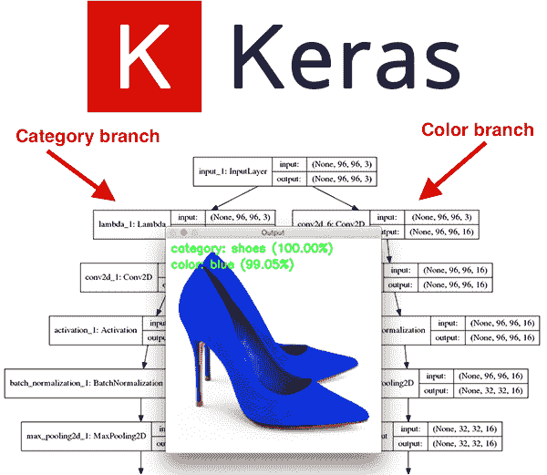](https://pyimagesearch.com/wp-content/uploads/2018/05/keras_multi_output_header.png)

几周前，我们讨论了如何使用 Keras 和深度学习来执行**多标签分类。**

 **今天我们要讨论一种更高级的技术叫做 ***多输出分类*** 。

那么，这两者有什么区别呢？你怎么能记住所有这些术语呢？

虽然这可能有点令人困惑，尤其是如果你是深度学习的新手，但这是我如何让他们保持清醒的方法:

*   在多标签分类中，你的网络在负责分类的网络末端**只有一组全连通层(即“头”)**。
*   但是在多输出分类**中，你的网络至少分支两次(有时更多)，在网络的末端创建*多组*全连接头**——然后你的网络可以预测每个头的一组类别标签，使得学习不相交的标签组合成为可能。

**你甚至可以*将*多标签分类和多输出分类结合起来，这样*每个*全连接头可以预测多个输出！**

如果这开始让你头晕，不要担心——我设计了今天的教程来指导你使用 Keras 进行多输出分类。这实际上比听起来要容易得多。

也就是说，这是我们今天讨论的一种更高级的深度学习技术，所以如果你还没有阅读我关于 ***[和 Keras](https://pyimagesearch.com/2018/05/07/multi-label-classification-with-keras/)*** 多标签分类的第一篇文章，请确保现在阅读。

在此基础上，您将准备用多个损失函数训练您的网络，并从网络获得多个输出。

**要学习如何使用 TensorFlow 和 Keras 的多输出和多损失，*继续阅读！***

## Keras:多重输出和多重损失

***2020-06-12 更新:**此博文现已兼容 TensorFlow 2+!*

[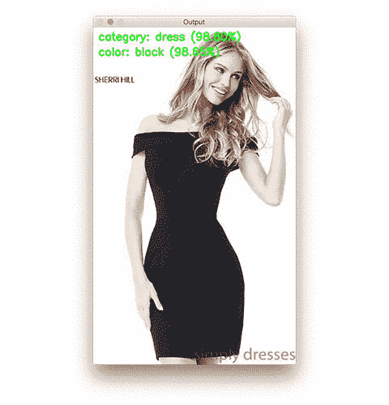](https://pyimagesearch.com/wp-content/uploads/2018/05/keras_multi_output_animation.gif)

**Figure 1:** Using Keras we can perform multi-output classification where multiple sets of fully-connected heads make it possible to learn disjoint label combinations. This animation demonstrates several multi-output classification results.

在今天的博文中，我们将学习如何利用:

*   多重损失函数
*   多输出

…使用 TensorFlow/Keras 深度学习库。

正如本教程介绍中提到的，*多标签*和*多输出*预测是有区别的。

对于多标签分类，我们利用*一个*全连接头，可以预测*多个*类别标签。

但是对于多输出分类，我们有*至少两个*全连接的头——每个头负责执行特定的分类任务。

我们甚至可以*将*多输出分类与多标签分类相结合——在这种情况下，每个多输出头也将负责计算多个标签！

您的眼睛可能开始变得模糊，或者您可能开始感到头痛，因此，与其继续讨论多输出与多标签分类，不如让我们深入了解我们的项目。我相信这篇文章中的代码会帮助你巩固这个概念。

我们首先回顾一下将用于构建多输出 Keras 分类器的数据集。

**在那里，我们将实现并训练我们的 Keras 架构 FashionNet，该架构将使用架构中的两个独立分支对服装/时尚商品进行分类:**

1.  **一个分支负责给定输入图像的服装类型**分类(例如、衬衫、连衣裙、牛仔裤、鞋子等。).
2.  而**二叉负责对服装的颜色**进行分类(黑色、红色、蓝色等。).

最后，我们将使用训练好的网络对示例图像进行分类，并获得多输出分类。

让我们开始吧！

### 多输出深度学习数据集

[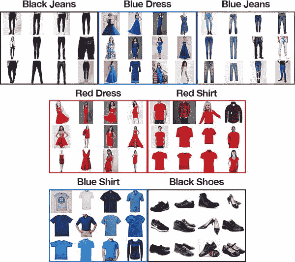](https://pyimagesearch.com/wp-content/uploads/2018/05/keras_multi_output_dataset.jpg)

**Figure 2:** Our multi-output classification dataset was created using the technique discussed in [this post](https://pyimagesearch.com/2018/04/09/how-to-quickly-build-a-deep-learning-image-dataset/). Notice that our dataset doesn’t contain red/blue shoes or black dresses/shirts. Our multi-output classification with Keras method discussed in this blog post will still be able to make correct predictions for these combinations.

我们将在今天的 Keras 多输出分类教程中使用的数据集基于我们上一篇关于[多标签分类](https://pyimagesearch.com/2018/05/07/multi-label-classification-with-keras/)的文章中的数据集，只有一个例外——我添加了一个包含 358 张“黑鞋”图像的文件夹。

总的来说，我们的数据集由跨越**七种颜色+类别组合**的**2525 张**图像组成，包括:

*   黑色牛仔裤(344 张图片)
*   黑色鞋子(358 张图片)
*   蓝色连衣裙(386 张图片)
*   蓝色牛仔裤(356 张图片)
*   蓝色衬衫(369 张图片)
*   红色连衣裙(380 张图片)
*   红色衬衫(332 张图片)

我使用我之前关于如何(快速)构建深度学习图像数据集 的教程中描述的方法创建了这个数据集。

为七种组合中的每一种下载图像并手动删除不相关图像的整个过程花费了大约 30 分钟。当建立自己的深度学习图像数据集时，确保你遵循上面链接的教程——它将为你建立自己的数据集提供一个巨大的*跳跃。*

**我们今天的目标和上次几乎一样——预测颜色和服装类型……**

**…除了能够预测*图像的服装类型和颜色之外，我们的网络没有在*上训练过。**

例如，给定以下“黑色礼服”的图像(同样，我们的网络将*而不是*被训练):

[](https://pyimagesearch.com/wp-content/uploads/2018/05/keras_multi_output_black_dress.jpg)

**Figure 3:** While images of “black dresses” are not included in today’s dataset, we’re still going to attempt to correctly classify them using multi-output classification with Keras and deep learning.

我们的目标将是正确地预测这个图像的“黑色”+“服装”。

### 配置您的开发环境

要针对本教程配置您的系统，我建议您遵循以下任一教程:

*   [*如何在 Ubuntu 上安装 tensor flow 2.0*](https://pyimagesearch.com/2019/12/09/how-to-install-tensorflow-2-0-on-ubuntu/)
*   [*如何在 macOS 上安装 tensor flow 2.0*](https://pyimagesearch.com/2019/12/09/how-to-install-tensorflow-2-0-on-macos/)

这两个教程都将帮助您在一个方便的 Python 虚拟环境中，用这篇博文所需的所有软件来配置您的系统。

请注意 [PyImageSearch 不推荐也不支持 CV/DL 项目](https://pyimagesearch.com/faqs/single-faq/can-you-help-me-do-___-on-windows/)的窗口。

### 我们的 Keras +深度学习项目结构

要完成今天的代码演练以及在您自己的图像上训练和测试 FashionNet，请滚动到 ***“下载”*** 部分，并抓取与这篇博文相关的`.zip`。

从那里，`unzip`归档并改变目录(`cd`)，如下所示。然后，利用`tree`命令，你可以有组织地查看文件和文件夹(双关语):

```py
$ unzip multi-output-classification.zip
...
$ cd multi-output-classification
$ tree --filelimit 10 --dirsfirst
.
├── dataset
│   ├── black_jeans [344 entries]
│   ├── black_shoes [358 entries]
│   ├── blue_dress [386 entries]
│   ├── blue_jeans [356 entries]
│   ├── blue_shirt [369 entries]
│   ├── red_dress [380 entries]
│   └── red_shirt [332 entries]
├── examples
│   ├── black_dress.jpg
│   ├── black_jeans.jpg
│   ├── blue_shoes.jpg
│   ├── red_shirt.jpg
│   └── red_shoes.jpg
├── output
│   ├── fashion.model
│   ├── category_lb.pickle
│   ├── color_lb.pickle
│   ├── output_accs.png
│   └── output_losses.png
├── pyimagesearch
│   ├── __init__.py
│   └── fashionnet.py
├── train.py
└── classify.py

11 directories, 14 files

```

上面你可以找到我们的项目结构，但是在我们继续之前，让我们先回顾一下内容。

有 3 个值得注意的 **Python 文件:**

*   `pyimagesearch/fashionnet.py`:我们的多输出分类网络文件包含由三种方法组成的 FashionNet 架构类:`build_category_branch`、`build_color_branch`和`build`。我们将在下一节详细回顾这些方法。
*   `train.py`:这个脚本将训练`FashionNet`模型，并在流程中生成输出文件夹中的所有文件。
*   这个脚本加载我们训练好的网络，并使用多输出分类对示例图像进行分类。

我们还有 4 个顶级**目录:**

*   我们的时尚数据集是用他们的 API 从 Bing 图片搜索中搜集来的。我们在上一节中介绍了数据集。要像我一样创建自己的数据集，请参见 [*如何(快速)构建深度学习图像数据集*](https://pyimagesearch.com/2018/04/09/how-to-quickly-build-a-deep-learning-image-dataset/) 。
*   `examples/`:在这篇博文的最后一部分，我们有一些示例图片，将与我们的`classify.py`脚本一起使用。
*   `output/`:我们的`train.py`脚本生成了一些输出文件:
    *   `fashion.model`:我们的系列化 Keras 车型。
    *   `category_lb.pickle`:sci kit-learn 为*服装类别*生成一个序列化的`LabelBinarizer`对象。这个文件可以通过我们的`classify.py`脚本加载(并召回标签)。
    *   `color_lb.pickle`:一个用于*颜色*的`LabelBinarizer`对象。
    *   `output_accs.png`:精度训练绘图图像。
    *   `output_losses.png`:损失训练图图像。
*   `pyimagesearch/`:这是一个包含`FashionNet`类的 Python 模块。

### 快速回顾我们的多输出 Keras 架构

为了使用 Keras 执行多输出预测，我们将实现一个名为 **FashionNet** 的特殊网络架构(这是我为了这篇博文而创建的)。

FashionNet 架构包含两个特殊组件，包括:

1.  **网络早期的一个分支，将网络分成两个“子网络”**——一个负责服装类型分类，另一个负责颜色分类。
2.  **网络末端的两个(不相交的)全连接头，**每个负责各自的分类职责。

在我们开始实现 FashionNet 之前，让我们来想象一下这些组件，首先是分支:

[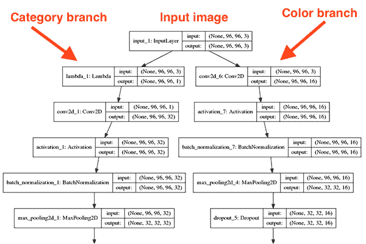](https://pyimagesearch.com/wp-content/uploads/2018/05/keras_multi_output_fashionnet_top.png)

**Figure 4:** The top of our multi-output classification network coded in Keras. The clothing category branch can be seen on the *left* and the color branch on the *right*. Each branch has a fully-connected head.

在这张网络架构图中，您可以看到我们的网络接受一个`96 x 96 x 3`输入图像。

**然后我们立即创建两个分支:**

1.  左边的*分支负责将服装*分类*。*
2.  右边*的分支*负责对*颜色*进行分类。

每个分支执行其各自的卷积、激活、批处理规范化、汇集和删除操作，直到我们得到最终输出:

[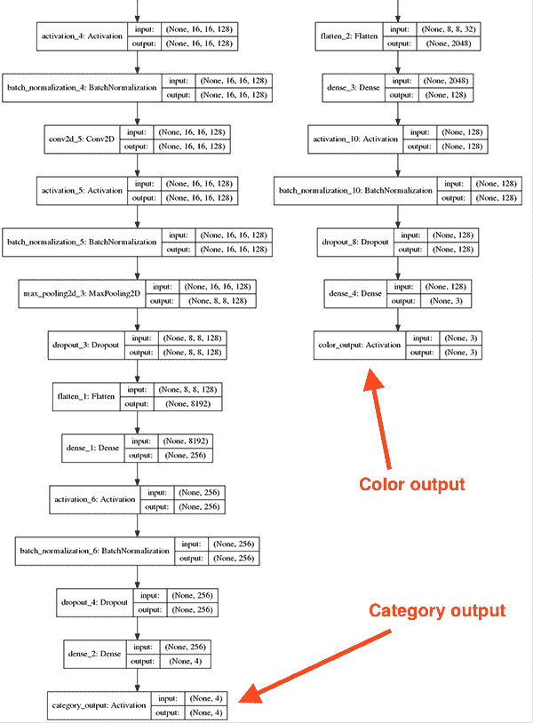](https://pyimagesearch.com/wp-content/uploads/2018/05/keras_multi_output_fashionnet_bottom.png)

**Figure 5:** Our deep learning Keras multi-output classification network makes it possible to learn disjoint label combinations.

请注意，这些全连接(FC)头集看起来如何像我们在这篇博客上研究的其他架构的 FC 层——但现在它们有两个,每个负责其给定的分类任务。

网络右侧的分支明显比左侧的分支浅(没有那么深)。预测颜色远比预测服装类别容易，因此相比之下颜色分支较浅。

为了了解如何实现这样的架构，让我们继续下一部分。

### 实施我们的“时尚网”架构

[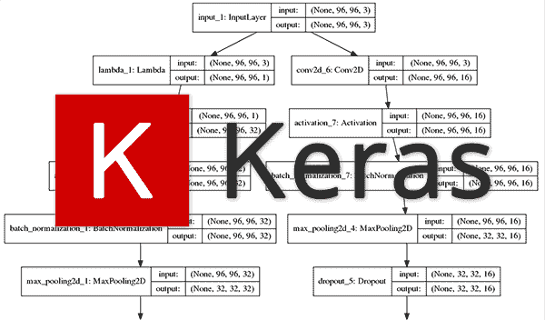](https://pyimagesearch.com/wp-content/uploads/2018/05/keras_multi_output_architecture.png)

**Figure 6:** The Keras deep learning library has all of the capability necessary to perform multi-output classification.

由于使用多个损失函数训练具有多个输出的网络是一种更高级的技术，我将假设您理解 CNN 的基础，而不是关注使多输出/多损失训练成为可能的元素。

如果你是深度学习和图像分类领域的新手，你应该考虑阅读我的书，《用 Python 进行计算机视觉的深度学习[](https://pyimagesearch.com/deep-learning-computer-vision-python-book/)*，以帮助你快速入门。*

 *在继续之前，请确保您已经从 ***“下载”*** 部分下载了文件和数据。

下载完成后，让我们打开`fashionnet.py`来回顾一下:

```py
# import the necessary packages
from tensorflow.keras.models import Model
from tensorflow.keras.layers import BatchNormalization
from tensorflow.keras.layers import Conv2D
from tensorflow.keras.layers import MaxPooling2D
from tensorflow.keras.layers import Activation
from tensorflow.keras.layers import Dropout
from tensorflow.keras.layers import Lambda
from tensorflow.keras.layers import Dense
from tensorflow.keras.layers import Flatten
from tensorflow.keras.layers import Input
import tensorflow as tf

```

我们首先从 Keras 库中导入模块，然后导入 TensorFlow 本身。

由于我们的网络由两个子网络组成，我们将定义*两个函数*负责构建每个分支。

第一个`build_category_branch`，用于对 ***服装类型*** 进行分类，定义如下:

```py
class FashionNet:
	@staticmethod
	def build_category_branch(inputs, numCategories,
		finalAct="softmax", chanDim=-1):
		# utilize a lambda layer to convert the 3 channel input to a
		# grayscale representation
		x = Lambda(lambda c: tf.image.rgb_to_grayscale(c))(inputs)

		# CONV => RELU => POOL
		x = Conv2D(32, (3, 3), padding="same")(x)
		x = Activation("relu")(x)
		x = BatchNormalization(axis=chanDim)(x)
		x = MaxPooling2D(pool_size=(3, 3))(x)
		x = Dropout(0.25)(x)

```

`build_category_branch`功能在**行 16 和 17** 上定义，有三个值得注意的参数:

*   `inputs`:我们品类分支子网的输入量。
*   `numCategories`:“连衣裙”、“鞋子”、“牛仔裤”、“衬衫”等类别的数量。
*   `finalAct`:最终激活层类型，默认为 softmax 分类器。如果您正在执行*多输出*和*多标签*分类，您可能希望将此激活更改为 sigmoid。

请密切注意**第 20 行**，我们使用`Lambda`层将我们的图像从 RGB 转换为灰度。

为什么要这么做？

不管是红色、蓝色、绿色、黑色还是紫色，裙子就是裙子，对吗？

**因此，我们决定扔掉任何颜色信息，而是专注于图像中实际的*结构组件*，确保我们的网络不会学习将特定颜色与服装类型关联起来。**

***注意:** Lambdas 在 Python 3.5 和 Python 3.6 中的工作方式不同。我用 Python 3.5 训练了这个模型，所以如果你只是用 Python 3.6 运行`classify.py`脚本来测试带有示例图像的模型，你可能会遇到困难。如果你遇到与 Lambda 层相关的错误，我建议你要么(a)尝试 Python 3.5，要么(b)在 Python 3.6 上训练和分类。**不需要修改代码。***

然后我们继续在第 23-27 行的**上构建我们的`CONV => RELU => POOL`块。注意，我们使用的是 [TensorFlow/Keras 的功能 API](https://pyimagesearch.com/2019/10/28/3-ways-to-create-a-keras-model-with-tensorflow-2-0-sequential-functional-and-model-subclassing/)；我们需要功能 API 来创建我们的分支网络结构。**

我们的第一个`CONV`层有带`3 x 3`内核的`32`滤镜和`RELU`激活(整流线性单元)。我们应用批量标准化、最大池化和 25%的退出率。

掉线是从*当前*层到*下一*层随机断开节点的过程。这种随机断开的过程自然有助于网络减少过拟合，因为层中没有一个单独的节点负责预测某个类、对象、边或角。

接下来是我们的两组`(CONV => RELU) * 2 => POOL`模块:

```py
		# (CONV => RELU) * 2 => POOL
		x = Conv2D(64, (3, 3), padding="same")(x)
		x = Activation("relu")(x)
		x = BatchNormalization(axis=chanDim)(x)
		x = Conv2D(64, (3, 3), padding="same")(x)
		x = Activation("relu")(x)
		x = BatchNormalization(axis=chanDim)(x)
		x = MaxPooling2D(pool_size=(2, 2))(x)
		x = Dropout(0.25)(x)

		# (CONV => RELU) * 2 => POOL
		x = Conv2D(128, (3, 3), padding="same")(x)
		x = Activation("relu")(x)
		x = BatchNormalization(axis=chanDim)(x)
		x = Conv2D(128, (3, 3), padding="same")(x)
		x = Activation("relu")(x)
		x = BatchNormalization(axis=chanDim)(x)
		x = MaxPooling2D(pool_size=(2, 2))(x)
		x = Dropout(0.25)(x)

```

这个代码块中过滤器、内核和池大小的变化协同工作，逐渐减小空间大小，但增加深度。

让我们用一个`FC => RELU`层将它组合在一起:

```py
		# define a branch of output layers for the number of different
		# clothing categories (i.e., shirts, jeans, dresses, etc.)
		x = Flatten()(x)
		x = Dense(256)(x)
		x = Activation("relu")(x)
		x = BatchNormalization()(x)
		x = Dropout(0.5)(x)
		x = Dense(numCategories)(x)
		x = Activation(finalAct, name="category_output")(x)

		# return the category prediction sub-network
		return x

```

最后一个激活层是完全连接的，和我们的`numCategories`有相同数量的神经元/输出。

注意我们已经在**行 57** 上命名了我们的最终激活层`"category_output"`。这很重要，因为我们将在后面的`train.py`中通过名称引用该层。

让我们定义用于构建多输出分类网络的第二个函数。这一个被命名为`build_color_branch`，顾名思义，它负责对我们图像中的**进行分类:**

```py
	@staticmethod
	def build_color_branch(inputs, numColors, finalAct="softmax",
		chanDim=-1):
		# CONV => RELU => POOL
		x = Conv2D(16, (3, 3), padding="same")(inputs)
		x = Activation("relu")(x)
		x = BatchNormalization(axis=chanDim)(x)
		x = MaxPooling2D(pool_size=(3, 3))(x)
		x = Dropout(0.25)(x)

		# CONV => RELU => POOL
		x = Conv2D(32, (3, 3), padding="same")(x)
		x = Activation("relu")(x)
		x = BatchNormalization(axis=chanDim)(x)
		x = MaxPooling2D(pool_size=(2, 2))(x)
		x = Dropout(0.25)(x)

		# CONV => RELU => POOL
		x = Conv2D(32, (3, 3), padding="same")(x)
		x = Activation("relu")(x)
		x = BatchNormalization(axis=chanDim)(x)
		x = MaxPooling2D(pool_size=(2, 2))(x)
		x = Dropout(0.25)(x)

```

我们对`build_color_branch`的参数基本上与`build_category_branch`相同。我们用`numColors`(不同于`numCategories`)来区分最后一层的激活次数。

这一次，我们不会应用一个`Lambda`灰度转换层，因为我们实际上关心的是**颜色**在网络的这个区域。如果我们转换成灰度，我们将失去所有的颜色信息！

网络的这一分支明显比服装类分支浅得多，因为手头的任务要简单得多。我们要求我们的子网络完成的只是对颜色进行分类——子网络不需要那么深。

就像我们的品类分支一样，我们还有第二个全连通的头。让我们构建`FC => RELU`块来完成:

```py
		# define a branch of output layers for the number of different
		# colors (i.e., red, black, blue, etc.)
		x = Flatten()(x)
		x = Dense(128)(x)
		x = Activation("relu")(x)
		x = BatchNormalization()(x)
		x = Dropout(0.5)(x)
		x = Dense(numColors)(x)
		x = Activation(finalAct, name="color_output")(x)

		# return the color prediction sub-network
		return x

```

为了区分颜色分支的最终激活层，我在第 94 行的**处提供了`name="color_output"`关键字参数。我们将在培训脚本中引用该名称。**

构建`FashionNet`的最后一步是将我们的两个分支放在一起，`build`最终架构:

```py
	@staticmethod
	def build(width, height, numCategories, numColors,
		finalAct="softmax"):
		# initialize the input shape and channel dimension (this code
		# assumes you are using TensorFlow which utilizes channels
		# last ordering)
		inputShape = (height, width, 3)
		chanDim = -1

		# construct both the "category" and "color" sub-networks
		inputs = Input(shape=inputShape)
		categoryBranch = FashionNet.build_category_branch(inputs,
			numCategories, finalAct=finalAct, chanDim=chanDim)
		colorBranch = FashionNet.build_color_branch(inputs,
			numColors, finalAct=finalAct, chanDim=chanDim)

		# create the model using our input (the batch of images) and
		# two separate outputs -- one for the clothing category
		# branch and another for the color branch, respectively
		model = Model(
			inputs=inputs,
			outputs=[categoryBranch, colorBranch],
			name="fashionnet")

		# return the constructed network architecture
		return model

```

我们的`build`函数定义在**行 100** 上，有 5 个自解释参数。

`build`函数假设我们使用 TensorFlow 和 channels last ordering。这在第 105 行的**中很清楚，这里我们的`inputShape`元组是显式排序的`(height, width, 3)`，其中 3 代表 RGB 通道。**

如果你想使用 TensorFlow 之外的后端*而不是*，你需要修改代码:(1)为你的后端正确的通道排序和(2)实现一个自定义层来处理 RGB 到灰度的转换。

从那里，我们定义网络的两个分支(**行 110-113** ，然后将它们放在一个`Model` ( **行 118-121** )。

**关键是我们的分支有*一个共同的输入* t，但是*两个不同的输出*(服装类型和颜色分类)。**

### 实施多输出多损失训练脚本

现在我们已经实现了我们的`FashionNet`架构，让我们来训练它吧！

当你准备好了，打开`train.py`让我们开始吧:

```py
# set the matplotlib backend so figures can be saved in the background
import matplotlib
matplotlib.use("Agg")

# import the necessary packages
from tensorflow.keras.optimizers import Adam
from tensorflow.keras.preprocessing.image import img_to_array
from sklearn.preprocessing import LabelBinarizer
from sklearn.model_selection import train_test_split
from pyimagesearch.fashionnet import FashionNet
from imutils import paths
import matplotlib.pyplot as plt
import numpy as np
import argparse
import random
import pickle
import cv2
import os

```

我们首先为脚本导入必要的包。

从那里我们解析我们的[命令行参数](https://pyimagesearch.com/2018/03/12/python-argparse-command-line-arguments/):

```py
# construct the argument parser and parse the arguments
ap = argparse.ArgumentParser()
ap.add_argument("-d", "--dataset", required=True,
	help="path to input dataset (i.e., directory of images)")
ap.add_argument("-m", "--model", required=True,
	help="path to output model")
ap.add_argument("-l", "--categorybin", required=True,
	help="path to output category label binarizer")
ap.add_argument("-c", "--colorbin", required=True,
	help="path to output color label binarizer")
ap.add_argument("-p", "--plot", type=str, default="output",
	help="base filename for generated plots")
args = vars(ap.parse_args())

```

我们将很快看到如何运行训练脚本。现在，只需要知道`--dataset`是数据集的输入文件路径，`--model`、`--categorybin`、`--colorbin`是三个输出文件路径。

或者，您可以使用`--plot`参数为生成的精度/损失图指定一个基本文件名。当我们在脚本中遇到这些命令行参数时，我会再次指出它们。如果**第 21-32 行**对你来说像希腊语，请看我的 [argparse +命令行参数](https://pyimagesearch.com/2018/03/12/python-argparse-command-line-arguments/)的博客文章。

现在，让我们建立四个重要的训练变量:

```py
# initialize the number of epochs to train for, initial learning rate,
# batch size, and image dimensions
EPOCHS = 50
INIT_LR = 1e-3
BS = 32
IMAGE_DIMS = (96, 96, 3)

```

我们在第 36-39 行的**上设置了以下变量:**

*   `EPOCHS`:历元数设置为`50`。通过实验，我发现`50`时代产生了一个低损失的模型，并且没有过度适应训练集(或者尽我们所能不过度适应)。
*   `INIT_LR`:我们的初始学习率设定为`0.001`。学习率控制着我们沿着梯度前进的“步伐”。较小的值表示较小的步长，较大的值表示较大的步长。我们很快就会看到，我们将使用 Adam 优化器，同时随着时间的推移逐渐降低学习率。
*   `BS`:我们将以`32`的批量训练我们的网络。
*   `IMAGE_DIMS`:所有输入的图像都将通过`3`通道(RGB)调整到`96 x 96`。我们正在用这些维度进行培训，我们的网络架构输入维度也反映了这些维度。当我们在后面的部分用示例图像测试我们的网络时，测试维度*必须*匹配训练维度。

我们的下一步是抓住我们的图像路径，并随机洗牌。我们还将初始化列表，分别保存图像本身以及服装类别和颜色:

```py
# grab the image paths and randomly shuffle them
print("[INFO] loading images...")
imagePaths = sorted(list(paths.list_images(args["dataset"])))
random.seed(42)
random.shuffle(imagePaths)

# initialize the data, clothing category labels (i.e., shirts, jeans,
# dresses, etc.) along with the color labels (i.e., red, blue, etc.)
data = []
categoryLabels = []
colorLabels = []

```

随后，我们将循环遍历`imagePaths`，预处理，并填充`data`、`categoryLabels`和`colorLabels`列表:

```py
# loop over the input images
for imagePath in imagePaths:
	# load the image, pre-process it, and store it in the data list
	image = cv2.imread(imagePath)
	image = cv2.resize(image, (IMAGE_DIMS[1], IMAGE_DIMS[0]))
	image = cv2.cvtColor(image, cv2.COLOR_BGR2RGB)
	image = img_to_array(image)
	data.append(image)

	# extract the clothing color and category from the path and
	# update the respective lists
	(color, cat) = imagePath.split(os.path.sep)[-2].split("_")
	categoryLabels.append(cat)
	colorLabels.append(color)

```

我们开始在**线 54** 上循环我们的`imagePaths`。

在循环内部，我们将图像加载到`IMAGE_DIMS`并调整其大小。我们还将我们的图像从 BGR 排序转换为 RGB。我们为什么要进行这种转换？回想一下我们在`build_category_branch`函数中的`FashionNet`类，我们在 Lambda 函数/层中使用了 TensorFlow 的`rgb_to_grayscale`转换。正因为如此，我们首先在**第 58 行**转换成 RGB，最终将预处理后的图像追加到`data`列表中。

接下来，仍然在循环内部，我们从当前图像所在的目录名中提取*颜色*和*类别*标签(**第 64 行**)。

要了解这一点，只需在您的终端中启动 Python，并提供一个示例`imagePath`进行实验，如下所示:

```py
$ python
>>> import os
>>> imagePath = "dataset/red_dress/00000000.jpg"
>>> (color, cat) = imagePath.split(os.path.sep)[-2].split("_")
>>> color
'red'
>>> cat
'dress'

```

当然，您可以随意组织目录结构(但是您必须修改代码)。我最喜欢的两种方法包括(1)为每个标签使用子目录，或者(2)将所有的*图像存储在一个目录中，然后创建一个 CSV 或 JSON 文件来将图像文件名映射到它们的标签。*

让我们将这三个列表转换为 NumPy 数组，将标签二进制化，并将数据划分为训练和测试部分:

```py
# scale the raw pixel intensities to the range [0, 1] and convert to
# a NumPy array
data = np.array(data, dtype="float") / 255.0
print("[INFO] data matrix: {} images ({:.2f}MB)".format(
	len(imagePaths), data.nbytes / (1024 * 1000.0)))

# convert the label lists to NumPy arrays prior to binarization
categoryLabels = np.array(categoryLabels)
colorLabels = np.array(colorLabels)

# binarize both sets of labels
print("[INFO] binarizing labels...")
categoryLB = LabelBinarizer()
colorLB = LabelBinarizer()
categoryLabels = categoryLB.fit_transform(categoryLabels)
colorLabels = colorLB.fit_transform(colorLabels)

# partition the data into training and testing splits using 80% of
# the data for training and the remaining 20% for testing
split = train_test_split(data, categoryLabels, colorLabels,
	test_size=0.2, random_state=42)
(trainX, testX, trainCategoryY, testCategoryY,
	trainColorY, testColorY) = split

```

我们最后的预处理步骤——转换成 NumPy 数组并将原始像素亮度缩放到`[0, 1]`——可以在**第 70 行**上一次性完成。

我们还将`categoryLabels`和`colorLabels`转换成 NumPy 数组(T4 第 75 行和第 76 行)。这是必要的，因为接下来我们将使用之前导入的 scikit-learn 的`LabelBinarizer`(**第 80-83 行**)对标签进行二值化。由于我们的网络有两个独立的分支，我们可以使用两个独立的标签二值化器——这不同于我们使用`MultiLabelBinarizer`(也来自 scikit-learn)的[多标签分类](https://pyimagesearch.com/2018/05/07/multi-label-classification-with-keras/)。

接下来，我们在数据集上执行典型的 80%训练/20%测试分割(**第 87-96 行**)。

让我们建立网络，定义我们的独立损失，并编译我们的模型:

```py
# initialize our FashionNet multi-output network
model = FashionNet.build(96, 96,
	numCategories=len(categoryLB.classes_),
	numColors=len(colorLB.classes_),
	finalAct="softmax")

# define two dictionaries: one that specifies the loss method for
# each output of the network along with a second dictionary that
# specifies the weight per loss
losses = {
	"category_output": "categorical_crossentropy",
	"color_output": "categorical_crossentropy",
}
lossWeights = {"category_output": 1.0, "color_output": 1.0}

# initialize the optimizer and compile the model
print("[INFO] compiling model...")
opt = Adam(lr=INIT_LR, decay=INIT_LR / EPOCHS)
model.compile(optimizer=opt, loss=losses, loss_weights=lossWeights,
	metrics=["accuracy"])

```

在**第 93-96 行**，我们实例化了我们的多输出`FashionNet`模型。当我们在其中创建`FashionNet`类和`build`函数时，我们剖析了这些参数，所以一定要看看我们在这里实际提供的值。

接下来，我们需要为全连接头(**行 101-104** )的*每个*定义*两个* `losses`。

定义多个损失是通过使用每个分支激活层名称的字典来完成的— **这就是为什么我们在 FashionNet 实现中命名我们的输出层！**每个损失将使用分类交叉熵，这是使用 *> 2* 类训练网络进行分类时使用的标准损失方法。

我们还在单独的字典中定义*等于* `lossWeights`(同名键具有相等的值)在**行 105** 上。在您的特定应用中，您可能希望将一个损失看得比另一个更重。

既然我们已经实例化了我们的模型并创建了我们的`losses` + `lossWeights`字典，让我们用学习率衰减(**行 109** )和`compile`我们的`model` ( **行 110 和 111** )初始化`Adam`优化器。

我们的下一个模块只是开始了训练过程:

```py
# train the network to perform multi-output classification
H = model.fit(x=trainX,
	y={"category_output": trainCategoryY, "color_output": trainColorY},
	validation_data=(testX,
		{"category_output": testCategoryY, "color_output": testColorY}),
	epochs=EPOCHS,
	verbose=1)

# save the model to disk
print("[INFO] serializing network...")
model.save(args["model"], save_format="h5")

```

***2020-06-12 更新:**注意，对于 TensorFlow 2.0+我们建议明确设置`save_format="h5"` (HDF5 格式)。*

回想一下**的第 87-90 行**，我们将数据分为训练(`trainX`)和测试(`testX`)。在**第 114-119 行**，我们在提供数据的同时启动训练过程。注意第 115 行，在这里我们将标签作为字典传递。第 116 行和第 117 行也是如此，我们为验证数据传入一个 2 元组。当使用 Keras 执行多输出分类时，以这种方式传递训练和验证标签是一个*要求*。我们需要指示 Keras 哪组目标标签对应于网络的哪一个输出分支。

使用我们的命令行参数(`args["model"]`)，我们将序列化的模型保存到磁盘上以备将来调用。

我们还将做同样的事情，将我们的标签二进制化器保存为序列化的 pickle 文件:

```py
# save the category binarizer to disk
print("[INFO] serializing category label binarizer...")
f = open(args["categorybin"], "wb")
f.write(pickle.dumps(categoryLB))
f.close()

# save the color binarizer to disk
print("[INFO] serializing color label binarizer...")
f = open(args["colorbin"], "wb")
f.write(pickle.dumps(colorLB))
f.close()

```

使用命令行参数路径(`args["categorybin"]`和`args["colorbin"]`)，我们将两个标签二进制化器(`categoryLB`和`colorLB`)写入磁盘上的序列化 pickle 文件。

从这里开始，所有的工作都是在这个脚本中绘制结果:

```py
# plot the total loss, category loss, and color loss
lossNames = ["loss", "category_output_loss", "color_output_loss"]
plt.style.use("ggplot")
(fig, ax) = plt.subplots(3, 1, figsize=(13, 13))

# loop over the loss names
for (i, l) in enumerate(lossNames):
	# plot the loss for both the training and validation data
	title = "Loss for {}".format(l) if l != "loss" else "Total loss"
	ax[i].set_title(title)
	ax[i].set_xlabel("Epoch #")
	ax[i].set_ylabel("Loss")
	ax[i].plot(np.arange(0, EPOCHS), H.history[l], label=l)
	ax[i].plot(np.arange(0, EPOCHS), H.history["val_" + l],
		label="val_" + l)
	ax[i].legend()

# save the losses figure
plt.tight_layout()
plt.savefig("{}_losses.png".format(args["plot"]))
plt.close()

```

上述代码块负责在单独但堆叠的图上绘制每个损失函数的损失历史，包括:

*   全损
*   类别输出的损失
*   色彩输出的损失

同样，我们将在单独的图像文件中绘制精度:

```py
# create a new figure for the accuracies
accuracyNames = ["category_output_accuracy", "color_output_accuracy"]
plt.style.use("ggplot")
(fig, ax) = plt.subplots(2, 1, figsize=(8, 8))

# loop over the accuracy names
for (i, l) in enumerate(accuracyNames):
	# plot the loss for both the training and validation data
	ax[i].set_title("Accuracy for {}".format(l))
	ax[i].set_xlabel("Epoch #")
	ax[i].set_ylabel("Accuracy")
	ax[i].plot(np.arange(0, EPOCHS), H.history[l], label=l)
	ax[i].plot(np.arange(0, EPOCHS), H.history["val_" + l],
		label="val_" + l)
	ax[i].legend()

# save the accuracies figure
plt.tight_layout()
plt.savefig("{}_accs.png".format(args["plot"]))
plt.close()

```

***2020-06-12 更新:*** *为了使这个绘图片段与 TensorFlow 2+兼容，更新了`H.history`字典键，以完全拼出“acc”而没有“ACC”(即`H.history["category_output_accuracy"]`和`H.history["color_output_accuracy"]`)。“val”没有拼成“validation”，这有点令人困惑；我们必须学会热爱 API 并与之共存，并永远记住这是一项正在进行的工作，世界各地的许多开发人员都为此做出了贡献。*

我们的类别准确度和颜色准确度图最好分开查看，因此它们作为单独的图堆叠在一个图像中。

### 训练多输出/多损失 Keras 模型

一定要使用这篇博文的 ***【下载】*** 部分来抓取代码和数据集。

***别忘了:**我用 Python 3.7 来训练本教程下载中包含的网络。只要你保持一致(Python 3.5 以上)，你就不会有 Lambda 实现不一致的问题。你甚至可以运行 Python 2.7(我没有测试过这个)。*

打开终端。然后粘贴下面的命令开始训练过程(如果你没有 GPU，你也想喝一杯啤酒):

```py
$ python train.py --dataset dataset --model output/fashion.model \
	--categorybin output/category_lb.pickle --colorbin output/color_lb.pickle
Using TensorFlow backend.
[INFO] loading images...
[INFO] data matrix: 2521 images (544.54MB)
[INFO] loading images...
[INFO] data matrix: 2521 images (544.54MB)
[INFO] binarizing labels...
[INFO] compiling model...
Epoch 1/50
63/63 [==============================] - 1s 20ms/step - loss: 0.8523 - category_output_loss: 0.5301 - color_output_loss: 0.3222 - category_output_accuracy: 0.8264 - color_output_accuracy: 0.8780 - val_loss: 3.6909 - val_category_output_loss: 1.8052 - val_color_output_loss: 1.8857 - val_category_output_accuracy: 0.3188 - val_color_output_accuracy: 0.4416
Epoch 2/50
63/63 [==============================] - 1s 14ms/step - loss: 0.4367 - category_output_loss: 0.3092 - color_output_loss: 0.1276 - category_output_accuracy: 0.9033 - color_output_accuracy: 0.9519 - val_loss: 7.0533 - val_category_output_loss: 2.9279 - val_color_output_loss: 4.1254 - val_category_output_accuracy: 0.3188 - val_color_output_accuracy: 0.4416
Epoch 3/50
63/63 [==============================] - 1s 14ms/step - loss: 0.2892 - category_output_loss: 0.1952 - color_output_loss: 0.0940 - category_output_accuracy: 0.9350 - color_output_accuracy: 0.9653 - val_loss: 6.2512 - val_category_output_loss: 2.0540 - val_color_output_loss: 4.1972 - val_category_output_accuracy: 0.4020 - val_color_output_accuracy: 0.4416
...
Epoch 48/50
63/63 [==============================] - 1s 14ms/step - loss: 0.0189 - category_output_loss: 0.0106 - color_output_loss: 0.0083 - category_output_accuracy: 0.9960 - color_output_accuracy: 0.9970 - val_loss: 0.2625 - val_category_output_loss: 0.2250 - val_color_output_loss: 0.0376 - val_category_output_accuracy: 0.9564 - val_color_output_accuracy: 0.9861
Epoch 49/50
63/63 [==============================] - 1s 14ms/step - loss: 0.0190 - category_output_loss: 0.0041 - color_output_loss: 0.0148 - category_output_accuracy: 0.9985 - color_output_accuracy: 0.9950 - val_loss: 0.2333 - val_category_output_loss: 0.1927 - val_color_output_loss: 0.0406 - val_category_output_accuracy: 0.9604 - val_color_output_accuracy: 0.9881
Epoch 50/50
63/63 [==============================] - 1s 14ms/step - loss: 0.0188 - category_output_loss: 0.0046 - color_output_loss: 0.0142 - category_output_accuracy: 0.9990 - color_output_accuracy: 0.9960 - val_loss: 0.2140 - val_category_output_loss: 0.1719 - val_color_output_loss: 0.0421 - val_category_output_accuracy: 0.9624 - val_color_output_accuracy: 0.9861
[INFO] serializing network...
[INFO] serializing category label binarizer...
[INFO] serializing color label binarizer...

```

对于我们的**类别输出**,我们获得:

*   训练集上的准确率为 99.90%
*   测试集上的准确率为 96.24%

对于**颜色输出**,我们达到了:

*   **训练集上的准确率为 99.60%**
*   测试集上的准确率为 98.61%

下面你可以找到我们每次损失的曲线图:

[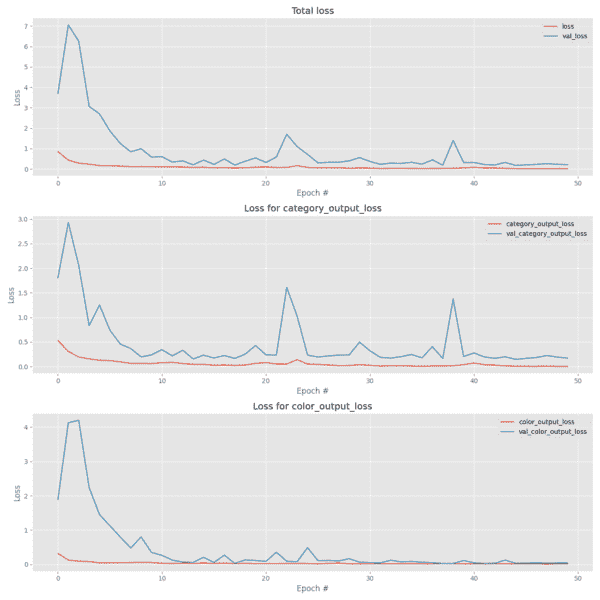](https://pyimagesearch.com/wp-content/uploads/2018/06/keras_multi_output_losses.png)

**Figure 7:** Our Keras deep learning multi-output classification training losses are plotted with matplotlib. Our total losses (*top*), clothing category losses (*middle*), and color losses (*bottom*) are plotted independently for analysis.

以及我们的多重精度:

[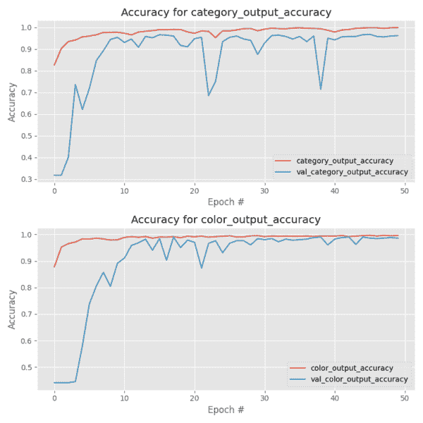](https://pyimagesearch.com/wp-content/uploads/2018/06/keras_multi_output_accs.png)

**Figure 8:** FashionNet, a multi-output classification network, is trained with Keras. In order to analyze the training it is best to show the accuracies in separate plots. Clothing category training accuracy plot (*top*). Color training accuracy plot (*bottom*).

通过应用数据增强(在我的书《用 Python 进行计算机视觉的深度学习 】中， **[*有所涉及)，可能会获得进一步的准确性。*](https://pyimagesearch.com/deep-learning-computer-vision-python-book/)**

### 实现多输出分类脚本

现在我们已经训练了我们的网络，让我们学习如何将它应用于输入图像*而不是我们训练集的*部分。

打开`classify.py`并插入以下代码:

```py
# import the necessary packages
from tensorflow.keras.preprocessing.image import img_to_array
from tensorflow.keras.models import load_model
import tensorflow as tf
import numpy as np
import argparse
import imutils
import pickle
import cv2

```

首先，我们导入所需的包，然后解析命令行参数:

```py
# construct the argument parser and parse the arguments
ap = argparse.ArgumentParser()
ap.add_argument("-m", "--model", required=True,
	help="path to trained model model")
ap.add_argument("-l", "--categorybin", required=True,
	help="path to output category label binarizer")
ap.add_argument("-c", "--colorbin", required=True,
	help="path to output color label binarizer")
ap.add_argument("-i", "--image", required=True,
	help="path to input image")
args = vars(ap.parse_args())

```

我们有四个[命令行参数](https://pyimagesearch.com/2018/03/12/python-argparse-command-line-arguments/)，它们是在您的终端上运行这个脚本所必需的:

*   `--model`:我们刚刚训练的序列化模型文件的路径(我们之前脚本的输出)。
*   `--categorybin`:类别标签二进制化器的路径(我们之前脚本的输出)。
*   `--colorbin`:色标二值化器的路径(我们之前脚本的输出)。
*   `--image`:我们的测试图像文件路径——该图像将来自我们的`examples/`目录。

在那里，我们加载图像并对其进行预处理:

```py
# load the image
image = cv2.imread(args["image"])
output = imutils.resize(image, width=400)
image = cv2.cvtColor(image, cv2.COLOR_BGR2RGB)

# pre-process the image for classification
image = cv2.resize(image, (96, 96))
image = image.astype("float") / 255.0
image = img_to_array(image)
image = np.expand_dims(image, axis=0)

```

在我们运行推理之前，需要预处理我们的图像。在上面的块中，我们加载图像，为了输出的目的调整它的大小，并交换颜色通道(**第 24-26 行**)，这样我们就可以在 FashionNet 的`Lambda`层中使用 TensorFlow 的 RGB 转灰度功能。然后，我们调整 RGB 图像的大小(从我们的训练脚本中调出`IMAGE_DIMS`，将其缩放为*【0，1】*，转换为 NumPy 数组，并为批处理添加一个维度(**第 29-32 行**)。

关键是预处理步骤遵循我们的训练脚本中采取的相同动作。

接下来，让我们加载我们的序列化模型和两个标签二进制化器:

```py
# load the trained convolutional neural network from disk, followed
# by the category and color label binarizers, respectively
print("[INFO] loading network...")
model = load_model(args["model"], custom_objects={"tf": tf})
categoryLB = pickle.loads(open(args["categorybin"], "rb").read())
colorLB = pickle.loads(open(args["colorbin"], "rb").read())

```

使用第 37-39 行的**上的四个[命令行参数](https://pyimagesearch.com/2018/03/12/python-argparse-command-line-arguments/)中的三个，我们加载`model`、`categoryLB`和`colorLB`。**

现在,( 1)多输出 Keras 模型和(2)标签二值化器都在内存中，我们可以对图像进行分类:

```py
# classify the input image using Keras' multi-output functionality
print("[INFO] classifying image...")
(categoryProba, colorProba) = model.predict(image)

# find indexes of both the category and color outputs with the
# largest probabilities, then determine the corresponding class
# labels
categoryIdx = categoryProba[0].argmax()
colorIdx = colorProba[0].argmax()
categoryLabel = categoryLB.classes_[categoryIdx]
colorLabel = colorLB.classes_[colorIdx]

```

我们在**第 43 行**上执行**多输出分类**，产生类别和颜色*的概率(分别为`categoryProba`和`colorProba`)。*

***注意:*** *我没有包括 include 代码，因为它有点冗长，但是您可以通过检查输出张量的名称来确定 TensorFlow + Keras 模型返回多个输出的顺序。详见 StackOverflow 上的[线程](https://stackoverflow.com/questions/40028175/how-do-you-get-the-name-of-the-tensorflow-output-nodes-in-a-keras-model)。*

从那里，我们将提取类别和颜色的最高概率的索引(**行 48 和 49** )。

使用高概率指数，我们可以提取类名(**行 50 和 51** )。

这似乎有点太简单了，不是吗？但这就是使用 Keras 对新输入图像应用多输出分类的全部内容！

让我们展示结果来证明这一点:

```py
# draw the category label and color label on the image
categoryText = "category: {} ({:.2f}%)".format(categoryLabel,
	categoryProba[0][categoryIdx] * 100)
colorText = "color: {} ({:.2f}%)".format(colorLabel,
	colorProba[0][colorIdx] * 100)
cv2.putText(output, categoryText, (10, 25), cv2.FONT_HERSHEY_SIMPLEX,
	0.7, (0, 255, 0), 2)
cv2.putText(output, colorText, (10, 55), cv2.FONT_HERSHEY_SIMPLEX,
	0.7, (0, 255, 0), 2)

# display the predictions to the terminal as well
print("[INFO] {}".format(categoryText))
print("[INFO] {}".format(colorText))

# show the output image
cv2.imshow("Output", output)
cv2.waitKey(0)

```

我们在我们的`output`图像上显示我们的结果(**第 54-61 行**)。如果我们遇到一件“红色连衣裙”，左上角的绿色文字看起来会像这样:

*   类别:服装(89.04%)
*   颜色:红色(95.07%)

相同的信息通过**行 64 和 65** 打印到终端，之后`output`图像显示在屏幕上(**行 68** )。

### 使用 Keras 执行多输出分类

现在是有趣的部分了！

在这一部分中，我们将在`examples`目录**中向我们的网络展示五幅图像，它们是*而不是*训练集的一部分。**

**有趣的是，我们的网络只经过专门训练，能够识别示例图像类别中的*两个*。**这前两张图片(“黑色牛仔裤”和“红色衬衫”)应该特别容易让我们的网络正确地对类别和颜色进行分类。

**剩下的三幅图像与我们的模型**完全不同——我们没有用“红鞋”、“蓝鞋”或“黑裙子”进行训练，但我们将尝试多输出分类，看看会发生什么。

让我们从“黑色牛仔裤”开始——这应该很容易，因为在训练数据集中有大量类似的图像。确保像这样使用四个[命令行参数](https://pyimagesearch.com/2018/03/12/python-argparse-command-line-arguments/):

```py
$ python classify.py --model output/fashion.model \
	--categorybin output/category_lb.pickle --colorbin output/color_lb.pickle \
	--image examples/black_jeans.jpg
Using TensorFlow backend.
[INFO] loading network...
[INFO] classifying image...
[INFO] category: jeans (100.00%)
[INFO] color: black (97.04%)

```

[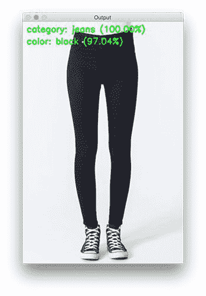](https://pyimagesearch.com/wp-content/uploads/2018/05/keras_multi_output_black_jeans.jpg)

**Figure 9:** Deep learning multi-label classification allows us to recognize disjoint label combinations such as clothing type and clothing color. Our network has correctly classified this image as both “jeans” and “black”.

正如所料，我们的网络正确地将图像分类为“牛仔裤”和“黑色”。

让我们试试“红衬衫”:

```py
$ python classify.py --model fashion.model \
	--categorybin output/category_lb.pickle --colorbin output/color_lb.pickle \
	--image examples/red_shirt.jpg
Using TensorFlow backend.
[INFO] loading network...
[INFO] classifying image...
[INFO] category: shirt (100.00%)
[INFO] color: red (100.00%)

```

[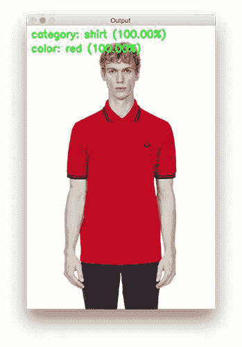](https://pyimagesearch.com/wp-content/uploads/2018/05/keras_multi_output_red_shirt.jpg)

**Figure 10:** This image of a “red shirt” is a test image which is not in our deep learning image dataset. Our Keras multi-output network has; however, seen other red shirts. It easily classifies this image with both labels at 100% confidence.

对于两个类别标签都有 100%的置信度，我们的图像肯定包含“红色衬衫”。记住，我们的网络*已经*在训练过程中看到了其他“红衫军”的例子。

现在让我们退后一步。

看一下我们的数据集，回想一下，它以前从未见过“红色的鞋子”，但它见过“红色”以“连衣裙”和“衬衫”的形式出现，以及带有“黑色”颜色的“鞋子”。

是否可以区分这个*不熟悉的测试图像*包含的*【鞋子】*就是*【红色】*？

让我们来看看:

```py
$ python classify.py --model fashion.model \
	--categorybin output/category_lb.pickle --colorbin output/color_lb.pickle \
	--image examples/red_shoes.jpgUsing TensorFlow backend.
[INFO] loading network...
[INFO] classifying image...
[INFO] category: shoes (82.20%)
[INFO] color: red (99.99%)

```

[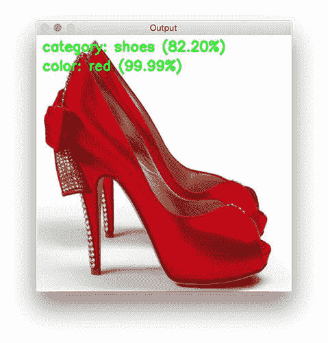](https://pyimagesearch.com/wp-content/uploads/2018/05/keras_multi_output_red_shoes.jpg)

**Figure 11:** Our deep learning multi-output classification network has never seen the combination of “red” and “shoes” before. During the training process, we did present “shoes” (albeit, “black” ones) and we did present “red” (both “shirts” and “dresses”). Amazingly, our network fires neurons resulting in the correct multi-output labels for this image of “red shoes”. Success!

答对了！

查看图像中的结果，我们成功了。

在展示不熟悉的多输出组合时，我们有了一个良好的开端。我们的网络设计+培训得到了回报，我们能够以很高的准确度识别“红鞋”。

我们还没有完成——让我们向我们的网络展示一张包含“黑色连衣裙”的图片。记住，之前在我们的 [*多标签*分类](https://pyimagesearch.com/2018/05/07/multi-label-classification-with-keras/)教程中，同样的图像**没有**产生正确的结果。

我认为这一次我们很有可能成功，所以在您的终端中键入以下命令:

```py
$ python classify.py --model fashion.model \
	--categorybin output/category_lb.pickle --colorbin output/color_lb.pickle \
	--image examples/black_dress.jpg
Using TensorFlow backend.
[INFO] loading network...
[INFO] classifying image...
[INFO] category: dress (98.80%)
[INFO] color: black (98.65%)

```

[](https://pyimagesearch.com/wp-content/uploads/2018/05/keras_multi_output_black_dress.jpg)

**Figure 12:** While images of “black dresses” are not included in today’s dataset, we’re still able to correctly classify them using multi-output classification with Keras and deep learning.

看看图片左上角的班级标签！

我们实现了对**类别**和**颜色**的正确分类，两者的报告置信度为 ***> 98%*** 准确度。我们已经完成了目标！

为了理智起见，我们再试试一个*不熟悉的组合:*“蓝鞋”。在您的终端中输入相同的命令，这次将参数`--image`改为`examples/blue_shoes.jpg`:

```py
$ python classify.py --model fashion.model \
	--categorybin output/category_lb.pickle --colorbin output/color_lb.pickle \
	--image examples/blue_shoes.jpg
Using TensorFlow backend.
[INFO] loading network...
[INFO] classifying image...
[INFO] category: shoes (100.00%)
[INFO] color: blue (99.05%)

```

[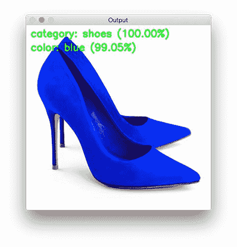](https://pyimagesearch.com/wp-content/uploads/2018/05/keras_multi_output_blue_shoes.jpg)

**Figure 13:** While *multi-label* classification may fail at unfamiliar label combinations, *multi-output* classification handles the task gracefully.

同样的交易得到了证实——我们的网络没有在“蓝色鞋子”图像上进行训练，但是我们能够通过使用我们的两个子网络以及多输出和多损失分类来正确地对它们进行分类。

## 摘要

在今天的博文中，我们学习了如何利用 Keras 深度学习库中的多个输出和多个损失函数。

为了完成这项任务，我们定义了一个称为 FashionNet 的 Keras 架构，用于**时尚/服装分类**。

FashionNet 架构包含两个分支:

1.  一个分支负责给定输入图像的服装类型分类(例如、衬衫、连衣裙、牛仔裤、鞋子等。).
2.  而第二叉负责对服装的颜色进行分类(黑色、红色、蓝色等。).

这种分支发生在网络的早期，本质上创建了两个“子网”，分别负责各自的分类任务，但都包含在同一个网络中。

最值得注意的是，多输出分类使我们能够解决我们之前关于[多标签分类](https://pyimagesearch.com/2018/05/07/multi-label-classification-with-keras/)的帖子中的一个麻烦，其中:

*   我们在六个类别上训练我们的网络，包括:黑色牛仔裤、蓝色连衣裙、蓝色牛仔裤、蓝色衬衫、红色连衣裙和红色衬衫…
*   …但是我们无法对“黑色礼服”进行分类，因为我们的网络之前从未见过这种数据组合！

通过创建两个完全连接的头部和相关的子网络(如有必要),我们可以训练一个头部对服装类型进行分类，另一个头部可以学习如何识别颜色——最终结果是一个可以对“黑色礼服”进行分类的网络，即使它从未在此类数据上进行过训练！

**请记住，您应该*始终*尝试为您想要识别的每个类别提供示例训练数据— *深度神经网络虽然强大，但并不“神奇”！***

你需要尽最大努力训练他们，这包括首先收集适当的训练数据。

我希望喜欢今天关于多输出分类的帖子！

**要在 PyImageSearch 上发布帖子时得到通知，*只需在下表中输入您的电子邮件地址！********